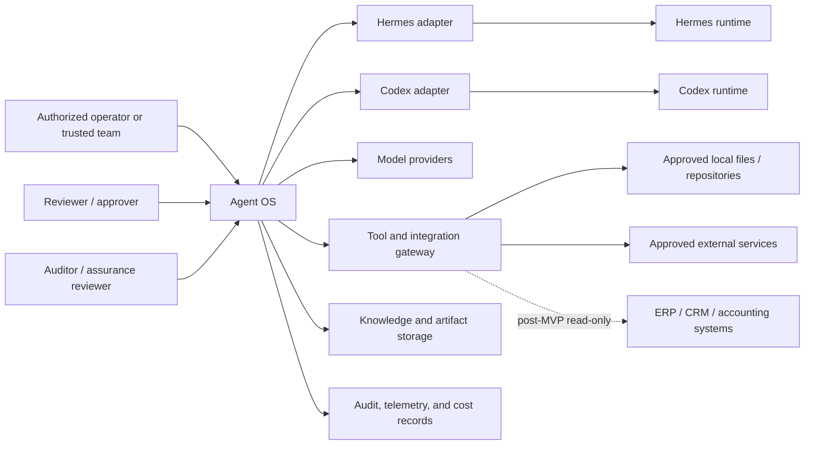

# SCP-001 — Agent OS Scope and System Boundaries

> **Status: Draft.** This document converts the approved product vision into a proposed scope baseline. It does not prove implementation, select final technologies, or authorize production use. Decisions marked **OPEN** require explicit owner approval before this document can advance to version 1.0.0.

## 1. Document purpose

This document defines the proposed product, system, trust, data, operational, and MVP boundaries of Agent OS.

It is intended to:

- prevent uncontrolled scope expansion;
- separate the Agent OS platform from connected agents, providers, tools, and business systems;
- define what the MVP must and must not contain;
- identify trust boundaries and consequential actions;
- establish ownership and source-of-truth rules;
- provide an approved input, once reviewed, to personas, journeys, requirements, architecture, security, testing, and delivery documents.

## 2. Relationship to VSN-001

[VSN-001](VSN-001-product-vision-and-charter.md) is the approved product-vision baseline.

VSN-001 defines Agent OS as a provider-neutral platform for controlling, orchestrating, and governing AI agents, models, tools, workflows, knowledge, and artifacts. This document narrows that vision into implementable scope.

Where this draft conflicts with VSN-001, VSN-001 prevails until the conflict is explicitly resolved.

This document must not:

- broaden the approved vision without review;
- treat a video-demonstrated feature as implemented;
- choose architecture that belongs in SAD-001 or an ADR;
- replace detailed requirements, security controls, or technical contracts.

## 3. Scope decision principles

The following proposed principles govern scope decisions.

1. **Foundation before breadth:** durable state, authorization, audit, and recovery take priority over media generation or numerous integrations.
2. **One complete vertical slice before feature expansion:** prove a task from creation to execution, approval, artifact, trace, and recovery.
3. **Single-agent reliability before agent swarms:** multi-agent collaboration is deferred until one-agent workflows are measurable and dependable.
4. **Real data before decorative dashboards:** every operational status must be backed by persisted state or clearly labeled as unavailable, estimated, or mock.
5. **Least privilege before convenience:** connecting a tool does not authorize its use.
6. **Local-first, not local-only:** the first pilot is local, while contracts and boundaries must allow later production deployment.
7. **Replaceability before provider optimization:** Hermes, Codex, model providers, and tools remain behind explicit interfaces.
8. **Human control before high autonomy:** consequential actions remain blocked unless policy and required approval are satisfied.
9. **Authoritative source separation:** business records stay in their source systems.
10. **Evidence before acceptance:** scope items are accepted only through defined tests and evidence.

## 4. Product boundary summary

Agent OS is in scope as an application-level control plane that coordinates approved AI work across durable workspaces.

The platform boundary includes:

- users, memberships, and workspace-level access;
- registered agents and model profiles;
- tasks, runs, steps, approvals, and artifacts;
- policy-controlled tool access;
- permission-aware memory and knowledge references;
- execution receipts, audit events, usage, and cost attribution;
- a responsive web Mission Control;
- local deployment, backup, and recovery foundations.

The platform boundary does not include:

- the internal implementation of external foundation models;
- replacing Linux, Windows, or macOS;
- becoming the authoritative ERP, CRM, accounting, or banking ledger;
- unrestricted control of the host machine;
- guaranteeing perfect or unlimited memory;
- assuming that MCP connectivity grants authorization;
- broad autonomous operation without bounded policies.

## 5. System context

The diagram is conceptual. It does not approve final APIs, processes, databases, protocols, or deployment units.

## 6. Actors inside the boundary

| Actor | In-scope responsibility | Out-of-scope authority |
|---|---|---|
| Primary operator | Creates workspaces, tasks, bounded runs, and reviews outcomes | Cannot bypass mandatory security policy |
| Workspace administrator | Manages members, budgets, connectors, and workspace policy | Does not automatically receive global-secret access |
| Technical operator | Configures approved adapters, models, and tool connections | Does not silently expand permissions |
| Reviewer / approver | Approves or rejects explicitly scoped consequential actions | Cannot approve actions outside delegated authority |
| Auditor | Reviews permitted logs, receipts, decisions, and evidence | Cannot modify operational records |
| Platform administrator | Operates the local installation and recovery process | Does not own business decisions by default |
| Agent worker identity | Executes bounded work using assigned capabilities | Has no inherent human authority |
| Integration identity | Accesses one approved external capability | Has no broader access than its credential scope |

## 7. External actors and systems

External systems remain outside the Agent OS source-of-truth boundary unless a later approved document states otherwise.

| External actor/system | Relationship |
|---|---|
| Hermes | Replaceable external agent runtime accessed through an adapter |
| Codex | Replaceable external coding agent/runtime accessed through an adapter |
| Model providers | Supply model inference; do not own Agent OS workflow state |
| GitHub and repositories | Authoritative for source history, branches, commits, and pull requests |
| Local filesystem | External resource exposed only through bounded access |
| MCP servers | Capability providers; connection does not equal authorization |
| Identity provider | Potential future authority for authentication; final choice is open |
| Object/file storage | Stores artifacts; final implementation is open |
| ERP/CRM/accounting systems | Future authoritative business-data sources, initially read-only |
| E-mail/calendar/messaging | Future external side-effect systems requiring explicit policy |
| Observability backend | Potential sink for traces and metrics; final implementation is open |

## 8. In-scope platform capabilities

The intended platform capability set includes:

- authenticated access;
- organization-context and workspace management;
- projects within workspaces;
- agent registry and adapter health;
- model profiles and routing foundations;
- tasks, runs, steps, states, retries, cancellation, and resumability;
- approvals and escalations;
- tool, MCP, skill, and integration registry;
- permission evaluation and scoped credentials;
- memory and knowledge records with provenance;
- artifact storage, metadata, retrieval, and preview;
- execution receipts and audit events;
- token, tool, and cost attribution;
- system health and operational status;
- search and navigation across permitted workspaces;
- later extension through versioned adapters and contracts.

Not all capabilities are in the MVP.

## 9. MVP scope

The proposed MVP must implement the following coherent vertical slice.

### 9.1 Access and organization

- authenticated access for a primary operator and, optionally, a small trusted team;
- one organization context;
- multiple isolated workspaces;
- projects within a workspace;
- workspace membership and basic roles.

### 9.2 Agent and model foundation

- agent registry;
- Hermes adapter;
- Codex adapter;
- adapter capability and health reporting;
- provider-neutral model-profile foundation;
- explicit record of the actual provider/model used by a run where available.

### 9.3 Work execution

- task creation;
- run creation;
- run-step persistence;
- explicit run states;
- cancellation;
- bounded retry;
- interruption and resume foundation;
- side-effect classification;
- idempotency or duplicate-effect protection for defined workflows.

### 9.4 Human control

- approval inbox;
- approval request linked to an exact proposed action;
- approve, reject, expire, and cancel states;
- durable approval record;
- enforcement that blocks approval-required actions.

### 9.5 Tools and execution safety foundation

- tool registry;
- basic tool scopes;
- workspace-level permission checks;
- bounded filesystem/repository access;
- no implicit host-wide access;
- execution receipt for every accepted tool action.

### 9.6 Memory, artifacts, and evidence

- permission-aware memory foundation;
- source and provenance metadata;
- artifact metadata and retained files;
- link from artifact to task, run, agent, and source;
- retrieval within the authorized workspace;
- audit events and execution receipts;
- basic trace timeline.

### 9.7 Costs and Mission Control

- token/usage records where providers expose them;
- basic cost attribution to workspace, task, and run;
- Mission Control backed by persisted data;
- clear states for queued, running, waiting, failed, cancelled, completed, stale, and unknown;
- responsive web UI designed toward WCAG 2.2 AA.

### 9.8 Local operations

- supported local single-node deployment;
- controlled configuration;
- secrets excluded from source control;
- basic backup and restore procedure;
- startup, shutdown, health, and recovery documentation.

## 10. Explicit MVP exclusions

The first MVP excludes:

- public multi-tenant SaaS;
- anonymous or public user registration;
- public internet exposure by default;
- production financial posting;
- unrestricted host-machine control;
- autonomous commit, push, pull-request creation, or merge;
- unrestricted external e-mail or messaging;
- production-system administration;
- high-availability or multi-node deployment;
- multi-agent swarms;
- self-modifying skills;
- autonomous permission expansion;
- adapter marketplace;
- predictive profit automation;
- full image/video/voice Studio;
- mobile execution of consequential actions;
- broad ERP, CRM, or accounting integrations;
- unattended long-duration autonomy without explicit limits;
- replacing GitHub, ERP, accounting, CRM, object storage, or identity systems.

## 11. Post-MVP scope

Candidate post-MVP increments include:

- reusable workflows and schedules;
- remote access with approved identity, transport, and exposure controls;
- additional agent and model adapters;
- richer MCP and tool integrations;
- read-only ERP, CRM, accounting, campaign, and analytics connectors;
- business-performance dashboards with source lineage;
- document generation workflows;
- image, video, and voice generation Studio;
- desktop packaging or PWA capabilities;
- advanced evaluations and policy simulation;
- bounded agent-to-agent delegation;
- adapter SDK and governed extension catalogue;
- multi-organization tenancy;
- multi-node and high-availability deployment.

Each increment requires its own approved requirements, security review, and acceptance evidence.

## 12. Permanent non-goals

The project does not intend to:

- build a foundation model;
- replace a desktop operating system;
- claim unlimited or perfect memory;
- grant authority based solely on natural-language instructions;
- make an AI-generated value an accounting fact;
- hide provider, model, tool, cost, or source information where it is available;
- equate visual completion with backend completion;
- provide undetectable or unaudited autonomous actions;
- remove human accountability for consequential decisions.

## 13. Workspace and project boundaries

A workspace is proposed as the principal isolation and organization boundary.

A workspace contains:

- members and roles;
- projects;
- registered agent availability;
- model and budget policy;
- tasks, runs, and approvals;
- tool connections and scopes;
- memory and knowledge records;
- artifacts;
- costs and audit views.

A project is a work-organizing entity inside one workspace. It may reference repositories, folders, documents, and goals, but it does not override workspace permissions.

Default rules:

- data does not cross workspaces;
- search and memory retrieval are workspace-scoped;
- artifacts inherit workspace access unless a stricter policy applies;
- tool credentials are not shared between workspaces without explicit configuration;
- cross-workspace delegation is excluded from the MVP.

## 14. Organization and tenancy boundary

### MVP proposal

- one organization context;
- one primary operator or a small trusted team;
- multiple isolated workspaces;
- no public tenant onboarding;
- no billing or entitlement system for external customers.

### Design constraint

Core records should carry an organization and workspace association where appropriate so that a future multi-organization model does not require redefining the domain.

### OPEN decision

The final tenancy model is deferred to PRD-001, SAD-001, DAT-001, IAM-001, and SEC-001.

## 15. User and role boundary

The MVP requires a small role set.

| Proposed role | Minimum capability |
|---|---|
| Platform administrator | Operate local installation and global configuration |
| Workspace owner | Manage one workspace, members, budgets, and policy |
| Operator | Create tasks and inspect permitted results |
| Approver | Review designated consequential actions |
| Auditor | Read permitted execution and approval evidence |

The following are out of scope for the first MVP:

- complex enterprise role hierarchies;
- customer-managed custom-role builders;
- external customer billing roles;
- anonymous guest access;
- implicit permission inheritance from chat content.

Detailed RBAC/ABAC design belongs in IAM-001 and POL-001.

## 16. Agent boundary

An agent is an external or internal execution capability registered through a versioned adapter.

Agent OS owns:

- the agent registration;
- declared capabilities;
- permissions and policy context;
- task/run state;
- approval state;
- platform audit and receipts;
- artifact references;
- platform-side cancellation intent.

The adapter or agent runtime owns:

- runtime-specific sessions;
- provider-specific requests;
- runtime-specific tool behavior;
- runtime-specific error details;
- supported cancellation and resume semantics.

The MVP supports Hermes and Codex as the first adapter targets. Their exact integration method is **OPEN** and must be confirmed through AGC-001 and adapter specifications.

An agent cannot:

- approve its own consequential action;
- modify its registered permissions;
- silently switch to an unapproved provider;
- claim completion without platform-recorded evidence;
- access another workspace by inference or prompt.

## 17. Model and provider boundary

Agent OS does not build or host a foundation model in the MVP.

Agent OS owns:

- model profiles;
- policy and budget constraints;
- permitted provider list;
- routing request and result record;
- provider/model attribution where available;
- fallback policy once approved.

Providers own:

- model inference;
- provider availability;
- provider billing records;
- provider data-processing terms;
- model-specific capabilities and limitations.

Direct provider selection may be available to authorized users, but core workflows should not depend on a hard-coded provider-specific model name.

Final gateway, routing, fallback, and provider-account design is deferred to SAD-001, INT-001, MOD-001, SEC-001, and ADRs.

## 18. Tool, MCP, and integration boundary

Tools, MCP servers, skills, and plugins expose capabilities; they do not grant permission.

Agent OS must evaluate:

- user and workload identity;
- workspace;
- requested capability;
- resource scope;
- data classification;
- side-effect class;
- network destination;
- credential scope;
- budget;
- required approval;
- expiry and revocation state.

MVP tool scope should be restricted to a minimal approved set needed for the initial vertical slice.

The following are not approved merely by installing or connecting a server:

- filesystem write;
- command execution;
- package installation;
- e-mail sending;
- Git commit/push/merge;
- production access;
- database mutation;
- secret retrieval;
- public content publication.

MCP is a candidate integration mechanism, not a final authorization architecture.

## 19. Memory and knowledge boundary

Memory is a governed collection of records, not an unlimited transcript.

The MVP memory foundation includes:

- workspace scope;
- source reference;
- record type;
- creation time;
- creator or producing run;
- confidence or verification status where applicable;
- retention state;
- correction and deletion path;
- retrieval audit where practical.

Memory classes may include:

- approved project facts;
- document references;
- run summaries;
- user-approved preferences;
- temporary working context;
- generated hypotheses clearly labeled as such.

The MVP excludes:

- automatic promotion of all agent outputs to authoritative memory;
- indefinite retention by default;
- hidden cross-workspace retrieval;
- provider-side memory treated as the sole source of truth;
- “perfect memory” claims.

MEM-001 and DAT-002 will define detailed lifecycle and data-class rules.

## 20. Artifact and media boundary

An artifact is a retained input or output linked to its producing context.

MVP artifacts may include:

- text reports;
- Markdown documents;
- code patches;
- test logs;
- structured JSON results;
- small permitted images or files where safe preview is supported.

Each retained artifact should record:

- workspace and project;
- task and run;
- producing agent/adapter;
- source or prompt reference where policy permits;
- media type;
- size and integrity metadata;
- version or derivative relationship;
- lifecycle and retention state;
- access classification.

Full image, video, and voice generation workflows are post-MVP.

Object-storage technology and preview implementation are **OPEN** architecture decisions.

## 21. Data classification boundary

The following provisional classes are proposed.

| Class | Example | MVP treatment |
|---|---|---|
| Public | Public documentation and open-source repository data | Permitted subject to tool policy |
| Internal | Project plans, requirements, non-public code | Permitted only inside authorized workspaces |
| Confidential | Client material, commercial data, private repositories | Restricted; provider and tool handling must be approved |
| Secret | API keys, passwords, private keys, tokens | Must not enter prompts, memory, artifacts, or logs as ordinary content |
| Regulated/sensitive | Personal, financial, health, or legally restricted data | Excluded unless a later approved policy explicitly permits it |

Final classification, retention, residency, and provider-processing rules belong in DAT-002, PRI-001, SEC-001, and NFR-001.

## 22. Business-system and financial-data boundary

ERP, CRM, accounting, payment, banking, and other operational systems remain authoritative for their records.

The MVP does not:

- post accounting entries;
- modify customer or financial records;
- calculate an official profit ledger;
- reconcile bank accounts;
- execute payments;
- make generated forecasts authoritative.

Future connectors should start read-only and expose:

- source system;
- metric definition;
- period;
- freshness;
- reconciliation state;
- missing-data state;
- generated-analysis label.

AI commentary, forecasts, classifications, and recommendations must remain visibly separate from source facts.

## 23. Execution and sandbox boundary

Agent and tool execution must not assume unrestricted host access.

The proposed MVP boundary requires:

- isolated or bounded execution context;
- explicit mounted paths;
- denied access outside approved workspace resources;
- network restrictions or explicit destinations;
- resource and runtime limits;
- command/event logging;
- cancellation capability where technically supported;
- no host Docker socket exposure by default;
- no production credentials;
- cleanup and recovery behavior.

The exact sandbox technology is **OPEN** and belongs in SAD-001, SAN-001, SEC-001, and an ADR.

## 24. Human approval boundary

An approval is required when policy classifies a proposed action as consequential.

Candidate mandatory-approval actions:

- creating a Git commit;
- pushing a branch;
- creating a pull request;
- merging;
- deleting project data;
- sending external e-mail or messages;
- accessing a production system;
- requesting or using a secret;
- modifying financial or business records;
- destructive database operations;
- publishing externally visible content;
- installing packages or executable plugins;
- expanding filesystem, tool, model, or network permissions;
- running a command outside a pre-approved reversible set.

Approval must be:

- linked to the exact action and parameters;
- attributable to an authorized approver;
- recorded durably;
- limited in scope;
- rejected when expired or materially changed;
- revocable before execution where possible.

AUT-001 and APR-001 own the definitive matrix and state model.

## 25. Autonomy boundary

The MVP supports bounded autonomy, not open-ended independence.

Each run should be limited by:

- task scope;
- workspace;
- allowed agents/models;
- tool capabilities;
- data classes;
- time;
- cost;
- step or retry count;
- network scope;
- approval requirements;
- stop conditions.

Permitted autonomy may include:

- read-only inspection of approved resources;
- deterministic validation;
- artifact drafting;
- tests inside an approved sandbox;
- retry of explicitly retryable, side-effect-safe steps.

Excluded autonomy includes:

- self-authorizing a new capability;
- self-modifying security policy;
- autonomous merge or external publication;
- indefinite operation;
- uncontrolled agent replication;
- silently increasing budget or runtime;
- changing the source-of-truth system.

## 26. Audit and observability boundary

Agent OS is responsible for platform-side audit and execution evidence.

MVP records should identify, where applicable:

- user/workload identity;
- organization, workspace, project, task, run, and step;
- agent and adapter version;
- model/provider used;
- tool capability invoked;
- policy decision;
- approval decision;
- start/end time and state;
- artifact references;
- token/tool usage and attributed cost;
- error and retry information;
- known side effects.

Agent OS does not guarantee complete visibility into undocumented provider-internal processing.

Mission Control must distinguish:

- persisted fact;
- provider-reported status;
- derived estimate;
- stale data;
- unavailable data;
- failed collection.

## 27. Deployment boundary

### MVP deployment

- local single-node installation;
- Linux/WSL development and pilot environment;
- no public exposure by default;
- locally controlled configuration;
- documented startup, backup, restore, and recovery;
- no high-availability commitment.

### Later deployment candidates

- remote trusted-team access;
- managed database or object storage;
- distributed workers;
- regional and data-residency controls;
- high availability;
- managed identity and secrets;
- multi-organization SaaS.

Final packaging, containers, networking, and supported operating systems are **OPEN**.

## 28. Local pilot boundary

The proposed pilot includes:

- one primary operator or a small trusted team;
- one organization context;
- at least two representative workspaces;
- Hermes and Codex adapter experiments;
- non-production projects and test datasets;
- no production financial action;
- no unattended external communication;
- no public internet exposure;
- explicit recovery exercises;
- measured acceptance evidence.

Representative pilot tasks should include:

1. inspect an approved project;
2. create and run a bounded task;
3. pause for approval;
4. resume after approval;
5. generate and retrieve an artifact;
6. inspect trace and cost;
7. recover from an interrupted run;
8. verify workspace isolation.

Pilot users and projects remain **OPEN** for PER-001 and UCD-001.

## 29. Remote-access boundary

Remote access is excluded from the default MVP deployment.

A later remote-access increment requires:

- approved authentication;
- encrypted transport;
- exposure and firewall design;
- rate limiting;
- session policy;
- audit;
- secrets strategy;
- threat-model update;
- backup and incident procedures;
- explicit decision on whether the system is trusted-team or multi-organization.

A private tunnel or reverse proxy is not automatically considered production-safe.

## 30. Trust boundaries

The principal trust boundaries are:

1. user browser ↔ Agent OS application;
2. authenticated user ↔ workspace authorization;
3. control plane ↔ agent adapter;
4. agent adapter ↔ external agent runtime;
5. control plane ↔ model provider;
6. orchestrator ↔ tool/execution environment;
7. tool gateway ↔ filesystem/repository;
8. Agent OS ↔ MCP server or external integration;
9. application ↔ secrets mechanism;
10. application ↔ data and artifact storage;
11. Agent OS ↔ ERP/CRM/accounting read model;
12. operator ↔ approval authority;
13. one workspace ↔ another workspace;
14. local deployment ↔ external network.

Each boundary requires authentication, authorization, input/output validation, error handling, and auditable evidence appropriate to its risk.

## 31. Data flows crossing boundaries

| Flow | Direction | Required control |
|---|---|---|
| User instruction | Browser → Agent OS | Authentication, authorization, input limits |
| Agent request | Agent OS → Adapter/runtime | Capability and budget policy |
| Model prompt/context | Agent OS/agent → Provider | Data-class and provider-policy check |
| Tool request | Agent/runtime → Tool gateway | Side-effect classification and approval |
| File access | Tool gateway ↔ Workspace resource | Path scope and sandbox |
| Artifact output | Runtime/tool → Artifact store | Validation, metadata, provenance, malware/safe-preview controls as applicable |
| Memory write | Run/user → Memory store | Source, scope, classification, retention |
| Memory retrieval | Memory store → Run/user | Workspace ACL and retrieval evidence |
| Approval decision | Approver → Orchestrator | Identity, delegated authority, exact-action binding |
| Audit event | Platform components → Audit store | Integrity, correlation, retention |
| Usage/cost record | Provider/tool → Cost ledger | Attribution and reconciliation |
| Business metric | Source system → Read model | Read-only access, freshness, lineage |

## 32. Ownership and source-of-truth rules

| Subject | Proposed source of truth |
|---|---|
| Product vision | Approved VSN-001 |
| Product scope | Approved SCP-001 |
| Requirements | Approved PRD/SRS/NFR and machine-readable contracts |
| Architecture decisions | Approved ADRs and SAD-001 |
| Git history | Connected Git repository |
| Agent OS task/run state | Agent OS control-plane datastore |
| Approval record | Agent OS approval/audit record |
| Provider billing | Provider records, reconciled with Agent OS attribution |
| Business transactions | ERP/accounting/CRM/source system |
| Secrets | Approved secrets mechanism |
| Artifact binary | Approved artifact store |
| Artifact metadata | Agent OS datastore |
| Memory record | Agent OS memory/knowledge store with provenance |
| User identity | Approved identity authority |
| Video-inspired features | Research evidence only, not product authority |

## 33. Assumptions

This draft assumes:

- the first pilot is local and non-production;
- Hermes and Codex are the first adapter targets;
- a workspace is the primary isolation boundary;
- users prioritize continuity, approval, evidence, artifacts, and cost visibility;
- a small trusted team can operate before enterprise tenancy is needed;
- provider APIs permit sufficient usage and attribution;
- agent runtimes expose enough state for bounded execution or transparent limitations;
- a safe local execution boundary can be implemented;
- named product, architecture, security, UX, quality, and operations reviewers will be assigned.

Each assumption must be confirmed, rejected, or assigned to a downstream document.

## 34. Constraints

- the approved VSN-001 remains authoritative;
- application implementation must not begin from video UI alone;
- repository changes follow Git review and explicit approval;
- secrets and local evidence remain outside source control;
- the MVP must remain small enough to demonstrate two adapters and one complete governed workflow;
- architecture and protocol choices require later review;
- no production or financial side effect is authorized by this document;
- the system must not silently rely on mock data in accepted workflows;
- accessibility is a first-order requirement;
- local-first operation still requires backup, authorization, and recovery.

## 35. Dependencies

This document depends on:

- DOC-000;
- GLO-001;
- approved VSN-001;
- VIDEO-001 through VIDEO-004 as research evidence.

Downstream dependencies include:

- PER-001 and UCD-001;
- PRD-001, SRS-001, and NFR-001;
- AUT-001;
- SAD-001, C4-001, and C4-002;
- DDD-001 and DAT-001;
- MEM-001 and ORC-001;
- SEC-001, THR-001, IAM-001, and SAN-001;
- AGC-001, RUN-001, APR-001, and ART-001;
- TST-001, QAG-001, and RTM-001.

## 36. Risks of scope expansion

| Risk | Trigger | Boundary response |
|---|---|---|
| Dashboard-first development | Attractive screens are prioritized over persistence | Require real-state contracts and vertical-slice evidence |
| Integration sprawl | Many agents/tools are requested early | Limit MVP to Hermes, Codex, and minimum tools |
| Autonomy escalation | “Goal Mode” becomes a core requirement | Keep long-running high autonomy post-MVP |
| Media distraction | Studio becomes an MVP priority | Defer full image/video/voice workflows |
| Premature SaaS | Multi-tenant billing and public onboarding are added | Keep first pilot one organization/trusted team |
| Security postponement | Tool execution is implemented before policy/sandbox | Block until AUT/SEC/THR/SAN baselines |
| Business-data overreach | Profit dashboards are requested early | Keep source systems authoritative and connectors read-only |
| Architecture overengineering | High availability and microservices begin before evidence | Local single-node first |
| Protocol lock-in | MCP/A2A/AG-UI are adopted without fit analysis | Treat as candidates until ADR approval |
| Documentation drift | Scope changes without linked updates | Require register, traceability, and version updates |

## 37. Open decisions

| Decision | Current state | Owning document(s) |
|---|---|---|
| Named review owners | OPEN | DOC-000, project governance |
| Pilot users and projects | OPEN | PER-001, UCD-001 |
| Single-user vs trusted-team detail | OPEN | PRD-001, IAM-001 |
| Future commercial model | OPEN | PRD-001 / business planning |
| Hermes integration mode | OPEN | AGC-001, ADP-HER-001 |
| Codex integration mode | OPEN | AGC-001, ADP-CDX-001 |
| Required protocols | OPEN | SAD-001, INT-001, ADRs |
| Database and object storage | OPEN | SAD-001, DAT-001, ADRs |
| Workflow/orchestration engine | OPEN | ORC-001, ADR |
| Sandbox technology | OPEN | SAN-001, SAD-001, ADR |
| Identity mechanism | OPEN | IAM-001, SAD-001 |
| Secrets mechanism | OPEN | SEC-002, SAD-001 |
| Remote access | OPEN / post-MVP candidate | SEC-001, DEP-001 |
| Final data classes and retention | OPEN | DAT-002, PRI-001 |
| Final approval-action matrix | OPEN | AUT-001 |
| Final success thresholds | OPEN | NFR-001, TST-001 |
| Budget, staffing, and delivery schedule | OPEN | Roadmap and delivery plan |

## 38. Scope acceptance criteria

SCP-001 may advance to version 1.0.0 when:

1. the Product Owner approves the MVP inclusions and exclusions;
2. Architecture confirms that the boundaries are implementable without selecting premature technologies;
3. Security accepts the provisional trust, data, tool, and approval boundaries for requirements work;
4. Hermes and Codex remain accepted as the first adapter targets or replacements are recorded;
5. the pilot tenancy and access model are explicitly selected;
6. consequential-action candidates are accepted as inputs to AUT-001;
7. business and financial source-of-truth rules are accepted;
8. every open decision has an owning downstream document;
9. internal links, metadata, register status, and document validation pass;
10. no statement claims functionality is already implemented.

Approval does not authorize production use or sensitive actions.

## 39. Downstream document impact

Once approved, this document constrains:

- `PER-001`: personas must reflect the local pilot and trusted-team boundary;
- `UCD-001`: journeys must include approval, recovery, artifact, and audit flows;
- `PRD-001`: requirements must remain inside the MVP boundary;
- `SRS-001`: functional requirements must identify scope and failure behavior;
- `NFR-001`: quality targets must include isolation, recovery, traceability, and accessibility;
- `AUT-001`: consequential actions and autonomy limits must be formalized;
- `SAD-001`: architecture must preserve replaceability and trust boundaries;
- `DAT-001` and `MEM-001`: workspace isolation, provenance, and source separation must be implemented;
- `SEC-001` and `THR-001`: all identified trust boundaries must be assessed;
- `AGC-001`: adapters must not own control-plane authority;
- `TST-001`: tests must prove persistence, policy enforcement, isolation, recovery, and no hidden mock dependency.

Any downstream proposal outside this scope requires a controlled scope change.

## 40. Revision and approval history

### Approval state

- Current status: `draft`
- Current version: `0.1.0`
- Approved by: no one
- Approval date: not applicable
- Required next action: Product Owner, Architecture, and Security review

### Revision history

| Version | Date | Status | Summary | Authority |
|---|---|---|---|---|
| 0.1.0 | 2026-07-18 | Draft | Initial scope and system-boundary baseline derived from approved VSN-001 and video-audit research | Draft authoring; not approved |

## References

- [DOC-000 — Documentation Governance](../00-governance/DOC-000-documentation-governance.md)
- [GLO-001 — Glossary](../00-governance/GLO-001-glossary.md)
- [VSN-001 — Product Vision and Project Charter](VSN-001-product-vision-and-charter.md)
- [VIDEO-001 — Video Inventory and Methodology](../research/agent-os-video-audit/VIDEO-001-video-inventory-and-methodology.md)
- [VIDEO-002 — UI/UX Evidence Audit](../research/agent-os-video-audit/VIDEO-002-ui-ux-evidence-audit.md)
- [VIDEO-003 — Capability and Opportunity Brief](../research/agent-os-video-audit/VIDEO-003-agent-os-capability-opportunity-brief.md)
- [VIDEO-004 — Architecture and Documentation Impact](../research/agent-os-video-audit/VIDEO-004-architecture-and-documentation-impact.md)
- [Video evidence index](../research/agent-os-video-audit/video-evidence-index.csv)
