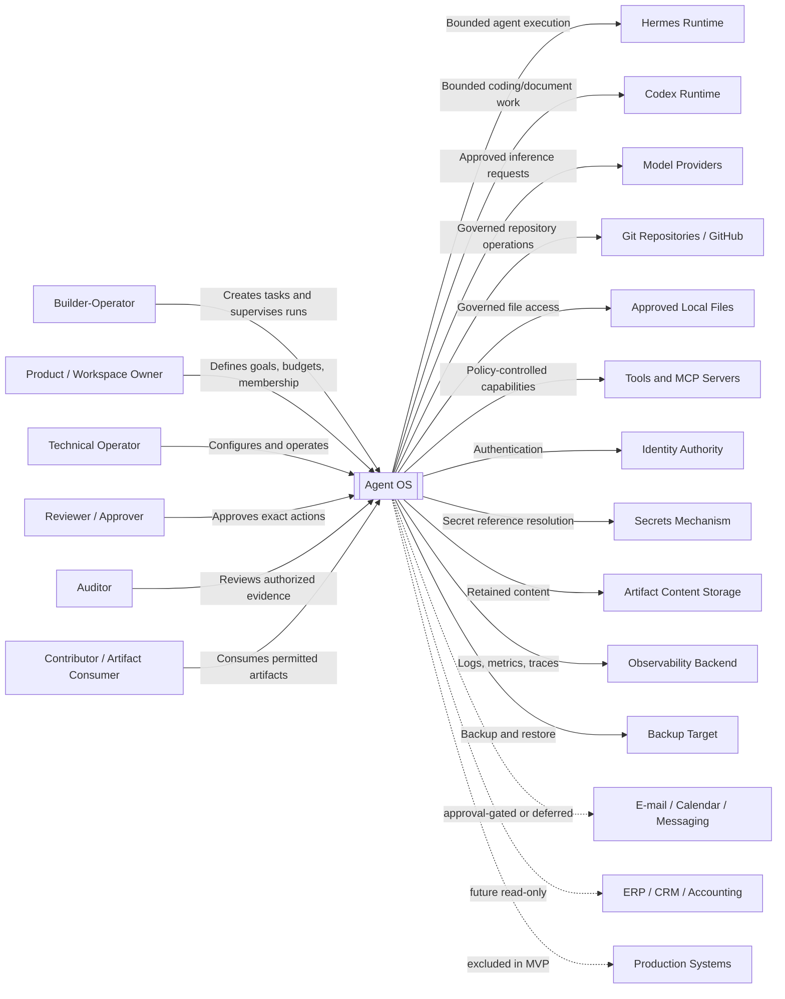
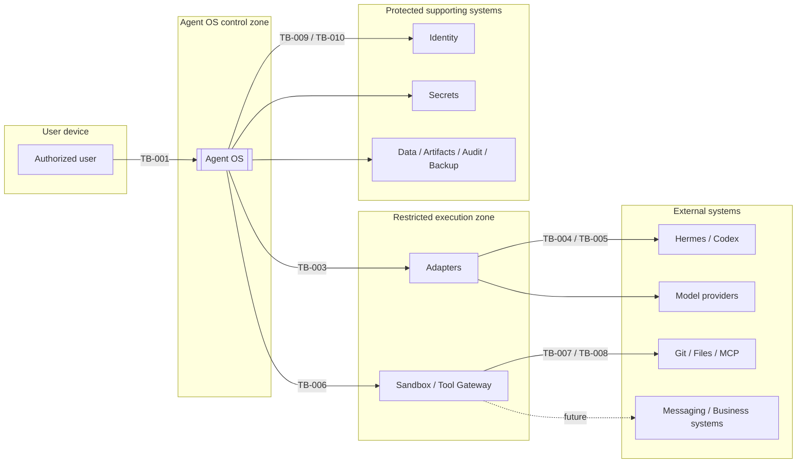

# C4-001 — Agent OS System Context Diagram

> **Status: Approved context baseline — 2026-08-13.** This document defines the approved C4 Level 1 system context for Agent OS. It identifies people, external systems, trust boundaries, relationships, exchanged information, authority ownership, and MVP scope. It does not prove implementation or authorize production use.

## 1. Purpose

This document provides a high-level, technology-neutral view of Agent OS in its environment.

It answers:

- who uses Agent OS;
- which external systems it interacts with;
- which responsibilities belong to Agent OS;
- which responsibilities remain external;
- what information crosses each boundary;
- which relationships are part of the MVP;
- where the main trust boundaries are;
- which system remains authoritative for each category of information.

Internal containers and processes belong in `C4-002`.

## 2. System of interest

### `SYS-001 — Agent OS`

Agent OS is a provider-neutral control, orchestration, and governance platform for operating approved AI agents, models, tools, workflows, knowledge, and artifacts through durable workspaces.

Agent OS owns platform-level state for:

- organizations, workspaces, projects, memberships, and roles;
- registered agents, adapters, models, tools, and capabilities;
- tasks, task snapshots, runs, steps, attempts, and checkpoints;
- policy decisions, permission grants, approvals, and revocations;
- memory metadata and governed retrieval;
- artifact metadata, lifecycle, and provenance;
- audit events, execution receipts, usage, and cost attribution;
- local health, backup metadata, and recovery evidence.

Agent OS does not own:

- Hermes or Codex runtime internals;
- foundation-model implementation;
- Git history;
- provider billing;
- authoritative ERP, CRM, accounting, or banking records;
- external identity-provider internals;
- secret values;
- the host operating system;
- production systems outside a later approved integration.

## 3. System boundary

The Agent OS boundary includes:

```text
Mission Control
Application and API
Identity and workspace authorization
Task and run orchestration
Policy and approvals
Agent/model/tool registries
Memory and artifacts
Audit and execution receipts
Usage and cost attribution
Health, backup, and recovery coordination
```

The boundary excludes all external runtimes, providers, repositories, tools, identity services, secret stores, and authoritative business systems.

## 4. C4 Level 1 context diagram



## 5. Human actors

| Actor ID | Actor | Primary responsibilities | Explicit limitations |
|---|---|---|---|
| `ACTOR-001` | Builder-Operator | Defines bounded tasks, starts and supervises runs, reviews outputs | Cannot bypass policy or self-expand permissions |
| `ACTOR-002` | Product / Workspace Owner | Owns workspace goals, budget, membership, acceptance | Cannot override global security or source-system authority |
| `ACTOR-003` | Technical Operator | Installs, configures, monitors, backs up, restores | Does not automatically read all workspace content |
| `ACTOR-004` | Reviewer / Approver | Approves, rejects, revises exact consequential actions | Acts only within delegated authority |
| `ACTOR-005` | Auditor | Reconstructs authorized events and evidence | Read-only by default |
| `ACTOR-006` | Contributor / Artifact Consumer | Reviews and reuses permitted outputs | Cannot configure high-risk capabilities |

## 6. External system catalogue

| ID | External system | Purpose | MVP position |
|---|---|---|---|
| `EXT-001` | Hermes Runtime | External agent execution | In scope |
| `EXT-002` | Codex Runtime | Coding and document execution | In scope |
| `EXT-003` | Model Providers | Model inference and provider usage | Selected profiles |
| `EXT-004` | Git Repositories / GitHub | Authoritative source history | Bounded non-production use |
| `EXT-005` | Approved Local Files | Workspace project resources | Bounded access |
| `EXT-006` | Tools and MCP Servers | External capabilities | Minimal approved set |
| `EXT-007` | Identity Authority | Credential verification | In scope; choice open |
| `EXT-008` | Secrets Mechanism | Protected credential storage | In scope; choice open |
| `EXT-009` | Artifact Content Storage | Retained artifact content | In scope |
| `EXT-010` | Observability Backend | Logs, metrics, traces | In scope; may be local |
| `EXT-011` | Backup Target | Protected backup storage | In scope |
| `EXT-012` | E-mail / Messaging | External communication | Drafting allowed; sending gated/deferred |
| `EXT-013` | Calendar | Availability and event actions | Limited/deferred |
| `EXT-014` | ERP / CRM / Accounting | Authoritative business data | Post-MVP, read-only first |
| `EXT-015` | Production Systems | Production environment and data | Excluded |
| `EXT-016` | Public Internet Users | Anonymous/public use | Excluded |

## 7. Hermes relationship

Agent OS sends Hermes:

- stable run and correlation identifiers;
- bounded task context;
- permitted resources;
- model and tool constraints;
- time, step, retry, and cost limits;
- cancellation or status requests;
- approval references where technically supported.

Agent OS receives:

- capability and version information;
- acknowledgement and run status;
- events or polling results;
- outputs and artifact candidates;
- errors;
- cancellation or resume support information;
- usage information where available.

Hermes does not own Agent OS workspace policy, task/run authority, approval state, or platform audit.

The exact integration belongs in `AGC-001` and `ADP-HER-001`.

## 8. Codex relationship

Agent OS sends Codex:

- bounded project or worktree context;
- task and run identifiers;
- approved paths;
- model and tool limits;
- Git action policy;
- approval references for consequential actions;
- cancellation or status requests.

Agent OS receives:

- status and events;
- patches, documents, tests, and build outputs;
- proposed Git actions;
- errors and artifact candidates;
- provider/model and usage details where available.

Codex may prepare changes but cannot autonomously merge, force push, expand permissions, or bypass approval policy.

The exact integration belongs in `AGC-001` and `ADP-CDX-001`.

## 9. Model-provider relationship

Agent OS or an approved runtime sends:

- permitted prompt and context;
- logical model-profile selection;
- data-class and budget constraints where supported.

Agent OS receives:

- output;
- provider/model identity;
- usage and latency;
- quota, safety, and error responses.

Boundary rules:

- provider billing is authoritative for provider charges;
- Agent OS is authoritative for platform attribution and policy context;
- configured profile does not prove actual model use;
- model output is generated content, not authoritative business fact;
- fallback cannot occur silently.

## 10. Git relationship

Git or GitHub remains authoritative for repository history.

MVP actions under guards:

- inspect status, log, branches, and diff;
- read approved repository content;
- prepare an uncommitted patch;
- run approved tests.

Approval-gated candidates:

- create commit;
- push branch;
- create pull request.

Excluded:

- autonomous merge;
- force push;
- history rewrite;
- protected-branch deletion;
- bypass of review or CI.

Agent OS retains the task, approval, execution, and evidence context surrounding Git actions.

## 11. Local-file relationship

Local file access requires:

- explicit workspace mounts;
- read/write separation;
- path normalization;
- path-traversal and symlink-escape protection;
- no unrestricted host or home-directory access;
- no secret-file discovery by default;
- attributable writes;
- approval for deletion or broader scope.

The filesystem is a resource, not the authorization authority.

## 12. Tools and MCP relationship

A tool or MCP server exposes capability but grants no authority.

Before invocation, Agent OS must evaluate:

- requester identity and type;
- organization and workspace;
- capability;
- normalized target and parameters;
- resource and path scope;
- data classification;
- network destination;
- side-effect class;
- budget and time limits;
- approval;
- grant expiry and revocation.

Tool responses and tool-supplied instructions are untrusted input.

## 13. Identity relationship

The identity authority may provide:

- credential verification;
- identity identifier;
- authentication factors;
- account state.

Agent OS still owns:

- application sessions;
- organization and workspace membership;
- role assignment;
- effective permission;
- approval authority;
- workload identity type;
- authorization decisions.

External authentication never replaces workspace authorization.

## 14. Secrets relationship

The secret mechanism stores protected values.

Agent OS stores only:

- a reference;
- owner and purpose;
- capability/workspace scope;
- expiry and rotation metadata;
- usage evidence without the value.

Raw secrets must not be copied into:

- prompts;
- tasks;
- memory;
- artifacts;
- logs;
- audit events;
- source control;
- ordinary UI state.

## 15. Artifact-storage relationship

The artifact store retains content. Agent OS remains authoritative for metadata, provenance, access, integrity status, and lifecycle.

Agent OS must distinguish:

- available;
- missing;
- partial;
- integrity mismatch;
- preview unavailable;
- superseded;
- archived;
- deleted.

Metadata alone does not prove content availability or integrity.

## 16. Observability relationship

The observability subsystem supports diagnosis and operations.

Audit supports accountability and retained evidence.

They may share event sources, but:

- retention may differ;
- audit integrity requirements are stronger;
- ordinary logs must not be the only evidence;
- neither may expose raw secrets;
- observability failure must create an explicit telemetry gap.

## 17. Backup relationship

A backup may contain:

- transactional state;
- durable event/job state;
- audit evidence;
- memory metadata/content and rebuild inputs;
- artifact metadata/content;
- configuration metadata;
- schema and build manifest.

Boundary rules:

- backup destinations are privileged;
- integrity checks and a manifest are required;
- sensitive backup data requires protection;
- restore requires explicit authorization;
- partial backup or restore is never presented as complete.

## 18. Messaging and calendar relationships

Drafting an e-mail, message, or event proposal may be permitted.

Sending, publishing, inviting, or modifying an external system requires exact approval or remains deferred.

Approval must cover:

- sender/calendar identity;
- recipients or attendees;
- subject/title;
- exact content;
- attachments;
- time and time zone;
- recurrence;
- destination;
- classification;
- expiry.

Changing recipients, content, or target invalidates approval.

## 19. Business-system relationship

ERP, CRM, accounting, and banking systems remain authoritative.

The MVP does not modify them.

Future read-only relationships must preserve:

- source system;
- record or metric definition;
- period;
- freshness;
- reconciliation state;
- access owner;
- generated-analysis label.

Model-generated interpretation must remain separate from source facts.

## 20. Production-system relationship

Production access is excluded from the MVP.

The ordinary pilot must not hold or use production credentials.

Future production access requires:

- scope revision;
- updated threat model;
- stronger identity assurance;
- independent approval;
- production-specific sandbox and network controls;
- incident and break-glass procedures;
- deployment, rollback, and acceptance evidence.

## 21. Relationship catalogue

| ID | Source | Destination | Relationship | MVP |
|---|---|---|---|---|
| `REL-001` | Builder-Operator | Agent OS | Tasks, runs, reviews | Yes |
| `REL-002` | Workspace Owner | Agent OS | Membership, budget, policy | Yes |
| `REL-003` | Technical Operator | Agent OS | Configuration and operations | Yes |
| `REL-004` | Approver | Agent OS | Exact approval decisions | Yes |
| `REL-005` | Auditor | Agent OS | Evidence review/export | Yes |
| `REL-006` | Contributor | Agent OS | Artifact consumption | Yes |
| `REL-007` | Agent OS | Hermes | Bounded execution | Yes |
| `REL-008` | Agent OS | Codex | Bounded coding/document work | Yes |
| `REL-009` | Agent OS | Model Provider | Approved inference | Yes |
| `REL-010` | Agent OS | Git | Governed repository action | Bounded |
| `REL-011` | Agent OS | Local Files | Governed read/write | Bounded |
| `REL-012` | Agent OS | Tool/MCP | Policy-controlled capability | Minimal set |
| `REL-013` | Agent OS | Identity Authority | Authentication | Yes |
| `REL-014` | Agent OS | Secrets Mechanism | Secret resolution | Yes |
| `REL-015` | Agent OS | Artifact Store | Content storage/retrieval | Yes |
| `REL-016` | Agent OS | Observability | Operational telemetry | Yes |
| `REL-017` | Agent OS | Backup Target | Backup/restore | Yes |
| `REL-018` | Agent OS | Messaging | Draft/send | Draft yes; send gated/deferred |
| `REL-019` | Agent OS | Calendar | Availability/event actions | Limited/deferred |
| `REL-020` | Agent OS | Business Systems | Read-only data | Post-MVP |
| `REL-021` | Agent OS | Production | Production action | No |
| `REL-022` | Public user | Agent OS | Anonymous/public access | No |

## 22. Source-of-truth matrix

| Information | Authoritative system |
|---|---|
| Product vision | Approved `VSN-001` |
| Product scope | Approved `SCP-001` |
| Agent OS tasks and runs | Agent OS |
| Workspace membership and roles | Agent OS |
| Credential verification | Configured identity authority |
| Approval decision | Agent OS approval record |
| Git history | Git repository / GitHub |
| Runtime-specific session | Hermes or Codex |
| Provider response | Provider/runtime response record |
| Provider billing | Provider billing records |
| Platform cost attribution | Agent OS |
| Business transaction | External business source |
| Artifact metadata | Agent OS |
| Artifact content | Configured artifact store |
| Memory governance metadata | Agent OS |
| Secret value | Approved secret mechanism |
| Audit evidence | Agent OS audit evidence store |
| Operational telemetry | Observability subsystem |
| Backup manifest | Agent OS backup process |
| Backup binary | Backup target |

## 23. Trust boundary diagram



## 24. Trust boundary register

| ID | Boundary | Principal risks | Downstream owner |
|---|---|---|---|
| `TB-001` | Browser ↔ Agent OS | Session theft, injection, leakage | `SEC-001`, `THR-001` |
| `TB-002` | Identity ↔ workspace scope | Privilege escalation | `IAM-001` |
| `TB-003` | Control plane ↔ adapter | Forged events, authority confusion | `AGC-001` |
| `TB-004` | Adapter ↔ runtime | Hidden tools/effects, compromise | Adapter specs |
| `TB-005` | Runtime ↔ model provider | Leakage, substitution, cost ambiguity | `INT-001`, `SEC-001` |
| `TB-006` | Orchestrator ↔ sandbox | Escape, resource exhaustion | `SAN-001` |
| `TB-007` | Sandbox ↔ files/Git | Traversal, destructive writes | `SAN-001`, `SEC-001` |
| `TB-008` | Tool Gateway ↔ MCP/tool | Malicious server, exfiltration | `INT-001`, `THR-001` |
| `TB-009` | Agent OS ↔ secrets | Disclosure or misuse | `SEC-002` |
| `TB-010` | Agent OS ↔ stores | Tampering, loss, wrong scope | `DAT-001`, `SEC-001` |
| `TB-011` | Workspace A ↔ Workspace B | Metadata/content leakage | `IAM-001`, `DAT-001` |
| `TB-012` | Local host ↔ network | Exfiltration, public exposure | `DEP-001`, `SEC-001` |
| `TB-013` | Agent OS ↔ business system | Source corruption, privacy | Future connector specs |
| `TB-014` | Requester ↔ approver | Self-approval, replay | `AUT-001`, `APR-001` |
| `TB-015` | Audit writer ↔ reader/exporter | Tampering, excessive disclosure | `AUD-001`, `SEC-001` |

## 25. Data-flow classification

| Class | Examples | Required treatment |
|---|---|---|
| Public | Public docs and repository metadata | Normal policy and provenance |
| Internal | Tasks, run metadata, non-public code | Workspace authorization |
| Confidential | Private repositories and client material | Restricted provider/tool handling |
| Secret | Keys, tokens, passwords | Reference-only |
| Regulated/sensitive | Personal, financial, health data | Excluded unless later approved |

Every external data flow must identify:

- purpose;
- source;
- destination;
- workspace;
- classification;
- minimization;
- policy decision;
- approval where applicable;
- receipt and retention.

## 26. Primary context journeys

### Bounded work

```text
Builder-Operator
→ Agent OS
→ Hermes or Codex
→ approved provider/tool/resource
→ Agent OS artifact, receipt, cost, and audit
→ Builder-Operator
```

### Consequential action

```text
Runtime proposes action
→ Agent OS normalizes and classifies
→ Approver reviews exact request
→ Agent OS consumes approval once
→ external action
→ Agent OS records known or unknown outcome
```

### Recovery

```text
External runtime becomes unavailable
→ Agent OS marks stale/unknown
→ Technical Operator diagnoses
→ Agent OS revalidates permissions and side effects
→ resume, retry, cancel, or terminate safely
```

### Audit

```text
Auditor
→ Agent OS evidence query
→ correlated platform/provider/tool evidence
→ explicit gaps
→ optional approval-gated export
```

## 27. Context failure behavior

| Failure | Expected response |
|---|---|
| Hermes unavailable | Block Hermes dispatch; preserve records |
| Codex unavailable | Block Codex dispatch; preserve records |
| Provider unavailable | Mark profile unavailable; no silent fallback |
| Git unavailable | Preserve local result; record external failure |
| File missing | Mark resource unavailable; do not invent content |
| Tool/MCP unavailable | Block capability and record failure |
| Identity unavailable | Fail closed |
| Secret unavailable | Block affected external operation |
| Artifact store unavailable | Show partial/unavailable artifact state |
| Observability unavailable | Show telemetry gap |
| Backup target unavailable | Mark backup failed |
| Business system unavailable | Mark future read model stale/unavailable |
| Action outcome unknown | Preserve unknown; block unsafe retry |

## 28. Context security assumptions

- external runtimes and providers may fail or misreport;
- model output and tool output are untrusted;
- local files may contain malicious instructions or secrets;
- a browser session may be compromised;
- a connected tool may be malicious;
- identity verification does not grant workspace access;
- an approver may make mistakes;
- a backup can leak data;
- hidden freshness can make dashboards misleading;
- the local host is not a sufficient sandbox for unrestricted agents.

## 29. Context privacy rules

Agent OS must not send data externally merely because:

- a model profile is configured;
- an adapter is installed;
- an MCP server is connected;
- a prompt asks for it;
- a secret reference exists.

External disclosure requires authorization, approved purpose, permitted data class, approved destination, minimization, applicable approval, and evidence.

## 30. Context accessibility rule

Primary product journeys must remain usable through Mission Control and must not require direct interaction with:

- raw database tables;
- inaccessible log files;
- adapter-specific hidden state;
- provider dashboards for basic Agent OS status;
- terminal-only approval workflows.

Technical diagnostics may expose deeper structured information, but ordinary product control remains accessible.

## 31. Deployment assumptions

The MVP runs on a local Linux or WSL host.

Relationships may cross:

- browser/process boundaries;
- local process or container boundaries;
- host filesystem boundaries;
- local-network boundaries;
- external provider networks.

The default deployment is non-public.

Remote trusted-team access is a later architecture change, not a presumed safe toggle.

## 32. Future context evolution

Future versions may add:

- more agent runtimes and providers;
- remote trusted users;
- managed identity and secrets;
- managed storage;
- read-only business connectors;
- external communication;
- bounded multi-agent delegation;
- public multi-organization tenancy;
- extension developers and marketplace;
- production deployment tooling.

Every new relationship requires scope, trust-boundary, threat, data-flow, source-of-truth, approval, contract, test, and operations review.

## 33. Explicit exclusions

This context does not authorize:

- public SaaS;
- anonymous users;
- production credentials;
- financial posting;
- autonomous merge;
- arbitrary shell;
- unrestricted host filesystem or network;
- raw secret disclosure;
- unrestricted external messaging;
- unrestricted MCP tools;
- perfect memory;
- guaranteed provider truth;
- unlimited autonomous goals.

## 34. Requirement traceability

| Context element | Primary requirements |
|---|---|
| Human actors | `PER-001`, `UCD-001`, `FR-AUTH-*`, `FR-WSP-*` |
| Hermes and Codex | `FR-AGT-*`, `NFR-REL-007` |
| Model providers | `FR-MOD-*`, `NFR-PRI-004`, `NFR-COST-004` |
| Git and files | `FR-TOL-*`, `AUT-001 ACT-021`–`040` |
| Tools and MCP | `FR-TOL-*`, `AUT-001 ACT-057`–`060` |
| Identity | `FR-AUTH-*`, `FR-WSP-*`, `NFR-SEC-*` |
| Secrets | `NFR-SEC-003`, `AUT-001 ACT-032`–`033` |
| Artifacts | `FR-ART-*`, `NFR-REL-005` |
| Audit | `FR-AUD-*`, `NFR-REL-006`, `NFR-SEC-009` |
| Costs | `FR-CST-*`, `NFR-COST-*` |
| Backup | `FR-OPS-004`, `FR-OPS-005`, `NFR-BCP-*` |
| Business systems | `SCP-001`, `AUT-001 ACT-045`–`047` |
| Production | MVP exclusions, `AUT-001 ACT-048`, `068` |

## 35. Open decisions

1. Which identity authority will the local pilot use?
2. Which secret mechanism will be selected?
3. How will Agent OS invoke Hermes?
4. How will Agent OS invoke Codex?
5. Which model providers will be permitted?
6. Which Git actions will execute after approval?
7. Which tools or MCP servers form the minimum MVP set?
8. Which artifact store is inside or outside the application deployment?
9. Which observability backend is used locally?
10. Which backup target is supported?
11. Are e-mail or calendar actions included in MVP acceptance?
12. Is any local-network remote access permitted?
13. Which business-system research remains post-MVP?
14. Which external actions require independent approval?
15. Which relationships require contracts before coding?

## 36. Acceptance criteria

C4-001 may advance to `1.0.0` when:

1. Agent OS is the single clearly identified system of interest;
2. every human actor has defined responsibility and limits;
3. every external system is outside the Agent OS boundary;
4. MVP and post-MVP relationships are distinguished;
5. source-of-truth ownership is explicit;
6. trust boundaries are identified;
7. data classes and disclosure rules are represented;
8. production and financial exclusions are visible;
9. Hermes and Codex authority limits are explicit;
10. the document does not imply implementation;
11. `C4-002` can decompose the system without inventing external relationships;
12. Product, Architecture, Security, Data, and Operations approve the context;
13. metadata, terminology, Markdown, and diagrams validate.

## 37. Downstream impact

| Document | Required use |
|---|---|
| `C4-002` | Decompose Agent OS into containers/processes/stores |
| `DDD-001` | Define internal business and domain concepts |
| `DAT-001` | Define data ownership and flows |
| `INT-001` | Define each integration and protocol |
| `SEC-001` | Define controls at each trust boundary |
| `THR-001` | Analyze abuse paths |
| `DEP-001` | Map logical systems to deployment/network topology |
| `AGC-001` | Define Hermes/Codex adapter boundary |
| `API-001`, `EVT-001` | Define synchronous/asynchronous contracts |
| `RTM-001` | Link context elements to requirements and tests |

## 38. Revision and approval history

### Approval state

- Current status: `approved`
- Current version: `0.1.0`
- Approved by: product-owner on 2026-08-13
- Approval date: not applicable
- Required next action: Product, Architecture, Security, Data, and Operations review

### Revision history

| Version | Date | Status | Summary | Authority |
|---|---|---|---|---|
| 0.1.0 | 2026-07-19 | Draft | Initial C4 Level 1 system context covering six human actors, sixteen external-system classes, twenty-two relationships, source-of-truth ownership, trust boundaries, failure behavior, and MVP exclusions | Draft authoring; not approved |

## References

- `DOC-000` — Documentation Governance and Source-of-Truth Policy
- `GLO-001` — Glossary and Controlled Terminology
- `VSN-001` — Product Vision and Project Charter
- `SCP-001` — Scope and System Boundaries
- `PER-001` — Personas and Jobs to Be Done
- `UCD-001` — User Journeys and Use Cases
- `PRD-001` — Product Requirements Document
- `SRS-001` — Functional Requirements Specification
- `NFR-001` — Non-Functional Requirements
- `AUT-001` — Autonomy and Approval Matrix
- `RTM-001` — Requirements Traceability Matrix
- `SAD-001` — System Architecture Description
