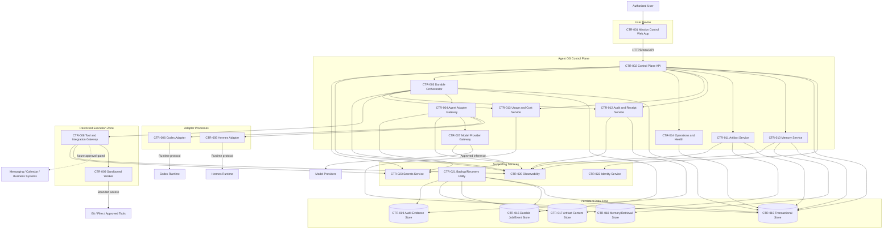
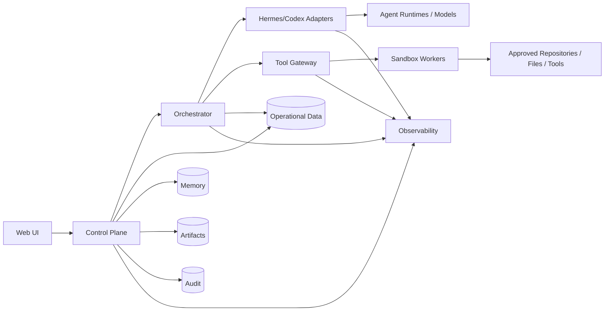
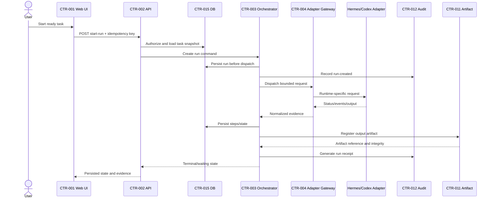
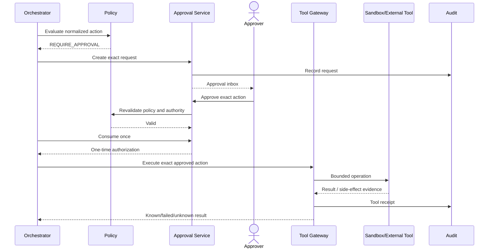
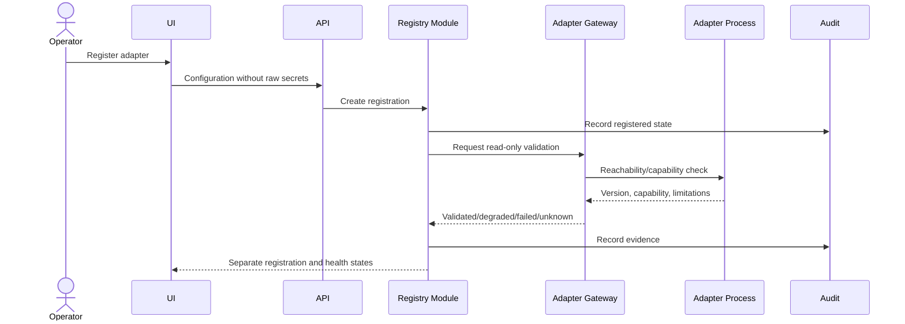
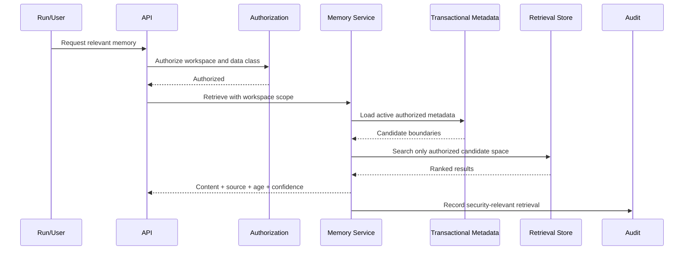
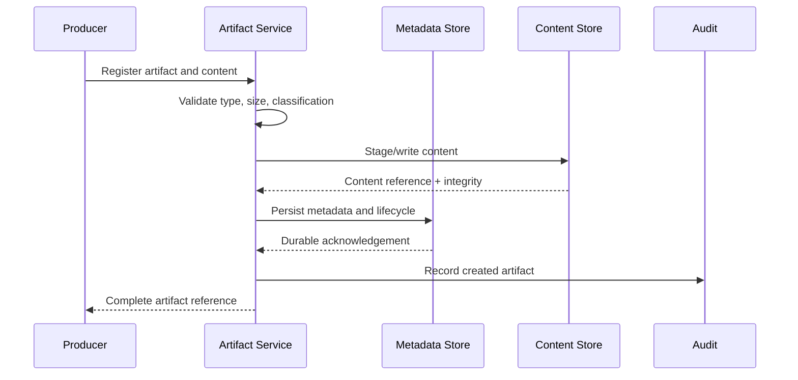
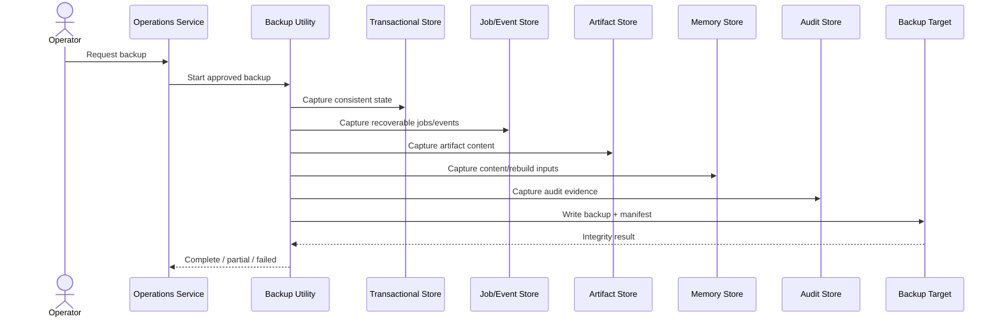

# C4-002 — Agent OS Container Diagram

> **Status: Approved container baseline — 2026-08-13.** This document defines the approved C4 Level 2 container view for the first Agent OS MVP. “Container” is used in the C4 sense: a separately running application, service, process, data store, or execution unit. It does not imply that every element must run in Docker, Kubernetes, or a separate deployable service.

## 1. Document purpose

This document decomposes `SYS-001 — Agent OS` into its principal runtime containers and persistent stores.

It defines:

- the proposed runtime units;
- the responsibilities of each container;
- the interfaces between containers;
- synchronous and asynchronous communication;
- the ownership of durable state;
- process and trust boundaries;
- local Linux/WSL deployment expectations;
- failure and degraded behavior;
- security and approval enforcement points;
- future scale-out seams;
- candidate consolidation for the first MVP;
- decisions that require ADRs;
- traceability to `SAD-001`, `SRS-001`, `NFR-001`, and `AUT-001`.

## 2. Scope

The C4 Level 2 view covers the first local Agent OS MVP:

- responsive Mission Control;
- application/API control plane;
- identity and workspace controls;
- task and run orchestration;
- policy and approval enforcement;
- Hermes and Codex adapters;
- model-provider integration;
- tool gateway and sandbox workers;
- transactional persistence;
- durable job/event processing;
- memory and retrieval;
- artifact storage;
- audit and receipts;
- cost and usage attribution;
- observability;
- local backup and restore coordination.

It excludes:

- public SaaS front door;
- multi-region or high-availability deployment;
- public plugin marketplace;
- unrestricted remote workers;
- production deployment workers;
- production financial connectors;
- autonomous merge;
- unrestricted external messaging;
- large-scale multi-agent swarms.

## 3. Container design principles

### CP-001 — Keep authority in the control plane

Adapters, workers, tools, and providers execute bounded work, but they do not own:

- workspace authorization;
- task or run identity;
- approval authority;
- permission grants;
- audit truth;
- cost attribution;
- lifecycle acceptance.

### CP-002 — Persist control state before external effects

The control plane must durably record:

- task snapshot;
- run;
- preflight decision;
- approval requirement;
- correlation identifiers

before dispatching external work.

### CP-003 — Separate execution from orchestration

The orchestrator coordinates work and state. Sandboxed workers execute bounded commands and file operations.

### CP-004 — Put protected side effects behind gateways

Protected filesystem, Git, command, network, messaging, package, and future business-system actions must cross an enforceable gateway.

### CP-005 — Treat adapters as replaceable translators

Codex, Hermes, and Claude Code adapters normalize external runtime behavior into the common Agent OS contracts.

### CP-006 — Keep stores logically distinct

One physical database may initially host several schemas/tables, but ownership, lifecycle, and access semantics remain distinct.

### CP-007 — Make degraded state visible

Container failure must produce explicit unavailable, degraded, stale, partial, or unknown state.

### CP-008 — Avoid premature microservices

Logical boundaries may be implemented in one deployable control-plane application until independent scaling or trust requirements justify separation.

## 4. Proposed container landscape

| Container ID | Container | Type | MVP deployment |
|---|---|---|---|
| `CTR-001` | Mission Control Web Application | Browser application | Separate frontend build or server-served client |
| `CTR-002` | Control Plane Application/API | Application service | Primary application process |
| `CTR-003` | Durable Orchestrator and Scheduler | Background service/process | Separate worker process recommended |
| `CTR-004` | Agent Adapter Gateway | Application service/module | Control-plane module or separate local service |
| `CTR-005` | Hermes Adapter | Adapter process | Separate restricted process |
| `CTR-006` | Codex Adapter | Adapter process | Separate restricted process |
| `CTR-007` | Model Provider Gateway | Integration service/module | Control-plane module initially |
| `CTR-008` | Tool and Integration Gateway | Security enforcement service | Separate privileged boundary recommended |
| `CTR-009` | Sandboxed Execution Worker | Restricted execution process/container | One or more isolated workers |
| `CTR-010` | Memory and Knowledge Service | Application service/module | Control-plane module initially |
| `CTR-011` | Artifact Service | Application service/module | Control-plane module initially |
| `CTR-012` | Audit and Receipt Service | Application service/module | Control-plane module or protected local service |
| `CTR-013` | Usage and Cost Service | Application service/module | Control-plane module initially |
| `CTR-014` | Operations and Health Service | Application service/module | Control-plane module initially |
| `CTR-015` | Transactional Data Store | Database | Persistent local service |
| `CTR-016` | Durable Job/Event Store | Queue/event persistence | Database-backed initially or local broker |
| `CTR-017` | Artifact Content Store | File/object storage | Controlled persistent local storage |
| `CTR-018` | Memory Content and Retrieval Store | Document/search/vector storage | Local persistent store/index |
| `CTR-019` | Audit Evidence Store | Append-oriented evidence storage | Logical protected store; may share DB initially |
| `CTR-020` | Observability Stack | Logs/metrics/traces | Local files and/or local telemetry service |
| `CTR-021` | Backup and Recovery Utility | Operations process/tool | Explicit operator-triggered process |
| `CTR-022` | Identity Provider / Local Identity Service | Supporting system | External or embedded approved mechanism |
| `CTR-023` | Secrets Service | Supporting system | External or local protected mechanism |

## 5. Level 2 container diagram



## 6. Portable simplified diagram



## 7. `CTR-001 — Mission Control Web Application`

### Responsibilities

- authenticated application shell;
- organization, workspace, and project context;
- dashboard and operational summaries;
- task creation and review;
- run timeline;
- approval inbox and exact-action review;
- agent, model, and tool configuration views;
- memory and artifact discovery;
- cost and usage views;
- audit exploration;
- health and recovery views;
- responsive and accessible interaction.

### Does not own

- authorization;
- operational truth;
- durable run state;
- approval validity;
- provider/model truth;
- secrets;
- audit history.

### Interfaces

- synchronous HTTP/API requests to `CTR-002`;
- optional server-sent events, WebSocket, or polling for state changes;
- browser-local non-authoritative preferences and cached query data.

### Security controls

- secure session handling;
- CSRF protection where applicable;
- content security policy;
- no raw secret rendering;
- no client-only authorization;
- output encoding;
- safe artifact preview;
- scoped cache invalidation.

### Failure behavior

If live updates fail:

- show last update time;
- mark data stale;
- allow explicit refresh;
- do not infer success or zero.

## 8. `CTR-002 — Control Plane Application/API`

### Responsibilities

- receive authenticated commands and queries;
- validate request schemas;
- resolve organization/workspace context;
- invoke domain/application modules;
- enforce coarse authorization;
- expose stable identifiers and state;
- manage idempotency for supported commands;
- coordinate synchronous user operations;
- provide API contracts for Mission Control.

### Internal modules likely hosted initially

- identity/session integration;
- workspace/project/membership;
- registry;
- task;
- policy decision interface;
- approval;
- artifact metadata;
- cost queries;
- operations queries.

### Does not own

- long-running external execution loops;
- arbitrary command execution;
- direct runtime-specific logic;
- raw secret values;
- direct provider billing truth.

### Interfaces

- browser-facing API;
- transactional store;
- orchestrator command interface;
- memory, artifact, audit, cost, and operations services;
- identity and secrets services.

### Critical rules

- protected commands require workspace context;
- no success response before the defined durability boundary;
- run start delegates to `CTR-003`;
- consequential effects never execute directly from browser request handlers.

## 9. `CTR-003 — Durable Orchestrator and Scheduler`

### Responsibilities

- create durable runs before dispatch;
- persist run and step state;
- schedule work;
- perform preflight;
- coordinate adapters;
- wait for approvals;
- handle timeouts;
- cancel, retry, resume, and checkpoint;
- enforce attempt/time/step/budget limits;
- detect stale or unknown execution;
- preserve lineage;
- generate inputs for execution receipts.

### State ownership

The orchestrator owns:

- current run state;
- step/attempt transitions;
- dispatch leases;
- retry count;
- checkpoint references;
- waiting conditions;
- last reliable external evidence;
- known side-effect status.

### Interfaces

- command requests from `CTR-002`;
- durable job/event store;
- transactional store;
- agent adapter gateway;
- tool gateway;
- policy/approval modules;
- audit and cost services;
- observability.

### Process recommendation

Run as a separate local process from the request-serving API to avoid:

- losing long-running work with web-process restart;
- blocking synchronous request capacity;
- mixing user-facing latency with worker execution.

### Failure behavior

On crash or lost lease:

- preserve last committed state;
- mark work stale or recoverable;
- re-acquire only through lease/idempotency rules;
- never re-dispatch a protected side effect blindly.

## 10. `CTR-004 — Agent Adapter Gateway`

### Responsibilities

- route to the selected adapter;
- normalize capability declarations;
- normalize external status and events;
- preserve adapter-specific extensions;
- validate adapter version and health;
- correlate external sessions to Agent OS runs;
- normalize cancellation and resume support;
- normalize outputs, artifacts, and usage.

### Architectural role

The gateway protects the control plane from direct Hermes/Codex coupling.

### Rules

- adapter registration does not mean validation;
- unsupported features remain unavailable;
- adapter-specific errors map to controlled platform error classes;
- the gateway does not grant permissions;
- external runtime claims are evidence, not unquestioned truth.

## 11. `CTR-005 — Hermes Adapter`

### Responsibilities

- translate common Agent OS requests to the permitted Hermes integration surface;
- start, inspect, cancel, or resume Hermes work where supported;
- collect events, outputs, and evidence;
- report capability and version;
- expose limitations explicitly;
- preserve correlation.

### Deployment

Recommended as a separate restricted process because:

- Hermes may have different runtime dependencies;
- failures should not crash the control plane;
- filesystem/network permissions may differ;
- upgrades can be isolated.

### Prohibited behavior

- direct access to unapproved workspaces;
- self-expanding permissions;
- direct human approval;
- silent use of unsupported capabilities;
- bypass of tool policy for protected side effects.

## 12. `CTR-006 — Codex Adapter`

### Responsibilities

- translate common task/run requests to the permitted Codex integration;
- bind approved repository or worktree context;
- collect patches, documents, tests, and proposed Git actions;
- normalize status and failures;
- expose capability and version;
- correlate provider/model/usage where available;
- return proposed consequential actions before execution.

### Deployment

Recommended as a separate restricted process with:

- approved worktree mounts;
- bounded environment;
- no production credentials;
- no uncontrolled remote Git authority;
- no direct merge path.

### Prohibited behavior

- autonomous merge;
- force push;
- protected-branch deletion;
- permission expansion;
- raw secret disclosure;
- operation outside approved repository scope.

## 13. `CTR-007 — Model Provider Gateway`

### Responsibilities

- resolve logical model profiles;
- validate workspace/provider eligibility;
- apply data-class and budget restrictions;
- call approved providers;
- record requested and actual provider/model where known;
- normalize provider errors and usage;
- enforce explicit fallback policy.

### Initial implementation

May be a module inside the control-plane application or adapter gateway.

### Separation trigger

Consider independent service only when:

- multiple runtimes share direct provider access;
- rate limiting or credential isolation requires it;
- provider routing becomes operationally complex;
- independent scaling becomes necessary.

### Rules

- no silent fallback;
- unknown actual model remains unknown;
- provider output is untrusted generated content;
- provider request payload must be minimized and classified.

## 14. `CTR-008 — Tool and Integration Gateway`

### Responsibilities

- receive normalized proposed actions;
- evaluate or enforce policy decisions;
- verify exact approval;
- normalize targets and parameters;
- enforce filesystem/network/capability scope;
- provide short-lived access where possible;
- dispatch to sandbox or approved external integration;
- record execution receipts;
- preserve known and unknown side effects;
- enforce revocation and emergency stop.

### Why it should be a distinct boundary

The gateway is a security choke point between agent intent and external side effects.

It should remain difficult for adapters to bypass.

### Supported MVP tool classes

- approved file and repository reads/writes;
- approved test/build command profiles;
- limited diagnostic commands;
- limited provider/tool calls;
- backup operations through approved operations flow.

### Deferred or restricted

- external messaging;
- calendar mutation;
- business-system connectors;
- package installation;
- production deployment;
- broad network access.

## 15. `CTR-009 — Sandboxed Execution Worker`

### Responsibilities

- execute approved command/file operations;
- enforce process, CPU, memory, time, output, filesystem, and network limits;
- mount only approved workspace resources;
- collect structured output;
- support cancellation;
- clean up;
- report side-effect and exit status.

### Trust level

The worker is not trusted with platform authority.

It receives:

- one bounded execution request;
- scoped resources;
- temporary capability access;
- no approval authority;
- no ability to alter policy.

### Candidate implementations

- restricted local process;
- container;
- VM/microVM;
- dedicated restricted remote worker;
- hybrid.

The final choice belongs in `SAN-001` and an ADR.

### Mandatory negative assumptions

- command input may be malicious;
- repository content may contain malicious instructions;
- generated code may be unsafe;
- dependency installation may persist risk;
- output may contain secrets or hostile markup.

## 16. `CTR-010 — Memory and Knowledge Service`

### Responsibilities

- ingest approved memory records;
- preserve source and authority labels;
- classify and scope records;
- manage correction, supersession, retention, and deletion;
- perform workspace-filtered retrieval;
- attach source, age, confidence, and relevance reason;
- protect against cross-workspace retrieval;
- expose governed APIs to runs and users.

### Storage ownership

- transactional metadata in `CTR-015`;
- content and indexes in `CTR-018`;
- audit events through `CTR-012`.

### Critical ordering

Authorization and workspace filtering occur before semantic retrieval or relevance ranking.

### Does not own

- authoritative business data;
- secret values;
- perfect recall guarantees;
- silent promotion of generated output to verified fact.

## 17. `CTR-011 — Artifact Service`

### Responsibilities

- create artifact metadata;
- validate media type and size;
- compute and verify integrity;
- store or retrieve content;
- manage lifecycle;
- enforce workspace access;
- provide safe previews;
- preserve version and derivative relationships;
- support evidence-export artifacts.

### Storage ownership

- metadata in `CTR-015`;
- binary/content in `CTR-017`.

### Consistency requirement

Metadata and content may be coordinated through:

- transactional outbox;
- staged upload/finalize flow;
- content-addressed registration;
- reconciliation job.

The service must not report a complete artifact when only metadata or only content exists.

## 18. `CTR-012 — Audit and Receipt Service`

### Responsibilities

- accept security-relevant and operationally significant events;
- validate versioned event schemas;
- preserve identity, workspace, correlation, and result;
- redact secret values;
- generate or retain execution receipts;
- expose read-only audit queries;
- record evidence gaps;
- prepare authorized evidence exports;
- protect append-oriented history.

### Storage ownership

- protected audit records in `CTR-019`;
- optional indexes or summaries in `CTR-015` or observability stores.

### Critical behavior

Failure of mandatory audit recording may block consequential actions.

### Distinction from observability

- audit: accountability and retained evidence;
- observability: diagnosis and operational visibility.

## 19. `CTR-013 — Usage and Cost Service`

### Responsibilities

- ingest provider and tool usage;
- deduplicate usage events;
- attribute to workspace, project, task, run, adapter, model, and tool;
- calculate estimates from versioned pricing where needed;
- preserve provider-reported versus calculated values;
- expose pending, unavailable, unattributed, and mismatched states;
- support budget enforcement inputs;
- produce cost views and authorized exports.

### Does not own

- provider billing truth;
- accounting ledgers;
- revenue or profit;
- business financial posting.

### Initial implementation

May remain a module in the control plane until event volume or reconciliation complexity justifies separation.

## 20. `CTR-014 — Operations and Health Service`

### Responsibilities

- component registration and health;
- readiness and liveness;
- stale/unknown status;
- build and schema identity;
- backup status;
- restore evidence;
- safe diagnostics;
- operational warnings;
- emergency-stop status;
- environment profile.

### Health granularity

Health is per component and dependency.

The service must not produce one misleading global green state.

### Example states

```text
API: ready
Database: ready
Artifact store: degraded
Hermes adapter: unreachable
Codex adapter: validated
Provider profile: quota exceeded
Audit pipeline: ready
Backup: stale
```

## 21. `CTR-015 — Transactional Data Store`

### Responsibilities

Durably store operational state such as:

- organization and workspaces;
- projects and memberships;
- identities/references and roles;
- registries;
- tasks and snapshots;
- runs and steps;
- approvals and grants;
- artifact and memory metadata;
- usage and cost records;
- health and backup metadata.

### Required properties

- transactions;
- constraints;
- migrations;
- backup support;
- indexed workspace scope;
- idempotency records;
- concurrency control;
- durable acknowledgements.

### Initial recommendation

A relational database is strongly indicated, but no product or technology is selected here.

## 22. `CTR-016 — Durable Job/Event Store`

### Responsibilities

- queue orchestration work;
- retain scheduled and waiting jobs;
- track delivery attempts;
- support retries and delays;
- support idempotency and deduplication;
- expose processing lag and failure;
- preserve correlation.

### Candidate implementations

- database-backed job tables;
- relational outbox/inbox;
- local message broker;
- embedded durable workflow engine.

### MVP recommendation

Prefer the simplest mechanism that proves:

- durability;
- recovery;
- timers;
- retries;
- visibility;
- idempotency;
- local operability.

The choice requires an ADR.

## 23. `CTR-017 — Artifact Content Store`

### Responsibilities

- retain permitted artifact content;
- expose controlled read/write interfaces;
- support integrity verification;
- support backup;
- support missing/partial state;
- preserve workspace partitioning or prefixes.

### Candidate implementations

- controlled local filesystem;
- local object-store-compatible service;
- content-addressed storage.

### Prohibited assumptions

- file existence implies authorized access;
- file path is safe to expose;
- MIME type is trustworthy;
- content is safe to preview.

## 24. `CTR-018 — Memory Content and Retrieval Store`

### Responsibilities

- store memory content or document chunks;
- maintain search and optional vector indexes;
- support deletion and correction propagation;
- expose rebuild capability;
- preserve workspace and classification filters.

### Source-of-truth rule

The retrieval index is derived.

Transactional memory metadata remains authoritative for:

- workspace;
- source;
- classification;
- active/deleted state;
- authority/confidence;
- retention.

## 25. `CTR-019 — Audit Evidence Store`

### Responsibilities

- retain append-oriented audit records;
- retain execution receipts;
- protect integrity;
- support authorized query and export;
- preserve schema version and correlation;
- support retention rules.

### Initial implementation

May share the relational database while using:

- separate schema/tables;
- restricted write paths;
- append-only application behavior;
- stronger integrity and backup controls.

### Future separation triggers

- regulatory or retention needs;
- high event volume;
- independent security controls;
- immutable/tamper-evident storage;
- separate operational ownership.

## 26. `CTR-020 — Observability Stack`

### Responsibilities

- structured service logs;
- metrics;
- traces;
- dashboards;
- alerts;
- health visualization;
- event-processing lag;
- adapter/provider diagnostics;
- storage and backup alerts.

### Initial implementation

May use:

- structured local logs;
- local metrics endpoint;
- local trace collector;
- lightweight dashboard.

### Requirements

- correlation IDs;
- secret redaction;
- component and workspace-safe metadata;
- explicit telemetry gaps;
- retention and resource bounds.

## 27. `CTR-021 — Backup and Recovery Utility`

### Responsibilities

- create backup manifests;
- coordinate quiescence or consistency mode;
- back up stores;
- verify integrity;
- report complete, partial, or failed state;
- restore in dependency-aware order;
- rebuild derived indexes;
- preserve recovery evidence;
- measure RPO/RTO.

### Authority

Backup creation may be scheduled under a narrow policy.

Restore requires exact approval and an authorized operator.

### Execution model

May be:

- an operations command;
- a dedicated local utility;
- an orchestrated maintenance workflow.

It must not be a hidden agent command.

## 28. `CTR-022 — Identity Provider / Local Identity Service`

### Responsibilities

- credential verification;
- identity status;
- optional MFA or local authentication factor;
- stable external identity reference.

### Agent OS retains

- application session;
- workspace membership;
- role;
- approval authority;
- workload identities;
- effective authorization.

### Candidate implementations

- embedded local identity;
- operating-system identity;
- local OIDC;
- another approved mechanism.

Choice requires `IAM-001` and an ADR.

## 29. `CTR-023 — Secrets Service`

### Responsibilities

- protected secret storage;
- encryption/key handling;
- access control;
- resolution of short-lived or bounded secret use;
- rotation and expiry support.

### Agent OS interaction

Agent OS requests use of a secret reference for an exact capability and target.

The service should avoid returning raw values to components that do not need them.

### Possible patterns

- environment-injected references;
- OS keyring;
- encrypted local secret store;
- external secret manager;
- short-lived credential broker.

Choice requires `SEC-002` and an ADR.

## 30. Container responsibility matrix

| Capability | UI | API | ORC | AGW | TGW | SBX | MEM | ART | AUD | CST | OPS |
|---|---:|---:|---:|---:|---:|---:|---:|---:|---:|---:|---:|
| Authenticate user | View | Coordinate |  |  |  |  |  |  | Record |  | Monitor |
| Workspace authorization | Display | Enforce | Enforce | Enforce context | Enforce | Enforce grant | Enforce | Enforce | Record | Enforce query | Monitor |
| Create task | UI | Own command |  |  |  |  |  |  | Record |  |  |
| Start run | UI | Accept command | Own | Dispatch |  |  |  |  | Record | Track | Monitor |
| Execute agent task | Show |  | Coordinate | Own adapter path | Tool actions | Commands | Context | Outputs | Record | Usage | Health |
| Approval | Review | Own application flow | Wait/revalidate |  | Verify |  |  |  | Record | Cost impact | Monitor |
| Memory | Browse | Coordinate | Request |  |  |  | Own |  | Record |  | Health |
| Artifact | Browse | Coordinate | Link | Normalize output |  | Produce |  | Own | Record |  | Health |
| Tool action | Show |  | Coordinate | Propose | Own gateway | Execute |  | Output | Receipt | Usage | Health |
| Audit | Browse | Query | Emit | Emit | Emit | Emit | Emit | Emit | Own | Emit | Emit |
| Cost | Browse | Query | Enforce budget | Usage | Usage | Usage |  |  | Evidence | Own | Monitor |
| Backup/restore | UI | Coordinate | Maintenance state | Stop/health | Stop/health | Stop/health | Include/rebuild | Include | Include | Include | Own |

## 31. Synchronous interfaces

| Interface ID | Source | Destination | Purpose |
|---|---|---|---|
| `IF-SYNC-001` | Web UI | Control Plane API | User commands and queries |
| `IF-SYNC-002` | Control Plane API | Identity Service | Authentication/session validation |
| `IF-SYNC-003` | Control Plane API | Transactional Store | Durable application state |
| `IF-SYNC-004` | Control Plane API | Orchestrator | Run control commands |
| `IF-SYNC-005` | Orchestrator | Policy/Approval modules | Preflight and exact authorization |
| `IF-SYNC-006` | Orchestrator | Agent Adapter Gateway | Dispatch/status/cancel |
| `IF-SYNC-007` | Adapter Gateway | Hermes/Codex Adapter | Runtime-specific calls |
| `IF-SYNC-008` | Adapter/Provider Gateway | Secrets Service | Secret-bound capability access |
| `IF-SYNC-009` | Orchestrator | Tool Gateway | Protected action request |
| `IF-SYNC-010` | Tool Gateway | Sandbox Worker | Bounded execution |
| `IF-SYNC-011` | Artifact Service | Artifact Store | Content write/read |
| `IF-SYNC-012` | Memory Service | Memory Store | Content/index operations |
| `IF-SYNC-013` | Operations Utility | Stores | Backup and restore |

Synchronous calls must have:

- timeouts;
- stable error codes;
- correlation;
- bounded payloads;
- retry policy appropriate to side effects;
- explicit unknown state when the result cannot be established.

## 32. Asynchronous interfaces

| Interface ID | Producer | Consumer | Event purpose |
|---|---|---|---|
| `IF-EVT-001` | API | Orchestrator | Run command accepted |
| `IF-EVT-002` | Orchestrator | UI/API query model | Run state changed |
| `IF-EVT-003` | Adapter Gateway | Orchestrator | Runtime event/status |
| `IF-EVT-004` | Policy/Approval | Orchestrator | Approval state changed |
| `IF-EVT-005` | Tool Gateway | Orchestrator/Audit | Tool result/receipt |
| `IF-EVT-006` | Artifact Service | Audit/UI | Artifact lifecycle changed |
| `IF-EVT-007` | Memory Service | Audit/index workers | Memory lifecycle changed |
| `IF-EVT-008` | Cost Service | Budget/UI | Usage or cost updated |
| `IF-EVT-009` | Operations | UI/Alerts | Health changed |
| `IF-EVT-010` | Backup Utility | Operations/Audit | Backup/restore state changed |

Consumers must tolerate:

- duplicate delivery;
- delayed delivery;
- out-of-order delivery;
- schema evolution;
- consumer restart;
- poison/malformed events.

## 33. Main task execution sequence



## 34. Approval-gated tool sequence



## 35. Adapter registration sequence



## 36. Memory retrieval sequence



Workspace filtering must happen before or as part of the retrieval query, never only after global ranking.

## 37. Artifact storage sequence



If content succeeds and metadata fails, or vice versa, reconciliation must mark the artifact partial/unavailable rather than complete.

## 38. Backup and restore sequence



Restore follows the inverse dependency-aware order under maintenance mode and exact approval.

## 39. Container trust boundaries

| Boundary ID | Containers | Main concern |
|---|---|---|
| `CTB-001` | Browser ↔ API | Session, injection, untrusted client |
| `CTB-002` | API ↔ Identity | Credential and session trust |
| `CTB-003` | API ↔ Orchestrator | Durable command acceptance |
| `CTB-004` | Orchestrator ↔ Adapter Gateway | Runtime authority and forged state |
| `CTB-005` | Gateway ↔ Adapter Process | Compromised adapter or dependency |
| `CTB-006` | Orchestrator ↔ Tool Gateway | Consequential action enforcement |
| `CTB-007` | Tool Gateway ↔ Sandbox | Escape and resource abuse |
| `CTB-008` | Sandbox ↔ Host resources | Path, process, and network escape |
| `CTB-009` | Application services ↔ Stores | Scope, tampering, data loss |
| `CTB-010` | Services ↔ Secrets | Raw secret disclosure |
| `CTB-011` | Services ↔ External providers | Data leakage and result ambiguity |
| `CTB-012` | Backup Utility ↔ Stores/target | Destructive restore and confidentiality |
| `CTB-013` | Audit writers ↔ Audit store | Tampering and missing evidence |
| `CTB-014` | Workspace-scoped query ↔ shared store/index | Cross-workspace leakage |

## 40. Container-to-data ownership

| Data object | Owning container | Authoritative store |
|---|---|---|
| Organization/workspace/project | Control Plane API/domain modules | Transactional store |
| Membership and role | IAM/workspace module | Transactional store |
| Agent/model/tool registration | Registry via API | Transactional store |
| Task/task snapshot | Task module via API | Transactional store |
| Run/step/attempt | Orchestrator | Transactional store |
| Durable job/event delivery | Orchestrator/event subsystem | Job/event store |
| Approval request/decision | Approval module | Transactional store |
| Memory metadata | Memory service | Transactional store |
| Memory content/index | Memory service | Retrieval store |
| Artifact metadata | Artifact service | Transactional store |
| Artifact content | Artifact service | Artifact store |
| Audit event/receipt | Audit service | Audit evidence store |
| Usage/cost | Cost service | Transactional store |
| Health state | Operations service | Transactional store + observability |
| Backup manifest | Backup utility/operations | Transactional store + backup target |

## 41. Strong-consistency boundaries

Strong consistency or equivalent protected atomic behavior is required for:

- membership and role changes;
- task snapshot selection for a run;
- run creation before dispatch;
- approval decision;
- approval one-time consumption;
- permission grant and revocation;
- hard budget reservation where implemented;
- artifact lifecycle acceptance;
- backup/restore maintenance state;
- audit linkage for consequential actions.

## 42. Eventual-consistency boundaries

Eventual consistency is acceptable for:

- dashboard aggregates;
- search indexes;
- memory retrieval indexes;
- cost reconciliation;
- noncritical health summaries;
- observability dashboards;
- derived analytics;
- cached UI query results.

The UI must display:

- source;
- freshness;
- stale/unknown state;
- reconciliation state;
- path to authoritative detail.

## 43. Container failure and degraded behavior

| Failed container | Expected degraded behavior |
|---|---|
| Web UI | API/state remains; user interface unavailable |
| API | Background work may continue; new user commands unavailable |
| Orchestrator | Existing durable state remains; runs stale/paused until recovery |
| Adapter Gateway | New agent dispatch blocked; existing platform records readable |
| Hermes Adapter | Hermes unavailable only |
| Codex Adapter | Codex unavailable only |
| Model Gateway | Direct provider calls blocked; no silent fallback |
| Tool Gateway | Consequential tool actions blocked |
| Sandbox Worker | Execution attempt failed/stale; no host fallback |
| Memory Service | Memory retrieval unavailable; other records readable |
| Artifact Service | Artifact actions degraded; metadata/content state explicit |
| Audit Service | Consequential actions may block; evidence gap visible |
| Cost Service | Cost pending/unavailable; no false zero |
| Operations Service | Health view degraded; core data may remain usable |
| Transactional Store | Control plane not ready; protected operations stop |
| Job/Event Store | New async work blocks; accepted work state preserved |
| Artifact Store | Content unavailable/partial; metadata remains |
| Retrieval Store | Search/retrieval unavailable; metadata remains |
| Audit Store | Mandatory evidence unavailable; consequential work blocks |
| Observability | Telemetry gap visible; audit remains separate |
| Identity Service | Protected operations fail closed |
| Secrets Service | Dependent external actions block |
| Backup Utility | Backup/restore unavailable; normal work continues with warning |

## 44. Local MVP deployment proposal

### Proposed process layout

```text
Browser
  └── Mission Control Web Application

Local Linux / WSL host
  ├── Control Plane API process
  ├── Durable Orchestrator worker process
  ├── Hermes Adapter process
  ├── Codex Adapter process
  ├── Tool Gateway process
  ├── One or more sandbox workers
  ├── Transactional database
  ├── Durable job/event mechanism
  ├── Artifact content directory/service
  ├── Memory/search index
  ├── Audit evidence store
  ├── Observability/logging
  └── Backup utility
```

### Candidate consolidation

The following may share the control-plane application process initially:

- IAM integration;
- workspace/project;
- registry;
- task;
- policy application service;
- approval application service;
- memory API;
- artifact API;
- audit query API;
- cost API;
- operations API.

### Recommended separation

The following should be separate processes or strongly isolated execution units:

- orchestrator worker;
- Codex adapter;
- Hermes adapter;
- Claude Code adapter;
- tool gateway;
- sandbox workers;
- database;
- artifact content store where practical.

## 45. Containerization position

C4 containers do not require deployment containers.

Possible MVP packaging:

- native local processes;
- Docker Compose;
- hybrid native application plus containerized stores/workers;
- another reproducible local package.

Selection criteria:

- WSL and Linux compatibility;
- filesystem behavior;
- sandbox strength;
- startup simplicity;
- persistent data;
- backup/restore;
- resource usage;
- debugging;
- upgrade safety.

`DEP-001` and ADRs will decide.

## 46. Network exposure

Default network policy:

- Mission Control/API bound to localhost or explicitly approved local interface;
- no public exposure;
- adapter and store ports private to the local host/network namespace;
- database not exposed publicly;
- sandbox egress denied by default;
- provider access allowlisted;
- tool destinations allowlisted;
- remote trusted-team access deferred.

## 47. Secret flow

Preferred flow:

```text
Task/Run references capability
→ Policy permits exact use
→ Service requests secret reference
→ Secrets Service supplies bounded access or injects value only where needed
→ Raw value never returns to UI, audit, memory, artifact, or ordinary logs
```

Containers that should generally not receive raw secret values:

- Web UI;
- memory service;
- artifact service;
- cost service;
- observability;
- audit query layer.

## 48. Container observability

Every running container/process should expose or emit:

- build/version;
- liveness;
- readiness;
- last successful dependency check;
- structured logs;
- correlation IDs;
- key metrics;
- error classification;
- resource usage;
- queue/processing lag where applicable.

Sensitive values and unrelated workspace content must be excluded or redacted.

## 49. Container security responsibilities

| Container | Primary security responsibilities |
|---|---|
| Web UI | Session-safe client, CSP, safe rendering, no client-only auth |
| API | Authentication, scope binding, validation, command authorization |
| Orchestrator | Durable preflight, limits, no blind retry |
| Adapter Gateway | Runtime isolation and evidence normalization |
| Hermes/Codex Adapters | No scope expansion, bounded runtime access |
| Model Gateway | Provider/data/budget policy |
| Tool Gateway | Final protected action enforcement |
| Sandbox | Host, filesystem, network, process, and resource isolation |
| Memory | Workspace-first retrieval and provenance |
| Artifact | Integrity and safe preview |
| Audit | Append-oriented evidence and redaction |
| Cost | Source/freshness/estimate labels |
| Operations | Safe diagnostics, backup, restore, emergency state |
| Stores | Access control, integrity, persistence, backup |
| Secrets | Secret confidentiality and bounded resolution |

## 50. Container scaling seams

Future independent scaling may apply to:

- API/query replicas;
- orchestrator workers;
- sandbox worker pools;
- adapter services;
- artifact service;
- memory retrieval;
- audit ingestion;
- cost ingestion;
- observability.

Scale-out prerequisites:

- stable contracts;
- workload identities;
- idempotency;
- distributed leases;
- event ordering;
- network security;
- distributed tracing;
- tenant-aware authorization;
- HA data and backup design.

The MVP does not implement this scale-out.

## 51. Container evolution triggers

A logical module should become a separately deployed service only when one or more conditions apply:

- different trust level;
- different scaling profile;
- independent release cadence;
- failure isolation need;
- strong resource isolation;
- distinct data ownership;
- distinct operational ownership;
- technology/runtime incompatibility;
- regulatory or retention requirement.

“Microservices” is not itself a requirement.

## 52. Candidate ADRs

### `ADR-TBD-001` — Backend and frontend application stack

Affects `CTR-001`, `CTR-002`, and application modules.

### `ADR-TBD-002` — Transactional database

Affects `CTR-015`.

### `ADR-TBD-003` — Durable orchestration and event mechanism

Affects `CTR-003` and `CTR-016`.

### `ADR-TBD-004` — Artifact storage implementation

Affects `CTR-011` and `CTR-017`.

### `ADR-TBD-005` — Sandbox and worker isolation

Affects `CTR-008` and `CTR-009`.

### Additional required ADRs

- adapter process and communication model;
- identity/session;
- secret mechanism;
- memory/search technology;
- audit integrity;
- real-time UI update mechanism;
- local packaging;
- telemetry stack;
- backup format and destination.

## 53. Requirements-to-container mapping

| Requirement domain | Containers |
|---|---|
| `FR-AUTH-*` | `CTR-001`, `CTR-002`, `CTR-022`, `CTR-012` |
| `FR-WSP-*` | `CTR-002`, `CTR-015` |
| `FR-AGT-*` | `CTR-002`, `CTR-004`, `CTR-005`, `CTR-006` |
| `FR-MOD-*` | `CTR-002`, `CTR-007`, `CTR-013`, `CTR-023` |
| `FR-TSK-*` | `CTR-002`, `CTR-015` |
| `FR-RUN-*` | `CTR-003`, `CTR-004`, `CTR-016`, `CTR-012` |
| `FR-APR-*` | `CTR-002`, `CTR-003`, `CTR-008`, `CTR-012` |
| `FR-TOL-*` | `CTR-008`, `CTR-009`, `CTR-023` |
| `FR-MEM-*` | `CTR-010`, `CTR-015`, `CTR-018`, `CTR-012` |
| `FR-ART-*` | `CTR-011`, `CTR-015`, `CTR-017`, `CTR-012` |
| `FR-AUD-*` | `CTR-012`, `CTR-019`, `CTR-020` |
| `FR-CST-*` | `CTR-013`, `CTR-015`, `CTR-003` |
| `FR-UI-*` | `CTR-001`, `CTR-002` |
| `FR-OPS-*` | `CTR-014`, `CTR-020`, `CTR-021`, all stores |

## 54. NFR-to-container implications

| NFR category | Container implications |
|---|---|
| Performance | UI/API query optimization; async long work; indexed stores |
| Reliability | Orchestrator durability; store constraints; adapter isolation |
| Availability | Independent degraded states; readable persisted data |
| Recovery | Job/event durability; checkpoints; backup utility |
| Security | API auth, gateway enforcement, sandbox, secrets separation |
| Privacy | Scoped data stores; minimized external payloads |
| Accessibility | Stable API state and accessible web application |
| Observability | Structured telemetry from every process |
| Maintainability | explicit interfaces and dependency rules |
| Portability | local process/container-neutral design |
| Capacity | worker/resource limits and store benchmarks |
| Cost | usage normalization and budget feedback |
| Integrity | transactions, hashes, receipts, append-oriented evidence |

## 55. Container verification strategy

Verification should include:

- contract tests between UI and API;
- module/architecture dependency tests;
- orchestrator restart and lease tests;
- adapter conformance tests;
- tool gateway bypass tests;
- sandbox escape and resource tests;
- workspace isolation tests across stores;
- event duplication and reordering tests;
- artifact partial-write reconciliation tests;
- memory retrieval boundary tests;
- audit ingestion failure tests;
- cost deduplication and reconciliation tests;
- health degradation tests;
- backup and restore exercises;
- secret-leak scanning;
- responsive and accessibility E2E tests.

## 56. Architecture fitness functions

Proposed automated checks:

1. API handlers cannot invoke protected external tools directly.
2. Control-plane domain modules cannot import Hermes/Codex implementation modules.
3. Every run dispatch requires an existing durable run ID.
4. Every approval-gated tool request requires a consumed approval reference.
5. Every protected store query requires workspace context.
6. Sandboxed workers cannot access unmounted host paths.
7. Adapter processes cannot connect to arbitrary destinations by default.
8. Raw secret fields are absent from ordinary application schemas.
9. Events carry schema version and correlation ID.
10. Artifact metadata cannot reach accepted state without content/integrity confirmation.
11. Audit records cannot be modified through ordinary application APIs.
12. UI dashboard data exposes freshness/status metadata.

## 57. Key risks

| Risk | Consequence | Response |
|---|---|---|
| Too many physical services | Local deployment complexity | Consolidate control-plane modules initially |
| Too few process boundaries | Adapter or command failure affects control plane | Separate orchestrator, adapters, gateway, workers |
| Tool gateway bypass | Approval/security controls ineffective | Enforce architecture and negative tests |
| Event store chosen poorly | Lost or duplicate work | Early fault-injection prototype |
| Shared database creates coupling | Hard future extraction | Logical schemas, ownership, contracts |
| Separate stores drift | Missing artifacts/indexes | Reconciliation and explicit partial state |
| Sandbox weak under WSL | Host compromise | Prove controls before enabling risky actions |
| Adapter process has broad credentials | Secret/data leakage | Narrow secrets and network scope |
| Audit coupled only to logs | Weak evidence | Dedicated audit service/store semantics |
| UI assumes live streaming | Misleading stale state | Polling fallback and freshness indicators |
| Backup misses one store | Incomplete recovery | Manifest and restore exercise |
| Memory index filters late | Workspace leakage | Scope before retrieval |
| Approval consumption not atomic | Replay or duplicate effects | Protected one-time consumption transaction |
| Over-consolidated API process | Long work blocks user requests | Separate worker/orchestrator |

## 58. Assumptions

- one organization and a small trusted team;
- local Linux/WSL deployment;
- Hermes and Codex can run as separately controlled adapter processes;
- a relational transactional store is feasible;
- a durable local job mechanism can be selected;
- artifact content can be stored locally;
- memory/search can be rebuilt from governed records where possible;
- protected tool actions can be routed through the gateway;
- named owners will review ADRs and security boundaries.

## 59. Constraints

- this document does not select technologies;
- logical containers may share a process in the MVP;
- public access remains excluded;
- production and financial writes remain excluded;
- autonomous merge remains excluded;
- arbitrary host shell remains excluded;
- prompt text cannot expand authority;
- accepted states cannot rely silently on mock data;
- Git integration remains deferred until the documentation drafting phase is complete.

## 60. Open decisions

1. Which containers share one control-plane process?
2. Does `CTR-004` run inside the API, orchestrator, or separately?
3. Which process owns policy evaluation?
4. Which process owns approval one-time consumption?
5. Is `CTR-016` a relational job table, broker, or workflow engine?
6. Which database technology supports `CTR-015`?
7. Which artifact storage supports `CTR-017`?
8. Which memory/index technology supports `CTR-018`?
9. How is audit integrity enforced in `CTR-019`?
10. Which sandbox implementation supports `CTR-009` under WSL/Linux?
11. How do adapters communicate with Agent OS?
12. How are adapter processes authenticated?
13. Which secrets are injected versus brokered?
14. Which real-time UI update mechanism is used?
15. Which observability stack fits the local pilot?
16. Which backup target and format are supported?
17. Are Docker Compose or native processes preferred?
18. Which ports and local network boundaries are required?
19. How are derived read models rebuilt after restore?
20. Which container failures block consequential execution?

## 61. Acceptance criteria

C4-002 may advance to `1.0.0` when:

1. every major runtime responsibility has one primary container owner;
2. authority remains in the control plane;
3. protected effects pass through policy, approval, gateway, and sandbox boundaries;
4. Hermes and Codex are isolated behind the adapter gateway;
5. durable orchestration is separated from synchronous request handling;
6. data ownership is explicit;
7. strong and eventual consistency boundaries are identified;
8. container failures have defined degraded behavior;
9. the local deployment remains operationally feasible;
10. no logical container is mistaken for a mandatory microservice;
11. technology decisions are deferred to explicit ADRs;
12. `DDD-001`, `DAT-001`, `ORC-001`, `INT-001`, `SEC-001`, and `DEP-001` can proceed;
13. Product, Architecture, Security, Data, Operations, and Quality approve the model;
14. metadata, terminology, Markdown, and diagrams validate.

## 62. Downstream impact

| Document | Required use |
|---|---|
| `DDD-001` | Assign domain responsibilities to container/module boundaries |
| `DAT-001` | Define schemas, stores, transactions, retention, and backups |
| `MEM-001` | Detail memory service and retrieval store |
| `ORC-001` | Detail orchestrator and durable job/event behavior |
| `INT-001` | Detail adapter, model, tool, and protocol interfaces |
| `SEC-001` | Define controls for each container and trust boundary |
| `THR-001` | Analyze container abuse and compromise scenarios |
| `DEP-001` | Map containers to processes, ports, volumes, and networks |
| `OBS-001` | Define telemetry emitted by each container |
| `OPS-001` | Define startup, shutdown, upgrade, and support procedures |
| `AGC-001` | Define the adapter-gateway contract |
| `RUN-001` | Define run/step/event contracts |
| `APR-001` | Define approval-service contracts |
| `API-001`, `EVT-001` | Define inter-container interfaces |
| `TST-001` | Define container, contract, fault, and security tests |
| `RTM-001` | Replace architecture decision placeholders with `CTR-*` and interface IDs |

## 63. Revision and approval history

### Approval state

- Current status: `approved`
- Current version: `0.1.0`
- Approved by: product-owner on 2026-08-13
- Approval date: not applicable
- Required next action: Product, Architecture, Security, Data, Operations, and Quality review

### Revision history

| Version | Date | Status | Summary | Authority |
|---|---|---|---|---|
| 0.1.0 | 2026-07-19 | Draft | Initial C4 Level 2 container view defining 23 runtime/storage containers, interfaces, sequences, trust boundaries, local deployment proposal, degraded behavior, scaling seams, and ADR backlog | Draft authoring; not approved |

## References

- `DOC-000` — Documentation Governance and Source-of-Truth Policy
- `GLO-001` — Glossary and Controlled Terminology
- `VSN-001` — Product Vision and Project Charter
- `SCP-001` — Scope and System Boundaries
- `PER-001` — Personas and Jobs to Be Done
- `UCD-001` — User Journeys and Use Cases
- `PRD-001` — Product Requirements Document
- `SRS-001` — Functional Requirements Specification
- `NFR-001` — Non-Functional Requirements
- `AUT-001` — Autonomy and Approval Matrix
- `RTM-001` — Requirements Traceability Matrix
- `SAD-001` — System Architecture Description
- `C4-001` — System Context Diagram
