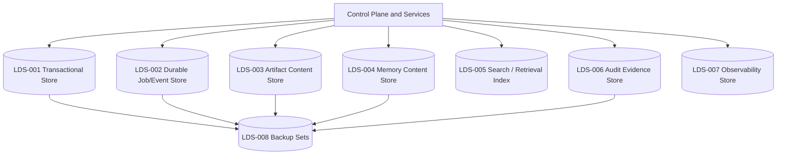
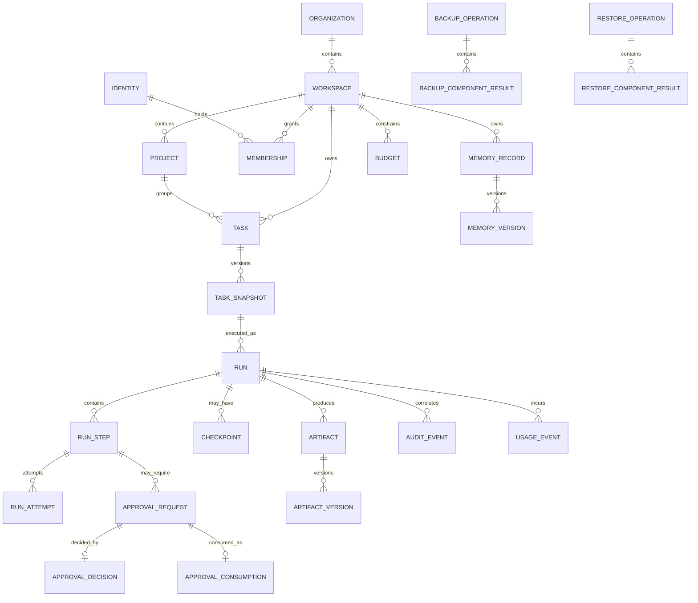
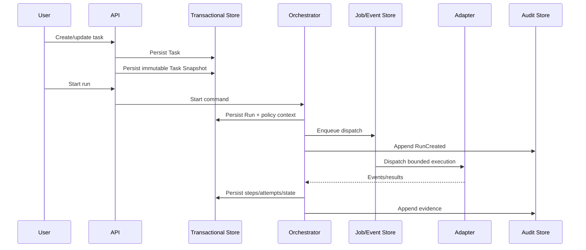
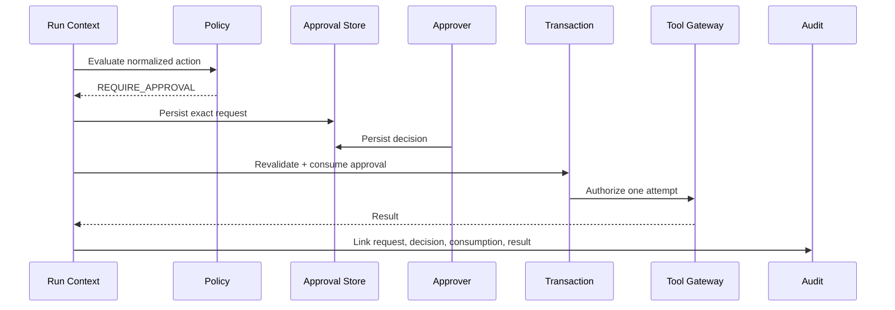

# DAT-001 — Agent OS Data Architecture

> **Status: Approved baseline — 2026-08-13.** This document defines the proposed logical data architecture for the first Agent OS MVP and its future evolution. It does not select a final database product, define physical tables, approve retention periods, authorize regulated-data processing, or prove that any persistence mechanism has been implemented.

## 1. Document purpose

This document establishes how Agent OS data is:

- classified;
- owned;
- identified;
- stored;
- related;
- isolated;
- validated;
- versioned;
- indexed;
- retained;
- corrected;
- deleted;
- exported;
- audited;
- backed up;
- restored;
- migrated;
- reconciled;
- traced to source.

It translates the domain model in `DDD-001` into a technology-neutral data architecture.

Detailed field-level definitions belong in `DCT-001`. Detailed memory, artifact, audit, cost, API, and event contracts belong in their respective controlled documents.

## 2. Data architecture goals

The data architecture must enable Agent OS to:

1. preserve work durably across process and adapter restarts;
2. enforce workspace isolation across every supported data path;
3. persist a run before external execution;
4. bind runs to immutable task snapshots;
5. bind approvals to exact action fingerprints;
6. preserve retry, resume, and cancellation lineage;
7. retain artifacts with provenance and integrity;
8. retain memory with source, authority, and lifecycle;
9. reconstruct significant activity from audit evidence;
10. attribute usage and costs without fabricating unknown values;
11. distinguish authoritative facts, reports, estimates, and generated analysis;
12. support backup and verifiable restore;
13. support local Linux/WSL deployment;
14. remain evolvable toward multi-organization and distributed execution;
15. avoid provider, adapter, database, or search-engine lock-in.

## 3. Data architecture principles

### `DAP-001 — Workspace scope is mandatory`

Every protected operational record must carry or inherit an explicit `organization_id` and `workspace_id` where applicable.

### `DAP-002 — Source authority is explicit`

Every important datum must identify whether it is:

- an Agent OS authoritative fact;
- an external source-system fact;
- an external provider report;
- a derived calculation;
- an estimate;
- generated analysis;
- unknown or unavailable.

### `DAP-003 — Persist before effect`

External execution and protected side effects must not begin before the required durable records and decisions exist.

### `DAP-004 — Immutable execution inputs`

A run references one immutable task snapshot and one versioned policy context.

### `DAP-005 — Append evidence, do not rewrite history`

Audit, approvals, attempts, usage events, and significant transitions are append-oriented or versioned.

### `DAP-006 — Separate content from metadata where useful`

Large artifacts and memory content may live outside the transactional store, but their metadata, scope, integrity, and lifecycle remain controlled.

### `DAP-007 — Derived indexes are rebuildable`

Search indexes, vector indexes, dashboards, and aggregates are derived and must not become the sole source of truth.

### `DAP-008 — Unknown is a stored state`

Missing, stale, partial, contradictory, pending, or unavailable data must remain explicit.

### `DAP-009 — Secrets are references, not business data`

Raw credentials are excluded from ordinary Agent OS domain storage.

### `DAP-010 — Deletion is governed`

Deletion, expiry, archival, correction, supersession, and legal/security retention are distinct states.

### `DAP-011 — Contracts are versioned`

Events, API resources, receipts, manifests, and exported data carry schema versions.

### `DAP-012 — Backup scope is manifested`

A backup is complete only when all mandatory data classes are included and verified.

## 4. Data scope

### 4.1 In-scope MVP data

- organization;
- workspace;
- project;
- membership;
- role assignment;
- identity references and sessions;
- registered agents and adapters;
- model profiles;
- tool registrations and grants;
- tasks and task snapshots;
- runs, steps, attempts, checkpoints, and side-effect records;
- policy versions and decisions;
- approval requests, decisions, and consumptions;
- memory metadata and governed content;
- artifact metadata and content;
- audit events and execution receipts;
- usage events, cost records, budgets, and reconciliations;
- component health;
- backup manifests and restore evidence;
- build, schema, and migration identity.

### 4.2 Excluded by default

- raw secrets;
- production credentials;
- production financial transactions;
- unrestricted operating-system data;
- unrelated personal files;
- public multi-tenant billing data;
- regulated or highly sensitive datasets without separate approval;
- full provider billing exports unless explicitly imported;
- hidden agent/runtime internal state that cannot be safely normalized.

## 5. Data domains

| Data domain ID | Domain | Primary bounded context |
|---|---|---|
| `DD-001` | Organization and Workspace | `BC-ORG` |
| `DD-002` | Identity and Authority | `BC-IAM` |
| `DD-003` | Registry and Capability | `BC-REG` |
| `DD-004` | Tasks and Work Definition | `BC-WRK` |
| `DD-005` | Runs and Durable Execution | `BC-RUN` |
| `DD-006` | Policy and Permissions | `BC-POL` |
| `DD-007` | Human Approval | `BC-APR` |
| `DD-008` | Memory and Knowledge | `BC-MEM` |
| `DD-009` | Artifacts | `BC-ART` |
| `DD-010` | Audit and Evidence | `BC-AUD` |
| `DD-011` | Usage, Cost, and Budget | `BC-CST` |
| `DD-012` | Operations, Backup, and Recovery | `BC-OPS` |

## 6. Data ownership matrix

| Data object | Authoritative owner | Authoritative store class |
|---|---|---|
| Organization | `BC-ORG` | Transactional |
| Workspace | `BC-ORG` | Transactional |
| Project | `BC-ORG` | Transactional |
| Membership and role | `BC-ORG` / `BC-IAM` | Transactional |
| Human identity reference | `BC-IAM` | Transactional reference |
| Credential | External identity authority | Outside ordinary Agent OS store |
| Secret value | Secrets mechanism | Outside ordinary Agent OS store |
| Agent registration | `BC-REG` | Transactional |
| Capability declaration | `BC-REG` | Transactional/versioned |
| Model profile | `BC-REG` | Transactional/versioned |
| Tool registration | `BC-REG` | Transactional/versioned |
| Task | `BC-WRK` | Transactional |
| Task snapshot | `BC-WRK` | Immutable transactional |
| Run | `BC-RUN` | Transactional |
| Run step and attempt | `BC-RUN` | Transactional |
| Checkpoint metadata | `BC-RUN` | Transactional |
| Checkpoint content | Adapter/artifact storage via Agent OS reference | Content store |
| Policy version | `BC-POL` | Versioned transactional/configuration store |
| Policy decision | `BC-POL` | Transactional/evidence |
| Permission grant | `BC-POL` | Transactional |
| Approval request/decision/consumption | `BC-APR` | Transactional/append-oriented |
| Memory metadata | `BC-MEM` | Transactional |
| Memory content | `BC-MEM` | Memory content store |
| Memory index | `BC-MEM` | Derived index |
| Artifact metadata | `BC-ART` | Transactional |
| Artifact content | `BC-ART` | Artifact content store |
| Audit event | `BC-AUD` | Append-oriented evidence store |
| Execution receipt | `BC-AUD` | Evidence store |
| Usage event | `BC-CST` | Append-oriented transactional |
| Cost record | `BC-CST` | Transactional/derived |
| Provider invoice | External provider | External source |
| Budget | `BC-CST` | Transactional |
| Component health | `BC-OPS` | Transactional latest state + observations |
| Operational log/metric/trace | Observability subsystem | Telemetry store |
| Backup manifest | `BC-OPS` | Transactional + backup set |
| Backup binary | Backup target | Protected backup store |

## 7. Source-of-truth classes

| Source class | Meaning | Example |
|---|---|---|
| `AUTHORITATIVE_PLATFORM` | Agent OS owns the operational fact | Run state persisted by orchestrator |
| `AUTHORITATIVE_EXTERNAL` | External system owns the fact | Git commit, ERP transaction |
| `EXTERNAL_REPORTED` | External party reports a value | Provider token usage |
| `CALCULATED` | Deterministic calculation from versioned inputs | Cost from usage × price |
| `ESTIMATED` | Approximation with declared method | Estimated provider cost |
| `GENERATED` | AI-generated content | Summary or proposed action |
| `USER_ASSERTED` | Human-provided but not independently verified | Preference or project statement |
| `VERIFIED_REFERENCE` | Verified against controlled evidence | Approved project fact |
| `UNKNOWN` | Value cannot currently be established | Actual model unavailable |
| `UNAVAILABLE` | Source cannot currently be queried | Provider billing offline |
| `STALE` | Previously known but freshness threshold exceeded | Adapter health from yesterday |
| `CONFLICTED` | Multiple credible sources disagree | Cost reconciliation mismatch |

Every data product and user-facing read model must preserve the relevant source class.

## 8. Logical store architecture



## 9. Logical data stores

| Store ID | Store | Purpose | Authoritative? |
|---|---|---|---|
| `LDS-001` | Transactional Store | Operational state and critical invariants | Yes |
| `LDS-002` | Durable Job/Event Store | Work scheduling, outbox/inbox, delivery state | Yes for delivery state |
| `LDS-003` | Artifact Content Store | Retained artifact content | Yes for content bytes |
| `LDS-004` | Memory Content Store | Governed memory bodies/documents | Yes for memory content |
| `LDS-005` | Search/Retrieval Index | Search, ranking, optional vector retrieval | No, derived |
| `LDS-006` | Audit Evidence Store | Append-oriented events and receipts | Yes |
| `LDS-007` | Observability Store | Logs, metrics, traces | Operational, not business authority |
| `LDS-008` | Backup Sets | Recovery copies and manifests | Recovery authority for selected point |

## 10. Initial physical consolidation strategy

For the local MVP, the architecture may consolidate several logical stores:

- `LDS-001`, `LDS-002`, and part of `LDS-006` may use one relational database;
- `LDS-003` may use a controlled local directory or object-store-compatible service;
- `LDS-004` and `LDS-005` may share one local search/document technology;
- `LDS-007` may begin with structured local logs and lightweight metrics;
- `LDS-008` may use encrypted local or external protected storage.

Consolidation is acceptable only if:

1. logical ownership remains explicit;
2. access paths remain controlled;
3. retention can differ;
4. backup coverage is complete;
5. derived data can be rebuilt;
6. future extraction is feasible;
7. security requirements are not weakened.

## 11. Proposed logical schemas

Within a relational implementation, the following logical schemas or ownership namespaces are recommended:

| Logical schema | Data |
|---|---|
| `org` | organizations, workspaces, projects, memberships |
| `iam` | identities, sessions, authorities, role references |
| `registry` | agents, adapters, models, tools, capabilities |
| `work` | tasks, snapshots, expected artifacts, limits |
| `run` | runs, steps, attempts, checkpoints, waiting conditions |
| `policy` | policy versions, grants, decisions, revocations |
| `approval` | requests, decisions, consumptions, revisions |
| `memory` | memory metadata, versions, source references |
| `artifact` | artifact metadata, versions, storage references |
| `audit` | audit events, receipts, evidence gaps |
| `cost` | usage events, costs, budgets, reconciliations |
| `ops` | health, backup, restore, maintenance, build identity |
| `eventing` | outbox, inbox, job leases, schedules, dead letters |

These names are proposals, not physical database commitments.

## 12. High-level entity relationship view



## 13. Identifier architecture

### 13.1 Identifier properties

Identifiers must be:

- globally unique within their entity type;
- opaque;
- stable;
- non-reusable;
- safe for URLs and logs where exposed;
- independent of human-readable names;
- generated without revealing sensitive sequence information where practical.

### 13.2 Identifier types

Examples:

```text
organization_id
workspace_id
project_id
identity_id
agent_registration_id
model_profile_id
tool_registration_id
task_id
task_snapshot_id
run_id
step_id
attempt_id
approval_request_id
approval_decision_id
approval_consumption_id
memory_record_id
artifact_id
audit_event_id
usage_event_id
backup_operation_id
```

### 13.3 Human-readable identifiers

Human-readable names may change and must not be used as authorization keys.

Optional short references may be derived for display, but canonical relationships use stable IDs.

## 14. Workspace isolation model

### 14.1 Required record scope

Every protected record must have:

- `organization_id`;
- `workspace_id`;

or an immutable foreign-key path to a scoped aggregate that can be enforced reliably.

### 14.2 Scope propagation

Workspace scope must propagate through:

- tasks and snapshots;
- runs, steps, attempts, and checkpoints;
- approvals;
- permission grants;
- memory;
- artifacts;
- audit events;
- usage/cost records;
- search/index entries;
- storage paths/prefixes;
- backup manifests;
- exports.

### 14.3 Query rules

- workspace authorization is resolved before data access;
- queries include authorized workspace predicates;
- cross-workspace joins require explicit privileged service logic;
- global search first restricts authorized scopes;
- semantic/vector retrieval never ranks globally and filters only afterward;
- cache keys include workspace and identity/permission context;
- pagination tokens cannot be reused across workspaces.

### 14.4 Storage rules

For content stores, paths or object keys should include opaque scope prefixes, not human names.

Example logical layout:

```text
organizations/{organization_id}/
  workspaces/{workspace_id}/
    artifacts/{artifact_id}/{version_id}
    memory/{memory_record_id}/{version_id}
    checkpoints/{checkpoint_id}
```

Physical paths must not be exposed directly to unauthorized clients.

### 14.5 Isolation verification

Every supported data path requires negative tests for:

- direct ID access;
- search;
- filters;
- exports;
- artifact preview/download;
- memory retrieval;
- audit query;
- cost query;
- cached views;
- backup/restore scope;
- adapter/tool requests.

## 15. Data classification baseline

A detailed classification and retention policy is recommended as a **proposed, currently registered companion document** often referenced as `DAT-002`.

Until then, DAT-001 uses these provisional classes:

| Class | Description | Examples |
|---|---|---|
| `PUBLIC` | Approved for public disclosure | Public documentation |
| `INTERNAL` | Ordinary non-public project information | Task metadata |
| `CONFIDENTIAL` | Harmful if disclosed | Private source code, client material |
| `SECRET` | Credentials or high-impact access material | Tokens, passwords |
| `RESTRICTED` | Regulated or highly sensitive data | Sensitive personal or financial data |

### Classification rules

- the highest applicable classification governs a composite object;
- derived summaries inherit classification unless a controlled declassification rule exists;
- provider/tool use must check classification;
- `SECRET` values do not enter ordinary Agent OS content stores;
- `RESTRICTED` processing is excluded unless separately approved;
- export and backup preserve classification metadata.

## 16. Data lineage

Every important generated, imported, or transformed record should retain lineage.

### Minimum lineage fields

- source system or producer;
- source record/reference;
- task/run/step;
- adapter/model/tool;
- transformation or calculation method;
- policy/approval reference where relevant;
- creation time;
- schema/version;
- source class;
- freshness;
- integrity reference.

### Lineage examples

#### Artifact

```text
Task Snapshot
→ Run
→ Run Step
→ Adapter/Tool
→ Artifact Version
→ Review/Acceptance
```

#### Cost

```text
Provider Usage Report
→ Normalized Usage Event
→ Pricing Version
→ Calculated Cost Record
→ Workspace/Task/Run Attribution
→ Reconciliation
```

#### Memory

```text
Source Artifact/User Statement
→ Memory Proposal
→ Policy Decision
→ Memory Version
→ Verification/Correction
→ Retrieval Observation
```

## 17. Task and run data flow



### Required guarantees

- run exists before dispatch;
- task snapshot is immutable;
- dispatch is idempotent;
- adapter events can be deduplicated;
- terminal state has evidence;
- unknown external outcome remains unknown.

## 18. Approval data flow



### Required guarantees

- request stores exact action fingerprint;
- decision references exact request version;
- consumption is one-time;
- consumption and attempt authorization are atomic or equivalent;
- failure does not recreate approval;
- changed target or parameters invalidate the request.

## 19. Artifact data flow

### Staged write model

1. create artifact proposal;
2. validate media type, size, classification, and policy;
3. stage content;
4. calculate integrity hash;
5. persist content reference;
6. persist metadata/version;
7. finalize artifact state;
8. append audit event;
9. reconcile orphaned stage data.

### States

```text
proposed
staging
stored
partial
integrity_failed
under_review
accepted
rejected
superseded
archived
deleted
unavailable
```

### Consistency rule

Artifact metadata must never report `stored` or `accepted` when required content is absent or integrity cannot be verified.

## 20. Memory data flow

### Ingestion

1. identify source and producer;
2. classify content;
3. evaluate workspace and memory-write policy;
4. reject secrets/prohibited content;
5. persist metadata;
6. persist content;
7. update derived index;
8. record provenance and evidence.

### Retrieval

1. authenticate;
2. authorize workspace and data class;
3. load active metadata constraints;
4. restrict candidate set;
5. perform lexical/vector relevance;
6. return source, age, authority, confidence, and reason;
7. apply onward provider/tool disclosure policy;
8. record retrieval evidence where required.

### Correction/deletion

- correction creates a new version;
- supersession preserves old lineage;
- deletion removes active retrieval;
- derived indexes converge and expose propagation failures;
- immutable audit metadata may remain according to policy.

## 21. Audit data architecture

### 21.1 Event model

Audit events are append-oriented and versioned.

Each event includes:

- event ID;
- schema version;
- event type;
- occurred time;
- recorded time;
- identity and identity type;
- organization/workspace;
- aggregate reference;
- correlation and causation;
- target;
- result;
- source class;
- redaction state;
- payload/content reference;
- integrity reference.

### 21.2 Audit versus domain event

A domain event expresses a business fact for downstream processing.

An audit event expresses evidence for accountability.

One domain event may produce one or more audit events, but they are not automatically identical.

### 21.3 Audit mutation policy

Ordinary mutation is prohibited.

Corrections use:

- explanatory event;
- supersession/correction link;
- retained original record.

### 21.4 Audit evidence gap

Missing, delayed, malformed, rejected, or unavailable evidence produces an explicit `EvidenceGap`.

## 22. Usage and cost data architecture

### 22.1 Usage event source types

- provider-reported;
- adapter-reported;
- tool-reported;
- locally measured;
- imported reconciliation record.

### 22.2 Usage states

- reported;
- calculated;
- estimated;
- pending;
- unavailable;
- unattributed;
- duplicate;
- reconciled;
- mismatched.

### 22.3 Deduplication

Usage events require a stable source/deduplication key.

When a provider does not provide a stable ID, Agent OS may construct a compound key using:

- provider;
- account/profile;
- external request ID where available;
- run/step;
- metric;
- time window;
- quantity;
- source payload hash.

### 22.4 Price versioning

Calculated cost stores:

- pricing source;
- pricing version;
- effective date;
- currency;
- unit;
- calculation method;
- calculation time.

### 22.5 Unknown values

- unknown usage is not zero;
- unknown price is not zero cost;
- unavailable billing is not no spend;
- estimates are never displayed as provider-reported.

## 23. Transaction boundaries

Strong transaction or equivalent protected atomicity is required for:

| Transaction ID | Operation |
|---|---|
| `TX-001` | Create workspace and initial owner |
| `TX-002` | Change role while preserving owner invariant |
| `TX-003` | Create immutable task snapshot |
| `TX-004` | Create run before dispatch |
| `TX-005` | Create approval request and waiting state |
| `TX-006` | Persist approval decision |
| `TX-007` | Consume approval and authorize one attempt |
| `TX-008` | Revoke grant and prevent future use |
| `TX-009` | Reserve/release hard budget |
| `TX-010` | Finalize artifact metadata/content state |
| `TX-011` | Enter/exit restore maintenance state |
| `TX-012` | Apply schema migration version |

## 24. Concurrency control

The data architecture should support:

- optimistic concurrency through aggregate/version fields;
- unique constraints for one-time actions;
- compare-and-set transitions;
- row/advisory locks where justified;
- job/worker leases;
- idempotency keys;
- deduplication keys;
- transaction retries for serialization conflicts.

### Critical conflicts to detect

- two owners removing the last owner;
- two starts for one idempotency key;
- two approval consumptions;
- two workers claiming one attempt;
- retry while cancellation occurs;
- artifact acceptance while integrity fails;
- budget reservations racing;
- restore while normal writes continue.

## 25. Idempotency data model

### Idempotency record fields

- idempotency key;
- operation type;
- organization/workspace;
- requester identity;
- normalized request hash;
- created time;
- expiry;
- state;
- resulting resource ID;
- response/result reference.

### Rules

1. same key and same request returns the existing result;
2. same key and different request is rejected;
3. protected idempotency records outlive the retry window;
4. idempotency does not turn an unsafe action into a safe one;
5. one-time approval consumption remains separately enforced.

## 26. Outbox and inbox pattern

A transactional outbox or equivalent is recommended for reliable event publication.

### Outbox

Written in the same transaction as the authoritative state change.

Fields include:

- event ID;
- aggregate ID/version;
- schema version;
- payload;
- workspace;
- correlation;
- publication status;
- attempt count;
- next attempt;
- last error.

### Inbox

Used by consumers to deduplicate received events.

Fields include:

- consumer ID;
- event ID;
- received time;
- processing state;
- processing result;
- retry information.

### Rules

- consumers are idempotent;
- malformed events are quarantined;
- dead-letter state is observable;
- event loss is not hidden;
- event schema compatibility is enforced.

## 27. Event ordering

The architecture does not assume total global ordering.

It requires:

- per-aggregate version ordering;
- causation/correlation links;
- attempt sequence;
- event occurred and recorded times;
- consumer reconciliation when events arrive out of order.

A later event cannot automatically overwrite a newer aggregate version.

## 28. Time architecture

### Required timestamps

- `created_at`;
- `updated_at`;
- `occurred_at`;
- `recorded_at`;
- `started_at`;
- `ended_at`;
- `expires_at`;
- `last_validated_at`;
- `last_observed_at`;
- `deleted_at` or lifecycle equivalent.

### Rules

- store timestamps in UTC;
- preserve user time zone only for presentation or external calendar semantics;
- distinguish source occurrence time from Agent OS recording time;
- record clock/source uncertainty where external timestamps are unreliable;
- time-sensitive approval and grant checks use authoritative server time.

## 29. Schema versioning

Versioning is required for:

- task snapshots;
- policy sets;
- capability declarations;
- API resources;
- events;
- approval requests;
- execution receipts;
- artifact manifests;
- backup manifests;
- exported datasets.

### Compatibility categories

- backward compatible;
- forward compatible;
- additive but optional;
- migration required;
- unsupported/breaking.

Breaking changes require:

- version bump;
- migration or adapter;
- compatibility tests;
- rollout and rollback/forward-recovery plan;
- documentation update.

## 30. Database migration architecture

### Migration requirements

- migration identifier;
- source and target schema version;
- description;
- preconditions;
- backup requirement;
- expected duration;
- locking/availability impact;
- data transformation;
- verification query;
- rollback or forward-recovery method;
- approval requirement;
- execution evidence.

### Rules

1. destructive migrations require explicit approval.
2. migration success is not assumed from process exit alone.
3. schema and data verification follow migration.
4. application build declares supported schema range.
5. backups are validated before high-risk migration.
6. failed migration prevents readiness.
7. migrations are reproducible on a clean dataset and representative historical fixtures.

## 31. Data retention architecture

Exact retention periods are not approved in this document.

The architecture defines retention classes:

| Retention class | Meaning | Example |
|---|---|---|
| `RET-TRANSIENT` | Exists only for active processing | Temporary prompt context |
| `RET-SHORT` | Short diagnostic or retry window | Temporary job payload |
| `RET-OPERATIONAL` | Needed during active project/workspace use | Tasks and runs |
| `RET-EVIDENCE` | Needed for accountability and assurance | Approvals, audit, receipts |
| `RET-PROJECT` | Retained for project/workspace lifecycle | Artifacts and governed memory |
| `RET-USER_CONTROLLED` | Owner decides within policy | Optional memory/preferences |
| `RET-SECURITY` | Retained for security investigation | Security denials |
| `RET-BACKUP` | Retained according to backup rotation | Backup sets |

### Retention metadata

Every retained class should have:

- owner;
- purpose;
- default period;
- legal/security exception;
- deletion method;
- archive behavior;
- backup behavior;
- review cadence.

Exact values belong in a future approved classification/retention policy.

## 32. Data lifecycle states

### Common lifecycle states

```text
active
inactive
archived
superseded
expired
deleted
purge_pending
purged
unavailable
partial
```

### Rules

- `deleted` means unavailable to ordinary active use;
- `purged` means content removed according to policy;
- audit evidence may retain a non-sensitive deletion fact;
- backups may retain data until rotation;
- restore must not silently reactivate data deleted before the backup point without reconciliation.

## 33. Deletion architecture

Deletion must address:

- transactional metadata;
- content store objects;
- indexes;
- caches;
- exports;
- derived read models;
- backups;
- audit references.

### Deletion workflow

1. authorize;
2. validate retention constraints;
3. mark deletion intent/state;
4. remove from active access;
5. delete content/index entries;
6. verify propagation;
7. record completion or partial failure;
8. allow backup rotation or controlled tombstone reconciliation.

### Prohibited behavior

- silently deleting audit evidence;
- deleting another workspace’s data;
- treating index deletion as source deletion;
- claiming complete deletion when backup/derived copies remain without disclosure.

## 34. Correction and supersession

Correction is preferred to destructive history rewriting.

A correction record stores:

- prior version reference;
- new version;
- reason;
- actor;
- evidence;
- effective time;
- affected derived views;
- conflict state.

Superseded records remain discoverable to authorized reviewers.

## 35. Search architecture

### Search types

- exact ID lookup;
- metadata filters;
- full-text search;
- faceted search;
- optional semantic/vector retrieval;
- audit timeline search;
- artifact content search where permitted.

### Search authorization

Authorization is applied before or within the query.

Search indexes include:

- organization/workspace;
- classification;
- lifecycle;
- source authority;
- retention state;
- access-control projection where needed.

### Search freshness

Search responses expose:

- index update time;
- source update time;
- stale/partial state;
- direct link to authoritative detail.

## 36. Vector/retrieval architecture

Vector storage is optional, not mandatory for MVP acceptance.

If used:

- embedding model/version is recorded;
- workspace/classification metadata is mandatory;
- deleted/expired state propagates;
- index is rebuildable;
- embeddings are treated as derived sensitive data;
- cross-workspace global nearest-neighbor retrieval is prohibited;
- provider disclosure policy applies to embedding generation;
- retrieval confidence is not source authority.

## 37. Cache architecture

Caches are derived and non-authoritative.

Cache keys include:

- organization/workspace;
- identity or effective permission projection where needed;
- resource/version;
- query/filter;
- data classification;
- locale where applicable.

Cache invalidation is required for:

- membership and role changes;
- grant revocation;
- emergency stop;
- artifact deletion;
- memory correction/deletion;
- approval decision;
- task/run state;
- health freshness.

Security-sensitive cached authorization decisions must have short validity and revocation-aware invalidation.

## 38. Read-model architecture

Derived read models support Mission Control.

Examples:

- `MissionControlSummary`;
- `TaskOperationalSummary`;
- `RunTimeline`;
- `ApprovalInboxItem`;
- `AgentHealthView`;
- `ArtifactIndexItem`;
- `MemorySearchResult`;
- `AuditTimelineEntry`;
- `CostBreakdown`;
- `BackupFreshnessView`.

Each read model must include:

- scope;
- source;
- freshness;
- status;
- calculation/derivation version;
- evidence or authoritative-detail reference.

## 39. Data quality dimensions

| Dimension | Definition |
|---|---|
| Completeness | Required fields and evidence exist |
| Validity | Values satisfy controlled rules |
| Consistency | Related records do not contradict invariants |
| Uniqueness | Duplicates are prevented or identified |
| Timeliness | Freshness meets the stated purpose |
| Accuracy | Value matches the authoritative source where verifiable |
| Lineage | Source and transformation are known |
| Integrity | Data/content has not been altered unexpectedly |
| Scope correctness | Record belongs to the correct workspace |
| Classification correctness | Handling class matches content and purpose |

## 40. Data quality controls

- database constraints;
- controlled vocabularies;
- schema validation;
- foreign keys or equivalent references;
- uniqueness constraints;
- aggregate version checks;
- integrity hashes;
- reconciliation jobs;
- stale-data detection;
- orphan detection;
- source-class labels;
- mandatory lineage;
- workspace negative tests;
- migration verification;
- backup/restore comparison.

## 41. Data quality issue model

A `DataQualityIssue` should capture:

- issue ID;
- data domain;
- affected records;
- workspace;
- quality dimension;
- severity;
- detected time;
- detector;
- evidence;
- operational impact;
- remediation status;
- owner;
- resolution;
- audit reference.

Critical issues may block:

- consequential execution;
- artifact acceptance;
- cost reporting;
- backup completion;
- restore acceptance.

## 42. Data reconciliation

Reconciliation is needed for:

- artifact metadata versus content;
- memory metadata versus indexes;
- provider usage versus Agent OS usage;
- budget reservations versus completed cost;
- run state versus adapter report;
- audit expected versus observed events;
- backup manifest versus stored components;
- restore expected versus restored counts;
- Git action receipt versus repository state.

Reconciliation results are:

- matched;
- partially matched;
- delayed;
- mismatched;
- unavailable;
- unresolved.

## 43. Import architecture

Imports may include:

- configuration metadata;
- model/tool profiles;
- task templates;
- approved project data;
- future provider usage;
- future read-only business data.

Every import requires:

- source;
- format/schema version;
- workspace target;
- classification;
- validation;
- dry-run/preview where practical;
- duplicate strategy;
- error report;
- provenance;
- audit event.

Imports cannot grant permissions or create secrets through ordinary content fields.

## 44. Export architecture

Exports may include:

- tasks;
- runs;
- approvals;
- artifact metadata/content;
- memory metadata/content;
- audit evidence;
- cost/usage;
- backup manifests.

Every export requires:

- authorized scope;
- selected record classes;
- classification and redaction;
- source and schema version;
- manifest;
- integrity reference;
- destination;
- audit event;
- approval where disclosure is consequential.

A portable structured format is preferred for metadata.

## 45. Data privacy architecture

The architecture applies privacy by design through:

- minimization;
- purpose limitation;
- workspace isolation;
- classification;
- retention;
- correction and deletion;
- provider/tool disclosure control;
- telemetry minimization;
- export control;
- source and user-visible transparency.

The MVP should avoid processing regulated or highly sensitive personal data.

A future dedicated privacy/classification document is recommended before broader use.

## 46. Secrets and sensitive configuration

Ordinary tables may store:

- secret reference ID;
- secret owner;
- purpose;
- permitted capabilities;
- workspace;
- target;
- expiry/rotation metadata;
- last-use evidence.

Ordinary tables must not store:

- plaintext API keys;
- passwords;
- refresh tokens;
- private keys;
- production credentials.

Encrypted configuration is not automatically equivalent to an approved secret-management design.

## 47. Encryption architecture

Detailed algorithms and key management belong in `SEC-001` and a secret-management specification.

Data architecture requires:

- encrypted transport across non-trusted boundaries;
- protection at rest for confidential and more sensitive classes;
- protected backups;
- key separation from ordinary data where practical;
- rotation capability;
- restore compatibility;
- recorded encryption/key version without exposing key material.

## 48. Integrity architecture

Integrity controls may include:

- database constraints;
- content hashes;
- manifest hashes;
- signed or chained evidence where later approved;
- append restrictions;
- transaction logs;
- backup checksums;
- migration verification.

### Integrity use cases

- artifact content;
- checkpoint content;
- task snapshot;
- action fingerprint;
- approval request;
- event payload;
- execution receipt;
- backup manifest;
- exported evidence package.

## 49. Backup data architecture

### Mandatory backup classes

- transactional operational state;
- durable orchestration/event state needed for recovery;
- audit evidence;
- artifact metadata;
- retained artifact content;
- memory metadata;
- governed memory content;
- configuration metadata;
- schema/build/migration identity;
- backup manifest.

### Derived data

Search/vector indexes may be:

- backed up;
- or rebuilt from authoritative inputs.

The selected strategy must be explicit.

### Backup manifest

Contains:

- backup ID;
- created time;
- initiating identity/process;
- source build/schema;
- included stores;
- excluded stores;
- record/object counts;
- size;
- classification;
- encryption state;
- checksums;
- component results;
- target;
- complete/partial/failed status.

## 50. Restore data architecture

### Restore order

A proposed logical order:

1. validate backup manifest and integrity;
2. enter maintenance mode;
3. restore transactional store;
4. restore orchestration/event state;
5. restore audit evidence;
6. restore artifact metadata/content;
7. restore memory metadata/content;
8. rebuild or restore derived indexes;
9. reconcile counts and references;
10. validate schema/build compatibility;
11. record missing/partial data;
12. exit maintenance mode after approval/verification.

### Restore reconciliation

Validate:

- workspace/member references;
- task snapshot/run links;
- run/step/attempt lineage;
- approval consumption uniqueness;
- artifact metadata/content;
- memory lifecycle/index state;
- audit sequence;
- budget/usage consistency;
- deleted/expired records;
- build/schema compatibility.

## 51. Recovery Point and Recovery Time

`NFR-001` proposes:

- an initial pilot RPO target of no more than 24 hours;
- an initial pilot RTO target of no more than 4 hours.

These remain proposed until `BCP-001` approves:

- backup cadence;
- rotation;
- storage target;
- recovery procedure;
- test frequency;
- acceptable loss by data class.

## 52. Retention and backup interaction

Deletion from the active system does not necessarily delete historical backup copies immediately.

The architecture must document:

- backup retention;
- deletion tombstones or reconciliation;
- restore-time reapplication of deletion/expiry;
- protected evidence retention;
- backup disposal;
- encryption-key lifecycle.

A restore must not silently reactivate data that was deleted after the backup without reporting and reconciliation.

## 53. Operational telemetry data

Observability data includes:

- structured logs;
- metrics;
- traces;
- health observations;
- alerts;
- resource use;
- queue lag;
- adapter/provider diagnostics.

Telemetry must:

- carry correlation where applicable;
- exclude raw secrets;
- minimize workspace content;
- distinguish operational telemetry from audit evidence;
- have retention and capacity limits;
- expose collection gaps.

## 54. Analytics data

Initial analytics may derive:

- task/run counts;
- success/failure/unknown rates;
- approval volume and latency;
- retry/resume outcomes;
- adapter/model usage;
- artifact creation/acceptance;
- memory write/retrieval activity;
- cost attribution;
- health and backup freshness.

Analytics are derived, not authoritative.

Metric definitions require:

- numerator;
- denominator;
- scope;
- period;
- source records;
- freshness;
- exclusions;
- version;
- owner.

## 55. Capacity assumptions

Initial pilot targets from `NFR-001` include:

- at least 20 workspaces;
- at least 10,000 retained runs;
- at least 25,000 artifact metadata records;
- at least 5 concurrent users;
- at least 4 active runs.

Data tests should include representative:

- steps and attempts;
- audit events;
- approvals;
- memory records;
- artifact content sizes;
- cost events;
- stale/unknown states.

## 56. Data performance strategy

Potential techniques:

- workspace-scoped indexes;
- aggregate/version indexes;
- partial indexes for active states;
- time-based audit indexes;
- materialized or cached summaries;
- asynchronous index updates;
- bounded pagination;
- content/object streaming;
- partitioning later if measured;
- archival later if measured.

Performance optimization must not:

- bypass authorization;
- remove source/freshness labels;
- make derived data authoritative;
- weaken audit completeness;
- introduce cross-workspace caches.

## 57. Archival strategy

Archival is a lifecycle state, not immediate deletion.

Potential archived data:

- completed projects;
- completed tasks/runs;
- superseded artifacts;
- old memory versions;
- historical audit;
- old usage/cost periods.

Archive design must preserve:

- identifiers;
- relationships;
- provenance;
- authorized retrieval;
- backup;
- deletion policy;
- legal/security hold where applicable.

Physical cold storage is post-MVP unless needed by measured capacity.

## 58. Data contract architecture

Data contracts are required for:

- Agent Adapter Contract (`AGC-001`);
- Capability Schema (`CAP-001`);
- Model Profile Contract (`MOD-001`);
- Run and Step Contract (`RUN-001`);
- Approval Contract (`APR-001`);
- Artifact Contract (`ART-001`);
- Audit Event Contract (`AUD-001`);
- Usage and Cost Contract (`CST-001`);
- API Contract (`API-001`);
- Event Contract (`EVT-001`);
- Backup Manifest Contract in `BCP-001`.

Contracts define:

- schema;
- required fields;
- version;
- validation;
- compatibility;
- error behavior;
- classification;
- evidence requirements.

## 59. Data dictionary strategy

`DCT-001` will define:

- canonical field name;
- business definition;
- data type;
- format;
- allowed values;
- required/optional status;
- owner;
- source;
- classification;
- retention;
- validation;
- example;
- related requirements.

The data dictionary should be machine-readable where practical.

## 60. Data governance roles

| Role | Responsibility |
|---|---|
| Product Owner | Purpose, scope, acceptable use |
| Data Owner | Domain meaning, classification, retention, quality |
| Architecture Owner | Store and flow architecture |
| Security Owner | Protection, access, secrets, threat controls |
| Workspace Owner | Workspace use and membership |
| Technical Operator | Backup, restore, migration, health |
| Quality Owner | Tests, evidence, release gates |
| Auditor | Independent evidence review |
| System Steward | Day-to-day schema and data-quality maintenance |

Role assignment does not automatically grant access to all content.

## 61. Data change governance

A controlled review is required for changes that:

- add a new data domain;
- add a new source system;
- change source-of-truth ownership;
- change workspace scope;
- introduce a new classification;
- add regulated/sensitive data;
- change retention/deletion;
- change an aggregate boundary;
- change an approval or run state;
- add a new external export;
- change a contract incompatibly;
- change backup scope;
- add a new physical store.

## 62. Data ADR backlog

### `ADR-CANDIDATE-DAT-001 — Transactional database`

Decision factors:

- transactions;
- constraints;
- JSON support;
- indexing;
- migrations;
- backup/restore;
- local operation;
- future scaling.

### `ADR-CANDIDATE-DAT-002 — Durable job/event mechanism`

Decision factors:

- timers;
- retries;
- leases;
- visibility;
- local footprint;
- idempotency;
- recovery.

### `ADR-CANDIDATE-DAT-003 — Artifact content storage`

Decision factors:

- filesystem versus object store;
- integrity;
- backup;
- access control;
- migration;
- preview.

### `ADR-CANDIDATE-DAT-004 — Memory/search/index technology`

Decision factors:

- full-text search;
- optional vectors;
- workspace filtering;
- deletion propagation;
- rebuildability;
- local resource use.

### `ADR-CANDIDATE-DAT-005 — Audit evidence integrity`

Decision factors:

- append-only enforcement;
- database versus separate store;
- tamper evidence;
- retention;
- export;
- operational complexity.

### Additional ADR candidates

- identifier format;
- encryption/key management;
- backup format;
- cache technology;
- read-model strategy;
- schema migration tool;
- data export format.

## 63. Data security threats

Key threats include:

- cross-workspace IDOR;
- search/index leakage;
- cache scope confusion;
- secret stored in prompt/log/memory/artifact;
- malicious artifact content;
- approval fingerprint substitution;
- replayed approval consumption;
- event forgery or duplicate side effects;
- audit tampering;
- backup theft;
- restore of deleted data;
- migration data loss;
- provider data exfiltration;
- poisoned external source data;
- vector index leakage;
- unauthorized evidence export.

Controls are detailed in `SEC-001` and `THR-001`.

## 64. Data testing strategy

### Unit and invariant tests

- required fields;
- controlled values;
- aggregate invariants;
- lifecycle transitions;
- action fingerprints;
- cost calculations.

### Integration tests

- transaction boundaries;
- content/metadata consistency;
- outbox/inbox;
- search indexing;
- deletion propagation;
- backup components;
- restore reconciliation.

### Security tests

- cross-workspace access;
- unauthorized direct IDs;
- search leakage;
- secret scanning;
- export scope;
- malicious preview;
- audit mutation attempts.

### Fault tests

- database unavailable;
- content store partial write;
- event duplication/reordering;
- index unavailable;
- provider usage delay;
- backup interruption;
- restore partial failure;
- migration interruption.

### Performance tests

- representative workspaces;
- 10,000 runs;
- audit timelines;
- artifact metadata;
- memory retrieval;
- cost aggregation;
- concurrent writes.

## 65. Data quality gates

Before MVP acceptance:

1. no unresolved critical referential-integrity violation;
2. no unresolved confirmed cross-workspace leakage;
3. no unresolved raw-secret leakage;
4. all external dispatches have persisted runs;
5. all consumed approvals map to one attempt;
6. all accepted artifacts have valid content and integrity;
7. all active memory has source and workspace scope;
8. all mandatory audit events validate;
9. unknown/unavailable costs are not zero;
10. complete backups pass manifest/integrity checks;
11. restore exercise reconciles expected records;
12. all supported migrations pass representative fixtures.

## 66. Requirement traceability

| Requirement domain | Data architecture response |
|---|---|
| `FR-AUTH-*` | Identity references, sessions, audit, revocation |
| `FR-WSP-*` | Mandatory scope, memberships, isolation predicates |
| `FR-AGT-*` | Versioned registrations, capability evidence |
| `FR-MOD-*` | Versioned model profiles, actual-provider attribution |
| `FR-TSK-*` | Task aggregate and immutable snapshots |
| `FR-RUN-*` | Runs, steps, attempts, checkpoints, idempotency |
| `FR-APR-*` | Exact request, append decisions, one-time consumption |
| `FR-TOL-*` | Grants, normalized targets, receipts |
| `FR-MEM-*` | Source, authority, lifecycle, scope-first retrieval |
| `FR-ART-*` | Metadata/content separation, integrity, lifecycle |
| `FR-AUD-*` | Append-oriented events, receipts, evidence gaps |
| `FR-CST-*` | Usage, price version, cost source, budget |
| `FR-UI-*` | Read models with source/freshness/status |
| `FR-OPS-*` | Health, manifests, backup, restore, build/schema identity |

## 67. Mapping to bounded contexts

| Data domain | Bounded context |
|---|---|
| Organization/workspace/project | `BC-ORG` |
| Identity/session/authority | `BC-IAM` |
| Agent/model/tool registry | `BC-REG` |
| Task/snapshot | `BC-WRK` |
| Run/step/attempt/checkpoint | `BC-RUN` |
| Policy/grant/revocation | `BC-POL` |
| Approval | `BC-APR` |
| Memory | `BC-MEM` |
| Artifact | `BC-ART` |
| Audit/receipt | `BC-AUD` |
| Usage/cost/budget | `BC-CST` |
| Health/backup/restore | `BC-OPS` |

## 68. Mapping to C4 containers

| Logical store/domain | Primary container |
|---|---|
| Transactional data | `CTR-015` |
| Durable jobs/events | `CTR-016` |
| Artifact content | `CTR-017` |
| Memory content/index | `CTR-018` |
| Audit evidence | `CTR-019` |
| Observability | `CTR-020` |
| Backup sets | `CTR-021` and external target |
| Data access/API | `CTR-002` |
| Run persistence | `CTR-003` |
| Memory ownership | `CTR-010` |
| Artifact ownership | `CTR-011` |
| Audit ownership | `CTR-012` |
| Cost ownership | `CTR-013` |
| Recovery ownership | `CTR-014`, `CTR-021` |

## 69. Data risks

| Risk | Consequence | Mitigation |
|---|---|---|
| One database becomes uncontrolled shared schema | Tight coupling | Logical ownership, dependency rules |
| Multiple stores drift | Partial or inconsistent state | Reconciliation and explicit partial states |
| Workspace scope omitted | Data leakage | Required scope, constraints, negative tests |
| Search filters applied too late | Semantic leakage | Filter before ranking |
| Event duplication | Duplicate effects/cost | Inbox, idempotency, one-time controls |
| Audit stored only in logs | Weak evidence | Dedicated audit semantics |
| Unknown values normalized to zero | Misleading decisions | Source/status fields |
| Secret enters ordinary storage | Credential compromise | Secret references and scanning |
| Backup misses content | False recovery assurance | Manifest and restore exercise |
| Restore revives deleted data | Privacy/integrity issue | Tombstone reconciliation |
| Migration corrupts history | Evidence loss | Backup, fixtures, verification |
| Artifact content differs from metadata | Unsafe acceptance | Hash and staged finalize |
| Vector index becomes authoritative | Stale/incorrect memory | Transactional metadata authority |
| Provider usage IDs unstable | Cost duplication | Compound deduplication/reconciliation |
| Retention undefined | Unbounded storage/privacy risk | Approved classification/retention policy |

## 70. Assumptions

- a relational transactional database is feasible;
- local persistent content storage is available;
- a durable job/event approach can be selected;
- workspaces remain the principal isolation boundary;
- one organization is active in MVP;
- exact retention values will be approved later;
- representative pilot data can be generated;
- artifact and memory content can be backed up;
- external providers expose at least partial usage/evidence;
- data owners and operators will be assigned.

## 71. Constraints

- no final database technology is approved;
- no physical schema is approved;
- no exact retention period is approved;
- no regulated-data processing is approved;
- public multi-tenancy remains excluded;
- production financial writes remain excluded;
- raw secrets remain outside ordinary data stores;
- derived indexes are not authoritative;
- accepted workflows cannot silently use mock data;
- Git integration/versioning remains deferred until document drafting is complete.

## 71A. Conversation data boundary

`Conversation` is a first-class workspace-scoped data aggregate. Its messages and attachments are authoritative content for the Agent OS capture boundary. Search indexes, embeddings, previews, notifications, exports, artifacts, and memory derived from a conversation are non-authoritative projections that must retain source and visibility references.

Projection consumers must enforce authorization before reading or writing derived data. Revocation, deletion, correction, retention holds, and backup restore must propagate to projections and record evidence of incomplete propagation. A conversation not observed through an Agent OS interface or adapter is outside the platform capture boundary.

## 72. Open decisions

1. Which transactional database will be selected?
2. Which identifier format will be standard?
3. Will the job/event store use the same database?
4. Which logical schemas share one physical database?
5. Which artifact storage will be used?
6. Which memory content and search technology will be used?
7. Are vector embeddings required for MVP?
8. How will audit integrity be protected?
9. Which data classes require encryption at rest?
10. Which secret mechanism will be used?
11. What are the exact retention periods?
12. What is the backup rotation?
13. What backup target is supported?
14. Are derived indexes backed up or rebuilt?
15. Which data is included in in-flight-run recovery?
16. How are deleted-data tombstones reapplied after restore?
17. Which provider usage events can be deduplicated reliably?
18. Which price source/version model is used?
19. Which metrics/read models are materialized?
20. Which exports are part of MVP?
21. Which imports are part of MVP?
22. Which schema migration tool is selected?
23. Which data dictionary format is machine-readable?
24. When is physical partitioning justified?
25. Which proposed companion documents are formally added to the register?

## 73. Acceptance criteria

DAT-001 may advance to `1.0.0` when:

1. Product confirms the in-scope data purpose;
2. Architecture accepts logical stores and ownership;
3. Data accepts source-of-truth, lineage, lifecycle, and quality rules;
4. Security accepts workspace isolation, classification, secret, and export rules;
5. Operations accepts backup, restore, migration, and capacity direction;
6. Quality confirms the data architecture is testable;
7. every aggregate maps to an authoritative store;
8. every derived store is identified as rebuildable/non-authoritative;
9. critical transaction boundaries are explicit;
10. workspace scope propagates across all protected data paths;
11. unknown, stale, partial, and conflicted states are represented;
12. deletion and restore interactions are defined;
13. migration and backup evidence requirements are defined;
14. downstream `MEM-001`, `ORC-001`, `INT-001`, `SEC-001`, `DCT-001`, and contracts can proceed;
15. metadata, terminology, Markdown, and diagrams validate.

## 74. Downstream impact

| Document | Required use of DAT-001 |
|---|---|
| `MEM-001` | Define memory stores, indexing, lifecycle, and retrieval |
| `ORC-001` | Define durable run/job/event persistence |
| `INT-001` | Define external data contracts and source boundaries |
| `SEC-001` | Define data-security controls |
| `THR-001` | Analyze data threats |
| `DCT-001` | Define canonical fields and vocabularies |
| `ART-001` | Define artifact metadata/content contract |
| `AUD-001` | Define audit event and receipt schema |
| `CST-001` | Define usage/cost schemas and reconciliation |
| `API-001` | Define resource schemas and pagination |
| `EVT-001` | Define event envelopes and compatibility |
| `OBS-001` | Define telemetry data |
| `OPS-001` | Define operational data handling |
| `BCP-001` | Define backup/restore scope and targets |
| `TST-001` | Define data, migration, backup, and security tests |
| `RTM-001` | Link requirements to data domains and stores |

## 75. Revision and approval history

### Approval state

- Current status: `approved`
- Current version: `0.1.0`
- Approved by: Product Owner under explicit user authorization to finalize the declared scope
- Approval date: not applicable
- Finalization note: approval records the documentation baseline only; implementation and verification remain separate evidence gates

### Revision history

| Version | Date | Status | Summary | Authority |
|---|---|---|---|---|
| 0.1.0 | 2026-07-19 | Draft | Initial logical data architecture covering twelve data domains, eight logical stores, ownership, source classes, isolation, lineage, transactions, eventing, lifecycle, indexing, migrations, backup, restore, governance, and quality gates | Draft authoring; not approved |

## References

- `DOC-000` — Documentation Governance and Source-of-Truth Policy
- `GLO-001` — Glossary and Controlled Terminology
- `VSN-001` — Product Vision and Project Charter
- `SCP-001` — Scope and System Boundaries
- `PER-001` — Personas and Jobs to Be Done
- `UCD-001` — User Journeys and Use Cases
- `PRD-001` — Product Requirements Document
- `SRS-001` — Functional Requirements Specification
- `NFR-001` — Non-Functional Requirements
- `AUT-001` — Autonomy and Approval Matrix
- `RTM-001` — Requirements Traceability Matrix
- `SAD-001` — System Architecture Description
- `C4-001` — System Context Diagram
- `C4-002` — Container Diagram
- `DDD-001` — Domain Model
