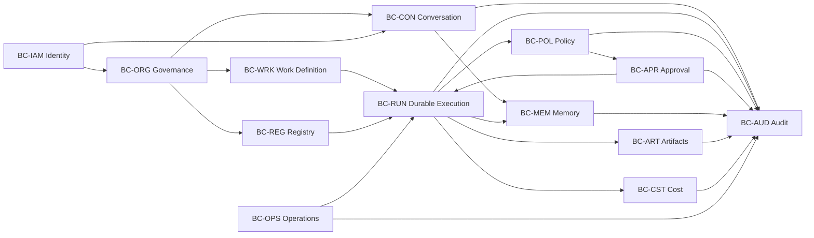
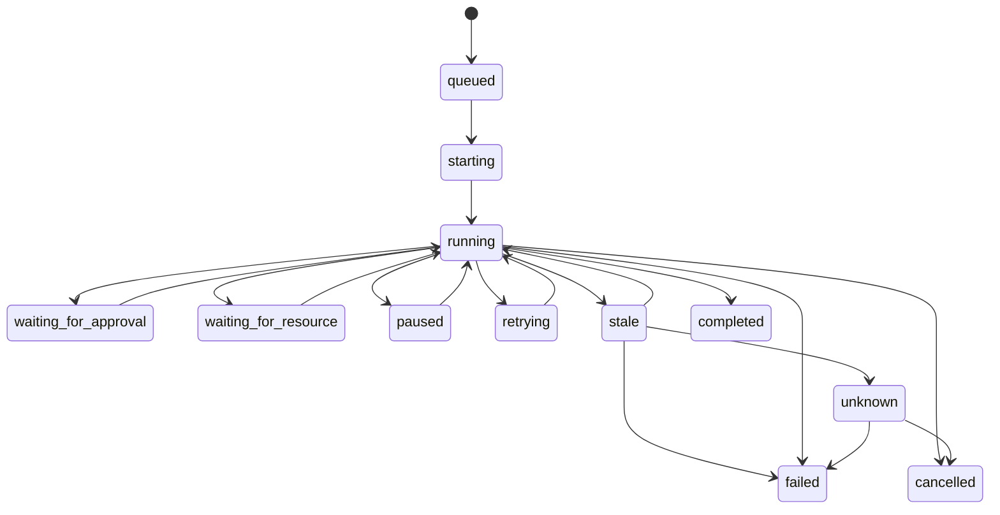

# DDD-001 — Agent OS Domain Model

> **Status: Draft.** This document defines the proposed domain model and bounded contexts for the first Agent OS MVP. It does not prescribe database tables, framework classes, API payloads, or implementation technology. Detailed schemas belong in `DAT-001`, `DCT-001`, and the relevant contracts.

## 1. Document purpose

This document defines the core business concepts of Agent OS.

It establishes:

- the domain vision;
- subdomains and bounded contexts;
- aggregate roots;
- entities;
- value objects;
- domain services;
- domain events;
- invariants;
- lifecycle rules;
- ownership boundaries;
- context relationships;
- terminology;
- traceability to requirements and architecture.

The model is designed to keep Agent OS:

- provider-neutral;
- workspace-centered;
- durable;
- approval-governed;
- evidence-backed;
- recoverable;
- secure by default;
- suitable for local-first deployment.

## 2. Domain vision

Agent OS is a governed operating environment in which authorized people define bounded work, delegate execution to approved agent runtimes and tools, supervise durable runs, approve consequential actions, retain outputs and memory with provenance, and reconstruct what happened from evidence.

The core domain problem is not merely “running AI.”

The core domain problem is:

> **Safely converting human intent into bounded, observable, durable, attributable, and recoverable agent-assisted work.**

## 3. Domain language principles

1. A **Task** expresses intended work.
2. A **Run** is one durable execution of one immutable task snapshot.
3. A **Step** is a meaningful unit within a run.
4. An **Attempt** is one execution attempt of a step.
5. An **Action Proposal** describes an intended side effect before execution.
6. An **Approval** authorizes one exact attempt, not a broad promise.
7. A **Capability** describes what a runtime or tool can technically do.
8. A **Permission Grant** defines what an identity may do.
9. A connected capability is not a permission.
10. An **Artifact** is a retained output with provenance and lifecycle.
11. A **Memory Record** is governed retained context, not hidden truth.
12. An **Audit Event** records significant facts or reports.
13. An **Execution Receipt** summarizes evidence for an execution.
14. **Unknown** is a meaningful state.
15. A **Workspace** is the principal operational and isolation boundary.

## 4. Subdomain classification

| Subdomain | Type | Reason |
|---|---|---|
| Work Definition and Durable Execution | Core | Central competitive and governance capability |
| Autonomy, Policy, and Approval | Core | Determines safe delegated authority |
| Agent and Capability Integration | Core | Enables provider-neutral runtimes |
| Evidence, Provenance, and Audit | Core | Enables trust and reconstruction |
| Workspace Governance | Core/Supporting | Primary isolation and operational boundary |
| Memory and Knowledge | Supporting/Core differentiator | Important for continuity and governed context |
| Artifacts | Supporting | Retains reviewable outputs |
| Usage, Cost, and Budgets | Supporting | Makes consumption visible and bounded |
| Identity and Access | Generic/Supporting | Essential but should use proven patterns |
| Operations and Recovery | Supporting | Required for local pilot viability |
| Observability | Generic/Supporting | Supports operations, not business authority |
| External Business Integration | Future Supporting | Read-only first, outside MVP core |

## 5. Proposed bounded contexts

| Context ID | Bounded Context | Primary responsibility |
|---|---|---|
| `BC-ORG` | Organization and Workspace Governance | Organization, workspaces, projects, membership, roles |
| `BC-CON` | Conversation and Interaction | Conversations, messages, participants, sharing, visibility, capture boundary |
| `BC-IAM` | Identity and Access | Human/workload identity, session, effective authority |
| `BC-REG` | Registry and Capability | Agents, adapters, models, tools, capabilities, health |
| `BC-WRK` | Work Definition | Tasks, task snapshots, expected outcomes, limits |
| `BC-RUN` | Durable Execution | Runs, steps, attempts, checkpoints, recovery |
| `BC-POL` | Policy and Autonomy | Action classification, grants, decisions, revocation |
| `BC-APR` | Human Approval | Requests, decisions, expiry, invalidation, consumption |
| `BC-MEM` | Memory and Knowledge | Governed memory, sources, verification, retrieval |
| `BC-ART` | Artifact Management | Artifact metadata, integrity, lifecycle, versions |
| `BC-AUD` | Audit and Evidence | Audit events, receipts, evidence gaps, exports |
| `BC-CST` | Usage, Cost, and Budget | Usage events, cost records, attribution, budgets |
| `BC-OPS` | Operations and Recovery | Health, backup, restore, operational state |

## 6. Context map



## 7. Context relationship types

| Upstream | Downstream | Relationship |
|---|---|---|
| `BC-IAM` | All contexts | Published identity and authorization context |
| `BC-ORG` | All workspace-scoped contexts | Published workspace/project/membership references |
| `BC-CON` | `BC-MEM`, `BC-ART`, `BC-AUD`, `BC-RUN` | Conversation scope, message provenance, sharing, and correlation references |
| `BC-REG` | `BC-WRK`, `BC-RUN`, `BC-POL` | Published agent/model/tool capability contracts |
| `BC-WRK` | `BC-RUN` | Task Snapshot as published language |
| `BC-POL` | `BC-RUN`, `BC-APR` | Policy Decision as published language |
| `BC-APR` | `BC-RUN` | Approval Authorization as published language |
| `BC-RUN` | `BC-ART`, `BC-MEM`, `BC-AUD`, `BC-CST` | Run/Step identity and events |
| `BC-ART` | `BC-AUD` | Artifact lifecycle events |
| `BC-MEM` | `BC-AUD` | Memory lifecycle events |
| `BC-CST` | `BC-RUN`, `BC-AUD` | Budget status and usage attribution |
| `BC-OPS` | All contexts | Health/recovery state, not business authority |

## 8. Shared kernel policy

The shared kernel must remain small.

Permitted shared concepts:

- `OrganizationId`;
- `WorkspaceId`;
- `ProjectId`;
- `IdentityId`;
- `TaskId`;
- `RunId`;
- `StepId`;
- `ApprovalRequestId`;
- `ArtifactId`;
- `MemoryRecordId`;
- `CorrelationId`;
- `Classification`;
- `LifecycleTimestamp`;
- `Money`;
- `Duration`;
- `Version`;
- `EvidenceReference`.

Not permitted as a shared mutable model:

- full `Task`;
- full `Run`;
- full `Approval`;
- full `Artifact`;
- full identity/role objects;
- provider-specific runtime objects.

## 9. `BC-ORG — Organization and Workspace Governance`

### Purpose

Provide the durable organizational and isolation structure for all work.

### Aggregate roots

- `Organization`;
- `Workspace`;
- `Project`.

### Entities

- `WorkspaceMembership`;
- `RoleAssignment`;
- `WorkspacePolicyProfileReference`.

### Value objects

- `OrganizationName`;
- `WorkspaceName`;
- `WorkspacePurpose`;
- `ProjectName`;
- `WorkspaceClassification`;
- `MembershipStatus`;
- `RoleCode`;
- `WorkspaceScope`.

### Domain services

- `WorkspaceAuthorizationService`;
- `OwnershipTransferService`;
- `WorkspaceIsolationValidator`.

### Domain events

- `OrganizationCreated`;
- `WorkspaceCreated`;
- `WorkspaceArchived`;
- `ProjectCreated`;
- `ProjectArchived`;
- `MemberAdded`;
- `MemberRemoved`;
- `RoleAssigned`;
- `RoleChanged`;
- `WorkspaceOwnerTransferred`.

## 10. Organization aggregate

### Root

`Organization`

### Core attributes

- `organization_id`;
- `name`;
- `purpose`;
- `status`;
- `created_at`;
- `created_by`;
- `policy_profile_reference`;
- `version`.

### Invariants

1. The MVP has one active organization context.
2. The organization must have at least one platform-administration authority.
3. Organization status changes are auditable.
4. Organization identity is stable and not reused.
5. Public tenant onboarding is not supported.

### Commands

- `CreateOrganization`;
- `UpdateOrganizationMetadata`;
- `ChangeOrganizationStatus`.

## 11. Workspace aggregate

### Root

`Workspace`

### Core attributes

- `workspace_id`;
- `organization_id`;
- `name`;
- `purpose`;
- `classification`;
- `status`;
- `owner_identity_ids`;
- `policy_profile_reference`;
- `created_at`;
- `version`.

### Child entities

- `WorkspaceMembership`;
- `RoleAssignment`.

### Invariants

1. A workspace belongs to exactly one organization.
2. A workspace has at least one active owner.
3. A member must exist before a workspace role is assigned.
4. The last owner cannot be removed or demoted without transfer.
5. A workspace cannot read or write another workspace’s protected records.
6. Workspace classification constrains provider, tool, memory, artifact, and export behavior.
7. Archived workspaces cannot start new runs.
8. Workspace identifiers cannot be reassigned.

### Commands

- `CreateWorkspace`;
- `UpdateWorkspace`;
- `ArchiveWorkspace`;
- `AddWorkspaceMember`;
- `RemoveWorkspaceMember`;
- `AssignWorkspaceRole`;
- `TransferWorkspaceOwnership`.

## 12. Project aggregate

### Root

`Project`

### Attributes

- `project_id`;
- `workspace_id`;
- `name`;
- `purpose`;
- `status`;
- `created_at`;
- `created_by`;
- `version`.

### Invariants

1. A project belongs to exactly one workspace.
2. A project cannot override workspace security policy.
3. A project cannot move between workspaces in the MVP.
4. Archived projects retain tasks, runs, artifacts, and audit history.
5. New tasks cannot be created in an archived project unless explicitly restored.

## 13. `BC-IAM — Identity and Access`

### Purpose

Represent authenticated actors and determine effective authority.

### Aggregate roots

- `Identity`;
- `Session`;
- `DelegatedAuthority`.

### Identity types

- `HumanIdentity`;
- `AgentIdentity`;
- `WorkerIdentity`;
- `AdapterIdentity`;
- `IntegrationIdentity`.

### Value objects

- `IdentityType`;
- `AuthenticationMethod`;
- `SessionAssurance`;
- `Permission`;
- `AuthorityScope`;
- `AuthorityExpiry`.

### Invariants

1. Only a human identity can satisfy human approval requirements.
2. Workload identities cannot convert themselves into human identities.
3. Authentication does not imply workspace membership.
4. Workspace role does not imply global platform administration.
5. Expired/revoked authority cannot be restored through an old session.
6. Identity type is immutable without a controlled migration.
7. Security-relevant identity changes are audited.

Detailed IAM rules belong in `IAM-001`.

## 14. `BC-REG — Registry and Capability`

### Purpose

Represent available agents, adapters, models, tools, and their validated capabilities.

### Aggregate roots

- `AgentRegistration`;
- `ModelProfile`;
- `ToolRegistration`.

### Entities

- `CapabilityDeclaration`;
- `CapabilityValidation`;
- `WorkspaceEnablement`;
- `HealthObservation`;
- `ProviderBinding`.

### Value objects

- `AdapterType`;
- `CapabilityCode`;
- `CapabilityState`;
- `HealthState`;
- `ProviderModelId`;
- `ToolTargetClass`;
- `VersionRange`;
- `ValidationEvidenceReference`.

### Domain events

- `AgentRegistered`;
- `AgentValidated`;
- `AgentDisabled`;
- `CapabilityDeclared`;
- `CapabilityValidationChanged`;
- `ModelProfileCreated`;
- `ModelProfileValidated`;
- `ToolRegistered`;
- `ToolWorkspaceEnablementChanged`.

## 15. AgentRegistration aggregate

### Root

`AgentRegistration`

### Attributes

- `agent_registration_id`;
- `adapter_type`;
- `display_name`;
- `adapter_identity_id`;
- `version`;
- `configuration_reference`;
- `registration_state`;
- `health_state`;
- `capability_declarations`;
- `workspace_enablements`;
- `last_validation`;
- `status`.

### Invariants

1. Registered is not equivalent to reachable.
2. Reachable is not equivalent to validated.
3. Validated capability is versioned and evidence-backed.
4. Unknown capability remains unknown.
5. Disabling an adapter blocks future dispatch but retains history.
6. Workspace enablement does not grant tool or data permissions.
7. An adapter cannot modify its own platform permissions.

## 16. ModelProfile aggregate

### Root

`ModelProfile`

### Attributes

- `model_profile_id`;
- `logical_name`;
- `provider_id`;
- `provider_model_id`;
- `capability_intent`;
- `data_class_rules`;
- `context_limits`;
- `output_limits`;
- `budget_policy_reference`;
- `fallback_policy`;
- `secret_reference`;
- `validation_state`;
- `workspace_enablements`;
- `version`.

### Invariants

1. A configured profile is not necessarily validated.
2. Actual provider/model use must be recorded separately when known.
3. Fallback is explicit and versioned.
4. Unknown actual model cannot be replaced with configured model.
5. Prohibited data classes block provider use.
6. Raw secret values are not part of the aggregate.

## 17. ToolRegistration aggregate

### Root

`ToolRegistration`

### Attributes

- `tool_registration_id`;
- `tool_type`;
- `name`;
- `version`;
- `capabilities`;
- `side_effect_classes`;
- `configuration_reference`;
- `health_state`;
- `workspace_enablements`;
- `status`.

### Invariants

1. Registration grants no permission.
2. Capability describes technical ability, not authority.
3. Unknown side-effect class blocks execution.
4. Executable/plugin installation is not implied by registration.
5. Workspace enablement is narrower than global availability.

## 17A. `BC-CON — Conversation and Interaction`

### Purpose

Own conversations that cross an Agent OS interface or adapter boundary. External conversations that Agent OS never observes are not represented as captured Agent OS conversations.

### Aggregate root

- `Conversation`.

### Entities

- `ConversationMessage`;
- `ConversationParticipant`;
- `ConversationShare`;
- `ConversationAttachment`.

### Value objects

- `ConversationVisibility` (`private`, `project`, `workspace`);
- `ConversationRetentionProfile`;
- `ConversationScope`;
- `MessageRole`;
- `CaptureBoundary`.

### Invariants

1. Every conversation has one workspace and one owner.
2. Visibility defaults to `private`.
3. Workspace membership does not grant private-conversation access.
4. Sharing and revocation are explicit, scoped, and auditable.
5. A message belongs to exactly one conversation and preserves actor/provider provenance.
6. Derived memory, artifacts, indexes, previews, notifications, and exports cannot broaden source visibility implicitly.
7. Deletion and retention apply to messages, attachments, derivatives, and indexes according to policy.
8. Agent OS does not claim capture of conversations outside its interface or adapter boundary.

### Domain events

- `ConversationCreated`;
- `ConversationMessageRecorded`;
- `ConversationShared`;
- `ConversationShareRevoked`;
- `ConversationArchived`;
- `ConversationDeletionRequested`;
- `ConversationDeleted`;
- `ConversationCaptureUnavailable`.

## 18. `BC-WRK — Work Definition`

### Purpose

Define bounded work independently from one execution attempt.

### Aggregate root

- `Task`.

### Entities

- `TaskSnapshot`;
- `ExpectedArtifact`;
- `ResourceConstraint`;
- `ExecutionLimit`;
- `RoutingPreference`.

### Value objects

- `DesiredOutcome`;
- `TaskState`;
- `DataClassification`;
- `ResourceScope`;
- `TimeLimit`;
- `StepLimit`;
- `RetryLimit`;
- `CostLimit`;
- `ExpectedArtifactType`;
- `RoutingPolicyReference`.

### Domain events

- `TaskCreated`;
- `TaskUpdated`;
- `TaskSnapshotCreated`;
- `TaskReadinessEvaluated`;
- `TaskMarkedReady`;
- `TaskBlocked`;
- `TaskActivated`;
- `TaskCompleted`;
- `TaskCancelled`;
- `TaskArchived`.

## 19. Task aggregate

### Root

`Task`

### Attributes

- `task_id`;
- `workspace_id`;
- `project_id`;
- `title`;
- `desired_outcome`;
- `state`;
- `current_snapshot_id`;
- `created_by`;
- `created_at`;
- `version`.

### Invariants

1. A task belongs to one workspace.
2. A task may belong to zero or one project.
3. A task narrative does not grant permissions.
4. A ready task must have a valid current snapshot.
5. An active task has at least one active or completed run.
6. A completed or archived task retains run history.
7. A material change creates a new snapshot.
8. An archived project/workspace cannot receive a newly ready task.

### State model

```text
draft
→ ready
→ active
→ completed
→ archived

draft / ready / active
→ blocked

draft / ready / blocked / active
→ cancelled
```

## 20. TaskSnapshot entity

### Purpose

Freeze the exact definition used for readiness, run creation, policy, and approval.

### Attributes

- `task_snapshot_id`;
- `task_id`;
- `snapshot_number`;
- `desired_outcome`;
- `resource_scopes`;
- `data_classification`;
- `agent_preference`;
- `model_profile_reference`;
- `tool_capability_requests`;
- `time_limit`;
- `step_limit`;
- `retry_limit`;
- `cost_limit`;
- `expected_artifacts`;
- `created_at`;
- `created_by`;
- `content_hash`.

### Invariants

1. A snapshot is immutable after use by a run.
2. Every run references exactly one task snapshot.
3. Material changes create another snapshot.
4. Snapshot hash is stable for the same normalized content.
5. A snapshot cannot reference another workspace’s resource.

## 21. `BC-RUN — Durable Execution`

### Purpose

Coordinate and preserve one bounded execution of a task snapshot.

### Aggregate root

- `Run`.

### Entities

- `RunStep`;
- `RunAttempt`;
- `Checkpoint`;
- `WaitingCondition`;
- `SideEffectRecord`;
- `DispatchLease`.

### Value objects

- `RunState`;
- `StepState`;
- `AttemptState`;
- `FailureClass`;
- `SideEffectCertainty`;
- `CheckpointReference`;
- `ExecutionBounds`;
- `CorrelationId`;
- `IdempotencyKey`;
- `StateReason`.

### Domain services

- `RunPreflightService`;
- `RetryEligibilityService`;
- `ResumeSafetyService`;
- `CancellationService`;
- `StateReconciliationService`;
- `DispatchLeaseService`.

### Domain events

- `RunCreated`;
- `RunPreflightPassed`;
- `RunPreflightBlocked`;
- `RunDispatched`;
- `RunStateChanged`;
- `StepCreated`;
- `AttemptStarted`;
- `AttemptCompleted`;
- `AttemptFailed`;
- `RunWaitingForApproval`;
- `RunCancelled`;
- `RunBecameStale`;
- `RunStateUnknown`;
- `RunResumed`;
- `RunCompleted`;
- `RunFailed`.

## 22. Run aggregate

### Attributes

- `run_id`;
- `workspace_id`;
- `project_id`;
- `task_id`;
- `task_snapshot_id`;
- `requested_by`;
- `selected_agent_registration_id`;
- `selected_model_profile_id`;
- `state`;
- `state_reason`;
- `execution_bounds`;
- `policy_snapshot_reference`;
- `created_at`;
- `started_at`;
- `ended_at`;
- `last_reliable_evidence_at`;
- `receipt_status`;
- `version`.

### Invariants

1. A run is persisted before external dispatch.
2. A run references one immutable task snapshot.
3. A run belongs to the same workspace as its task snapshot.
4. A run cannot exceed its active execution bounds.
5. A terminal run cannot return to running without a new governed recovery model.
6. Unknown is not completed or failed.
7. A cancelled run retains completed side effects.
8. Retry and resume preserve lineage.
9. A protected attempt must satisfy current policy.
10. A consequential attempt requires valid approval.
11. Approval consumption and dispatch authorization are one protected operation.
12. A run cannot silently change adapter/model after creation.

## 23. Run state model



Final guards belong in `RUN-001`.

## 24. RunStep entity

### Attributes

- `step_id`;
- `run_id`;
- `step_type`;
- `sequence_or_dependency`;
- `state`;
- `capability`;
- `normalized_target`;
- `approval_requirement`;
- `created_at`;
- `completed_at`;
- `version`.

### Invariants

1. A step belongs to exactly one run.
2. A step cannot use another workspace’s resource.
3. Attempt numbers are unique within a step.
4. A step marked completed has supporting result evidence.
5. A step with unknown side-effect certainty cannot retry automatically.
6. Consequential step parameters are immutable after approval request creation.

## 25. RunAttempt entity

### Attributes

- `attempt_id`;
- `step_id`;
- `attempt_number`;
- `idempotency_key`;
- `state`;
- `started_at`;
- `ended_at`;
- `adapter_session_reference`;
- `approval_consumption_reference`;
- `result_reference`;
- `failure_class`;
- `side_effect_certainty`.

### Invariants

1. Attempt numbers are monotonic.
2. One-time approval consumption maps to one attempt.
3. An idempotency key cannot authorize two protected effects.
4. An attempt is never overwritten by a retry.
5. Unknown side effects remain explicit.
6. A retry creates a new attempt.

## 26. Checkpoint entity

### Attributes

- `checkpoint_id`;
- `run_id`;
- `step_id`;
- `adapter_reference`;
- `content_reference`;
- `integrity_hash`;
- `created_at`;
- `resume_capability`;
- `expiry`.

### Invariants

1. Checkpoint integrity must be verifiable.
2. A checkpoint cannot broaden permissions.
3. Resume revalidates current policy, budget, resource state, and approval.
4. Expired or corrupt checkpoints cannot be used.
5. A checkpoint is not proof that external side effects are absent.

## 27. `BC-POL — Policy and Autonomy`

### Purpose

Classify proposed actions and decide whether they may proceed.

### Aggregate roots

- `PolicySet`;
- `PermissionGrant`;
- `EmergencyStop`.

### Entities

- `PolicyRule`;
- `PolicyVersion`;
- `GrantConstraint`;
- `Revocation`.

### Value objects

- `ActionClass`;
- `RiskClass`;
- `AutonomyLevel`;
- `PolicyDecision`;
- `NormalizedTarget`;
- `ResourceScope`;
- `NetworkScope`;
- `DataClassRule`;
- `DecisionReason`;
- `PolicyInputHash`;
- `Expiry`.

### Domain services

- `PolicyEvaluationService`;
- `ActionNormalizationService`;
- `RiskClassificationService`;
- `GrantResolutionService`;
- `RevocationPropagationService`.

### Domain events

- `PolicyPublished`;
- `PolicyRetired`;
- `PermissionGranted`;
- `PermissionRevoked`;
- `ActionEvaluated`;
- `ActionDenied`;
- `ApprovalRequired`;
- `EmergencyStopActivated`;
- `EmergencyStopReleased`.

## 28. PolicySet aggregate

### Attributes

- `policy_set_id`;
- `scope`;
- `version`;
- `status`;
- `effective_at`;
- `rules`;
- `published_by`;
- `supersedes`;
- `content_hash`.

### Invariants

1. Published policy versions are immutable.
2. Exactly one applicable active version exists per governed scope and precedence level.
3. Platform denial cannot be overridden by workspace policy.
4. Workspace policy may narrow, not broaden, platform limits.
5. Unknown action classes do not execute.
6. Policy decisions are reproducible from versioned normalized inputs where practical.

## 29. PermissionGrant aggregate

### Attributes

- `permission_grant_id`;
- `grantee_identity_id`;
- `workspace_id`;
- `capability`;
- `resource_scope`;
- `data_classes`;
- `network_scope`;
- `cost_limit`;
- `time_limit`;
- `attempt_limit`;
- `issued_by`;
- `issued_at`;
- `expires_at`;
- `status`.

### Invariants

1. A grant never exceeds the issuer’s delegable authority.
2. A grant is scoped to one organization/workspace unless explicitly platform-level.
3. Expired/revoked grants cannot authorize future work.
4. A grant cannot authorize an MVP-prohibited action.
5. An agent cannot create or expand its own grant.
6. Standing grants are prohibited for defined critical classes.

## 30. EmergencyStop aggregate

### Attributes

- `emergency_stop_id`;
- `scope`;
- `reason`;
- `activated_by`;
- `activated_at`;
- `status`;
- `released_by`;
- `released_at`.

### Invariants

1. Activation blocks future protected dispatch in scope.
2. Existing evidence remains.
3. Release requires authorized human action.
4. Prompt or agent output cannot release emergency stop.
5. Emergency stop does not imply rollback of completed effects.

## 31. `BC-APR — Human Approval`

### Purpose

Represent informed human decisions for exact consequential actions.

### Aggregate root

- `ApprovalRequest`.

### Entities

- `ApprovalDecision`;
- `ApprovalConsumption`;
- `RevisionRequest`.

### Value objects

- `ActionFingerprint`;
- `ApprovalState`;
- `ApprovalAuthority`;
- `IndependenceLevel`;
- `ApprovalExpiry`;
- `RiskSummary`;
- `ExpectedEffect`;
- `PreviewReference`.

### Domain services

- `ApproverEligibilityService`;
- `ApprovalValidityService`;
- `ApprovalConsumptionService`;
- `MaterialChangeDetector`.

### Domain events

- `ApprovalRequested`;
- `ApprovalOpened`;
- `ApprovalGranted`;
- `ApprovalRejected`;
- `ApprovalRevisionRequested`;
- `ApprovalExpired`;
- `ApprovalInvalidated`;
- `ApprovalConsumed`;
- `ApprovalCancelled`.

## 32. ApprovalRequest aggregate

### Attributes

- `approval_request_id`;
- `workspace_id`;
- `requester_identity_id`;
- `task_id`;
- `run_id`;
- `step_id`;
- `action_class`;
- `normalized_target`;
- `parameters`;
- `action_fingerprint`;
- `risk_class`;
- `policy_reason`;
- `expected_effects`;
- `preview_reference`;
- `required_authority`;
- `independence_level`;
- `expires_at`;
- `state`;
- `version`.

### Invariants

1. An approval request binds to one exact normalized action.
2. Missing target or parameters prevents approval.
3. Only eligible human identities can approve.
4. Required independence must be satisfied.
5. Expired, cancelled, rejected, or invalidated requests cannot be consumed.
6. Material action change invalidates the request.
7. One approval consumption authorizes at most one attempt.
8. Approval does not prove execution success.
9. An agent cannot approve.
10. A requester cannot satisfy `I2`.

## 33. Approval lifecycle

```text
requested
→ under_review
→ approved
→ consumed

requested / under_review
→ rejected
→ revision_requested
→ expired
→ cancelled

approved
→ invalidated
→ expired
→ consumed
```

## 34. ApprovalDecision entity

### Attributes

- `approval_decision_id`;
- `approval_request_id`;
- `decision`;
- `decided_by`;
- `authority_used`;
- `rationale`;
- `decided_at`;
- `request_version`;
- `policy_version`.

### Invariants

1. Decision references the exact request version.
2. Human identity and authority are revalidated.
3. A decision is append-only.
4. Revised proposals create a new request.
5. Rejection remains visible.

## 35. ApprovalConsumption entity

### Attributes

- `approval_consumption_id`;
- `approval_request_id`;
- `attempt_id`;
- `consumed_at`;
- `action_fingerprint`;
- `policy_version`;
- `result_reference`.

### Invariants

1. One approved request has at most one active consumption.
2. Consumption and attempt authorization are atomic or equivalent.
3. Changed fingerprint blocks consumption.
4. Replay is denied.
5. Failed execution does not restore consumed approval automatically.

## 36. `BC-MEM — Memory and Knowledge`

### Purpose

Retain useful context while preserving source, scope, authority, and lifecycle.

### Aggregate root

- `MemoryRecord`.

### Entities

- `MemoryVersion`;
- `SourceReference`;
- `VerificationRecord`;
- `RetentionRuleReference`;
- `RetrievalObservation`.

### Value objects

- `MemoryType`;
- `MemoryAuthorityState`;
- `Confidence`;
- `DataClassification`;
- `RetentionState`;
- `ContentReference`;
- `SourceType`;
- `RetrievalReason`.

### Domain services

- `MemoryIngestionPolicyService`;
- `MemoryRetrievalService`;
- `MemoryConflictService`;
- `MemoryCorrectionService`;
- `MemoryRetentionService`.

### Domain events

- `MemoryProposed`;
- `MemoryStored`;
- `MemoryWriteDenied`;
- `MemoryVerified`;
- `MemoryCorrected`;
- `MemorySuperseded`;
- `MemoryExpired`;
- `MemoryDeleted`;
- `MemoryRetrieved`;
- `MemoryConflictDetected`.

## 37. MemoryRecord aggregate

### Attributes

- `memory_record_id`;
- `workspace_id`;
- `project_id`;
- `memory_type`;
- `source_references`;
- `producer_identity_id`;
- `task_id`;
- `run_id`;
- `content_reference`;
- `classification`;
- `authority_state`;
- `confidence`;
- `retention_state`;
- `active_version_id`;
- `created_at`;
- `version`.

### Invariants

1. A memory record belongs to one workspace.
2. Every record has at least one source reference.
3. Generated content remains labeled generated/inferred.
4. Secret values cannot be ordinary memory.
5. Deleted/expired records are not active retrieval candidates.
6. Authoritative promotion requires governed authority.
7. Correction creates a new version and preserves lineage.
8. Workspace filtering precedes relevance retrieval.
9. Retrieval index state cannot override transactional lifecycle state.
10. Conflicting authoritative sources remain visible.

## 38. Memory authority states

```text
temporary
generated
inferred
user_asserted
verified
authoritative_reference
superseded
disputed
expired
deleted
```

The final controlled vocabulary belongs in `MEM-001` and `DCT-001`.

## 39. `BC-ART — Artifact Management`

### Purpose

Retain outputs with provenance, integrity, classification, and lifecycle.

### Aggregate root

- `Artifact`.

### Entities

- `ArtifactVersion`;
- `ArtifactContent`;
- `ArtifactReview`;
- `ArtifactRelationship`.

### Value objects

- `ArtifactType`;
- `MediaType`;
- `IntegrityHash`;
- `ArtifactLifecycleState`;
- `StorageReference`;
- `PreviewState`;
- `ArtifactClassification`;
- `DerivativeRelation`.

### Domain services

- `ArtifactIntegrityService`;
- `ArtifactPreviewPolicyService`;
- `ArtifactLifecycleService`;
- `ArtifactExportService`;
- `ArtifactReconciliationService`.

### Domain events

- `ArtifactProposed`;
- `ArtifactStored`;
- `ArtifactStoragePartial`;
- `ArtifactIntegrityFailed`;
- `ArtifactSubmittedForReview`;
- `ArtifactAccepted`;
- `ArtifactRejected`;
- `ArtifactSuperseded`;
- `ArtifactArchived`;
- `ArtifactDeleted`;
- `EvidenceExportCreated`.

## 40. Artifact aggregate

### Attributes

- `artifact_id`;
- `workspace_id`;
- `project_id`;
- `task_id`;
- `run_id`;
- `step_id`;
- `producer_identity_id`;
- `artifact_type`;
- `media_type`;
- `classification`;
- `lifecycle_state`;
- `active_version_id`;
- `created_at`;
- `version`.

### Invariants

1. An artifact belongs to one workspace.
2. A complete artifact has metadata and verified content reference.
3. Integrity mismatch blocks trusted/accepted use.
4. Preview never executes active content.
5. Accepted state requires authorized review where policy requires.
6. Superseded artifacts link to a replacement.
7. Deletion follows retention and audit policy.
8. Artifact provenance cannot be removed by lifecycle transition.
9. External export is a new governed artifact/action.
10. Generated output is not automatically authoritative business data.

## 41. Artifact lifecycle

```text
generated
→ under_review
→ accepted | rejected
→ superseded | archived | deleted | unavailable
```

## 42. `BC-AUD — Audit and Evidence`

### Purpose

Preserve attributable, correlated evidence about significant actions and outcomes.

### Aggregate roots

- `AuditStream`;
- `ExecutionReceipt`;
- `EvidenceExport`.

### Entities

- `AuditEvent`;
- `EvidenceGap`;
- `ReceiptEntry`;
- `RedactionRecord`.

### Value objects

- `EventType`;
- `EventResult`;
- `EvidenceType`;
- `EvidenceCompleteness`;
- `CorrelationId`;
- `SchemaVersion`;
- `RedactionReason`;
- `IntegrityProofReference`.

### Domain services

- `AuditIngestionService`;
- `ReceiptGenerationService`;
- `EvidenceGapDetectionService`;
- `EvidenceExportService`;
- `RedactionService`.

### Domain events

The context stores events from all other contexts and emits:

- `AuditEventAccepted`;
- `AuditEventRejected`;
- `EvidenceGapRecorded`;
- `ExecutionReceiptGenerated`;
- `EvidenceExportPrepared`;
- `EvidenceExportFailed`.

## 43. AuditStream aggregate

### Purpose

Define one correlated stream for a workspace/task/run or another controlled scope.

### Invariants

1. Audit events are append-oriented.
2. Ordinary users cannot mutate prior events.
3. Every security-relevant event has identity, workspace, timestamp, result, and correlation where applicable.
4. Raw secrets are prohibited.
5. Missing evidence is explicit.
6. Provider reports and platform facts are distinguishable.
7. Audit read scope follows workspace authorization.
8. Evidence export cannot include unrelated records.

## 44. AuditEvent entity

### Attributes

- `audit_event_id`;
- `schema_version`;
- `event_type`;
- `occurred_at`;
- `recorded_at`;
- `actor_identity_id`;
- `actor_identity_type`;
- `organization_id`;
- `workspace_id`;
- `project_id`;
- `task_id`;
- `run_id`;
- `step_id`;
- `correlation_id`;
- `target_reference`;
- `result`;
- `reason`;
- `evidence_type`;
- `payload_reference`;
- `redaction_state`;
- `integrity_reference`.

### Invariants

1. Event ID is unique.
2. Event schema is versioned.
3. Event result does not silently change.
4. Corrections create a new explanatory event.
5. Secret values are excluded or redacted.
6. Missing source timestamps are marked.
7. Unauthorized workspace data is not queryable.

## 45. ExecutionReceipt aggregate

### Attributes

- `execution_receipt_id`;
- `workspace_id`;
- `task_id`;
- `run_id`;
- `receipt_type`;
- `task_snapshot_reference`;
- `adapter_model_tool_references`;
- `policy_decision_references`;
- `approval_references`;
- `step_summary`;
- `artifact_references`;
- `usage_cost_references`;
- `known_side_effects`;
- `evidence_gaps`;
- `terminal_state`;
- `generated_at`;
- `schema_version`.

### Invariants

1. Receipt summarizes but does not replace underlying evidence.
2. Missing evidence is listed.
3. Approval and execution outcomes remain separate.
4. Unknown effects remain unknown.
5. Receipt schema is versioned.
6. Receipt belongs to the run’s workspace.

## 46. `BC-CST — Usage, Cost, and Budget`

### Purpose

Normalize consumption, attribute it to work, and enforce approved limits.

### Aggregate roots

- `Budget`;
- `UsageLedger`;
- `CostReconciliation`.

### Entities

- `UsageEvent`;
- `CostRecord`;
- `BudgetReservation`;
- `ThresholdEvent`;
- `ReconciliationItem`.

### Value objects

- `UsageMetric`;
- `UsageQuantity`;
- `Money`;
- `Currency`;
- `PricingVersion`;
- `CostSourceType`;
- `CostFreshness`;
- `AttributionScope`;
- `BudgetPeriod`.

### Domain services

- `UsageNormalizationService`;
- `CostCalculationService`;
- `CostAttributionService`;
- `BudgetEvaluationService`;
- `CostReconciliationService`.

### Domain events

- `UsageRecorded`;
- `CostCalculated`;
- `CostReported`;
- `CostPending`;
- `CostUnattributed`;
- `BudgetReserved`;
- `BudgetThresholdReached`;
- `BudgetExceeded`;
- `CostMismatchDetected`.

## 47. Budget aggregate

### Attributes

- `budget_id`;
- `scope_type`;
- `scope_id`;
- `period`;
- `currency`;
- `soft_limit`;
- `hard_limit`;
- `spent_amount`;
- `reserved_amount`;
- `status`;
- `version`.

### Invariants

1. Budget currency and period are explicit.
2. Hard limit cannot be exceeded by an authorized start when cost can be determined.
3. Unknown cost follows the configured conservative policy.
4. Budget changes are audited and approval-governed.
5. Workspace budget cannot be silently bypassed by a task.
6. Provider cost and business profit are separate concepts.

## 48. UsageEvent entity

### Attributes

- `usage_event_id`;
- `source_type`;
- `source_reference`;
- `workspace_id`;
- `project_id`;
- `task_id`;
- `run_id`;
- `step_id`;
- `provider_id`;
- `model_id`;
- `tool_id`;
- `metric`;
- `quantity`;
- `occurred_at`;
- `status`;
- `deduplication_key`.

### Invariants

1. Duplicate usage events do not double count.
2. Missing attribution is explicit.
3. Provider-reported and calculated values are distinguishable.
4. Unknown cost is not zero.
5. Usage belongs to one workspace.
6. Cost source and freshness are retained.

## 49. `BC-OPS — Operations and Recovery`

### Purpose

Represent operational health, backup, restore, and controlled maintenance.

### Aggregate roots

- `ComponentHealth`;
- `BackupOperation`;
- `RestoreOperation`;
- `MaintenanceWindow`.

### Entities

- `HealthObservation`;
- `BackupManifest`;
- `BackupComponentResult`;
- `RestoreComponentResult`;
- `OperationalIncidentReference`.

### Value objects

- `HealthState`;
- `ReadinessState`;
- `BackupState`;
- `RestoreState`;
- `RecoveryPoint`;
- `RecoveryDuration`;
- `BuildIdentity`;
- `SchemaIdentity`.

### Domain services

- `HealthEvaluationService`;
- `BackupCoordinator`;
- `RestoreCoordinator`;
- `RecoveryReconciliationService`;
- `MaintenanceModeService`.

### Domain events

- `ComponentHealthChanged`;
- `BackupStarted`;
- `BackupCompleted`;
- `BackupPartial`;
- `BackupFailed`;
- `RestoreStarted`;
- `RestoreCompleted`;
- `RestorePartial`;
- `RestoreFailed`;
- `MaintenanceModeEntered`;
- `MaintenanceModeExited`.

## 50. ComponentHealth aggregate

### Attributes

- `component_health_id`;
- `component_id`;
- `registration_state`;
- `reachability_state`;
- `validation_state`;
- `readiness_state`;
- `last_observed_at`;
- `evidence_reference`;
- `limitations`;
- `version`.

### Invariants

1. Registered is distinct from reachable.
2. Reachable is distinct from validated.
3. Stale health is not current health.
4. Unknown health is not healthy.
5. Global health cannot hide a failed critical dependency.
6. Health observations identify source and time.

## 51. BackupOperation aggregate

### Attributes

- `backup_operation_id`;
- `requested_by`;
- `scope`;
- `started_at`;
- `completed_at`;
- `state`;
- `manifest_reference`;
- `component_results`;
- `integrity_result`;
- `target_reference`;
- `build_schema_identity`.

### Invariants

1. A backup is complete only if all required components are complete.
2. Manifest and integrity evidence are required.
3. Partial backup is not complete.
4. Backup scope and exclusions are explicit.
5. Secret handling follows separate policy.
6. Backup evidence is retained.

## 52. RestoreOperation aggregate

### Attributes

- `restore_operation_id`;
- `requested_by`;
- `approved_by`;
- `backup_reference`;
- `target_environment`;
- `maintenance_window_id`;
- `state`;
- `component_results`;
- `started_at`;
- `completed_at`;
- `recovery_duration`;
- `data_loss_summary`.

### Invariants

1. Restore requires valid exact approval.
2. Backup integrity and compatibility are validated first.
3. Restore occurs in maintenance mode.
4. Partial restore is not complete.
5. Derived indexes may be rebuilt only from authoritative retained data.
6. Recovery evidence and data loss are explicit.

## 53. Cross-context identifiers

| Identifier | Owning context |
|---|---|
| `OrganizationId` | `BC-ORG` |
| `WorkspaceId` | `BC-ORG` |
| `ProjectId` | `BC-ORG` |
| `IdentityId` | `BC-IAM` |
| `AgentRegistrationId` | `BC-REG` |
| `ModelProfileId` | `BC-REG` |
| `ToolRegistrationId` | `BC-REG` |
| `TaskId` | `BC-WRK` |
| `TaskSnapshotId` | `BC-WRK` |
| `RunId` | `BC-RUN` |
| `StepId` | `BC-RUN` |
| `AttemptId` | `BC-RUN` |
| `ApprovalRequestId` | `BC-APR` |
| `MemoryRecordId` | `BC-MEM` |
| `ArtifactId` | `BC-ART` |
| `AuditEventId` | `BC-AUD` |
| `ExecutionReceiptId` | `BC-AUD` |
| `BudgetId` | `BC-CST` |
| `UsageEventId` | `BC-CST` |
| `BackupOperationId` | `BC-OPS` |

Identifiers are stable, opaque, and not reused.

## 54. Core value objects

### `WorkspaceScope`

Contains:

- organization ID;
- workspace ID;
- optional project ID;
- classification context.

### `NormalizedTarget`

Represents the exact resource affected:

- repository and branch;
- normalized file path;
- database/resource record;
- external recipient;
- network destination;
- package/version;
- provider/model;
- tool capability.

### `ActionFingerprint`

A stable hash or equivalent over:

- action class;
- normalized target;
- parameters;
- content/diff reference;
- requester/executor context where required;
- policy-relevant version.

### `ExecutionBounds`

Contains:

- maximum duration;
- maximum steps;
- maximum attempts;
- maximum cost;
- maximum output;
- maximum resources;
- expiry.

### `EvidenceReference`

References:

- audit event;
- provider report;
- tool receipt;
- artifact;
- log/trace;
- external identifier;
- backup manifest.

### `SideEffectCertainty`

Controlled values:

- `none`;
- `known_not_started`;
- `known_completed`;
- `known_partial`;
- `failed_before_effect`;
- `unknown`.

## 55. Aggregate transaction boundaries

### Must remain within one protected transaction or equivalent

- create workspace and initial ownership;
- change membership/role while preserving last owner;
- create task snapshot;
- create run before dispatch;
- create approval request and put run into waiting state;
- record approval decision;
- consume approval and authorize one attempt;
- revoke permission and block future use;
- accept artifact lifecycle transition;
- reserve hard budget;
- enter restore maintenance mode.

### May use eventual consistency with reconciliation

- update dashboard aggregate;
- update search/vector index;
- generate cost summary;
- generate receipt after underlying events exist;
- propagate artifact preview;
- update health summary;
- rebuild retrieval indexes;
- prepare evidence export.

## 56. Domain event envelope

Every published domain event should include:

- event ID;
- event type;
- schema version;
- occurred time;
- recorded time;
- producer context;
- organization/workspace;
- aggregate type and ID;
- aggregate version;
- correlation ID;
- causation ID;
- actor identity/type where applicable;
- payload;
- classification;
- redaction state.

## 57. Domain event catalogue

### Governance

- `OrganizationCreated`;
- `WorkspaceCreated`;
- `MemberAdded`;
- `MemberRemoved`;
- `RoleChanged`.

### Registry

- `AgentRegistered`;
- `AgentValidated`;
- `ModelProfileValidated`;
- `ToolRegistered`;
- `CapabilityValidationChanged`.

### Work and execution

- `TaskCreated`;
- `TaskSnapshotCreated`;
- `TaskMarkedReady`;
- `RunCreated`;
- `RunDispatched`;
- `RunStateChanged`;
- `AttemptStarted`;
- `AttemptCompleted`;
- `RunBecameStale`;
- `RunResumed`.

### Policy and approval

- `ActionEvaluated`;
- `PermissionGranted`;
- `PermissionRevoked`;
- `ApprovalRequested`;
- `ApprovalGranted`;
- `ApprovalRejected`;
- `ApprovalInvalidated`;
- `ApprovalConsumed`;
- `EmergencyStopActivated`.

### Memory and artifacts

- `MemoryStored`;
- `MemoryCorrected`;
- `MemoryDeleted`;
- `ArtifactStored`;
- `ArtifactAccepted`;
- `ArtifactIntegrityFailed`;
- `ArtifactSuperseded`.

### Evidence, cost, operations

- `AuditEventAccepted`;
- `ExecutionReceiptGenerated`;
- `EvidenceGapRecorded`;
- `UsageRecorded`;
- `BudgetThresholdReached`;
- `CostMismatchDetected`;
- `BackupCompleted`;
- `RestoreCompleted`;
- `ComponentHealthChanged`.

## 58. Domain service catalogue

| Service | Context | Responsibility |
|---|---|---|
| `WorkspaceAuthorizationService` | `BC-ORG`/`BC-IAM` | Resolve authorized workspace action |
| `TaskReadinessService` | `BC-WRK` | Validate a snapshot for execution |
| `RunPreflightService` | `BC-RUN` | Verify current execution prerequisites |
| `RetryEligibilityService` | `BC-RUN` | Decide if retry is safe |
| `ResumeSafetyService` | `BC-RUN` | Decide if checkpoint resume is safe |
| `ActionNormalizationService` | `BC-POL` | Produce exact action and target |
| `PolicyEvaluationService` | `BC-POL` | Return policy decision |
| `ApproverEligibilityService` | `BC-APR` | Validate human authority and independence |
| `ApprovalConsumptionService` | `BC-APR` | Consume approval once |
| `MemoryRetrievalService` | `BC-MEM` | Scope-first governed retrieval |
| `MemoryConflictService` | `BC-MEM` | Detect source conflicts |
| `ArtifactIntegrityService` | `BC-ART` | Verify content integrity |
| `ArtifactPreviewPolicyService` | `BC-ART` | Decide safe preview |
| `ReceiptGenerationService` | `BC-AUD` | Build execution receipt |
| `BudgetEvaluationService` | `BC-CST` | Enforce soft/hard limits |
| `CostReconciliationService` | `BC-CST` | Compare provider and platform records |
| `BackupCoordinator` | `BC-OPS` | Create complete backup |
| `RestoreCoordinator` | `BC-OPS` | Restore and reconcile |

## 59. Anti-corruption layers

### Hermes ACL

Translates Hermes-specific concepts into:

- common capabilities;
- common run states;
- common artifact outputs;
- common errors;
- common usage evidence.

### Codex ACL

Translates Codex-specific concepts into:

- common task/run;
- worktree/repository targets;
- patches and test outputs;
- proposed Git actions;
- common status and evidence.

### Model provider ACL

Translates provider:

- model IDs;
- errors;
- usage;
- latency;
- request IDs;
- quota states

into common model-profile and usage concepts.

### Tool/MCP ACL

Translates tool-specific methods into:

- normalized capability;
- normalized target;
- side-effect class;
- policy input;
- execution receipt.

### Business-system ACL

Future read-only connectors translate external data into source-linked read models without changing source authority.

## 60. Domain invariants summary

The MVP must preserve at least these global invariants:

1. Every protected record belongs to a valid scope.
2. Every external execution has a persisted run.
3. Every run references one immutable task snapshot.
4. Every protected action has a policy decision.
5. Every consequential attempt has valid exact approval.
6. Approval can be consumed only once.
7. An agent cannot approve.
8. A workspace cannot access another workspace by default.
9. Unknown state is not success.
10. Unknown cost is not zero.
11. Generated memory is not authoritative by default.
12. Artifact acceptance requires integrity and provenance.
13. Audit history is append-oriented.
14. Secret values are excluded from ordinary domain objects.
15. Retry/resume cannot duplicate a protected effect silently.
16. Cancellation preserves completed effects.
17. External systems remain authoritative for their own source records.
18. Production and financial writes are excluded.
19. Disabled capability retains history but cannot receive new work.
20. Emergency stop blocks future dispatch without deleting evidence.

## 61. Domain commands

Representative command families:

### Governance

- `CreateOrganization`;
- `CreateWorkspace`;
- `AddWorkspaceMember`;
- `AssignWorkspaceRole`;
- `CreateProject`;
- `ArchiveProject`.

### Registry

- `RegisterAgent`;
- `ValidateAgent`;
- `CreateModelProfile`;
- `ValidateModelProfile`;
- `RegisterTool`;
- `EnableCapabilityForWorkspace`.

### Work and run

- `CreateTask`;
- `CreateTaskSnapshot`;
- `EvaluateTaskReadiness`;
- `StartRun`;
- `CancelRun`;
- `RetryStep`;
- `ResumeRun`.

### Policy and approval

- `EvaluateAction`;
- `GrantPermission`;
- `RevokePermission`;
- `RequestApproval`;
- `ApproveAction`;
- `RejectAction`;
- `RequestRevision`;
- `ConsumeApproval`;
- `ActivateEmergencyStop`.

### Memory and artifacts

- `StoreMemory`;
- `VerifyMemory`;
- `CorrectMemory`;
- `DeleteMemory`;
- `StoreArtifact`;
- `AcceptArtifact`;
- `SupersedeArtifact`;
- `ExportEvidence`.

### Operations

- `CreateBackup`;
- `RestoreBackup`;
- `EnterMaintenanceMode`;
- `RunDiagnostic`.

## 62. Domain queries

Representative query families:

- `GetActiveWorkspaceContext`;
- `ListAuthorizedWorkspaces`;
- `GetTask`;
- `ListTasks`;
- `GetRun`;
- `GetRunTimeline`;
- `ListPendingApprovals`;
- `GetApprovalRequest`;
- `ListAvailableAgents`;
- `ListModelProfiles`;
- `ListToolCapabilities`;
- `SearchAuthorizedMemory`;
- `GetArtifact`;
- `ListArtifacts`;
- `QueryAuditTimeline`;
- `GetCostSummary`;
- `GetComponentHealth`;
- `GetBackupStatus`.

Queries never bypass authorization.

## 63. Read models

The UI may use derived read models such as:

- `MissionControlSummary`;
- `TaskListItem`;
- `RunOperationalSummary`;
- `ApprovalInboxItem`;
- `AgentHealthCard`;
- `ModelProfileStatus`;
- `ArtifactCard`;
- `MemorySearchResult`;
- `AuditTimelineEntry`;
- `CostBreakdown`;
- `ComponentHealthSummary`;
- `BackupFreshnessSummary`.

Every read model must expose:

- source;
- freshness;
- status;
- scope;
- evidence path where applicable.

Derived read models are not aggregate roots.

## 64. Error concepts

Common domain errors:

- `ValidationFailure`;
- `AuthenticationRequired`;
- `AuthorizationDenied`;
- `WorkspaceScopeViolation`;
- `CapabilityUnavailable`;
- `PolicyDenied`;
- `ApprovalRequired`;
- `ApprovalInvalid`;
- `ApprovalExpired`;
- `ApprovalAlreadyConsumed`;
- `BudgetExceeded`;
- `RunStateConflict`;
- `RetryUnsafe`;
- `ResumeUnsafe`;
- `ResourceUnavailable`;
- `SideEffectUnknown`;
- `ArtifactIntegrityFailure`;
- `MemoryConflict`;
- `EvidenceIncomplete`;
- `BackupPartial`;
- `RestoreIncompatible`.

Each error should include a stable code, safe explanation, retryability, and correlation.

## 65. Mapping to containers

| Bounded context | Primary C4 containers |
|---|---|
| `BC-ORG` | `CTR-002`, `CTR-015` |
| `BC-IAM` | `CTR-002`, `CTR-022`, `CTR-015` |
| `BC-REG` | `CTR-002`, `CTR-004`, `CTR-015` |
| `BC-WRK` | `CTR-002`, `CTR-015` |
| `BC-RUN` | `CTR-003`, `CTR-016`, `CTR-015` |
| `BC-POL` | `CTR-002` or policy module, `CTR-003`, `CTR-008` |
| `BC-APR` | `CTR-002`, `CTR-003`, `CTR-015` |
| `BC-MEM` | `CTR-010`, `CTR-015`, `CTR-018` |
| `BC-ART` | `CTR-011`, `CTR-015`, `CTR-017` |
| `BC-AUD` | `CTR-012`, `CTR-019` |
| `BC-CST` | `CTR-013`, `CTR-015` |
| `BC-OPS` | `CTR-014`, `CTR-021`, stores |

## 66. Mapping to functional requirements

| Context | Functional requirements |
|---|---|
| `BC-ORG`, `BC-IAM` | `FR-AUTH-*`, `FR-WSP-*` |
| `BC-REG` | `FR-AGT-*`, `FR-MOD-*`, part of `FR-TOL-*` |
| `BC-WRK` | `FR-TSK-*` |
| `BC-RUN` | `FR-RUN-*` |
| `BC-POL`, `BC-APR` | `FR-APR-*`, policy portions of `FR-TOL-*` |
| `BC-MEM` | `FR-MEM-*` |
| `BC-ART` | `FR-ART-*` |
| `BC-AUD` | `FR-AUD-*` |
| `BC-CST` | `FR-CST-*` |
| `BC-OPS` | `FR-OPS-*` |

## 67. Persistence implications

The domain model implies:

- stable opaque identifiers;
- workspace-scoped indexes;
- optimistic concurrency or equivalent version checks;
- immutable snapshots;
- append-oriented event/evidence tables;
- separate content references;
- transaction boundaries around critical invariants;
- outbox/inbox or equivalent for domain events;
- retention and deletion state;
- derived-index rebuild capability.

Detailed persistence belongs in `DAT-001`.

## 68. Security implications

The domain model requires:

- identity-type enforcement;
- workspace-first authorization;
- protected policy evaluation;
- exact target normalization;
- approval independence;
- one-time consumption;
- secret-reference-only domain objects;
- immutable or append-oriented evidence;
- sandbox/tool gateway enforcement;
- secure deletion/retention;
- safe artifact preview;
- source and confidence labels.

Detailed controls belong in `SEC-001`, `THR-001`, `IAM-001`, `POL-001`, and `SAN-001`.

## 69. Test implications

Tests must cover:

- aggregate invariants;
- state transitions;
- cross-context contracts;
- concurrency;
- duplicate events;
- idempotency;
- approval replay;
- role/self-elevation;
- workspace leakage;
- retry/resume safety;
- artifact partial writes;
- memory correction/deletion;
- budget thresholds;
- audit completeness;
- backup/restore consistency.

## 70. Model evolution rules

A domain change requires review when it:

- changes aggregate boundaries;
- moves source-of-truth ownership;
- adds a new identity or authority type;
- changes a state machine;
- changes approval semantics;
- changes workspace isolation;
- introduces a new external side effect;
- changes retention/deletion;
- changes event schema;
- changes transaction boundaries.

Such changes may require updates to SRS, NFR, AUT, SAD, C4, DAT, contracts, tests, and RTM.

## 70A. ADR-003 domain refinement

The controlled product vocabulary is refined by `ADR-003`:

- `Project` is the durable domain container.
- `Mission` is an outcome-oriented objective within a project.
- `Task` is the executable work item.
- `Run` is one execution of an immutable task snapshot.
- `Conversation` is a separate aggregate that can link to projects, missions, tasks, and runs.
- Conversation visibility is explicit (`private`, `project`, or `workspace`) and is evaluated independently from workspace membership.
- Personal and team workspaces use the same domain model with different membership cardinality.
- Action risk classes and approval requirements are domain values, not UI-only labels.
- Derived memory, artifacts, and evidence inherit the source scope and deletion policy unless a stricter policy applies.

These are proposed refinements until this draft and its downstream contracts are formally approved.

## 71. Open domain decisions

1. Is `PolicySet` a separate aggregate or controlled configuration outside the transactional domain?
2. Does one `Run` support parallel steps in MVP?
3. Are checkpoints first-class persisted entities for both Hermes and Codex?
4. Which task changes are materially snapshot-invalidating?
5. Which approval changes invalidate versus cancel?
6. Can one approval authorize one multi-part atomic action?
7. Which memory types are in MVP?
8. What exactly distinguishes verified from authoritative memory?
9. Which artifact states require human review?
10. How are artifact versions and derivatives represented?
11. Is audit one aggregate stream per run or a separate append model?
12. Which cost records are transactional versus derived?
13. How are hard-budget reservations released?
14. Which health observations are durable domain records?
15. Does backup include in-flight job state?
16. Which domain events are integration events?
17. Which identifiers are exposed publicly in APIs?
18. Which bounded contexts share one database schema in MVP?
19. Which context owns emergency-stop evaluation at dispatch time?
20. Which business-system concepts remain outside the domain until post-MVP?

## 72. Acceptance criteria

DDD-001 may advance to `1.0.0` when:

1. Product accepts the ubiquitous language;
2. Architecture accepts bounded contexts and aggregate boundaries;
3. Data confirms that invariants can be persisted and migrated;
4. Security confirms that authority and workspace boundaries are represented;
5. Quality confirms that aggregate rules and state transitions are testable;
6. every core requirement domain maps to a bounded context;
7. source-of-truth ownership is unambiguous;
8. task/run/approval/artifact/memory lifecycles are coherent;
9. external systems are isolated through anti-corruption layers;
10. global invariants align with `SRS-001`, `NFR-001`, and `AUT-001`;
11. no database or framework implementation is presumed;
12. `DAT-001`, `MEM-001`, `ORC-001`, and the contracts can proceed;
13. metadata, terminology, Markdown, and diagrams validate.

## 73. Downstream impact

| Document | Required use |
|---|---|
| `DAT-001` | Map aggregates/entities/value objects to data ownership and stores |
| `DCT-001` | Define fields, controlled values, and data semantics |
| `MEM-001` | Detail `BC-MEM` |
| `ORC-001` | Detail `BC-RUN` |
| `INT-001` | Detail anti-corruption layers and integration events |
| `SEC-001` | Define controls around aggregates and context boundaries |
| `AGC-001` | Define registry/run adapter concepts |
| `RUN-001` | Formalize run/step/attempt/checkpoint states |
| `APR-001` | Formalize request/decision/consumption |
| `ART-001` | Formalize artifact aggregate and content contract |
| `AUD-001` | Formalize event and receipt contracts |
| `API-001` | Define commands, queries, and resources |
| `EVT-001` | Define integration-event schemas |
| `TST-001` | Define invariant, state, concurrency, and contract tests |
| `RTM-001` | Link requirements to bounded contexts and aggregate IDs |

## 74. Revision and approval history

### Approval state

- Current status: `draft`
- Current version: `0.1.0`
- Approved by: no one
- Approval date: not applicable
- Required next action: Product, Architecture, Data, Security, and Quality review

### Revision history

| Version | Date | Status | Summary | Authority |
|---|---|---|---|---|
| 0.1.0 | 2026-07-19 | Draft | Initial domain model defining twelve bounded contexts, core aggregates, entities, value objects, services, events, lifecycles, invariants, anti-corruption layers, and requirement/container mappings | Draft authoring; not approved |

## References

- `DOC-000` — Documentation Governance and Source-of-Truth Policy
- `GLO-001` — Glossary and Controlled Terminology
- `VSN-001` — Product Vision and Project Charter
- `SCP-001` — Scope and System Boundaries
- `PER-001` — Personas and Jobs to Be Done
- `UCD-001` — User Journeys and Use Cases
- `PRD-001` — Product Requirements Document
- `SRS-001` — Functional Requirements Specification
- `NFR-001` — Non-Functional Requirements
- `AUT-001` — Autonomy and Approval Matrix
- `RTM-001` — Requirements Traceability Matrix
- `SAD-001` — System Architecture Description
- `C4-001` — System Context Diagram
- `C4-002` — Container Diagram
