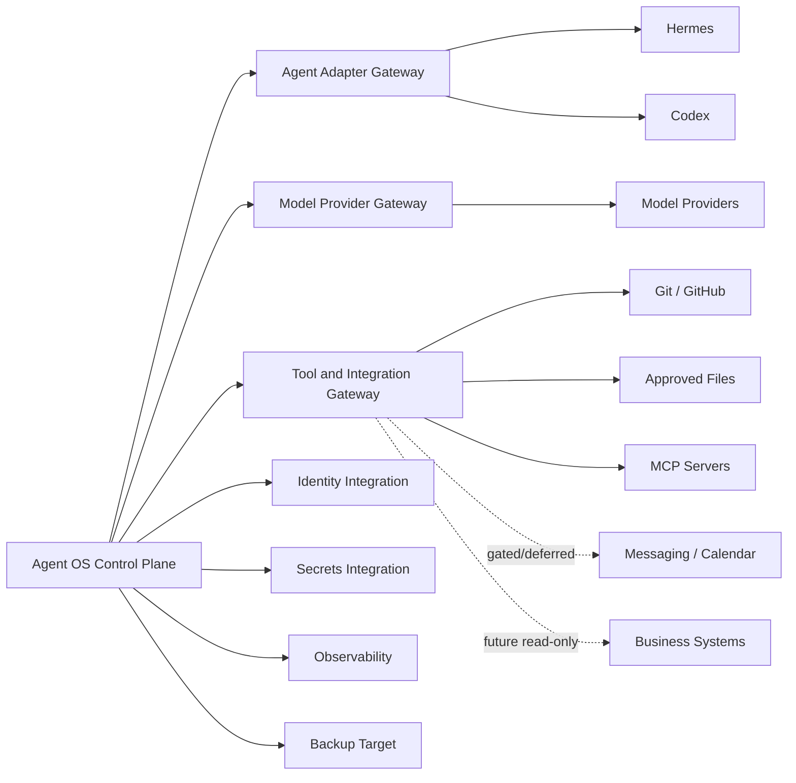

# INT-001 — Agent OS Integration Architecture

> **Status: Approved integration baseline — 2026-08-13.** This document defines the approved architecture for integrating Agent OS with external runtimes, providers, tools, protocols, repositories, files, identity systems, secret mechanisms, observability systems, and future business services. It does not approve any specific provider, MCP server, identity product, secret manager, or production connector.

## 1. Purpose

This document defines how Agent OS communicates across external boundaries while preserving:

- provider neutrality;
- workspace isolation;
- policy enforcement;
- exact approval;
- least privilege;
- durable orchestration;
- source and state fidelity;
- data classification;
- idempotency;
- evidence and audit;
- cost attribution;
- degraded operation;
- compatibility and upgrade safety;
- local Linux/WSL operability.

Detailed contracts belong in `AGC-001`, `CAP-001`, `MOD-001`, `RUN-001`, `APR-001`, `ART-001`, `API-001`, and `EVT-001`.

## 2. Integration problem

Agent OS must coordinate systems that:

- expose different protocols and state models;
- may hide internal tool calls;
- may use different model providers;
- may not support cancellation, resume, or checkpoints;
- may report cost late or incompletely;
- may retry internally;
- may not be idempotent;
- may fail partially;
- may be compromised or malicious;
- may return untrusted instructions or content.

The architecture must normalize what can be normalized and preserve uncertainty where it cannot.

## 3. Goals

The integration layer must:

1. isolate core domain concepts from provider-specific concepts;
2. make Hermes and Codex replaceable;
3. support explicit capability discovery;
4. preserve unavailable and unknown capability states;
5. enforce workspace, policy, and approval before effects;
6. prevent tools and adapters from granting themselves authority;
7. support stable correlation across systems;
8. preserve source, model, provider, tool, and version identity;
9. define timeouts, retries, and idempotency;
10. expose health and validation separately;
11. degrade safely;
12. keep raw secrets outside ordinary payloads;
13. preserve data classification;
14. support compatibility testing and version negotiation;
15. remain local-first;
16. prepare for future connectors without pre-authorizing them.

## 4. Principles

### `IAP-001 — Capability is not authority`

Registration, installation, connection, or technical capability grants no permission.

### `IAP-002 — Anti-corruption layer per external system`

Provider-specific concepts are translated at the boundary.

### `IAP-003 — Unknown remains unknown`

Missing model identity, cancellation support, cost, or effect outcome is never fabricated.

### `IAP-004 — Normalize before policy`

Action, target, parameters, classification, and side-effect class are normalized before authorization.

### `IAP-005 — Policy before invocation`

Protected integrations are called only after policy and approval requirements are satisfied.

### `IAP-006 — Persist correlation before outbound calls`

Every outbound attempt references durable run, step, and attempt identities.

### `IAP-007 — External output is untrusted`

Model output, tool output, MCP instructions, and provider metadata require validation.

### `IAP-008 — Lifecycle states are distinct`

Registered, configured, reachable, validated, ready, degraded, and disabled are distinct.

### `IAP-009 — Retry follows side-effect certainty`

Retries are blocked when prior protected effects are unknown.

### `IAP-010 — Secrets remain references`

Ordinary configuration stores secret references, not raw values.

### `IAP-011 — Read-only first`

New high-impact integrations begin with discovery and read-only capability.

### `IAP-012 — Version every contract`

Requests, responses, events, capabilities, and errors are versioned.

## 5. Integration landscape

| ID | Integration class | MVP position |
|---|---|---|
| `INTG-001` | Hermes Runtime | Required |
| `INTG-002` | Codex Runtime | Required |
| `INTG-003` | Model Providers | Required, selected profiles |
| `INTG-004` | Git / GitHub | Required, bounded |
| `INTG-005` | Approved Local Files | Required, bounded |
| `INTG-006` | Tool Gateway | Required |
| `INTG-007` | MCP Servers | Minimal approved subset or deferred |
| `INTG-008` | Identity Authority | Required |
| `INTG-009` | Secrets Mechanism | Required |
| `INTG-010` | Artifact Content Store | Required |
| `INTG-011` | Observability Backend | Required, may be local |
| `INTG-012` | Backup Target | Required |
| `INTG-013` | E-mail / Messaging | Drafting; sending gated/deferred |
| `INTG-014` | Calendar | Limited/deferred |
| `INTG-015` | ERP / CRM / Accounting | Post-MVP, read-only first |
| `INTG-016` | Production Systems | Excluded |
| `INTG-017` | Public Plugin Registry | Post-MVP |
| `INTG-018` | External Search / Web Retrieval | Optional, controlled |

## 6. Context diagram



## 7. Boundary catalogue

| Boundary | Description |
|---|---|
| `IB-001` | Control plane ↔ agent adapter |
| `IB-002` | Agent adapter ↔ runtime |
| `IB-003` | Runtime/control plane ↔ model provider |
| `IB-004` | Tool Gateway ↔ filesystem/Git |
| `IB-005` | Tool Gateway ↔ MCP/tool |
| `IB-006` | Agent OS ↔ identity authority |
| `IB-007` | Agent OS ↔ secrets mechanism |
| `IB-008` | Artifact service ↔ content store |
| `IB-009` | Services ↔ observability |
| `IB-010` | Backup utility ↔ backup target |
| `IB-011` | Tool Gateway ↔ messaging/calendar |
| `IB-012` | Tool Gateway ↔ future business system |
| `IB-013` | Local host ↔ external network |

## 8. Integration responsibilities

The integration layer owns:

- endpoint/process configuration;
- connection establishment;
- authentication references;
- request/response translation;
- capability normalization;
- error normalization;
- timeout behavior;
- retry eligibility signals;
- correlation;
- health and validation evidence;
- version negotiation;
- rate-limit handling;
- side-effect classification;
- data minimization;
- external receipts and identifiers.

It does not own:

- workspace membership;
- product authorization;
- human approval;
- run-state authority;
- final artifact acceptance;
- audit authority;
- budget policy.

## 9. Common outbound envelope

Each outbound request includes or references:

- request ID and schema version;
- organization/workspace;
- task/run/step/attempt;
- correlation and causation;
- requester/executor identity;
- capability;
- normalized target;
- data classification;
- purpose;
- time/resource limits;
- idempotency key;
- policy decision;
- approval consumption where required;
- deadline.

Raw secrets are excluded.

## 10. Common normalized response

Each response includes:

- response ID;
- request/correlation reference;
- source integration and version;
- status;
- result or result reference;
- normalized error;
- retryability;
- side-effect certainty;
- external request/session ID;
- actual model/provider/tool identity where known;
- usage/cost metadata;
- source and recording times;
- evidence references;
- unavailable fields and limitations.

## 11. Lifecycle

```text
unregistered
registered
configured
reachable
validated
ready
degraded
unreachable
incompatible
disabled
revoked
retired
```

Rules:

- registration stores metadata only;
- reachability is a point-in-time observation;
- validation confirms a tested contract/capability set;
- readiness combines validation, health, configuration, policy, and scope;
- disabled/revoked integrations retain history;
- incompatible integrations do not receive new work.

## 12. Registration

Registration stores:

- integration ID/type/name;
- implementation/provider;
- version;
- endpoint or process reference;
- configuration and secret references;
- declared capabilities;
- workspace enablement;
- owner;
- lifecycle state.

Registration does not validate credentials, grant permission, or enable arbitrary network access.

## 13. Validation

Validation may verify:

- reachability;
- authentication;
- protocol version;
- capability declaration;
- read-only operation;
- status/cancellation support;
- output schema;
- usage reporting;
- safe failure behavior.

Validation must not cause a consequential effect unless separately approved.

## 14. Readiness

An integration is ready only when:

- registration/configuration are complete;
- current version is compatible;
- validation evidence is current;
- health is acceptable;
- workspace enablement exists;
- policy permits the capability;
- required secret references are available;
- data classification is compatible;
- emergency stop is inactive.

## 15. Capability model

A capability declaration may include:

- capability code and version;
- read/write/effect class;
- target classes;
- allowed data classes;
- cancellation, pause, resume, and checkpoint support;
- streaming and idempotency support;
- artifact and usage support;
- health support;
- limits and known restrictions.

Capability states:

```text
declared
validated
partially_validated
unsupported
temporarily_unavailable
unknown
deprecated
disabled
```

Detailed schema belongs in `CAP-001`.

## 16. Version negotiation

Negotiation considers:

- protocol version;
- capability schema;
- adapter/runtime version;
- event schema;
- model-profile version;
- supported ranges;
- deprecated features.

Outcomes:

```text
compatible
compatible_with_reduced_capability
incompatible
unknown
upgrade_required
```

Breaking semantic or authorization changes require a new major contract version.

## 17. Authentication

Possible patterns:

- local process identity;
- OS user/group;
- API token through a secret reference;
- OAuth/OIDC;
- workload identity;
- mTLS or equivalent;
- short-lived delegated credential.

Rules:

- authentication is not authorization;
- credentials are least privilege;
- credential use is attributable;
- long-lived shared secrets are discouraged;
- raw credentials are excluded from logs and ordinary payloads.

## 18. Secret resolution

Preferred flow:

```text
Run/Step
→ policy permits exact capability and target
→ integration requests secret reference
→ secret mechanism injects bounded access
→ request executes
→ raw value is not returned to UI, memory, audit, or ordinary logs
```

A secrets specification commonly referenced as `SEC-002` is still **registered**.

## 19. Network policy

Egress is denied by default.

Allow rules may constrain:

- host;
- port;
- protocol;
- path/API scope;
- TLS;
- workspace;
- capability;
- data class;
- expiry.

Redirects are revalidated. SSRF, DNS rebinding, local-address access, and proxy behavior require controls.

## 20. Timeouts, retries, and rate limits

Every integration defines:

- connection;
- authentication;
- acknowledgement;
- response;
- streaming idle;
- total request;
- cancellation;
- health timeouts.

Every timeout reports retryability and side-effect certainty.

Rate-limit data may include:

- limit type;
- remaining allowance;
- reset time;
- retry-after;
- affected profile/workspace.

Automatic retry is prohibited for unknown consequential effects.

## 21. Circuit breakers and bulkheads

Circuit breaker states:

```text
closed
open
half_open
disabled
unknown
```

Safe read-only probes are used in half-open state.

Bulkheads may use:

- separate adapter processes;
- provider-specific queues;
- per-tool worker pools;
- workspace concurrency limits;
- separate credentials.

One failed provider must not exhaust the entire platform.

## 22. Health model

Health dimensions:

- registered;
- configured;
- reachable;
- authenticated;
- validated;
- compatible;
- rate-limited;
- quota state;
- degraded capabilities;
- last success/failure;
- freshness.

Health is per integration and capability, not one boolean.

## 23. Error normalization

Common errors:

```text
INTEGRATION_VALIDATION_ERROR
INTEGRATION_AUTHENTICATION_FAILED
INTEGRATION_AUTHORIZATION_DENIED
INTEGRATION_CONFIGURATION_MISSING
INTEGRATION_UNREACHABLE
INTEGRATION_TIMEOUT
INTEGRATION_RATE_LIMITED
INTEGRATION_QUOTA_EXCEEDED
INTEGRATION_INCOMPATIBLE
INTEGRATION_CAPABILITY_UNAVAILABLE
INTEGRATION_RESPONSE_INVALID
INTEGRATION_OUTPUT_UNSAFE
INTEGRATION_SIDE_EFFECT_UNKNOWN
INTEGRATION_SECRET_UNAVAILABLE
INTEGRATION_POLICY_DENIED
INTEGRATION_INTERNAL_ERROR
```

Each includes source, safe message, retryability, side-effect certainty, correlation, evidence reference, and remediation hint.

## 24. Classification and minimization

Before outbound disclosure, Agent OS evaluates:

- source classification;
- destination;
- purpose;
- minimum necessary data;
- provider retention/training behavior where known;
- workspace policy;
- approval requirement.

Requests exclude unrelated workspace data, raw secrets, unnecessary logs, and full repositories when selected files suffice.

## 25. Correlation and evidence

Every external attempt correlates:

- task/run/step/attempt;
- approval;
- adapter/provider/tool request;
- artifact;
- usage/cost;
- audit event;
- trace.

Evidence identifies what was sent, where, under which policy/version, what returned, whether effects are known, and what is missing.

## 26. Interaction patterns

### Synchronous

Used for short commands, validation, health, status, and exact approval consumption.

Requirements:

- bounded payload;
- timeout;
- schema and error contract;
- idempotency where applicable.

### Asynchronous

Used for agent runs, sandbox commands, long provider operations, side effects, imports/exports, backup, and reconciliation.

Patterns:

- durable jobs;
- outbox/inbox;
- polling;
- events;
- callbacks only if later approved.

### Streaming

Streams are partial until durable state is recorded. Reconnect, cursor/sequence, duplicate handling, backpressure, output limits, and redaction are required.

### Polling

Polling defines interval, duration, backoff, jitter, terminal states, stale threshold, and rate-limit handling.

## 27. Callback/webhook position

Inbound callbacks are deferred unless required.

Before adoption:

- authenticate sender;
- verify signature;
- prevent replay;
- define local ingress exposure;
- enforce idempotency and versioning;
- limit denial-of-service risk;
- rotate callback secrets.

## 28. Anti-corruption layers

Each ACL maps:

```text
external request/response/state
↔ Agent OS capability/action/error/evidence
```

It preserves external IDs, exposes unsupported fields, maps errors, retains controlled extension data, and prevents external domain concepts from contaminating the core model.

## 29. Hermes integration

Required capabilities:

- registration/version/health;
- capability declaration;
- start;
- status/events;
- outputs/artifacts;
- cancellation where supported;
- resume/checkpoints where supported;
- usage/model reporting where available;
- limitation/error reporting.

Controls:

- workspace-bound context;
- no permission expansion;
- no human approval authority;
- governed protected tools;
- explicit actual model/provider;
- bounded time, steps, cost, and resources.

Open questions include invocation mechanism, session lifecycle, hidden tool visibility, cancellation, checkpoint support, model attribution, usage, and authentication.

The detailed `ADP-HER-001` remains **registered**.

## 30. Codex integration

Required capabilities:

- start/status/events;
- approved repository/worktree;
- patch/document/test/build outputs;
- proposed Git actions;
- cancellation;
- usage/model reporting where available;
- errors and evidence.

Controls:

- approved path/worktree only;
- no production credentials;
- no unrestricted host access;
- no autonomous merge or force push;
- no permission expansion;
- exact approval for commit/push/PR where enabled;
- governed shell/file/Git effects.

The detailed `ADP-CDX-001` remains **registered**.

## 31. Agent Adapter Gateway

The provider-neutral gateway supports:

- register;
- validate;
- discover capabilities;
- start;
- status;
- events;
- cancel;
- pause;
- resume;
- outputs;
- usage;
- health.

Detailed contract belongs in `AGC-001`.

## 32. Model provider integration

Provider adapters normalize:

- provider/model IDs;
- capabilities and limits;
- response;
- usage;
- rate/quota;
- latency;
- errors/refusals;
- provider request ID;
- retention/training metadata where known.

Rules:

- no silent fallback;
- actual model remains unknown if unreported;
- output remains generated content;
- classification and purpose are enforced;
- pricing version is separate;
- provider billing remains externally authoritative.

## 33. Model routing

Routing considers capability, policy, classification, context size, latency, availability, cost, preference, and fallback.

The routing record preserves selection, reason, alternatives, version, fallback rule, and actual provider/model where known.

## 34. Git integration

Git remains authoritative for repository history.

Allowed under guards:

- status/log/diff/branch list;
- approved reads;
- uncommitted patches;
- approved tests/builds.

Approval-gated candidates:

- commit;
- push;
- pull-request creation.

Prohibited:

- autonomous merge;
- force push;
- history rewrite;
- protected-branch deletion;
- CI/review bypass.

Evidence includes repository, branch/worktree, before/after commit, diff hash, exact action, approval, and external IDs.

## 35. Local file integration

Controls:

- approved mount roots;
- read/write distinction;
- canonical path resolution;
- symlink escape protection;
- size/media limits;
- classification;
- approval for deletion;
- no secret discovery by default.

User-provided paths are not trusted without normalization.

## 36. Tool Gateway

The gateway receives:

- normalized action and target;
- exact parameters;
- policy decision;
- approval consumption;
- execution limits;
- secret references;
- correlation.

It returns result, side-effect certainty, artifacts, usage, normalized error, external ID, and receipt.

## 37. MCP position

MCP is a candidate protocol, not an authority model.

Agent OS still owns:

- enablement;
- workspace scope;
- classification;
- target restrictions;
- approval;
- secrets;
- audit;
- cost;
- revocation.

MCP risks include malicious descriptions, prompt injection, capability drift, exfiltration, broad scope, and ambiguous effects.

Adoption requirements:

- allowlisted servers;
- versioned capability snapshot;
- read-only validation;
- exact schemas;
- normalized targets;
- output sanitization;
- negative tests;
- no trust in server-provided instructions.

A dedicated MCP profile is created only after formal adoption.

## 38. Identity integration

The identity authority proves credentials.

Agent OS owns:

- sessions;
- identity type;
- memberships;
- roles;
- approval authority;
- workload identities;
- authorization.

The detailed `IAM-001` remains **registered**.

## 39. Secrets integration

The mechanism should support:

- secret reference;
- scoped use;
- purpose/owner;
- workspace/capability/target;
- rotation;
- expiry;
- revocation;
- evidence.

Candidate mechanisms include OS keyring, encrypted local secret store, external manager, or short-lived broker.

## 40. Artifact and observability integrations

Artifact storage supports staging, integrity, finalize, retrieve/stream, lifecycle, backup, and health.

Observability receives structured logs, metrics, traces, dependency health, and lag. Correlation is required; secrets and unnecessary content are excluded. Audit remains separate.

## 41. Backup target

Backup integration supports:

- target validation;
- protected write/read;
- manifest;
- checksums;
- encryption state;
- capacity;
- rotation;
- integrity verification.

Agent OS, not the target, decides whether a backup is complete.

## 42. Messaging and calendar

Drafting may be permitted.

Sending or mutation requires exact approval over sender/calendar identity, recipients/attendees, content, attachments, date/time/time zone, recurrence, destination, classification, and expiry.

Material change invalidates approval.

## 43. Business systems

ERP, CRM, accounting, and similar systems are post-MVP.

Initial posture:

- discovery;
- source-of-truth mapping;
- read-only;
- narrow scope;
- freshness and reconciliation;
- no production write;
- no financial posting;
- generated analysis separated from source facts.

Each connector requires its own controlled specification.

## 44. External search/web retrieval

Optional retrieval integrations preserve query, source reference, retrieval time, provenance, classification, copyright/licensing constraints, prompt-injection risk, and cache/retention behavior.

External content cannot grant authority.

## 45. Standards position

Candidate standards:

- OpenAPI;
- AsyncAPI;
- MCP;
- AG-UI;
- A2A;
- OAuth/OIDC;
- OpenTelemetry.

Adoption requires a concrete requirement, security review, version strategy, conformance tests, local deployment fit, and no authority ambiguity.

## 46. OpenAPI and AsyncAPI

OpenAPI is the preferred candidate for synchronous control-plane APIs.

Its profile should define authentication, workspace scope, idempotency, errors, pagination, versioning, correlation, approvals, rate limits, and sensitive fields.

AsyncAPI may document event channels, envelopes, delivery semantics, ordering, retries, dead letters, classification, and compatibility.

## 47. AG-UI and A2A

AG-UI is considered only if it preserves Agent OS run authority, approvals, evidence, reconnect, and stale-state behavior.

A2A is post-MVP. Before adoption, it requires identity, delegation, workspace scope, capability negotiation, budget, approval, cancellation, and fan-out limits.

## 48. Data contracts and events

Every integration contract defines:

- request/response schema;
- required/optional fields;
- version;
- identity/scope;
- capability;
- normalized target;
- classification;
- idempotency;
- timeout;
- errors;
- side-effect certainty;
- evidence;
- compatibility.

Representative events:

```text
IntegrationRegistered
IntegrationConfigured
IntegrationValidationStarted
IntegrationValidated
IntegrationValidationFailed
IntegrationHealthChanged
IntegrationCompatibilityChanged
CapabilityDeclared
CapabilityValidated
CapabilityUnavailable
ExternalRequestStarted
ExternalRequestAcknowledged
ExternalRequestCompleted
ExternalRequestFailed
ExternalEffectUnknown
RateLimitObserved
QuotaExceeded
IntegrationDisabled
IntegrationRevoked
```

## 49. Reconciliation and receipts

Reconciliation compares Agent OS with runtime sessions, provider requests, Git, files, tool targets, messages, calendars, business sources, backup targets, and artifact stores.

Results:

```text
matched
externally_completed
externally_failed
partial
duplicate
missing
conflicted
stale
unknown
```

An integration receipt records integration/version, request, scope, capability, target, policy, approval, request hash/reference, external ID, result, side-effect certainty, usage, error, and evidence gaps.

## 50. Degraded behavior

| Failure | Behavior |
|---|---|
| Hermes unavailable | Hermes route unavailable only |
| Codex unavailable | Codex route unavailable only |
| Model provider unavailable | Affected profiles unavailable; no silent fallback |
| Git unavailable | Preserve local patch/artifact; report failure |
| Files unavailable | Block affected work |
| MCP unavailable | Capability unavailable |
| Identity unavailable | Fail closed |
| Secrets unavailable | Dependent calls block |
| Artifact store unavailable | Content operations degrade explicitly |
| Observability unavailable | Telemetry gap visible |
| Backup target unavailable | Backup fails explicitly |
| Messaging/calendar unavailable | Action fails or remains unknown |
| Business source unavailable | Read model stale/unavailable |

## 51. Observability

Metrics include:

- validation success/failure;
- health;
- request volume/latency/error;
- timeout/retry;
- rate limits and quotas;
- incompatibility;
- unknown effects;
- cancellation success;
- attribution completeness;
- circuit state;
- disclosure by data class;
- secret-resolution failures.

## 52. Testing

### Contract and compatibility

- request/response schemas;
- error mapping;
- capability declarations;
- current and previous supported versions;
- unknown additive fields;
- breaking version rejection.

### Conformance

- start/status/cancel/resume;
- idempotency;
- side-effect certainty;
- usage;
- health;
- artifacts.

### Security

- workspace isolation;
- secret leakage;
- SSRF/network allowlist;
- malicious MCP content;
- prompt injection;
- target normalization;
- replay;
- unauthorized capabilities;
- classification disclosure.

### Reliability

- timeout;
- duplicate/out-of-order events;
- adapter crash;
- provider outage;
- rate limits;
- stale health;
- circuit breaker;
- reconciliation.

## 53. Quality gates

Before MVP acceptance:

1. Hermes and Codex pass common adapter conformance tests.
2. Registration and readiness remain distinct.
3. Unsupported and unknown capabilities are explicit.
4. Actual provider/model remains unknown when unavailable.
5. Protected tools cannot bypass policy/approval.
6. Cross-workspace integration access is blocked.
7. Raw secrets are absent from ordinary payloads/logs.
8. Timeout/retry behavior is side-effect-aware.
9. Rate-limit and quota states are visible.
10. Incompatible versions block dispatch.
11. External output is treated as untrusted.
12. Git actions follow autonomy policy.
13. Validation performs no consequence.
14. Degraded integrations do not create false global health.
15. Receipts and audit evidence are retained.

## 54. Traceability

| Requirement family | Response |
|---|---|
| `FR-AGT-*` | Adapter registry, capability, health, execution |
| `FR-MOD-*` | Profiles, provider normalization, fallback |
| `FR-RUN-*` | Start/status/cancel/resume |
| `FR-APR-*` | Exact approval references |
| `FR-TOL-*` | Files, network, tools, MCP |
| `FR-MEM-*` | Controlled memory disclosure |
| `FR-ART-*` | Artifact content integration |
| `FR-AUD-*` | Receipts and correlation |
| `FR-CST-*` | Usage and cost normalization |
| `FR-OPS-*` | Health and degraded states |
| `NFR-INT-*` | Neutrality and compatibility |
| `NFR-SEC-*` | Auth, secrets, network, least privilege |
| `AUT-001` | Action policy |

## 55. Mapping

| Concern | Context/container |
|---|---|
| Registry/capability | `BC-REG`, `CTR-004` |
| Hermes | ACL, `CTR-005` |
| Codex | ACL, `CTR-006` |
| Providers | `CTR-007` |
| Git/files/MCP/tools | `CTR-008`, `CTR-009` |
| Identity | `BC-IAM`, `CTR-022` |
| Secrets | `CTR-023` |
| Artifacts | `BC-ART`, `CTR-011`, `CTR-017` |
| Observability | `CTR-020` |
| Backup | `BC-OPS`, `CTR-021` |

## 56. ADR backlog

- `ADR-TBD-INT-001` — Hermes integration mechanism
- `ADR-TBD-INT-002` — Codex integration mechanism
- `ADR-TBD-INT-003` — MCP adoption profile
- `ADR-TBD-INT-004` — Identity integration
- `ADR-TBD-INT-005` — Secrets integration
- `ADR-TBD-INT-006` — Inter-process communication pattern

Additional candidates: provider set, OpenAPI/AsyncAPI profile, AG-UI, callback policy, network egress, Git execution model.

## 57. Open decisions

1. How will Hermes and Codex be invoked?
2. Which capabilities are mandatory?
3. Which providers are supported?
4. Is direct provider access needed?
5. Is MCP required for MVP?
6. Which MCP servers are approved?
7. Which Git/file actions are enabled?
8. Which identity and secrets mechanisms are selected?
9. Which egress destinations are allowlisted?
10. Are callbacks needed?
11. Which protocol connects adapters?
12. Which versions remain supported?
13. Which integrations need circuit breakers?
14. Which health probes are safe?
15. Which integrations support cancellation/checkpoints?
16. Which data classes may leave the host?
17. Are messaging/calendar actions in MVP?
18. When does business-system discovery begin?
19. Which proposed companion specs are added to the register?

## 58. Risks

| Risk | Response |
|---|---|
| Provider concepts leak into core | Anti-corruption layers |
| Capability treated as permission | Policy before invocation |
| Hidden runtime tools | Governed tool path |
| Unknown model shown as configured | Preserve unknown |
| Malicious MCP server | Allowlist, validation, gateway |
| Secret in payload/log | References and scanning |
| Retry after unknown effect | Side-effect-aware retry |
| Version drift | Negotiation and conformance |
| Health probe causes effect | Read-only probes |
| Cross-workspace session reuse | Scoped context/tests |
| Silent fallback | Explicit policy/evidence |
| Callback creates attack surface | Defer or secure profile |
| Git bypasses approval | Gateway and receipts |
| Provider outage blocks all work | Bulkheads/degraded mode |
| External content injects instructions | Treat as untrusted |

## 59. Assumptions and constraints

Assumptions:

- Hermes and Codex expose usable invocation surfaces;
- adapters can run separately;
- external providers are selectively reachable;
- protected effects can use the gateway;
- identity and secrets mechanisms exist;
- local egress can be controlled;
- conformance fixtures can be built.

Constraints:

- no provider or protocol is approved here;
- MCP is not automatically adopted;
- no public webhook ingress is assumed;
- no production or financial writes;
- no autonomous merge;
- no arbitrary host/network access;
- no raw secrets;
- no silent fallback;
- no accepted mock integration state;
- Git versioning remains deferred until drafting is complete.

## 60. Acceptance criteria

INT-001 may advance to `1.0.0` when:

1. Product accepts the integration scope.
2. Architecture accepts gateways and ACLs.
3. Security accepts identity, secrets, network, output, and MCP controls.
4. Data accepts classification and lineage.
5. Operations accepts validation, health, and compatibility.
6. Quality confirms conformance testing.
7. Hermes and Codex remain replaceable.
8. Capability remains distinct from authority.
9. lifecycle states remain distinct.
10. protected effects pass through policy/approval.
11. unknown state remains explicit.
12. retries are side-effect-aware.
13. raw secrets remain outside ordinary payloads.
14. downstream contracts can proceed.
15. metadata, terminology, Markdown, and diagrams validate.

## 61. Downstream impact

| Document | Required use |
|---|---|
| `SEC-001` | Controls for every integration boundary |
| `THR-001` | Adapter, MCP, provider, callback, secret threats |
| `AGC-001` | Common adapter contract |
| `CAP-001` | Capability schema |
| `MOD-001` | Model profile contract |
| `RUN-001` | Integration state in runs/attempts |
| `APR-001` | Approval references |
| `ART-001` | Artifact integration |
| `API-001` | Synchronous API |
| `EVT-001` | Integration events |
| `OBS-001` | Integration telemetry |
| `OPS-001` | Configuration, health, upgrade |
| `TST-001` | Contract/conformance/security tests |
| `RTM-001` | Integration traceability |

## 62. Multi-execution backend routing extension

The integration architecture adds an explicit routing chain:

```text
Execution Router
→ Model Provider Gateway
→ Agent Adapter Gateway
```

`ModelProviderConnection` is the normalized boundary for direct external or
local model inference. `AgentRuntimeConnection` is the normalized boundary
for governed runtimes such as Hermes or a Codex subscription session. They
may be used simultaneously, but they remain separate connection classes and
their authentication, identity, usage, billing, and evidence sources are not
collapsed.

The router records requested, selected, and actual backend/runtime, model
identity where available, authentication source, billing source, fallback
decision, usage source, actual monetary cost, and normalized equivalent cost.
No fallback from a subscription runtime to a paid API is silent; it requires
explicit policy and authorization. The deterministic simulator remains a
third backend class.

The direct OpenAI Responses API remains the D2 provider proof. Hermes and
Codex runtime integration are post-D2 planning and do not imply D3 has
started. The prior version's Product Owner approval is historical evidence
only for this new revision; specialist approval of the extension remains
pending.

## 63. Revision and approval history

### Approval state

- Current status: `approved`
- Current version: `0.1.0`
- Approved by: product-owner on 2026-08-13
- Required next action: Product, Architecture, Security, Data, Operations, and Quality review

### Revision history

| Version | Date | Status | Summary |
|---|---|---|---|
| 0.1.0 | 2026-07-19 | Draft | Initial architecture for Hermes, Codex, models, Git, files, tools, MCP, identity, secrets, artifacts, observability, backups, messaging, future business systems, compatibility, health, evidence, and testing |

## References

- `DOC-000` — Documentation Governance and Source-of-Truth Policy
- `GLO-001` — Glossary and Controlled Terminology
- `VSN-001` — Product Vision and Project Charter
- `SCP-001` — Scope and System Boundaries
- `PRD-001` — Product Requirements Document
- `SRS-001` — Functional Requirements Specification
- `NFR-001` — Non-Functional Requirements
- `AUT-001` — Autonomy and Approval Matrix
- `RTM-001` — Requirements Traceability Matrix
- `SAD-001` — System Architecture Description
- `C4-001` — System Context Diagram
- `C4-002` — Container Diagram
- `DDD-001` — Domain Model
- `DAT-001` — Data Architecture
- `MEM-001` — Memory and Knowledge Architecture
- `ORC-001` — Workflow and Orchestration Architecture
