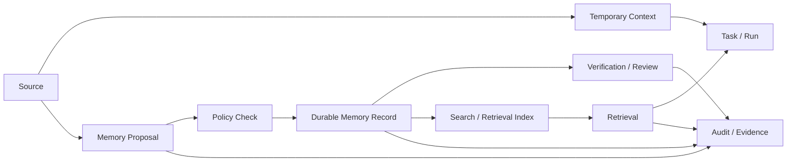
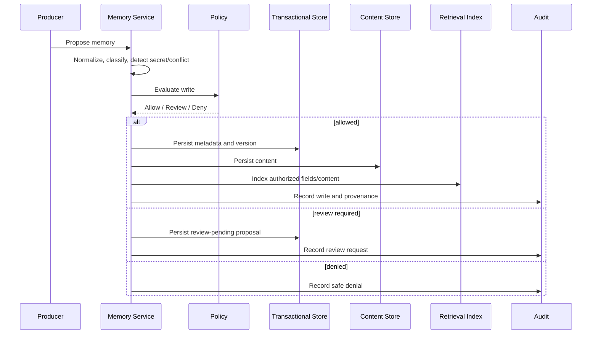
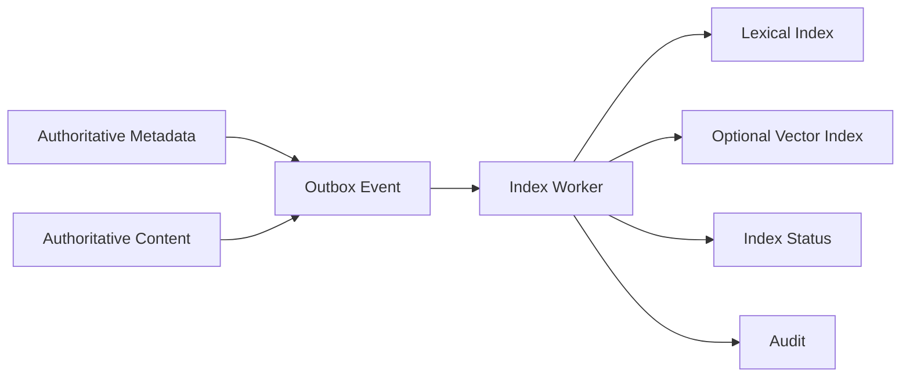
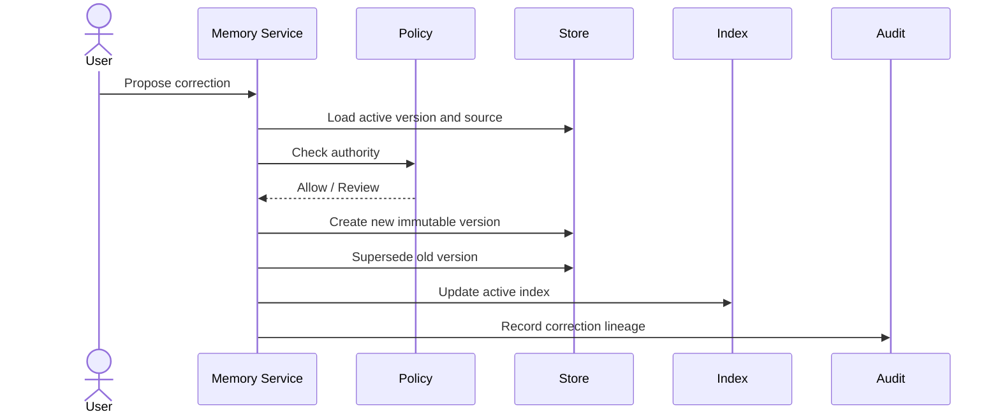
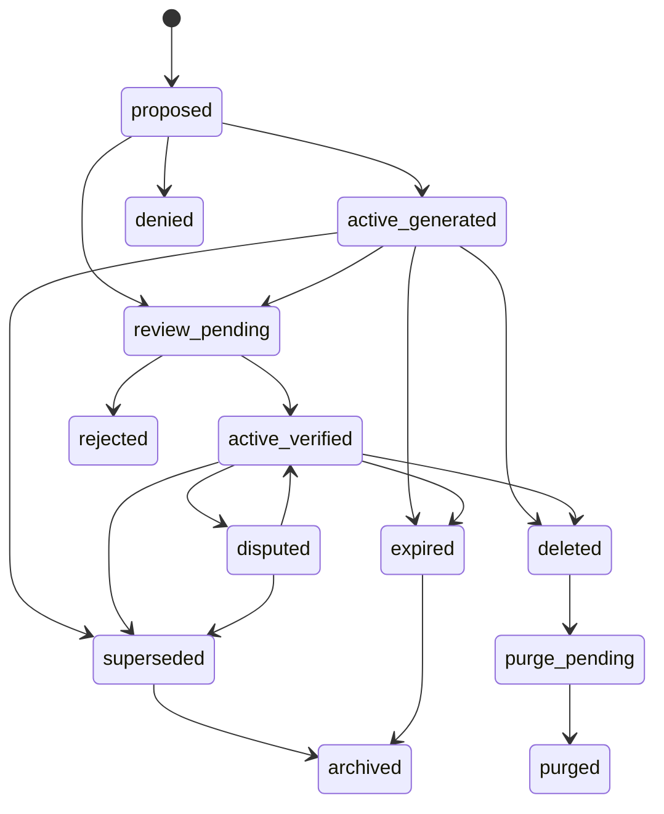

# MEM-001 — Agent OS Memory and Knowledge Architecture

> **Status: Approved architecture baseline — 2026-08-13.** This document defines the approved architecture for temporary context, durable memory, governed knowledge, retrieval, provenance, correction, deletion, and authority management in the first Agent OS MVP. It does not select a final vector database, embedding model, search engine, retention period, or AI provider.

## 1. Document purpose

This document defines how Agent OS should retain and retrieve context without creating hidden, unbounded, or misleading “perfect memory.”

It establishes:

- memory types;
- source and authority models;
- ingestion rules;
- retrieval rules;
- workspace isolation;
- semantic and lexical search;
- correction and supersession;
- deletion and retention;
- conflict handling;
- provider disclosure controls;
- index rebuild and recovery;
- evidence and audit obligations;
- APIs and events required later;
- security, privacy, and quality constraints;
- the minimum viable memory scope for the MVP.

## 2. Core problem

AI agents often need continuity across sessions, tools, providers, and long-running work.

Naive memory designs create major risks:

- generated claims become false “facts”;
- one workspace leaks into another;
- old information remains active after correction;
- secrets are retained;
- retrieved content is treated as authoritative;
- vector similarity overrides source quality;
- stale context silently guides new work;
- deletion affects the index but not the source, or the reverse;
- provider-specific memory locks the platform in;
- hidden memory prevents users from understanding why an agent acted.

Agent OS must therefore treat memory as a governed data product, not as invisible agent state.

## 3. Memory architecture goals

The architecture must:

1. preserve useful context across tasks and runs;
2. keep temporary and durable context distinct;
3. preserve source, producer, time, and authority;
4. isolate workspaces before retrieval;
5. prevent secret storage;
6. distinguish generated, asserted, verified, and authoritative content;
7. support correction, supersession, expiry, and deletion;
8. expose why an item was retrieved;
9. remain provider-neutral;
10. work without mandatory vector search;
11. support rebuildable indexes;
12. allow humans to review and govern durable memory;
13. maintain evidence of writes and significant retrievals;
14. degrade safely when search or embeddings are unavailable;
15. avoid claims of perfect recall or guaranteed truth.

## 4. Principles

### `MAP-001 — Memory is not authority by default`

Generated or inferred memory is never automatically authoritative.

### `MAP-002 — Source precedes relevance`

A highly similar record with weak or unknown provenance must not outrank a verified source merely because of embedding similarity.

### `MAP-003 — Workspace scope precedes search`

Authorization and workspace filtering occur before or within candidate retrieval.

### `MAP-004 — Temporary context is not durable memory`

Prompt context, transient tool output, and active-run scratch data expire unless explicitly promoted through policy.

### `MAP-005 — Durable memory is explicit`

Durable memory creation must be visible, attributable, and policy-governed.

### `MAP-006 — Secrets are excluded`

Raw secrets, credentials, tokens, and private keys are prohibited from ordinary memory.

### `MAP-007 — Correction preserves lineage`

Memory is corrected by versioning or supersession, not silent overwrite.

### `MAP-008 — Indexes are derived`

Lexical, semantic, vector, and cache indexes are rebuildable and non-authoritative.

### `MAP-009 — Unknown remains unknown`

Missing source, uncertain confidence, stale content, and conflicting evidence remain explicit.

### `MAP-010 — Retrieval is explainable`

The system should expose source, age, authority, confidence, and retrieval reason.

### `MAP-011 — Provider neutrality`

Agent OS owns memory metadata and governance even when external runtimes maintain their own temporary state.

### `MAP-012 — Human control increases with authority`

The more authoritative or persistent the memory, the stronger the review requirement.

## 5. Scope

### In-scope MVP

- temporary run context;
- durable generated memory;
- user-asserted preferences and project notes;
- verified project facts;
- authoritative reference links;
- memory versions;
- source references;
- workspace-scoped retrieval;
- lexical search;
- metadata filters;
- optional semantic/vector retrieval;
- correction and supersession;
- expiry and deletion;
- policy-controlled provider disclosure;
- audit and retrieval evidence;
- rebuildable indexes.

### Explicitly excluded from MVP

- global cross-tenant memory;
- perfect memory;
- autonomous truth promotion;
- hidden personality profiling;
- unrestricted personal-data retention;
- raw secret storage;
- irreversible deletion without evidence;
- unrestricted external web memory;
- autonomous model fine-tuning from user content;
- silent use of another system’s internal memory;
- biometric, health, financial, or highly sensitive profiling;
- public shared memory marketplace.

## 6. Memory model overview



## 7. Memory classes

| Memory class ID | Class | Purpose | Durability |
|---|---|---|---|
| `MEM-C01` | Temporary Run Context | Active task/run reasoning support | Transient |
| `MEM-C02` | Working Note | Short-lived operator/agent note | Short |
| `MEM-C03` | Generated Memory | AI-generated reusable context | Durable, low authority |
| `MEM-C04` | Inferred Memory | Derived interpretation or relationship | Durable, low authority |
| `MEM-C05` | User-Asserted Memory | Explicit user-provided statement | Durable, medium authority |
| `MEM-C06` | User Preference | Explicit stable preference | Durable, user-controlled |
| `MEM-C07` | Verified Project Fact | Reviewed and evidence-backed project fact | Durable, high authority |
| `MEM-C08` | Authoritative Reference | Link/reference to a source of truth | Durable, high authority |
| `MEM-C09` | Procedure / Playbook | Approved reusable process | Durable, reviewed |
| `MEM-C10` | Correction / Supersession Record | Replaces or disputes prior memory | Durable |
| `MEM-C11` | Retrieval Observation | Evidence that memory was retrieved | Operational/audit |
| `MEM-C12` | Conflict Record | Records unresolved source disagreement | Durable |

## 8. Authority states

| Authority state | Meaning |
|---|---|
| `temporary` | Context exists only for active processing |
| `generated` | Produced by an AI or tool |
| `inferred` | Derived from one or more sources |
| `user_asserted` | Explicitly stated by a user |
| `user_preference` | Explicit user-controlled preference |
| `review_pending` | Proposed for review |
| `verified` | Human-reviewed against evidence |
| `authoritative_reference` | Points to a recognized source of truth |
| `disputed` | Credible conflict exists |
| `superseded` | Replaced by a newer version |
| `expired` | No longer active due to time/policy |
| `deleted` | Removed from active use |
| `unavailable` | Source/content cannot be accessed |
| `unknown` | Authority cannot be established |

## 9. Confidence model

Confidence is distinct from authority.

A memory may be:

- high confidence but generated;
- low confidence but user-asserted;
- verified but stale;
- authoritative by source but currently unavailable.

Proposed confidence states:

```text
not_assessed
low
medium
high
conflicted
unknown
```

Confidence must include:

- basis;
- method;
- evaluator;
- evaluated time;
- evidence references.

## 10. Source types

| Source type | Example |
|---|---|
| `user_statement` | Explicit user-provided fact |
| `user_preference` | Explicit preference |
| `task_input` | Task description or resource |
| `artifact` | Document, code patch, report |
| `run_output` | Agent/runtime output |
| `tool_result` | Tool response |
| `external_authoritative` | Git, ERP, official document |
| `external_reported` | Provider-reported usage or status |
| `system_generated` | Agent OS-generated state |
| `review_decision` | Human verification or correction |
| `imported_dataset` | Approved import |
| `unknown_source` | Source unavailable or not established |

`unknown_source` cannot be promoted to verified or authoritative without later evidence.

## 11. Memory aggregate

The domain aggregate is `MemoryRecord`.

### Core attributes

- `memory_record_id`;
- `organization_id`;
- `workspace_id`;
- optional `project_id`;
- `memory_class`;
- `authority_state`;
- `confidence`;
- `classification`;
- `active_version_id`;
- `producer_identity_id`;
- optional `task_id`;
- optional `run_id`;
- optional `step_id`;
- `created_at`;
- `updated_at`;
- `retention_state`;
- `status`;
- `version`.

### Child entities

- `MemoryVersion`;
- `SourceReference`;
- `VerificationRecord`;
- `ConflictRecord`;
- `RetentionRuleReference`;
- `RetrievalObservation`.

## 12. MemoryVersion entity

### Attributes

- `memory_version_id`;
- `memory_record_id`;
- `version_number`;
- `content_reference`;
- `normalized_summary`;
- `language`;
- `source_references`;
- `authority_state`;
- `confidence`;
- `classification`;
- `valid_from`;
- optional `valid_to`;
- `created_by`;
- `created_at`;
- `supersedes_version_id`;
- `content_hash`.

### Invariants

1. A version is immutable after publication.
2. Correction creates a new version.
3. Active version is unique.
4. Superseded versions remain traceable.
5. Content hash is stable for normalized content.
6. A version cannot reference another workspace’s private source.
7. Raw secrets are prohibited.
8. Classification cannot be silently lowered.

## 13. SourceReference entity

### Attributes

- `source_reference_id`;
- `memory_version_id`;
- `source_type`;
- `source_system`;
- `source_record_id`;
- `source_uri_or_internal_reference`;
- `source_version`;
- `source_timestamp`;
- `captured_at`;
- `source_classification`;
- `source_integrity_reference`;
- `source_availability_state`.

### Rules

- at least one source reference is required for durable memory;
- source references are not automatically readable by every retriever;
- deleted source state is recorded;
- inaccessible source does not erase prior lineage;
- source authority and memory authority are separate fields.

## 14. VerificationRecord entity

### Attributes

- `verification_record_id`;
- `memory_version_id`;
- `decision`;
- `reviewer_identity_id`;
- `authority_used`;
- `evidence_references`;
- `rationale`;
- `verified_at`;
- `expires_at`;
- `policy_version`.

### Decisions

- `verified`;
- `rejected`;
- `needs_revision`;
- `disputed`;
- `expired`;
- `revoked`.

### Rules

1. Only eligible humans may verify authoritative memory.
2. An agent cannot verify its own generated claim.
3. Verification references exact content version.
4. Material content change invalidates verification.
5. Verification may expire.
6. Missing evidence blocks high-authority promotion.

## 15. ConflictRecord entity

### Purpose

Represent disagreement without overwriting one side.

### Attributes

- `conflict_record_id`;
- `workspace_id`;
- `memory_record_ids`;
- `source_references`;
- `conflict_type`;
- `severity`;
- `detected_at`;
- `detected_by`;
- `resolution_state`;
- `resolved_by`;
- `resolution_reference`.

### Conflict types

- factual contradiction;
- stale versus current;
- duplicate with different values;
- source authority disagreement;
- classification disagreement;
- identity/entity ambiguity;
- unresolved correction chain.

## 16. Temporary context

Temporary context includes:

- task prompt;
- active-run scratch state;
- current tool outputs;
- short-lived summaries;
- intermediate plans;
- model conversation window;
- temporary checkpoints.

### Rules

- default not durable;
- scoped to one run or step;
- expires after completion or configured window;
- may be redacted or summarized before promotion;
- cannot be used as proof of durable memory;
- cannot bypass source/classification rules;
- may be unavailable after provider/runtime shutdown.

## 17. Promotion from temporary to durable

A temporary item may become a durable memory proposal only when:

1. the purpose is explicit;
2. the target workspace is explicit;
3. the source is known;
4. classification is evaluated;
5. raw secrets are excluded;
6. content is normalized;
7. memory class is selected;
8. retention rule is selected;
9. policy permits the write;
10. provenance is retained.

Higher-authority promotion additionally requires human review.

## 18. Memory-write policy

A write decision should consider:

- identity and type;
- workspace;
- memory class;
- source type;
- data classification;
- retention;
- authority requested;
- content sensitivity;
- duplicate/conflict state;
- purpose;
- onward provider disclosure implications.

### Default decisions

| Proposed write | Default |
|---|---|
| Temporary run context | Allow within run bounds |
| Generated durable memory | Allow with guards |
| User preference explicitly requested | Allow with guards |
| Verified project fact | Require human review |
| Authoritative reference | Require human review or trusted import |
| Raw secret | Deny |
| Cross-workspace write | Deny |
| Restricted/sensitive data | Deny or separate approved policy |
| Hidden profiling | Deny |
| Self-promoted agent truth | Deny |

## 19. Durable-memory ingestion flow



## 20. Retrieval architecture overview

Retrieval is a pipeline, not a single nearest-neighbor query.

```text
Identity
→ workspace authorization
→ data-class authorization
→ lifecycle filter
→ authority/source filter
→ lexical/semantic candidate generation
→ ranking
→ conflict/staleness evaluation
→ result explanation
→ onward-disclosure policy
→ retrieval evidence
```

## 21. Retrieval stages

### Stage 1 — Request normalization

Normalize:

- workspace;
- project;
- query;
- purpose;
- requested memory classes;
- date range;
- authority threshold;
- language;
- maximum results;
- target model/tool if onward disclosure is expected.

### Stage 2 — Authorization

Validate:

- identity;
- membership;
- project access;
- memory-class permission;
- classification permission;
- export or provider-disclosure permission.

### Stage 3 — Candidate restriction

Exclude:

- another workspace;
- deleted;
- expired;
- inactive;
- prohibited classification;
- inaccessible source where policy requires source access;
- superseded versions unless history requested.

### Stage 4 — Candidate generation

Possible strategies:

- exact ID;
- metadata filters;
- keyword/full-text;
- tag/entity match;
- semantic/vector;
- recency;
- source-reference match;
- task/run/project relation.

### Stage 5 — Ranking

Rank using a controlled combination of:

- relevance;
- source authority;
- memory authority;
- confidence;
- recency;
- project/task proximity;
- explicit user pinning;
- conflict state;
- freshness.

### Stage 6 — Result explanation

Each result should expose:

- source;
- authority;
- confidence;
- age;
- classification;
- project/task relation;
- retrieval reason;
- stale/conflicted status;
- whether content may be sent onward.

### Stage 7 — Disclosure enforcement

Before sending retrieved content to an adapter, provider, or tool:

- reevaluate destination;
- minimize content;
- preserve classification;
- record disclosure reason;
- redact where required.

## 22. Retrieval ranking proposal

A conceptual score may combine:

```text
relevance
× authority weight
× confidence weight
× freshness weight
× scope proximity
× user pinning
− conflict penalty
− staleness penalty
```

This is not an approved formula.

Rules:

- a semantic score alone cannot determine truth;
- authoritative references can be surfaced even when lexical similarity is modest;
- conflicted data is not silently hidden;
- stale data may remain useful but must be labeled;
- exact workspace/project filters override relevance.

## 23. Lexical search

Lexical/full-text search is the mandatory MVP baseline because it is:

- understandable;
- local-friendly;
- lower complexity;
- easier to rebuild;
- easier to inspect;
- less likely to create opaque cross-scope behavior.

Required support:

- title/summary/content search where permitted;
- exact phrase;
- metadata filters;
- source filters;
- authority filters;
- lifecycle filters;
- project/task/run filters;
- time filters.

## 24. Semantic/vector retrieval

Vector retrieval is optional.

It may be introduced only if it demonstrably improves priority journeys.

Requirements if enabled:

- embedding model and version recorded;
- embedding generation policy;
- workspace and classification metadata;
- local or approved external embedding provider;
- deletion/expiry propagation;
- rebuild procedure;
- index integrity and freshness;
- negative cross-workspace tests;
- resource and cost limits;
- fallback to lexical search when unavailable.

## 25. Embedding data classification

Embeddings are derived from content and may retain sensitive characteristics.

Therefore:

- embeddings inherit source classification;
- embeddings remain workspace-scoped;
- embedding vectors are not public metadata;
- deletion covers embeddings;
- external embedding providers require disclosure approval;
- embedding model changes trigger reindexing or compatibility handling.

## 26. Search and index stores

Proposed logical stores:

- transactional memory metadata;
- memory content/document store;
- lexical search index;
- optional vector index;
- retrieval cache;
- audit evidence.

One technology may initially serve multiple roles, but the source-of-truth distinction remains explicit.

## 27. Indexing workflow



### Index states

- pending;
- indexed;
- partially indexed;
- failed;
- stale;
- deleted;
- rebuilding;
- unavailable.

The UI must not present failed or stale index state as complete freshness.

## 28. Index rebuild

A full rebuild must be possible from authoritative metadata and content.

Rebuild requirements:

- workspace-scoped or global controlled mode;
- versioned index schema;
- progress and errors;
- duplicate prevention;
- deletion state respected;
- authority/classification retained;
- old index remains until cutover where practical;
- post-rebuild reconciliation;
- evidence retained.

## 29. Retrieval cache

Retrieval caches are non-authoritative.

Cache keys include:

- workspace;
- project;
- identity/permission projection where needed;
- query;
- memory-class filter;
- classification filter;
- authority threshold;
- index version;
- locale.

Invalidation is required for:

- role change;
- grant revocation;
- memory correction;
- deletion;
- expiry;
- verification;
- classification change;
- index rebuild;
- emergency stop.

## 30. Workspace isolation

### Required rules

1. Every memory record has one workspace.
2. Search begins within authorized workspace scope.
3. Global index partitions or filters are mandatory.
4. Project scope may narrow workspace scope.
5. Cross-workspace retrieval requires an explicit privileged product feature not present in MVP.
6. A model or tool never receives records from another workspace by accidental context reuse.
7. caches cannot be reused across workspace or permission contexts.
8. deleted workspace membership invalidates future retrieval.
9. audit queries preserve workspace scope.
10. memory exports are workspace-scoped.

## 31. Cross-run continuity

A new run may retrieve context from:

- current task;
- related prior runs;
- approved project memory;
- pinned workspace memory;
- verified references;
- user preferences permitted in that workspace.

It must not automatically retrieve:

- all previous conversations;
- another project’s confidential data;
- unrelated workspace history;
- secret-bearing logs;
- unverified stale memory without labels.

## 32. User-controlled memory

Users should be able to:

- view durable memory;
- see source and provenance;
- inspect authority/confidence;
- pin or unpin eligible memory;
- propose correction;
- delete user-controlled memory;
- request review;
- see where memory was used where evidence is retained;
- understand deletion limitations.

User control does not override security, legal, or audit retention.

## 33. Agent-generated memory

Agents may propose durable memory, but:

- the proposal is labeled generated;
- source and run are mandatory;
- authority remains low by default;
- hidden promotion is prohibited;
- conflicts are surfaced;
- secret scanning applies;
- user or policy may reject it;
- automatic write classes are narrow and pre-approved.

## 34. Verified project facts

A verified project fact requires:

- exact content version;
- evidence references;
- eligible human reviewer;
- verification rationale;
- review time;
- expiry/review date where needed;
- conflict check;
- classification;
- scope.

Examples:

- approved repository path;
- validated project goal;
- approved technical constraint;
- confirmed stakeholder preference;
- accepted workflow rule.

## 35. Authoritative references

An authoritative reference points to an external or internal source of truth.

It may include:

- Git commit or repository document;
- approved controlled document;
- business-system record;
- approved policy;
- approved architecture decision;
- signed/validated evidence.

Agent OS should prefer linking to the source rather than copying entire authoritative content when practical.

## 36. Memory conflicts

Conflicts must be visible.

### Examples

- old and new repository path;
- two approved documents disagree;
- provider reports one model while adapter reports another;
- user changes a preference;
- source system corrects a record;
- generated summary contradicts an authoritative file.

### Conflict outcomes

- unresolved;
- reviewed;
- one source preferred;
- versions scoped by time;
- one memory superseded;
- both retained as context-dependent;
- memory marked disputed.

## 37. Staleness model

Memory staleness depends on class and source.

Examples:

- user preference may remain valid until changed;
- component health becomes stale quickly;
- project facts may require periodic review;
- provider price data may expire by effective period;
- Git branch state changes rapidly;
- approved architecture decisions remain active until superseded.

Each memory class should define:

- freshness basis;
- review interval;
- source-check method;
- behavior when stale.

## 38. Correction workflow



Correction never erases the old version from authorized historical review.

## 39. Supersession rules

- only one active version per memory record;
- supersession links old and new;
- source/evidence changes are recorded;
- downstream caches/indexes are invalidated;
- runs already executed retain references to the version they used;
- receipts preserve historical version IDs;
- old versions may remain retrievable for audit.

## 40. Deletion workflow

1. authenticate and authorize;
2. evaluate retention and evidence constraints;
3. mark deletion requested;
4. remove from active retrieval;
5. delete or tombstone content;
6. delete index entries;
7. clear caches;
8. verify propagation;
9. record partial failures;
10. retain permitted audit metadata.

### Deletion states

- requested;
- blocked;
- in_progress;
- active_removed;
- content_deleted;
- index_deleted;
- complete;
- partial;
- failed.

## 41. Retention

Exact retention periods are not approved here.

Provisional classes:

| Memory class | Retention direction |
|---|---|
| Temporary Run Context | Run duration + short recovery window |
| Working Note | Short, explicit expiry |
| Generated Memory | Project/workspace controlled |
| User Preference | Until changed/deleted or policy expiry |
| Verified Fact | Until superseded or review expiry |
| Authoritative Reference | Until source invalidation or policy expiry |
| Conflict Record | Until resolved + evidence retention |
| Retrieval Observation | Operational/audit retention |

Retention rules must later define:

- default period;
- owner;
- review cadence;
- deletion behavior;
- backup interaction;
- legal/security hold;
- export behavior.

## 42. Backup and restore

### Backup includes

- memory metadata;
- versions;
- source references;
- verification records;
- conflict records;
- retention state;
- content;
- index schema/version;
- rebuild inputs;
- optional index snapshot.

### Restore requirements

- preserve active/superseded/deleted states;
- restore source references;
- restore classification;
- reapply deletion tombstones;
- rebuild indexes if needed;
- reconcile active versions;
- verify workspace scope;
- record missing content/index items;
- avoid reactivating expired/deleted memory silently.

## 43. Memory and provider disclosure

Retrieving memory for a run does not automatically permit sending it to a provider.

Before disclosure, evaluate:

- provider/model profile;
- workspace policy;
- memory classification;
- source restrictions;
- purpose;
- minimization;
- user consent/approval where required;
- provider retention/training settings where known;
- geographic/legal restrictions where relevant.

The disclosure event should retain:

- which memory versions were sent;
- destination;
- reason;
- policy decision;
- run/step;
- time;
- redaction/minimization.

## 44. Memory and tools

Tool calls may receive memory only if:

- tool capability is approved;
- destination is approved;
- data class is permitted;
- minimum necessary content is selected;
- output handling is defined;
- receipt captures the disclosure.

A connected MCP server has no implicit access to workspace memory.

## 45. Memory and artifacts

Artifacts may be sources for memory.

Rules:

- artifact integrity must be valid;
- artifact lifecycle matters;
- rejected or superseded artifacts should not silently seed verified memory;
- source artifact version is retained;
- deletion/retention links are evaluated;
- artifact classification propagates.

Memory may also produce artifacts, such as:

- memory export;
- knowledge report;
- conflict report;
- verification package.

## 46. Memory and audit

Audit events should capture:

- durable-memory proposal;
- write decision;
- verification;
- correction;
- supersession;
- deletion;
- conflict detection;
- high-risk retrieval;
- external disclosure;
- index failure;
- rebuild completion;
- evidence gap.

Not every low-risk retrieval needs full content-level audit, but security-relevant retrieval must remain attributable.

## 47. Memory and costs

Potential cost drivers:

- embedding generation;
- semantic reranking;
- provider-assisted summarization;
- index storage;
- retrieval calls;
- reindexing.

Cost records should identify:

- workspace;
- memory operation;
- model/provider;
- run/task where applicable;
- source type;
- estimated or reported status.

The MVP should not require paid embedding services to function.

## 48. API resource model

Future API resources may include:

- `/memory-records`;
- `/memory-records/{id}`;
- `/memory-records/{id}/versions`;
- `/memory-records/{id}/sources`;
- `/memory-records/{id}/verification`;
- `/memory-records/{id}/corrections`;
- `/memory-records/{id}/delete`;
- `/memory-search`;
- `/memory-conflicts`;
- `/memory-index-status`;
- `/memory-rebuilds`.

Detailed OpenAPI belongs in `API-001`.

## 49. Command model

Representative commands:

- `ProposeMemory`;
- `StoreGeneratedMemory`;
- `StoreUserPreference`;
- `RequestMemoryVerification`;
- `VerifyMemory`;
- `RejectMemory`;
- `CorrectMemory`;
- `SupersedeMemory`;
- `DeleteMemory`;
- `ExpireMemory`;
- `PinMemory`;
- `UnpinMemory`;
- `RebuildMemoryIndex`;
- `ResolveMemoryConflict`.

## 50. Query model

Representative queries:

- `GetMemoryRecord`;
- `ListMemoryVersions`;
- `SearchAuthorizedMemory`;
- `ListVerifiedProjectFacts`;
- `ListUserPreferences`;
- `ListMemoryConflicts`;
- `GetMemoryUsageEvidence`;
- `GetIndexStatus`;
- `GetDeletionStatus`;
- `ListStaleMemory`.

## 51. Event model

Representative events:

- `MemoryProposed`;
- `MemoryWriteAllowed`;
- `MemoryWriteDenied`;
- `MemoryStored`;
- `MemoryVerificationRequested`;
- `MemoryVerified`;
- `MemoryRejected`;
- `MemoryCorrected`;
- `MemorySuperseded`;
- `MemoryDisputed`;
- `MemoryExpired`;
- `MemoryDeletionRequested`;
- `MemoryDeleted`;
- `MemoryDeletionPartial`;
- `MemoryRetrieved`;
- `MemoryDisclosedExternally`;
- `MemoryIndexingStarted`;
- `MemoryIndexed`;
- `MemoryIndexingFailed`;
- `MemoryIndexRebuilt`;
- `MemoryConflictDetected`;
- `MemoryConflictResolved`.

Detailed schemas belong in `EVT-001`.

## 52. State model



## 53. Error model

Possible memory-specific errors:

- `MEMORY_SCOPE_DENIED`;
- `MEMORY_CLASS_DENIED`;
- `MEMORY_SOURCE_REQUIRED`;
- `MEMORY_SECRET_DETECTED`;
- `MEMORY_CONFLICT_DETECTED`;
- `MEMORY_VERSION_CONFLICT`;
- `MEMORY_VERIFICATION_REQUIRED`;
- `MEMORY_VERIFICATION_INVALID`;
- `MEMORY_INDEX_UNAVAILABLE`;
- `MEMORY_INDEX_STALE`;
- `MEMORY_CONTENT_UNAVAILABLE`;
- `MEMORY_DELETION_BLOCKED`;
- `MEMORY_DELETION_PARTIAL`;
- `MEMORY_DISCLOSURE_DENIED`;
- `MEMORY_EMBEDDING_UNAVAILABLE`;
- `MEMORY_REBUILD_FAILED`.

Each error includes a safe explanation, correlation ID, retryability, and remediation path where possible.

## 54. Security threats

Key threats include:

- cross-workspace retrieval;
- prompt injection stored as memory;
- malicious source content;
- secret retention;
- authority laundering;
- stale memory influencing consequential action;
- vector index leakage;
- cache scope confusion;
- deletion bypass;
- false verification;
- agent self-promotion;
- provider disclosure without approval;
- manipulated retrieval ranking;
- poisoned imported memory;
- hidden profiling;
- denial of service through massive memory writes.

## 55. Security controls

- workspace-first authorization;
- source and classification validation;
- secret scanning;
- memory-class allowlists;
- authority promotion approval;
- immutable versions;
- index partitioning/filtering;
- provider/tool disclosure policy;
- rate and size limits;
- content sanitization;
- retrieval explanation;
- deletion propagation checks;
- audit and evidence;
- negative cross-workspace tests;
- no raw model/provider access to all memory.

Detailed controls belong in `SEC-001` and `THR-001`.

## 56. Prompt-injection handling

Memory content is data, not instruction authority.

When memory is inserted into agent context:

- delimit it clearly;
- label source and authority;
- treat embedded instructions as untrusted unless the source is an approved procedure;
- preserve task and policy precedence;
- do not allow memory text to grant permissions;
- do not follow tool/network/secret instructions found inside memory without independent policy evaluation.

## 57. Privacy controls

- explicit purpose;
- minimization;
- no hidden profiling;
- user visibility;
- correction and deletion;
- retention limits;
- classification;
- restricted provider disclosure;
- limited telemetry;
- source transparency;
- no cross-workspace sharing;
- no regulated data by default.

## 58. Data quality

Quality dimensions:

- source completeness;
- authority correctness;
- confidence correctness;
- freshness;
- classification correctness;
- duplicate control;
- conflict visibility;
- version integrity;
- index consistency;
- deletion propagation;
- retrieval relevance;
- workspace scope correctness.

## 59. Quality checks

Automated or reviewable checks should detect:

- durable memory without source;
- active version mismatch;
- duplicate active versions;
- secret patterns;
- missing classification;
- stale verification;
- index missing active record;
- index retaining deleted record;
- cross-workspace source reference;
- invalid supersession chain;
- high-authority memory without verification;
- external disclosure without policy evidence;
- corrupted content hash.

## 60. Performance targets

Derived from `NFR-001`:

- metadata search p95 target: no more than 1.5 seconds on representative pilot data;
- retrieval results must remain workspace-scoped;
- index lag and freshness are visible;
- large content retrieval is streamed or bounded;
- reindexing does not block unrelated reads where practical.

Final memory-specific targets require benchmarking.

## 61. Capacity assumptions

The MVP should be tested with representative:

- multiple workspaces;
- at least thousands of memory records;
- multiple versions;
- verified and generated records;
- deleted/expired records;
- conflicts;
- lexical index;
- optional vector index;
- concurrent retrieval and updates.

No arbitrary promise of unlimited memory is permitted.

## 62. Degraded behavior

| Failure | Expected behavior |
|---|---|
| Memory metadata store unavailable | Memory operations block safely |
| Content store unavailable | Metadata visible; content unavailable |
| Lexical index unavailable | Direct ID/filter queries may work; search unavailable |
| Vector index unavailable | Lexical fallback; semantic search unavailable |
| Embedding provider unavailable | Store memory without vectors where permitted |
| Index stale | Show freshness; optionally direct-source fallback |
| Source unavailable | Preserve reference and unavailable state |
| Verification service unavailable | High-authority promotion blocks |
| Audit unavailable | High-risk writes/disclosures may block |
| Deletion propagation partial | Record partial state and retry |
| Conflict detector unavailable | Store without claiming conflict-free state |

## 63. Observability

Metrics may include:

- writes by class;
- write denials;
- verification volume and age;
- retrieval count;
- retrieval latency;
- zero-result rate;
- conflict count;
- stale record count;
- index lag;
- indexing failures;
- deletion propagation time;
- disclosure events;
- embedding/provider cost;
- cross-workspace denial attempts.

Logs and metrics must not expose memory content unnecessarily.

## 64. Test strategy

### Functional tests

- create temporary context;
- durable generated memory;
- user preference;
- verified fact;
- correction;
- supersession;
- deletion;
- conflict;
- search;
- provider disclosure.

### Isolation tests

- direct ID;
- search;
- semantic retrieval;
- caches;
- source references;
- exports;
- audit;
- deletion.

### Security tests

- secret injection;
- prompt injection;
- self-promotion;
- forged verification;
- cross-workspace embedding;
- malicious import;
- provider disclosure denial.

### Reliability tests

- index failure;
- duplicate events;
- out-of-order correction events;
- content partial write;
- deletion partial failure;
- rebuild;
- restore;
- stale source.

### Usability tests

- understand source;
- distinguish generated versus verified;
- identify stale/conflicted memory;
- correct/delete memory;
- understand why memory was retrieved.

## 65. Acceptance gates

Before MVP acceptance:

1. no unresolved cross-workspace retrieval leak;
2. no raw secret stored in ordinary memory;
3. all durable memory has source;
4. generated memory is labeled generated;
5. verified memory has human evidence;
6. deleted/expired memory is absent from active retrieval;
7. index can be rebuilt;
8. lexical search works without vector services;
9. provider/tool disclosure is policy-controlled;
10. retrieval exposes source, authority, and freshness;
11. correction preserves lineage;
12. backup/restore preserves lifecycle and scope;
13. conflicts are visible;
14. quality and security tests pass.

## 66. Mapping to bounded contexts

| Concern | Context |
|---|---|
| Memory aggregate and versions | `BC-MEM` |
| Workspace scope | `BC-ORG`, `BC-IAM` |
| Policy for writes/disclosure | `BC-POL` |
| Verification approval | `BC-APR` |
| Run/task provenance | `BC-WRK`, `BC-RUN` |
| Source artifacts | `BC-ART` |
| Audit/evidence | `BC-AUD` |
| Cost | `BC-CST` |
| Backup/restore | `BC-OPS` |

## 67. Mapping to containers

| Concern | Container |
|---|---|
| Memory API/service | `CTR-010` |
| Transactional metadata | `CTR-015` |
| Memory content/index | `CTR-018` |
| Policy | `CTR-002` / policy module |
| Audit | `CTR-012`, `CTR-019` |
| Backup | `CTR-021` |
| UI | `CTR-001` |
| Provider/model disclosure | `CTR-007` |
| Tool disclosure | `CTR-008` |

## 68. Requirement traceability

| Requirement | Architecture response |
|---|---|
| `FR-MEM-001` | Scoped durable memory model |
| `FR-MEM-002` | Workspace-first retrieval |
| `FR-MEM-003` | Source, authority, confidence |
| `FR-MEM-004` | Correction and supersession |
| `FR-MEM-005` | Deletion and retention |
| `FR-MEM-006` | Secret/prohibited-content handling |
| `NFR-REL-004` | Cross-workspace negative tests |
| `NFR-PRI-001` | Data minimization |
| `NFR-PRI-003` | Deletion/correction propagation |
| `NFR-SEC-003` | Secret exclusion |
| `NFR-OBS-001` | Correlation and evidence |
| `AUT-001 ACT-016`–`020` | Memory autonomy and approval policy |

## 69. ADR backlog

### `ADR-TBD-MEM-001 — Lexical search technology`

Decision factors:

- local deployment;
- indexing;
- language support;
- filtering;
- backup;
- operational footprint.

### `ADR-TBD-MEM-002 — Vector retrieval requirement and technology`

Decision factors:

- measurable user value;
- local versus external embeddings;
- privacy;
- cost;
- workspace filtering;
- rebuildability.

### `ADR-TBD-MEM-003 — Memory content storage`

Decision factors:

- relational/document/object storage;
- versioning;
- size;
- encryption;
- backup;
- search integration.

### `ADR-TBD-MEM-004 — Memory verification workflow`

Decision factors:

- eligible roles;
- UI;
- expiry;
- evidence requirements;
- batch review limits.

## 69A. ADR-003 memory scope refinement

Memory and derived retrieval data follow the visibility and retention scope of their source. A private conversation cannot create workspace-visible memory without an explicit promotion decision. Project and workspace memory remain independently permissioned. Deletion or correction of a source must invalidate or rebuild embeddings, indexes, previews, and cached retrieval results. Secrets remain prohibited from ordinary memory.

## 70. Open decisions

1. Which memory classes are mandatory for MVP?
2. Is semantic/vector retrieval required for MVP?
3. Which embedding model/provider, if any?
4. What memory size limits apply?
5. What retention periods apply by class?
6. Which generated memory types may auto-store?
7. Which facts require verification?
8. Which roles may verify?
9. How long is verification valid?
10. How are conflicts ranked and displayed?
11. Are user preferences global or workspace-specific?
12. Can preferences cross workspaces with explicit consent?
13. Which retrievals require detailed audit?
14. Which provider disclosures require approval?
15. How is prompt injection in memory detected and mitigated?
16. Which languages must lexical search support?
17. How are source documents chunked?
18. How are deleted records handled in backups?
19. How are index migrations performed?
20. Which memory APIs are exposed to Hermes/Codex?
21. Can adapters propose memory directly?
22. Which memory metrics are product analytics versus audit?
23. How is memory portability/export represented?
24. Which memory fields belong in `DCT-001`?
25. When is a dedicated knowledge graph justified?

## 71. Risks

| Risk | Consequence | Response |
|---|---|---|
| Generated memory treated as truth | Incorrect decisions | Authority labels and verification |
| Vector relevance overrides source quality | Misleading retrieval | Authority-aware ranking |
| Workspace filter applied after retrieval | Data leak | Scope before candidate generation |
| Secrets stored in memory | Credential compromise | Deny and scan |
| Stale memory remains active | Wrong context | Freshness and expiry |
| Correction erases history | Audit gap | Immutable versions |
| Deletion affects only index | Residual content | End-to-end deletion workflow |
| External provider receives confidential memory | Data disclosure | Destination policy and minimization |
| Memory grows without bounds | Storage/performance issue | Retention and quotas |
| Hidden profiling | Privacy/trust failure | Explicit classes and user control |
| Embedding provider becomes dependency | Lock-in/outage | Lexical baseline |
| Index cannot rebuild | Recovery failure | Authoritative source and rebuild tests |
| Agent self-verifies | Authority bypass | Human-only verification |
| Conflicts hidden | False certainty | Conflict records and UI |
| Restore reactivates deleted memory | Privacy/integrity issue | Tombstone reconciliation |

## 72. Assumptions

- workspace remains the principal scope;
- lexical search is feasible locally;
- vector search is optional;
- memory content can be stored locally;
- source references are available for durable memory;
- a human review workflow can be implemented;
- adapters can consume normalized memory context;
- policy can control onward disclosure;
- memory indexes can be rebuilt;
- representative pilot memory datasets can be created.

## 73. Constraints

- no final search or vector technology is approved;
- no claim of perfect memory;
- no raw secrets;
- no cross-workspace retrieval;
- no hidden profiling;
- no autonomous authoritative promotion;
- no mandatory external embedding provider;
- no regulated-data processing by default;
- Git integration/versioning remains deferred until documentation drafting is complete.

## 74. Acceptance criteria

MEM-001 may advance to `1.0.0` when:

1. Product accepts the memory classes and user-control model;
2. Architecture accepts service/store boundaries;
3. Data accepts source, authority, versioning, lifecycle, and lineage;
4. Security accepts isolation, secret, injection, and disclosure controls;
5. Quality confirms the model is testable;
6. temporary and durable memory are clearly separated;
7. generated and authoritative memory are clearly separated;
8. workspace filtering precedes retrieval;
9. lexical search is a viable baseline;
10. vector search remains optional and governed;
11. correction and deletion are end-to-end;
12. index rebuild and restore are defined;
13. provider/tool disclosure is controlled;
14. `DCT-001`, `API-001`, `EVT-001`, `SEC-001`, and `TST-001` can proceed;
15. metadata, terminology, Markdown, and diagrams validate.

## 75. Downstream impact

| Document | Required use |
|---|---|
| `ORC-001` | Define run-time memory retrieval and checkpoint interaction |
| `INT-001` | Define adapter/provider/tool memory interfaces |
| `SEC-001` | Define memory security controls |
| `THR-001` | Analyze injection, exfiltration, and poisoning threats |
| `DCT-001` | Define memory fields and vocabularies |
| `AGC-001` | Define adapter memory capability |
| `CAP-001` | Define memory-related capabilities |
| `API-001` | Define memory commands and queries |
| `EVT-001` | Define memory lifecycle events |
| `TST-001` | Define memory functional/security/recovery tests |
| `OBS-001` | Define memory operational telemetry |
| `BCP-001` | Define backup and restore behavior |
| `RTM-001` | Link memory requirements to components and tests |

## 76. Revision and approval history

### Approval state

- Current status: `approved`
- Current version: `0.1.0`
- Approved by: product-owner on 2026-08-13
- Approval date: not applicable
- Required next action: Product, Architecture, Data, Security, and Quality review

### Revision history

| Version | Date | Status | Summary | Authority |
|---|---|---|---|---|
| 0.1.0 | 2026-07-19 | Draft | Initial memory and knowledge architecture covering memory classes, authority, confidence, sources, ingestion, retrieval, lexical and optional vector search, isolation, correction, deletion, conflicts, provider disclosure, backup, recovery, APIs, events, security, and quality gates | Draft authoring; not approved |

## References

- `DOC-000` — Documentation Governance and Source-of-Truth Policy
- `GLO-001` — Glossary and Controlled Terminology
- `VSN-001` — Product Vision and Project Charter
- `SCP-001` — Scope and System Boundaries
- `PER-001` — Personas and Jobs to Be Done
- `UCD-001` — User Journeys and Use Cases
- `PRD-001` — Product Requirements Document
- `SRS-001` — Functional Requirements Specification
- `NFR-001` — Non-Functional Requirements
- `AUT-001` — Autonomy and Approval Matrix
- `RTM-001` — Requirements Traceability Matrix
- `SAD-001` — System Architecture Description
- `C4-001` — System Context Diagram
- `C4-002` — Container Diagram
- `DDD-001` — Domain Model
- `DAT-001` — Data Architecture
