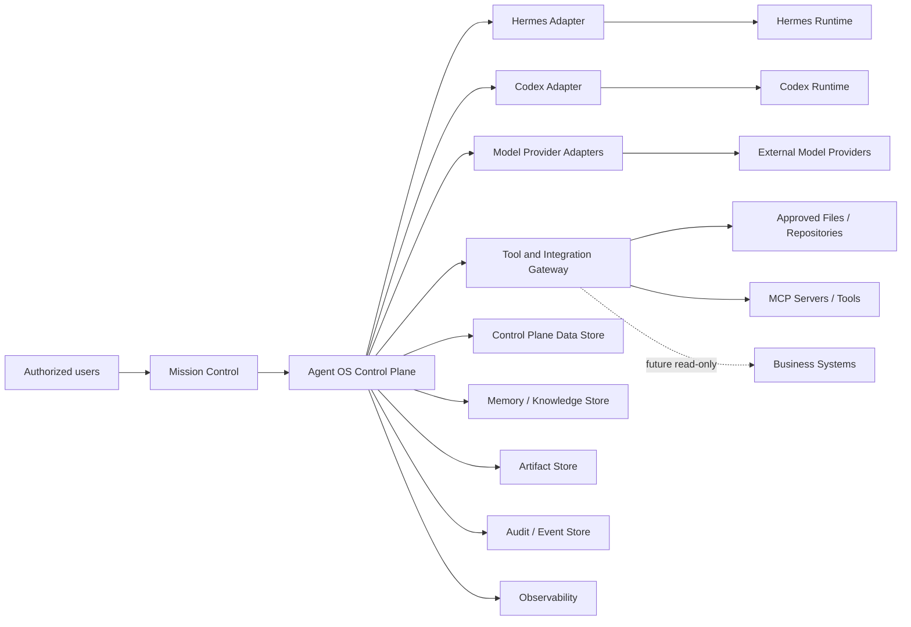
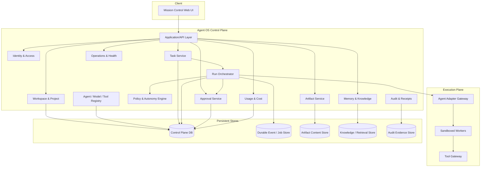
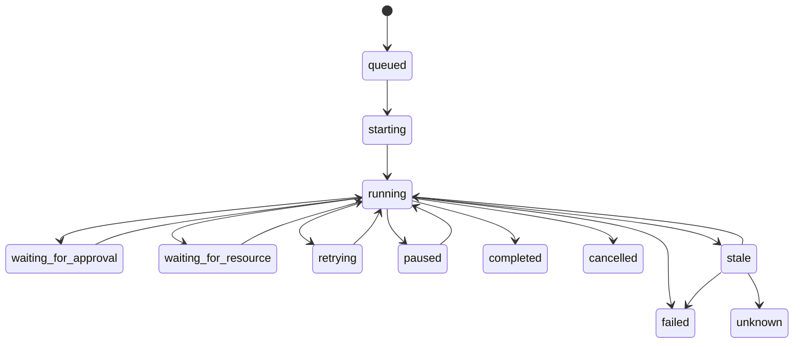
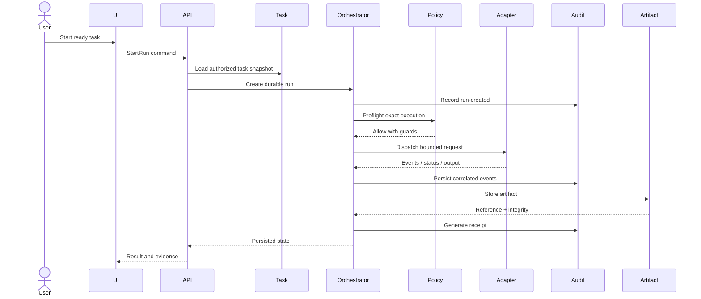
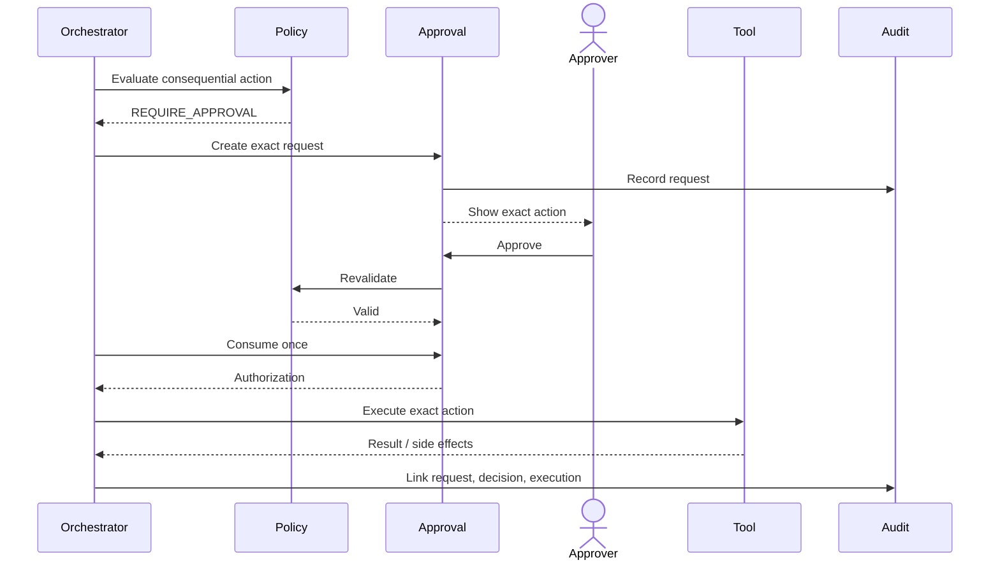
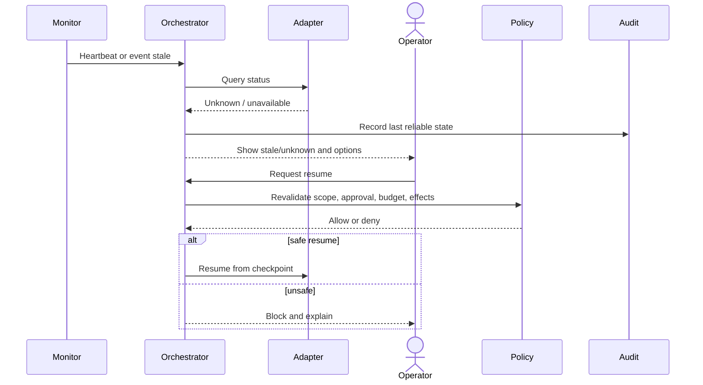
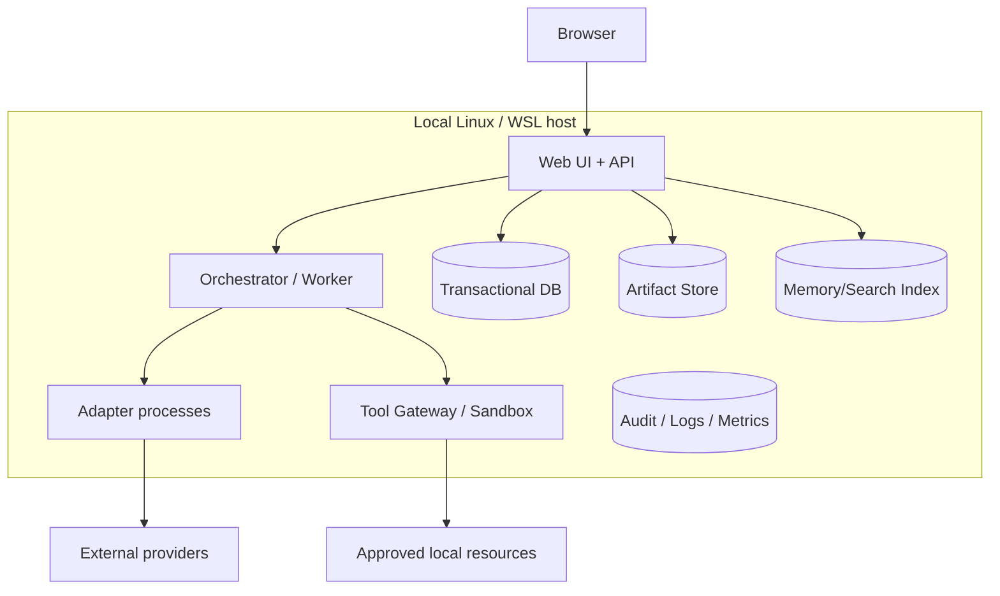

# SAD-001 — Agent OS System Architecture Description

> **Status: Approved baseline — 2026-08-13.** This document defines the proposed logical architecture for the first Agent OS MVP and its evolution path. It does not select final technologies, prove implementation, authorize production use, or replace detailed domain, data, integration, security, deployment, contract, and test specifications.

## 1. Document purpose

This document defines the proposed architecture of Agent OS, including:

- architectural goals and constraints;
- logical components and responsibilities;
- control-plane and execution-plane separation;
- trust boundaries;
- major synchronous and asynchronous flows;
- data ownership and persistence rules;
- approvals, policy, adapters, tools, memory, artifacts, audit, and cost services;
- local Linux/WSL deployment;
- failure, recovery, observability, and security behavior;
- future scale-out constraints;
- architecture decisions requiring ADRs;
- traceability to requirements.

## 2. Architecture scope

The first MVP architecture includes:

- authenticated responsive web Mission Control;
- one organization context;
- multiple isolated workspaces;
- projects, memberships, and predefined roles;
- Codex, Hermes, and Claude Code adapter targets;
- provider-neutral model profiles;
- bounded tasks;
- durable runs and steps;
- exact-action approvals;
- governed tools and integrations;
- sandboxed execution;
- permission-aware memory;
- artifacts and provenance;
- audit and execution receipts;
- usage and cost attribution;
- health, backup, restore, and local operations;
- local single-node deployment.

It excludes public multi-tenant SaaS, anonymous access, unrestricted remote exposure, high availability, unrestricted production access, financial posting, autonomous merge, multi-agent swarms, a public plugin marketplace, and a full media Studio.

## 3. Architecture drivers

### 3.1 Product drivers

1. Preserve work across agents and providers.
2. Keep humans in control of consequential actions.
3. Expose real state, uncertainty, provenance, and cost.
4. Operate locally before public or managed deployment.
5. Avoid provider, model, and agent lock-in.
6. Support Hermes and Codex through common product concepts.
7. Isolate workspaces.
8. Support interruption, cancellation, retry, and recovery.
9. Retain governed artifacts and memory.
10. Prepare for future commercialization without premature SaaS complexity.

### 3.2 Quality drivers

- durability;
- integrity;
- least privilege;
- workspace isolation;
- explicit authorization;
- idempotency;
- observability;
- accessibility;
- recoverability;
- modularity;
- contract versioning;
- truthful degraded-state reporting.

### 3.3 Primary architecture risks

- prompt-based permission escalation;
- duplicated side effects;
- false completion;
- agent/provider state mismatch;
- secret leakage;
- cross-workspace exposure;
- unsafe retry;
- approval replay;
- tool or MCP abuse;
- malicious artifact preview;
- local data loss;
- audit gaps;
- dependency compromise.

## 4. Architecture principles

### `AP-001` — Control plane owns authority

Agent OS owns task/run identity, workspace scope, policy, approvals, grants, receipts, audit, artifact/memory metadata, and cost attribution.

### `AP-002` — External runtimes remain replaceable

Hermes, Codex, model providers, and tools remain behind versioned contracts.

### `AP-003` — Persist before dispatch

A run and its policy/task snapshot are durable before external execution begins.

### `AP-004` — Policy before capability

Installed, connected, or reachable does not mean authorized.

### `AP-005` — Exact approval before consequential effect

Approval binds to one normalized action, target, parameters, policy version, and expiry.

### `AP-006` — Workspace scope everywhere

Protected records, events, queries, credentials, artifacts, memory, and costs carry workspace context where applicable.

### `AP-007` — Unknown remains unknown

Missing or conflicting evidence is not converted into false success, false failure, or zero.

### `AP-008` — Append-oriented evidence

Corrections create new evidence rather than silently rewriting history.

### `AP-009` — Synchronous command, asynchronous execution

Commands may be acknowledged synchronously while long execution proceeds through durable state and events.

### `AP-010` — Local-first, production-capable contracts

The deployment is local single-node, but identifiers, contracts, and idempotency must not depend permanently on one process.

### `AP-011` — Facts and generated interpretation stay separate

Platform facts, provider reports, estimates, and generated summaries are distinct.

## 5. Proposed architectural style

The first MVP should use a **modular control-plane architecture with durable orchestration and isolated execution adapters**.

A modular monolith plus isolated worker/adapter/sandbox processes is preferred over premature microservices because it offers:

- simpler local operations;
- lower resource use;
- easier transactions;
- simpler backup and restore;
- easier end-to-end debugging;
- fewer distributed failure modes.

Internal boundaries must still be enforced through modules, versioned contracts, stable identifiers, events, dependency rules, and policy gateways.

## 6. System context



## 7. Logical architecture



## 8. Component catalogue

| Component ID | Component | Responsibility |
|---|---|---|
| `CMP-UI` | Mission Control Web UI | Accessible user interaction, navigation, status, approval, artifacts, audit, costs |
| `CMP-API` | Application/API Layer | Commands, queries, validation, session/scope binding, response shaping |
| `CMP-IAM` | Identity and Access | Identities, sessions, membership, roles, effective permission context |
| `CMP-WSP` | Workspace and Project | Organization, workspaces, projects, isolation metadata |
| `CMP-REG` | Registry | Agents, adapters, model profiles, tools, capabilities, versions, health references |
| `CMP-TSK` | Task Service | Task scope, snapshots, readiness, lifecycle |
| `CMP-ORC` | Run Orchestrator | Durable runs, steps, dispatch, wait, retry, resume, cancel, limits |
| `CMP-POL` | Policy and Autonomy Engine | Authorization, risk, approval need, grants, revocation |
| `CMP-APR` | Approval Service | Exact requests, decisions, expiry, invalidation, one-time consumption |
| `CMP-AGW` | Agent Adapter Gateway | Hermes/Codex normalization, health, capability and state mapping |
| `CMP-TGW` | Tool and Integration Gateway | Tool policy, target normalization, dispatch, receipts |
| `CMP-SBX` | Sandboxed Workers | Bounded command/file/network/resource execution |
| `CMP-MEM` | Memory and Knowledge | Ingestion, provenance, retrieval, correction, retention |
| `CMP-ART` | Artifact Service | Metadata, content, integrity, lifecycle, safe preview |
| `CMP-AUD` | Audit and Receipts | Correlated events, receipts, evidence export |
| `CMP-CST` | Usage and Cost | Usage normalization, attribution, budgets, reconciliation |
| `CMP-OPS` | Operations and Health | Health, diagnostics, build identity, backup/restore coordination |
| `CMP-EVT` | Durable Event/Job Subsystem | Async jobs, timers, retries, delivery state |
| `CMP-OBS` | Observability | Logs, metrics, traces, alerts, health freshness |
| `CMP-CPDB` | Control Plane Store | Transactional operational state |
| `CMP-OBJ` | Artifact Content Store | Retained artifact files/content |
| `CMP-KST` | Knowledge/Retrieval Store | Memory content and retrieval indexes |
| `CMP-AUDS` | Audit Evidence Store | Protected retained evidence |

## 9. Mission Control Web UI

The UI must:

- show active organization/workspace/project context;
- derive operational state from APIs and persisted sources;
- distinguish real, stale, unknown, partial, failed, and unavailable states;
- provide approval review with exact parameters and evidence;
- support responsive layouts and WCAG-oriented interactions;
- avoid silent mock fallbacks;
- treat client caching as non-authoritative;
- keep server-side authorization mandatory.

Potential real-time update methods include polling, server-sent events, or WebSocket. The final choice requires an ADR and must support reconnection and stale-state behavior.

## 10. Application and API layer

Responsibilities:

- receive authenticated commands and queries;
- validate schemas;
- bind organization/workspace context;
- enforce coarse authorization;
- invoke application/domain services;
- return stable identifiers;
- implement designated idempotency keys;
- avoid exposing internal persistence models;
- expose errors with safe codes, correlation, retryability, and side-effect certainty.

The likely public interface is REST/OpenAPI plus asynchronous state updates, but `API-001` and `EVT-001` remain the authoritative future contracts.

## 11. Identity and access architecture

`CMP-IAM` owns the authorization context used by all modules.

It covers:

- human, agent, worker, and integration identities;
- sessions and expiry;
- organization/workspace membership;
- predefined roles;
- delegated approver authority;
- revocation;
- identity type;
- effective permissions.

Rules:

- workload identities cannot be human approvers;
- persona and role are separate;
- technical operation does not automatically grant content access;
- audit roles remain read-only;
- authorization uncertainty fails closed;
- identity-provider choice remains open.

## 12. Workspace and project architecture

The workspace is the primary access and data-isolation boundary.

Workspace-scoped data includes:

- projects;
- tasks and runs;
- approvals;
- adapter/model enablement;
- tools and permission grants;
- memory;
- artifacts;
- audit views;
- usage and cost;
- policy profiles.

Isolation must be enforced through:

- explicit workspace identifiers;
- authorization predicates;
- scoped storage references;
- workspace filtering before semantic retrieval;
- workspace-aware events and costs;
- workspace-scoped credentials and grants;
- negative tests across every access path.

The exact database-isolation approach is deferred to `DAT-001` and an ADR.

## 13. Task architecture

`CMP-TSK` owns the durable specification of work.

A task contains:

- workspace and optional project;
- desired outcome;
- permitted resources;
- data classification;
- selected or routed agent/model;
- tools;
- time, cost, step, and retry limits;
- expected artifacts;
- approval context;
- lifecycle state;
- immutable or logically immutable snapshots.

Each run references the exact task snapshot used. Material scope changes create a new snapshot and may invalidate readiness and approvals.

## 14. Run orchestration architecture

`CMP-ORC` owns:

- run creation before dispatch;
- run and step state;
- preflight;
- adapter dispatch;
- waiting for approval/resource;
- cancellation;
- bounded retries;
- checkpoint and resume;
- stale/unknown detection;
- limits;
- lineage;
- receipt generation inputs.



The selected durable-workflow mechanism remains open. Candidates include database-backed durable jobs, an embedded workflow engine, or a dedicated orchestrator. The decision requires an ADR.

## 15. Policy and autonomy architecture

`CMP-POL` receives:

- identity and identity type;
- workspace and role;
- action class;
- normalized target and parameters;
- data classification;
- network destination;
- tool/model/adapter;
- side-effect and reversibility;
- cost/time/step context;
- active grants;
- approval state;
- emergency stop;
- policy version.

It returns one of:

- `ALLOW`;
- `ALLOW_WITH_GUARDS`;
- `REQUIRE_APPROVAL`;
- `DENY`;
- `UNKNOWN`.

The policy layer must be versioned, testable, fail closed, persist decision evidence, and remain impossible to override through prompts.

## 16. Approval architecture

`CMP-APR` owns exact human approval.

Approval requests contain:

- requester;
- workspace/task/run/step;
- action class;
- normalized target;
- exact parameters;
- immutable action hash/version;
- risk and policy reason;
- preview/diff;
- expected effects;
- expiry;
- required authority and independence;
- evidence gaps.

Approval consumption must be atomic with authorization of one execution attempt. A changed, expired, invalidated, cancelled, or consumed approval cannot authorize the action.

## 17. Agent adapter architecture

`CMP-AGW` isolates Hermes- and Codex-specific behavior.

The common contract must address:

- identity and version;
- declared capabilities;
- health and reachability;
- task/run dispatch;
- state/events or polling;
- cancellation;
- retry/resume support;
- artifacts;
- tool visibility;
- actual provider/model reporting;
- usage/cost reporting;
- errors and limitations.

Unsupported features remain `unavailable` or `unknown`; they are never fabricated as supported.

## 18. Model-provider architecture

Logical model profiles contain:

- logical profile name;
- provider and provider model ID;
- capability intent;
- data restrictions;
- context/output limits;
- budget;
- validation state;
- routing/fallback policy;
- workspace enablement;
- secret reference;
- actual model attribution.

Fallback must be explicitly configured, recorded, and visible. Silent provider substitution is prohibited.

## 19. Tool and integration gateway

`CMP-TGW` is the mandatory gateway for protected side effects.

It must:

- normalize capability, target, and parameters;
- evaluate policy;
- verify approval;
- restrict filesystem/network scope;
- supply bounded credentials/capabilities;
- dispatch;
- retain receipts;
- report known or unknown side effects;
- enforce revocation.

Adapters may not bypass this gateway for protected actions unless they can expose exact actions before side effect and preserve equivalent policy, approval, sandbox, and receipt guarantees.

## 20. Sandbox architecture

The execution boundary must provide:

- explicit mounted resources;
- read/write separation;
- path normalization and traversal protection;
- process, CPU, memory, time, and output limits;
- network policy;
- no host Docker socket by default;
- no production credentials;
- no arbitrary host shell;
- cleanup and cancellation;
- evidence capture.

Candidate technologies include OS process isolation, containers, VMs/microVMs, restricted remote workers, or a hybrid. `SAN-001` and an ADR are required before real tool execution.

## 21. Memory and knowledge architecture

`CMP-MEM` governs retained context.

Memory classes may include:

- temporary working context;
- durable generated memory;
- user-approved preferences;
- verified project facts;
- authoritative references;
- correction/supersession records;
- retrieval-index entries.

Required metadata:

- workspace;
- optional project;
- source;
- producer;
- task/run/step;
- classification;
- confidence/verification;
- retention state;
- correction lineage;
- retrieval visibility.

Retrieval order:

1. authenticate;
2. authorize workspace and data class;
3. exclude inactive/deleted/expired records;
4. perform relevance retrieval;
5. attach source, age, and confidence;
6. apply provider/tool policy before onward use;
7. retain retrieval evidence where required.

Workspace filtering must occur before semantic/vector retrieval. The retrieval index is not authoritative.

## 22. Artifact architecture

`CMP-ART` owns artifact metadata, content relationship, integrity, lifecycle, preview, and retrieval.

Metadata includes:

- artifact ID;
- workspace/project/task/run/step;
- producer;
- media type and size;
- integrity hash;
- storage reference;
- classification;
- lifecycle;
- version/derivative relationship;
- preview state;
- retention state.

The content store may initially be a controlled local filesystem or object-storage-compatible service. It must support integrity verification, safe preview, workspace access control, backup, migration, and explicit missing/partial states.

## 23. Audit and receipt architecture

`CMP-AUD` records:

- authentication/session events;
- membership/role changes;
- registry/configuration changes;
- task/run/step events;
- policy decisions;
- approval lifecycle;
- adapter/model events;
- tool invocations;
- memory/artifact lifecycle;
- usage/cost events;
- health and backup/restore events;
- security denials;
- release/build identity.

Each event should contain a stable ID, schema version, timestamp, identity, workspace, correlation, type, result, reason, references, and redaction state.

Corrections use new linked events rather than silent mutation.

Receipt types include:

- run receipt;
- tool receipt;
- approval-consumption receipt;
- backup/restore evidence;
- evidence-export manifest.

## 24. Usage and cost architecture

`CMP-CST` normalizes:

- provider-reported token/usage data;
- adapter usage;
- tool usage;
- configured pricing;
- local resource measurements where useful;
- reconciliation records.

States include:

- provider-reported;
- calculated;
- estimated;
- pending;
- unavailable;
- unattributed;
- reconciled;
- mismatched.

Attribution dimensions include organization, workspace, project, task, run, adapter, provider, model, tool, period, and currency.

Unknown cost is not zero, and Agent OS cost is not business profit.

## 25. Operations and health architecture

`CMP-OPS` exposes component-specific rather than global decorative health.

Example:

```text
Control plane: ready
Database: ready
Artifact store: degraded
Hermes adapter: unreachable
Codex adapter: validated
Provider profile A: quota exceeded
Event pipeline: stale
Backup: last complete 18 hours ago
```

Diagnostics must be read-only, safe, timestamped, and free of raw secrets.

## 26. Persistent storage architecture

The architecture uses separate logical stores even if one technology implements several initially.

### 26.1 Control-plane transactional store

Stores organizations, workspaces, roles, registry metadata, tasks, snapshots, runs, approvals, policy/grant references, artifact metadata, memory metadata, cost records, and operations metadata.

### 26.2 Durable event/job store

Stores asynchronous jobs, timers, retries, scheduling, delivery state, and optional outbox/inbox records.

### 26.3 Artifact content store

Stores retained artifact files/content.

### 26.4 Memory/retrieval store

Stores retained memory content and search/vector indexes.

### 26.5 Audit evidence store

Stores append-oriented events and receipts.

The MVP may use one relational database for several logical stores, provided module ownership, append restrictions, retention, backup, and future separation remain clear.

## 27. Transaction and consistency model

### Strong consistency is required for

- membership and role changes;
- run creation before dispatch;
- task snapshot linkage;
- approval validity and one-time consumption;
- grants and revocation;
- artifact acceptance state;
- hard budget reservation where used;
- security-critical audit linkage.

### Eventual consistency is acceptable for

- dashboard aggregates;
- search indexes;
- memory retrieval indexes;
- cost reconciliation;
- observability dashboards;
- noncritical health summaries;
- derived analytics.

Eventually consistent views must expose source, last update, freshness, reconciliation, and a path to authoritative detail.

## 28. Idempotency architecture

Idempotency is required for:

- run start;
- approval consumption;
- one-time tool invocation;
- retry/resume dispatch;
- usage ingestion;
- artifact registration;
- backup commands where duplicate requests are possible.

Keys should include organization/workspace, action, target, task/run/step/attempt, requester, and normalized action version as applicable.

## 29. Event architecture

Events support long-running work, state propagation, retry, audit correlation, and future component separation.

Candidate events:

- task ready/blocked;
- run created/started/state changed;
- step created/state changed;
- approval requested/decided/expired/consumed;
- adapter health changed;
- tool invocation requested/completed;
- artifact created/state changed;
- memory created/corrected/deleted;
- usage/cost recorded;
- backup/restore state changed;
- security denial;
- emergency stop.

The architecture should assume at-least-once delivery unless a selected system proves otherwise. Consumers must deduplicate, tolerate reordering, validate schema versions, and expose processing gaps.

## 30. Primary execution sequence



## 31. Approval-gated sequence



## 32. Interrupted-run recovery sequence



## 33. Trust boundaries

| ID | Boundary |
|---|---|
| `TB-001` | Browser ↔ API/control plane |
| `TB-002` | Authenticated identity ↔ workspace authorization |
| `TB-003` | Control plane ↔ adapter gateway |
| `TB-004` | Adapter gateway ↔ Hermes/Codex runtime |
| `TB-005` | Agent OS/adapter ↔ model provider |
| `TB-006` | Orchestrator ↔ sandbox worker |
| `TB-007` | Sandbox/tool gateway ↔ filesystem/repository |
| `TB-008` | Tool gateway ↔ MCP/external tool |
| `TB-009` | Application ↔ secret mechanism |
| `TB-010` | Application ↔ persistent stores |
| `TB-011` | Workspace A ↔ Workspace B |
| `TB-012` | Local deployment ↔ external network |
| `TB-013` | Agent OS ↔ future business systems |
| `TB-014` | Approval requester ↔ approver authority |
| `TB-015` | Audit writer ↔ audit reader/exporter |

Every boundary must be analyzed in `THR-001`.

## 34. Security architecture integration

This architecture requires:

- authenticated sessions;
- distinct human/workload identity types;
- workspace authorization;
- least-privilege roles;
- policy before dispatch;
- approval before consequential effects;
- secure secret references;
- sandboxed execution;
- network egress controls;
- protected artifact preview;
- append-oriented audit;
- dependency/plugin control;
- backup confidentiality;
- default non-public deployment;
- revocation and emergency stop.

Detailed controls belong in `SEC-001`, `IAM-001`, `POL-001`, `SAN-001`, and `SEC-002`.

## 35. Secret architecture

Agent OS should store references and metadata, not raw values, including owner, purpose, scope, provider/tool association, expiry/rotation metadata, policy, and last-use evidence.

Raw secrets must not appear in tasks, prompts, ordinary configuration, memory, artifacts, audit, logs, or UI state.

The secret-delivery mechanism requires `SEC-002` and an ADR.

## 36. Data classification integration

Data classes:

- public;
- internal;
- confidential;
- secret;
- regulated/sensitive.

Classification affects provider use, tool use, network destinations, memory, artifact storage, preview, export, retention, audit visibility, and backup.

## 37. Error model

Errors should identify:

- stable code;
- safe user message;
- correlation ID;
- origin component;
- retryability;
- side-effect certainty;
- evidence location;
- remediation where possible.

Error origins include validation, authentication, authorization, policy, approval, adapter, provider, tool, sandbox, storage, events, integrity, cost, and recovery.

## 38. Degraded mode

| Failure | Expected behavior |
|---|---|
| Hermes unavailable | Existing records remain readable; Hermes dispatch blocked |
| Codex unavailable | Existing records remain readable; Codex dispatch blocked |
| Model provider unavailable | Affected profiles unavailable; no silent fallback |
| Artifact store degraded | Metadata visible; content unavailable/partial; new acceptance may block |
| Memory index unavailable | Metadata remains; retrieval unavailable |
| Cost data delayed | Cost shown pending/unknown |
| Event update channel unavailable | Polling fallback or stale indicator |
| Audit pipeline unavailable | Consequential actions may block |
| Backup target unavailable | Backup failed; explicit operational risk |
| Search index unavailable | Direct navigation remains; search unavailable |

## 39. Observability architecture

All significant work should correlate:

- user request;
- task;
- run;
- step/attempt;
- approval;
- tool invocation;
- artifact;
- adapter session;
- provider request;
- event.

Telemetry types:

- structured logs;
- metrics;
- traces;
- health checks;
- audit events;
- receipts.

Audit supports accountability; observability supports diagnosis. They overlap but are not identical.

## 40. Backup and restore architecture

Backup scope should include:

- transactional state;
- durable job/event state needed for recovery;
- audit evidence;
- memory metadata/content and rebuild inputs;
- artifact metadata/content;
- configuration metadata;
- schema/build/version manifest.

Restore principles:

- validate integrity and compatibility;
- enter maintenance/recovery mode;
- restore in dependency order;
- rebuild derived indexes where possible;
- report missing/partial data;
- preserve recovery evidence;
- measure RTO;
- never present partial restore as complete.

## 41. Local deployment architecture



Constraints:

- no public exposure by default;
- persistent storage outside ephemeral processes;
- controlled configuration;
- secrets outside Git;
- component health checks;
- backup target;
- build/version identity;
- clean shutdown;
- reproducible startup.

## 42. Proposed process boundaries for MVP

May remain in one application deployment:

- API;
- IAM;
- workspace/project;
- registry;
- task;
- policy;
- approval;
- artifact metadata;
- usage/cost;
- operations.

Likely separate processes:

- orchestrator/worker;
- Codex adapter;
- Hermes adapter;
- Claude Code adapter;
- sandbox/tool worker;
- database;
- optional event broker;
- optional retrieval index.

This is a simplification proposal, not an approved technology layout.

## 43. Future distributed evolution

Future separation may include API/query nodes, orchestrator, worker pools, adapter services, tool gateway, event broker, artifact service, memory service, audit pipeline, and managed stores.

Prerequisites:

- stable contracts;
- idempotency;
- worker ownership/leases;
- event ordering strategy;
- network identity;
- secure service-to-service communication;
- distributed tracing;
- multi-organization authorization;
- HA backup/recovery;
- operational maturity.

## 44. Multi-organization evolution constraints

Although the MVP has one organization, protected records should avoid irreversible single-tenant assumptions by carrying organization and workspace identifiers where appropriate.

The MVP does not implement public tenant provisioning, customer billing, data residency options, tenant-specific encryption keys, or public support tooling.

## 45. Standards position

Candidate standards:

- OpenAPI;
- AsyncAPI;
- MCP;
- AG-UI;
- A2A;
- OAuth/OIDC;
- OpenTelemetry.

Adoption requires a real requirement, local fit, security compatibility, versioning, testability, maintainability, and an ADR/profile. No standard is adopted merely because it is popular.

## 45A. ADR-003 architecture refinement

The product-owner-validated baseline in `ADR-003` refines the proposed architecture as follows:

- `Project → Mission → Task → Run` is the canonical work hierarchy.
- Conversations are independent durable interaction threads and may link to any work object.
- Personal and team workspaces are both supported; workspace membership does not imply access to every resource.
- Conversation visibility is `private`, `project`, or `workspace`, with `private` as the default.
- Initial adapters are Codex, Hermes, and Claude Code.
- Action classes are `read`, `generate`, `controlled_write`, `external_effect`, `destructive`, and `critical`.
- `external_effect`, `destructive`, and `critical` actions require approval; critical actions also require recent reauthentication.
- Temporal is the selected durable orchestration service under `ADR-004`. PostgreSQL remains authoritative for business state and audit; Redis is non-authoritative auxiliary infrastructure.
- Plugins can expose broad capabilities but remain behind capability declaration, policy, Tool Gateway, sandbox, approval, workspace scope, and audit controls.

This section is a draft refinement and does not change the status of this document or any approved ADR by itself.

## 46. ADR backlog

| ADR | Decision |
|---|---|
| `ADR-CANDIDATE-001` | Primary application language/framework and frontend architecture |
| `ADR-CANDIDATE-002` | Transactional database |
   | `ADR-CANDIDATE-003` | Durable orchestration mechanism |
| `ADR-CANDIDATE-004` | Artifact storage |
| `ADR-CANDIDATE-005` | Sandbox technology |
| `ADR-CANDIDATE-006` | Identity/session mechanism |
| `ADR-CANDIDATE-007` | Secret manager/configuration |
| `ADR-CANDIDATE-008` | Event transport and delivery |
| `ADR-CANDIDATE-009` | UI real-time update method |
| `ADR-CANDIDATE-010` | Memory/retrieval technology |
| `ADR-CANDIDATE-011` | Audit integrity model |
| `ADR-CANDIDATE-012` | Deployment packaging |

## 47. Requirement-to-component mapping

| Requirement domain | Primary components |
|---|---|
| `FR-AUTH-*` | `CMP-IAM`, `CMP-API`, `CMP-AUD` |
| `FR-WSP-*` | `CMP-WSP`, `CMP-IAM`, `CMP-CPDB` |
| `FR-AGT-*` | `CMP-REG`, `CMP-AGW`, `CMP-AUD` |
| `FR-MOD-*` | `CMP-REG`, `CMP-AGW`, `CMP-CST`, `CMP-POL` |
| `FR-TSK-*` | `CMP-TSK`, `CMP-POL`, `CMP-CPDB` |
| `FR-RUN-*` | `CMP-ORC`, `CMP-EVT`, `CMP-AGW`, `CMP-AUD` |
| `FR-APR-*` | `CMP-APR`, `CMP-POL`, `CMP-IAM`, `CMP-AUD` |
| `FR-TOL-*` | `CMP-TGW`, `CMP-SBX`, `CMP-POL`, `CMP-AUD` |
| `FR-MEM-*` | `CMP-MEM`, `CMP-KST`, `CMP-POL`, `CMP-AUD` |
| `FR-ART-*` | `CMP-ART`, `CMP-OBJ`, `CMP-AUD` |
| `FR-AUD-*` | `CMP-AUD`, `CMP-AUDS`, `CMP-OBS` |
| `FR-CST-*` | `CMP-CST`, `CMP-POL`, `CMP-CPDB` |
| `FR-UI-*` | `CMP-UI`, `CMP-API`, query sources |
| `FR-OPS-*` | `CMP-OPS`, `CMP-OBS`, stores, adapters |

## 48. NFR-to-architecture mapping

| NFR category | Architectural response |
|---|---|
| Performance | Local modular architecture, indexed queries, async long work |
| Reliability | Durable state, idempotency, explicit state machine |
| Availability | Graceful degradation and per-component health |
| Recovery | Backup manifests, restore order, checkpoints |
| Security | IAM, policy, approval, sandbox, network/file controls |
| Privacy | Classification, minimization, scoped stores and exports |
| Accessibility | Stable state semantics and responsive UI contracts |
| Observability | Correlation, structured events, health freshness |
| Maintainability | Modules, contracts, ADRs, fitness functions |
| Portability | Local deployment profile and technology-neutral contracts |
| Capacity | Bounded pilot targets and execution resource limits |
| Cost | Usage normalization and budget enforcement |
| Integrity | Transactions, hashes, append-oriented evidence |

## 49. Architecture fitness functions

Proposed checks:

1. Control-plane modules do not import Hermes/Codex-specific implementation directly.
2. Protected records require workspace scope.
3. External dispatch requires a persisted run.
4. Approval-required dispatch requires a consumed exact approval.
5. Unknown adapter capability is not treated as supported.
6. Protected tool execution passes through policy enforcement.
7. Ordinary schemas/logs reject raw secrets.
8. Run events carry correlation and schema version.
9. Dashboard aggregates expose freshness.
10. Artifact content/metadata integrity is verified.
11. Cross-workspace queries require authorized context.
12. Public contracts are versioned.

## 50. Architecture verification strategy

- dependency/module tests;
- contract tests;
- adapter conformance;
- policy/approval conformance;
- workspace isolation tests;
- idempotency and replay tests;
- fault injection;
- migration tests;
- backup/restore exercises;
- artifact integrity and preview tests;
- performance benchmarks;
- observability correlation tests;
- threat-model tests;
- accessibility E2E tests.

## 51. Architecture risks

| Risk | Impact | Mitigation |
|---|---|---|
| Modular monolith becomes tangled | Poor maintainability | Explicit modules and dependency rules |
| Workflow engine overcomplicates MVP | Delivery delay | Benchmark simpler durable-job option |
| Custom orchestration underdelivers | Recovery defects | Proven patterns and fault injection |
| Adapter hides side effects | Approval bypass | Normalized action and tool gateway |
| One store carries too much | Scaling/retention difficulty | Logical separation and migration path |
| Separate stores diverge | Orphaned metadata/content | Outbox/reconciliation patterns |
| UI update channel fails | False state | Polling fallback or stale indicator |
| Sandbox weak under WSL | Host risk | Early proof and deny unsafe features |
| Audit remains mutable | Weak evidence | Append restrictions and integrity controls |
| Memory index leaks scope | Data breach | Workspace filter before retrieval |
| Cost data incomplete | Misleading budgets | Pending/unavailable states |
| Premature protocol adoption | Lock-in | ADR fitness review |
| Premature microservices | Operational burden | Modular single-node deployment first |

## 52. Assumptions

- first deployment is local Linux/WSL;
- one organization context is sufficient;
- at least two workspaces are used for isolation testing;
- Hermes and Codex expose usable integration surfaces;
- protected tool side effects can be intercepted or disabled;
- a durable transactional store is available;
- local artifact storage is feasible;
- external provider access may be degraded;
- the user load is small;
- eventual consistency is acceptable for derived views;
- named owners will approve ADRs.

## 53. Constraints

- no technology is approved by this draft;
- no component is implemented merely because it is described;
- public access remains excluded;
- production and financial writes remain excluded;
- autonomous merge remains excluded;
- no arbitrary host shell;
- no prompt-based authority expansion;
- no accepted mock-based operational state;
- security and approval precede side effects;
- Git versioning remains deferred until the drafting series is complete.

## 54. Open decisions

1. Backend language and framework.
2. Frontend framework and data-query strategy.
3. Relational database.
4. Need for an event broker in MVP.
5. Durable orchestration mechanism.
6. Adapter process model.
7. Hermes integration mode.
8. Codex integration mode.
9. Initial model providers.
10. WSL/native Linux sandbox technology.
11. Secret-management approach.
12. Identity/session mechanism.
13. Artifact content store.
14. Memory retrieval/index technologies.
15. Audit integrity design.
16. UI real-time update method.
17. Backup format and target.
18. Native, container, or hybrid packaging.
19. OpenAPI/AsyncAPI/MCP/AG-UI/A2A profiles.
20. Components sharing a process/store in MVP.
21. Action-hash normalization.
22. Cost reconciliation design.
23. Health failures that block consequential execution.

## 55. Acceptance criteria

SAD-001 may advance to version `1.0.0` when:

1. Product confirms alignment with MVP scope.
2. Architecture confirms component responsibilities and boundaries.
3. Security accepts trust boundaries and enforcement placement.
4. Data accepts store ownership and consistency categories.
5. Operations accepts local deployment, health, backup, and recovery direction.
6. Quality confirms the architecture is testable.
7. Every functional domain maps to components.
8. Technology selections are assigned to ADRs.
9. External runtimes do not own platform authority.
10. Run-before-dispatch and approval-before-effect are enforceable.
11. Workspace isolation covers data, retrieval, tools, and events.
12. Degraded and unknown states are supported.
13. C4, DDD, DAT, ORC, INT, SEC, and DEP work can proceed.
14. Metadata, terminology, links, Markdown, and validation checks pass.

## 56. Downstream impact

| Document | Required use of SAD-001 |
|---|---|
| `C4-001` | Formalize actors, external systems, trust boundaries |
| `C4-002` | Formalize processes/containers/stores |
| `DDD-001` | Define domain boundaries and aggregates |
| `DAT-001` | Define stores, transactions, retention, ownership |
| `MEM-001` | Detail memory lifecycle and retrieval |
| `ORC-001` | Detail workflows, retries, checkpoints, cancellation |
| `INT-001` | Detail adapters, providers, tools, protocols |
| `SEC-001` | Detail controls at every trust boundary |
| `THR-001` | Analyze threats and abuse cases |
| `DEP-001` | Define deployment topology |
| `AGC-001` | Define adapter contract |
| `RUN-001` | Define run/step contract |
| `APR-001` | Define approval contract |
| `ART-001` | Define artifact contract |
| `AUD-001` | Define audit contract |
| `API-001`, `EVT-001` | Define sync and async interfaces |
| `TST-001` | Define conformance and fault tests |
| `RTM-001` | Replace architecture TBDs with component IDs |

## 57. Revision and approval history

### Approval state

- Current status: `approved`
- Current version: `0.1.0`
- Approved by: Product Owner under explicit user authorization to finalize the declared scope
- Approval date: not applicable
- Finalization note: approval records the documentation baseline only; implementation and verification remain separate evidence gates

### Revision history

| Version | Date | Status | Summary | Authority |
|---|---|---|---|---|
| 0.1.0 | 2026-07-19 | Draft | Initial logical architecture covering the control plane, execution plane, components, stores, durability, policy, approvals, adapters, tools, memory, artifacts, audit, costs, operations, deployment, and ADR backlog | Draft authoring; not approved |

## References

- `DOC-000` — Documentation Governance and Source-of-Truth Policy
- `GLO-001` — Glossary and Controlled Terminology
- `VSN-001` — Product Vision and Project Charter
- `SCP-001` — Scope and System Boundaries
- `PER-001` — Personas and Jobs to Be Done
- `UCD-001` — User Journeys and Use Cases
- `PRD-001` — Product Requirements Document
- `SRS-001` — Functional Requirements Specification
- `NFR-001` — Non-Functional Requirements
- `AUT-001` — Autonomy and Approval Matrix
- `RTM-001` — Requirements Traceability Matrix
