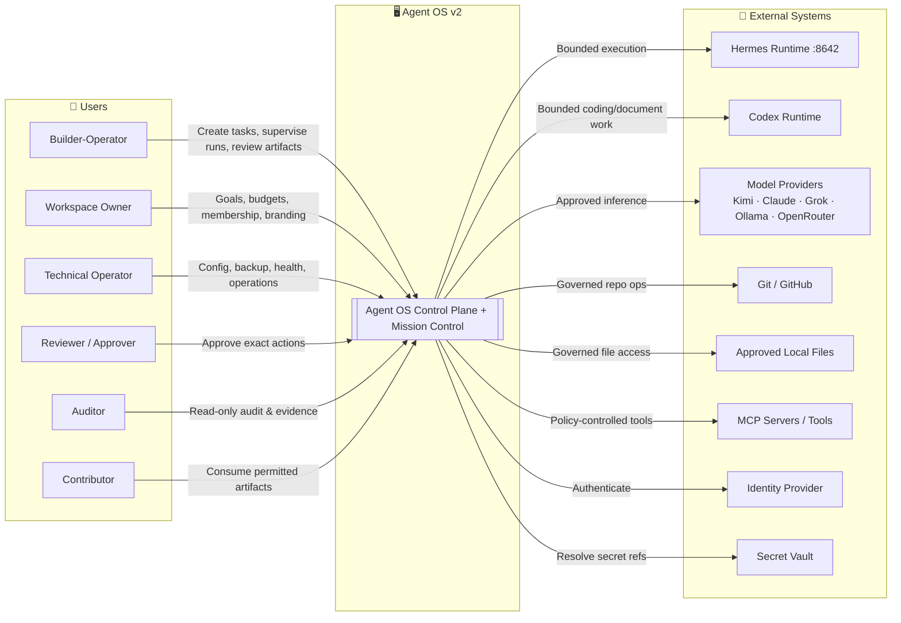
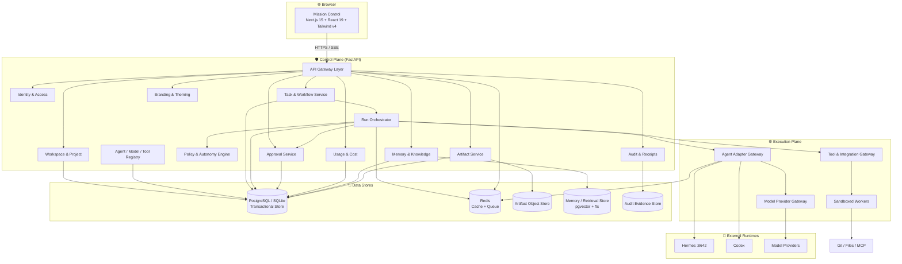
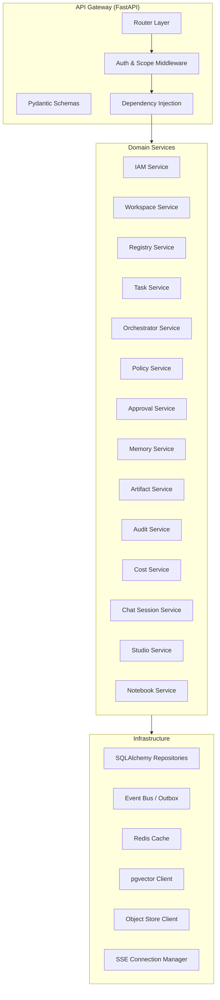
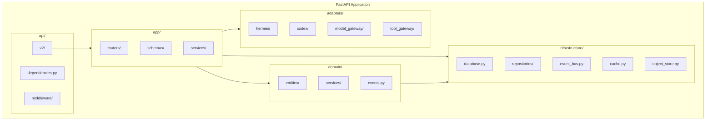
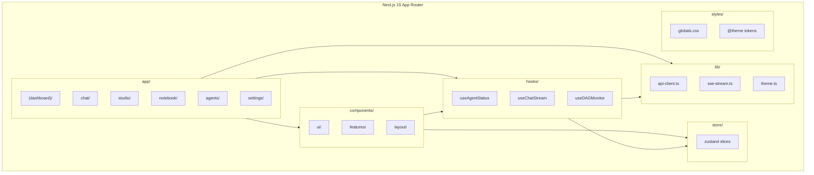
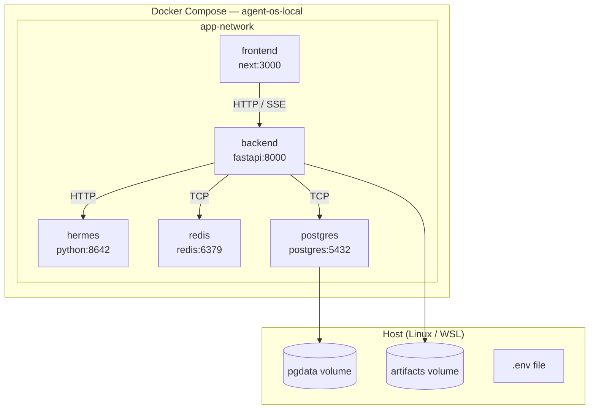
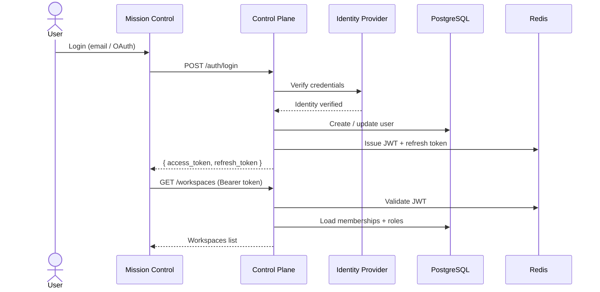
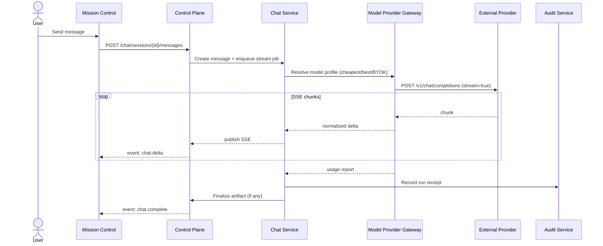
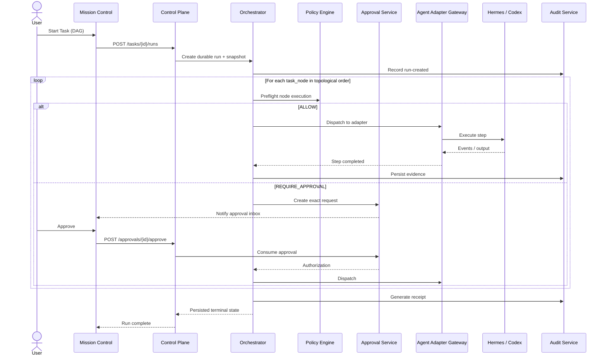
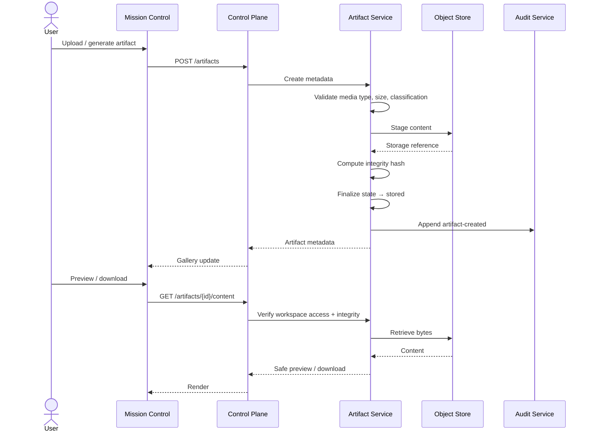

# Agent OS v2 — Goldie Edition / Architecture

> **Document:** `04-ARCHITECTURE.md`
> **Version:** 2.0.0
> **Status:** Draft — single source of truth for the development team
> **Last updated:** 2026-08-11
> **Scope:** C4 model (Context → Code), deployment, communication patterns, auth, data flows, and Goldie-v2 feature mapping.

---

## 1. Purpose & Non-Goals

This document is the **single source of truth** for Agent OS v2 architecture. It replaces and consolidates all prior architecture drafts (`SAD-001`, `C4-001`, `C4-002`, `INT-001`) for the Goldie Edition vertical slice.

**In scope:**
- C4 diagrams (Level 1 Context → Level 4 Code)
- Deployment topology (Docker Compose, local-first, team mode)
- Communication patterns (REST, SSE, async events, WebSocket for DAG)
- Authentication & authorization flow
- Data flows: Chat/Streaming, DAG Execution, Notebook ingestion, Artifact lifecycle
- Technology stack mapping and rationale
- Failure, recovery, and security boundaries

**Out of scope (deferred to ADRs):**
- Specific embedding model selection
- Multi-region HA
- Public SaaS tenancy
- Production financial connectors

---

## 2. Architecture Principles (v2)

| ID | Principle |
|---|---|
| `AP-001` | **Control plane owns authority.** Agent OS owns identity, workspace scope, policy, approvals, audit, and cost attribution. |
| `AP-002` | **External runtimes remain replaceable.** Hermes, Codex, and model providers sit behind versioned contracts. |
| `AP-003` | **Persist before dispatch.** A run and its policy/task snapshot are durable before any external execution begins. |
| `AP-004` | **Policy before capability.** Installed ≠ authorized. |
| `AP-005` | **Exact approval before consequential effect.** Approval binds to one normalized action, target, parameters, policy version, and expiry. |
| `AP-006` | **Workspace scope everywhere.** Records, events, credentials, artifacts, memory, and costs carry workspace context. |
| `AP-007` | **Unknown remains unknown.** Missing evidence is never converted into false success or zero. |
| `AP-008` | **Append-oriented evidence.** Corrections create new records; history is not silently rewritten. |
| `AP-009` | **Synchronous command, asynchronous execution.** Commands are acknowledged synchronously; long execution proceeds via durable state + events. |
| `AP-010` | **Local-first, production-capable contracts.** Identifiers, contracts, and idempotency must survive a single-process restart. |
| `AP-011` | **Facts and generated interpretation stay separate.** Platform facts, provider reports, estimates, and LLM summaries are distinct fields. |
| `AP-012` | **Streaming is first-class.** Chat, DAG status, and artifact generation push real-time updates via SSE. |

---

## 3. C4 Level 1 — System Context



### Actor Register

| ID | Actor | Responsibilities | Hard Limits |
|---|---|---|---|
| `ACTOR-001` | Builder-Operator | Defines tasks, starts runs, reviews outputs | Cannot bypass policy or self-expand permissions |
| `ACTOR-002` | Workspace Owner | Goals, budget, membership, branding | Cannot override global security |
| `ACTOR-003` | Technical Operator | Install, config, monitor, backup, restore | Does not auto-read all workspace content |
| `ACTOR-004` | Reviewer / Approver | Approves/rejects exact consequential actions | Acts only within delegated authority |
| `ACTOR-005` | Auditor | Reconstructs events and evidence | Read-only by default |
| `ACTOR-006` | Contributor | Reviews and reuses permitted outputs | Cannot configure high-risk capabilities |

### External System Register

| ID | System | Purpose | MVP |
|---|---|---|---|
| `EXT-001` | Hermes Runtime (:8642) | Execution engine for chat, files, terminal, swarm | In scope |
| `EXT-002` | Codex Runtime | Coding and document execution | In scope |
| `EXT-003` | Model Providers (Kimi, Claude, Grok, Ollama, OpenRouter) | Inference + embeddings | In scope |
| `EXT-004` | Git / GitHub | Source history | Bounded, non-production |
| `EXT-005` | Approved Local Files | Workspace resources | Bounded access |
| `EXT-006` | MCP Servers / Tools | External capabilities | Minimal approved set |
| `EXT-007` | Identity Provider | Credential verification | In scope; BYOK |
| `EXT-008` | Secret Vault | Protected credential storage | In scope; BYOK |

---

## 4. C4 Level 2 — Container Diagram



### Container Register

| ID | Container | Tech | Responsibility |
|---|---|---|---|
| `CTR-001` | Mission Control | Next.js 15 + React 19 + Tailwind v4 + TypeScript | Dark-theme UI, sidebar navigation, real-time dashboards, chat, Studio, Notebook |
| `CTR-002` | Control Plane API | FastAPI + asyncpg + SQLAlchemy 2.0 | Auth, commands, queries, validation, workspace binding, idempotency |
| `CTR-003` | Run Orchestrator | FastAPI background tasks + Redis | Durable runs, steps, DAG dispatch, wait, retry, resume, cancel, limits |
| `CTR-004` | Agent Adapter Gateway | FastAPI module | Normalize Hermes/Codex contracts, health, capability mapping |
| `CTR-005` | Model Provider Gateway | FastAPI module | Resolve profiles, validate workspace eligibility, enforce fallback chain, record actual model |
| `CTR-006` | Tool & Integration Gateway | FastAPI + sandbox | Normalize tool actions, enforce policy, verify approval, restrict scope |
| `CTR-007` | Memory & Knowledge Service | FastAPI module + pgvector | Ingestion, provenance, retrieval, correction, semantic + lexical search |
| `CTR-008` | Artifact Service | FastAPI module | Metadata, integrity, lifecycle, safe preview, gallery |
| `CTR-009` | Audit & Receipt Service | FastAPI module | Append-oriented events, receipts, evidence export |
| `CTR-010` | Usage & Cost Service | FastAPI module | Normalize usage, attribution, budgets, reconciliation |
| `CTR-011` | Branding & Theming Service | FastAPI module | Dark tokens, agent colors, workspace white-label config |
| `CTR-015` | PostgreSQL | PostgreSQL 16+ / SQLite | Transactional state, relational integrity |
| `CTR-016` | Redis | Redis 7+ | Cache, job queue, SSE fan-out, rate limits |
| `CTR-017` | Artifact Object Store | Local FS / S3-compatible | Binary artifact content |
| `CTR-018` | Memory/Retrieval Store | PostgreSQL + pgvector | Embeddings, full-text search, vector similarity |
| `CTR-019` | Audit Evidence Store | PostgreSQL (append-only schema) | Correlated events, receipts, integrity |

---

## 5. C4 Level 3 — Component Diagram (Control Plane)



### Component Descriptions

| Component | Responsibility | Key Classes |
|---|---|---|
| `Router Layer` | HTTP routes: `/api/v1/workspaces`, `/api/v1/chat`, `/api/v1/tasks`, etc. | FastAPI `APIRouter` |
| `Auth Middleware` | JWT validation, workspace scope binding, CSRF where applicable | `JWTBearer`, `WorkspaceScope` |
| `IAM Service` | Sessions, membership, roles, effective permissions | `IdentityService`, `RoleResolver` |
| `Workspace Service` | CRUD, isolation, branding config | `WorkspaceService` |
| `Task Service` | Task + DAG node definition, snapshots, readiness | `TaskService`, `WorkflowBuilder` |
| `Orchestrator Service` | Run lifecycle, step dispatch, heartbeat monitoring | `RunOrchestrator`, `DAGExecutor` |
| `Policy Service` | Action classification, `ALLOW` / `REQUIRE_APPROVAL` / `DENY` | `PolicyEngine` |
| `Approval Service` | Exact requests, decisions, expiry, one-time consumption | `ApprovalService` |
| `Memory Service` | Ingestion, retrieval, correction, semantic search | `MemoryService`, `RetrievalPipeline` |
| `Notebook Service` | Markdown notes, wiki-links, backlinks, semantic search | `NotebookService` |
| `Chat Session Service` | SSE streaming, multi-provider routing, tool calls, artifacts | `ChatSessionManager`, `StreamBroker` |
| `Studio Service` | Media generation job queue: images, videos, speech | `StudioJobManager` |
| `Audit Service` | Correlated events, receipts, evidence gaps | `AuditService` |
| `Cost Service` | Usage normalization, budget enforcement | `CostService` |
| `SSE Manager` | Fan-out Server-Sent Events to Mission Control | `SSEManager` |

---

## 6. C4 Level 4 — Code / Module Diagram

### 6.1 Backend (FastAPI)



**Layer rules:**
- `api/` depends only on `app/` and `dependencies`
- `app/` depends on `domain/` and `infrastructure/`
- `domain/` is pure Python (no framework imports)
- `adapters/` implement versioned contracts; control plane never imports Hermes internals directly

### 6.2 Frontend (Next.js 15 + React 19)



---

## 7. Deployment Architecture

### 7.1 Local-First (Default)



### 7.2 Services & Ports

| Service | Container | Port | Purpose |
|---|---|---|---|
| Mission Control | `frontend` | `3000` | Next.js dev server or static export |
| Control Plane | `backend` | `8000` | FastAPI application |
| Hermes Gateway | `hermes` | `8642` | Internal agent execution engine |
| PostgreSQL | `postgres` | `5432` | Primary transactional + vector store |
| Redis | `redis` | `6379` | Cache, queue, pub/sub, SSE fan-out |

### 7.3 Docker Compose (Summary)

```yaml
# docker-compose.yml (excerpt)
services:
  frontend:
    build: ./frontend
    ports: ["3000:3000"]
    environment:
      NEXT_PUBLIC_API_URL: http://localhost:8000

  backend:
    build: ./backend
    ports: ["8000:8000"]
    env_file: .env
    depends_on: [postgres, redis, hermes]

  hermes:
    build: ./hermes
    ports: ["8642:8642"]
    env_file: .env
    volumes: ["./data/hermes:/data"]

  postgres:
    image: pgvector/pgvector:pg16
    ports: ["5432:5432"]
    volumes: ["pgdata:/var/lib/postgresql/data"]
    environment:
      POSTGRES_DB: agentos

  redis:
    image: redis:7-alpine
    ports: ["6379:6379"]
```

### 7.4 Environment Profiles

| Profile | Database | Vector | Auth | Use Case |
|---|---|---|---|---|
| `local` | SQLite | sqlite-vec or disabled | Local JWT | Solo dev, offline |
| `team` | PostgreSQL + pgvector | Enabled | OAuth + RBAC | Trusted team, shared workspace |
| `white-label` | PostgreSQL + pgvector | Enabled | BYOK IdP | Custom branding, client instance |

---

## 8. Communication Patterns

### 8.1 REST API (Synchronous)

- **Path prefix:** `/api/v1/`
- **Content-Type:** `application/json`
- **Auth:** `Authorization: Bearer <jwt>`
- **Workspace scope:** Header `X-Workspace-Id` or inferred from URL path
- **Idempotency:** `Idempotency-Key` header for `POST/PUT/PATCH`
- **Validation:** Pydantic v2 schemas
- **Error model:**
  ```json
  {
    "code": "RUN_PREFLIGHT_BLOCKED",
    "message": "Safe user-facing text",
    "correlation_id": "uuid",
    "retryable": false,
    "side_effect_certainty": "none",
    "detail": { ... }
  }
  ```

### 8.2 Server-Sent Events (SSE)

Used for:
- Real-time chat streaming (thinking indicators, code blocks, artifacts)
- DAG execution status updates
- Run orchestrator state changes
- Approval inbox notifications
- Mission Control KPI heartbeat

**Endpoint pattern:** `GET /api/v1/events/stream?workspace_id=...&topics=chat,runs,approvals`

**Event types:**
```
event: chat.delta
data: {"session_id":"...","delta":"...","finish_reason":null}

event: run.state_change
data: {"run_id":"...","state":"running","step_id":"..."}

event: dag.node_update
data: {"task_id":"...","node_id":"...","status":"completed","latency_ms":420}

event: artifact.ready
data: {"artifact_id":"...","media_type":"image/png","preview_url":"..."}
```

**Rules:**
- SSE manager runs in-memory (Redis pub/sub for multi-process fan-out)
- Reconnection with `Last-Event-ID` supported
- Stale data is timestamped; UI shows freshness indicator

### 8.3 Async Job Queue (Redis)

| Queue | Purpose | Workers |
|---|---|---|
| `q:runs` | Durable run dispatch and step execution | Orchestrator workers |
| `q:studio` | Image/video/voice generation jobs | Studio workers |
| `q:memory:index` | Embedding generation & index updates | Index workers |
| `q:audit` | Audit event batch write | Audit workers |
| `q:cost:reconcile` | Usage ingestion and cost calculation | Cost workers |

**Job payload:**
```json
{
  "job_id": "uuid",
  "correlation_id": "uuid",
  "workspace_id": "uuid",
  "task_id": "uuid",
  "run_id": "uuid",
  "step_id": "uuid",
  "payload": { ... },
  "max_retries": 3,
  "attempt": 1
}
```

### 8.4 WebSocket (Optional — DAG Inspector)

A lightweight WebSocket is available at `/ws/v2/dag` for the **Mission Control DAG live view** when lower latency than SSE is desired for high-frequency node status updates.

---

## 9. Authentication & Authorization Flow

### 9.1 Auth Flow



### 9.2 Workspace Scoping

Every protected request carries an effective workspace context:

1. **Header:** `X-Workspace-Id: <uuid>`
2. **Validation:** JWT `sub` must have membership in the workspace
3. **Enforcement:** SQLAlchemy query filter `workspace_id = :ws_id` applied at repository layer
4. **Cross-workspace:** Explicit denial unless global admin role

### 9.3 Role Permissions (RBAC)

| Role | Create Task | Start Run | Approve | Manage Agents | View Audit | Manage Workspace |
|---|---|---|---|---|---|---|
| `owner` | ✅ | ✅ | ✅ | ✅ | ✅ | ✅ |
| `operator` | ✅ | ✅ | ✅ | ✅ | ✅ | ❌ |
| `approver` | ❌ | ❌ | ✅ | ❌ | ✅ | ❌ |
| `contributor` | ✅ | ❌ | ❌ | ❌ | ❌ | ❌ |
| `auditor` | ❌ | ❌ | ❌ | ❌ | ✅ | ❌ |

---

## 10. Data Flows

### 10.1 Chat & Streaming



### 10.2 DAG Execution (Mission Control)



### 10.3 Notebook (KB) Ingestion & Retrieval

```mermaid
sequenceDiagram
    actor User
    participant UI as Notebook UI
    participant API as Control Plane
    participant NOTE as Notebook Service
    participant MEM as Memory Service
    participant POL as Policy Engine
    participant IDX as Index Worker
    participant DB as PostgreSQL
    participant KST as pgvector

    User->>UI: Create / edit note
    UI->>API: PUT /notebook/notes/{id}
    API->>NOTE: Normalize markdown, extract wiki-links
    NOTE->>NOTE: Parse backlinks
    NOTE->>DB: Persist note + note_links
    NOTE->>MEM: Propose durable memory
    MEM->>POL: Evaluate write policy
    POL-->>MEM: Allow with guards
    MEM->>DB: Persist memory_fact metadata
    MEM->>IDX: Enqueue embedding job
    IDX->>KST: Generate embeddings (chunked)
    IDX->>KST: Upsert lexical index
    MEM->>AUD: Record provenance

    User->>UI: Search notes + memory
    UI->>API: GET /notebook/search?q=...
    API->>MEM: Retrieve pipeline
    MEM->>KST: Vector + lexical candidates
    KST-->>MEM: Ranked results
    MEM->>MEM: Attach source, age, confidence
    MEM-->>API: Results
    API-->>UI: Render with wiki-links & backlinks
```

### 10.4 Artifact Lifecycle



---

## 11. Goldie Edition v2 Feature Mapping

### 11.1 Named Agents

| Name | Role | Default Color | Adapter |
|---|---|---|---|
| Crystal | Orchestrator / Mission Control | `#E879F9` (magenta) | Internal |
| Alex | Writer / Content | `#34D399` (emerald) | Claude |
| Elvis | Media / Studio | `#FBBF24` (amber) | OpenClaw |
| Joe | Reviewer / Verifier | `#60A5FA` (sky blue) | Hermes |
| Claude | General reasoning | `#F97316` (orange) | Claude |
| OpenClaw | Creative / media | `#EC4899` (pink) | OpenClaw |
| Hermes | Research / analysis | `#3B82F6` (blue) | Hermes |
| Gemini | Multimodal | `#EAB308` (yellow/green) | Gemini |
| Antigravity | Advanced reasoning | `#8B5CF6` (violet) | Custom |
| Codex | Code / terminal | `#9CA3AF` (gray) | Codex |
| Kimi | Long context | `#22C55E` (green) | Kimi |
| Grok | Real-time / X data | `#EF4444` (red) | Grok |

**Implementation:** `agents` table with `type`, `display_name`, `avatar_color`, `adapter_type`, and `capabilities_json`.

### 11.2 Mission Control — Live DAG

- **Data source:** `task_nodes` + `agent_runs` real-time state
- **Update mechanism:** SSE `dag.node_update` events
- **UI:** Canvas-based node graph with status glyphs (green = online/completed, yellow = ready/running, red = offline/failed, gray = queued)

### 11.3 Mission Board (Kanban)

- **Data model:** `tasks` with `status` mapped to Kanban columns
- **Drag-drop:** Updates `task_nodes.sequence_order` or `tasks.status` via optimistic UI + API confirmation

### 11.4 Studio — Media Generation

- **Queue:** `q:studio` (Redis)
- **Formats:** Image (PNG, JPG, WebP, SVG), Video (MP4, WebM, GIF), Speech (MP3, WAV, OGG, FLAC)
- **Job state:** `queued → generating → post-processing → ready → failed`
- **Storage:** `artifacts` table + Object Store

### 11.5 Notebook (KB)

- **Format:** Markdown with wiki-links `[[Note Title]]`
- **Backlinks:** Derived from `note_links` table
- **Search:** Hybrid lexical (PostgreSQL `tsvector`) + semantic (`pgvector` cosine similarity)
- **Semantic search:** `note_embeddings` and `memory_embeddings` tables

### 11.6 BYOK Model Gateway

- **Table:** `provider_keys`
- **Routing logic:**
  1. Primary provider by profile
  2. Fallback chain explicit in `config_json`
  3. Cost/latency weights (future: `provider_keys.routing_cost_weight`)
  4. Quota exceeded → next provider
- **Recording:** Actual provider/model stored on `agent_runs.actual_provider`, `agent_runs.actual_model_id`

### 11.7 Two-Lane Verifier

- **Lane 1 (Deterministic):** JSON schema validation, regex guards, checksums, test assertions
- **Lane 2 (LLM Gate):** Prompt-based quality review with structured output
- **Table:** `verifications` linked to `run_id` + `step_id`
- **Outcome:** `pass`, `fail`, `needs_revision`, `skipped`

### 11.8 Workspace / White-Label

- **Table:** `branding` with `workspace_id` (nullable for global defaults)
- **Tokens:** Dark theme palette, agent accent colors, logo, favicon, custom CSS
- **Frontend:** Tailwind v4 `@theme` tokens injected at runtime from `/api/v1/branding`

### 11.9 SEO Module

- **Tables:** `seo_campaigns`, `seo_keywords`, `seo_rank_snapshots`, `seo_competitors`, `seo_content_briefs`, `cms_published_posts`
- **Integrations:** SerpAPI / DataForSEO / Playwright, Google Search Console API, GA4 API, WordPress REST API, Shopify Admin API, Webflow CMS API
- **Features:** SERP query, content brief generator, rank tracker with trend charts, competitor watch, keyword research, CMS connectors, internal link suggester, SEO audit crawler, traffic analytics dashboard, white-label reports

### 11.10 Visual Workflow Builder

- **Tables:** `workflows`, `workflow_nodes`, `workflow_edges`
- **Features:** Drag-and-drop infinite canvas, conditional/if-else nodes, loop/repeat nodes, approval gate nodes, cron trigger nodes, webhook trigger nodes, simulation/dry-run mode, workflow marketplace (import/export YAML/JSON)
- **UI:** Canvas-based DAG editor with pan, zoom, snap-to-grid, undo/redo, multi-select

### 11.11 Dynamic Agent Roles

- **Tables:** `agent_roles`, `agent_role_assignments`, `role_skills`
- **Features:** Create custom roles with system prompt template and memory profile, assign any agent to any role dynamically (many-to-many with priority and primary flag), role-based skill templates, role switching mid-conversation, role history and analytics, clone/copy role configurations

### 11.12 Voice / Talk Mode

- **Tables:** `voice_sessions`, `voice_messages`, `voice_profiles`
- **Features:** Push-to-Talk (Spacebar), Text-to-Speech (Kokoro local / ElevenLabs / Grok cloud), Speech-to-Text (local Whisper / OpenAI Whisper API), Agent Vocal Mode, wake word detection, Talk Mode UI (full-screen overlay with animated avatar), audio retention policy, privacy toggle (local-only mode)

### 11.13 Import / Export

- **Tables:** `import_jobs`, `export_jobs`
- **Sources:** Obsidian Vault, Notion, ChatGPT export, Claude export, Evernote ENEX, generic markdown
- **Export formats:** Workspace ZIP, notebook ZIP (Obsidian-compatible), chat JSON/Markdown, SEO PDF/HTML, AES-256-GCM encrypted export

### 11.14 Disaster Recovery

- **Tables:** `backup_jobs`, `backup_targets`, `restore_jobs`, `git_sync_configs`
- **Features:** Auto-backup (daily, configurable), cloud backup targets (S3, Dropbox, Google Drive, MinIO) with AES-256-GCM encryption, Git sync for Notebook, encrypted "Export Everything" one-click snapshot, one-click restore with atomic swap and rollback, health monitoring dashboard

---

## 12. Failure & Recovery Patterns

| Failure | Behavior |
|---|---|
| Hermes unreachable | Mark adapter `stale`; block new dispatch; existing runs retain state |
| Provider quota exceeded | Mark profile `degraded`; attempt explicit fallback; record `unknown` if no fallback |
| SSE disconnect | UI shows "Reconnecting…"; re-establish with `Last-Event-ID` |
| Run step timeout | Orchestrator marks `failed` or `retrying` based on policy; never blindly re-dispatch side effects |
| Artifact integrity mismatch | Block preview/download; show `integrity_failed`; trigger audit event |
| Audit pipeline unavailable | Consequential actions may block; observability emits telemetry gap |
| Redis unavailable | Degrade to direct DB polling for status; queue jobs spill to DB outbox |
| Database connection loss | API returns `503` with `retryable: true`; orchestrator pauses lease renewal |

---

## 13. Security Boundaries

| ID | Boundary | Controls |
|---|---|---|
| `TB-001` | Browser ↔ API | TLS, CSP, secure session cookies, output encoding |
| `TB-002` | Identity ↔ Workspace | JWT scope validation, workspace membership predicate |
| `TB-003` | Control Plane ↔ Adapter Gateway | mTLS or signed tokens, capability contracts |
| `TB-004` | Adapter ↔ Hermes/Codex | Network isolation, no shared secrets, normalized events |
| `TB-005` | Agent OS ↔ Model Provider | API keys via secret vault, rate limits, audit all outbound requests |
| `TB-006` | Orchestrator ↔ Sandbox | Process limits, no host Docker socket, no arbitrary shell |
| `TB-007` | Sandbox ↔ Filesystem | Path normalization, traversal protection, read/write separation |
| `TB-008` | Tool Gateway ↔ MCP | Policy gate, approval for protected actions, scoped credentials |
| `TB-009` | Application ↔ Secrets | Reference-only storage; raw values never in logs/DB/tasks |
| `TB-010` | Application ↔ Stores | Scoped queries, parameterized SQL, workspace filtering first |
| `TB-011` | Workspace A ↔ Workspace B | Negative tests across all paths; no global search without scope |

---

## 14. Technology Stack Mapping

| Layer | Technology | Rationale |
|---|---|---|
| Frontend framework | Next.js 15 (App Router) + React 19 | SSR, streaming, server components |
| Styling | Tailwind CSS v4 | `@theme` tokens, dark mode first, minimal bundle |
| State | Zustand | Lightweight, TypeScript-friendly, slices |
| Streaming | Native SSE + EventSource | Standard HTTP, simpler than WS for one-way push |
| Backend | FastAPI + asyncpg + SQLAlchemy 2.0 | Async native, type-safe, Alembic migrations |
| ORM | SQLAlchemy 2.0 | Declarative models, async session, PostgreSQL + SQLite |
| Migrations | Alembic | Versioned, reversible, CI-friendly |
| Cache / Queue | Redis | Pub/sub for SSE fan-out, job queues, rate limits |
| Vector / FTS | PostgreSQL + pgvector | Unified store, no extra service, `cosine_similarity` |
| Gateway | Hermes Agent (:8642) | Internal execution engine for chat, files, terminal, swarm |
| Providers | Kimi, Claude, Grok, Ollama, OpenRouter | BYOK, no hard dependency on one |
| Container | Docker Compose | Local-first, reproducible, team mode ready |
| Auth | JWT (local) / OAuth (team) | BYOK identity provider |

---

## 15. Appendices

### 15.1 Port Reference

| Service | Port | Protocol | Notes |
|---|---|---|---|
| Next.js frontend | `3000` | HTTP | Dev or static export |
| FastAPI backend | `8000` | HTTP + SSE | API + event stream |
| Hermes Gateway | `8642` | HTTP | Internal only by default |
| PostgreSQL | `5432` | TCP | Includes pgvector |
| Redis | `6379` | TCP | Cache + queue |

### 15.2 ADR Index (Proposed)

| ADR | Topic | Status |
|---|---|---|
| `ADR-001` | Database product (SQLite vs PostgreSQL) | Open |
| `ADR-002` | Real-time transport (SSE vs WebSocket vs polling) | SSE chosen for chat/runs; WS optional for DAG |
| `ADR-003` | Embedding model and dimension | Open |
| `ADR-004` | Sandbox technology (process vs container vs microVM) | Open |
| `ADR-005` | Secret storage mechanism (HashiCorp Vault vs local encrypted file) | Open |
| `ADR-006` | Identity provider (local JWT vs OAuth2/OIDC) | Context-dependent |
| `ADR-007` | Artifact storage backend (local FS vs S3-compatible) | Local FS for MVP |

### 15.3 Document Traceability

| This document section | Derived from / Replaces |
|---|---|
| C4 Level 1 | `C4-001` |
| C4 Level 2 | `C4-002` |
| Component diagram | `SAD-001` §7, `DDD-001` |
| Communication patterns | `SAD-001` §29, `EVT-001` |
| Auth flow | `IAM-001`, `SEC-001` |
| Data flows | `SAD-001` §30–32, `DAT-001` §17–18 |
| Deployment | `DEP-001` (pending) |
| Security boundaries | `THR-001`, `SEC-001` |

---

> **End of `04-ARCHITECTURE.md`**
