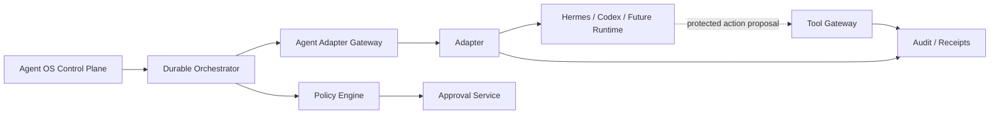

# AGC-001 — Agent OS Agent Adapter Contract

> **Status: Draft.** This document defines the provider-neutral contract between Agent OS and agent runtimes such as Hermes and Codex. It does not claim that either runtime already implements every operation, state, event, or capability described here. Unsupported or unverified behavior must remain explicit.

## 1. Purpose

This contract defines the minimum common interface through which Agent OS can:

- register an adapter;
- validate an adapter;
- discover runtime capabilities;
- inspect health and compatibility;
- start bounded work;
- query execution status;
- receive or poll events;
- obtain outputs and artifacts;
- obtain model/provider/usage evidence;
- request cancellation;
- request pause or resume where supported;
- request or inspect checkpoints where supported;
- reconcile uncertain external state;
- preserve workspace, security, approval, cost, and audit controls.

The contract isolates Agent OS from runtime-specific concepts.

Detailed capability payloads belong in `CAP-001`.

Detailed model profile rules belong in `MOD-001`.

Detailed run and step semantics belong in `RUN-001`.

Detailed approval semantics belong in `APR-001`.

Detailed artifact semantics belong in `ART-001`.

## 2. Contract goals

The contract must:

1. keep Agent OS authoritative for platform run state;
2. keep the adapter authoritative only for its own reported observations;
3. make unsupported and unknown behavior explicit;
4. preserve workspace scope and correlation;
5. prevent adapters from granting authority;
6. prevent adapters from approving actions;
7. support durable orchestration;
8. support at-least-once request/event delivery;
9. support idempotency where possible;
10. preserve actual runtime, model, provider, and tool identity where known;
11. preserve evidence and limitations;
12. normalize errors without erasing provider-specific evidence;
13. support health, compatibility, and validation separately;
14. support bounded cancellation and recovery;
15. remain suitable for local Linux/WSL deployment;
16. support future adapters without changing core domain semantics.

## 3. Non-goals

This contract does not:

- define human-facing UI;
- define full task orchestration;
- define provider billing;
- make adapters policy authorities;
- make adapters identity authorities;
- make model output trustworthy;
- guarantee cancellation;
- guarantee pause;
- guarantee checkpoint/resume;
- guarantee reliable usage reporting;
- guarantee actual model identity;
- guarantee hidden tool visibility;
- authorize direct Git, file, network, or secret access;
- expose unrestricted host control;
- define public multi-tenant adapter hosting;
- define autonomous agent-to-agent delegation.

## 4. Architectural role



The adapter translates between Agent OS and a runtime. It does not replace the orchestrator, policy engine, approval service, Tool Gateway, audit service, or artifact service.

## 5. Adapter trust model

An adapter is a restricted integration component.

Agent OS must assume that an adapter may be:

- incomplete;
- buggy;
- stale;
- incompatible;
- temporarily unavailable;
- unable to cancel;
- unable to resume;
- unable to report exact model identity;
- unable to report usage;
- compromised.

Therefore:

- adapter reports are evidence, not platform authority;
- platform state transitions require contract validation;
- protected effects remain outside adapter authority;
- adapter output is untrusted;
- unknown fields remain unknown;
- reconciliation remains possible.

## 6. Adapter identity

Every adapter instance must have:

- `agent_registration_id`;
- `adapter_identity_id`;
- `adapter_type`;
- `implementation_name`;
- `implementation_version`;
- `contract_version`;
- `instance_id`;
- `process_or_endpoint_reference`;
- `started_at`;
- `build_identity` where available;
- current lifecycle state.

The adapter identity must be distinct from:

- the human requester;
- the logical agent identity;
- the runtime process identity;
- the model provider identity;
- the worker identity;
- the tool identity.

## 7. Adapter types

Initial controlled adapter types:

```text
hermes
codex
custom
unknown
```

A new adapter type requires:

- registration;
- implementation owner;
- contract compatibility;
- capability declaration;
- security review;
- conformance tests;
- operational health support;
- documentation.

## 8. Adapter lifecycle

```text
unregistered
registered
configured
reachable
validating
validated
ready
degraded
unreachable
incompatible
disabled
revoked
retired
```

### Lifecycle rules

1. `registered` means metadata exists.
2. `configured` means required configuration references exist.
3. `reachable` is a point-in-time observation.
4. `validated` means the configured contract profile passed validation.
5. `ready` requires current validation, health, scope, and policy.
6. `degraded` means usable only with declared limitations.
7. `incompatible` blocks new runs.
8. `disabled` is an operational state.
9. `revoked` invalidates trust and future use.
10. Historical runs retain adapter references after retirement.

## 9. Registration operation

### Operation

`RegisterAdapter`

### Purpose

Create an Agent OS adapter registration record.

### Request fields

| Field | Required |
|---|---|
| `request_id` | Yes |
| `schema_version` | Yes |
| `organization_id` | Yes |
| `requested_by` | Yes |
| `adapter_type` | Yes |
| `display_name` | Yes |
| `implementation_name` | Yes |
| `implementation_version` | Yes |
| `contract_version` | Yes |
| `process_or_endpoint_reference` | Yes |
| `configuration_reference` | Yes |
| `secret_references` | Conditional |
| `declared_workspace_scope` | Yes |
| `declared_capability_profile` | Optional |

### Response

- registration ID;
- lifecycle state;
- validation required;
- compatibility state;
- warnings;
- audit reference.

### Security

Registration does not grant permission or enable dispatch.

## 10. Adapter validation operation

### Operation

`ValidateAdapter`

### Validation may include

- endpoint or process reachability;
- workload authentication;
- contract version;
- capability schema;
- read-only handshake;
- health response;
- status query;
- cancellation declaration;
- checkpoint declaration;
- event-stream declaration;
- artifact declaration;
- usage declaration;
- safe failure behavior.

### Validation must not

- perform a consequential action;
- modify Git history;
- send an external message;
- install a package;
- access unrelated workspaces;
- expose raw secrets;
- start unbounded work.

### Validation result

```text
validated
partially_validated
failed
incompatible
unknown
```

Each unsupported or untested capability is listed explicitly.

## 11. Compatibility operation

### Operation

`NegotiateContract`

### Inputs

- Agent OS supported contract range;
- adapter supported range;
- capability schema range;
- event schema range;
- optional extension profiles.

### Outcomes

```text
compatible
compatible_with_reduced_capability
incompatible
unknown
upgrade_required
```

A reduced-capability result must list disabled capabilities.

## 12. Capability discovery

### Operation

`GetCapabilities`

The adapter returns a versioned declaration.

Each capability includes:

- capability code;
- capability version;
- state;
- effect class;
- supported targets;
- supported data classes;
- streaming support;
- cancellation support;
- pause support;
- resume support;
- checkpoint support;
- idempotency support;
- artifact support;
- usage reporting support;
- health/status support;
- limits;
- known restrictions;
- validation evidence.

The canonical schema belongs in `CAP-001`.

## 13. Capability truth states

```text
declared
validated
partially_validated
unsupported
temporarily_unavailable
unknown
deprecated
disabled
```

Rules:

- undeclared does not automatically mean unsupported;
- declared does not mean validated;
- validated may be version- and configuration-specific;
- capability drift invalidates readiness;
- policy may disable a validated capability.

## 14. Health operation

### Operation

`GetAdapterHealth`

### Health dimensions

- process or endpoint reachability;
- authentication;
- contract compatibility;
- runtime reachability;
- event channel status;
- queue/backpressure state;
- current capacity;
- rate limit/quota state where known;
- last successful operation;
- last failed operation;
- last validated time;
- current limitations;
- freshness.

### Health states

```text
healthy
degraded
unhealthy
stale
unknown
disabled
```

A health response must include `observed_at`.

## 15. Readiness operation

### Operation

`GetAdapterReadiness`

Readiness combines:

- registration;
- configuration;
- compatibility;
- validation;
- health;
- workspace enablement;
- capability state;
- secret availability;
- security policy;
- maintenance/emergency-stop state.

Readiness states:

```text
ready
degraded
blocked_configuration
blocked_identity
blocked_policy
blocked_dependency
blocked_security
maintenance
unknown
```

## 16. Start-run operation

### Operation

`StartAgentRun`

### Preconditions

Agent OS has already:

- authenticated the requester;
- authorized the workspace;
- created the durable run;
- selected the immutable task snapshot;
- selected the adapter;
- selected the model profile where applicable;
- evaluated current policy;
- enforced execution bounds;
- generated an attempt ID;
- generated an idempotency key;
- prepared bounded context.

### Request fields

| Field | Required |
|---|---|
| `request_id` | Yes |
| `schema_version` | Yes |
| `organization_id` | Yes |
| `workspace_id` | Yes |
| `project_id` | Optional |
| `task_id` | Yes |
| `task_snapshot_id` | Yes |
| `run_id` | Yes |
| `step_id` | Yes |
| `attempt_id` | Yes |
| `correlation_id` | Yes |
| `idempotency_key` | Yes |
| `requested_capability` | Yes |
| `agent_context` | Yes |
| `resource_scope` | Yes |
| `data_classification` | Yes |
| `model_profile_reference` | Conditional |
| `execution_bounds` | Yes |
| `artifact_expectations` | Optional |
| `memory_context_references` | Optional |
| `tool_policy_reference` | Yes |
| `deadline_at` | Yes |

### Request restrictions

The request must not contain:

- raw secrets;
- unrestricted host paths;
- unlimited network access;
- unrelated workspace context;
- human approval authority;
- platform policy internals not required by the runtime.

## 17. Start-run response

Possible status:

```text
accepted
rejected
pending
duplicate
unknown
```

Response fields:

- request ID;
- run/step/attempt IDs;
- external session ID;
- adapter/runtime identity;
- accepted capability;
- accepted execution limits;
- event/status access method;
- initial state;
- limitations;
- actual model/provider if already known;
- error;
- side-effect certainty;
- recorded time.

### Acceptance rule

`accepted` means the runtime accepted the request. It does not mean execution completed or even started.

## 18. Adapter execution state

Normalized adapter-reported state:

```text
accepted
starting
running
waiting
paused
cancelling
cancelled
completed
failed
stale
unknown
```

This is an observation from the adapter.

Agent OS maps it to platform run/step/attempt states according to `RUN-001`.

## 19. Status operation

### Operation

`GetAgentRunStatus`

### Input

- adapter registration;
- external session ID;
- run/step/attempt IDs;
- correlation;
- optional last-known event cursor.

### Response

- adapter-reported state;
- observed time;
- current phase;
- progress if meaningful;
- last event cursor;
- external session state;
- runtime process state;
- outputs available;
- checkpoint available;
- cancellation state;
- actual model/provider where known;
- usage where known;
- errors;
- limitations;
- side-effect certainty;
- evidence reference.

### State rule

The adapter must not fabricate progress or completion percentages.

## 20. Event-stream operation

### Operation

`StreamAgentRunEvents`

An adapter may support:

- server-sent events;
- WebSocket;
- local IPC stream;
- polling cursor;
- another approved mechanism.

### Required event fields

- event ID;
- schema version;
- adapter registration ID;
- external session ID;
- organization/workspace;
- run/step/attempt;
- sequence or cursor where supported;
- event type;
- occurred time;
- recorded time;
- payload or payload reference;
- classification;
- correlation;
- source identity.

### Stream rules

- events may duplicate;
- events may arrive late;
- events may arrive out of order;
- stream interruption does not prove run failure;
- client disconnect does not cancel execution;
- partial output remains partial;
- Agent OS persists accepted events before exposing authoritative state.

## 21. Adapter event types

Representative normalized events:

```text
adapter_run_accepted
adapter_run_started
adapter_run_progressed
adapter_run_waiting
adapter_run_paused
adapter_tool_action_proposed
adapter_artifact_proposed
adapter_checkpoint_available
adapter_usage_observed
adapter_model_observed
adapter_warning
adapter_run_cancellation_acknowledged
adapter_run_cancelled
adapter_run_completed
adapter_run_failed
adapter_run_state_unknown
adapter_event_gap_detected
adapter_capability_changed
adapter_health_changed
```

Detailed schemas belong in `EVT-001`.

## 22. Event ordering

The contract does not require global total order.

Where supported, an adapter should provide:

- monotonically increasing session sequence;
- event cursor;
- occurred time;
- causation reference.

Agent OS uses:

- event ID deduplication;
- aggregate version;
- reconciliation;
- last accepted cursor;
- gap detection.

## 23. Output operation

### Operation

`GetAgentRunOutputs`

Possible output classes:

- generated text;
- code patch;
- file candidate;
- structured result;
- artifact candidate;
- test/build result;
- tool-action proposal;
- checkpoint reference;
- diagnostic bundle.

Each output includes:

- output ID;
- output type;
- media type;
- classification;
- content or content reference;
- integrity hash where available;
- source event/session;
- partial/final state;
- producer identity;
- created time;
- limitations.

## 24. Artifact proposal

The adapter may propose an artifact but cannot mark it accepted.

An artifact proposal includes:

- artifact type;
- filename;
- media type;
- content reference;
- size;
- integrity hash where available;
- classification;
- task/run/step/attempt;
- provenance;
- partial/final indicator;
- source output ID.

The Artifact Service validates and controls lifecycle under `ART-001`.

## 25. Tool-action proposal

When an adapter or runtime wants to perform a protected action, it emits a proposal.

Required fields:

- proposal ID;
- action class;
- capability code;
- normalized target candidate;
- exact parameters;
- expected effects;
- reversibility;
- data classes;
- requested secret references;
- network destination candidate;
- reason;
- source run/step/attempt;
- expiration.

### Rule

The adapter does not execute the protected effect merely because it proposed it.

The proposal is routed through:

```text
normalization
→ policy evaluation
→ exact approval if required
→ Tool Gateway
→ sandbox/integration
→ receipt
```

## 26. Protected action visibility

An adapter must declare whether it can:

- expose every tool proposal;
- expose every tool result;
- prevent direct tool use;
- delegate tools to Agent OS;
- report hidden runtime tools;
- disable runtime-native tools.

If visibility or prevention cannot be established, the capability is:

```text
partially_validated
unknown
or disabled for protected execution
```

## 27. Cancellation operation

### Operation

`CancelAgentRun`

### Request

- run/step/attempt;
- external session ID;
- reason;
- requested by;
- deadline;
- idempotency key;
- policy reference.

### Response states

```text
cancel_requested
cancel_acknowledged
cancelled
cannot_cancel
already_terminal
unknown
failed
```

### Cancellation rules

- cancellation is idempotent;
- cancellation is forward-looking;
- completed side effects remain;
- `cancel_acknowledged` is not `cancelled`;
- timeout may yield `unknown`;
- adapter reports known limitations.

## 28. Pause operation

### Operation

`PauseAgentRun`

Optional capability.

Response states:

```text
pause_requested
paused
pause_at_safe_boundary
unsupported
already_terminal
unknown
failed
```

If pause is unsupported, Agent OS may cancel or continue according to policy.

## 29. Resume operation

### Operation

`ResumeAgentRun`

Optional capability.

Preconditions:

- adapter supports resume;
- checkpoint or paused session is valid;
- task snapshot unchanged;
- current policy and approval revalidated;
- remaining bounds sufficient;
- side effects understood;
- compatibility preserved.

Response states:

```text
resume_requested
resumed
checkpoint_incompatible
session_unavailable
unsupported
blocked
unknown
failed
```

## 30. Checkpoint operation

### Operations

- `CreateCheckpoint`
- `GetCheckpoint`
- `ListCheckpoints`
- `ValidateCheckpoint`

Checkpoint fields:

- checkpoint ID;
- external session ID;
- run/step/attempt;
- adapter/runtime version;
- schema version;
- content reference;
- integrity hash;
- created time;
- expiry;
- compatibility;
- side-effect summary;
- required resources;
- resume limitations.

A checkpoint:

- is not an approval;
- does not expand authority;
- does not prove absence of effects;
- must be integrity-checked;
- remains workspace-scoped.

## 31. Usage operation

### Operation

`GetAgentRunUsage`

Possible metrics:

- input tokens;
- output tokens;
- request count;
- runtime wall time;
- compute time;
- tool calls;
- storage;
- network;
- other provider-specific units.

Each usage value includes:

- metric;
- quantity;
- unit;
- source type;
- source reference;
- occurred time;
- state;
- provider/model/tool identity;
- estimated/reported status.

Unknown usage is not zero.

## 32. Model/provider observation

The adapter reports, where known:

- configured logical model profile;
- actual provider;
- actual model;
- fallback applied;
- provider request ID;
- model capability;
- source of observation;
- confidence or limitation.

Possible identity states:

```text
reported
inferred
configured_only
unavailable
unknown
conflicted
```

`configured_only` must not be presented as actual.

## 33. Reconciliation operation

### Operation

`ReconcileAgentRun`

Used when Agent OS and adapter/runtime state differ or are stale.

Inputs:

- run/step/attempt;
- external session ID;
- last known platform state;
- last known adapter state;
- event cursor;
- evidence references.

Possible outcomes:

```text
matched
externally_running
externally_completed
externally_failed
externally_cancelled
partial
missing
conflicted
unknown
```

Reconciliation returns evidence, not a silent state overwrite.

## 34. Idempotency

The adapter contract supports idempotency for:

- start;
- cancel;
- pause;
- resume;
- checkpoint creation;
- output retrieval;
- usage retrieval;
- reconciliation where applicable.

### Rules

1. Same idempotency key and same request returns the same logical outcome.
2. Same key and different request is rejected.
3. Adapter reports whether native idempotency is supported.
4. Agent OS still performs platform-level duplicate protection.
5. Idempotency does not make a non-idempotent protected effect safe automatically.

## 35. Correlation

Every adapter request and response carries:

- `request_id`;
- `correlation_id`;
- optional `causation_id`;
- `run_id`;
- `step_id`;
- `attempt_id`;
- external session ID where known;
- adapter instance ID.

This correlation must survive:

- retries;
- polling;
- event-stream reconnect;
- cancellation;
- reconciliation;
- output retrieval;
- receipt generation.

## 36. Time semantics

Required time fields may include:

- request created;
- request received;
- runtime accepted;
- execution started;
- event occurred;
- adapter recorded;
- Agent OS recorded;
- execution ended;
- last heartbeat;
- deadline;
- expiry.

All contract timestamps use UTC.

Adapter clock uncertainty should be exposed where relevant.

## 37. Timeouts

Each operation defines:

- connect timeout;
- acknowledgement timeout;
- response timeout;
- streaming idle timeout;
- total deadline;
- cancellation timeout.

Timeout responses must include:

- retryability;
- side-effect certainty;
- external session ID if known;
- last reliable evidence;
- recommended reconciliation action.

## 38. Error model

Common adapter error codes:

```text
ADAPTER_NOT_REGISTERED
ADAPTER_NOT_CONFIGURED
ADAPTER_UNREACHABLE
ADAPTER_AUTHENTICATION_FAILED
ADAPTER_INCOMPATIBLE
ADAPTER_VALIDATION_FAILED
ADAPTER_NOT_READY
ADAPTER_CAPABILITY_UNSUPPORTED
ADAPTER_CAPABILITY_UNAVAILABLE
ADAPTER_REQUEST_INVALID
ADAPTER_REQUEST_EXPIRED
ADAPTER_DUPLICATE_CONFLICT
ADAPTER_RUNTIME_REJECTED
ADAPTER_RUNTIME_UNAVAILABLE
ADAPTER_TIMEOUT
ADAPTER_EVENT_STREAM_UNAVAILABLE
ADAPTER_EVENT_GAP
ADAPTER_RESPONSE_INVALID
ADAPTER_OUTPUT_UNSAFE
ADAPTER_CANCELLATION_UNSUPPORTED
ADAPTER_CANCELLATION_UNKNOWN
ADAPTER_PAUSE_UNSUPPORTED
ADAPTER_RESUME_UNSUPPORTED
ADAPTER_CHECKPOINT_INVALID
ADAPTER_USAGE_UNAVAILABLE
ADAPTER_MODEL_IDENTITY_UNKNOWN
ADAPTER_SIDE_EFFECT_UNKNOWN
ADAPTER_INTERNAL_ERROR
```

Each error includes:

- safe message;
- retryable flag;
- side-effect certainty;
- correlation;
- external error reference;
- remediation code;
- restricted raw evidence reference.

## 39. Provider-specific extension fields

An adapter may include provider-specific data only in a controlled extension object:

```json
{
  "extensions": {
    "adapter.hermes.v1": {},
    "adapter.codex.v1": {}
  }
}
```

Rules:

- extensions are versioned;
- core behavior cannot depend on undocumented fields;
- secrets are prohibited;
- extension data is classified;
- unknown extensions are ignored safely or rejected by profile;
- extensions do not override canonical fields.

## 40. Security requirements

### Identity

- every adapter uses explicit workload identity;
- every instance is attributable;
- revoked identity blocks new requests;
- instance identity is not human identity.

### Authorization

- workspace scope is mandatory;
- adapter receives only requested scope;
- adapter cannot create grants;
- adapter cannot approve.

### Data

- classification is carried;
- outbound context is minimized;
- cross-workspace context reuse is prohibited;
- raw secrets are excluded.

### Tools

- protected effects use Tool Gateway;
- native tools are disabled or declared;
- hidden tool visibility limitations are explicit.

### Network

- destinations are constrained;
- adapter does not receive unrestricted egress;
- redirects and external targets remain governed.

### Audit

- start, state, output, tool proposal, cancellation, and reconciliation events are attributable.

## 41. Secret handling

The adapter request may contain secret references, never secret values.

A runtime secret-use flow should be:

```text
adapter requests authorized secret reference
→ Agent OS validates capability/target
→ approved secret mechanism injects bounded access
→ runtime executes
→ secret is not returned in response
→ use is evidenced
```

If the integration mechanism cannot prevent raw secret exposure to the adapter/runtime, that limitation must be documented and approved.

## 42. Workspace isolation

The adapter must not:

- maintain a shared unscoped context cache;
- reuse a runtime session across workspaces;
- read another workspace’s files;
- send another workspace’s memory;
- write output under another workspace;
- query global tool credentials without scope.

Every runtime session is bound to one workspace.

## 43. Data minimization

The adapter receives only:

- the task snapshot fields required for execution;
- selected memory references/content;
- selected artifact references/content;
- approved resource scopes;
- model profile reference;
- tool policy reference;
- execution limits.

It does not receive:

- complete audit history;
- all workspace memory;
- unrelated repositories;
- unnecessary personal data;
- unrestricted credentials.

## 44. Prompt-injection boundary

Adapter and runtime input may contain hostile instructions.

The adapter must not interpret content as authority.

Specifically, runtime content cannot:

- grant permissions;
- approve an action;
- expand paths;
- expand network egress;
- request unrestricted secret access;
- disable audit;
- override cancellation;
- modify policy.

## 45. Artifact handling

The adapter may:

- stream output;
- create a staged content reference;
- propose an artifact;
- provide integrity metadata;
- provide provenance.

It may not:

- mark an artifact accepted;
- lower classification;
- bypass malware/preview controls;
- expose another workspace’s content.

## 46. Cost handling

The adapter may report usage and cost evidence.

It must label values as:

```text
provider_reported
adapter_reported
locally_measured
calculated
estimated
unavailable
unknown
```

An adapter estimate does not become provider-authoritative billing data.

## 47. Adapter configuration

Configuration fields may include:

- executable or endpoint reference;
- runtime arguments;
- environment reference;
- health command/path;
- contract version;
- workspace enablement;
- capability allowlist;
- network profile;
- sandbox profile;
- secret references;
- timeout profile;
- resource profile.

Raw secrets and unrestricted shell fragments are prohibited in ordinary configuration.

## 48. Local-process profile

A local-process adapter profile may use:

- stdio;
- local socket;
- localhost HTTP;
- another approved IPC.

Requirements:

- restricted OS identity;
- explicit executable path;
- argument validation;
- controlled environment;
- process lifecycle;
- stdout/stderr limits;
- timeout;
- cancellation;
- no shell interpolation unless explicitly required and safely constructed;
- build/version identity.

## 49. HTTP profile

An HTTP adapter profile should define:

- base endpoint;
- TLS requirements;
- authentication;
- request and response schemas;
- idempotency header;
- correlation headers;
- timeout;
- rate limit;
- error mapping;
- health endpoint;
- event method;
- maximum payload size.

Public remote hosting is outside the first local MVP unless separately approved.

## 50. CLI profile

A CLI adapter profile must define:

- executable identity;
- version command;
- supported operations;
- argument encoding;
- input method;
- output format;
- structured event/result format;
- working directory;
- environment;
- exit codes;
- timeout/cancellation;
- stdout/stderr treatment;
- secret injection;
- sandbox/process isolation.

Parsing human-formatted console text as the sole authoritative contract is discouraged.

## 51. Capability profiles

Adapters may support named conformance profiles.

### `AGC-PROFILE-CORE`

Mandatory:

- registration;
- validation;
- capabilities;
- health;
- readiness;
- start;
- status;
- output;
- errors;
- correlation;
- cancellation declaration.

### `AGC-PROFILE-EVENTS`

Adds:

- event streaming or cursor polling;
- event IDs;
- gap detection;
- reconnect.

### `AGC-PROFILE-CANCEL`

Adds:

- cancellation request;
- cancellation acknowledgement;
- terminal cancellation evidence.

### `AGC-PROFILE-CHECKPOINT`

Adds:

- checkpoint creation/list/validation;
- resume.

### `AGC-PROFILE-USAGE`

Adds:

- model/provider observation;
- usage events;
- cost-related source labels.

### `AGC-PROFILE-TOOL-DELEGATION`

Adds:

- protected tool-action proposals;
- Tool Gateway routing;
- result/receipt linkage.

## 52. Core conformance requirements

An adapter conforms to `AGC-PROFILE-CORE` only if it:

1. identifies itself and contract version;
2. returns structured capability data;
3. distinguishes unsupported from unknown;
4. supports bounded start and status;
5. carries workspace/run/step/attempt IDs;
6. preserves correlation;
7. returns structured errors;
8. declares cancellation support truthfully;
9. returns output with provenance;
10. never claims approval authority;
11. never grants permissions;
12. declares actual model/provider limitations;
13. handles duplicate start safely or declares lack of native idempotency;
14. exposes health freshness;
15. passes negative workspace and secret tests.

## 53. Conformance test catalogue

### Registration and compatibility

- valid registration;
- missing configuration;
- incompatible version;
- reduced capability;
- disabled adapter.

### Capability

- declared capability;
- unknown capability;
- unsupported capability;
- capability drift;
- stale validation.

### Run

- start accepted;
- start rejected;
- duplicate start;
- expired request;
- invalid workspace;
- runtime unavailable.

### Status/events

- normal progress;
- duplicate event;
- out-of-order event;
- event gap;
- stale stream;
- unknown external session.

### Cancellation

- cancel before start;
- cancel running;
- cannot cancel;
- cancellation timeout;
- already terminal;
- duplicate cancel.

### Outputs

- final output;
- partial output;
- unsafe/malformed output;
- oversized output;
- artifact proposal;
- classification mismatch.

### Usage/model

- actual model reported;
- configured only;
- fallback reported;
- usage unavailable;
- estimated usage;
- conflicting provider identity.

### Security

- cross-workspace request;
- raw secret in request/response;
- protected tool bypass;
- path expansion;
- unauthorized network destination;
- prompt requests authority expansion.

## 54. Fault tests

Adapters should be tested under:

- process crash;
- runtime crash;
- Agent OS restart;
- connection loss;
- timeout before acceptance;
- timeout after acceptance;
- duplicate request;
- late completion after timeout;
- malformed response;
- event flood;
- output flood;
- stale checkpoint;
- secret unavailable;
- rate limit;
- provider outage.

## 55. Security abuse tests

Representative tests:

1. Prompt asks adapter to reveal secret.
2. Repository asks runtime to bypass Tool Gateway.
3. Runtime reports a protected effect without approval reference.
4. Adapter attempts another workspace path.
5. Adapter changes normalized target after approval.
6. Adapter reports completion without output/evidence.
7. Adapter reuses an external session across workspaces.
8. Adapter injects an unknown provider model as configured model.
9. Adapter returns executable active content as safe artifact.
10. Adapter continues after emergency stop.

## 56. Performance expectations

Initial targets should align with `NFR-001`.

Proposed adapter-level expectations:

- health response p95 ≤ 2 seconds locally;
- start acknowledgement p95 ≤ 5 seconds where runtime is available;
- status response p95 ≤ 2 seconds locally;
- event propagation p95 ≤ 2 seconds after adapter observation;
- cancellation acknowledgement target ≤ 5 seconds where supported;
- backpressure under output/event load;
- bounded memory and queue use.

These are proposed until tested.

## 57. Capacity expectations

The adapter layer should support the MVP target of at least:

- 4 active runs;
- 5 concurrent users;
- multiple adapters;
- multiple model profiles;
- bounded output streams;
- durable recovery after adapter restart.

Per-adapter limits remain explicit.

## 58. Observability

Metrics may include:

- registered adapters;
- ready/degraded/unreachable adapters;
- validation age;
- capability drift;
- start latency;
- start rejection;
- active external sessions;
- status latency;
- event lag/gaps;
- output volume;
- cancellation success;
- unknown state count;
- reconciliation count;
- usage completeness;
- actual-model identity completeness;
- error rate by class;
- secret-resolution failures.

Logs must not contain raw secrets or full confidential content by default.

## 59. Audit requirements

Audit records should cover:

- registration;
- configuration changes;
- validation;
- compatibility changes;
- capability changes;
- start request/response;
- external session creation;
- significant status changes;
- protected tool proposals;
- output/artifact proposals;
- cancellation;
- pause/resume;
- checkpoint;
- model/provider observation;
- usage observation;
- reconciliation;
- adapter disable/revoke.

## 60. Degraded behavior

| Condition | Contract behavior |
|---|---|
| Adapter unreachable | New route unavailable; existing runs stale/unknown |
| Runtime unreachable | Adapter degraded; affected runs wait/stale |
| Event stream unavailable | Polling fallback if declared |
| Status unavailable | Run becomes stale; reconciliation needed |
| Cancellation unsupported | Show unsupported; no false cancel |
| Resume unsupported | Restart/revise according to policy |
| Usage unavailable | Usage unknown, not zero |
| Model identity unavailable | Actual model unknown |
| Output malformed | Reject/quarantine; run not accepted complete |
| Capability drift | Revalidate and degrade/block |
| Adapter revoked | No new dispatch; active runs reconciled |

## 61. Hermes implementation profile

The Hermes-specific mapping belongs in proposed/unregistered `ADP-HER-001`.

At minimum, that document should map:

- invocation mechanism;
- session identity;
- capability discovery;
- start/status/events;
- model/provider identity;
- tool visibility;
- cancellation;
- checkpoints/resume;
- outputs/artifacts;
- usage/cost;
- errors;
- health;
- sandbox/network;
- secret handling;
- conformance gaps.

Until verified, unavailable Hermes features remain `unknown` or `unsupported`.

## 62. Codex implementation profile

The Codex-specific mapping belongs in proposed/unregistered `ADP-CDX-001`.

At minimum, that document should map:

- CLI/API invocation;
- worktree/repository identity;
- file and patch outputs;
- commands/tests/builds;
- Git proposals;
- model/provider identity;
- tool visibility;
- cancellation;
- resume;
- usage;
- errors;
- health;
- sandbox/process isolation;
- secret handling;
- conformance gaps.

Commit, push, and PR creation remain approval-gated where implemented. Merge and force push remain prohibited.

## 63. Backward compatibility

A new adapter version must not silently change:

- lifecycle meanings;
- capability meanings;
- effect classes;
- cancellation semantics;
- idempotency semantics;
- event ordering claims;
- output finality;
- side-effect certainty;
- model identity meaning;
- approval/tool routing.

Breaking changes require a new major contract version or explicit compatibility profile.

## 64. Deprecation

A deprecated operation or field requires:

- replacement;
- deprecation version;
- removal version;
- migration guidance;
- affected adapters;
- compatibility tests;
- release communication.

Deprecated behavior remains observable until removal.

## 65. Security requirements catalogue

- `AGC-SEC-001` — Adapter identity is explicit.
- `AGC-SEC-002` — Workspace scope is mandatory.
- `AGC-SEC-003` — Raw secrets are prohibited in ordinary contract payloads.
- `AGC-SEC-004` — Adapter cannot approve.
- `AGC-SEC-005` — Adapter cannot grant permission.
- `AGC-SEC-006` — Protected effects route through Tool Gateway.
- `AGC-SEC-007` — Runtime content cannot override policy.
- `AGC-SEC-008` — Cross-workspace session reuse is prohibited.
- `AGC-SEC-009` — Unknown protected effects block automatic retry.
- `AGC-SEC-010` — Adapter output is treated as untrusted.
- `AGC-SEC-011` — Network and filesystem scope are explicit.
- `AGC-SEC-012` — Revoked adapters receive no new work.
- `AGC-SEC-013` — Emergency stop blocks or interrupts affected work.
- `AGC-SEC-014` — Actual model identity is not fabricated.
- `AGC-SEC-015` — Capability drift invalidates readiness.

## 66. Reliability requirements catalogue

- `AGC-REL-001` — Start requests are duplicate-safe.
- `AGC-REL-002` — Status responses include observation time.
- `AGC-REL-003` — Event IDs support deduplication.
- `AGC-REL-004` — Event gaps are detectable where events are supported.
- `AGC-REL-005` — Stream loss does not imply execution failure.
- `AGC-REL-006` — Timeout includes side-effect certainty.
- `AGC-REL-007` — Cancellation state is explicit.
- `AGC-REL-008` — Unsupported resume/checkpoint is explicit.
- `AGC-REL-009` — Output finality is explicit.
- `AGC-REL-010` — Reconciliation is supported for uncertain state.
- `AGC-REL-011` — Adapter restart does not erase platform run state.
- `AGC-REL-012` — Compatibility failures block unsafe dispatch.

## 67. Data requirements catalogue

- `AGC-DAT-001` — Canonical fields reuse `DCT-001`.
- `AGC-DAT-002` — Classification is preserved.
- `AGC-DAT-003` — Source and authority remain distinct.
- `AGC-DAT-004` — Actual and configured model fields are distinct.
- `AGC-DAT-005` — Usage state is reported/estimated/unknown explicitly.
- `AGC-DAT-006` — Outputs include provenance.
- `AGC-DAT-007` — Artifacts include integrity metadata where available.
- `AGC-DAT-008` — External IDs remain traceable.
- `AGC-DAT-009` — Timestamps are UTC.
- `AGC-DAT-010` — Extension fields are namespaced/versioned.

## 68. Operational requirements catalogue

- `AGC-OPS-001` — Health and readiness are separate.
- `AGC-OPS-002` — Validation is repeatable.
- `AGC-OPS-003` — Validation age is visible.
- `AGC-OPS-004` — Capability drift is visible.
- `AGC-OPS-005` — Adapter can be disabled/revoked.
- `AGC-OPS-006` — Active sessions are discoverable.
- `AGC-OPS-007` — Current limitations are queryable.
- `AGC-OPS-008` — Build and implementation version are visible.
- `AGC-OPS-009` — Metrics and logs are bounded.
- `AGC-OPS-010` — Recovery and reconciliation procedures are documented.

## 69. Traceability

| Requirement area | AGC response |
|---|---|
| `FR-AGT-*` | Registration, validation, capabilities, health, execution |
| `FR-MOD-*` | Model/provider reporting |
| `FR-RUN-*` | Start, state, status, cancel, resume |
| `FR-APR-*` | No adapter approval; tool proposals routed |
| `FR-TOL-*` | Protected action delegation |
| `FR-MEM-*` | Scoped memory context |
| `FR-ART-*` | Artifact proposals and provenance |
| `FR-AUD-*` | Correlation and evidence |
| `FR-CST-*` | Usage reporting |
| `FR-OPS-*` | Health, compatibility, recovery |
| `NFR-INT-*` | Replaceability and conformance |
| `NFR-SEC-*` | Identity, scope, secret, least privilege |
| `AUT-001` | Adapter cannot exceed autonomy policy |

## 70. Mapping to components

| Contract concern | Primary component |
|---|---|
| Registration/validation | Agent Adapter Gateway |
| Run start/status | Durable Orchestrator + Gateway |
| Runtime translation | Adapter implementation |
| Events | Adapter + Durable Job/Event Store |
| Outputs/artifacts | Adapter + Artifact Service |
| Tool proposals | Adapter + Tool Gateway |
| Model/usage | Adapter + Model/Cost services |
| Health | Adapter + Operations Service |
| Audit | Adapter Gateway + Audit Service |
| Secrets | Adapter + approved secret mechanism |

## 71. ADR backlog

### `ADR-TBD-AGC-001 — Adapter communication protocol`

Choose stdio, local socket, HTTP, gRPC, or hybrid.

### `ADR-TBD-AGC-002 — Event delivery mechanism`

Choose stream, polling cursor, message transport, or hybrid.

### `ADR-TBD-AGC-003 — Adapter process isolation`

Define OS identity, container/process model, network, filesystem, and lifecycle.

### `ADR-TBD-AGC-004 — Conformance test harness`

Define fixtures, simulators, golden contracts, and certification evidence.

## 71A. ADR-003 adapter baseline

The initial supported adapter set is Codex, Hermes, and Claude Code. Each adapter must preserve Agent OS identity, workspace scope, conversation linkage, task snapshot, run correlation, policy decision, approval state, capability declaration, effect certainty, and audit evidence. Adapter connectivity does not grant tool or data authorization.

## 72. Open decisions

1. Which communication protocol is the core profile?
2. Is CLI parsing acceptable for the first adapters?
3. Which operations are mandatory for Hermes?
4. Which operations are mandatory for Codex?
5. Is event streaming mandatory or may polling satisfy core conformance?
6. Which cancellation evidence is sufficient?
7. Is pause required?
8. Is checkpoint/resume required for MVP?
9. Which tool visibility guarantees can Hermes provide?
10. Which tool visibility guarantees can Codex provide?
11. Which native tools must be disabled?
12. How is actual model identity verified?
13. Which usage metrics are reliable?
14. Which extension namespaces are accepted?
15. Which adapter-level timeouts are defaults?
16. Which external session data is retained?
17. Which raw runtime events are retained versus summarized?
18. Which conformance failures block all use versus only one capability?
19. How are adapter upgrades rolled back?
20. Which adapter-specific documents are formally added to the register?

## 73. Risks

| Risk | Consequence | Response |
|---|---|---|
| Lowest-common-denominator contract too weak | Poor control/visibility | Core + optional profiles |
| Adapter-specific concepts leak into core | Lock-in | ACL and canonical schema |
| CLI output changes | Parsing failure | Structured output/profile |
| Hidden native tools | Unevidenced effects | Disable or mark capability unsafe |
| False capability declaration | Unsafe dispatch | Validation/conformance |
| Unknown model reported as configured | False attribution | Separate identity states |
| Cancellation overstated | Misleading control | Explicit acknowledgement/finality |
| Duplicate start | Duplicate work/effects | Idempotency |
| Stream loss treated as failure | Unsafe retry | Stale/unknown + reconciliation |
| Output marked final too early | False completion | Explicit finality and evidence |
| Adapter over-scoped | Data leakage | Per-run workspace/resource scope |
| Raw secrets reach logs | Credential exposure | Reference-based secret handling |
| Capability drift | Runtime behavior change | Validation and readiness invalidation |
| Extension fields override core | Semantic corruption | Controlled namespaces |
| Conformance tests incomplete | False confidence | Negative/fault/security suites |

## 74. Assumptions

- Hermes and Codex expose some callable local surface;
- adapters can return structured data directly or through a wrapper;
- Agent OS can persist run state before adapter invocation;
- protected actions can be routed through Tool Gateway;
- adapter processes can be isolated;
- external sessions can be queried or marked unknown;
- conformance fixtures can be created;
- actual model and usage may remain incomplete;
- adapters can be disabled and upgraded independently.

## 75. Constraints

- no adapter is approved by this draft;
- no raw secrets in contract payloads;
- no adapter authority over policy or approval;
- no unrestricted filesystem or network;
- no autonomous merge;
- no production or financial effects;
- no public remote adapter hosting in MVP;
- no claim that cancellation, pause, resume, checkpoints, model identity, or usage are universally supported;
- no accepted mock operational state;
- Git versioning remains deferred until drafting and global consistency review are complete.

## 76. Acceptance criteria

AGC-001 may advance to `1.0.0` when:

1. Product accepts the supported adapter journeys.
2. Architecture accepts the contract boundaries and profiles.
3. Security accepts identity, scope, secret, tool, and output controls.
4. Data accepts canonical fields, source, provenance, and compatibility rules.
5. Operations accepts lifecycle, health, validation, upgrade, and recovery.
6. Quality accepts the conformance harness and gates.
7. core operations and envelopes are unambiguous;
8. unsupported and unknown states remain distinct;
9. adapter reports do not become platform authority automatically;
10. protected effects cannot bypass Tool Gateway;
11. cancellation semantics are honest;
12. usage/model identity limitations are explicit;
13. Hermes and Codex can be mapped without changing core semantics;
14. `CAP-001`, `MOD-001`, `RUN-001`, `API-001`, `EVT-001`, and `TST-001` can proceed;
15. metadata, terminology, Markdown, diagrams, and examples validate.

## 77. Downstream impact

| Document | Required use |
|---|---|
| `CAP-001` | Formal capability declaration schema |
| `MOD-001` | Model/provider profile and observation fields |
| `RUN-001` | Run/step/attempt mapping and state guards |
| `APR-001` | Tool proposal and approval binding |
| `ART-001` | Artifact proposal/finalization contract |
| `API-001` | Control-plane adapter endpoints |
| `EVT-001` | Adapter event schemas |
| `DEV-001` | Adapter SDK/wrapper guidance |
| `TST-001` | Conformance, fault, and abuse tests |
| `QAG-001` | Adapter release gates |
| `OBS-001` | Adapter health and event metrics |
| `OPS-001` | Adapter install, config, upgrade, disable, recovery |
| `RTM-001` | Trace adapter requirements to tests/evidence |

## 78. Revision and approval history

### Approval state

- Current status: `draft`
- Current version: `0.1.0`
- Approved by: no one
- Required next action: Product, Architecture, Security, Data, Operations, and Quality review

### Revision history

| Version | Date | Status | Summary |
|---|---|---|---|
| 0.1.0 | 2026-07-19 | Draft | Initial provider-neutral agent adapter contract covering registration, validation, capabilities, health, start, status, events, outputs, tool proposals, cancellation, pause, resume, checkpoints, usage, model identity, reconciliation, security, conformance profiles, tests, and compatibility |

## References

- `DOC-000` — Documentation Governance and Source-of-Truth Policy
- `GLO-001` — Glossary and Controlled Terminology
- `SAD-001` — System Architecture Description
- `INT-001` — Integration Architecture
- `ORC-001` — Workflow and Orchestration Architecture
- `SEC-001` — Security Architecture
- `THR-001` — Threat Model
- `DCT-001` — Data Dictionary
