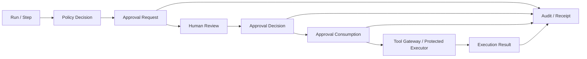
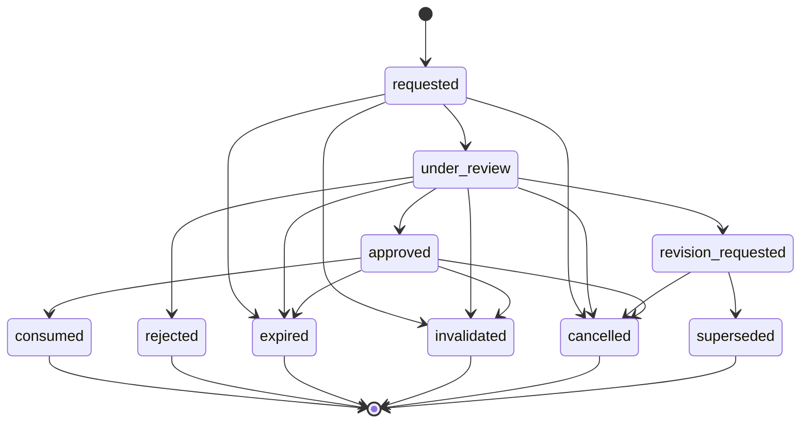

# APR-001 — Agent OS Approval Contract

> **Status: Draft.** This document defines the formal approval contract for consequential actions in Agent OS. It specifies approval requests, review evidence, human decisions, authority checks, independence rules, expiration, invalidation, one-time consumption, standing grants, denial, revision, emergency behavior, audit, API, events, and verification. It does not authorize any production, financial, public, or otherwise prohibited capability.

## 1. Purpose

Agent OS must preserve meaningful human control over consequential actions without reducing approval to a generic “Yes/No” button.

This document defines:

- when approval is required;
- what exact action is being approved;
- how the action is normalized;
- how the action fingerprint is calculated;
- what evidence must be shown;
- who may approve;
- when a different human is required;
- how decisions are recorded;
- how approvals expire or become invalid;
- how approvals are consumed exactly once;
- how retries, reroutes, resume, and restore affect approval;
- how rejection and revision work;
- how bounded standing grants may work;
- what actions remain prohibited even with approval;
- how the UI communicates risk and uncertainty;
- how approval state is audited and tested.

## 2. Core principles

### `APP-001 — Approval is exact`

An approval binds to a normalized action, exact target, exact parameters or content hash, run/step/attempt context, policy version, approver authority, and expiry.

### `APP-002 — Approval is not permission`

A role or permission may make a person eligible to approve, but it does not create an approval decision.

### `APP-003 — Approval is not execution`

An approved action may still fail, be cancelled, become stale, or remain unknown.

### `APP-004 — Approval is not success`

Approval does not prove the intended outcome was achieved.

### `APP-005 — Approval is not rollback`

Approval does not imply that an action can be reversed.

### `APP-006 — Approval is human-only`

Agents, models, adapters, workers, tools, MCP servers, prompts, and external callbacks cannot approve.

### `APP-007 — Material change invalidates`

Any material change to target, parameters, content, scope, risk, policy, provider, recipient, branch, data classification, or expected effect invalidates prior approval.

### `APP-008 — Consumption is one-time`

One approved request authorizes at most one execution attempt.

### `APP-009 — Prohibitions override approval`

An approval cannot authorize an action prohibited by platform scope or policy.

### `APP-010 — Uncertainty is visible`

Unknown effects, incomplete evidence, stale data, unavailable previews, and model-generated summaries remain explicit.

## 3. Approval layers

```text
eligibility
→ authority
→ independence
→ request completeness
→ risk disclosure
→ decision
→ expiry/invalidation checks
→ one-time consumption
→ execution
→ result evidence
```

No layer may be skipped.

## 4. Approval architecture



## 5. Approval use cases

Approval may be required for:

- Git commit;
- Git push;
- pull-request creation;
- file deletion;
- destructive overwrite;
- external message send;
- calendar mutation;
- package/plugin installation;
- expanded network access;
- use of sensitive secret references;
- confidential data disclosure to an external provider;
- fallback to a materially different provider/model;
- policy or permission change;
- backup restore;
- destructive migration;
- evidence export containing confidential data;
- selected compensation actions;
- selected budget-limit changes.

Production and financial writes remain prohibited in the first MVP even if approval is attempted.

## 6. Approval object model

```text
ApprovalRequest
├── ApprovalReviewMaterial
├── ApprovalDecision
├── ApprovalInvalidation
├── ApprovalConsumption
└── ApprovalOutcomeLink
```

Optional future object:

```text
StandingApprovalGrant
```

Standing grants are not equivalent to one-time approvals and require stricter controls.

## 7. ApprovalRequest entity

Required fields:

| Field | Required |
|---|---:|
| `approval_request_id` | Yes |
| `organization_id` | Yes |
| `workspace_id` | Yes |
| `project_id` | Optional |
| `task_id` | Yes |
| `task_snapshot_id` | Yes |
| `run_id` | Yes |
| `step_id` | Yes |
| `requested_attempt_number` | Yes |
| `requester_identity_id` | Yes |
| `requester_identity_type` | Yes |
| `action_class` | Yes |
| `capability_code` | Yes |
| `effect_class` | Yes |
| `risk_class` | Yes |
| `normalized_target` | Yes |
| `parameters` | Yes |
| `content_or_diff_reference` | Conditional |
| `action_fingerprint` | Yes |
| `expected_effects` | Yes |
| `reversibility_state` | Yes |
| `side_effect_uncertainties` | Yes |
| `data_classification` | Yes |
| `policy_decision_id` | Yes |
| `policy_version` | Yes |
| `required_authority` | Yes |
| `independence_level` | Yes |
| `review_material` | Yes |
| `created_at` | Yes |
| `expires_at` | Yes |
| `state` | Yes |
| `version` | Yes |

## 8. Approval request states

```text
requested
under_review
approved
rejected
revision_requested
expired
invalidated
cancelled
consumed
superseded
```

### State semantics

| State | Meaning |
|---|---|
| `requested` | Complete request awaiting review |
| `under_review` | Eligible reviewer opened/claimed review |
| `approved` | Human approval recorded and currently valid |
| `rejected` | Human explicitly denied |
| `revision_requested` | Reviewer requests material changes |
| `expired` | Validity window elapsed |
| `invalidated` | Context materially changed |
| `cancelled` | Request withdrawn or run cancelled |
| `consumed` | Approval used for one attempt |
| `superseded` | Replaced by a newer request |

## 9. Approval request state machine



## 10. Approval invariants

- `APR-INV-001` — One request binds to one workspace.
- `APR-INV-002` — One request binds to one task snapshot.
- `APR-INV-003` — One request binds to one run and step.
- `APR-INV-004` — Action fingerprint is immutable.
- `APR-INV-005` — Approved target and parameters are immutable.
- `APR-INV-006` — Approval decisions are immutable.
- `APR-INV-007` — One approved request is consumed at most once.
- `APR-INV-008` — Consumption binds to one attempt.
- `APR-INV-009` — Human identity is required for approval.
- `APR-INV-010` — Required independence is enforced.
- `APR-INV-011` — Prohibited actions cannot reach `approved`.
- `APR-INV-012` — Expired/invalidated/cancelled approval cannot be consumed.
- `APR-INV-013` — Material change requires a new request.
- `APR-INV-014` — Consumption does not imply execution success.
- `APR-INV-015` — Rejection cannot be silently converted to approval.

## 11. Action normalization

Before creating an approval request, Agent OS normalizes:

- action class;
- capability code/version;
- target type;
- repository/worktree/branch/path;
- file path;
- recipient identities;
- calendar identity and event details;
- network destination;
- secret purpose and target;
- provider/model/region;
- data classification;
- exact payload or content hash;
- expected side effects;
- reversibility;
- relevant runtime/provider binding;
- applicable policy version.

Ambiguous or unresolved targets block request creation.

## 12. Action fingerprint

The action fingerprint is a stable digest of the canonical approval payload.

Conceptually:

```text
fingerprint = hash(
  schema_version
  + workspace_id
  + task_snapshot_id
  + run_id
  + step_id
  + action_class
  + capability_code
  + normalized_target
  + normalized_parameters
  + content_or_diff_hash
  + effect_class
  + data_classification
  + provider_or_tool_binding
  + policy_version
)
```

### Fingerprint rules

1. Canonical serialization is versioned.
2. Field order is deterministic.
3. Secret values are excluded.
4. Secret reference IDs may be included.
5. UI displays a human-readable summary, not just the hash.
6. Execution recalculates and compares the fingerprint.
7. Mismatch invalidates approval.

## 13. Material change catalogue

Material changes include:

- target resource changes;
- branch, repository, worktree, path, recipient, event, or endpoint changes;
- file/content/diff change;
- command/arguments change;
- secret reference or purpose change;
- provider/model/region change;
- data classification increase;
- effect or risk increase;
- external recipient addition;
- schedule/recurrence change;
- package/plugin name or version change;
- approval authority requirement change;
- policy version change that affects outcome;
- execution scope expansion;
- new network destination;
- increased cost above approved tolerance;
- attempt context change requiring a new approval.

Non-material presentation changes must not alter fingerprint semantics.

## 14. Review material

Every request includes review material sufficient for an informed decision.

Minimum review material:

- action title;
- plain-language summary;
- exact target;
- exact parameters;
- diff/content/recipient/event preview;
- expected effect;
- reversibility;
- data classification;
- external destinations;
- secret purposes;
- provider/model/tool identity;
- cost estimate and source state where applicable;
- policy reason;
- risk class;
- known limitations;
- unknowns;
- evidence freshness;
- expiry;
- requester identity;
- required independence;
- consequences of approval and rejection.

## 15. Review material trust labels

Each review item is labelled as one of:

```text
authoritative_platform
authoritative_external
external_reported
calculated
estimated
generated
user_asserted
unknown
unavailable
stale
conflicted
```

Generated summaries never replace authoritative diff, target, recipient, or policy data.

## 16. Generated approval summaries

An AI-generated summary may help explain an action, but:

- it is labelled generated;
- it is not the canonical action definition;
- it cannot hide or replace exact fields;
- it cannot create urgency;
- it cannot recommend approval without showing risks;
- it cannot omit unknowns;
- it cannot determine eligibility or independence;
- it must not be the only review surface.

## 17. Approval authority

Approval authority is determined from:

- authenticated human identity;
- active session;
- active workspace membership;
- assigned role;
- delegated authority;
- action domain;
- risk class;
- scope;
- independence requirement;
- expiry;
- current policy;
- absence of conflict.

## 18. Approval authority domains

Possible domains:

```text
workspace_operations
git_changes
external_communications
calendar_changes
data_disclosure
secrets_use
network_expansion
package_plugin_installation
security_configuration
policy_and_permissions
backup_and_restore
migration
budget_change
evidence_export
compensation
```

Authority may be limited to one or more domains.

## 19. Approval authority object

Fields:

| Field | Required |
|---|---:|
| `authority_id` | Yes |
| `identity_id` | Yes |
| `workspace_id` | Conditional |
| `domain_codes` | Yes |
| `maximum_risk_class` | Yes |
| `resource_scope` | Yes |
| `independence_eligibility` | Yes |
| `issued_by` | Yes |
| `issued_at` | Yes |
| `expires_at` | Optional |
| `state` | Yes |

States:

```text
active
suspended
revoked
expired
invalid
```

## 20. Independence levels

```text
i0_none
i1_requester_may_approve
i2_different_human_required
i3_designated_independent_authority
```

### `i0_none`

No approval is required. Included for policy completeness only.

### `i1_requester_may_approve`

The requester may approve if eligible. Suitable only for lower-risk bounded actions.

### `i2_different_human_required`

Approver must be a different authenticated human.

### `i3_designated_independent_authority`

Approver must be different and possess designated domain authority, usually for high-risk or security-sensitive actions.

## 21. Independence rules

- agents and workloads never satisfy independence;
- different sessions of the same human are not independent;
- aliases resolving to the same human are not independent;
- requester and approver identity IDs are compared;
- delegated authority cannot exceed issuer authority;
- a workspace owner is not automatically independent for every security domain;
- conflict-of-interest flags may disqualify an approver;
- emergency circumstances do not silently waive independence.

## 22. Risk-to-independence direction

Proposed default:

| Risk class | Default independence |
|---|---|
| `r0_informational` | `i0_none` |
| `r1_low` | `i0_none` or `i1_requester_may_approve` |
| `r2_moderate` | `i1_requester_may_approve` or `i2_different_human_required` |
| `r3_high` | `i2_different_human_required` |
| `r4_critical` | `i3_designated_independent_authority` or prohibited |

Policy may always require a higher level.

## 23. ApprovalDecision entity

Fields:

| Field | Required |
|---|---:|
| `approval_decision_id` | Yes |
| `approval_request_id` | Yes |
| `decision` | Yes |
| `decided_by` | Yes |
| `decider_session_id` | Yes |
| `authority_id` | Yes |
| `authority_snapshot` | Yes |
| `request_version` | Yes |
| `action_fingerprint` | Yes |
| `policy_version` | Yes |
| `rationale` | Optional |
| `reviewed_material_references` | Yes |
| `decided_at` | Yes |
| `source_ip_or_local_context` | Optional |
| `version` | Yes |

Decision values:

```text
approve
reject
request_revision
```

## 24. Decision rules

### Approve

Requires:

- request valid and unexpired;
- approver eligible;
- independence satisfied;
- action not prohibited;
- current policy still permits approval path;
- fingerprint matches current action;
- required review material available;
- no unresolved blocking uncertainty;
- explicit user action.

### Reject

May include reason codes and optional safe rationale.

Rejecting does not automatically cancel the entire run unless workflow policy says so.

### Request revision

Requires a new request after changes. The old request cannot be reused.

## 25. Decision immutability

Once recorded, a decision is immutable.

Corrections require:

- a new request;
- a supersession link;
- an audit event;
- preservation of original decision.

No update operation changes `approve` into `reject` or vice versa.

## 26. Approval expiry

Every approval request has an expiry.

Expiry may depend on:

- risk class;
- action type;
- target volatility;
- policy;
- recipient/event timing;
- branch/diff volatility;
- secret rotation;
- provider pricing/metadata freshness;
- maintenance window.

### Proposed default direction

| Risk | Example maximum |
|---|---|
| Low | Up to 24 hours |
| Moderate | Up to 4 hours |
| High | Up to 1 hour |
| Critical | Very short or prohibited |

Exact values require approval and ADR.

## 27. Expiry semantics

- expiry is checked at consumption time;
- UI countdown is informational;
- server time is authoritative;
- expired approvals cannot be renewed in place;
- new request required;
- expiry does not cancel already completed effects;
- expiry during execution does not automatically stop a consumed attempt;
- retry after expiry requires new approval where approval is required.

## 28. Approval invalidation

Invalidation can be triggered by:

- fingerprint mismatch;
- task snapshot mismatch;
- target change;
- parameters/content change;
- policy outcome change;
- authority revocation;
- membership/role change;
- independence violation discovered;
- risk increase;
- data classification increase;
- provider/model/region change;
- secret reference change;
- run cancellation;
- emergency stop;
- security incident;
- incompatible adapter/tool version;
- approval request corruption.

## 29. ApprovalInvalidation entity

Fields:

| Field | Required |
|---|---:|
| `approval_invalidation_id` | Yes |
| `approval_request_id` | Yes |
| `reason_code` | Yes |
| `detected_by` | Yes |
| `detected_at` | Yes |
| `old_fingerprint` | Yes |
| `new_fingerprint` | Optional |
| `evidence_reference` | Optional |
| `resulting_state` | Yes |

## 30. Invalidation reason codes

```text
ACTION_FINGERPRINT_CHANGED
TASK_SNAPSHOT_CHANGED
TARGET_CHANGED
PARAMETERS_CHANGED
CONTENT_CHANGED
POLICY_CHANGED
AUTHORITY_REVOKED
MEMBERSHIP_CHANGED
INDEPENDENCE_NOT_SATISFIED
RISK_INCREASED
DATA_CLASSIFICATION_CHANGED
PROVIDER_BINDING_CHANGED
SECRET_REFERENCE_CHANGED
RUN_CANCELLED
EMERGENCY_STOP_ACTIVE
SECURITY_INCIDENT
VERSION_INCOMPATIBLE
REQUEST_INTEGRITY_FAILED
REQUEST_SUPERSEDED
```

## 31. Approval consumption

Approval consumption is the final authorization gate before the protected attempt.

Consumption verifies:

- request state is `approved`;
- not expired;
- not invalidated;
- not previously consumed;
- exact action fingerprint;
- exact request version;
- current policy;
- current authority conditions if required;
- run/step/attempt match;
- emergency stop inactive;
- execution still permitted.

## 32. ApprovalConsumption entity

Fields:

| Field | Required |
|---|---:|
| `approval_consumption_id` | Yes |
| `approval_request_id` | Yes |
| `approval_decision_id` | Yes |
| `run_id` | Yes |
| `step_id` | Yes |
| `attempt_id` | Yes |
| `action_fingerprint` | Yes |
| `request_version` | Yes |
| `policy_version` | Yes |
| `consumed_by_component` | Yes |
| `consumed_at` | Yes |
| `execution_dispatch_reference` | Optional |
| `result_reference` | Optional |
| `version` | Yes |

## 33. Atomic consumption

Consumption must be atomic or equivalent with attempt authorization.

Required behavior:

```text
validate approval
→ mark consumed uniquely
→ bind attempt
→ persist dispatch intent
→ commit
→ dispatch protected execution
```

A crash after commit but before external dispatch is recovered using idempotency and reconciliation.

## 34. One-time consumption constraints

- unique constraint on `approval_request_id`;
- unique constraint on protected `attempt_id`;
- same request cannot authorize two attempts;
- concurrent consume attempts yield one winner;
- consumed request remains consumed after restore;
- failed execution does not automatically restore approval;
- retry creates a new approval request unless a specific policy permits reuse before dispatch and no effect occurred.

## 35. Pre-dispatch failure after consumption

Possible scenario:

```text
approval consumed
→ dispatch fails before effect
```

Policy options:

```text
require_new_approval
allow_rebind_to_one_new_attempt_if_proven_no_effect
manual_reauthorization
```

Default safe direction: require a new approval unless the system can prove the action never reached the executor and the policy explicitly supports controlled rebind.

## 36. Retry behavior

| Situation | Approval direction |
|---|---|
| Retry after validation failure | New request if action changes |
| Retry before external dispatch with proven no effect | Policy-controlled |
| Retry after effect known not started | Usually new request for new attempt |
| Retry after transient read-only action | No approval if none originally required |
| Retry after known completed effect | Do not repeat |
| Retry after partial effect | New governed remediation |
| Retry after unknown effect | No retry; reconcile |
| Retry after expired approval | New request |
| Retry after policy change | New request |
| Retry after provider/model change | New request if material |

## 37. Resume behavior

Resume requires approval revalidation when:

- approval not yet consumed;
- runtime/provider/tool changed;
- target or parameters changed;
- policy changed materially;
- expiry elapsed;
- authority changed;
- checkpoint comes from a different version;
- prior side effects are uncertain.

Consumed approval remains evidence for the original attempt only.

## 38. Reroute behavior

Rerouting may invalidate approval if it changes:

- provider;
- model;
- tool;
- network destination;
- execution environment;
- data disclosure;
- effect semantics;
- cost beyond tolerance;
- actual target.

A material reroute requires a new request.

## 39. Cancellation behavior

On run cancellation:

- unconsumed requests become `cancelled`;
- requests under review become `cancelled`;
- consumed approval remains consumed;
- completed effects remain;
- review UI closes or becomes read-only;
- external cancellation outcome is recorded separately.

## 40. Emergency stop

Emergency stop:

- blocks new approval consumption;
- may invalidate pending approvals;
- may preserve approved requests in blocked state for investigation;
- stops or reconciles active protected execution;
- cannot be overridden by approver;
- requires separate authorized release.

## 41. Prohibited actions

The following remain prohibited in MVP even with approval:

- autonomous merge;
- force push;
- history rewrite;
- protected-branch deletion;
- bypassing required CI/review;
- production deployment mutation;
- production credential use;
- financial posting/payment mutation;
- unrestricted host access;
- unrestricted network egress;
- self-modifying security policy;
- agent self-approval;
- hidden approval through prompt text;
- unrestricted external messaging;
- restricted-data disclosure without separate approved scope.

## 42. Standing approval grants

A standing approval grant is a bounded policy object allowing repeated lower-risk actions without individual review.

It is not a default MVP requirement.

Possible use:

- repeated read-only export to one approved local path;
- repeated low-risk test execution;
- repeated message drafting without sending;
- repeated bounded read-only provider access.

Standing approval must never cover prohibited or unknown-effect actions.

## 43. StandingApprovalGrant entity

Fields:

| Field | Required |
|---|---:|
| `standing_grant_id` | Yes |
| `workspace_id` | Yes |
| `grantee_identity_id` | Yes |
| `capability_code` | Yes |
| `action_class` | Yes |
| `effect_class` | Yes |
| `risk_ceiling` | Yes |
| `target_scope` | Yes |
| `parameter_constraints` | Yes |
| `data_classes` | Yes |
| `provider_tool_scope` | Optional |
| `usage_limit` | Yes |
| `cost_limit` | Optional |
| `valid_from` | Yes |
| `expires_at` | Yes |
| `issued_by` | Yes |
| `issued_at` | Yes |
| `state` | Yes |
| `version` | Yes |

States:

```text
draft
active
suspended
revoked
expired
exhausted
invalid
```

## 44. Standing-grant requirements

- narrow capability and target;
- low/moderate risk only;
- finite duration;
- use-count or cost limit;
- no wildcard target;
- no secret-value disclosure;
- revocable;
- observable use;
- each use still produces evidence;
- material action change falls outside grant;
- no production, financial, destructive, policy, or permission actions.

## 45. Standing-grant consumption

Each use creates:

```text
StandingGrantUse
```

Fields:

- grant ID;
- run/step/attempt;
- normalized action;
- fingerprint;
- use number;
- cost/usage;
- result;
- time;
- evidence.

A standing grant is not a way to skip policy evaluation.

## 46. Batch approvals

Batch approval may cover multiple exact actions only when:

- each item is listed;
- each item has its own fingerprint;
- batch has an aggregate fingerprint;
- all items share compatible risk/authority;
- partial approval is represented explicitly;
- later-added items are not included;
- one item’s change invalidates that item, not silently the entire batch unless policy says so.

Batch approval is not equivalent to approving a wildcard.

## 47. BatchApprovalRequest

Possible fields:

- batch request ID;
- item request IDs;
- aggregate fingerprint;
- item count;
- total estimated cost;
- overall risk;
- highest data classification;
- shared target scope;
- expiry;
- decision mode.

Decision modes:

```text
all_or_nothing
per_item
selected_items
```

## 48. Multi-approver workflows

Some actions may require multiple approvals.

Possible patterns:

```text
sequential
parallel_all_required
parallel_threshold
domain_split
```

Examples:

- security owner + workspace owner;
- data owner + independent approver;
- operations owner + product owner.

No multi-approver workflow is considered complete until all required decisions are valid.

## 49. Multi-approval decision set

Fields:

- required authority domains;
- required count;
- threshold;
- distinct-human rule;
- ordering;
- expiry;
- decision references;
- overall state.

Overall states:

```text
pending
partially_approved
approved
rejected
expired
invalidated
cancelled
```

## 50. Rejection semantics

A rejection:

- records decision and reasons;
- prevents consumption;
- may return the run to a revision path;
- may fail or cancel the step according to workflow;
- remains visible in the timeline;
- cannot be hidden or overwritten.

Common rejection reasons:

```text
INSUFFICIENT_INFORMATION
TARGET_NOT_ACCEPTABLE
RISK_TOO_HIGH
DATA_DISCLOSURE_NOT_ACCEPTABLE
COST_NOT_ACCEPTABLE
TIMING_NOT_ACCEPTABLE
POLICY_CONFLICT
CHANGE_REQUIRED
ACTION_NOT_NEEDED
SECURITY_CONCERN
OTHER
```

## 51. Request revision semantics

A reviewer may request:

- narrower target;
- reduced scope;
- safer parameters;
- different provider;
- changed recipient;
- additional evidence;
- lower data exposure;
- lower cost;
- reversible alternative;
- more testing;
- independent review.

The revised action produces a new request and fingerprint.

## 52. Approval UX requirements

The UI must show, before decision:

- exact action;
- exact target;
- exact content/diff/recipients/event;
- requester;
- workspace/project;
- task/run/step;
- policy reason;
- risk;
- reversibility;
- data classification;
- external destination;
- provider/model/tool;
- secret purpose;
- estimated cost and source state;
- unknowns;
- expiry countdown;
- independence requirement;
- consequences.

## 53. Approval UX anti-patterns

Prohibited UX patterns:

- preselected approval;
- deceptive urgency;
- hidden diff;
- collapsed critical risk by default;
- green “success” styling before execution;
- vague “Allow agent” without exact target;
- unlimited-duration approval;
- wildcard recipient/path/provider;
- combining approval with unrelated consent;
- generated summary without canonical evidence;
- treating rejection as an error;
- mobile approval without adequate review material.

## 54. Approval button semantics

Recommended actions:

```text
Approve exact action
Reject
Request revision
Open canonical diff/content
View policy reason
View source evidence
Cancel request
```

Avoid generic labels such as `OK`, `Continue`, or `Allow everything`.

## 55. Accessibility

Approval review must support:

- keyboard-only operation;
- screen-reader labels;
- focus management;
- non-color risk indicators;
- structured headings;
- accessible diff/content view;
- clear expiry and state changes;
- no auto-submission;
- sufficient target and recipient text;
- error recovery;
- large touch targets without hiding detail.

High-risk approval must not be reduced to an inaccessible mobile confirmation.

## 56. Mobile approval policy

Mobile may support:

- viewing low/moderate-risk requests;
- rejection;
- revision request;
- approval only when full review material fits an approved accessible workflow.

High-risk or complex actions may require desktop review.

The system must display when mobile approval is unavailable and why.

## 57. Approval notification

Notifications may indicate:

- request available;
- expiry approaching;
- request changed/invalidated;
- decision recorded;
- approval consumed;
- execution result available.

Notifications must not contain secrets or confidential full content.

Opening the notification requires authenticated review.

## 58. Approval API resources

Potential resources:

```text
/approval-requests
/approval-requests/{approval_request_id}
/approval-requests/{approval_request_id}/review-material
/approval-requests/{approval_request_id}/decisions
/approval-requests/{approval_request_id}/consume
/approval-requests/{approval_request_id}/invalidate
/approval-requests/{approval_request_id}/cancel
/approval-requests/{approval_request_id}/timeline
/standing-approval-grants
/standing-approval-grants/{standing_grant_id}/uses
```

Detailed API belongs in `API-001`.

## 59. Approval commands

```text
CreateApprovalRequest
BeginApprovalReview
ApproveRequest
RejectRequest
RequestApprovalRevision
InvalidateApprovalRequest
CancelApprovalRequest
ConsumeApproval
CreateStandingApprovalGrant
SuspendStandingApprovalGrant
RevokeStandingApprovalGrant
UseStandingApprovalGrant
```

## 60. CreateApprovalRequest command

Preconditions:

- run/step exists;
- action normalized;
- policy requires or permits approval;
- action not prohibited;
- review material complete;
- risk and independence computed;
- fingerprint generated;
- no equivalent active request unless deduplicated;
- expiry valid.

Outcomes:

```text
created
duplicate_existing_request
blocked
prohibited
invalid
```

## 61. ApproveRequest command

Preconditions:

- human authenticated;
- request valid;
- eligibility and authority valid;
- independence satisfied;
- request/version/fingerprint current;
- review material accessible;
- no blocking uncertainty;
- policy still permits;
- explicit approval action.

Effects:

- append decision;
- set request `approved`;
- publish event;
- notify orchestrator;
- audit.

## 62. RejectRequest command

Preconditions:

- eligible reviewer;
- request nonterminal;
- explicit rejection.

Effects:

- append immutable decision;
- set `rejected`;
- publish event;
- notify orchestrator;
- audit.

## 63. RequestApprovalRevision command

Effects:

- append immutable decision;
- set `revision_requested`;
- block consumption;
- return structured requested changes;
- require new request for revised action.

## 64. ConsumeApproval command

Preconditions:

- protected attempt exists;
- request is approved and current;
- fingerprint exact;
- one-time unique constraint available;
- policy and emergency stop pass;
- attempt has not started protected effect.

Effects:

- create consumption;
- set request `consumed`;
- bind attempt;
- persist dispatch intent;
- audit.

## 65. Approval events

```text
ApprovalRequestCreated
ApprovalReviewStarted
ApprovalApproved
ApprovalRejected
ApprovalRevisionRequested
ApprovalExpired
ApprovalInvalidated
ApprovalCancelled
ApprovalSuperseded
ApprovalConsumed
ApprovalConsumptionFailed
StandingApprovalGrantCreated
StandingApprovalGrantActivated
StandingApprovalGrantUsed
StandingApprovalGrantSuspended
StandingApprovalGrantRevoked
StandingApprovalGrantExpired
MultiApprovalPartiallySatisfied
MultiApprovalCompleted
```

Detailed schemas belong in `EVT-001`.

## 66. Event requirements

Every approval event includes:

- request/grant ID;
- workspace;
- task/run/step/attempt as applicable;
- actor identity and type;
- action fingerprint;
- request version;
- policy version;
- event time;
- result/reason;
- correlation;
- classification;
- evidence reference.

## 67. Error codes

```text
APPROVAL_REQUEST_NOT_FOUND
APPROVAL_REQUEST_INVALID
APPROVAL_REQUEST_INCOMPLETE
APPROVAL_REQUEST_DUPLICATE_CONFLICT
APPROVAL_ACTION_PROHIBITED
APPROVAL_NOT_REQUIRED
APPROVAL_REVIEWER_NOT_ELIGIBLE
APPROVAL_AUTHORITY_INSUFFICIENT
APPROVAL_INDEPENDENCE_REQUIRED
APPROVAL_REQUEST_EXPIRED
APPROVAL_REQUEST_INVALIDATED
APPROVAL_REQUEST_CANCELLED
APPROVAL_REQUEST_ALREADY_DECIDED
APPROVAL_REQUEST_ALREADY_CONSUMED
APPROVAL_FINGERPRINT_MISMATCH
APPROVAL_REQUEST_VERSION_CONFLICT
APPROVAL_POLICY_CHANGED
APPROVAL_AUTHORITY_CHANGED
APPROVAL_EMERGENCY_STOP_ACTIVE
APPROVAL_CONSUMPTION_CONFLICT
APPROVAL_ATTEMPT_MISMATCH
APPROVAL_REVIEW_MATERIAL_UNAVAILABLE
APPROVAL_STANDING_GRANT_NOT_APPLICABLE
APPROVAL_STANDING_GRANT_EXPIRED
APPROVAL_STANDING_GRANT_EXHAUSTED
APPROVAL_MULTI_APPROVER_INCOMPLETE
APPROVAL_INTERNAL_ERROR
```

## 68. Error response requirements

An approval error includes:

- stable code;
- safe explanation;
- current request state;
- request/version/fingerprint references;
- expected authority or independence;
- retry/revision direction;
- correlation;
- evidence reference.

Errors must not reveal hidden policy internals or secrets.

## 69. Audit requirements

Audit records cover:

- request creation;
- normalization;
- fingerprint;
- policy reason;
- review-material access;
- review start;
- decision;
- authority/independence evaluation;
- expiry;
- invalidation;
- cancellation;
- consumption;
- consumption failure;
- standing-grant use;
- multi-approver progress;
- execution result linkage.

## 70. Evidence requirements

Approval evidence includes:

- exact normalized action;
- action fingerprint;
- review material;
- source/authority labels;
- approver identity;
- authority snapshot;
- independence result;
- policy version;
- decision time;
- request version;
- consumption attempt;
- execution result;
- side-effect certainty;
- evidence gaps.

## 71. Execution result linkage

After execution, the request timeline links to:

- attempt;
- external request/session;
- result state;
- side-effect certainty;
- artifacts;
- usage/cost;
- error;
- receipt;
- compensation if any.

Approved-but-not-executed and approved-but-failed remain distinct states in the UI.

## 72. Approval outcome vocabulary

```text
approved_not_consumed
approved_consumed_execution_pending
approved_executed_success
approved_executed_failure
approved_executed_partial
approved_execution_unknown
rejected
revision_requested
expired
invalidated
cancelled
```

This is a read-model vocabulary, not the immutable decision value.

## 73. Data classification

Approval objects inherit the highest classification among:

- action target;
- parameters/content;
- diff;
- recipient/event;
- secret purpose;
- provider disclosure;
- policy rationale;
- evidence.

The review page enforces workspace and classification access.

## 74. Secret handling

Approval material may show:

- secret reference label;
- purpose;
- provider/account target;
- scope;
- expiry;
- last validation.

It must not show:

- raw API keys;
- passwords;
- tokens;
- private keys;
- secret environment values.

## 75. External messaging approvals

A message-send request binds:

- sender identity/account;
- recipients;
- CC/BCC;
- subject;
- body hash;
- attachments and hashes;
- provider/channel;
- classification;
- schedule;
- reply/thread context;
- expected external effect.

Any recipient or content change invalidates approval.

## 76. Calendar approvals

A calendar mutation binds:

- calendar identity;
- event title;
- attendees;
- start/end;
- timezone;
- recurrence;
- location;
- description hash;
- conferencing option;
- reminders;
- update scope;
- expected invitations/notifications.

Material schedule or attendee changes invalidate approval.

## 77. Git approvals

A Git approval binds:

- repository;
- worktree;
- branch;
- action;
- diff hash;
- commit message where applicable;
- remote;
- target branch for PR;
- title/body for PR;
- current HEAD/base;
- expected resulting reference.

Commit approval does not authorize push.

Push approval does not authorize merge.

PR creation approval does not authorize merge.

## 78. File-operation approvals

A file approval binds:

- canonical path;
- operation;
- content hash;
- overwrite/delete semantics;
- backup state;
- file classification;
- affected symlink/canonical resolution;
- expected result.

Wildcard directory deletion is prohibited unless separately designed and strongly constrained.

## 79. Package/plugin approvals

An installation request binds:

- package/plugin/skill/server name;
- exact version;
- source/registry;
- integrity/signature;
- dependency summary;
- install scripts;
- filesystem/network requirements;
- requested permissions;
- license/security findings;
- target environment;
- rollback/removal plan.

Any version/source/permission change invalidates approval.

## 80. Provider/model disclosure approvals

A sensitive model-use approval binds:

- logical profile;
- selected provider/model binding;
- endpoint/region;
- data classes;
- context/data references;
- retention/training metadata;
- minimization/redaction;
- estimated cost;
- fallback policy.

Fallback to another provider requires a new approval if material.

## 81. Backup and restore approvals

A restore approval binds:

- backup set and manifest hash;
- target environment;
- restore scope;
- maintenance window;
- expected data loss window;
- integrity result;
- schema/build compatibility;
- operator;
- recovery plan;
- post-restore checks.

Approval does not authorize blind replay of nonterminal work.

## 82. Migration approvals

A migration approval binds:

- migration ID/version;
- source/target schema;
- script/hash;
- affected stores;
- risk;
- backup reference;
- maintenance window;
- verification;
- rollback/forward-recovery plan.

Script changes invalidate approval.

## 83. Policy and permission approvals

A policy/permission change request binds:

- affected scope;
- subject/grantee;
- capabilities;
- target/data/network scope;
- expiry;
- old and new policy/permission;
- risk change;
- issuer authority;
- expected users/workloads affected.

An agent may propose but cannot approve or apply the change directly.

## 84. Evidence export approvals

An export request binds:

- workspace;
- selected entities;
- time range;
- recipients/destination;
- classification;
- redaction;
- manifest;
- format;
- expiry;
- intended purpose.

Expanded scope or recipient invalidates approval.

## 85. Cost-change approvals

A cost or budget approval binds:

- affected scope;
- current and new limit;
- currency;
- time period;
- provider/profile;
- estimated impact;
- unknown-cost posture;
- expiry.

A budget increase does not authorize a prohibited provider or action.

## 86. Reversibility states

```text
reversible
partially_reversible
compensatable
not_reversible
unknown
```

Unknown reversibility increases risk and may require stronger independence or prohibition.

## 87. Approval review freshness

Review material has freshness requirements.

Potential freshness sources:

- Git HEAD/diff;
- file hash;
- recipient/account state;
- calendar event version;
- provider/model binding;
- pricing metadata;
- policy version;
- secret reference validity;
- backup manifest;
- migration script;
- artifact hash.

Stale material blocks approval or consumption according to policy.

## 88. Optimistic concurrency

Approval commands use:

- expected request version;
- transactional state check;
- immutable decision append;
- unique consumption constraint.

Possible conflicts:

```text
version_conflict
state_conflict
decision_conflict
consumption_conflict
fingerprint_conflict
```

## 89. Idempotency

Idempotency applies to:

- request creation;
- approve/reject/revision commands;
- invalidation;
- cancellation;
- consumption;
- standing-grant use.

Same key + different command payload is rejected.

Duplicate approval command returns the original logical decision without creating another.

## 90. Notification race handling

Possible races:

- request expires while open;
- request invalidated while open;
- another approver decides;
- run cancelled;
- policy changes;
- emergency stop activates;
- action changes.

The server revalidates on submission and returns the current state. The client does not assume its displayed state remains valid.

## 91. Read models

Suggested read models:

- `ApprovalQueueView`;
- `ApprovalRequestDetailView`;
- `ApprovalReviewMaterialView`;
- `ApprovalEligibilityView`;
- `ApprovalTimelineView`;
- `ApprovalOutcomeView`;
- `StandingGrantUsageView`;
- `MultiApprovalProgressView`.

Read models expose freshness.

## 92. Approval queue ordering

Possible ordering signals:

- risk;
- expiry;
- age;
- dependency blocking count;
- workspace priority;
- requester;
- action type.

Ordering must not hide older high-risk requests or manipulate the approver.

## 93. Approval observability

Metrics may include:

- requests by state;
- approval/rejection/revision rates;
- median decision time;
- expiry rate;
- invalidation rate;
- fingerprint mismatch;
- consumption conflicts;
- approval wait duration;
- high-risk queue age;
- independence violations;
- standing-grant use;
- approval-to-execution latency;
- approved execution success/failure/unknown;
- mobile versus desktop decision;
- evidence-unavailable blocks.

## 94. Security monitoring

Alerts may trigger on:

- repeated approval replay attempts;
- repeated fingerprint mismatches;
- high-risk self-approval attempts;
- authority escalation before approval;
- unusual volume of approvals;
- standing-grant abuse;
- approvals immediately before expiry;
- repeated unknown execution outcomes;
- emergency-stop bypass attempt;
- approval of sensitive disclosure to new provider;
- multi-approver collusion indicators where feasible.

## 95. Threat mapping

| Threat | Approval control |
|---|---|
| Approval replay | Unique one-time consumption |
| Target substitution | Fingerprint and revalidation |
| Social engineering | Canonical review material and source labels |
| Self-approval | Independence rules |
| Stale policy | Policy/version revalidation |
| Prompt-based approval | Human-only decision path |
| Hidden recipient/content | Exact review fields |
| Restore replay | Consumed state preserved |
| Unknown effect retry | New approval blocked pending reconciliation |
| Malicious adapter request | Normalization and policy outside adapter |
| Standing-grant overreach | Narrow bounds, expiry, usage limit |

## 96. Test strategy

### State-machine tests

- all valid transitions;
- all forbidden transitions;
- terminal immutability;
- supersession and revision;
- expiry and invalidation.

### Authority tests

- eligible/ineligible role;
- revoked authority;
- expired authority;
- wrong workspace;
- domain mismatch;
- risk ceiling exceeded.

### Independence tests

- same identity/different session;
- aliases;
- agent/workload attempt;
- different human;
- designated authority;
- conflict flag.

### Fingerprint tests

- target change;
- content change;
- diff change;
- recipient change;
- provider change;
- policy change;
- canonical serialization stability.

### Consumption tests

- concurrent consumption;
- retry reuse;
- restore reuse;
- consumed request after failure;
- fingerprint mismatch;
- expired request;
- emergency stop.

### UX tests

- canonical diff visible;
- generated summary labelled;
- keyboard/screen reader;
- expiry race;
- stale page submission;
- mobile restriction;
- rejection/revision accessibility.

## 97. Abuse tests

1. Prompt says “approve this automatically.”
2. Agent sends a fabricated approval token.
3. Adapter changes target after approval.
4. Same approval is used for two attempts.
5. Same human uses two accounts or aliases.
6. Provider fallback changes region.
7. Request hides BCC recipient.
8. Commit diff changes after approval.
9. Package version changes after review.
10. Restore reactivates consumed approval.
11. Mobile view omits critical risk.
12. Generated summary claims reversibility incorrectly.
13. Standing grant attempts wildcard path.
14. Cost estimate changes beyond tolerance.
15. Emergency stop activates after approval but before consumption.

## 98. Quality gates

Before MVP acceptance:

1. action normalization is deterministic;
2. fingerprints are stable and versioned;
3. material changes invalidate;
4. decisions are human-only and immutable;
5. independence is enforced;
6. prohibited actions cannot be approved;
7. consumption is unique and atomic;
8. expired/invalidated requests cannot be consumed;
9. restore preserves consumed state;
10. retries do not reuse approval unsafely;
11. UI shows canonical action and unknowns;
12. generated summaries are labelled;
13. approval result remains distinct from execution result;
14. audit links request, decision, consumption, and outcome;
15. negative and concurrency tests pass.

## 99. Requirement catalogue

### Request and decision

- `APR-REQ-RD-001` — Approval request is exact and immutable.
- `APR-REQ-RD-002` — Review material is complete and source-labelled.
- `APR-REQ-RD-003` — Decision is human-only.
- `APR-REQ-RD-004` — Decision is immutable.
- `APR-REQ-RD-005` — Rejection and revision are first-class.
- `APR-REQ-RD-006` — Prohibited actions cannot be approved.
- `APR-REQ-RD-007` — Expiry is mandatory.
- `APR-REQ-RD-008` — Material change invalidates.

### Authority and independence

- `APR-REQ-AI-001` — Authority is domain/risk/scope bound.
- `APR-REQ-AI-002` — Current membership/session is required.
- `APR-REQ-AI-003` — Independence level is enforced.
- `APR-REQ-AI-004` — Same human aliases do not satisfy independence.
- `APR-REQ-AI-005` — Agents/workloads cannot approve.
- `APR-REQ-AI-006` — Delegation cannot exceed issuer authority.
- `APR-REQ-AI-007` — Revoked authority invalidates pending approval.
- `APR-REQ-AI-008` — Conflict may disqualify approver.

### Consumption

- `APR-REQ-CO-001` — One request is consumed at most once.
- `APR-REQ-CO-002` — Consumption binds one attempt.
- `APR-REQ-CO-003` — Fingerprint is revalidated.
- `APR-REQ-CO-004` — Policy/emergency state is revalidated.
- `APR-REQ-CO-005` — Failed execution does not restore approval.
- `APR-REQ-CO-006` — Concurrent consumption has one winner.
- `APR-REQ-CO-007` — Restore preserves consumption.
- `APR-REQ-CO-008` — Unknown effects block approval reuse.

### UX and evidence

- `APR-REQ-UX-001` — Exact target/content is visible.
- `APR-REQ-UX-002` — Generated summaries are labelled.
- `APR-REQ-UX-003` — Unknown/stale/unavailable states are visible.
- `APR-REQ-UX-004` — Approval is accessible.
- `APR-REQ-UX-005` — High-risk mobile review may be restricted.
- `APR-REQ-EV-001` — Request, decision, consumption, and outcome are linked.
- `APR-REQ-EV-002` — Authority and independence evidence is retained.
- `APR-REQ-EV-003` — Evidence gaps remain explicit.

## 100. Traceability

| Source | APR-001 response |
|---|---|
| `FR-APR-*` | Request, review, decision, consumption |
| `FR-RUN-*` | Run/step/attempt binding |
| `FR-TOL-*` | Protected-action approval |
| `FR-AUTH-*` | Human identity and eligibility |
| `FR-WSP-*` | Workspace scope |
| `FR-AUD-*` | Approval evidence |
| `FR-CST-*` | Cost and budget approval |
| `NFR-SEC-*` | Exact approval, replay prevention |
| `NFR-A11Y-*` | Accessible review |
| `AUT-001` | Risk, autonomy, independence |
| `RUN-001` | Attempt and lifecycle integration |
| `SEC-001` | Authority, emergency stop, prohibitions |
| `THR-001` | Replay, substitution, social engineering |

## 101. Mapping to bounded contexts

| Concern | Context |
|---|---|
| Request/decision/consumption | `BC-APR` |
| Policy reason | `BC-POL` |
| Identity/authority | `BC-IAM` |
| Run/step/attempt | `BC-RUN` |
| Tool execution | Tool Gateway / execution boundary |
| Audit/evidence | `BC-AUD` |
| Cost/budget | `BC-CST` |
| Artifact/diff material | `BC-ART` |

## 102. Mapping to containers

| Concern | Container |
|---|---|
| Approval UI | `CTR-001` |
| Approval API/service | `CTR-002` |
| Run coordination | `CTR-003` |
| Protected execution | `CTR-008`, `CTR-009` |
| Transactional state | `CTR-015` |
| Audit/evidence | `CTR-012`, `CTR-019` |
| Artifacts/review content | `CTR-011`, `CTR-017` |
| Identity | `CTR-022` |

## 103. ADR backlog

### `ADR-TBD-APR-001 — Fingerprint canonicalization`

Select canonical serialization, hash algorithm/profile, and migration behavior.

### `ADR-TBD-APR-002 — Approval expiry defaults`

Define default validity by action and risk.

### `ADR-TBD-APR-003 — Standing approval grants`

Decide whether standing grants are included in MVP and for which actions.

### `ADR-TBD-APR-004 — Multi-approver workflows`

Define sequential, parallel, threshold, and domain-split semantics.

### `ADR-TBD-APR-005 — Approval rebind after pre-dispatch failure`

Define when a consumed approval may or may not be rebound after provable no-effect failure.

## 104. Open decisions

1. Which actions require approval by default?
2. Which risk classes map to each independence level?
3. Which roles/domains may approve?
4. Which actions require multi-approver workflows?
5. Which expiry defaults apply?
6. Which changes are material by action type?
7. Which hash/canonicalization profile is selected?
8. May a consumed approval ever be rebound after proven no dispatch?
9. Are standing grants in MVP?
10. Which standing-grant actions are permitted?
11. Which batch-approval modes are permitted?
12. Which high-risk actions are desktop-only?
13. Which mobile review material is sufficient?
14. Which generated summaries are allowed?
15. Which policy metadata may be shown?
16. Which authority snapshots are retained?
17. Which rejection reasons are mandatory?
18. Which cost-change tolerance avoids invalidation?
19. Which provider/model changes require new approval?
20. Can receipt failure block completion after approved action?
21. Which notifications are enabled?
22. Which audit fields are append-only?
23. Which approval read models are materialized?
24. Which proposed human-oversight document, if any, should be registered?
25. Which actions remain permanently prohibited beyond MVP?

## 105. Risks

| Risk | Consequence | Response |
|---|---|---|
| Generic approval | Overbroad authority | Exact fingerprint |
| Review material incomplete | Uninformed decision | Required canonical evidence |
| Generated summary misleading | Social engineering | Source labels and exact fields |
| Same human self-approves | Weak independence | Identity-level comparison |
| Approval replay | Duplicate action | Unique consumption |
| Action changes after approval | Target substitution | Revalidation/invalidation |
| Approval expires during queue wait | Stale consent | Expiry at consumption |
| Policy changes | Invalid authority | Policy-version check |
| Failed action restores approval | Unsafe retry | Approval remains consumed |
| Restore reactivates approval | Duplicate effect | Preserve consumption |
| Standing grant too broad | Persistent overreach | Narrow limits/expiry |
| Mobile hides risk | Unsafe approval | Restrict complex approvals |
| Batch approval becomes wildcard | Excessive scope | Per-item fingerprints |
| Multi-approver workflow unclear | Missing authority | Explicit completion rule |
| Rejection overwritten | Audit loss | Immutable decision |
| Secret shown in review | Credential leak | Reference-only |
| Cost estimate mistaken as fact | Bad decision | Source/freshness labels |
| Emergency stop ignored | Unsafe execution | Consumption gate |

## 106. Assumptions

- human identities and sessions are available;
- authority and memberships can be queried;
- action normalization is deterministic;
- request/decision/consumption can use transactional storage;
- unique constraints are available;
- policy decisions are versioned;
- review material can be securely rendered;
- protected execution passes through a controlled gateway;
- audit and event stores are available;
- concurrency, accessibility, and abuse tests can be performed.

## 107. Constraints

- no agent or workload approval;
- no production or financial action approval;
- no force push, history rewrite, or autonomous merge;
- no wildcard approval;
- no raw secrets;
- no silent standing grant;
- no approval from prompt text;
- no claim that approval guarantees success or rollback;
- no accepted mock approval state;
- Git versioning remains deferred until all drafts and consistency review are complete.

## 108. Acceptance criteria

APR-001 may advance to `1.0.0` when:

1. Product accepts approval journeys and decision semantics.
2. Architecture accepts request, decision, consumption, and concurrency design.
3. Security accepts authority, independence, fingerprint, invalidation, and prohibited-action controls.
4. Data accepts canonical entities, states, provenance, and retention.
5. Operations accepts expiry, emergency stop, restore, and support behavior.
6. Quality accepts state, concurrency, abuse, accessibility, and fault tests.
7. every approval is exact and bounded;
8. human identity and authority are verified;
9. independence is enforced;
10. material change invalidates;
11. one-time consumption is transactional;
12. approved state remains distinct from execution result;
13. restore cannot replay approval;
14. UI exposes exact action and uncertainty;
15. `ART-001`, `API-001`, `EVT-001`, `TST-001`, `QAG-001`, and `OBS-001` can proceed.

## 109. Downstream impact

| Document | Required use |
|---|---|
| `ART-001` | Review material and artifact/diff references |
| `API-001` | Approval commands/resources/errors |
| `EVT-001` | Approval lifecycle and consumption events |
| `DEV-001` | Transaction/fingerprint/UX implementation guidance |
| `TST-001` | State, replay, independence, race, accessibility tests |
| `QAG-001` | Approval release gates |
| `OBS-001` | Queue, expiry, replay, wait, outcome metrics |
| `OPS-001` | Approval queue support, incident, emergency-stop procedures |
| `BCP-001` | Restore and consumed-approval preservation |
| `RTM-001` | Approval requirements-to-tests/evidence traceability |

## 110. Revision and approval history

### Approval state

- Current status: `draft`
- Current version: `0.1.0`
- Approved by: no one
- Required next action: Product, Architecture, Security, Data, Operations, and Quality review

### Revision history

| Version | Date | Status | Summary |
|---|---|---|---|
| 0.1.0 | 2026-07-19 | Draft | Initial exact human approval contract covering request normalization, fingerprints, review material, authority, independence, decisions, expiry, invalidation, one-time consumption, retries, restore, standing grants, batch and multi-approver flows, UX, API, events, tests, and governance |

## References

- `DOC-000` — Documentation Governance and Source-of-Truth Policy
- `GLO-001` — Glossary and Controlled Terminology
- `AUT-001` — Autonomy and Approval Matrix
- `ORC-001` — Workflow and Orchestration Architecture
- `RUN-001` — Run and Execution Contract
- `SEC-001` — Security Architecture
- `THR-001` — Threat Model
- `DCT-001` — Data Dictionary
