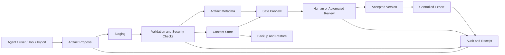
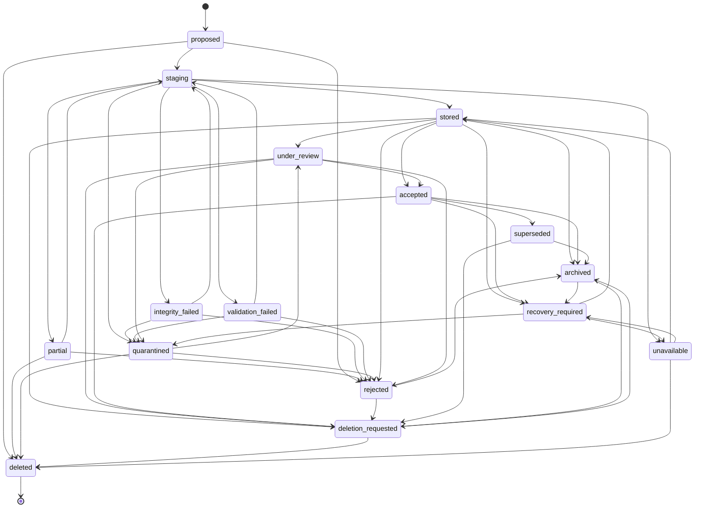
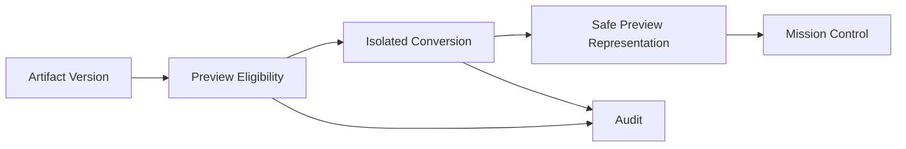

# ART-001 — Agent OS Artifact Contract

> **Status: Approved contract baseline — 2026-08-13.** This document defines the formal artifact contract for Agent OS. It covers artifact proposals, staging, content storage, versions, integrity, provenance, classification, review, acceptance, rejection, safe preview, export, deletion, recovery, retention, and evidence. It does not select a final object store, malware scanner, document-rendering engine, file format, or retention schedule.

## 1. Purpose

Artifacts are durable outputs produced, imported, reviewed, or retained by Agent OS.

Examples include:

- generated documents;
- code patches;
- source files;
- reports;
- images;
- datasets;
- archives;
- logs;
- evidence bundles;
- execution receipts;
- export packages;
- backup manifests;
- structured results.

This contract defines:

- what an artifact is;
- how an agent proposes one;
- how content enters staging;
- how integrity is established;
- how versions are created;
- how provenance is preserved;
- how classification is assigned and inherited;
- how review and acceptance work;
- how previews remain safe;
- how artifacts relate to tasks, runs, steps, attempts, models, tools, and approvals;
- how exports are controlled;
- how deletion and retention work;
- how backups and restore affect artifacts;
- how incomplete, unavailable, conflicting, or corrupted artifacts are represented;
- which events, APIs, tests, metrics, and quality gates are required.

## 2. Core principles

### `ART-P-001 — Metadata before trust`

An artifact record may exist before content is trusted, but must clearly show its state.

### `ART-P-002 — Content is untrusted by default`

Generated, imported, uploaded, adapter-produced, provider-produced, and tool-produced content is untrusted until validated for its intended use.

### `ART-P-003 — Proposal is not acceptance`

An agent or adapter may propose an artifact. It cannot mark it accepted.

### `ART-P-004 — Integrity is explicit`

Stored content has an integrity hash or explicit integrity limitation.

### `ART-P-005 — Provenance is durable`

The platform preserves who or what produced the artifact, from which task/run/step/attempt, with which model, adapter, tool, and source inputs.

### `ART-P-006 — Classification follows content`

Artifact classification reflects the highest applicable classification among source content, task context, generated content, embedded metadata, and review decision.

### `ART-P-007 — Preview is not execution`

Previewing an artifact must not execute active content, scripts, macros, embedded applications, or unsafe remote resources.

### `ART-P-008 — Versioning is append-oriented`

A material content change creates a new immutable artifact version.

### `ART-P-009 — Acceptance is purpose-bound`

Acceptance means the artifact passed defined criteria for a specific purpose. It does not prove universal correctness.

### `ART-P-010 — Deletion is lifecycle-controlled`

Deletion removes active availability through governed lifecycle transitions and preserves required evidence.

### `ART-P-011 — Unknown remains unknown`

Unknown integrity, missing content, unavailable storage, incomplete scanning, or uncertain provenance is not presented as safe or complete.

### `ART-P-012 — Exports remain governed`

Exporting content is a separate controlled action with scope, classification, destination, manifest, and evidence.

## 3. Non-goals

This contract does not:

- define a document editor;
- define a source-code repository;
- replace Git history;
- define a complete media asset management system;
- guarantee malware detection;
- guarantee legal admissibility;
- guarantee semantic correctness;
- guarantee that generated documents are factually accurate;
- guarantee permanent storage;
- define final retention periods;
- define public file sharing;
- define production CDN delivery;
- authorize unrestricted file execution;
- authorize production or financial mutation.

## 4. Artifact architecture



## 5. Artifact aggregate

```text
Artifact
├── ArtifactVersion
├── ArtifactContentObject
├── ArtifactProvenance
├── ArtifactValidationResult
├── ArtifactPreview
├── ArtifactReview
├── ArtifactAcceptance
├── ArtifactExport
├── ArtifactDeletionRequest
└── ArtifactRecoveryRecord
```

## 6. Artifact identity

Every artifact has:

- stable `artifact_id`;
- one owning organization;
- one owning workspace;
- optional project;
- optional task/run/step/attempt lineage;
- artifact type;
- classification;
- lifecycle state;
- current active version;
- creator/producer identity;
- creation time;
- aggregate version.

The artifact ID remains stable across versions.

## 7. Artifact entity

| Field | Type | Required |
|---|---|---:|
| `artifact_id` | `opaque_id` | Yes |
| `organization_id` | `opaque_id` | Yes |
| `workspace_id` | `opaque_id` | Yes |
| `project_id` | `opaque_id` | Optional |
| `task_id` | `opaque_id` | Optional |
| `task_snapshot_id` | `opaque_id` | Optional |
| `run_id` | `opaque_id` | Optional |
| `step_id` | `opaque_id` | Optional |
| `attempt_id` | `opaque_id` | Optional |
| `producer_identity_id` | `opaque_id` | Yes |
| `producer_identity_type` | `identity_type` | Yes |
| `artifact_type` | `artifact_type` | Yes |
| `display_name` | `display_name` | Yes |
| `description` | `long_text` | Optional |
| `classification` | `classification_code` | Yes |
| `lifecycle_state` | `artifact_state` | Yes |
| `active_version_id` | `opaque_id` | Conditional |
| `acceptance_state` | `artifact_acceptance_state` | Yes |
| `retention_state` | `retention_state` | Yes |
| `created_at` | `timestamp_utc` | Yes |
| `created_by` | `opaque_id` | Yes |
| `updated_at` | `timestamp_utc` | Yes |
| `version` | `count` | Yes |

## 8. Artifact types

```text
document
code_patch
source_file
report
image
dataset
archive
log_bundle
execution_receipt
evidence_export
backup_manifest
structured_result
configuration_candidate
test_result
build_result
migration_report
other
```

Artifact type does not determine trust or acceptance automatically.

## 9. Artifact lifecycle states

```text
proposed
staging
stored
partial
integrity_failed
validation_failed
quarantined
under_review
accepted
rejected
superseded
archived
deletion_requested
deleted
recovery_required
unavailable
```

### State semantics

| State | Meaning |
|---|---|
| `proposed` | Metadata proposal exists; content may not yet be transferred |
| `staging` | Content is being received or assembled |
| `stored` | Content and metadata are durably stored |
| `partial` | Content is incomplete or transfer was interrupted |
| `integrity_failed` | Hash/size/content verification failed |
| `validation_failed` | Required format/security/quality validation failed |
| `quarantined` | Access restricted pending review |
| `under_review` | Review is active |
| `accepted` | Version accepted for a defined purpose |
| `rejected` | Review rejected the version |
| `superseded` | A newer version is current |
| `archived` | Retained but removed from active use |
| `deletion_requested` | Governed deletion is pending |
| `deleted` | Active content unavailable according to deletion policy |
| `recovery_required` | Metadata/content inconsistency requires repair |
| `unavailable` | Content store or object is unavailable |

## 10. Artifact lifecycle state machine



## 11. Artifact invariants

- `ART-INV-001` — Artifact workspace ownership is immutable.
- `ART-INV-002` — Artifact versions are immutable.
- `ART-INV-003` — Material content change creates a new version.
- `ART-INV-004` — Active version belongs to the artifact.
- `ART-INV-005` — Accepted state refers to a specific version and purpose.
- `ART-INV-006` — Producer identity and provenance are retained.
- `ART-INV-007` — Raw secret values are not stored as ordinary artifacts.
- `ART-INV-008` — Classification cannot silently decrease.
- `ART-INV-009` — Integrity state is explicit.
- `ART-INV-010` — Preview cannot authorize or execute content.
- `ART-INV-011` — Deletion does not erase required audit evidence.
- `ART-INV-012` — Cross-workspace content references are prohibited.
- `ART-INV-013` — An agent cannot accept its own artifact.
- `ART-INV-014` — Unavailable content cannot be presented as retrievable.
- `ART-INV-015` — Export does not change the canonical artifact.

## 12. Artifact proposal

A proposal is created by:

- human user;
- agent runtime;
- adapter;
- model output handler;
- tool;
- import process;
- system finalization process.

A proposal includes:

- artifact type;
- suggested name;
- media type;
- expected size;
- content transfer method;
- classification;
- provenance;
- task/run/step/attempt;
- expected finality;
- expected integrity;
- source references;
- limitations.

## 13. CreateArtifactProposal command

Preconditions:

- authenticated actor or workload identity;
- workspace authorization;
- valid task/run context where applicable;
- supported artifact type;
- classification provided;
- storage limits available;
- content-transfer method permitted;
- no raw secret intent;
- no prohibited active-content workflow.

Outcomes:

```text
created
duplicate_existing_proposal
blocked
invalid
rejected
```

## 14. Proposal idempotency

Proposal creation uses an idempotency key bound to:

- workspace;
- producer;
- run/step/attempt;
- artifact type;
- source output ID;
- expected content hash where known.

Duplicate proposals return the original logical artifact where the request matches.

## 15. ArtifactVersion entity

| Field | Type | Required |
|---|---|---:|
| `artifact_version_id` | `opaque_id` | Yes |
| `artifact_id` | `opaque_id` | Yes |
| `version_number` | `count` | Yes |
| `storage_reference` | `source_reference` | Yes |
| `filename` | `short_text` | Optional |
| `media_type` | `short_text` | Yes |
| `size_bytes` | `byte_count` | Yes |
| `integrity_hash` | `content_hash` | Conditional |
| `integrity_state` | `integrity_state` | Yes |
| `classification` | `classification_code` | Yes |
| `preview_state` | `preview_state` | Yes |
| `validation_state` | `artifact_validation_state` | Yes |
| `finality_state` | `artifact_finality_state` | Yes |
| `created_at` | `timestamp_utc` | Yes |
| `created_by` | `opaque_id` | Yes |
| `supersedes_version_id` | `opaque_id` | Optional |
| `source_content_reference` | `source_reference` | Optional |
| `content_schema_version` | `version_string` | Optional |
| `version` | `count` | Yes |

## 16. Artifact finality

```text
draft
partial
candidate
final_from_producer
accepted_final
superseded
unknown
```

`final_from_producer` means the producer considers the output final. It does not mean Agent OS or a reviewer accepted it.

## 17. Content-object model

Artifact metadata and content storage are separate.

An `ArtifactContentObject` may include:

| Field | Required |
|---|---:|
| `content_object_id` | Yes |
| `artifact_version_id` | Yes |
| `storage_reference` | Yes |
| `storage_backend_id` | Yes |
| `object_key_reference` | Yes |
| `size_bytes` | Yes |
| `integrity_hash` | Conditional |
| `encryption_state` | Yes |
| `compression_state` | Yes |
| `content_state` | Yes |
| `created_at` | Yes |
| `last_verified_at` | Optional |

Content states:

```text
pending
uploading
stored
verified
partial
missing
corrupted
quarantined
deleted
unavailable
```

## 18. Staging

Staging is a controlled temporary area.

Staging requirements:

- workspace-scoped object key;
- bounded size;
- bounded duration;
- explicit media type;
- no automatic execution;
- no public URL;
- no cross-workspace sharing;
- no raw secret transfer;
- integrity verification;
- cleanup of abandoned content;
- audit of finalization or failure.

## 19. Staging session

A staging session includes:

- staging session ID;
- artifact and version IDs;
- expected size;
- expected hash where known;
- media type;
- upload/stream mode;
- producer;
- workspace;
- expiry;
- received size;
- state;
- finalization token/reference.

States:

```text
created
receiving
complete
expired
cancelled
failed
```

## 20. Staging finalization

Finalization sequence:

```text
close transfer
→ verify size
→ calculate/verify hash
→ inspect declared media type
→ validate content structure
→ run security checks as configured
→ move or finalize durable object
→ persist version metadata
→ update artifact state
→ append events
```

Failure before durable finalization leaves a partial or failed state.

## 21. Integrity

Integrity may use:

- cryptographic content hash;
- size verification;
- storage checksum;
- schema validation;
- archive-member manifest;
- signature verification where available;
- source hash comparison.

Final algorithm/profile requires an ADR.

## 22. Integrity states

```text
not_checked
valid
invalid
partial
unavailable
unknown
```

### Rules

- `valid` means the configured integrity checks passed;
- it does not prove semantic correctness;
- `unknown` or `unavailable` blocks acceptance where integrity is mandatory;
- hash recalculation is possible;
- integrity checks are versioned and evidenced.

## 23. Provenance

Artifact provenance answers:

- who or what produced it;
- which task snapshot;
- which run, step, and attempt;
- which adapter/runtime;
- which logical and actual model;
- which provider;
- which tool;
- which source artifacts/memory/files;
- which prompt/template/configuration;
- which policy and approvals;
- when it was created;
- which transformations occurred.

## 24. ArtifactProvenance entity

| Field | Required |
|---|---:|
| `artifact_provenance_id` | Yes |
| `artifact_version_id` | Yes |
| `producer_identity_id` | Yes |
| `producer_identity_type` | Yes |
| `task_snapshot_id` | Optional |
| `run_id` | Optional |
| `step_id` | Optional |
| `attempt_id` | Optional |
| `agent_registration_id` | Optional |
| `adapter_version` | Optional |
| `model_profile_id` | Optional |
| `provider_binding_id` | Optional |
| `actual_model_observation_id` | Optional |
| `tool_execution_reference` | Optional |
| `source_artifact_ids` | Optional |
| `source_memory_record_ids` | Optional |
| `source_file_references` | Optional |
| `prompt_template_reference` | Optional |
| `policy_reference` | Optional |
| `approval_consumption_id` | Optional |
| `transformation_steps` | Yes |
| `created_at` | Yes |
| `evidence_references` | Yes |
| `limitations` | Yes |

## 25. Provenance states

```text
complete
partial
external_reported
generated
conflicted
unavailable
unknown
```

A partial provenance record must identify missing elements.

## 26. Transformation chain

Each transformation records:

- transformation ID;
- input references;
- output reference;
- transformation type;
- component/identity;
- version;
- configuration hash;
- start/end time;
- result;
- integrity input/output;
- evidence.

Examples:

```text
model_generation
format_conversion
document_rendering
archive_creation
redaction
compression
image_resize
schema_normalization
merge
split
manual_edit
import
export
```

## 27. Classification

Artifact classification is the highest applicable class from:

- task/run context;
- source artifacts;
- source memory;
- source files;
- prompts;
- model/tool output;
- embedded metadata;
- reviewer decision;
- destination restrictions.

Controlled classes:

```text
public
internal
confidential
secret
restricted
```

## 28. Classification rules

1. Classification is mandatory.
2. Derived content inherits the highest source class.
3. Embedded metadata is considered.
4. A public-looking output derived from confidential input remains confidential unless governed declassification occurs.
5. Secret values are not stored as ordinary artifact content.
6. Restricted artifacts are excluded from MVP by default.
7. Reclassification requires authority, rationale, evidence, and audit.
8. Export uses the current classification and destination policy.

## 29. Reclassification

Possible changes:

```text
classification_increase
classification_correction
governed_declassification
```

Declassification requires:

- eligible human authority;
- source review;
- proof confidential content was removed;
- redaction/transform evidence;
- policy approval;
- new artifact version where content changed;
- audit.

## 30. Validation

Validation is purpose-specific.

Validation dimensions may include:

- media type;
- file format;
- schema;
- structural completeness;
- size;
- encoding;
- integrity;
- malware/active content;
- embedded links/resources;
- archive safety;
- code syntax;
- test/build result;
- required fields;
- accessibility;
- factual/source validation;
- redaction completeness;
- policy compliance.

## 31. ArtifactValidationResult entity

| Field | Required |
|---|---:|
| `artifact_validation_result_id` | Yes |
| `artifact_version_id` | Yes |
| `validation_profile` | Yes |
| `validation_version` | Yes |
| `validator_identity_id` | Yes |
| `validator_type` | Yes |
| `state` | Yes |
| `checks` | Yes |
| `blocking_findings` | Yes |
| `warnings` | Yes |
| `started_at` | Yes |
| `completed_at` | Optional |
| `evidence_references` | Yes |
| `expires_at` | Optional |

Validation states:

```text
not_started
running
passed
passed_with_warnings
failed
blocked
expired
unavailable
unknown
```

## 32. Validation profiles

Potential profiles:

```text
artifact.basic
artifact.document
artifact.code_patch
artifact.source_file
artifact.image
artifact.dataset
artifact.archive
artifact.log_bundle
artifact.receipt
artifact.export
artifact.backup_manifest
artifact.security
artifact.accessibility
artifact.redaction
```

## 33. Security validation

Security checks may include:

- declared versus observed media type;
- executable/script/macro detection;
- archive traversal;
- decompression bomb limits;
- malicious links;
- external resource references;
- embedded credentials;
- secret scanning;
- content size/depth limits;
- malformed parser attack resistance;
- antivirus/malware scan if available;
- active document content;
- code execution risk;
- unsafe image/document metadata.

No scanner provides absolute safety.

## 34. Quarantine

An artifact is quarantined when:

- malware or active-content concern exists;
- media type is suspicious;
- integrity fails;
- archive contents violate policy;
- secret scanning finds protected data;
- provenance is seriously conflicted;
- content violates workspace policy;
- parser/preview safety is uncertain.

Quarantined content:

- is not previewed through normal UI;
- is not accepted;
- is not exported normally;
- is accessible only to eligible reviewers;
- preserves evidence;
- may be deleted or remediated.

## 35. Preview architecture



The UI should preview a safe derived representation rather than executing the original content where practical.

## 36. Preview states

```text
not_generated
pending
safe
safe_with_limitations
blocked
failed
expired
unavailable
unknown
```

## 37. Preview requirements

- isolated conversion;
- no macros/scripts;
- no remote active resources;
- no host filesystem access beyond input/output;
- no unrestricted network;
- bounded CPU/memory/time/output;
- safe content disposition;
- generated preview has its own hash and provenance;
- original and preview are clearly distinguished;
- preview limitations are displayed;
- failed preview does not imply artifact invalidity automatically.

## 38. Preview types

Potential safe previews:

- plain text;
- syntax-highlighted text;
- rendered static PDF/image;
- sanitized HTML;
- table preview;
- metadata-only preview;
- diff view;
- archive manifest;
- image thumbnail;
- structured JSON tree.

## 39. Active content

Examples:

- macros;
- scripts;
- embedded executables;
- external object references;
- formula injection;
- browser-active HTML;
- malicious SVG;
- PDF actions;
- office automation;
- package install hooks.

Active content is blocked, stripped in a derived preview, or quarantined according to policy.

## 40. Artifact review

A review determines whether an artifact is suitable for a defined purpose.

Review purposes may include:

```text
task_output_acceptance
code_review
document_review
security_review
data_review
accessibility_review
redaction_review
evidence_review
release_review
export_review
recovery_review
```

## 41. ArtifactReview entity

| Field | Required |
|---|---:|
| `artifact_review_id` | Yes |
| `artifact_version_id` | Yes |
| `review_purpose` | Yes |
| `reviewer_identity_id` | Yes |
| `reviewer_authority` | Yes |
| `state` | Yes |
| `criteria_reference` | Yes |
| `findings` | Yes |
| `decision` | Conditional |
| `reviewed_at` | Optional |
| `evidence_references` | Yes |
| `version` | Yes |

Review states:

```text
requested
in_review
accepted
rejected
revision_requested
cancelled
expired
```

## 42. Review decisions

```text
accept
accept_with_limitations
reject
request_revision
```

A review decision is immutable.

A revision creates a new artifact version or a new artifact when semantics require it.

## 43. Acceptance

Acceptance binds:

- artifact version;
- review purpose;
- acceptance criteria;
- reviewer/authority;
- limitations;
- decision time;
- validity/expiry where relevant;
- related task/run;
- evidence.

## 44. ArtifactAcceptance entity

| Field | Required |
|---|---:|
| `artifact_acceptance_id` | Yes |
| `artifact_id` | Yes |
| `artifact_version_id` | Yes |
| `purpose` | Yes |
| `decision` | Yes |
| `accepted_by` | Yes |
| `authority_snapshot` | Yes |
| `criteria_reference` | Yes |
| `limitations` | Yes |
| `accepted_at` | Yes |
| `expires_at` | Optional |
| `supersedes_acceptance_id` | Optional |
| `evidence_references` | Yes |

Acceptance decisions:

```text
accepted
accepted_with_limitations
rejected
superseded
expired
revoked
```

## 45. Acceptance invariants

- acceptance is version-specific;
- acceptance is purpose-specific;
- a newer version is not automatically accepted;
- producer cannot self-accept where independent review is required;
- acceptance cannot lower classification;
- acceptance cannot override quarantine/security prohibition;
- acceptance does not prove factual correctness outside criteria;
- acceptance state is retained after supersession.

## 46. Automated acceptance

Automated acceptance may be permitted for low-risk artifacts when:

- criteria are deterministic;
- validation profile is current;
- no human review is required by policy;
- classification permits;
- no blocking warning exists;
- artifact type is eligible;
- evidence is complete.

Examples may include:

- machine-generated test-result artifact;
- checksum-verified log bundle;
- schema-valid structured result.

Human review remains mandatory for high-risk or consequential use.

## 47. Artifact revision

A material edit creates:

```text
new ArtifactVersion
```

The new version:

- references the prior version;
- has a new hash;
- has separate validation;
- has separate preview;
- has separate acceptance;
- preserves provenance and editor identity;
- may inherit classification but not acceptance.

## 48. Version semantics

Version numbers are monotonic per artifact.

Possible changes:

```text
content_change
format_change
metadata_only_change
redaction
correction
translation
conversion
manual_edit
generated_revision
```

Metadata-only changes that do not affect content may update the aggregate rather than content version, provided semantics and integrity remain unchanged.

## 49. Source-code and patch artifacts

A code-patch artifact includes:

- repository/worktree;
- base commit/HEAD;
- target branch;
- diff/patch format;
- affected paths;
- patch hash;
- line/file statistics;
- binary changes;
- generated-by provenance;
- test/build references;
- review status;
- Git approval references where applicable.

A patch artifact is not a Git commit.

## 50. Document artifacts

Document metadata may include:

- title;
- language;
- page count;
- author/producer;
- source format;
- rendered format;
- fonts/resources references;
- accessibility metadata;
- revision/approval status;
- external links;
- embedded files;
- PDF/A or archival profile where selected.

## 51. Image artifacts

Image metadata may include:

- width/height;
- format;
- color space;
- orientation;
- alpha/transparency;
- EXIF/metadata state;
- generated/edited/source status;
- safety/preview state;
- source prompt/reference where applicable;
- usage rights/attribution where known.

## 52. Dataset artifacts

Dataset metadata may include:

- schema;
- row/object count;
- columns/features;
- data types;
- nullability;
- classification per field;
- source;
- date range;
- sampling;
- quality checks;
- license/usage constraints;
- de-identification;
- export format;
- integrity.

## 53. Archive artifacts

Archive validation includes:

- member manifest;
- path normalization;
- traversal detection;
- symlink handling;
- file count;
- total uncompressed size;
- compression ratio;
- nested archive limit;
- active/executable content;
- classification;
- member hashes where required.

## 54. Log and evidence bundles

Log bundles must:

- redact secrets;
- minimize personal/confidential content;
- preserve timestamps and correlation;
- include source/build/version;
- identify missing components;
- have integrity manifest;
- remain read-only;
- not be executed.

## 55. Execution receipt artifacts

Execution receipts are generated by Agent OS.

They contain:

- task snapshot;
- run/step/attempt summary;
- adapters/models/tools;
- policy and approvals;
- artifacts;
- usage/cost;
- side effects;
- evidence gaps;
- terminal state;
- integrity/provenance.

Receipt completeness and acceptance remain explicit.

## 56. Artifact links and relationships

Relationship types:

```text
derived_from
supersedes
translation_of
redaction_of
preview_of
rendering_of
export_contains
receipt_for
evidence_for
attachment_to
generated_from
validated_by
accepted_for
rejected_for
companion_to
```

Relationships are workspace-scoped and version-aware.

## 57. Artifact retrieval

Retrieval requires:

- authenticated identity;
- workspace authorization;
- classification access;
- artifact lifecycle access;
- version visibility;
- export/download permission where applicable;
- safe content-delivery headers;
- audit for sensitive retrieval where required.

## 58. Download semantics

A direct content download is distinct from preview.

Download may be:

```text
allowed
allowed_with_warning
approval_required
blocked
quarantined_only
unavailable
```

Original active content may be blocked even when a safe preview exists.

## 59. Export

Export creates a separate export operation and usually a manifest artifact.

Export fields:

| Field | Required |
|---|---:|
| `artifact_export_id` | Yes |
| `workspace_id` | Yes |
| `requested_by` | Yes |
| `artifact_version_ids` | Yes |
| `destination_type` | Yes |
| `destination_reference` | Yes |
| `format` | Yes |
| `classification` | Yes |
| `redaction_profile` | Optional |
| `approval_request_id` | Conditional |
| `manifest_artifact_id` | Yes |
| `state` | Yes |
| `requested_at` | Yes |
| `completed_at` | Optional |
| `result_reference` | Optional |

## 60. Export states

```text
requested
validating
waiting_for_approval
preparing
ready
transferring
completed
partial
failed
cancelled
expired
unknown
```

## 61. Export controls

- exact artifact versions;
- exact destination;
- classification compatibility;
- optional redaction;
- manifest;
- integrity;
- expiry;
- size/count limits;
- approval for sensitive destinations;
- no public anonymous link by default;
- destination evidence;
- partial/unknown state;
- audit.

Export does not alter canonical artifact versions.

## 62. Export manifest

A manifest includes:

- export ID;
- workspace;
- requester;
- generation time;
- destination;
- artifact/version list;
- filenames;
- media types;
- sizes;
- classifications;
- hashes;
- redaction/transformation details;
- missing/excluded items;
- overall integrity hash;
- approval;
- evidence.

## 63. Import

Imported artifacts preserve:

- source system;
- importing identity;
- import time;
- original filename;
- original hash;
- original classification if known;
- validation result;
- source license/terms;
- duplicate strategy;
- mapping to workspace/project/task.

Imported content remains untrusted until validated.

## 64. Duplicate detection

Duplicates may be detected by:

- exact content hash;
- source record ID;
- same proposal idempotency key;
- same external object ID/version;
- same archive manifest.

Duplicate outcomes:

```text
new_artifact
new_version
link_existing
duplicate_rejected
possible_duplicate
```

A hash match does not automatically prove same business meaning or classification.

## 65. Artifact search

Searchable metadata may include:

- display name;
- description;
- type;
- project/task/run;
- producer;
- dates;
- classification;
- acceptance;
- tags;
- source;
- safe extracted text;
- relationships.

Search must filter workspace and authorization before candidate ranking.

## 66. Full-text and vector indexing

Indexes are derived, rebuildable stores.

Index entries contain:

- workspace;
- artifact/version;
- lifecycle;
- classification;
- acceptance;
- source;
- active-version flag;
- index time;
- content extraction state.

Deleted, quarantined, or unauthorized content is excluded according to policy.

## 67. Indexing states

```text
not_requested
queued
indexing
indexed
partial
failed
stale
deletion_pending
deleted
unavailable
```

## 68. Retention

Retention classes may include:

```text
transient
short
operational
project
evidence
security
backup
user_controlled
hold
```

Exact durations remain unapproved.

Retention considers:

- artifact purpose;
- classification;
- acceptance;
- audit/evidence requirements;
- project lifecycle;
- user request;
- backup;
- legal/contractual requirements where applicable.

## 69. Retention holds

A hold prevents ordinary deletion.

Hold reasons:

```text
incident
audit
security_review
project_requirement
dispute
recovery
legal_or_contractual
manual_governance
```

Holds require owner, reason, scope, start, review date, and release authority.

## 70. Deletion

Deletion is a governed lifecycle operation.

A deletion request includes:

- artifact/version scope;
- requester;
- authority;
- reason;
- retention/hold checks;
- classification;
- index/cache impact;
- backup limitations;
- external-copy implications;
- approval where required.

## 71. Deletion states

```text
requested
validated
blocked_hold
blocked_retention
waiting_for_approval
scheduled
executing
completed
partial
failed
cancelled
unknown
```

## 72. Deletion semantics

Deletion may involve:

- disabling active access;
- removing content object;
- removing previews;
- removing search/vector entries;
- invalidating download links;
- retaining tombstone/metadata;
- preserving audit and receipt references;
- reporting backup copies;
- reporting external exports.

Deletion does not claim external copies were erased unless evidence exists.

## 73. Tombstone

A tombstone may retain:

- artifact ID;
- workspace;
- type;
- classification;
- deletion time;
- deleted by;
- reason;
- affected versions;
- prior relationships;
- audit references;
- backup/external-copy limitations.

Tombstones do not retain content unless required under hold/evidence policy.

## 74. Recovery

Artifact recovery addresses:

- missing metadata;
- missing content;
- hash mismatch;
- partial upload;
- orphaned content object;
- orphaned metadata;
- unavailable storage;
- preview mismatch;
- index mismatch;
- restore inconsistency.

## 75. ArtifactRecoveryRecord

Fields:

| Field | Required |
|---|---:|
| `artifact_recovery_id` | Yes |
| `artifact_id` | Yes |
| `artifact_version_id` | Optional |
| `recovery_type` | Yes |
| `detected_at` | Yes |
| `detected_by` | Yes |
| `evidence` | Yes |
| `state` | Yes |
| `action_taken` | Optional |
| `completed_at` | Optional |
| `result` | Optional |

Recovery types:

```text
metadata_missing
content_missing
hash_mismatch
orphan_content
orphan_metadata
preview_mismatch
index_mismatch
restore_mismatch
storage_unavailable
unknown
```

## 76. Restore behavior

After restore:

- content and metadata are reconciled;
- hashes are verified;
- deleted artifacts remain deleted unless recovery policy says otherwise;
- quarantine/acceptance states are restored;
- indexes/previews may be rebuilt;
- external export state is not inferred;
- missing content becomes `recovery_required` or `unavailable`;
- nonterminal staging sessions are not blindly resumed;
- audit/receipt references remain.

## 77. Backup requirements

Backups must include, according to scope:

- artifact metadata;
- version metadata;
- content objects;
- provenance;
- validation;
- previews if required or rebuildable status;
- reviews and acceptance;
- export manifests;
- deletion tombstones;
- integrity manifests.

Backup manifests report exclusions and rebuildable components.

## 78. Content encryption and keys

The contract supports:

- storage-level encryption;
- content-level encryption where selected;
- backup encryption;
- key separation;
- key rotation;
- integrity verification;
- unavailable-key state.

Final cryptographic design requires ADRs.

## 79. Content delivery

Content delivery should enforce:

- safe media type;
- `Content-Disposition`;
- filename sanitization;
- anti-sniffing headers;
- access authorization;
- short-lived download references;
- no raw storage path exposure;
- range requests where safe;
- download size/rate limits;
- audit for sensitive content.

## 80. Filename handling

Filenames are presentation metadata, not object keys or authorization boundaries.

Rules:

- sanitize separators/control characters;
- bound length;
- preserve extension only when valid;
- prevent path traversal;
- avoid filename-based trust;
- handle duplicate names;
- retain original filename separately if needed;
- support Unicode safely.

## 81. Media-type handling

Agent OS stores:

- declared media type;
- detected media type;
- final effective media type;
- detection source;
- mismatch state.

Media mismatch states:

```text
matched
benign_mismatch
suspicious_mismatch
blocked
unknown
```

## 82. Size and resource limits

Limits may exist by:

- workspace;
- artifact type;
- media type;
- single version;
- staging session;
- archive member count;
- decompressed size;
- preview output;
- export package;
- retention class.

Exceeding a limit is explicit and does not produce a false complete artifact.

## 83. Artifact quotas

Quota dimensions:

```text
artifact_count
version_count
stored_bytes
staging_bytes
preview_bytes
export_bytes
archive_members
daily_ingest_bytes
```

Quota states:

```text
available
warning
exhausted
suspended
unknown
stale
```

## 84. Cost attribution

Artifact cost may include:

- object storage;
- preview conversion;
- malware/security scanning;
- indexing/embedding;
- egress/export;
- backup;
- local compute.

Cost records remain source-labelled and may be unknown.

## 85. Artifact commands

```text
CreateArtifactProposal
OpenStagingSession
FinalizeArtifactVersion
CancelStagingSession
ValidateArtifactVersion
GenerateArtifactPreview
RequestArtifactReview
AcceptArtifactVersion
RejectArtifactVersion
RequestArtifactRevision
CreateArtifactVersion
ArchiveArtifact
RequestArtifactDeletion
ExecuteArtifactDeletion
RestoreArtifactAvailability
ExportArtifacts
ImportArtifact
ReclassifyArtifact
QuarantineArtifact
ReleaseArtifactFromQuarantine
ReconcileArtifact
```

## 86. FinalizeArtifactVersion command

Preconditions:

- active staging session;
- producer authorized;
- expected content present;
- size limits pass;
- workspace matches;
- content object available;
- no cancellation.

Effects:

- close staging;
- verify content;
- persist immutable version;
- persist provenance;
- update artifact state;
- emit events;
- schedule validation/preview/indexing.

## 87. AcceptArtifactVersion command

Preconditions:

- version exists;
- reviewer eligible;
- required validation passed;
- not quarantined;
- integrity acceptable;
- classification access valid;
- acceptance purpose specified;
- required independence satisfied;
- no blocking policy condition.

Effects:

- create immutable acceptance;
- update artifact/read model;
- emit event;
- link run completion if applicable;
- audit.

## 88. RejectArtifactVersion command

Effects:

- immutable rejection review;
- version remains stored;
- active artifact may remain previous accepted version;
- run may request revision or fail according to policy;
- rejection is visible and auditable.

## 89. ReclassifyArtifact command

Requires:

- eligible authority;
- current classification;
- target classification;
- reason;
- source review;
- policy;
- new version if content transformation/redaction occurred;
- audit.

Classification increase may be automatic under policy. Decrease requires governed declassification.

## 90. Quarantine command

Quarantine may be triggered automatically or manually.

Effects:

- block normal preview/download/export;
- preserve content and evidence;
- notify security/owner;
- stop acceptance;
- schedule review or deletion.

## 91. Release from quarantine

Requires:

- eligible security/review authority;
- resolved findings;
- current validation;
- integrity evidence;
- explicit decision;
- audit.

Release does not automatically accept the artifact.

## 92. Artifact events

```text
ArtifactProposed
ArtifactStagingStarted
ArtifactStagingProgressed
ArtifactStagingExpired
ArtifactVersionFinalized
ArtifactStored
ArtifactBecamePartial
ArtifactIntegrityValidated
ArtifactIntegrityFailed
ArtifactValidationStarted
ArtifactValidationPassed
ArtifactValidationFailed
ArtifactQuarantined
ArtifactReleasedFromQuarantine
ArtifactPreviewRequested
ArtifactPreviewGenerated
ArtifactPreviewBlocked
ArtifactReviewRequested
ArtifactReviewStarted
ArtifactAccepted
ArtifactAcceptedWithLimitations
ArtifactRejected
ArtifactRevisionRequested
ArtifactVersionCreated
ArtifactSuperseded
ArtifactArchived
ArtifactDeletionRequested
ArtifactDeletionBlocked
ArtifactDeleted
ArtifactExportRequested
ArtifactExportCompleted
ArtifactExportFailed
ArtifactImported
ArtifactReclassified
ArtifactRecoveryRequired
ArtifactReconciled
ArtifactBecameUnavailable
```

Detailed schemas belong in `EVT-001`.

## 93. API resources

Potential resources:

```text
/artifacts
/artifacts/{artifact_id}
/artifacts/{artifact_id}/versions
/artifacts/{artifact_id}/versions/{artifact_version_id}
/artifacts/{artifact_id}/provenance
/artifacts/{artifact_id}/validations
/artifacts/{artifact_id}/previews
/artifacts/{artifact_id}/reviews
/artifacts/{artifact_id}/acceptances
/artifacts/{artifact_id}/relationships
/artifacts/{artifact_id}/exports
/artifacts/{artifact_id}/deletion-requests
/artifacts/{artifact_id}/timeline
/artifact-staging-sessions
/artifact-exports
/artifact-recovery
```

Detailed endpoint schemas belong in `API-001`.

## 94. Error codes

```text
ARTIFACT_NOT_FOUND
ARTIFACT_VERSION_NOT_FOUND
ARTIFACT_WORKSPACE_DENIED
ARTIFACT_TYPE_UNSUPPORTED
ARTIFACT_MEDIA_TYPE_INVALID
ARTIFACT_MEDIA_TYPE_MISMATCH
ARTIFACT_SIZE_LIMIT_EXCEEDED
ARTIFACT_QUOTA_EXCEEDED
ARTIFACT_STAGING_NOT_FOUND
ARTIFACT_STAGING_EXPIRED
ARTIFACT_STAGING_INCOMPLETE
ARTIFACT_INTEGRITY_FAILED
ARTIFACT_CONTENT_MISSING
ARTIFACT_CONTENT_UNAVAILABLE
ARTIFACT_VALIDATION_FAILED
ARTIFACT_QUARANTINED
ARTIFACT_PREVIEW_BLOCKED
ARTIFACT_PREVIEW_FAILED
ARTIFACT_REVIEW_REQUIRED
ARTIFACT_REVIEWER_NOT_ELIGIBLE
ARTIFACT_ACCEPTANCE_BLOCKED
ARTIFACT_ALREADY_SUPERSEDED
ARTIFACT_CLASSIFICATION_DENIED
ARTIFACT_RECLASSIFICATION_DENIED
ARTIFACT_EXPORT_DENIED
ARTIFACT_EXPORT_APPROVAL_REQUIRED
ARTIFACT_EXPORT_FAILED
ARTIFACT_DELETION_BLOCKED
ARTIFACT_RETENTION_HOLD
ARTIFACT_RECOVERY_REQUIRED
ARTIFACT_VERSION_CONFLICT
ARTIFACT_DUPLICATE_CONFLICT
ARTIFACT_INTERNAL_ERROR
```

## 95. Error response requirements

Errors include:

- stable code;
- safe message;
- artifact/version ID;
- current state;
- classification;
- retry/review/recovery direction;
- correlation;
- evidence reference;
- no secret values or unsafe storage paths.

## 96. Read models

Suggested read models:

- `ArtifactListItem`;
- `ArtifactDetailView`;
- `ArtifactVersionTimeline`;
- `ArtifactProvenanceView`;
- `ArtifactValidationSummary`;
- `ArtifactPreviewView`;
- `ArtifactReviewQueueView`;
- `ArtifactAcceptanceView`;
- `ArtifactExportStatusView`;
- `ArtifactDeletionStatusView`;
- `ArtifactRecoveryStatusView`;
- `ArtifactStorageUsageView`.

Read models expose freshness.

## 97. UI requirements

Mission Control must show:

- artifact type and name;
- active version;
- lifecycle state;
- acceptance state;
- classification;
- producer;
- task/run lineage;
- integrity;
- validation;
- preview status;
- provenance completeness;
- review findings;
- limitations;
- export/deletion state;
- content availability;
- last reliable evidence time.

## 98. UI anti-patterns

Prohibited:

- treating generated artifact as automatically accepted;
- previewing original active content directly;
- hiding quarantine;
- showing integrity unknown as valid;
- showing producer-declared final as accepted;
- replacing source provenance with a generated summary;
- allowing download without classification check;
- showing deleted/unavailable content as accessible;
- overwriting old version;
- accepting an entire artifact when only one version was reviewed.

## 99. Accessibility

Artifact UI must support:

- keyboard navigation;
- accessible tables and metadata;
- screen-reader state labels;
- non-color status indicators;
- safe text alternatives for previews;
- zoom/reflow where applicable;
- accessible document review;
- clear unavailable/blocked states;
- no preview-only requirement for critical information;
- downloadable accessible alternative when permitted.

Accessibility validation may be required for user-facing accepted documents.

## 100. Security requirements

- untrusted content is never executed by default;
- workspace scope is mandatory;
- classification gates preview, retrieval, and export;
- raw secrets are excluded;
- active content is blocked or isolated;
- archives are safely inspected;
- path traversal is prevented;
- storage references are not exposed as host paths;
- quarantined content is restricted;
- producer cannot self-accept when independence is required;
- external links/resources are controlled;
- upload and preview resources are bounded;
- protected export/deletion uses policy and approval;
- artifact content cannot grant tool authority.

## 101. Privacy requirements

- minimize stored personal/confidential data;
- preserve purpose and provenance;
- classification and retention are explicit;
- external preview/scanning providers require policy;
- exports are scoped;
- deletion propagates to derived indexes/previews;
- backup/external-copy limitations are visible;
- metadata stripping is available where needed;
- no hidden public sharing;
- user-controlled artifacts remain visible/manageable.

## 102. Threat mapping

| Threat | Artifact control |
|---|---|
| Active-content execution | Safe derived preview, isolation |
| Malware/unsafe document | Validation and quarantine |
| Path traversal in archive | Canonical member validation |
| Cross-workspace disclosure | Workspace-first authorization |
| Secret leakage | Secret scanning and classification |
| Tampered content | Integrity hash and verification |
| Metadata/content mismatch | Finalization and reconciliation |
| Malicious generated artifact | Untrusted-by-default review |
| Deleted content in index | Deletion propagation |
| Export scope expansion | Exact versions, destination, manifest |
| Backup restores deleted content | Tombstone and restore reconciliation |
| Provenance fabrication | Source-labelled evidence |
| Preview converter compromise | Sandboxed bounded conversion |
| Decompression bomb | Archive/resource limits |
| Model output accepted as truth | Purpose-bound acceptance |

## 103. Test strategy

### Lifecycle tests

- proposal to staging;
- staging to stored;
- partial retry;
- integrity failure;
- quarantine;
- review/accept/reject;
- supersession;
- deletion;
- recovery.

### Concurrency tests

- duplicate proposal;
- two finalizations;
- version-number race;
- review versus supersession;
- delete versus export;
- quarantine versus preview;
- acceptance versus invalidation.

### Security tests

- malicious SVG/HTML/PDF/office file;
- archive traversal;
- nested archive/decompression bomb;
- macro/script;
- external resource load;
- secret in document;
- unsafe filename;
- MIME mismatch;
- cross-workspace object ID;
- storage path exposure.

### Integrity tests

- wrong hash;
- truncated upload;
- wrong size;
- missing object;
- corrupted restored object;
- preview mismatch;
- orphan metadata/content.

### Review tests

- reviewer authority;
- independent review;
- producer self-accept block;
- acceptance purpose;
- stale validation;
- new version after acceptance;
- generated summary mismatch.

### Export/deletion tests

- confidential export approval;
- destination change;
- partial transfer;
- expired export;
- retention hold;
- deletion propagation;
- backup limitation;
- tombstone.

## 104. Artifact test fixtures

Required fixtures:

- plain text document;
- Markdown document;
- safe PDF;
- active PDF;
- safe image;
- malicious SVG;
- code patch;
- source file;
- CSV dataset;
- archive with safe files;
- archive traversal attempt;
- decompression bomb simulation;
- log bundle with secret candidate;
- partial upload;
- hash mismatch;
- missing storage object;
- accepted version followed by revised version;
- deleted artifact restored from backup.

## 105. Quality gates

Before MVP acceptance:

1. artifact metadata is persisted before trust claims;
2. version content is immutable;
3. staging is bounded and recoverable;
4. integrity is explicit;
5. provenance links task/run/attempt/producer;
6. classification is mandatory;
7. active content is not executed in normal preview;
8. quarantine blocks ordinary access;
9. acceptance is version- and purpose-specific;
10. producer cannot self-accept where independence is required;
11. export is exact and manifested;
12. deletion propagates to preview/index/cache;
13. restore reconciles deleted and missing content;
14. cross-workspace retrieval tests pass;
15. audit links proposal, validation, review, acceptance, export, and deletion.

## 106. Requirement catalogue

### Lifecycle and versioning

- `ART-REQ-LC-001` — Artifact identity is stable across versions.
- `ART-REQ-LC-002` — Versions are immutable.
- `ART-REQ-LC-003` — Material changes create new versions.
- `ART-REQ-LC-004` — Lifecycle state is explicit.
- `ART-REQ-LC-005` — Partial/unavailable states are visible.
- `ART-REQ-LC-006` — Supersession preserves history.
- `ART-REQ-LC-007` — Deletion is governed.
- `ART-REQ-LC-008` — Recovery preserves evidence.

### Integrity and provenance

- `ART-REQ-IP-001` — Content integrity is checked or marked unknown.
- `ART-REQ-IP-002` — Provenance is source-labelled.
- `ART-REQ-IP-003` — Producer and run lineage are retained.
- `ART-REQ-IP-004` — Transformation chain is retained.
- `ART-REQ-IP-005` — Actual model/provider remains distinct from configured.
- `ART-REQ-IP-006` — Missing provenance is explicit.
- `ART-REQ-IP-007` — Hash algorithm/profile is versioned.
- `ART-REQ-IP-008` — Content/metadata mismatches trigger recovery.

### Security and preview

- `ART-REQ-SP-001` — Content is untrusted by default.
- `ART-REQ-SP-002` — Preview does not execute active content.
- `ART-REQ-SP-003` — Preview conversion is isolated.
- `ART-REQ-SP-004` — Archives are bounded and path-safe.
- `ART-REQ-SP-005` — MIME mismatch is handled.
- `ART-REQ-SP-006` — Quarantine blocks ordinary access.
- `ART-REQ-SP-007` — Raw secrets are excluded or remediated.
- `ART-REQ-SP-008` — Workspace authorization applies to content and metadata.

### Review and acceptance

- `ART-REQ-RA-001` — Proposal is distinct from acceptance.
- `ART-REQ-RA-002` — Acceptance is version-specific.
- `ART-REQ-RA-003` — Acceptance is purpose-specific.
- `ART-REQ-RA-004` — Review decisions are immutable.
- `ART-REQ-RA-005` — Revision creates a new version.
- `ART-REQ-RA-006` — Independent review is enforceable.
- `ART-REQ-RA-007` — Validation limitations are visible.
- `ART-REQ-RA-008` — A newer version does not inherit acceptance.

### Export, retention, and deletion

- `ART-REQ-ER-001` — Export uses exact versions.
- `ART-REQ-ER-002` — Export destination is exact.
- `ART-REQ-ER-003` — Sensitive export may require approval.
- `ART-REQ-ER-004` — Export includes a manifest.
- `ART-REQ-ER-005` — Retention/hold blocks deletion where required.
- `ART-REQ-ER-006` — Deletion propagates to derived stores.
- `ART-REQ-ER-007` — External/backup copies remain explicit.
- `ART-REQ-ER-008` — Tombstones preserve required evidence.

## 107. Traceability

| Source | ART-001 response |
|---|---|
| `FR-ART-*` | Artifact lifecycle, versions, integrity, review |
| `FR-RUN-*` | Run/step/attempt provenance |
| `FR-APR-*` | Review/export/deletion approval references |
| `FR-MEM-*` | Memory-to-artifact provenance |
| `FR-AUD-*` | Artifact events and evidence |
| `FR-CST-*` | Storage/preview/export cost |
| `FR-OPS-*` | Storage health, backup, recovery |
| `NFR-SEC-*` | Safe content, isolation, classification |
| `NFR-PRI-*` | Retention, deletion, minimization |
| `NFR-A11Y-*` | Accessible preview/review |
| `DAT-001` | Stores, lineage, classification |
| `RUN-001` | Execution linkage |
| `APR-001` | Exact protected export/delete/review approval |
| `THR-001` | Active content, corruption, leakage, restore threats |

## 108. Mapping to bounded contexts

| Concern | Context |
|---|---|
| Artifact aggregate | `BC-ART` |
| Run provenance | `BC-RUN` |
| Memory provenance | `BC-MEM` |
| Approval | `BC-APR` |
| Audit/evidence | `BC-AUD` |
| Storage/backup | `BC-OPS` |
| Cost | `BC-CST` |
| Policy/security | `BC-POL` |

## 109. Mapping to containers

| Concern | Container |
|---|---|
| Artifact API/service | `CTR-011` |
| Content store | `CTR-017` |
| Control-plane orchestration | `CTR-002`, `CTR-003` |
| Sandbox conversion | `CTR-009` |
| Audit/evidence | `CTR-012`, `CTR-019` |
| Transactional metadata | `CTR-015` |
| Search/index | `CTR-018` or derived index |
| Observability | `CTR-020` |
| Backup/restore | `CTR-021` |

## 110. ADR backlog

### `ADR-TBD-ART-001 — Artifact content store`

Select filesystem, object store, database-backed content, or hybrid.

### `ADR-TBD-ART-002 — Integrity profile`

Select hash algorithm/profile, large-object verification, and migration.

### `ADR-TBD-ART-003 — Safe preview architecture`

Select conversion tools, isolation, sanitization, supported formats, and failure posture.

### `ADR-TBD-ART-004 — Security scanning`

Define malware/secret/active-content scanning tools, limitations, and blocking rules.

### `ADR-TBD-ART-005 — Retention and deletion implementation`

Define lifecycle, tombstones, purge scheduling, backup reconciliation, and secure-deletion limitations.

## 110A. ADR-005 artifact scope refinement

An artifact derived from a conversation must retain `conversation_id`, source visibility, source classification, retention profile, and derivation correlation. Sharing an artifact does not share the source conversation. Revoking conversation access must trigger artifact access re-evaluation where the artifact remains linked to private source content. Artifact preview, export, indexing, and download are separately authorized.

## 111. Open decisions

1. Which content store is selected?
2. Which integrity hash/profile?
3. Which artifact types are MVP-required?
4. Which media formats are accepted?
5. Which preview formats are supported?
6. Which original active formats can be downloaded?
7. Which security scanners are required?
8. Which scanner failures block acceptance?
9. Which artifacts require human review?
10. Which low-risk artifacts may be auto-accepted?
11. Which acceptance purposes are defined first?
12. Which independence rules apply?
13. Which metadata changes require a new content version?
14. Which classification changes require new versions?
15. Which export destinations are supported?
16. Which exports require approval?
17. Which retention classes and periods apply?
18. Which deletion states are user-visible?
19. Which backup copies are purgeable?
20. Which external copy limitations are reported?
21. Which indexing/vector extraction is included in MVP?
22. Which artifact relationships are mandatory?
23. Which size/quota limits apply?
24. Which artifact metrics are release-critical?
25. Which recovery tools are required?

## 112. Risks

| Risk | Consequence | Response |
|---|---|---|
| Agent output auto-accepted | Unsafe result | Proposal/review separation |
| Active preview executes code | Client compromise | Isolated safe preview |
| MIME mismatch | Parser exploit | Detect and block |
| Archive traversal | Host/file overwrite | Canonical member checks |
| Decompression bomb | Resource exhaustion | Limits |
| Secret stored in artifact | Credential exposure | Scanning/quarantine |
| Integrity hash absent | Tampering uncertainty | Explicit state/policy |
| Provenance incomplete | Weak audit | Required lineage/gaps |
| New version inherits acceptance | Unreviewed content | Version-specific acceptance |
| Export uses latest instead of reviewed | Scope/content drift | Exact version IDs |
| Delete misses index/cache | Continued disclosure | Propagation/reconciliation |
| Restore revives deleted content | Privacy violation | Tombstone reconciliation |
| Preview conversion compromise | Host compromise | Sandbox and patching |
| External scanner receives confidential data | Disclosure | Local/approved provider policy |
| Storage outage shown as deletion | Misleading state | `unavailable` distinct |
| Producer self-accepts | Weak review | Authority/independence |
| Hash match merges unrelated artifacts | Semantic error | Duplicate strategy |
| Generated summary replaces provenance | False trust | Canonical source view |
| Accepted artifact factually wrong | Business harm | Purpose-bound criteria |
| Unlimited retention | Privacy/cost | Retention governance |

## 113. Assumptions

- durable metadata storage is available;
- a protected content store can be provided;
- content hashes can be calculated;
- preview conversion can run in isolation;
- workspace authorization applies to storage references;
- artifact producers can provide structured proposals;
- validation and review evidence can be stored;
- backup/restore can preserve content and metadata;
- tests can include malicious fixtures;
- deletion/index reconciliation can be implemented.

## 114. Constraints

- no final content-store technology selected;
- no claim of perfect malware detection;
- no active-content execution by default;
- no public anonymous sharing;
- no raw secrets as ordinary artifacts;
- no cross-workspace artifact access;
- no automatic acceptance of agent output;
- no unrestricted export;
- no exact retention schedule yet;
- no production/financial artifact action;
- no accepted mock integrity, validation, or acceptance state;
- Git versioning remains deferred until all drafts and consistency review are complete.

## 115. Acceptance criteria

ART-001 may advance to `1.0.0` when:

1. Product accepts artifact journeys and acceptance semantics.
2. Architecture accepts aggregate, version, content-store, preview, and recovery boundaries.
3. Security accepts untrusted-content, quarantine, preview, export, and deletion controls.
4. Data accepts provenance, classification, retention, versioning, and lineage.
5. Operations accepts storage health, quotas, backup, restore, and recovery.
6. Quality accepts lifecycle, malicious-content, integrity, concurrency, and accessibility tests.
7. versions are immutable;
8. integrity and provenance are explicit;
9. classification is mandatory and inherited;
10. preview is safe and isolated;
11. acceptance is version- and purpose-specific;
12. export uses exact versions and manifests;
13. deletion propagates and preserves required evidence;
14. restore reconciles missing/deleted content;
15. `API-001`, `EVT-001`, `TST-001`, `QAG-001`, `OBS-001`, `OPS-001`, and `BCP-001` can proceed.

## 116. Downstream impact

| Document | Required use |
|---|---|
| `API-001` | Artifact/staging/version/review/export/delete endpoints |
| `EVT-001` | Artifact lifecycle and evidence events |
| `DEV-001` | Content-store, preview, scanner, and schema guidance |
| `TST-001` | Lifecycle, malicious-content, integrity, recovery tests |
| `QAG-001` | Artifact security and acceptance release gates |
| `OBS-001` | Storage, staging, validation, preview, export metrics |
| `OPS-001` | Storage, quarantine, stuck staging, deletion, recovery runbooks |
| `BCP-001` | Artifact backup/restore, integrity, tombstone behavior |
| `RTM-001` | Artifact requirements-to-tests/evidence traceability |

## 117. Revision and approval history

### Approval state

- Current status: `approved`
- Current version: `0.1.0`
- Approved by: product-owner on 2026-08-13
- Required next action: Product, Architecture, Security, Data, Operations, and Quality review

### Revision history

| Version | Date | Status | Summary |
|---|---|---|---|
| 0.1.0 | 2026-07-19 | Draft | Initial artifact contract covering proposals, staging, immutable versions, content objects, integrity, provenance, classification, validation, quarantine, safe previews, review, acceptance, exports, retention, deletion, recovery, backup, API, events, tests, and governance |

## References

- `DOC-000` — Documentation Governance and Source-of-Truth Policy
- `GLO-001` — Glossary and Controlled Terminology
- `DAT-001` — Data Architecture
- `DCT-001` — Data Dictionary
- `RUN-001` — Run and Execution Contract
- `APR-001` — Approval Contract
- `SEC-001` — Security Architecture
- `THR-001` — Threat Model
