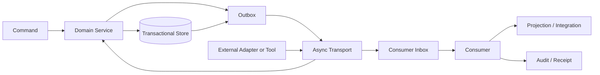

# EVT-001 — Agent OS Event Catalog and Async Contract

> **Status: Approved baseline — 2026-08-13.** This document defines the event model and asynchronous integration contract for Agent OS. It covers event classes, envelopes, identity, workspace scope, ordering, delivery, duplication, idempotency, outbox/inbox patterns, cursors, replay, retention, dead letters, security, privacy, schemas, domain catalogues, API access, projections, observability, and tests. It does not select a final broker, workflow engine, queue, streaming technology, or public webhook platform.

## 1. Purpose

Agent OS uses asynchronous communication to coordinate:

- durable orchestration;
- runs, steps, attempts, jobs, and leases;
- adapters and external runtimes;
- model routing and usage;
- protected tool execution;
- approvals;
- artifacts and previews;
- governed memory;
- audit and receipts;
- usage, cost, and budgets;
- health, maintenance, backup, restore, and recovery;
- Mission Control projections;
- notifications and operational alerts.

This document defines:

- what counts as an event;
- which event classes exist;
- the canonical event envelope;
- how events are created and accepted;
- how events are ordered;
- how duplicates are handled;
- how consumers recover;
- how events are partitioned;
- how event schemas evolve;
- how sensitive content is protected;
- which domain events are initially required;
- how events relate to commands, state, audit, telemetry, and receipts;
- how replay and projections work;
- how failures and dead letters are governed;
- how conformance is tested.

## 2. Core principles

### `EVT-P-001 — Events state facts, not wishes`

An event records something that has occurred or has been accepted as an observation.

Commands request change. Events report accepted facts.

### `EVT-P-002 — Delivery is at least once`

Consumers must expect duplicates.

No exactly-once delivery claim is made.

### `EVT-P-003 — State authority remains explicit`

A raw adapter, provider, tool, or external event does not directly become authoritative platform state.

External observations are normalized and accepted through domain guards.

### `EVT-P-004 — Workspace scope is mandatory`

Every protected event is attributable to one organization and, where applicable, one workspace.

### `EVT-P-005 — Ordering is scoped`

No global total order is assumed.

Ordering guarantees, if any, apply to a documented aggregate, stream, or partition.

### `EVT-P-006 — Unknown remains unknown`

Missing sequence, late delivery, event gaps, stale projections, uncertain side effects, and unavailable evidence remain explicit.

### `EVT-P-007 — Events are immutable`

Accepted event records are append-only.

Corrections use new events.

### `EVT-P-008 — Schemas are versioned`

Event meaning, payload, classification, and compatibility are explicit.

### `EVT-P-009 — Sensitive payloads are minimized`

Events contain references rather than large confidential content or raw secrets wherever possible.

### `EVT-P-010 — Replay is governed`

Replay rebuilds permitted state or projections. It does not blindly repeat external effects.

### `EVT-P-011 — Consumers are idempotent`

Every consumer uses event IDs, aggregate versions, inbox records, or equivalent protections.

### `EVT-P-012 — Evidence is preserved`

Correlation, causation, source identity, timestamps, schema versions, and limitations remain traceable.

## 3. Non-goals

This contract does not:

- select Kafka, RabbitMQ, NATS, Redis Streams, database polling, or another implementation;
- guarantee global ordering;
- guarantee exactly-once processing;
- use events as a substitute for authorization;
- allow events to approve actions;
- put raw secrets into payloads;
- define a public event marketplace;
- expose anonymous webhooks;
- replay production or financial effects;
- define complete observability telemetry;
- replace audit records;
- make read models authoritative;
- allow a client to publish arbitrary domain events.

## 4. Event classes

Agent OS distinguishes:

```text
domain_event
integration_event
external_observation
audit_event
notification_event
projection_event
operational_event
security_event
telemetry_signal
```

Commands are not events.

## 5. Domain events

A domain event records an accepted state change or fact inside one bounded context.

Examples:

```text
RunCreated
ApprovalConsumed
ArtifactAccepted
MemoryRecordVerified
BudgetReservationCreated
```

Domain events are emitted only after domain invariants pass.

## 6. Integration events

An integration event communicates a stable fact to another component or bounded context.

A domain event and integration event may:

- be the same stored event;
- or be separate representations;
- or be transformed through an anti-corruption layer.

The chosen pattern requires an ADR.

## 7. External observations

External observations report what an adapter, provider, tool, filesystem, Git repository, or external service claims or exposes.

Examples:

```text
AdapterRunReportedCompleted
ProviderUsageReported
GitReferenceObserved
ExternalMessageProviderAccepted
```

External observations:

- are source-labelled;
- may be stale, duplicated, incomplete, or wrong;
- do not bypass domain transition guards;
- may trigger reconciliation.

## 8. Audit events

Audit events preserve security- and governance-relevant actions.

Examples:

```text
RoleAssignmentGranted
ApprovalDecisionRecorded
ArtifactExportAuthorized
EmergencyStopReleased
```

Audit events may overlap with domain events but have distinct retention, audience, and evidence requirements.

## 9. Notification events

Notification events request or record delivery of user-facing information.

Examples:

```text
ApprovalNotificationRequested
RunAttentionRequired
BackupFailedNotificationRequested
```

A notification event does not prove that a person saw or acted on the notification.

## 10. Projection events

Projection events assist derived read models.

They are rebuildable and non-authoritative.

Examples:

```text
RunSummaryProjectionUpdated
ArtifactSearchIndexRequested
CostDashboardProjectionInvalidated
```

## 11. Operational events

Operational events describe platform operation.

Examples:

```text
ComponentHealthChanged
WorkerLeaseExpired
BackupOperationFailed
RecoveryScanCompleted
```

## 12. Security events

Security events describe security-relevant detections or controls.

Examples:

```text
CrossWorkspaceAccessDenied
ApprovalReplayDetected
SecretExposureSuspected
EmergencyStopActivated
ArtifactQuarantined
```

## 13. Telemetry signals

Metrics, logs, and traces are telemetry, not necessarily durable domain events.

Telemetry may be sampled, aggregated, or expire sooner.

A telemetry signal cannot replace required audit or domain evidence.

## 14. Event architecture



## 15. Canonical event envelope

Every accepted event uses a canonical envelope.

| Field | Type | Required |
|---|---|---:|
| `event_id` | `opaque_id` | Yes |
| `event_type` | `short_text` | Yes |
| `event_version` | `version_string` | Yes |
| `schema_version` | `version_string` | Yes |
| `event_class` | `enum_code` | Yes |
| `organization_id` | `opaque_id` | Yes |
| `workspace_id` | `opaque_id` | Conditional |
| `project_id` | `opaque_id` | Optional |
| `aggregate_type` | `short_text` | Conditional |
| `aggregate_id` | `opaque_id` | Conditional |
| `aggregate_version` | `count` | Conditional |
| `stream_id` | `short_text` | Optional |
| `stream_sequence` | `count` | Optional |
| `partition_key` | `short_text` | Yes |
| `correlation_id` | `opaque_id` | Yes |
| `causation_id` | `opaque_id` | Optional |
| `command_id` | `opaque_id` | Optional |
| `actor_identity_id` | `opaque_id` | Optional |
| `actor_identity_type` | `identity_type` | Optional |
| `source_component` | `short_text` | Yes |
| `source_instance_id` | `short_text` | Optional |
| `occurred_at` | `timestamp_utc` | Yes |
| `recorded_at` | `timestamp_utc` | Yes |
| `published_at` | `timestamp_utc` | Optional |
| `classification` | `classification_code` | Yes |
| `data_subject_references` | `json_array` | Optional |
| `payload` | `json_object` | Conditional |
| `payload_reference` | `source_reference` | Conditional |
| `content_hash` | `content_hash` | Yes |
| `trace_context` | `json_object` | Optional |
| `extensions` | `json_object` | Optional |

At least one of `payload` or `payload_reference` is required unless the event type explicitly has an empty payload.

## 16. Event identity

`event_id` uniquely identifies one logical event.

Rules:

1. The ID is immutable.
2. A redelivery retains the same event ID.
3. A correction uses a new event ID.
4. A derived event uses a new event ID and causation reference.
5. Producer retry must not generate a new event ID for the same committed event.
6. Consumer deduplication uses the event ID or a documented equivalent.

## 17. Event type naming

Recommended event type format:

```text
<Domain><PastTenseFact>
```

Examples:

```text
RunCreated
RunCancelled
ApprovalConsumed
ArtifactVersionFinalized
MemoryRecordSuperseded
```

Avoid:

```text
DoRun
ProcessArtifact
HandleApproval
RunUpdate
SomethingChanged
```

Names express a stable fact.

## 18. Event version

`event_version` versions the semantic event type.

Examples:

```text
RunCreated@1.0.0
RunCreated@2.0.0
```

A breaking semantic change requires a new major version or a new event type.

## 19. Schema version

`schema_version` identifies the envelope/payload schema format.

Envelope and event semantic versions may evolve separately.

Consumers must validate both.

## 20. Aggregate identity and version

Domain events normally include:

- aggregate type;
- aggregate ID;
- aggregate version.

`aggregate_version`:

- is monotonic within one aggregate;
- supports ordering and concurrency checks;
- is not a global event sequence;
- may reveal gaps;
- does not authorize applying a transition without domain validation.

## 21. Stream identity

A stream is a logical ordered grouping.

Examples:

```text
run:{run_id}
approval:{approval_request_id}
artifact:{artifact_id}
workspace:{workspace_id}:audit
adapter:{agent_registration_id}
```

Stream design requires an ADR.

## 22. Stream sequence

Where supported, `stream_sequence` is monotonic within one stream.

A missing sequence may indicate:

- consumer lag;
- delayed publication;
- retention;
- gap;
- incompatible producer;
- lost or quarantined event.

Consumers must not fabricate missing events.

## 23. Partition key

Partitioning direction:

| Event category | Suggested key |
|---|---|
| Run lifecycle | `run_id` |
| Approval lifecycle | `approval_request_id` |
| Artifact lifecycle | `artifact_id` |
| Memory lifecycle | `memory_record_id` |
| Workspace governance | `workspace_id` |
| Adapter session | `agent_registration_id` or external session |
| Budget | `budget_id` |
| Backup/restore | operation ID |

Partition keys:

- preserve local ordering where transport supports it;
- avoid raw secrets or sensitive content;
- remain stable for one aggregate;
- do not replace workspace authorization.

## 24. Correlation

`correlation_id` groups one business flow.

Examples:

```text
user request
→ task snapshot
→ run
→ approval
→ protected action
→ artifact
→ receipt
```

All related events retain the correlation ID where practical.

## 25. Causation

`causation_id` identifies the command or event that caused the current event.

Examples:

```text
CancelRun command
→ RunCancellationRequested event

ApprovalConsumed event
→ ToolExecutionAuthorized event
```

Causation chains support investigation and receipt generation.

## 26. Actor identity

Events distinguish:

- human actor;
- workload identity;
- agent identity;
- adapter identity;
- worker identity;
- system scheduler;
- external source.

An agent or adapter actor does not imply human authority.

## 27. Time semantics

Event times:

- `occurred_at`: when the fact occurred according to the source;
- `recorded_at`: when Agent OS durably accepted/recorded it;
- `published_at`: when it entered the async transport.

These times may differ.

External clock uncertainty is preserved.

## 28. Classification

Event classification reflects the highest relevant classification of:

- payload;
- payload reference;
- target;
- evidence;
- data subjects;
- policy reason;
- artifact or memory link.

Classification controls:

- transport;
- retention;
- consumer eligibility;
- logging;
- replay;
- export;
- UI visibility.

## 29. Payload minimization

Event payloads should prefer:

- identifiers;
- stable codes;
- hashes;
- bounded summaries;
- references;
- state transitions;
- reason codes.

Avoid:

- full documents;
- full prompts;
- full model outputs;
- raw diffs where not required;
- raw secret values;
- large binary content;
- unrestricted stack traces.

Large content belongs in protected artifact/evidence storage.

## 30. Payload references

A payload reference includes:

- reference type;
- resource ID;
- version;
- classification;
- integrity;
- expiry where relevant;
- access scope.

A reference is not a public URL.

## 31. Event integrity

Each event has a content hash over canonical envelope fields and payload/reference.

Integrity validation may include:

- canonical serialization;
- hash verification;
- producer signature where selected;
- transport checksum;
- event-store integrity;
- sequence/version checks.

Final cryptographic profile requires an ADR.

## 32. Event immutability

Accepted events are not edited.

Corrections use:

```text
<EventName>Corrected
<EventName>Superseded
<EventName>Invalidated
```

or a domain-specific correction event.

The original remains available according to retention and classification.

## 33. Commands versus events

Commands:

```text
CreateRun
CancelRun
ApproveRequest
FinalizeArtifactVersion
```

Events:

```text
RunCreated
RunCancellationRequested
ApprovalApproved
ArtifactVersionFinalized
```

A command may:

- succeed and produce one or more events;
- be rejected without a domain event;
- return an existing idempotent result;
- produce an audit denial event where policy requires.

## 34. Observation versus accepted domain fact

Example:

```text
AdapterRunReportedCompleted
```

does not automatically mean:

```text
RunCompleted
```

The control plane may require:

- state guard;
- output validation;
- artifact acceptance;
- usage/cost recording;
- side-effect reconciliation;
- finalization.

Only then may `RunCompleted` be emitted.

## 35. Delivery semantics

The default contract is:

```text
at_least_once
```

Implications:

- duplicate delivery is normal;
- consumer processing is idempotent;
- producer publication may retry;
- acknowledgements do not prove downstream business success;
- event replay is distinct from external-effect replay.

## 36. Producer guarantees

A compliant producer must:

1. create an event only after domain acceptance;
2. assign stable event ID;
3. persist event or outbox atomically with state change;
4. preserve event content across publication retries;
5. publish in bounded retries;
6. expose publication failure;
7. not silently drop events;
8. preserve classification and workspace scope;
9. avoid raw secrets;
10. support recovery scanning.

## 37. Transactional outbox

For state-changing domain events:

```text
begin transaction
→ mutate aggregate
→ append event/outbox record
→ commit
→ outbox publisher sends
→ mark publication state
```

The state and event intent are committed together.

## 38. Outbox record

Fields:

| Field | Required |
|---|---:|
| `outbox_record_id` | Yes |
| `event_id` | Yes |
| `aggregate_id` | Conditional |
| `partition_key` | Yes |
| `payload_reference` or payload | Yes |
| `state` | Yes |
| `available_at` | Yes |
| `attempt_count` | Yes |
| `last_attempt_at` | Optional |
| `last_error_code` | Optional |
| `published_at` | Optional |
| `version` | Yes |

States:

```text
pending
publishing
published
retry_scheduled
failed
dead_letter
cancelled
```

## 39. Outbox recovery

Recovery scans:

- pending records;
- expired publisher leases;
- publishing records without acknowledgement;
- failed records;
- schema-invalid records;
- publication gaps.

A publication retry retains the same `event_id`.

## 40. Consumer inbox

Every stateful consumer maintains an inbox or equivalent deduplication store.

Inbox record:

| Field | Required |
|---|---:|
| `consumer_id` | Yes |
| `event_id` | Yes |
| `event_type` | Yes |
| `received_at` | Yes |
| `processing_state` | Yes |
| `processed_at` | Optional |
| `result_reference` | Optional |
| `last_error_code` | Optional |
| `attempt_count` | Yes |

Unique key:

```text
consumer_id + event_id
```

## 41. Consumer processing states

```text
received
validating
processing
processed
ignored_duplicate
ignored_irrelevant
retry_scheduled
failed
dead_letter
quarantined
```

## 42. Consumer algorithm

```text
receive event
→ authenticate/validate source if applicable
→ validate schema/version
→ validate workspace/classification eligibility
→ check inbox duplicate
→ check ordering/version preconditions
→ process idempotently
→ persist consumer state and resulting events
→ acknowledge transport
```

## 43. Duplicate handling

On duplicate:

- do not repeat business effect;
- return/record original processing result;
- increment duplicate metric;
- preserve original event time;
- do not create a new domain event unless a separate anomaly event is warranted.

## 44. Ordering

Ordering types:

```text
none
best_effort
partition_ordered
stream_ordered
aggregate_versioned
```

Every event type or channel documents its ordering profile.

## 45. Aggregate ordering

For domain aggregates:

- `aggregate_version` is primary;
- lower/equal processed versions are duplicate or stale;
- next version may be applied;
- gaps trigger wait, fetch, replay, or reconciliation;
- later events do not overwrite missing earlier state blindly.

## 46. Out-of-order handling

Possible outcomes:

```text
buffer
retry_later
request_replay
rebuild_projection
quarantine
ignore_stale
reconcile
```

The strategy depends on event type and consumer.

Protected domain consumers fail safely rather than infer missing transitions.

## 47. Event gaps

A gap is detected through:

- aggregate version;
- stream sequence;
- cursor discontinuity;
- missing causation;
- projection checksum;
- source reconciliation.

Gap state:

```text
suspected
confirmed
resolved
unresolvable
unknown
```

Gaps are visible in operations and receipts where material.

## 48. Late events

A late event may be:

- accepted and applied if still valid;
- accepted for audit only;
- ignored as superseded;
- used for reconciliation;
- quarantined due to conflict.

Event occurrence time alone does not override aggregate version.

## 49. Replay

Replay types:

```text
projection_rebuild
consumer_recovery
audit_reconstruction
test_replay
migration_replay
incident_investigation
```

Replay never means blindly invoking external adapters/tools.

## 50. Replay invariants

1. Replay uses stored events, not rewritten events.
2. External side effects remain disabled unless a separate governed command authorizes them.
3. Consumers declare replay-safe behavior.
4. Replay has scope, time range, reason, operator, and evidence.
5. Replay can be paused/cancelled.
6. Replay events or results are distinguishable from original processing.
7. Read-model rebuilds do not emit duplicate notifications by default.
8. Protected consumers may require dry-run mode.
9. Deleted/classified data rules still apply.
10. Replay is audited.

## 51. Replay command object

Fields:

- replay operation ID;
- event source;
- consumer/projection target;
- workspace;
- stream/aggregate/time range;
- event types;
- start cursor;
- dry-run;
- side-effect mode;
- requested by;
- approval reference where needed;
- state;
- result summary.

## 52. Replay states

```text
requested
validating
waiting_for_approval
queued
running
paused
completed
partial
failed
cancelled
unknown
```

## 53. Cursors

A cursor is an opaque position in an event view or stream.

Cursors may encode:

- consumer;
- workspace;
- filters;
- partition;
- sequence/offset;
- retention epoch;
- schema compatibility.

Clients must not parse cursors.

## 54. Cursor rules

- cursor scope is validated;
- filter changes invalidate old cursor;
- expired cursor returns stable error;
- cursor does not grant authorization;
- replay from cursor respects retention and classification;
- cursor gaps remain explicit.

## 55. Event retention

Retention depends on event class.

Possible classes:

```text
transient_integration
operational_short
projection_rebuild
domain_history
audit_evidence
security_evidence
receipt_support
backup_recovery
hold
```

Exact durations remain unapproved.

## 56. Retention principles

- domain/audit evidence generally outlives transient delivery data;
- payload references may outlive transport records;
- secrets are not retained;
- personal data is minimized;
- legal/contractual holds are represented;
- deletion must consider events, projections, artifacts, backups, and exports;
- replay capability is limited by retained history.

## 57. Event deletion and redaction

Immutable event history may require privacy-preserving treatment.

Potential approaches:

- payload minimization from creation;
- references to deletable content;
- cryptographic erasure where selected;
- redaction events;
- tombstones;
- restricted access;
- retention expiry;
- legal hold.

Direct in-place mutation of accepted events is not the default.

## 58. Dead-letter handling

An event enters dead letter when bounded processing cannot continue.

Reasons:

```text
schema_invalid
unsupported_version
authorization_scope_invalid
classification_violation
consumer_bug
dependency_unavailable_exhausted
poison_payload
ordering_gap_unresolved
integrity_failure
unknown_event_type
processing_limit_exceeded
```

## 59. Dead-letter record

Fields:

- dead-letter ID;
- event ID;
- consumer;
- workspace;
- reason;
- first/last failure;
- attempt count;
- error codes;
- payload reference;
- classification;
- remediation owner;
- state;
- resolution.

States:

```text
open
under_investigation
retry_scheduled
resolved_replayed
resolved_ignored
quarantined
expired
unknown
```

## 60. Poison-event handling

A poison event repeatedly crashes or fails a consumer.

Controls:

- schema validation before business handling;
- resource limits;
- bounded attempts;
- circuit breaker;
- quarantine;
- no infinite hot loop;
- operator visibility;
- safe diagnostic extraction;
- replay only after remediation.

## 61. Retry policy

Async retry policy includes:

- retryable error classes;
- maximum attempts;
- maximum elapsed time;
- backoff;
- jitter;
- retry-after;
- circuit breaker;
- dead-letter threshold.

Non-retryable:

- invalid schema;
- unsupported breaking version;
- workspace scope violation;
- integrity failure;
- prohibited classification;
- deterministic domain rejection.

## 62. Backpressure

Backpressure controls:

- bounded queues;
- consumer concurrency;
- per-workspace fair scheduling;
- rate limiting;
- producer throttling;
- payload-size limits;
- low-priority deferral;
- alerting;
- no silent event loss.

## 63. Consumer groups

A consumer group represents one logical processing function.

Examples:

```text
run_projection
artifact_indexer
approval_notifier
cost_reconciler
audit_receipt_builder
operations_alerting
```

Within a group, one logical event is processed once idempotently, despite redelivery.

## 64. Consumer ownership

Each consumer has:

- owner;
- purpose;
- subscribed event types;
- schema versions;
- classification ceiling;
- workspace scope;
- retry/dead-letter policy;
- replay behavior;
- side-effect profile;
- observability;
- runbook.

## 65. Projection architecture

Projections derive views such as:

- Mission Control run summary;
- approval queue;
- artifact catalogue;
- workspace health;
- cost dashboard;
- audit timeline;
- search indexes.

Projections are rebuildable and expose freshness.

## 66. Projection record requirements

Projection records should include:

- source cursor;
- last event ID;
- last aggregate version;
- projected at;
- freshness;
- rebuild state;
- error state;
- workspace;
- schema version.

## 67. Projection states

```text
current
lagging
stale
rebuilding
partial
failed
unavailable
unknown
```

Mission Control must not present a stale projection as authoritative current state.

## 68. Projection rebuild

Rebuild steps:

```text
validate scope
→ select source/cursor
→ create isolated rebuild target
→ replay safely
→ validate counts/checksums
→ atomically switch projection
→ retain prior target temporarily
→ audit
```

External notifications and effects are disabled during rebuild.

## 69. Event schema registry

The system should maintain a controlled registry containing:

- event type;
- semantic version;
- envelope schema;
- payload schema;
- owner;
- producer;
- consumers;
- classification;
- ordering;
- partition key;
- retention;
- examples;
- compatibility;
- deprecation;
- test fixtures.

Final registry technology requires ADR.

## 70. Compatibility categories

```text
backward_compatible
forward_compatible
fully_compatible
breaking
unknown
```

Compatibility is evaluated for documented consumer behavior.

## 71. Compatible changes

Potentially compatible:

- optional additive field;
- new extension namespace;
- additional non-breaking metadata;
- new event type;
- new optional reason code where consumer treats unknown safely.

## 72. Breaking changes

Breaking:

- required field removal/rename;
- semantic meaning change;
- state meaning change;
- partition-key change;
- ordering guarantee change;
- classification weakening;
- payload-reference behavior change;
- enum closure change where unknown is not allowed;
- side-effect meaning change.

Breaking changes require new major version and migration.

## 73. Event deprecation

A deprecated event version includes:

- replacement;
- producer migration;
- consumer migration;
- deprecation date;
- removal date/version;
- replay compatibility;
- retained history behavior;
- test coverage.

Old retained events remain interpretable.

## 74. Upcasting and transformation

A consumer may use versioned upcasters for old events.

Upcasting rules:

- deterministic;
- side-effect free;
- versioned;
- testable;
- preserves source event ID;
- records transformed schema version;
- never fabricates unknown data;
- exposes transformation limitations.

## 75. AsyncAPI direction

A machine-readable asynchronous contract may use AsyncAPI or another selected specification.

This is a candidate, not yet adopted.

The contract should generate or maintain:

- channels;
- messages;
- schemas;
- examples;
- security profiles;
- bindings;
- producer/consumer ownership.

## 76. Domain catalogue — identity and access

Initial event types:

```text
IdentityCreated
IdentityDisabled
IdentityRevoked
SessionCreated
SessionReauthenticated
SessionExpired
SessionRevoked
WorkspaceMembershipGranted
WorkspaceMembershipUpdated
WorkspaceMembershipSuspended
WorkspaceMembershipRevoked
RoleAssignmentGranted
RoleAssignmentUpdated
RoleAssignmentRevoked
DelegatedAuthorityIssued
DelegatedAuthorityRevoked
AuthenticationFailed
AuthorizationDenied
ReauthenticationRequired
```

## 77. Identity event rules

- identity/session events may be confidential;
- raw credentials are prohibited;
- denial events minimize target disclosure;
- role and authority changes are strongly ordered per assignment;
- revocation events receive high-priority processing;
- approval eligibility projections consume current authority events.

## 78. Domain catalogue — organization, workspace, and project

```text
OrganizationCreated
OrganizationSuspended
OrganizationArchived
WorkspaceCreated
WorkspaceUpdated
WorkspaceSetReadOnly
WorkspaceSuspended
WorkspaceArchived
WorkspacePolicyProfileChanged
WorkspaceClassificationChanged
ProjectCreated
ProjectUpdated
ProjectPaused
ProjectArchived
```

## 79. Workspace event rules

- workspace ID is partition key for governance streams where practical;
- classification decrease requires governed evidence;
- suspension/read-only events gate run dispatch;
- archival does not delete historical events;
- policy-profile change may invalidate approvals/capabilities.

## 80. Domain catalogue — agent and adapter registry

```text
AgentRegistrationCreated
AgentRegistrationUpdated
AdapterConfigurationChanged
AdapterValidationStarted
AdapterValidationCompleted
AdapterValidationFailed
AdapterCompatibilityChanged
AdapterHealthChanged
AdapterReadinessChanged
AdapterDisabled
AdapterRevoked
AdapterRetired
AdapterExternalSessionObserved
AdapterCapabilityDriftDetected
```

## 81. Adapter event rules

- adapter reports are external observations until accepted;
- actual adapter/runtime version is source-labelled;
- readiness changes include reason/freshness;
- revocation blocks new dispatch;
- session observations link to run/step/attempt where known.

## 82. Domain catalogue — capabilities

```text
CapabilityDeclarationReceived
CapabilityValidationStarted
CapabilityValidated
CapabilityPartiallyValidated
CapabilityValidationFailed
CapabilityDriftDetected
CapabilityDeprecated
CapabilityDisabled
CapabilityRevoked
WorkspaceCapabilityEnablementRequested
WorkspaceCapabilityEnabled
WorkspaceCapabilityEnabledWithLimits
WorkspaceCapabilitySuspended
WorkspaceCapabilityRevoked
CapabilityReadinessChanged
```

## 83. Capability event rules

- declaration does not imply validation;
- validation event links evidence;
- enablement does not imply authorization;
- material drift invalidates readiness;
- prohibited capabilities cannot emit successful enablement.

## 84. Domain catalogue — models and providers

```text
ModelProfileCreated
ModelProfileUpdated
ModelProfileValidated
ModelProfileDisabled
ModelProfileDeprecated
ProviderBindingCreated
ProviderBindingValidated
ProviderBindingHealthChanged
ProviderBindingQuotaChanged
ProviderBindingRateLimited
ProviderBindingRevoked
ModelRoutingRequested
ModelRoutingSelected
ModelRoutingBlocked
ModelFallbackProposed
ModelFallbackApproved
ModelFallbackApplied
ModelFallbackDenied
ModelInvocationStarted
ModelIdentityObserved
ModelUsageObserved
ModelOutputTruncated
ModelStructuredOutputInvalid
ModelMetadataDriftDetected
PricingProfileCreated
PricingProfileUpdated
PricingProfileDeprecated
```

## 85. Model event rules

- logical, configured, selected, and actual identity remain separate;
- fallback is explicit;
- unknown model identity remains unknown;
- usage/cost source is labelled;
- full prompts/outputs belong in protected references;
- provider metadata changes may trigger security/data review.

## 86. Domain catalogue — tasks

```text
TaskCreated
TaskUpdated
TaskMarkedReady
TaskBlocked
TaskCompleted
TaskCancelled
TaskArchived
TaskSnapshotCreated
TaskSnapshotIntegrityValidated
TaskSnapshotIntegrityFailed
```

## 87. Task event rules

- snapshot events reference immutable content hash;
- existing runs do not follow later task edits;
- task completion does not imply all runs succeeded;
- archive does not remove run history.

## 88. Domain catalogue — runs

```text
RunCreated
RunQueued
RunPreflightStarted
RunPreflightPassed
RunBlocked
RunStarting
RunStarted
RunWaitingForApproval
RunWaitingForResource
RunWaitingForAdapter
RunWaitingForBudget
RunPaused
RunResumeRequested
RunResumed
RunRetryScheduled
RunCancellationRequested
RunCancelling
RunCancelled
RunBecameStale
RunStateBecameUnknown
RunReconciled
RunCompleted
RunFailed
RunArchived
RunReceiptRequested
RunReceiptGenerated
RunReceiptFailed
```

## 89. Run event rules

- event aggregate version follows run transitions;
- raw adapter state does not directly emit `RunCompleted`;
- `RunCompleted` requires completion criteria;
- `RunCancelled` does not imply rollback;
- unknown/stale transitions include last reliable evidence;
- terminal run events do not reopen the run.

## 90. Domain catalogue — steps and attempts

```text
StepPlanned
StepReady
StepLeased
StepStarted
StepWaiting
StepRetryScheduled
StepPaused
StepCompleted
StepFailed
StepCancelled
StepSkipped
StepBecameStale
StepStateBecameUnknown
AttemptCreated
AttemptLeased
AttemptDispatched
AttemptAcknowledged
AttemptHeartbeatReceived
AttemptSucceeded
AttemptFailed
AttemptTimedOut
AttemptCancellationRequested
AttemptCancelled
AttemptLost
AttemptStateBecameUnknown
SideEffectObserved
SideEffectCertaintyChanged
```

## 91. Attempt event rules

- attempts are append-only;
- duplicate dispatch is idempotently detected;
- heartbeat events may be sampled or summarized;
- side-effect certainty changes preserve prior observations;
- unknown protected effects trigger reconciliation, not blind retry.

## 92. Domain catalogue — jobs and leases

```text
DurableJobCreated
DurableJobScheduled
DurableJobAvailable
DurableJobLeased
DurableJobStarted
DurableJobCompleted
DurableJobRetryScheduled
DurableJobDeadLettered
DurableJobCancelled
DurableJobExpired
WorkerRegistered
WorkerHealthChanged
WorkerLeaseAcquired
WorkerLeaseHeartbeatReceived
WorkerLeaseExpired
WorkerLeaseReleased
WorkerLeaseRevoked
WorkerFencingConflictDetected
```

## 93. Job event rules

- job delivery may duplicate;
- lease events use fencing tokens;
- expired lease does not prove no external effect;
- dead-letter events include remediation owner;
- high-frequency heartbeat events may use operational retention.

## 94. Domain catalogue — approvals

```text
ApprovalRequestCreated
ApprovalReviewStarted
ApprovalApproved
ApprovalRejected
ApprovalRevisionRequested
ApprovalExpired
ApprovalInvalidated
ApprovalCancelled
ApprovalSuperseded
ApprovalConsumed
ApprovalConsumptionFailed
ApprovalReplayDetected
StandingApprovalGrantCreated
StandingApprovalGrantActivated
StandingApprovalGrantUsed
StandingApprovalGrantSuspended
StandingApprovalGrantRevoked
StandingApprovalGrantExpired
MultiApprovalPartiallySatisfied
MultiApprovalCompleted
```

## 95. Approval event rules

- human identity and authority snapshot are referenced;
- raw approval tokens do not exist in payloads;
- fingerprint is included or referenced;
- one consumption event per approved request;
- replay attempts emit security evidence;
- decision and execution result remain separate.

## 96. Domain catalogue — artifacts

```text
ArtifactProposed
ArtifactStagingStarted
ArtifactStagingProgressed
ArtifactStagingExpired
ArtifactVersionFinalized
ArtifactStored
ArtifactBecamePartial
ArtifactIntegrityValidated
ArtifactIntegrityFailed
ArtifactValidationStarted
ArtifactValidationPassed
ArtifactValidationFailed
ArtifactQuarantined
ArtifactReleasedFromQuarantine
ArtifactPreviewRequested
ArtifactPreviewGenerated
ArtifactPreviewBlocked
ArtifactReviewRequested
ArtifactReviewStarted
ArtifactAccepted
ArtifactAcceptedWithLimitations
ArtifactRejected
ArtifactRevisionRequested
ArtifactVersionCreated
ArtifactSuperseded
ArtifactArchived
ArtifactDeletionRequested
ArtifactDeletionBlocked
ArtifactDeleted
ArtifactExportRequested
ArtifactExportCompleted
ArtifactExportFailed
ArtifactImported
ArtifactReclassified
ArtifactRecoveryRequired
ArtifactReconciled
ArtifactBecameUnavailable
```

## 97. Artifact event rules

- large content uses references;
- progress events are bounded/sampled;
- classification and version ID are mandatory;
- acceptance is version- and purpose-specific;
- quarantine events are security-relevant;
- deletion events preserve tombstone/evidence references.

## 98. Domain catalogue — memory

```text
MemoryRecordProposed
MemoryRecordCreated
MemoryVersionCreated
MemoryRecordVerified
MemoryRecordDisputed
MemoryConflictDetected
MemoryRecordSuperseded
MemoryRecordExpired
MemoryDeletionRequested
MemoryRecordDeleted
MemoryIndexingRequested
MemoryIndexed
MemoryIndexingFailed
MemoryRetrievalPerformed
MemoryCorrectionRecorded
MemoryReconciliationRequired
MemoryReconciled
```

## 99. Memory event rules

- memory authority/source is explicit;
- retrieval events minimize query/content;
- verified facts require eligible authority;
- conflicts remain visible;
- deletion propagates to indexes and caches;
- agent proposal does not imply verification.

## 100. Domain catalogue — audit and receipts

```text
AuditEventRecorded
AuditGapDetected
AuditGapResolved
ExecutionReceiptRequested
ExecutionReceiptGenerated
ExecutionReceiptGeneratedPartial
ExecutionReceiptGenerationFailed
EvidenceExportRequested
EvidenceExportWaitingForApproval
EvidenceExportCompleted
EvidenceExportFailed
EvidenceManifestGenerated
```

## 101. Audit event rules

- audit events are append-only;
- sensitive payload may use restricted references;
- gap events are visible in receipts;
- receipt events distinguish complete, partial, and failed;
- evidence export events identify exact scope and destination.

## 102. Domain catalogue — usage, cost, and budget

```text
UsageObserved
UsageDeduplicated
UsageReconciliationStarted
UsageReconciled
UsageMismatchDetected
CostEstimated
CostCalculated
CostProviderReported
CostInvoiceRecorded
CostReconciled
CostMismatchDetected
BudgetCreated
BudgetUpdated
BudgetWarningThresholdReached
BudgetHardLimitReached
BudgetReservationRequested
BudgetReserved
BudgetReservationReleased
BudgetReservationConsumed
BudgetReservationExpired
BudgetSuspended
BudgetClosed
```

## 103. Cost event rules

- unknown cost is not zero;
- every event preserves source class and currency;
- estimates do not overwrite provider invoice data;
- duplicate usage is explicitly handled;
- budget events are strongly ordered per budget aggregate.

## 104. Domain catalogue — tools and integrations

```text
ToolActionProposed
ToolActionNormalized
ToolActionPolicyEvaluated
ToolActionWaitingForApproval
ToolActionAuthorized
ToolActionDispatched
ToolActionAcknowledged
ToolActionCompleted
ToolActionFailed
ToolActionBecameUnknown
ToolActionReconciled
IntegrationHealthChanged
IntegrationRateLimited
IntegrationCredentialReferenceInvalidated
ExternalObservationReceived
ExternalObservationRejected
```

## 105. Tool event rules

- protected actions require policy and approval before dispatch;
- normalized target/fingerprint references are retained;
- tool output does not directly set domain state;
- unknown effects block automatic retry;
- raw credentials are prohibited.

## 106. Domain catalogue — operations

```text
ComponentRegistered
ComponentHealthChanged
ComponentReadinessChanged
MaintenanceWindowCreated
MaintenanceWindowStarted
MaintenanceWindowCompleted
MaintenanceWindowCancelled
EmergencyStopActivated
EmergencyStopReleased
BackupOperationRequested
BackupOperationStarted
BackupOperationCompleted
BackupOperationFailed
BackupVerificationStarted
BackupVerified
BackupVerificationFailed
RestoreOperationRequested
RestoreOperationValidated
RestoreOperationStarted
RestoreOperationCompleted
RestoreOperationFailed
RecoveryScanStarted
RecoveryIssueDetected
RecoveryActionScheduled
RecoveryActionCompleted
RecoveryActionFailed
MigrationValidationStarted
MigrationValidated
MigrationExecutionStarted
MigrationExecutionCompleted
MigrationExecutionFailed
```

## 107. Operations event rules

- emergency stop events are high priority;
- restore events link exact backup manifest and approval;
- recovery events never imply blind replay;
- health events include observed time and freshness;
- backup completion includes integrity/manifest state.

## 108. Domain catalogue — security

```text
SecurityPolicyDeniedAction
CrossWorkspaceAccessDenied
SecretExposureSuspected
SecretReferenceRevoked
CredentialValidationFailed
ApprovalReplayDetected
TargetSubstitutionDetected
SuspiciousAdapterBehaviorDetected
ArtifactSecurityFindingDetected
ArtifactQuarantined
EventIntegrityFailureDetected
EventSchemaViolationDetected
EventSourceAuthenticationFailed
EmergencyStopActivated
SecurityIncidentOpened
SecurityIncidentUpdated
SecurityIncidentClosed
```

## 109. Security event rules

- sensitive detail may be restricted to security audience;
- client-facing errors need not reveal full event payload;
- security events link correlation and source evidence;
- security events cannot contain raw secrets;
- security event retention is governed separately.

## 110. External adapter event profile

Adapters may publish or expose normalized observations such as:

```text
AdapterRunAccepted
AdapterRunStarted
AdapterRunProgressed
AdapterRunWaiting
AdapterRunPaused
AdapterToolActionProposed
AdapterArtifactProposed
AdapterCheckpointAvailable
AdapterUsageObserved
AdapterModelObserved
AdapterWarning
AdapterRunCancellationAcknowledged
AdapterRunCancelled
AdapterRunCompleted
AdapterRunFailed
AdapterRunStateUnknown
AdapterEventGapDetected
AdapterCapabilityChanged
AdapterHealthChanged
```

These are adapter observations, not necessarily control-plane domain events.

## 111. Adapter event envelope extensions

Adapter events may include:

- adapter registration ID;
- adapter instance ID;
- external session ID;
- adapter/runtime version;
- external sequence/cursor;
- provider request ID;
- reported state;
- side-effect certainty;
- raw evidence reference;
- capability code/version;
- limitations.

## 112. Adapter event acceptance

Acceptance steps:

```text
authenticate adapter
→ validate registration/readiness
→ validate workspace/run binding
→ validate schema/version
→ deduplicate external event
→ preserve raw evidence reference
→ normalize
→ apply domain guard
→ emit accepted domain/integration event
```

## 113. Tool Gateway event profile

Tool Gateway events must retain:

- normalized action;
- action fingerprint;
- policy decision;
- approval consumption;
- attempt;
- target;
- idempotency key;
- executor identity;
- side-effect certainty;
- result/evidence.

## 114. API event access

Potential endpoints from `API-001`:

```text
GET /events
GET /events/stream
GET /workspaces/{workspace_id}/events
GET /runs/{run_id}/timeline
GET /approval-requests/{id}/timeline
GET /artifacts/{id}/timeline
```

Responses apply classification, workspace, and authority filtering.

## 115. Event query parameters

Potential parameters:

```text
event_type
event_class
workspace_id
aggregate_type
aggregate_id
correlation_id
source_component
occurred_after
occurred_before
recorded_after
classification
cursor
limit
sort
```

Filters are allowlisted and bounded.

## 116. Timeline views

A timeline is a read model combining selected events.

Timeline entries may include:

- timestamp;
- event type;
- human-readable summary;
- source;
- actor;
- state transition;
- evidence link;
- classification;
- confidence/source state.

Timeline summaries are not substitutes for canonical event records.

## 117. SSE profile direction

If server-sent events are selected:

- authenticated connection;
- workspace/event filters bound at open;
- `Last-Event-ID` or cursor support;
- heartbeat comments;
- reconnect;
- bounded buffer;
- no secret payloads;
- disconnect does not cancel runs;
- client handles duplicates.

## 118. WebSocket profile direction

If WebSocket is selected:

- authenticated handshake;
- explicit subscriptions;
- server authorization per subscription;
- bounded subscription count;
- cursor/resume;
- heartbeat;
- backpressure;
- no arbitrary client event publication;
- close/reconnect semantics.

## 119. Polling profile direction

If cursor polling is selected:

```text
GET /events?cursor=...&limit=...
```

Response includes:

- events;
- next cursor;
- retention/gap state;
- server time;
- has more;
- freshness.

Polling may be the initial MVP profile.

## 120. Public webhooks

Public outbound webhooks are deferred.

A future webhook contract would require:

- destination registration;
- authentication/signature;
- secret rotation;
- allowlist;
- retries;
- idempotency;
- replay controls;
- classification restrictions;
- delivery evidence;
- dead-letter handling;
- SSRF controls.

No public anonymous webhook receiver is part of MVP.

## 121. Notification delivery

Notification events may feed:

- in-app notification;
- email;
- calendar or messaging integration in future;
- local desktop notification.

External sends remain controlled actions and may require approval.

## 122. Event security

Security controls include:

- authenticated producers;
- authorized consumers;
- workspace partition/filtering;
- classification enforcement;
- encryption in transit where applicable;
- encrypted storage where selected;
- payload minimization;
- integrity checking;
- source identity;
- replay protection where applicable;
- no raw secrets;
- bounded payloads;
- schema validation;
- rate limiting.

## 123. Producer authentication

A producer must have:

- workload identity;
- allowed event types;
- allowed workspace scope;
- source component identity;
- version;
- credential expiry/rotation;
- audit.

A producer cannot publish human approval decisions unless it is the trusted Approval Service acting from a human-authenticated command.

## 124. Consumer authorization

A consumer declares:

- event types;
- workspace scope;
- classification ceiling;
- purpose;
- retained fields;
- side-effect profile;
- replay behavior.

Consumers receive only the minimum event data required.

## 125. Secret handling

Events may include:

- secret reference ID;
- secret purpose;
- target provider/account;
- validation state.

Events must not include:

- token;
- password;
- private key;
- API key;
- secret environment value;
- credential-bearing URL.

## 126. Prompt injection boundary

Untrusted event payload content cannot:

- assign authority;
- approve;
- expand workspace;
- alter policy;
- change network/filesystem scope;
- disable audit;
- command a consumer outside its contract.

Consumers treat payload text as data.

## 127. Data subject and privacy references

Events involving personal data may include bounded data-subject references.

Rules:

- no unnecessary identity attributes;
- no hidden profiling event stream;
- retention and access are purpose-bound;
- exports remain governed;
- deletion/redaction strategy is documented;
- audit identity retention remains justified.

## 128. Event export

Exporting event history is a separate controlled operation.

It binds:

- workspace;
- event types;
- time range;
- filters;
- payload detail level;
- classification;
- redaction;
- destination;
- manifest;
- approval where required.

## 129. Event export manifest

The manifest includes:

- export ID;
- query/filter snapshot;
- event count;
- cursor/range;
- schemas/versions;
- included/excluded event types;
- hashes;
- classification;
- redaction;
- gaps;
- destination;
- approval;
- creation time.

## 130. Event backup and restore

Backups include, according to architecture:

- domain event store;
- outbox;
- consumer inbox;
- dead letters;
- schema registry;
- cursor/projection checkpoints;
- retention/hold metadata.

Transient transport queues may be rebuildable if durable source exists.

## 131. Restore rules

After restore:

- producer/consumer leases are invalid;
- outbox records are reconciled;
- inbox deduplication is preserved;
- consumed approvals remain consumed;
- deleted artifacts/memory remain governed by tombstones;
- projections are checked/rebuilt;
- external effects are not replayed blindly;
- cursor epochs may change;
- consumers enter recovery mode;
- gaps are reported.

## 132. Disaster recovery

Recovery objectives require:

- event source integrity;
- replayable domain history or authoritative state;
- consumer deduplication state;
- schema availability;
- projection rebuild procedures;
- dead-letter preservation;
- run/approval/artifact reconciliation.

Exact RPO/RTO values belong in operations/BCP documentation.

## 133. Event observability

Metrics may include:

- produced events;
- publication latency;
- outbox backlog;
- publication retries;
- consumer lag;
- consumer processing latency;
- duplicate rate;
- schema validation failure;
- dead-letter count;
- poison event count;
- gap detection;
- replay volume;
- projection freshness;
- cursor expiry;
- unauthorized subscription attempt;
- classification denial;
- event size;
- retained volume.

## 134. Publication latency

Measure:

```text
published_at - recorded_at
```

where available.

Processing latency:

```text
processed_at - published_at
```

End-to-end projection latency:

```text
projection_updated_at - occurred_at
```

Clock/source uncertainty remains explicit.

## 135. Event logs and traces

Event processing logs use:

- event ID;
- event type/version;
- consumer;
- correlation;
- aggregate;
- workspace;
- processing result;
- latency;
- error code.

Logs exclude full sensitive payloads by default.

## 136. Alert conditions

Potential alerts:

- outbox backlog above threshold;
- publication failures;
- consumer lag;
- dead-letter growth;
- security event surge;
- approval event mismatch;
- run-event gap;
- projection stale;
- event integrity failure;
- schema incompatibility;
- restore/replay failure;
- emergency-stop consumer lag.

## 137. Consumer runbooks

Each consumer runbook should define:

- owner;
- purpose;
- dependencies;
- safe pause;
- restart;
- lag diagnosis;
- dead-letter remediation;
- replay procedure;
- side-effect controls;
- rollback/forward-fix;
- metrics;
- known limitations.

## 138. Event testing strategy

### Schema tests

- required envelope fields;
- invalid event type/version;
- payload schema;
- unknown extension;
- content hash;
- classification.

### Producer tests

- state and outbox atomicity;
- stable event ID on retry;
- no event on rejected command;
- classification propagation;
- no secret leakage.

### Consumer tests

- duplicate delivery;
- out-of-order;
- gap;
- unsupported version;
- poison event;
- dependency outage;
- replay;
- restart.

### Security tests

- forged producer;
- wrong workspace;
- over-classified/under-classified payload;
- secret in payload;
- unapproved event type;
- event injection;
- cursor scope theft;
- cross-workspace subscription.

### Recovery tests

- publisher crash;
- consumer crash before/after commit;
- transport outage;
- inbox restore;
- outbox restore;
- projection rebuild;
- cursor epoch change;
- dead-letter replay.

## 139. Event fixtures

Required fixtures include:

- normal domain event;
- duplicate event;
- out-of-order aggregate versions;
- missing sequence;
- stale external observation;
- unsupported major version;
- payload with secret candidate;
- oversized payload;
- corrupted hash;
- wrong workspace;
- unknown event type;
- poison payload;
- dead-letter record;
- replay-marked processing;
- event with payload reference;
- event after restore.

## 140. Contract tests

Contract tests verify:

- producer schema;
- consumer compatibility;
- event names;
- versions;
- partition key;
- ordering profile;
- retention class;
- examples;
- upcasters;
- deprecations;
- AsyncAPI or equivalent output where adopted.

## 141. Concurrency tests

Scenarios:

- two outbox publishers;
- duplicate transport delivery;
- two consumers in same group;
- consumer restart after side effect;
- event arrives during projection rebuild;
- replay concurrent with live traffic;
- event correction versus original late arrival;
- emergency stop event concurrent with dispatch.

## 142. Performance targets

Initial provisional targets:

- accepted platform event propagation p95 ≤ 2 seconds locally;
- common event query p95 ≤ 500 ms for bounded windows;
- duplicate handling p95 ≤ ordinary processing latency;
- projection lag visible before threshold breach;
- bounded event payload size;
- no unbounded consumer memory growth.

Final targets require measurement.

## 143. Capacity direction

The event architecture should support at least:

- 20 workspaces;
- 10,000 runs;
- multiple events per step/attempt;
- 25,000 artifact metadata records;
- multiple adapters;
- 4 active runs;
- 5 concurrent users;
- replay of one workspace without global outage.

## 144. Quality gates

Before MVP acceptance:

1. state change and outbox intent are atomic;
2. event IDs remain stable across retry;
3. duplicate consumer delivery is harmless;
4. unsupported versions fail safely;
5. workspace scope is validated before processing;
6. raw secrets are absent;
7. external observations do not bypass domain guards;
8. aggregate ordering/gaps are handled;
9. dead letters are visible and recoverable;
10. replay cannot repeat protected effects;
11. projection freshness is visible;
12. restore preserves inbox/outbox/approval consumption semantics;
13. event schemas and examples validate;
14. security and cross-workspace negative tests pass;
15. operational metrics and runbooks exist.

## 145. Requirement catalogue

### Envelope and semantics

- `EVT-REQ-ENV-001` — Every event has a stable ID.
- `EVT-REQ-ENV-002` — Event type and versions are explicit.
- `EVT-REQ-ENV-003` — Workspace scope is explicit.
- `EVT-REQ-ENV-004` — Correlation and causation are supported.
- `EVT-REQ-ENV-005` — Occurred, recorded, and published times are distinct.
- `EVT-REQ-ENV-006` — Classification is mandatory.
- `EVT-REQ-ENV-007` — Integrity hash is retained.
- `EVT-REQ-ENV-008` — Large content uses references.

### Delivery and processing

- `EVT-REQ-DLV-001` — Delivery is treated as at least once.
- `EVT-REQ-DLV-002` — Producers preserve event ID on retry.
- `EVT-REQ-DLV-003` — Consumers deduplicate.
- `EVT-REQ-DLV-004` — State and outbox are atomic.
- `EVT-REQ-DLV-005` — Inbox processing is durable.
- `EVT-REQ-DLV-006` — Ordering profile is documented.
- `EVT-REQ-DLV-007` — Gaps are detectable where sequencing exists.
- `EVT-REQ-DLV-008` — Dead letters are governed.

### Replay and recovery

- `EVT-REQ-RPL-001` — Replay is scope- and purpose-bound.
- `EVT-REQ-RPL-002` — Replay does not repeat external effects.
- `EVT-REQ-RPL-003` — Projection rebuilds are isolated.
- `EVT-REQ-RPL-004` — Cursors are opaque and scoped.
- `EVT-REQ-RPL-005` — Restore preserves deduplication state.
- `EVT-REQ-RPL-006` — Outbox/inbox recovery is supported.
- `EVT-REQ-RPL-007` — Replay is audited.
- `EVT-REQ-RPL-008` — Retention limits replay honestly.

### Security and privacy

- `EVT-REQ-SEC-001` — Producers and consumers are authenticated.
- `EVT-REQ-SEC-002` — Event-type and workspace publication are authorized.
- `EVT-REQ-SEC-003` — Raw secrets are prohibited.
- `EVT-REQ-SEC-004` — Payloads are minimized.
- `EVT-REQ-SEC-005` — Classification controls delivery and retention.
- `EVT-REQ-SEC-006` — External observations remain untrusted.
- `EVT-REQ-SEC-007` — Cursor/subscription scope cannot be escalated.
- `EVT-REQ-SEC-008` — Security events preserve restricted evidence.

### Compatibility and operations

- `EVT-REQ-CMP-001` — Event schemas are registered and versioned.
- `EVT-REQ-CMP-002` — Breaking changes require major version/migration.
- `EVT-REQ-CMP-003` — Upcasters are deterministic and tested.
- `EVT-REQ-CMP-004` — Consumer ownership is documented.
- `EVT-REQ-CMP-005` — Consumer lag and dead letters are observable.
- `EVT-REQ-CMP-006` — Projection freshness is exposed.
- `EVT-REQ-CMP-007` — Deprecation preserves old-event interpretability.
- `EVT-REQ-CMP-008` — Runbooks exist for critical consumers.

## 146. Traceability

| Source | EVT-001 response |
|---|---|
| `FR-RUN-*` | Run, step, attempt, job, lease events |
| `FR-APR-*` | Approval lifecycle and consumption |
| `FR-ART-*` | Artifact lifecycle and review |
| `FR-MEM-*` | Memory lifecycle and indexing |
| `FR-AUD-*` | Audit, gaps, receipts, exports |
| `FR-CST-*` | Usage, cost, budget events |
| `FR-OPS-*` | Health, backup, restore, recovery |
| `NFR-REL-*` | Durable delivery, recovery, duplicate handling |
| `NFR-SEC-*` | Source identity, scope, secrets, classification |
| `NFR-OBS-*` | Lag, backlog, dead-letter, projection metrics |
| `ORC-001` | Durable orchestration and outbox/inbox |
| `RUN-001` | Formal lifecycle event catalogue |
| `API-001` | Event access, cursors, streams |
| `THR-001` | Injection, replay, leakage, poisoning threats |

## 147. Mapping to bounded contexts

| Event area | Context |
|---|---|
| Identity/access | `BC-IAM` |
| Workspace/project | `BC-ORG`, `BC-WRK` |
| Agent/model registry | `BC-REG` |
| Run/job/lease | `BC-RUN` |
| Policy/approval | `BC-POL`, `BC-APR` |
| Memory | `BC-MEM` |
| Artifacts | `BC-ART` |
| Audit/receipts | `BC-AUD` |
| Usage/cost/budget | `BC-CST` |
| Operations/recovery | `BC-OPS` |

## 148. Mapping to containers

| Concern | Container |
|---|---|
| Event creation/API | `CTR-002`, domain services |
| Orchestration events | `CTR-003` |
| Adapter observations | `CTR-004`, `CTR-005`, `CTR-006` |
| Model events | `CTR-007` |
| Tool events | `CTR-008`, `CTR-009` |
| Memory/artifact events | `CTR-010`, `CTR-011` |
| Audit/receipts | `CTR-012`, `CTR-019` |
| Cost events | `CTR-013` |
| Operations | `CTR-014`, `CTR-020`, `CTR-021` |
| Transactional/outbox store | `CTR-015` |
| Job/event store | `CTR-016` |
| Projections/indexes | `CTR-018` or derived stores |

## 149. ADR backlog

### `ADR-CANDIDATE-EVT-001 — Event transport and durable source`

Choose database outbox/polling, broker, stream platform, workflow engine integration, or hybrid.

### `ADR-CANDIDATE-EVT-002 — Event schema registry and machine-readable contract`

Choose AsyncAPI or equivalent, schema technology, publication, and compatibility tooling.

### `ADR-CANDIDATE-EVT-003 — Partitioning, ordering, and cursor model`

Define aggregate/stream keys, ordering guarantees, cursor encoding, and retention epochs.

### `ADR-CANDIDATE-EVT-004 — Replay and projection rebuild`

Define replay authorization, side-effect suppression, checkpoints, shadow rebuilds, and cutover.

### `ADR-CANDIDATE-EVT-005 — Event retention, privacy, and deletion`

Define retention classes, payload references, redaction/tombstones, holds, and backup behavior.

## 149A. ADR-003 event envelope refinement

Events concerning conversations, tasks, runs, artifacts, memory, approvals, and policy decisions should include the applicable workspace and resource visibility scope, actor chain, risk class, policy/approval references, retention profile, correlation ID, causation ID, and effect certainty. Event consumers must enforce scope before projection, search indexing, notification, or replay.

## 149B. Conversation event profile

The event catalog must include versioned conversation events:

| Event | Required payload |
|---|---|
| `conversation.created` | conversation ID, workspace, owner, visibility, capture boundary, retention profile |
| `conversation.message_recorded` | conversation ID, message ID, actor chain, provider/adapter, role, correlation, classification |
| `conversation.shared` | conversation ID, share ID, target scope, grantee, expiry, authorizing actor |
| `conversation.share_revoked` | conversation ID, share ID, revocation actor, effective time |
| `conversation.deletion_requested` | conversation ID, requester, retention/hold result, deletion deadline |
| `conversation.deleted` | conversation ID, deletion result, derived-index result, audit reference |

Consumers must authorize before projecting, indexing, notifying, exporting, or replaying conversation events. A private conversation event must never be projected into a broader visibility read model.

## 149C. Project, Task, and Message event profile

Project and Task events use the aggregate identifier as the event subject and always include `workspace_id`, `correlation_id`, `causation_id`, actor chain, aggregate version, and retention/classification metadata. Message events additionally include `conversation_id` and `message_id`; message content is represented by a protected reference, never an unbounded raw payload.

| Event family | Required events |
|---|---|
| Project | `project.created`, `project.updated`, `project.paused`, `project.archived` |
| Task | `task.created`, `task.updated`, `task.ready`, `task.blocked`, `task.completed`, `task.cancelled`, `task.archived`, `task.snapshot_created` |
| Message | `conversation.message_recorded` |

Events are versioned, published after the domain change is durable through the outbox boundary, and consumed at least once. Consumers must be idempotent, enforce workspace/visibility authorization before projection, and retain explicit unknown values rather than substituting empty values.

## 150. Open decisions

1. Which event transport is selected?
2. Is the durable source the transactional database, a broker, or both?
3. Which events are stored as domain history?
4. Which events are transient integration events?
5. Which ordering guarantees are required?
6. Which partition keys are final?
7. Which cursor profile enters MVP?
8. Is polling sufficient initially?
9. Are SSE or WebSocket required?
10. Which event schemas are generated first?
11. Is AsyncAPI adopted?
12. Which consumer inbox strategy is selected?
13. Which outbox publisher lease strategy is selected?
14. Which events are retained permanently?
15. Which payloads use references?
16. Which audit events have stronger retention?
17. Which event exports require approval?
18. Which consumers are replay-safe?
19. Which projections are rebuildable?
20. Which notifications are suppressed during replay?
21. Which dead-letter reasons are auto-retryable?
22. Which event size limits apply?
23. Which heartbeat/progress events are sampled?
24. Which schema changes are compatible?
25. Which public webhook capability remains deferred?

## 151. Risks

| Risk | Consequence | Response |
|---|---|---|
| Exactly-once assumption | Duplicate effects | At-least-once + idempotency |
| State changed without event intent | Missing projections/audit | Transactional outbox |
| New event ID on retry | Duplicate logical facts | Stable event ID |
| Consumer lacks inbox | Duplicate processing | Durable deduplication |
| Global ordering assumed | Incorrect state | Scoped ordering |
| Gap ignored | Corrupted projection | Detection/replay/reconciliation |
| Raw adapter event sets state | Authority bypass | Domain guard |
| Replay invokes tools | Repeated effect | Side-effect suppression |
| Secret in payload | Credential exposure | Reference-only |
| Large payload in broker | Cost/failure/leak | Protected content references |
| Cursor grants access | Cross-workspace leak | Auth per request/subscription |
| Schema evolves silently | Consumer failure | Registry/versioning |
| Poison event loops | Availability loss | Bounded retry/dead letter |
| Dead letter ignored | Silent data loss | Owner/runbook/alerts |
| Projection shown as current | Misleading UI | Freshness state |
| Restore loses inbox | Duplicate effects | Backup dedup state |
| Event deletion breaks evidence | Audit gap | Retention/tombstones |
| Security event overexposes data | Secondary leak | Restricted payload |
| Heartbeat volume overwhelms store | Cost/lag | Sampling/operational retention |
| Public webhook added casually | SSRF/data leakage | Deferred governed contract |

## 152. Assumptions

- transactional storage can support outbox records;
- consumers can persist inbox state;
- event schemas can be validated;
- a transport or polling mechanism can be implemented;
- domain services own state transitions;
- protected content stores can hold large payloads;
- workload identity exists;
- replay can disable side effects;
- projection stores can be rebuilt;
- monitoring can measure lag and dead letters.

## 153. Constraints

- no exactly-once guarantee;
- no global ordering guarantee;
- no raw secrets;
- no anonymous event publishing or subscription;
- no direct client publication of domain events;
- no raw adapter event authority;
- no replay of production, financial, or other protected effects;
- no public webhook platform in MVP;
- no final broker or schema technology selected;
- no accepted mock event state as authoritative;
- Git versioning remains deferred until all drafts and global consistency review are complete.

## 154. Acceptance criteria

EVT-001 may advance to `1.0.0` when:

1. Product accepts user-visible timeline and notification semantics.
2. Architecture accepts envelope, event classes, outbox/inbox, ordering, replay, and component boundaries.
3. Security accepts producer/consumer identity, workspace scope, classification, payload minimization, and replay controls.
4. Data accepts schemas, versions, retention, timestamps, and provenance.
5. Operations accepts lag, dead-letter, replay, restore, and runbook behavior.
6. Quality accepts schema, duplicate, ordering, recovery, security, and compatibility tests.
7. state and outbox intent are atomic;
8. duplicate delivery is harmless;
9. external observations cannot bypass domain guards;
10. gaps and unknown states remain explicit;
11. replay cannot repeat protected effects;
12. schema compatibility is governed;
13. cursors and subscriptions are scoped;
14. dead letters are observable and recoverable;
15. `DEV-001`, `TST-001`, `QAG-001`, `OBS-001`, `OPS-001`, and `BCP-001` can proceed.

## 155. Downstream impact

| Document | Required use |
|---|---|
| `DEV-001` | Outbox/inbox, schema, consumer, replay implementation guidance |
| `TST-001` | Event contract, duplicate, ordering, recovery, security tests |
| `QAG-001` | Event compatibility and reliability gates |
| `OBS-001` | Backlog, lag, retries, dead letters, projection freshness |
| `OPS-001` | Publisher, consumer, dead-letter, replay, cursor runbooks |
| `BCP-001` | Event-store, inbox/outbox, restore, replay recovery |
| `RTM-001` | Event requirements-to-tests/evidence traceability |

## 156. Revision and approval history

### Approval state

- Current status: `approved`
- Current version: `0.3.0`
- Approved by: Product, Architecture, Security, Data, Operations, and Quality owners under explicit stakeholder authorization communicated by the product owner
- Approval date: 2026-08-13
- Required next action: implement and validate publishers/consumers; approval does not claim implementation

### Revision history

| Version | Date | Status | Summary |
|---|---|---|---|
| 0.1.0 | 2026-07-20 | Draft | Initial event catalogue and asynchronous contract covering event classes, canonical envelope, outbox/inbox, at-least-once delivery, ordering, gaps, cursors, replay, retention, dead letters, domain catalogues, external observations, API access, security, observability, testing, and governance |

## References

- `DOC-000` — Documentation Governance and Source-of-Truth Policy
- `GLO-001` — Glossary and Controlled Terminology
- `ORC-001` — Workflow and Orchestration Architecture
- `RUN-001` — Run and Execution Contract
- `API-001` — API Specification
- `SEC-001` — Security Architecture
- `THR-001` — Threat Model
- `DCT-001` — Data Dictionary
