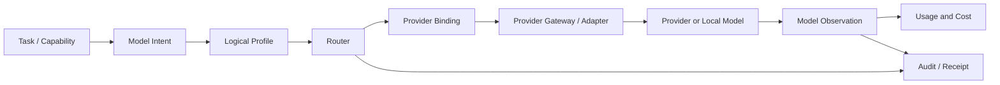

# MOD-001 — Agent OS Model Profile Contract

> **Status: Draft.** This document defines the provider-neutral model profile, provider binding, routing, fallback, usage, cost, privacy, and actual-model observation contract for Agent OS. It does not approve any provider, model, current price, legal term, retention promise, or production use.

## 1. Purpose

Agent OS must allow tasks and capabilities to request a logical model need without hard-coding a vendor or model into every workflow.

This document defines:

- logical model profiles;
- concrete provider bindings;
- model capability requirements;
- modality support;
- context and output limits;
- data-classification restrictions;
- provider retention and training metadata;
- region and endpoint constraints;
- routing and eligibility;
- explicit fallback;
- rate limits and quotas;
- usage and cost attribution;
- pricing versions;
- configured, selected, and actual model identity;
- health, readiness, validation, drift, deprecation, and revocation;
- model-related audit, observability, security, and testing.

## 2. Fundamental separation

```text
logical profile
≠ configured binding
≠ selected route
≠ actual provider
≠ actual model used
≠ usage observation
≠ calculated cost
≠ provider invoice
```

All layers are stored and shown separately.

## 3. Goals

The contract must:

1. remain provider-neutral;
2. separate model intent from provider implementation;
3. support capability-based matching;
4. preserve unknown actual identity;
5. prohibit silent fallback;
6. constrain outbound data;
7. represent provider retention/training uncertainty;
8. support local and external models;
9. support quotas, rate limits, budgets, and costs;
10. preserve source and freshness;
11. provide explainable routing;
12. prevent profiles from granting authority;
13. support replacement and deprecation;
14. support conformance tests and drift detection;
15. remain compatible with Hermes, Codex, and future adapters.

## 4. Non-goals

This document does not:

- grant workspace access;
- authorize tools;
- approve an action;
- define provider billing as platform truth;
- guarantee model quality or determinism;
- guarantee actual model reporting;
- select initial providers;
- approve restricted-data processing;
- define production inference infrastructure;
- replace `AGC-001`, `CAP-001`, or policy.

## 5. Model abstraction layers

| Layer | Meaning |
|---|---|
| `ModelIntent` | Required behavior and constraints |
| `ModelProfile` | Named logical configuration |
| `ProviderBinding` | Concrete provider/model candidate |
| `RoutingDecision` | Binding selected for one attempt |
| `ModelObservation` | Actual identity reported or observed |
| `UsageEvent` | Consumption evidence |
| `CostRecord` | Reported, calculated, or estimated cost |
| `ProviderInvoice` | External provider billing authority |

## 6. Architecture



## 7. Model profile lifecycle

```text
draft
configured
validating
validated
ready
degraded
temporarily_unavailable
disabled
deprecated
incompatible
revoked
retired
```

Rules:

- `draft` and `configured` are not routable;
- `validated` refers to a specific configuration and test profile;
- `ready` includes policy, health, quota, secrets, and data compatibility;
- `degraded` exposes limitations;
- `disabled`, `incompatible`, and `revoked` block new use;
- historical runs retain exact profile and binding references.

## 8. ModelProfile entity

| Field | Type | Required |
|---|---|---:|
| `model_profile_id` | `opaque_id` | Yes |
| `profile_code` | `short_text` | Yes |
| `logical_name` | `display_name` | Yes |
| `profile_version` | `version_string` | Yes |
| `description` | `long_text` | Yes |
| `scope_type` | `enum_code` | Yes |
| `workspace_id` | `opaque_id` | Conditional |
| `state` | `model_profile_state` | Yes |
| `model_intent` | `json_object` | Yes |
| `data_handling_policy` | `json_object` | Yes |
| `routing_policy` | `json_object` | Yes |
| `budget_policy` | `json_object` | Yes |
| `provider_bindings` | `json_array` | Yes |
| `validation_summary` | `json_object` | Yes |
| `created_at` | `timestamp_utc` | Yes |
| `created_by` | `opaque_id` | Yes |
| `updated_at` | `timestamp_utc` | Yes |
| `content_hash` | `content_hash` | Yes |

## 9. Profile-code convention

Recommended format:

```text
model.<purpose>.<tier>
```

Examples:

```text
model.general.balanced
model.general.low_cost
model.reasoning.high
model.coding.standard
model.coding.high
model.document.long_context
model.vision.standard
model.embedding.local
model.classification.low_cost
model.summarization.confidential_local
```

Profile codes describe intent, not brands.

## 10. ModelIntent

A model intent may contain:

- required capability codes;
- primary purpose;
- input and output modalities;
- minimum context capacity;
- minimum output capacity;
- structured-output requirement;
- tool-proposal requirement;
- streaming preference;
- determinism preference;
- latency class;
- quality class;
- local-only requirement;
- actual-model reporting requirement;
- usage reporting requirement;
- fallback permission.

## 11. Primary purposes

```text
general_assistance
reasoning
coding
document_analysis
document_generation
summarization
classification
information_extraction
structured_generation
translation
vision_analysis
embedding
reranking
planning
tool_action_proposal
other
```

## 12. Modalities

```text
text_input
text_output
image_input
image_output
audio_input
audio_output
document_input
structured_input
structured_output
embedding_output
tool_call_proposal
```

A modality is eligible only when validated for the binding.

## 13. Quality classes

```text
minimum
economy
balanced
high
maximum_available
unknown
```

This is a routing preference, not an accuracy guarantee.

## 14. Latency classes

```text
interactive
near_interactive
background
batch
not_time_sensitive
```

## 15. ProviderBinding entity

| Field | Type | Required |
|---|---|---:|
| `provider_binding_id` | `opaque_id` | Yes |
| `model_profile_id` | `opaque_id` | Yes |
| `binding_version` | `version_string` | Yes |
| `provider_id` | `short_text` | Yes |
| `provider_account_reference` | `source_reference` | Conditional |
| `provider_model_id` | `short_text` | Yes |
| `provider_model_version` | `version_string` | Optional |
| `endpoint_profile` | `source_reference` | Yes |
| `secret_reference_id` | `source_reference` | Conditional |
| `capability_snapshot_reference` | `source_reference` | Yes |
| `data_handling_metadata` | `json_object` | Yes |
| `context_limits` | `json_object` | Yes |
| `output_limits` | `json_object` | Yes |
| `rate_limit_profile` | `json_object` | Yes |
| `pricing_profile_reference` | `source_reference` | Optional |
| `priority` | `count` | Yes |
| `weight` | `count` | Optional |
| `state` | `provider_binding_state` | Yes |
| `health_state` | `health_state` | Yes |
| `validation_summary` | `json_object` | Yes |
| `content_hash` | `content_hash` | Yes |

## 16. Binding states

```text
configured
validating
validated
ready
degraded
rate_limited
quota_exceeded
temporarily_unavailable
disabled
deprecated
incompatible
revoked
retired
unknown
```

## 17. Provider identity

A provider record may contain:

- provider ID and display name;
- provider type;
- account reference;
- endpoint profile;
- configured region;
- terms reference;
- retention metadata source;
- training metadata source;
- pricing source;
- health source.

Provider types:

```text
external_api
local_runtime
self_hosted
adapter_managed
unknown
```

## 18. Model identity separation

The platform distinguishes:

- configured provider/model;
- selected provider/model;
- actual reported provider/model;
- inferred model;
- fallback model;
- provider request ID.

Identity states:

```text
provider_reported
adapter_reported
locally_observed
inferred
configured_only
unavailable
unknown
conflicted
```

`configured_only` must never appear as actual.

## 19. ModelObservation entity

| Field | Required |
|---|---:|
| `model_observation_id` | Yes |
| `workspace_id` | Yes |
| `run_id` | Yes |
| `step_id` | Yes |
| `attempt_id` | Yes |
| `model_profile_id` | Yes |
| `provider_binding_id` | Yes |
| `configured_provider_id` | Yes |
| `configured_model_id` | Yes |
| `actual_provider_id` | Optional |
| `actual_model_id` | Optional |
| `provider_request_id` | Optional |
| `identity_state` | Yes |
| `fallback_applied` | Yes |
| `fallback_reason` | Optional |
| `source_type` | Yes |
| `observed_at` | Yes |
| `evidence_reference` | Optional |
| `limitations` | Yes |

## 20. Routing inputs

Routing evaluates:

- requested profile and capability;
- modalities;
- context/output needs;
- data classification;
- local-only requirement;
- provider disclosure policy;
- model/usage reporting requirements;
- provider and binding health;
- compatibility;
- rate limits and quota;
- budget and estimated cost;
- latency and quality preferences;
- workspace/provider allowlist;
- fallback policy;
- emergency stop.

## 21. RoutingDecision entity

| Field | Required |
|---|---:|
| `routing_decision_id` | Yes |
| `workspace_id` | Yes |
| `run_id` | Yes |
| `step_id` | Yes |
| `attempt_id` | Yes |
| `model_profile_id` | Yes |
| `profile_version` | Yes |
| `selected_binding_id` | Conditional |
| `decision` | Yes |
| `reason_codes` | Yes |
| `alternatives_considered` | Yes |
| `constraints_snapshot` | Yes |
| `estimated_cost` | Optional |
| `fallback_rule_reference` | Optional |
| `decided_at` | Yes |
| `policy_reference` | Yes |

Routing decisions:

```text
selected
selected_with_limits
waiting_rate_limit
waiting_quota
waiting_budget
blocked_data_policy
blocked_provider_policy
blocked_capability
blocked_health
blocked_identity_reporting
no_compatible_binding
fallback_requires_approval
unknown_block
```

## 22. Routing algorithm

A valid router must:

1. remove prohibited providers;
2. remove incompatible capability versions;
3. remove unsupported modalities;
4. remove insufficient context/output bindings;
5. remove data-class violations;
6. enforce local-only requirements;
7. remove disabled/unhealthy bindings;
8. enforce quota and hard budget;
9. apply workspace preferences;
10. rank eligible bindings by policy;
11. record alternatives and reasons;
12. never apply silent fallback.

## 23. Fallback contract

A fallback rule includes:

- source profile or binding;
- permitted alternatives;
- semantic equivalence;
- capability differences;
- quality/latency/cost impact;
- context/output impact;
- data-disclosure change;
- provider/region change;
- actual-model reporting impact;
- approval requirement;
- user-notification requirement;
- maximum chain length.

Fallback states:

```text
not_allowed
allowed_same_provider
allowed_approved_providers
allowed_local_only
requires_approval
temporarily_blocked
unknown
```

## 24. Fallback invariants

1. Fallback is never silent.
2. It cannot lower data protection.
3. It cannot use a prohibited provider.
4. It cannot exceed budget without governed approval.
5. It cannot remove required capabilities.
6. It cannot fabricate actual identity.
7. The chain is bounded.
8. The reason is auditable.
9. Privacy, cost, and quality changes are visible.
10. A task may prohibit fallback.

## 25. Data-handling policy

A profile defines:

- allowed and prohibited data classes;
- external disclosure state;
- local-only support;
- provider retention metadata;
- provider training metadata;
- region restrictions;
- minimization and redaction;
- content logging;
- prompt/response retention;
- workspace session isolation;
- deletion/export implications.

## 26. Default data-class posture

| Class | Default direction |
|---|---|
| `public` | Approved provider may be used |
| `internal` | Approved provider or local |
| `confidential` | Explicit approved binding and policy |
| `secret` | Not ordinary model content |
| `restricted` | Excluded by default |

## 27. External disclosure states

```text
none
local_process_only
approved_local_network
approved_external_provider
multiple_external_destinations
unknown
```

`unknown` blocks confidential use.

## 28. Provider retention states

```text
not_applicable
no_retention_reported
bounded_retention_reported
retention_reported_unknown_duration
retention_possible
unknown
conflicted
```

Provider retention metadata must have a source, applicable account/product, review date, and freshness.

## 29. Provider training states

```text
not_applicable
training_excluded_reported
training_opt_out_reported
training_possible
training_enabled
unknown
conflicted
```

These are external-reported facts, not platform guarantees.

## 30. Region and residency

Possible fields:

- configured region;
- observed endpoint region;
- provider account region;
- claimed processing/storage region;
- source;
- freshness;
- policy requirement.

Region states:

```text
configured
provider_reported
observed
unknown
conflicted
not_applicable
```

## 31. Context limits

The contract distinguishes:

- provider maximum context;
- adapter maximum;
- profile maximum;
- task requirement;
- actual submitted context;
- reserved output;
- measurement source;
- confidence/state.

Context unit types:

```text
tokens
characters
bytes
images
audio_seconds
document_pages
provider_units
unknown
```

Units from different providers are not assumed equivalent.

## 32. Overflow behavior

```text
reject
truncate_oldest
truncate_low_priority
summarize_then_retry
retrieve_selected_context
split_into_steps
provider_default
unknown
```

Rules:

- truncation is never silent;
- task goals and protected instructions cannot be silently removed;
- summaries remain generated content;
- policy may prohibit summarization or truncation;
- overflow behavior is evidenced.

## 33. Output limits

A binding declares:

- maximum output units;
- maximum artifact size;
- streaming support;
- structured-output limits;
- multimodal limits;
- stop behavior;
- truncation indicators.

A truncated response is `partial`, never `complete`.

## 34. Structured output

A profile may require:

- JSON;
- JSON Schema;
- typed object;
- tool proposal;
- patch format;
- another versioned schema.

Validation and bounded repair are required. Repaired output is not presented as provider-original.

## 35. Tool-call proposals

A model may propose tools but cannot authorize them.

The profile declares:

- proposal schema version;
- maximum proposals;
- parallel proposal support;
- argument format;
- native tool behavior;
- hidden tool limitations;
- whether native tools can be disabled.

All protected tool calls remain proposals until policy and approval complete.

## 36. Local model bindings

A local binding may define:

- runtime and model-file reference;
- checksum;
- license reference;
- hardware requirements;
- context/output limits;
- quantization;
- resource limits;
- local usage measurement;
- update policy;
- network behavior.

Local operation does not automatically mean safe.

## 37. External provider bindings

An external binding requires:

- approved provider and endpoint;
- secret reference;
- endpoint/TLS validation;
- egress allowlist;
- data-class rules;
- retention/training metadata;
- rate/quota profile;
- pricing source;
- error mapping;
- usage and model observation behavior.

## 38. Secrets

Model profiles contain secret references only.

A secret reference defines:

- purpose;
- provider/account target;
- workspace/platform scope;
- minimum permission;
- expiry and rotation;
- delivery mode;
- last validation.

Production credentials remain prohibited.

## 39. Rate limits

A rate-limit profile may include:

- request, input, output, total-unit limits;
- concurrent requests;
- window and burst;
- remaining capacity;
- reset time;
- retry-after;
- source and freshness.

States:

```text
available
approaching_limit
rate_limited
unknown
stale
not_applicable
```

## 40. Quotas

Quota types:

```text
request_quota
token_or_unit_quota
spend_quota
storage_quota
concurrency_quota
daily_quota
monthly_quota
provider_custom_quota
unknown
```

Quota states:

```text
available
warning
exhausted
suspended
unknown
stale
```

## 41. Capacity reservation

Before dispatch, Agent OS may reserve:

- input/output units;
- estimated cost;
- concurrency slot;
- provider quota.

Reservations:

- are not provider billing;
- expire;
- reconcile with actual usage;
- prevent oversubscription where possible.

## 42. PricingProfile entity

| Field | Required |
|---|---:|
| `pricing_profile_id` | Yes |
| `provider_id` | Yes |
| `provider_model_id` | Yes |
| `pricing_version` | Yes |
| `currency` | Yes |
| `effective_from` | Yes |
| `effective_to` | Optional |
| `source_type` | Yes |
| `source_reference` | Yes |
| `unit_prices` | Yes |
| `minimum_charge` | Optional |
| `rounding_rules` | Optional |
| `region_or_tier_rules` | Optional |
| `state` | Yes |
| `reviewed_at` | Yes |

Pricing states:

```text
current
scheduled
expired
stale
estimated
unknown
conflicted
```

## 43. Pricing sources

```text
provider_invoice
provider_reported
provider_documented
contract_documented
manual_reconciliation
calculated
estimated
unknown
```

## 44. Cost estimation

Every estimate identifies:

- pricing version;
- input/output estimate;
- fixed or extra charges;
- currency;
- calculation time;
- confidence;
- assumptions;
- excluded costs;
- source.

Estimate states:

```text
estimated
range_estimate
unavailable
unknown
```

## 45. Cost truth

Actual cost may be sourced from:

- provider invoice;
- provider request-level cost;
- provider usage plus pricing;
- adapter report;
- local measurement;
- manual reconciliation.

Unknown cost is not zero.

## 46. Usage metrics

```text
input_tokens
output_tokens
cached_input_tokens
reasoning_tokens
image_units
audio_input_seconds
audio_output_seconds
request_count
compute_seconds
wall_seconds
tool_calls
storage_bytes
network_bytes
provider_custom_units
other
```

Every usage value has source, state, time, and deduplication.

## 47. Usage reconciliation

Results:

```text
matched
within_tolerance
mismatched
duplicate
missing
unattributed
pending
unknown
```

Reconciliation may compare adapter, provider, local measurement, reservations, calculation, and invoice.

## 48. Budget policy

A profile may define:

- maximum estimated request cost;
- maximum run cost;
- workspace period budget;
- warning and hard thresholds;
- currency rules;
- fallback cost delta;
- unknown-cost behavior.

Unknown-cost behavior:

```text
allow_with_conservative_reservation
require_approval
block
use_configured_ceiling
```

## 49. Health

Binding health covers:

- endpoint reachability;
- authentication;
- model availability;
- capability compatibility;
- rate limit and quota;
- latency and error rate;
- identity-reporting availability;
- usage-reporting availability;
- validation freshness.

Health is per binding, not one provider-wide boolean.

## 50. Readiness

A binding is ready only when:

```text
validated
AND profile enabled
AND provider allowed
AND capability matches
AND data policy matches
AND secret available
AND health acceptable
AND quota available
AND budget permits
AND emergency stop inactive
```

Readiness states:

```text
ready
ready_with_limits
blocked_profile
blocked_validation
blocked_provider
blocked_capability
blocked_data_policy
blocked_secret
blocked_health
blocked_rate_limit
blocked_quota
blocked_budget
blocked_compatibility
maintenance
unknown
```

## 51. Validation

Validation may test:

- provider/model reachability;
- authentication;
- model existence;
- modalities;
- structured output;
- streaming;
- context and output limits;
- actual identity reporting;
- usage reporting;
- data minimization;
- rate-limit handling;
- error mapping;
- fallback visibility;
- silent-substitution resistance.

Validation uses low-risk fixtures.

## 52. Validation evidence

A validation summary includes:

- profile/binding/adapter/runtime versions;
- provider endpoint/account;
- test-suite version;
- tests passed/failed/skipped;
- observed capabilities and limits;
- actual identity result;
- usage result;
- data-handling review;
- pricing metadata review;
- evidence;
- validation and expiry dates;
- reviewer.

## 53. Drift

Drift includes changes to:

- provider model/version;
- endpoint/account;
- capabilities;
- context/output limits;
- identity/usage reporting;
- retention/training metadata;
- pricing;
- quota/rate limits;
- region;
- fallback;
- adapter/runtime version;
- secret scope.

Outcomes:

```text
non_material
refresh_metadata
requires_revalidation
requires_security_review
requires_data_review
requires_budget_review
requires_profile_version
incompatible
```

## 54. Deprecation

A deprecation record includes:

- affected provider/model/profile;
- announcement and dates;
- replacement;
- compatibility;
- migration;
- data, cost, quality, and latency differences;
- affected workspaces and runs.

Silent replacement is prohibited.

## 55. Revocation

Revocation may target provider, account, endpoint, model, profile, binding, secret, region, or capability.

It blocks new work, invalidates readiness, may stop/reconcile active attempts, and preserves evidence.

## 56. Error codes

```text
MODEL_PROFILE_NOT_FOUND
MODEL_PROFILE_NOT_READY
MODEL_PROFILE_DISABLED
MODEL_PROFILE_INCOMPATIBLE
MODEL_BINDING_NOT_FOUND
MODEL_BINDING_UNAVAILABLE
MODEL_PROVIDER_DENIED
MODEL_PROVIDER_UNREACHABLE
MODEL_AUTHENTICATION_FAILED
MODEL_NOT_FOUND
MODEL_CAPABILITY_MISMATCH
MODEL_MODALITY_UNSUPPORTED
MODEL_CONTEXT_LIMIT_EXCEEDED
MODEL_OUTPUT_LIMIT_EXCEEDED
MODEL_DATA_CLASS_DENIED
MODEL_REGION_DENIED
MODEL_RETENTION_UNKNOWN
MODEL_RATE_LIMITED
MODEL_QUOTA_EXCEEDED
MODEL_BUDGET_EXCEEDED
MODEL_PRICING_UNKNOWN
MODEL_FALLBACK_NOT_ALLOWED
MODEL_FALLBACK_REQUIRES_APPROVAL
MODEL_ACTUAL_IDENTITY_UNKNOWN
MODEL_USAGE_UNAVAILABLE
MODEL_RESPONSE_INVALID
MODEL_OUTPUT_TRUNCATED
MODEL_PROVIDER_ERROR
MODEL_TIMEOUT
MODEL_INTERNAL_ERROR
```

## 57. Invocation metadata

Every invocation should retain, where known:

- logical profile and version;
- selected binding;
- configured provider/model;
- actual provider/model;
- identity state;
- fallback and reason;
- provider request ID;
- start/end time;
- usage and cost state;
- stop reason;
- truncation;
- refusal/safety state;
- evidence limitations.

## 58. Stop reasons

```text
completed
length_limit
stop_sequence
tool_proposal
content_refusal
provider_safety
cancelled
timeout
rate_limited
provider_error
invalid_output
unknown
```

## 59. Provider refusal

Normalized states:

```text
not_refused
provider_refusal
content_safety_refusal
capability_refusal
unknown
```

Provider refusal is not a platform policy decision.

## 60. Prompt and context assembly

Profiles may influence:

- context limit;
- selected memory classes;
- retrieval quantity;
- artifact inclusion;
- source requirements;
- redaction;
- structured-output templates.

Profiles cannot override authorization, include unrelated workspace content, disclose secrets, or disable policy/audit.

## 61. Prompt templates

Templates, where used, must be:

- versioned;
- scoped;
- classified;
- integrity-hashed;
- reviewed;
- attributable;
- compatible with the model profile.

Hidden mutable prompt text is not acceptable as a controlled profile definition.

## 62. Cache policy

Possible caches:

- provider prompt cache;
- local response cache;
- embedding cache;
- routing cache;
- pricing and health caches.

Rules:

- workspace and classification aware;
- no raw secrets;
- documented provider behavior;
- expiry and invalidation;
- no cross-workspace reuse except approved public data;
- usage reported where available.

## 63. Embedding profiles

An embedding profile defines:

- provider/local runtime;
- model/version;
- vector dimension;
- metric expectation;
- input limits;
- supported languages/content;
- classification and disclosure;
- index compatibility;
- deletion/rebuild;
- usage/cost.

Changing model/version may require index rebuild.

## 64. Reranking profiles

A reranking profile defines:

- candidate and input limits;
- scoring semantics;
- model/version;
- provider/local state;
- classification;
- latency/cost;
- reproducibility limits.

Reranker scores are not universal probabilities.

## 65. Vision profiles

Vision profiles define:

- accepted image/document formats;
- limits;
- OCR behavior;
- metadata stripping;
- external disclosure;
- active-content handling;
- output schema;
- cost units;
- limitations.

## 66. Local-versus-external preference

```text
local_required
local_preferred
external_allowed
external_preferred
provider_fixed
unknown
```

Preference never overrides data policy or capability.

## 67. Provider allow/deny rules

Rules may constrain:

- provider/account;
- endpoint/region;
- model/capability;
- workspace;
- data class;
- purpose;
- time;
- cost.

A denial overrides a preference.

## 68. Approval conditions

Approval may be required when:

- confidential content leaves the host;
- fallback changes provider or region;
- unknown retention is accepted;
- a budget ceiling changes;
- a weaker privacy binding is selected;
- output directly informs a high-risk action.

Approval cannot authorize a prohibited provider, production credential, financial write, or restricted-data flow.

## 69. Security requirements

- profile does not grant authority;
- raw secret values are excluded;
- data-class rules are mandatory;
- unknown disclosure blocks confidential data;
- fallback is explicit;
- actual identity is not fabricated;
- model output is untrusted;
- tool calls remain proposals;
- prompt injection cannot expand authority;
- provider/account/region restrictions are enforced;
- revoked bindings receive no new work;
- logs omit full sensitive prompts by default;
- production credentials are prohibited.

## 70. Privacy requirements

- purpose limitation;
- minimization;
- explicit disclosure;
- retention/training metadata;
- workspace isolation;
- no hidden profiling;
- cache behavior documented;
- deletion/export implications documented;
- provider claims time-bounded and sourced.

`PRI-001` remains **proposed/unregistered**.

## 71. Reliability requirements

- readiness separate from configuration;
- fallback explicit;
- rate/quota states explicit;
- timeout/retry bounded;
- actual identity explicit;
- truncated output explicit;
- unknown usage/cost not zero;
- pricing freshness explicit;
- drift invalidates readiness;
- recovery follows `ORC-001`.

## 72. Audit events

```text
ModelProfileCreated
ModelProfileUpdated
ModelProfileValidated
ModelProfileDisabled
ProviderBindingAdded
ProviderBindingValidated
ProviderBindingHealthChanged
ProviderBindingRevoked
ModelRoutingRequested
ModelRoutingSelected
ModelRoutingBlocked
ModelFallbackProposed
ModelFallbackApplied
ModelFallbackDenied
ModelInvocationStarted
ModelIdentityObserved
ModelUsageObserved
ModelCostEstimated
ModelCostReconciled
ModelOutputTruncated
ModelStructuredOutputInvalid
ModelQuotaExceeded
ModelRateLimited
ModelMetadataDriftDetected
```

## 73. Observability

Metrics include:

- profiles and bindings by state;
- routing selections and blocks;
- fallback count;
- identity-reporting completeness;
- usage/cost attribution completeness;
- rate limits and quotas;
- context overflow and truncation;
- structured-output failures;
- provider latency/errors;
- pricing and metadata freshness;
- drift events.

## 74. Example — balanced general profile

```json
{
  "profile_code": "model.general.balanced",
  "profile_version": "1.0.0",
  "model_intent": {
    "primary_purpose": "general_assistance",
    "modalities": ["text_input", "text_output"],
    "minimum_context_units": 32000,
    "latency_class": "near_interactive",
    "quality_class": "balanced",
    "local_only_required": false,
    "fallback_allowed": true
  },
  "data_handling_policy": {
    "allowed_data_classes": ["public", "internal"],
    "external_disclosure": "approved_external_provider"
  }
}
```

## 75. Example — confidential local summarization

```json
{
  "profile_code": "model.summarization.confidential_local",
  "profile_version": "1.0.0",
  "model_intent": {
    "primary_purpose": "summarization",
    "modalities": ["text_input", "text_output", "document_input"],
    "local_only_required": true,
    "fallback_allowed": false
  },
  "data_handling_policy": {
    "allowed_data_classes": ["internal", "confidential"],
    "external_disclosure": "none"
  }
}
```

## 76. Example — high coding profile

```json
{
  "profile_code": "model.coding.high",
  "profile_version": "1.0.0",
  "model_intent": {
    "primary_purpose": "coding",
    "modalities": ["text_input", "text_output", "structured_output"],
    "minimum_context_units": 64000,
    "tool_call_proposal_required": true,
    "usage_reporting_required": true,
    "fallback_allowed": true
  },
  "routing_policy": {
    "fallback_state": "requires_approval",
    "maximum_fallback_chain_length": 1
  }
}
```

## 77. Validation tests

### Schema

- required fields;
- invalid lifecycle/classification;
- invalid binding;
- missing content hash;
- invalid pricing reference.

### Routing

- exact match;
- unsupported modality;
- insufficient context;
- prohibited provider;
- local-only violation;
- rate/quota/budget block;
- fallback paths.

### Identity

- actual reported;
- configured only;
- fallback model;
- conflict;
- unknown identity.

### Data/privacy

- confidential disclosure denial;
- secret rejection;
- unknown retention block;
- region mismatch;
- minimization and workspace isolation.

### Cost

- current/stale pricing;
- unknown cost;
- reservation and reconciliation;
- duplicate usage;
- invoice mismatch.

### Reliability

- timeout;
- rate-limit retry;
- quota recovery;
- output truncation;
- invalid structured output;
- deprecation and drift.

## 78. Quality gates

Before readiness:

1. schema validates;
2. profile/binding versions exist;
3. capabilities and modalities match;
4. context/output limits are known or conservatively bounded;
5. data classes and disclosure are explicit;
6. retention/training metadata is reviewed or marked unknown;
7. secret references are valid;
8. health is acceptable;
9. quota and budget behavior is explicit;
10. pricing/cost source is explicit;
11. fallback is explicit;
12. actual-model reporting limitations are explicit;
13. validation evidence is current;
14. workspace enablement and policy permit use.

## 79. Release-blocking conditions

A profile/binding cannot be enabled when:

- provider is prohibited;
- capability is incompatible;
- external disclosure is unknown for confidential data;
- production credentials are required;
- secret values are embedded;
- endpoint/network scope is unrestricted;
- validation expired;
- retention/training policy is violated;
- fallback is silent;
- actual identity is falsely represented;
- cost is unknown under block-on-unknown policy;
- critical threat remains unresolved.

## 80. Requirement catalogue

### Security

- `MOD-SEC-001` — Profiles do not grant authority.
- `MOD-SEC-002` — Secret values are prohibited.
- `MOD-SEC-003` — Data-class policy is mandatory.
- `MOD-SEC-004` — Confidential use requires known approved disclosure.
- `MOD-SEC-005` — Silent fallback is prohibited.
- `MOD-SEC-006` — Actual identity is not fabricated.
- `MOD-SEC-007` — Model output remains untrusted.
- `MOD-SEC-008` — Tool calls remain proposals.
- `MOD-SEC-009` — Provider/account/region restrictions are enforced.
- `MOD-SEC-010` — Production credentials are excluded.

### Reliability

- `MOD-REL-001` — Health and readiness are separate.
- `MOD-REL-002` — Context/output overflow is explicit.
- `MOD-REL-003` — Rate and quota states are explicit.
- `MOD-REL-004` — Fallback chains are bounded.
- `MOD-REL-005` — Truncation is explicit.
- `MOD-REL-006` — Drift invalidates readiness.
- `MOD-REL-007` — Deprecated models are not silently replaced.
- `MOD-REL-008` — Unknown identity/usage/cost remains explicit.

### Data and cost

- `MOD-DAT-001` — Canonical fields reuse `DCT-001`.
- `MOD-DAT-002` — Logical/configured/actual identities are distinct.
- `MOD-DAT-003` — Provider metadata has source and freshness.
- `MOD-DAT-004` — Pricing is versioned.
- `MOD-DAT-005` — Usage is deduplicated and sourced.
- `MOD-DAT-006` — Estimates remain distinct from invoices.
- `MOD-DAT-007` — Provider-specific units remain labeled.
- `MOD-DAT-008` — Model observations link to attempts.

## 81. Traceability

| Requirement area | Contract response |
|---|---|
| `FR-MOD-*` | Profiles, bindings, routing, fallback |
| `FR-AGT-*` | Adapter/model observations |
| `FR-RUN-*` | Attempt-level selection and identity |
| `FR-APR-*` | Sensitive disclosure/fallback approval |
| `FR-MEM-*` | Context disclosure |
| `FR-AUD-*` | Routing, identity, usage, cost evidence |
| `FR-CST-*` | Pricing, budget, reconciliation |
| `FR-OPS-*` | Health, quota, deprecation, drift |
| `NFR-SEC-*` | Secrets/provider/data restrictions |
| `NFR-PRI-*` | Retention/training/minimization |
| `NFR-INT-*` | Provider neutrality |
| `CAP-001` | Model capabilities |
| `THR-001` | Provider, fallback, disclosure threats |

## 82. Mapping to components

| Concern | Component |
|---|---|
| Profile registry | Agent/Model Registry |
| Routing | Model Provider Gateway / Router |
| Runtime observation | Adapter Gateway |
| Policy | Policy Engine |
| Approval | Approval Service |
| Usage/cost | Usage and Cost Service |
| Audit | Audit and Receipt Service |
| Health | Operations Service |
| Secrets | Secrets Service |
| UI | Mission Control |

## 83. ADR backlog

- `ADR-TBD-MOD-001` — Initial provider and local-runtime set
- `ADR-TBD-MOD-002` — Deterministic routing algorithm
- `ADR-TBD-MOD-003` — Pricing/cost source and reconciliation
- `ADR-TBD-MOD-004` — Provider privacy/retention metadata governance
- `ADR-TBD-MOD-005` — Actual model and usage evidence

## 84. Open decisions

1. Which providers and local runtimes enter MVP?
2. Which profiles are created first?
3. Which capabilities/modalities are mandatory?
4. Which data classes may use external providers?
5. Which retention/training states are acceptable?
6. Which regions are allowed?
7. Is actual-model reporting mandatory anywhere?
8. Is usage reporting mandatory anywhere?
9. Which fallback changes require approval?
10. What maximum fallback chain?
11. How are quality and latency ranked?
12. How is context measured across providers?
13. Which overflow behaviors are allowed?
14. Which pricing source is authoritative?
15. How stale may pricing become?
16. What unknown-cost policy applies?
17. Which quota reservations are required?
18. Which local-model licenses are acceptable?
19. Which deprecations block new runs?
20. Which prompt-template controls are required?
21. Which metadata belongs in proposed `PRI-001`?
22. Which observations are retained in receipts?

## 85. Risks

| Risk | Consequence | Response |
|---|---|---|
| Provider brand leaks into logical profile | Lock-in | Provider-neutral codes |
| Configured shown as actual | False attribution | Separate observation states |
| Silent fallback | Privacy/cost/quality change | Explicit fallback |
| Unknown retention treated as safe | Disclosure | Block or approve |
| Stale pricing | Incorrect cost | Version/freshness |
| Unknown usage shown as zero | Misleading budget | Explicit unknown |
| Provider units compared directly | Bad routing | Unit/source semantics |
| Silent truncation | Lost requirements | Overflow evidence |
| Local model assumed safe | Host/data risk | Same controls |
| Provider/model drift | Changed behavior | Revalidation |
| Tool-capable model treated as authority | Control bypass | Proposal-only |
| Provider account over-scoped | Broad compromise | Least privilege |
| Deprecation silently substituted | Unreviewed behavior | Migration rules |
| Cache crosses workspace | Data leak | Scoped cache |
| Estimate mistaken for invoice | Misstatement | Source classes |

## 86. Assumptions

- adapters can report configured model data;
- some runtimes can report actual model and usage;
- provider metadata can be represented with source/freshness;
- logical profiles can remain provider-neutral;
- policy can evaluate disclosure;
- pricing can be versioned;
- health and quota are at least partially observable;
- low-risk validation requests can be executed.

## 87. Constraints

- no provider/model is approved here;
- no price is assumed current;
- no provider privacy claim is a guarantee;
- no production credentials;
- no restricted-data processing by default;
- no silent fallback;
- no raw secrets;
- no model authority over tools/policy/approval;
- no accepted mock identity, usage, or cost state;
- Git versioning remains deferred until drafting and consistency review complete.

## 88. Acceptance criteria

MOD-001 may advance to `1.0.0` when:

1. Product accepts profile catalogue and routing behavior.
2. Architecture accepts layers, bindings, routing, and fallback.
3. Security accepts provider, endpoint, secret, tool, and data controls.
4. Data accepts identity, usage, cost, pricing, and freshness semantics.
5. Operations accepts health, quotas, deprecation, and drift.
6. Quality accepts validation and tests.
7. logical, configured, selected, and actual identity remain distinct;
8. fallback is explicit and bounded;
9. data disclosure and provider metadata are explicit;
10. unknown usage/cost never become zero;
11. pricing is sourced and versioned;
12. readiness includes policy, health, quota, and budget;
13. material changes trigger revalidation;
14. downstream contracts can proceed;
15. metadata, terminology, diagrams, and examples validate.

## 89. Downstream impact

| Document | Required use |
|---|---|
| `RUN-001` | Selected binding, routing, identity, usage |
| `APR-001` | Approval for disclosure/fallback/budget |
| `ART-001` | Model-produced artifact metadata |
| `API-001` | Profile/binding/health/routing endpoints |
| `EVT-001` | Model routing, fallback, usage, drift events |
| `DEV-001` | Provider adapter implementation guidance |
| `TST-001` | Routing/privacy/cost tests |
| `QAG-001` | Readiness and metadata-freshness gates |
| `OBS-001` | Provider/model health and cost metrics |
| `OPS-001` | Configure, validate, rotate, deprecate, disable |
| `RTM-001` | Model requirements-to-tests traceability |

## 90. Revision and approval history

### Approval state

- Current status: `draft`
- Current version: `0.1.0`
- Approved by: no one
- Required next action: Product, Architecture, Security, Data, Operations, and Quality review

### Revision history

| Version | Date | Status | Summary |
|---|---|---|---|
| 0.1.0 | 2026-07-19 | Draft | Initial provider-neutral model profile contract covering intent, provider bindings, routing, fallback, data handling, context/output limits, secrets, quotas, pricing, usage, cost, identity, validation, drift, deprecation, audit, testing, and governance |

## References

- `DOC-000` — Documentation Governance and Source-of-Truth Policy
- `GLO-001` — Glossary and Controlled Terminology
- `INT-001` — Integration Architecture
- `AGC-001` — Agent Adapter Contract
- `CAP-001` — Agent Capability Schema
- `DCT-001` — Data Dictionary
- `ORC-001` — Workflow and Orchestration Architecture
- `SEC-001` — Security Architecture
- `THR-001` — Threat Model
