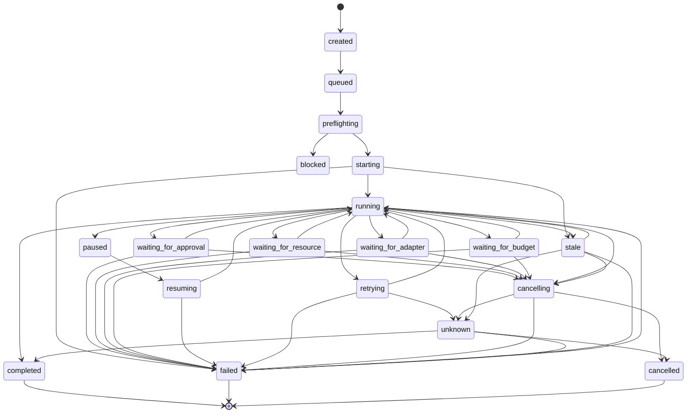
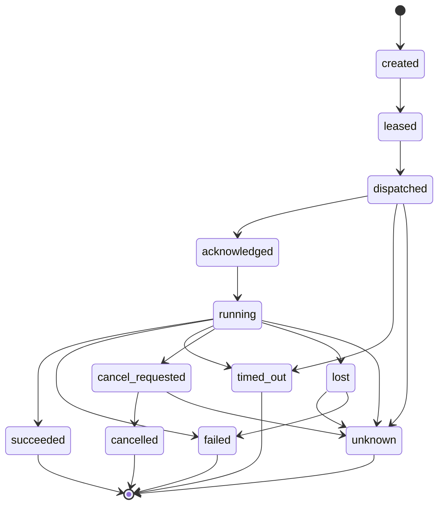

# RUN-001 — Agent OS Run and Execution Contract

> **Status: Approved baseline — 2026-08-13.** This document defines the formal contract for Agent OS runs, steps, attempts, durable jobs, leases, checkpoints, commands, transitions, errors, retries, pause, resume, cancellation, reconciliation, evidence, and receipts. It does not select a final workflow engine, queue, database, scheduler, or worker technology.

## 1. Purpose

This contract turns the orchestration architecture in `ORC-001` into precise runtime objects and rules.

It defines:

- `TaskSnapshot`;
- `Run`;
- `RunStep`;
- `RunAttempt`;
- `DurableJob`;
- `WorkerLease`;
- `WaitingCondition`;
- `Checkpoint`;
- `SideEffectRecord`;
- `RunCommand`;
- `RunEvent`;
- state machines;
- transition guards;
- command preconditions;
- idempotency;
- retry eligibility;
- pause and resume;
- cancellation;
- timeouts;
- reconciliation;
- startup recovery;
- completion criteria;
- failure semantics;
- execution receipts;
- API and event implications;
- validation and test requirements.

## 2. Contract objectives

The contract must:

1. persist every run before dispatch;
2. bind each run to one immutable task snapshot;
3. preserve workspace scope throughout execution;
4. make all state transitions explicit;
5. prevent duplicate consequential effects;
6. distinguish retry, resume, reroute, and restart;
7. preserve all attempts;
8. expose stale and unknown states;
9. enforce time, step, attempt, cost, and resource bounds;
10. bind protected actions to exact approval;
11. survive API, orchestrator, adapter, and worker restarts;
12. preserve external effect certainty;
13. support deterministic reconciliation;
14. generate evidence-backed terminal state;
15. remain compatible with Hermes, Codex, and future adapters.

## 3. Non-goals

This contract does not:

- define the task-authoring UI;
- define human role administration;
- define full policy language;
- define approval schema details beyond required references;
- define artifact content storage;
- define provider-specific runtime payloads;
- guarantee rollback;
- guarantee checkpoint support;
- guarantee cancellation;
- guarantee exactly-once external effects;
- authorize production or financial actions;
- select a concrete database or queue.

## 4. Execution hierarchy

```text
Task
└── TaskSnapshot
    └── Run
        ├── RunStep
        │   ├── RunAttempt
        │   │   ├── WorkerLease
        │   │   ├── SideEffectRecord
        │   │   ├── UsageEvent
        │   │   └── Result / Artifact Proposal
        │   └── WaitingCondition
        ├── DurableJob
        ├── Checkpoint
        ├── RunEvent
        └── ExecutionReceipt
```

## 5. Authority model

| Object | Authority |
|---|---|
| Task | Work definition owner |
| TaskSnapshot | Immutable platform record |
| Run | Agent OS control plane |
| Step | Agent OS orchestrator |
| Attempt | Agent OS orchestrator |
| External session state | Adapter/runtime observation |
| Approval | Approval service |
| Policy decision | Policy service |
| Artifact acceptance | Artifact service |
| Usage/provider billing | Source-labelled external/internal evidence |
| Audit | Audit service |
| Receipt | Agent OS evidence summary |

An adapter may report observations but does not directly set platform state.

## 6. Run creation invariant

No adapter, provider, tool, worker, or external effect may be invoked until the run and its initial execution context are committed durably.

Required sequence:

```text
authorize request
→ load task snapshot
→ evaluate readiness
→ validate execution bounds
→ resolve duplicate request
→ persist run
→ persist initial step/job
→ append RunCreated
→ commit
→ dispatch asynchronously
```

## 7. TaskSnapshot contract

A `TaskSnapshot` is immutable after creation.

Required fields:

| Field | Required |
|---|---:|
| `task_snapshot_id` | Yes |
| `task_id` | Yes |
| `workspace_id` | Yes |
| `project_id` | Optional |
| `snapshot_number` | Yes |
| `desired_outcome` | Yes |
| `resource_scopes` | Yes |
| `data_classification` | Yes |
| `agent_preference` | Optional |
| `model_profile_reference` | Optional |
| `tool_capability_requests` | Optional |
| `execution_bounds` | Yes |
| `expected_artifacts` | Optional |
| `content_hash` | Yes |
| `created_at` | Yes |
| `created_by` | Yes |

### Snapshot rules

1. A run references exactly one snapshot.
2. Snapshot content never changes.
3. New task edits create a new snapshot.
4. Existing runs do not follow future task edits.
5. Approval binds to the run’s exact snapshot context where relevant.
6. Checkpoint resume never changes snapshot.
7. Snapshot hash is included in receipt evidence.

## 8. Run entity

Required fields:

| Field | Required |
|---|---:|
| `run_id` | Yes |
| `organization_id` | Yes |
| `workspace_id` | Yes |
| `project_id` | Optional |
| `task_id` | Yes |
| `task_snapshot_id` | Yes |
| `requested_by` | Yes |
| `agent_registration_id` | Conditional |
| `model_profile_id` | Conditional |
| `routing_decision_id` | Conditional |
| `state` | Yes |
| `state_reason` | Optional |
| `execution_bounds` | Yes |
| `policy_snapshot_reference` | Yes |
| `idempotency_key` | Yes |
| `created_at` | Yes |
| `started_at` | Optional |
| `ended_at` | Optional |
| `last_reliable_evidence_at` | Optional |
| `cancellation_state` | Yes |
| `side_effect_summary` | Yes |
| `receipt_state` | Yes |
| `version` | Yes |

## 9. Run states

```text
created
queued
preflighting
blocked
starting
running
waiting_for_approval
waiting_for_resource
waiting_for_adapter
waiting_for_budget
paused
cancelling
retrying
resuming
stale
unknown
completed
failed
cancelled
```

### State categories

#### Pre-execution

```text
created
queued
preflighting
blocked
starting
```

#### Active

```text
running
retrying
resuming
cancelling
```

#### Waiting

```text
waiting_for_approval
waiting_for_resource
waiting_for_adapter
waiting_for_budget
paused
stale
unknown
```

#### Terminal

```text
completed
failed
cancelled
```

## 10. Run state machine



## 11. Run invariants

- `RUN-INV-001` — A run exists before external dispatch.
- `RUN-INV-002` — A run references one immutable task snapshot.
- `RUN-INV-003` — `workspace_id` is immutable.
- `RUN-INV-004` — `task_snapshot_id` is immutable.
- `RUN-INV-005` — terminal runs do not return to nonterminal state in MVP.
- `RUN-INV-006` — `completed` requires completion evidence.
- `RUN-INV-007` — `cancelled` does not imply rollback.
- `RUN-INV-008` — `unknown` is not silently converted to failed.
- `RUN-INV-009` — every transition records actor/source, reason, time, and version.
- `RUN-INV-010` — adapter/model changes are explicit and evidenced.
- `RUN-INV-011` — execution bounds cannot be exceeded silently.
- `RUN-INV-012` — emergency stop blocks future protected dispatch.
- `RUN-INV-013` — run state cannot be set directly by UI clients.
- `RUN-INV-014` — cross-workspace movement is prohibited.
- `RUN-INV-015` — terminal timestamps are immutable.

## 12. RunStep entity

A step is a meaningful unit of work.

Fields:

| Field | Required |
|---|---:|
| `step_id` | Yes |
| `run_id` | Yes |
| `step_type` | Yes |
| `sequence_number` | Conditional |
| `dependency_ids` | Optional |
| `capability_code` | Conditional |
| `capability_version` | Conditional |
| `normalized_target` | Conditional |
| `effect_class` | Yes |
| `risk_class` | Yes |
| `state` | Yes |
| `attempt_count` | Yes |
| `max_attempts` | Yes |
| `timeout_seconds` | Yes |
| `approval_requirement` | Optional |
| `expected_result` | Optional |
| `created_at` | Yes |
| `started_at` | Optional |
| `ended_at` | Optional |
| `version` | Yes |

## 13. Step types

```text
agent_execution
model_inference
tool_proposal
approval_wait
tool_execution
artifact_creation
checkpoint_creation
validation
reconciliation
finalization
custom
```

## 14. Step states

```text
planned
ready
leased
starting
running
waiting_for_approval
waiting_for_resource
retry_scheduled
paused
cancelling
completed
failed
cancelled
stale
unknown
skipped
```

## 15. Step state rules

1. `planned` has no attempt.
2. `ready` may be dispatched.
3. `leased` has a valid job lease.
4. `starting` has a created attempt and dispatch intent.
5. `running` has acknowledgement or equivalent evidence.
6. `waiting_for_approval` blocks protected effect execution.
7. `retry_scheduled` has a future schedule and retry eligibility.
8. `completed` requires expected completion evidence.
9. `skipped` requires deterministic skip reason.
10. `unknown` blocks automatic consequential retry.

## 16. Step dependencies

The MVP may support:

- sequential steps;
- explicit dependencies;
- bounded parallel independent steps;
- bounded retry loops.

The MVP does not support:

- unbounded dynamic graph expansion;
- recursive agent spawning;
- infinite loops;
- uncontrolled cyclic dependencies.

### Dependency states

A step becomes `ready` when:

- all required dependencies are `completed`;
- optional dependencies have resolved;
- skip rules are evaluated;
- no run-level cancellation or stop applies;
- execution bounds allow another step.

## 17. RunAttempt entity

Each execution try is a new append-only attempt.

Required fields:

| Field | Required |
|---|---:|
| `attempt_id` | Yes |
| `run_id` | Yes |
| `step_id` | Yes |
| `attempt_number` | Yes |
| `idempotency_key` | Yes |
| `state` | Yes |
| `worker_identity_id` | Conditional |
| `agent_registration_id` | Conditional |
| `provider_binding_id` | Conditional |
| `lease_id` | Conditional |
| `approval_consumption_id` | Conditional |
| `input_reference` | Yes |
| `result_reference` | Optional |
| `failure_class` | Optional |
| `side_effect_certainty` | Yes |
| `started_at` | Optional |
| `acknowledged_at` | Optional |
| `ended_at` | Optional |
| `last_heartbeat_at` | Optional |
| `external_session_id` | Optional |
| `version` | Yes |

## 18. Attempt states

```text
created
leased
dispatched
acknowledged
running
succeeded
failed
timed_out
cancel_requested
cancelled
lost
unknown
```

## 19. Attempt state machine



## 20. Attempt invariants

- `ATT-INV-001` — Attempt number is monotonic per step.
- `ATT-INV-002` — Attempts are never overwritten.
- `ATT-INV-003` — A retry creates a new attempt.
- `ATT-INV-004` — One approval consumption authorizes at most one attempt.
- `ATT-INV-005` — Attempt input is immutable.
- `ATT-INV-006` — Side-effect certainty is mandatory.
- `ATT-INV-007` — Lease loss does not automatically imply no effect.
- `ATT-INV-008` — An attempt cannot change workspace or target.
- `ATT-INV-009` — External session identity remains attributable.
- `ATT-INV-010` — Unknown protected effect blocks automatic retry.

## 21. Failure classes

```text
validation_failure
authentication_failed
authorization_denied
policy_denied
approval_missing
approval_invalid
capability_unavailable
resource_unavailable
adapter_unavailable
provider_unavailable
budget_exceeded
rate_limited
quota_exceeded
timeout_before_effect
timeout_after_effect
timeout_unknown_effect
transient_external
permanent_external
worker_lost
integrity_failure
output_invalid
artifact_failure
audit_failure
cancellation_failure
internal_failure
unknown_failure
```

## 22. Side-effect certainty

```text
none
known_not_started
failed_before_effect
known_completed
known_partial
compensated
compensation_failed
unknown
```

### Side-effect rules

| Certainty | Automatic retry direction |
|---|---|
| `none` | May retry if other conditions permit |
| `known_not_started` | May retry |
| `failed_before_effect` | May retry |
| `known_completed` | Do not repeat; reconcile result |
| `known_partial` | No automatic retry |
| `compensated` | New action may proceed under policy |
| `compensation_failed` | No automatic retry |
| `unknown` | No automatic consequential retry |

## 23. SideEffectRecord entity

Fields:

| Field | Required |
|---|---:|
| `side_effect_record_id` | Yes |
| `workspace_id` | Yes |
| `run_id` | Yes |
| `step_id` | Yes |
| `attempt_id` | Yes |
| `action_class` | Yes |
| `normalized_target` | Yes |
| `effect_class` | Yes |
| `certainty` | Yes |
| `external_reference` | Optional |
| `evidence_reference` | Optional |
| `occurred_at` | Optional |
| `recorded_at` | Yes |
| `compensation_reference` | Optional |
| `version` | Yes |

## 24. DurableJob entity

Fields:

| Field | Required |
|---|---:|
| `job_id` | Yes |
| `job_type` | Yes |
| `workspace_id` | Yes |
| `run_id` | Optional |
| `step_id` | Optional |
| `attempt_id` | Optional |
| `payload_reference` | Yes |
| `priority` | Yes |
| `scheduled_at` | Yes |
| `expires_at` | Optional |
| `state` | Yes |
| `lease_owner_id` | Optional |
| `lease_expires_at` | Optional |
| `attempt_count` | Yes |
| `max_attempts` | Yes |
| `deduplication_key` | Yes |
| `last_error_code` | Optional |
| `version` | Yes |

## 25. Job states

```text
pending
scheduled
available
leased
running
completed
retry_scheduled
dead_letter
cancelled
expired
```

## 26. Job invariants

- one active valid lease at a time;
- duplicate delivery is tolerated;
- expired jobs do not dispatch;
- cancelled run blocks pending job dispatch;
- dead-letter jobs remain visible;
- job completion is not run completion;
- lease expiry triggers reconciliation before protected redispatch.

## 27. WorkerLease entity

Fields:

| Field | Required |
|---|---:|
| `lease_id` | Yes |
| `job_id` | Yes |
| `attempt_id` | Conditional |
| `worker_identity_id` | Yes |
| `fencing_token` | Yes |
| `acquired_at` | Yes |
| `last_heartbeat_at` | Yes |
| `expires_at` | Yes |
| `state` | Yes |

States:

```text
active
expired
released
revoked
superseded
```

## 28. Fencing rules

1. Fencing tokens are monotonic.
2. A stale worker cannot commit state using an older token.
3. Heartbeat extends only an active lease.
4. Reassignment generates a newer fencing token.
5. Protected side effects are reconciled before reassignment.
6. Lease expiration is evidence of lost coordination, not proof of failed execution.

## 29. WaitingCondition entity

A waiting condition explains why work cannot proceed.

Fields:

| Field | Required |
|---|---:|
| `waiting_condition_id` | Yes |
| `run_id` | Yes |
| `step_id` | Optional |
| `condition_type` | Yes |
| `target_reference` | Optional |
| `state` | Yes |
| `created_at` | Yes |
| `deadline_at` | Optional |
| `next_check_at` | Optional |
| `retry_policy_reference` | Optional |
| `owner_identity_id` | Optional |
| `last_checked_at` | Optional |
| `evidence_reference` | Optional |

Condition types:

```text
approval
adapter
provider
tool
resource
budget
rate_limit
quota
maintenance
scheduled_time
dependency
operator_reconciliation
security_review
unknown
```

## 30. Waiting-condition states

```text
active
satisfied
expired
cancelled
failed
unknown
```

## 31. Checkpoint entity

Fields:

| Field | Required |
|---|---:|
| `checkpoint_id` | Yes |
| `workspace_id` | Yes |
| `run_id` | Yes |
| `step_id` | Yes |
| `attempt_id` | Yes |
| `adapter_type` | Yes |
| `adapter_version` | Yes |
| `runtime_version` | Optional |
| `external_session_reference` | Optional |
| `content_reference` | Yes |
| `integrity_hash` | Yes |
| `schema_version` | Yes |
| `portability_state` | Yes |
| `side_effect_summary` | Yes |
| `resource_scope_snapshot` | Yes |
| `permission_snapshot_reference` | Yes |
| `created_at` | Yes |
| `expires_at` | Optional |
| `state` | Yes |

States:

```text
created
validated
invalid
expired
superseded
unavailable
consumed_for_resume
```

## 32. Checkpoint invariants

- checkpoint is not approval;
- checkpoint does not change task snapshot;
- checkpoint does not expand permissions;
- checkpoint does not prove no external effect;
- checkpoint integrity is mandatory;
- resume compatibility is checked;
- checkpoint remains workspace-scoped;
- checkpoint content is classified and protected.

## 33. RunCommand envelope

Every command includes:

| Field | Required |
|---|---:|
| `command_id` | Yes |
| `command_type` | Yes |
| `schema_version` | Yes |
| `organization_id` | Yes |
| `workspace_id` | Conditional |
| `identity_id` | Yes |
| `run_id` | Conditional |
| `step_id` | Optional |
| `attempt_id` | Optional |
| `correlation_id` | Yes |
| `causation_id` | Optional |
| `idempotency_key` | Conditional |
| `requested_at` | Yes |
| `expires_at` | Optional |
| `expected_aggregate_version` | Conditional |
| `payload` | Yes |

## 34. Run commands

```text
CreateRun
QueueRun
StartPreflight
DispatchRun
PauseRun
ResumeRun
CancelRun
RetryStep
RetryRun
ReconcileRun
ResolveUnknownRun
ExtendRunBounds
CreateCheckpoint
FinalizeRun
FailRun
ArchiveRun
```

## 35. CreateRun command

### Preconditions

- requester authenticated;
- workspace active;
- task snapshot exists and belongs to workspace;
- task ready;
- execution bounds valid;
- duplicate key not conflicting;
- no hard policy denial.

### Outcomes

```text
created
duplicate_existing_run
blocked
rejected
```

### Emitted events

- `RunCreated`;
- optional `RunBlocked`;
- `RunQueued` after successful queueing.

## 36. QueueRun command

Preconditions:

- run state is `created`;
- run not cancelled;
- run not terminal;
- durable job store available.

Effects:

- create initial job;
- change to `queued`;
- append `RunQueued`.

## 37. StartPreflight command

Preflight checks:

- current identity/membership;
- workspace/project state;
- task snapshot integrity;
- adapter readiness;
- capability readiness;
- model profile readiness;
- policy;
- resource existence;
- secret references;
- network scope;
- cost/budget;
- audit availability;
- emergency stop;
- maintenance state.

Outcomes:

```text
passed
blocked
denied
unknown_block
```

## 38. DispatchRun command

Preconditions:

- run is `starting` or eligible step is `ready`;
- preflight passed;
- attempt created;
- lease valid;
- current aggregate version matches;
- current policy permits dispatch;
- approval consumed if required;
- budget/resource reservation active.

Effects:

- persist dispatch intent;
- emit outbox;
- call adapter/worker after commit;
- record acknowledgement or timeout.

## 39. PauseRun command

Preconditions:

- actor authorized;
- run nonterminal;
- pause policy permits;
- runtime or safe-boundary mechanism exists.

Possible outcomes:

```text
paused
pause_requested
pause_at_safe_boundary
unsupported
blocked
unknown
```

Pause does not guarantee immediate stop.

## 40. ResumeRun command

Preconditions:

- run is `paused`, `stale`, or specifically recoverable;
- task snapshot unchanged;
- checkpoint/session valid;
- current policy and permissions pass;
- required approvals valid or renewed;
- remaining bounds sufficient;
- side effects understood;
- adapter/runtime compatible.

Possible outcomes:

```text
resuming
blocked
checkpoint_invalid
session_unavailable
unsupported
failed
unknown
```

## 41. CancelRun command

Preconditions:

- actor authorized;
- run nonterminal;
- command not expired.

Effects:

1. set run `cancelling`;
2. stop future dispatch;
3. cancel pending jobs;
4. invalidate pending approvals;
5. request adapter/tool cancellation;
6. preserve completed effects;
7. schedule cancellation timeout/reconciliation;
8. eventually set `cancelled`, `failed`, or `unknown`.

## 42. RetryStep command

Retry requires:

- step is retry-eligible;
- attempt count below limit;
- time/cost/resources remain;
- current policy and grant valid;
- approval valid or renewable;
- failure class retryable;
- side-effect certainty safe;
- adapter/tool ready;
- no cancellation/emergency stop.

A retry creates a new attempt.

## 43. RetryRun command

Run-level retry is not a mutation of a terminal run.

Two permitted designs:

1. create a new run referencing the same task snapshot;
2. create a child/recovery run with explicit lineage.

The final design requires an ADR.

A terminal run itself remains terminal.

## 44. ReconcileRun command

Used when state is stale, unknown, conflicted, or externally divergent.

Reconciliation inputs:

- last platform state;
- adapter/runtime state;
- external session;
- Git/file/tool state;
- provider request;
- artifact state;
- usage/cost state;
- approval consumption;
- lease/job state;
- audit evidence.

Outcomes:

```text
matched
externally_running
externally_completed
externally_failed
externally_cancelled
partial
duplicate
missing
conflicted
unknown
```

Reconciliation records evidence and does not silently rewrite history.

## 45. ResolveUnknownRun command

This is a privileged controlled operation.

It may resolve an unknown run to:

```text
completed
failed
cancelled
remain_unknown
```

Requirements:

- eligible human authority;
- evidence reference;
- rationale;
- exact affected run/step/attempt;
- no deletion of original uncertainty;
- audit event;
- receipt gap preserved.

## 46. ExtendRunBounds command

Extending execution bounds may affect:

- wall time;
- steps;
- attempts;
- cost;
- output size;
- resource wait.

Requirements:

- authorized requester;
- policy evaluation;
- approval where required;
- new explicit bounds;
- reason;
- budget check;
- audit.

Bounds never change silently.

## 47. RunEvent envelope

Fields:

| Field | Required |
|---|---:|
| `event_id` | Yes |
| `event_type` | Yes |
| `schema_version` | Yes |
| `organization_id` | Yes |
| `workspace_id` | Conditional |
| `run_id` | Yes |
| `step_id` | Optional |
| `attempt_id` | Optional |
| `aggregate_type` | Yes |
| `aggregate_id` | Yes |
| `aggregate_version` | Yes |
| `correlation_id` | Yes |
| `causation_id` | Optional |
| `actor_identity_id` | Conditional |
| `source_component` | Yes |
| `occurred_at` | Yes |
| `recorded_at` | Yes |
| `classification` | Yes |
| `payload` | Yes |

## 48. Run event catalogue

### Run lifecycle

```text
RunCreated
RunQueued
RunPreflightStarted
RunPreflightPassed
RunBlocked
RunStarting
RunStarted
RunWaitingForApproval
RunWaitingForResource
RunWaitingForAdapter
RunWaitingForBudget
RunPaused
RunResumeRequested
RunResumed
RunRetryScheduled
RunCancellationRequested
RunCancelling
RunCancelled
RunBecameStale
RunStateBecameUnknown
RunReconciled
RunCompleted
RunFailed
RunReceiptRequested
RunReceiptGenerated
RunReceiptFailed
```

### Step lifecycle

```text
StepPlanned
StepReady
StepLeased
StepStarted
StepWaiting
StepRetryScheduled
StepPaused
StepCompleted
StepFailed
StepCancelled
StepSkipped
StepBecameStale
StepStateBecameUnknown
```

### Attempt lifecycle

```text
AttemptCreated
AttemptLeased
AttemptDispatched
AttemptAcknowledged
AttemptHeartbeatReceived
AttemptSucceeded
AttemptFailed
AttemptTimedOut
AttemptCancellationRequested
AttemptCancelled
AttemptLost
AttemptStateBecameUnknown
```

### Control and evidence

```text
ApprovalWaitStarted
ApprovalConsumed
CheckpointCreated
CheckpointValidated
CheckpointRejected
SideEffectObserved
SideEffectBecameUnknown
BudgetReserved
BudgetReservationReleased
ModelRoutingSelected
ModelIdentityObserved
UsageObserved
ArtifactProposed
ArtifactAccepted
AuditGapDetected
```

## 49. Event semantics

- delivery may be at least once;
- duplicate events are ignored by event ID/inbox;
- out-of-order events do not override newer aggregate versions;
- event occurrence and recording times remain distinct;
- events cannot bypass aggregate transition guards;
- event payloads are versioned;
- external adapter events are normalized before acceptance.

## 50. Optimistic concurrency

State-changing commands use:

- expected aggregate version;
- transactional update;
- incremented version;
- conflict response.

Conflict outcomes:

```text
accepted
already_applied
version_conflict
state_conflict
duplicate_conflict
```

Clients must reload rather than overwrite.

## 51. Idempotency

Idempotency is required for:

- run creation;
- queueing;
- external start;
- protected tool execution;
- approval consumption;
- cancellation;
- checkpoint creation;
- artifact registration;
- usage/event ingestion;
- backup and restore commands.

An idempotency record binds:

- key;
- operation;
- workspace;
- actor;
- target;
- request hash;
- result reference;
- created/expiry time.

Same key + different request is rejected.

## 52. Retry eligibility

Eligibility inputs:

- failure class;
- side-effect certainty;
- native/platform idempotency;
- attempt count;
- elapsed time;
- remaining run deadline;
- remaining budget;
- current policy;
- approval validity;
- adapter/tool/provider health;
- emergency stop;
- target state.

## 53. Retry policy entity

A retry policy defines:

| Field | Meaning |
|---|---|
| `max_attempts` | Maximum total attempts |
| `max_elapsed_seconds` | Maximum retry period |
| `retryable_failure_classes` | Allowed failures |
| `non_retryable_failure_classes` | Explicit denial |
| `backoff_strategy` | Delay algorithm |
| `initial_delay_seconds` | Initial delay |
| `maximum_delay_seconds` | Cap |
| `jitter` | Jitter behavior |
| `approval_renewal_rule` | Whether new approval required |
| `budget_reservation_rule` | Cost reservation |
| `side_effect_rule` | Certainty requirement |

## 54. Backoff strategies

```text
none
immediate
fixed
linear
exponential
provider_retry_after
operator_triggered
```

Retries are always bounded.

## 55. Retry decision matrix

| Situation | Automatic retry |
|---|---|
| Validation failure | No |
| Authentication failure | No |
| Authorization/policy denial | No |
| Missing/invalid approval | No |
| Transient read-only provider failure | Yes, bounded |
| Rate limit with retry-after | Yes, bounded |
| Resource unavailable | Wait/retry, bounded |
| Idempotent write with stable target key | May retry |
| Known completed effect | No duplicate |
| Known partial effect | No |
| Unknown effect | No |
| Worker lost before proven effect | Reconcile first |
| Budget exceeded | No |
| Audit unavailable for protected effect | No |
| Artifact indexing failure | Yes, bounded |
| Receipt generation failure | Yes, bounded |

## 56. Timeouts

Timeout classes:

```text
queue_timeout
start_ack_timeout
heartbeat_timeout
step_timeout
run_timeout
approval_timeout
resource_wait_timeout
adapter_wait_timeout
budget_wait_timeout
tool_timeout
cancellation_timeout
recovery_timeout
```

A timeout records:

- timeout class;
- deadline;
- observed time;
- last reliable evidence;
- side-effect certainty;
- retryability;
- next action.

## 57. Deadlines

Deadline precedence:

```text
platform hard deadline
→ task snapshot deadline
→ run deadline
→ step deadline
→ attempt deadline
→ external request deadline
```

A narrower deadline cannot extend a wider one.

Clock uncertainty or scheduler lag is observable.

## 58. Heartbeats

A heartbeat includes:

- worker/adapter identity;
- run/step/attempt;
- lease and fencing token;
- observed state;
- progress evidence if meaningful;
- last event cursor;
- resource usage summary;
- observed time.

Heartbeats do not prove progress unless associated with meaningful evidence.

## 59. Stale state

A run/step/attempt may become stale due to:

- missing heartbeat;
- expired lease;
- adapter unreachable;
- event stream interruption;
- status freshness exceeded;
- unknown tool response;
- reconciliation lag.

Stale is an operational observation, not terminal failure.

## 60. Unknown state

Unknown applies when Agent OS cannot establish:

- whether an external effect occurred;
- whether runtime is still active;
- whether cancellation succeeded;
- whether completion evidence is valid;
- whether duplicate external work exists.

Unknown must display:

- what is known;
- what is not known;
- last reliable evidence;
- affected targets;
- blocked automatic actions;
- required reconciliation.

## 61. Pause semantics

Pause is supported only when:

- adapter/runtime declares support;
- safe boundary exists;
- or checkpoint-based pause exists.

Possible pause results:

```text
paused
pause_requested
pause_at_safe_boundary
unsupported
failed
unknown
```

Pause does not:

- undo completed effects;
- release all resources automatically;
- preserve approval indefinitely;
- guarantee resumability.

## 62. Resume semantics

Resume types:

```text
resume_paused_session
resume_from_checkpoint
resume_after_resource_wait
resume_after_adapter_recovery
resume_after_operator_reconciliation
```

Resume always revalidates:

- workspace;
- identity/authorization;
- policy;
- grants;
- approvals;
- adapter/model/tool compatibility;
- resources;
- budget;
- side effects;
- checkpoint integrity.

## 63. Cancellation semantics

Cancellation outcomes:

```text
cancelled_before_start
cancelled_cleanly
cancelled_after_partial_work
cancel_requested_external_running
cancel_failed
cancel_unknown
```

`cancelled` terminal state is used only when future execution is stopped and the known outcome is sufficiently established.

If external execution may continue, state remains `cancelling` or becomes `unknown`.

## 64. Compensation

Compensation is a new explicit action, not hidden rollback.

A compensation:

- has its own task/run/step/attempt;
- receives policy evaluation;
- may require approval;
- records target and expected reversal;
- has separate side-effect certainty;
- preserves original effect evidence.

No general rollback guarantee exists.

## 65. Completion criteria

A run may become `completed` only when:

1. all required steps are completed or deterministically skipped;
2. no required step remains unknown;
3. no unhandled protected side effect is unknown;
4. required artifacts are stored or accepted according to task criteria;
5. required validation passed;
6. terminal adapter/runtime evidence is accepted;
7. required usage/cost evidence state is recorded;
8. required audit events exist or gaps are explicit and permitted;
9. finalization step completed;
10. receipt generation is complete or explicitly partial according to policy.

## 66. Failure criteria

A run may become `failed` when:

- unrecoverable step failure;
- retry limit exhausted;
- deadline exceeded;
- permanent adapter/provider/tool failure;
- invalid output cannot be repaired;
- required artifact cannot be produced;
- integrity failure;
- policy/security condition prevents continuation;
- required evidence missing under fail-closed policy;
- operator resolves unknown to failed.

Failure does not erase partial artifacts or effects.

## 67. Cancellation criteria

A run may become `cancelled` when:

- cancellation requested;
- no future dispatch remains;
- active work is stopped or resolved;
- known partial effects are recorded;
- pending approvals invalidated;
- final cancellation outcome is evidenced.

## 68. Terminal state matrix

| Final state | Work outcome | External effect state |
|---|---|---|
| `completed` | Intended required outcome achieved | Known/acceptable |
| `failed` | Required outcome not achieved | May include partial known effects |
| `cancelled` | Work stopped by cancellation | May include recorded prior effects |

`unknown` is nonterminal for governance purposes even if no automatic work continues.

## 69. Finalization step

The finalization step may:

- validate required outputs;
- register final artifacts;
- reconcile usage/cost;
- summarize side effects;
- confirm terminal evidence;
- request receipt generation;
- release reservations;
- close external sessions;
- update read models.

Finalization cannot fabricate missing evidence.

## 70. Execution receipt

The receipt contains:

- task snapshot and hash;
- requester;
- run and terminal state;
- steps and attempts;
- selected adapters/models/tools;
- actual identity observations;
- policy decisions;
- approvals and consumptions;
- checkpoints/resume lineage;
- retries and cancellation;
- artifacts;
- usage and cost states;
- side effects;
- evidence gaps;
- timestamps and versions.

Receipt state:

```text
not_requested
pending
complete
partial
failed
unavailable
```

## 71. Receipt invariant

A complete receipt must not:

- omit known protected effects;
- present unknown cost as zero;
- present configured model as actual;
- present cancellation as rollback;
- hide evidence gaps;
- omit retry/resume lineage;
- omit approval consumption for protected actions.

## 72. Startup recovery

On startup, Agent OS must scan:

- nonterminal runs;
- expired leases;
- leased/running jobs;
- attempts without terminal evidence;
- pending cancellation;
- waiting conditions;
- approval expiry;
- missed schedules;
- budget reservations;
- stale external sessions;
- incomplete receipts.

## 73. Startup recovery actions

1. acquire recovery ownership;
2. prevent duplicate recovery workers;
3. mark expired leases;
4. query adapters/tools where safe;
5. reconcile side effects;
6. requeue only safe jobs;
7. process expiries;
8. restore waiting schedules;
9. release invalid reservations;
10. publish recovery report.

Protected work is never blindly redispatched.

## 74. Restore behavior

After database/content restore:

- all prior leases are invalid;
- nonterminal runs enter recovery;
- pending approvals are revalidated;
- consumed approvals remain consumed;
- external effects are reconciled;
- deletion/tombstone state is checked;
- missed deadlines are processed;
- active jobs are not replayed blindly;
- receipt/evidence gaps are recorded.

## 75. Run lineage

Run lineage supports:

- original run;
- retry child run;
- recovery run;
- rerouted run;
- compensating run;
- operator-created follow-up.

Fields:

- `parent_run_id`;
- `root_run_id`;
- `lineage_type`;
- `lineage_reason`;
- `created_by`;
- `source_receipt_reference`.

## 76. Lineage types

```text
original
retry
recovery
reroute
compensation
follow_up
replay_for_test
```

`replay_for_test` must use isolated targets and cannot repeat real protected effects.

## 77. Rerouting

Rerouting to another adapter/model/provider is allowed only when:

- capability compatibility exists;
- data and policy allow it;
- task permits fallback/reroute;
- side effects from prior attempt are understood;
- required approval remains valid or is renewed;
- cost/budget permits;
- reroute is visible and audited.

Rerouting never changes prior attempt evidence.

## 78. Resource reservations

Reservations may include:

- concurrency slot;
- model/provider quota;
- cost budget;
- sandbox resources;
- workspace execution slot;
- tool capacity.

States:

```text
requested
reserved
partially_reserved
released
consumed
expired
failed
unknown
```

## 79. Budget behavior

Before dispatch and retry:

- reserve estimated amount where applicable;
- enforce hard limit;
- warn on soft limit;
- account for unknown-cost policy;
- release unused reservation;
- reconcile actual cost;
- record mismatch.

A budget increase is a separate governed command.

## 80. Audit requirements

Audit must cover:

- run creation;
- state transitions;
- step/attempt creation;
- dispatch;
- policy decisions;
- approvals;
- adapter/model selection;
- protected actions;
- retries;
- cancellation;
- checkpoints;
- reconciliation;
- unknown resolution;
- finalization;
- receipt;
- administrative bound changes.

## 81. Security requirements

- all protected commands authenticate and authorize;
- workspace scope is mandatory;
- protected actions require current policy/approval;
- raw secrets are excluded;
- workers/adapters cannot approve;
- stale worker writes are fenced;
- cross-workspace references are rejected;
- unknown effect blocks retry;
- emergency stop takes precedence;
- production and financial actions are prohibited in MVP;
- run commands cannot bypass Tool Gateway;
- restored authorization is revalidated.

## 82. Privacy requirements

- context sent to adapters/models is minimized;
- classification is retained;
- run events avoid unnecessary content;
- receipt export is scoped;
- sensitive logs are minimized/redacted;
- deleted data lifecycle remains visible;
- provider disclosure follows model profile;
- no hidden cross-workspace execution context.

## 83. API resource model

Potential resources:

```text
/tasks/{task_id}/runs
/runs/{run_id}
/runs/{run_id}/steps
/runs/{run_id}/attempts
/runs/{run_id}/timeline
/runs/{run_id}/waiting-conditions
/runs/{run_id}/checkpoints
/runs/{run_id}/side-effects
/runs/{run_id}/receipt
/runs/{run_id}/commands
/orchestration/jobs
/orchestration/workers
/orchestration/recovery
```

Detailed API contracts belong in `API-001`.

## 84. Read models

Suggested read models:

- `RunOperationalSummary`;
- `RunTimeline`;
- `StepAttemptTimeline`;
- `WaitingConditionView`;
- `RetryEligibilityView`;
- `CancellationStatusView`;
- `CheckpointStatusView`;
- `SideEffectSummaryView`;
- `RunCostSummary`;
- `ExecutionReceiptSummary`;
- `RecoveryStatusView`.

Read models may be eventually consistent and must expose freshness.

## 85. UI state requirements

Mission Control must show:

- current platform state;
- latest reliable evidence time;
- adapter/runtime observed state;
- stale/unknown indicators;
- waiting reason;
- approval requirement;
- retry eligibility;
- cancellation progress;
- model/provider identity state;
- cost state;
- artifact state;
- receipt state.

The UI must not present estimated, stale, configured-only, or unknown data as confirmed fact.

## 86. Error codes

```text
RUN_NOT_FOUND
RUN_STATE_CONFLICT
RUN_VERSION_CONFLICT
RUN_ALREADY_TERMINAL
RUN_DUPLICATE_REQUEST_CONFLICT
RUN_TASK_SNAPSHOT_INVALID
RUN_WORKSPACE_DENIED
RUN_PREFLIGHT_BLOCKED
RUN_POLICY_DENIED
RUN_APPROVAL_REQUIRED
RUN_APPROVAL_INVALID
RUN_ADAPTER_NOT_READY
RUN_MODEL_NOT_READY
RUN_TOOL_NOT_READY
RUN_RESOURCE_UNAVAILABLE
RUN_BUDGET_EXCEEDED
RUN_RATE_LIMITED
RUN_QUOTA_EXCEEDED
RUN_DISPATCH_FAILED
RUN_START_ACK_TIMEOUT
RUN_HEARTBEAT_TIMEOUT
RUN_STEP_TIMEOUT
RUN_DEADLINE_EXCEEDED
RUN_RETRY_NOT_ELIGIBLE
RUN_RETRY_LIMIT_EXCEEDED
RUN_SIDE_EFFECT_UNKNOWN
RUN_CHECKPOINT_INVALID
RUN_RESUME_UNSUPPORTED
RUN_PAUSE_UNSUPPORTED
RUN_CANCELLATION_FAILED
RUN_CANCELLATION_UNKNOWN
RUN_RECONCILIATION_REQUIRED
RUN_RECONCILIATION_FAILED
RUN_OUTPUT_INVALID
RUN_ARTIFACT_FAILURE
RUN_AUDIT_UNAVAILABLE
RUN_RECEIPT_INCOMPLETE
RUN_INTERNAL_ERROR
```

## 87. Error response requirements

Errors include:

- stable code;
- safe message;
- run/step/attempt;
- current state;
- expected aggregate version where relevant;
- retry eligibility;
- side-effect certainty;
- correlation;
- remediation code;
- evidence reference.

No raw secrets or unrestricted stack traces.

## 88. Metrics

Metrics may include:

- runs by state;
- run creation and completion rate;
- duration;
- queue age;
- step/attempt counts;
- retry rate;
- retry success;
- stale/unknown runs;
- approval wait;
- resource wait;
- adapter/provider wait;
- cancellation latency and outcomes;
- checkpoint/resume success;
- side-effect unknown count;
- dead-letter jobs;
- lease expiry;
- receipt completeness;
- cost attribution completeness;
- recovery outcomes.

## 89. Service-level indicators

Possible SLIs:

- persisted-before-dispatch compliance;
- terminal-state durability;
- state propagation latency;
- duplicate-run prevention;
- unknown-effect retry prevention;
- approval consumption uniqueness;
- cancellation acknowledgement;
- recovery success;
- receipt completeness;
- event lag;
- queue age;
- workspace-isolation test pass rate.

## 90. Test strategy

### State-machine tests

- every allowed transition;
- every forbidden transition;
- terminal protection;
- stale/unknown paths;
- skip behavior;
- wait/resume behavior.

### Concurrency tests

- duplicate run creation;
- duplicate queue;
- two workers claim one job;
- stale worker commit;
- cancel versus complete;
- retry versus late completion;
- two approval consumptions;
- budget reservation race;
- duplicate event ingestion.

### Fault tests

- API crash before/after commit;
- orchestrator crash;
- adapter crash;
- worker crash;
- store outage;
- job-store outage;
- network timeout;
- provider timeout;
- audit outage;
- artifact-store outage;
- restore.

### Side-effect tests

- no effect;
- known completed;
- partial;
- unknown;
- idempotent replay;
- non-idempotent block;
- compensation.

### Recovery tests

- expired lease;
- startup scan;
- cancellation timeout;
- checkpoint resume;
- stale reconciliation;
- unknown human resolution;
- restored in-flight run.

## 91. Test fixtures

Required fixtures:

- safe read-only run;
- local reversible file patch;
- protected Git commit proposal;
- rate-limited model call;
- adapter unavailable before dispatch;
- timeout after external acceptance;
- unknown protected write;
- partial artifact;
- invalid structured output;
- cancellation unsupported;
- checkpoint compatible/incompatible;
- duplicate out-of-order events;
- restored nonterminal run.

## 92. Quality gates

Before MVP acceptance:

1. every dispatch references a persisted run;
2. duplicate create produces one logical run;
3. one run references one snapshot;
4. terminal runs cannot reopen;
5. attempts are append-only;
6. stale workers cannot commit;
7. approval consumption is unique;
8. protected unknown effects do not auto-retry;
9. cancellation blocks future dispatch;
10. crash/restart preserves state;
11. duplicate/out-of-order events do not corrupt state;
12. checkpoints are integrity-validated;
13. resume revalidates policy and permissions;
14. restore does not blindly replay work;
15. completion requires evidence;
16. receipts expose gaps;
17. workspace isolation covers jobs/events/read models.

## 93. Requirement catalogue

### Run lifecycle

- `RUN-REQ-LC-001` — Run is durable before dispatch.
- `RUN-REQ-LC-002` — Run references one immutable snapshot.
- `RUN-REQ-LC-003` — State transitions are guarded.
- `RUN-REQ-LC-004` — Terminal runs remain terminal.
- `RUN-REQ-LC-005` — Completion requires evidence.
- `RUN-REQ-LC-006` — Unknown remains explicit.
- `RUN-REQ-LC-007` — Waiting reason is explicit.
- `RUN-REQ-LC-008` — State history is retained.

### Attempts and jobs

- `RUN-REQ-AT-001` — Retries create new attempts.
- `RUN-REQ-AT-002` — Attempts are append-only.
- `RUN-REQ-AT-003` — Side-effect certainty is mandatory.
- `RUN-REQ-AT-004` — Jobs tolerate duplicate delivery.
- `RUN-REQ-AT-005` — Leases use fencing.
- `RUN-REQ-AT-006` — Dead-letter jobs are visible.
- `RUN-REQ-AT-007` — Job completion does not imply run completion.
- `RUN-REQ-AT-008` — External session references remain traceable.

### Retry and recovery

- `RUN-REQ-RR-001` — Retries are bounded.
- `RUN-REQ-RR-002` — Unknown protected effects block retry.
- `RUN-REQ-RR-003` — Resume revalidates controls.
- `RUN-REQ-RR-004` — Startup recovery scans nonterminal state.
- `RUN-REQ-RR-005` — Restore invalidates leases.
- `RUN-REQ-RR-006` — Reconciliation preserves evidence.
- `RUN-REQ-RR-007` — Human unknown resolution is auditable.
- `RUN-REQ-RR-008` — Compensation is a new governed action.

### Security and approval

- `RUN-REQ-SA-001` — Workspace scope is mandatory.
- `RUN-REQ-SA-002` — Workers/adapters cannot approve.
- `RUN-REQ-SA-003` — Approval authorizes one attempt.
- `RUN-REQ-SA-004` — Emergency stop blocks dispatch.
- `RUN-REQ-SA-005` — Raw secrets are excluded.
- `RUN-REQ-SA-006` — Tool Gateway is mandatory for protected effects.
- `RUN-REQ-SA-007` — Production/financial actions remain prohibited.
- `RUN-REQ-SA-008` — Restored permissions are revalidated.

### Evidence

- `RUN-REQ-EV-001` — Every transition is attributable.
- `RUN-REQ-EV-002` — External observations are source-labelled.
- `RUN-REQ-EV-003` — Configured model is distinct from actual.
- `RUN-REQ-EV-004` — Unknown cost is not zero.
- `RUN-REQ-EV-005` — Receipt includes retries and side effects.
- `RUN-REQ-EV-006` — Evidence gaps remain explicit.
- `RUN-REQ-EV-007` — Timestamps distinguish occurred and recorded time.
- `RUN-REQ-EV-008` — Artifact and usage references remain traceable.

## 94. Traceability

| Source | RUN-001 response |
|---|---|
| `FR-TSK-*` | Immutable snapshot and readiness |
| `FR-RUN-*` | Run, step, attempt, retry, recovery |
| `FR-APR-*` | Approval wait and consumption reference |
| `FR-TOL-*` | Protected step/side-effect handling |
| `FR-ART-*` | Artifact expectations/finalization |
| `FR-AUD-*` | Events and receipt |
| `FR-CST-*` | Budget, reservation, usage/cost |
| `FR-OPS-*` | Jobs, leases, health, restore |
| `NFR-REL-*` | Durability and recovery |
| `NFR-SEC-*` | Scope, approval, secrets, gateway |
| `AUT-001` | Retry/cancel/autonomy boundaries |
| `ORC-001` | Orchestration architecture |
| `AGC-001` | Adapter start/status/cancel/reconcile |
| `CAP-001` | Runtime capability snapshot |
| `MOD-001` | Model routing and observation |
| `THR-001` | Duplicate, stale-worker, unknown-effect threats |

## 95. Mapping to bounded contexts

| Concern | Context |
|---|---|
| Task snapshot | `BC-WRK` |
| Run/step/attempt/job/lease | `BC-RUN` |
| Approval references | `BC-APR` |
| Policy decisions | `BC-POL` |
| Model/adapter registry | `BC-REG` |
| Artifacts | `BC-ART` |
| Audit/receipt | `BC-AUD` |
| Usage/cost/budget | `BC-CST` |
| Backup/recovery | `BC-OPS` |

## 96. Mapping to containers

| Concern | Container |
|---|---|
| Run commands/API | `CTR-002` |
| Orchestration | `CTR-003` |
| Adapter gateway | `CTR-004` |
| Hermes/Codex adapters | `CTR-005`, `CTR-006` |
| Model gateway | `CTR-007` |
| Tool Gateway | `CTR-008` |
| Sandbox | `CTR-009` |
| Audit/receipt | `CTR-012`, `CTR-019` |
| Cost | `CTR-013` |
| Operations | `CTR-014`, `CTR-020` |
| Transactional store | `CTR-015` |
| Job/event store | `CTR-016` |
| Artifact store | `CTR-017` |
| Backup | `CTR-021` |

## 97. ADR backlog

### `ADR-CANDIDATE-RUN-001 — Run aggregate and transaction boundaries`

Decide whether Run, Step, Attempt, and WaitingCondition share one aggregate or use coordinated aggregates.

### `ADR-CANDIDATE-RUN-002 — Job and event persistence`

Decide database-backed queue, workflow engine, broker, or hybrid.

### `ADR-CANDIDATE-RUN-003 — Terminal retry lineage`

Decide new child run versus explicit recovery-run model.

### `ADR-CANDIDATE-RUN-004 — Checkpoint portability and storage`

Decide checkpoint content, expiry, compatibility, and security.

### `ADR-CANDIDATE-RUN-005 — Unknown-state resolution authority`

Define roles, evidence requirements, and permitted outcomes.

## 97A. ADR-003 run and orchestration refinement

Every run references one immutable task snapshot and may reference its project, mission, conversation, workspace, adapter, policy decision, and approval fingerprint. Temporal is the selected durable workflow engine under `ADR-004`; PostgreSQL remains authoritative for Agent OS business state and audit. Run events must preserve attempt lineage, effect certainty, visibility scope, retention profile, and correlation IDs. A run cannot report protected success without the required evidence.

## 98. Open decisions

1. Which workflow/job technology?
2. Which aggregate boundaries?
3. Which transitions are synchronous?
4. Which steps may run in parallel?
5. Which run graph complexity is allowed?
6. Which events are domain versus integration events?
7. Which heartbeat and lease defaults?
8. Which retry defaults by failure class?
9. Which timeout defaults?
10. Which state transitions require approval?
11. Is pause part of MVP?
12. Is checkpoint/resume part of MVP acceptance?
13. How are reroutes represented?
14. How are terminal retries represented?
15. Which unknown-state resolutions are allowed?
16. Which completion evidence is mandatory?
17. Can receipt failure block `completed`?
18. Which artifact failures block completion?
19. Which usage/cost gaps block completion?
20. How are provider rate limits scheduled?
21. Which waiting states appear in UI?
22. Which run read models are materialized?
23. Which events are retained permanently?
24. Which run data is exported?
25. Which fields require machine-readable schemas first?

## 99. Risks

| Risk | Consequence | Response |
|---|---|---|
| State model too complex | Implementation defects | Formal guards and tests |
| State model too simple | Hidden uncertainty | Stale/unknown/wait states |
| Run created after dispatch | Lost/untracked execution | Persist before dispatch |
| Retry mutates old attempt | Evidence loss | Append-only attempts |
| Lease expiry treated as failure | Duplicate effect | Reconciliation/fencing |
| Cancel shown as rollback | Hidden effects | Explicit outcomes |
| Completion based on adapter claim | False success | Evidence criteria |
| Receipt hides gaps | False assurance | Gap fields |
| Terminal run reopens | Audit ambiguity | Child run lineage |
| Restore replays jobs | Duplicate effects | Recovery mode |
| Parallel steps conflict | Data corruption | Bounded dependency rules |
| Budget race | Overspend | Reservation/versioning |
| Unknown cost becomes zero | Misleading metrics | Explicit state |
| Checkpoint treated as approval | Authority bypass | Revalidation |
| Human resolves unknown without evidence | Incorrect closure | Controlled command/audit |
| Event order corrupts state | Lifecycle error | Aggregate version/inbox |
| Read model shown as current | Misleading UI | Freshness |
| Raw external state overwrites platform | Authority confusion | Normalization and guards |

## 100. Assumptions

- durable transactional storage is available;
- jobs/events can be persisted;
- optimistic concurrency can be implemented;
- workers can use leases and fencing;
- adapters expose at least start/status behavior;
- protected effects can use Tool Gateway;
- approval consumption can be unique;
- task snapshots can be immutable;
- backup/restore can preserve required state;
- fault and concurrency tests can be executed.

## 101. Constraints

- no final orchestration technology selected;
- no exactly-once external effect guarantee;
- no general rollback guarantee;
- no unbounded retries;
- no unknown protected-effect retry;
- no terminal run reopening;
- no production or financial action;
- no autonomous merge;
- no raw secrets;
- no client-authoritative state;
- no accepted mock run state;
- Git versioning remains deferred until all drafts and consistency review are complete.

## 102. Acceptance criteria

RUN-001 may advance to `1.0.0` when:

1. Product accepts lifecycle and user-visible semantics.
2. Architecture accepts aggregates, commands, transitions, jobs, leases, and recovery.
3. Security accepts approval, side-effect, scope, secret, and emergency-stop controls.
4. Data accepts canonical entities, states, versions, and evidence.
5. Operations accepts startup recovery, cancellation, waiting, and restore behavior.
6. Quality accepts state-machine, concurrency, fault, and abuse tests.
7. every allowed transition has a guard;
8. every forbidden transition is testable;
9. attempts are append-only;
10. stale-worker writes are fenced;
11. unknown effect blocks retry;
12. terminal state requires evidence;
13. restore does not blindly redispatch;
14. receipt semantics are complete;
15. `APR-001`, `ART-001`, `API-001`, `EVT-001`, `TST-001`, and `OBS-001` can proceed.

## 103. Downstream impact

| Document | Required use |
|---|---|
| `APR-001` | Approval request/decision/consumption linkage |
| `ART-001` | Artifact proposal/finalization states |
| `API-001` | Run commands, resources, errors |
| `EVT-001` | Run, step, attempt, job, lease event schemas |
| `DEV-001` | Aggregate, worker, scheduler implementation guidance |
| `TST-001` | State, concurrency, fault, recovery suites |
| `QAG-001` | Runtime release gates |
| `OBS-001` | Run/job/lease/retry/cancel metrics |
| `OPS-001` | Runbook for stuck/stale/unknown runs |
| `BCP-001` | In-flight backup and recovery semantics |
| `RTM-001` | Run requirements-to-tests/evidence traceability |

## 104. Revision and approval history

### Approval state

- Current status: `approved`
- Current version: `0.1.0`
- Approved by: Product Owner under explicit user authorization to finalize the declared scope
- Finalization note: approval records the documentation baseline only; implementation and verification remain separate evidence gates

### Revision history

| Version | Date | Status | Summary |
|---|---|---|---|
| 0.1.0 | 2026-07-19 | Draft | Initial formal run and execution contract covering snapshots, runs, steps, attempts, jobs, leases, waiting conditions, checkpoints, commands, events, states, invariants, retries, pause, resume, cancellation, reconciliation, completion, receipts, recovery, tests, and governance |

## References

- `DOC-000` — Documentation Governance and Source-of-Truth Policy
- `GLO-001` — Glossary and Controlled Terminology
- `ORC-001` — Workflow and Orchestration Architecture
- `AGC-001` — Agent Adapter Contract
- `CAP-001` — Agent Capability Schema
- `MOD-001` — Model Profile Contract
- `DCT-001` — Data Dictionary
- `SEC-001` — Security Architecture
- `THR-001` — Threat Model
