# Agent OS v2 — Goldie Edition / Data Model

> **Document:** `05-DATA_MODEL.md`  
> **Version:** 2.0.0  
> **Status:** Draft — single source of truth for the development team  
> **Last updated:** 2026-08-11  
> **Scope:** Complete SQL schema, all 55 tables, indexes, constraints, relationships, and Mermaid ER diagram.

---

## 1. Purpose & Non-Goals

This document defines the **complete physical data model** for Agent OS v2 — Goldie Edition. It is the single source of truth for database schema design, migrations (Alembic), query patterns, and data governance.

**In scope:**
- All 55 tables with field definitions, types, defaults, and constraints
- Indexes for query performance and uniqueness enforcement
- Foreign key relationships and cascade rules
- Mermaid ER diagram
- Workspace isolation rules
- Data classification and retention metadata

**Out of scope:**
- Specific DBaaS configuration (managed Postgres settings)
- Historical data archival strategy (deferred to `DAT-002`)
- Multi-tenant row-level security policies (deferred to ADR)

---

## 2. Data Architecture Principles

| ID | Principle |
|---|---|
| `DAP-001` | **Workspace scope is mandatory.** Every protected record carries `workspace_id` (nullable only for platform-global tables). |
| `DAP-002` | **Source authority is explicit.** Every important datum identifies whether it is platform fact, external report, derived calculation, estimate, or generated analysis. |
| `DAP-003` | **Persist before effect.** External execution does not begin before required durable records exist. |
| `DAP-004` | **Immutable execution inputs.** A run references one immutable task snapshot and one versioned policy context. |
| `DAP-005` | **Append evidence, do not rewrite history.** Audit, approvals, attempts, and usage events are append-oriented. |
| `DAP-006` | **Separate content from metadata.** Large artifacts and memory content live outside the transactional store; metadata remains controlled. |
| `DAP-007` | **Derived indexes are rebuildable.** Search indexes, vector indexes, and aggregates are derived and not the sole source of truth. |
| `DAP-008` | **Unknown is a stored state.** Missing, stale, partial, or unavailable data remains explicit. |
| `DAP-009` | **Secrets are references, not business data.** Raw credentials are excluded from ordinary domain storage. |
| `DAP-010` | **Deletion is governed.** Deletion, expiry, archival, and correction are distinct states. |

---

## 3. Entity Relationship Diagram

```mermaid
erDiagram
    users ||--o{ workspaces : owns
    users ||--o{ memberships : has
    workspaces ||--o{ memberships : contains
    workspaces ||--o{ projects : contains
    workspaces ||--o{ agents : registers
    workspaces ||--o{ tasks : owns
    workspaces ||--o{ chat_sessions : contains
    workspaces ||--o{ memory_facts : retains
    workspaces ||--o{ notes : authors
    workspaces ||--o{ verifications : tracks
    workspaces ||--o{ approvals : requests
    workspaces ||--o{ audit_events : records
    workspaces ||--o{ branding : styles
    workspaces ||--o{ provider_keys : stores
    workspaces ||--o{ sessions : manages
    workspaces ||--o{ entitlements : grants
    workspaces ||--o{ seo_campaigns : contains
    workspaces ||--o{ workflow_templates : contains
    workspaces ||--o{ agent_roles : defines
    workspaces ||--o{ swarm_sessions : manages

    projects ||--o{ tasks : groups

    tasks ||--o{ task_nodes : defines
    tasks ||--o{ agent_runs : executes
    tasks ||--o{ artifacts : produces
    tasks ||--o{ verifications : validates

    task_nodes ||--o{ agent_runs : instantiates

    agents ||--o{ agent_runs : executes
    agents ||--o{ agent_roles : fulfills
    agents ||--o{ agent_reflections : records
    agents ||--o{ swarm_participants : joins

    users ||--o{ chat_sessions : starts
    chat_sessions ||--o{ artifacts : generates

    notes ||--o{ note_links : links
    notes ||--o{ note_embeddings : indexes

    memory_facts ||--o{ memory_embeddings : indexes

    agent_runs ||--o{ artifacts : produces
    agent_runs ||--o{ verifications : validates
    agent_runs ||--o{ approvals : requests

    approvals ||--o{ audit_events : evidences

    users ||--o{ sessions : has

    seo_campaigns ||--o{ seo_keywords : targets
    seo_campaigns ||--o{ seo_competitors : watches
    seo_campaigns ||--o{ seo_content_briefs : generates
    seo_keywords ||--o{ seo_rankings : tracks
    cms_connections ||--o{ cms_posts : publishes
    seo_content_briefs ||--o{ cms_posts : feeds

    workflow_templates ||--o{ workflow_nodes : defines
    workflow_templates ||--o{ workflow_edges : connects
    workflow_templates ||--o{ workflow_executions : runs
    workflow_templates ||--o{ workflow_schedules : triggers
    workflow_nodes ||--o{ workflow_edges : sources
    workflow_nodes ||--o{ workflow_edges : targets
    workflow_nodes ||--o{ workflow_executions : current

    agent_roles ||--o{ agent_role_assignments : assigns
    agent_roles ||--o{ role_skills : requires

    swarm_sessions ||--o{ swarm_participants : includes
```



---

## 4. Table Definitions

### 4.1 `users`

Platform user identities. Global scope (no `workspace_id`).

```sql
CREATE TABLE users (
    id              UUID PRIMARY KEY DEFAULT gen_random_uuid(),
    email           VARCHAR(255) NOT NULL UNIQUE,
    display_name    VARCHAR(255),
    avatar_url      TEXT,
    identity_type   VARCHAR(50) NOT NULL DEFAULT 'human'  -- human, agent, worker, adapter, integration
    CHECK (identity_type IN ('human', 'agent', 'worker', 'adapter', 'integration')),
    status          VARCHAR(50) NOT NULL DEFAULT 'active'
    CHECK (status IN ('active', 'inactive', 'suspended', 'pending_deletion')),
    metadata_json   JSONB DEFAULT '{}',
    created_at      TIMESTAMPTZ NOT NULL DEFAULT NOW(),
    updated_at      TIMESTAMPTZ NOT NULL DEFAULT NOW(),
    deleted_at      TIMESTAMPTZ
);

CREATE INDEX idx_users_email ON users(email);
CREATE INDEX idx_users_identity_type ON users(identity_type);
CREATE INDEX idx_users_status ON users(status);
```

---

### 4.2 `workspaces`

Primary isolation boundary. One organization context in MVP.

```sql
CREATE TABLE workspaces (
    id              UUID PRIMARY KEY DEFAULT gen_random_uuid(),
    organization_id UUID NOT NULL,  -- reserved for future multi-org; foreign key deferred
    name            VARCHAR(255) NOT NULL,
    slug            VARCHAR(255) NOT NULL UNIQUE,
    purpose         TEXT,
    classification  VARCHAR(50) NOT NULL DEFAULT 'internal'
    CHECK (classification IN ('public', 'internal', 'confidential', 'secret', 'restricted')),
    status          VARCHAR(50) NOT NULL DEFAULT 'active'
    CHECK (status IN ('active', 'archived', 'suspended')),
    policy_profile_id UUID,
    owner_id        UUID NOT NULL REFERENCES users(id) ON DELETE RESTRICT,
    config_json     JSONB DEFAULT '{}',
    created_at      TIMESTAMPTZ NOT NULL DEFAULT NOW(),
    updated_at      TIMESTAMPTZ NOT NULL DEFAULT NOW(),
    deleted_at      TIMESTAMPTZ,
    version         INTEGER NOT NULL DEFAULT 1
);

CREATE INDEX idx_workspaces_org ON workspaces(organization_id);
CREATE INDEX idx_workspaces_owner ON workspaces(owner_id);
CREATE INDEX idx_workspaces_status ON workspaces(status);
```

---

### 4.3 `memberships`

Workspace membership with roles.

```sql
CREATE TABLE memberships (
    id              UUID PRIMARY KEY DEFAULT gen_random_uuid(),
    workspace_id    UUID NOT NULL REFERENCES workspaces(id) ON DELETE CASCADE,
    user_id         UUID NOT NULL REFERENCES users(id) ON DELETE CASCADE,
    role            VARCHAR(50) NOT NULL DEFAULT 'contributor'
    CHECK (role IN ('owner', 'operator', 'approver', 'contributor', 'auditor')),
    invited_by      UUID REFERENCES users(id) ON DELETE SET NULL,
    joined_at       TIMESTAMPTZ NOT NULL DEFAULT NOW(),
    expires_at      TIMESTAMPTZ,
    status          VARCHAR(50) NOT NULL DEFAULT 'active'
    CHECK (status IN ('active', 'revoked', 'expired')),
    UNIQUE (workspace_id, user_id)
);

CREATE INDEX idx_memberships_ws ON memberships(workspace_id);
CREATE INDEX idx_memberships_user ON memberships(user_id);
CREATE INDEX idx_memberships_role ON memberships(role);
```

---

### 4.4 `projects`

Projects group tasks within a workspace.

```sql
CREATE TABLE projects (
    id              UUID PRIMARY KEY DEFAULT gen_random_uuid(),
    workspace_id    UUID NOT NULL REFERENCES workspaces(id) ON DELETE CASCADE,
    name            VARCHAR(255) NOT NULL,
    description     TEXT,
    status          VARCHAR(50) NOT NULL DEFAULT 'active'
    CHECK (status IN ('active', 'archived', 'draft')),
    metadata_json   JSONB DEFAULT '{}',
    created_at      TIMESTAMPTZ NOT NULL DEFAULT NOW(),
    updated_at      TIMESTAMPTZ NOT NULL DEFAULT NOW(),
    deleted_at      TIMESTAMPTZ
);

CREATE INDEX idx_projects_workspace ON projects(workspace_id);
CREATE INDEX idx_projects_status ON projects(status);
```

---

### 4.5 `agents`

Registered agent definitions per workspace (or global if `workspace_id IS NULL`).

```sql
CREATE TABLE agents (
    id              UUID PRIMARY KEY DEFAULT gen_random_uuid(),
    workspace_id    UUID REFERENCES workspaces(id) ON DELETE CASCADE,  -- NULL = global
    name            VARCHAR(255) NOT NULL,
    display_name    VARCHAR(255),
    avatar_color    VARCHAR(7) NOT NULL DEFAULT '#9CA3AF',
    adapter_type    VARCHAR(50) NOT NULL
    CHECK (adapter_type IN ('claude', 'openclaw', 'hermes', 'gemini', 'antigravity', 'codex', 'kimi', 'grok', 'ollama', 'openrouter', 'internal')),
    model_profile_id UUID,
    capabilities_json JSONB DEFAULT '{}',
    config_json     JSONB DEFAULT '{}',
    status          VARCHAR(50) NOT NULL DEFAULT 'registered'
    CHECK (status IN ('registered', 'validated', 'degraded', 'disabled')),
    health_state    VARCHAR(50) DEFAULT 'unknown'
    CHECK (health_state IN ('online', 'offline', 'stale', 'unknown')),
    last_validated_at TIMESTAMPTZ,
    created_at      TIMESTAMPTZ NOT NULL DEFAULT NOW(),
    updated_at      TIMESTAMPTZ NOT NULL DEFAULT NOW(),
    UNIQUE (workspace_id, name)
);

CREATE INDEX idx_agents_workspace ON agents(workspace_id);
CREATE INDEX idx_agents_adapter ON agents(adapter_type);
CREATE INDEX idx_agents_status ON agents(status);
CREATE INDEX idx_agents_health ON agents(health_state);
```

---

### 4.6 `tasks`

Bounded work definitions with DAG support.

```sql
CREATE TABLE tasks (
    id              UUID PRIMARY KEY DEFAULT gen_random_uuid(),
    workspace_id    UUID NOT NULL REFERENCES workspaces(id) ON DELETE CASCADE,
    project_id      UUID REFERENCES projects(id) ON DELETE SET NULL,
    title           VARCHAR(500) NOT NULL,
    description     TEXT,
    desired_outcome TEXT,
    task_type       VARCHAR(50) NOT NULL DEFAULT 'standard'
    CHECK (task_type IN ('standard', 'dag', 'workflow', 'skill')),
    data_classification VARCHAR(50) NOT NULL DEFAULT 'internal'
    CHECK (data_classification IN ('public', 'internal', 'confidential', 'secret')),
    status          VARCHAR(50) NOT NULL DEFAULT 'draft'
    CHECK (status IN ('draft', 'ready', 'active', 'blocked', 'completed', 'cancelled', 'archived')),
    current_snapshot_id UUID,
    created_by        UUID NOT NULL REFERENCES users(id) ON DELETE SET NULL,
    metadata_json     JSONB DEFAULT '{}',
    created_at        TIMESTAMPTZ NOT NULL DEFAULT NOW(),
    updated_at        TIMESTAMPTZ NOT NULL DEFAULT NOW(),
    deleted_at        TIMESTAMPTZ,
    version           INTEGER NOT NULL DEFAULT 1
);

CREATE INDEX idx_tasks_workspace ON tasks(workspace_id);
CREATE INDEX idx_tasks_project ON tasks(project_id);
CREATE INDEX idx_tasks_status ON tasks(status);
CREATE INDEX idx_tasks_type ON tasks(task_type);
CREATE INDEX idx_tasks_created_by ON tasks(created_by);
```

---

### 4.7 `task_nodes`

DAG nodes for `task_type = 'dag'`. Linear sequence by default.

```sql
CREATE TABLE task_nodes (
    id              UUID PRIMARY KEY DEFAULT gen_random_uuid(),
    task_id         UUID NOT NULL REFERENCES tasks(id) ON DELETE CASCADE,
    workspace_id    UUID NOT NULL REFERENCES workspaces(id) ON DELETE CASCADE,
    node_type       VARCHAR(50) NOT NULL DEFAULT 'agent'
    CHECK (node_type IN ('agent', 'human', 'tool', 'condition', 'merge', 'gateway')),
    agent_id        UUID REFERENCES agents(id) ON DELETE SET NULL,
    name            VARCHAR(255) NOT NULL,
    description     TEXT,
    sequence_order  INTEGER NOT NULL DEFAULT 0,
    dependencies    UUID[] DEFAULT '{}',  -- array of task_node IDs
    config_json     JSONB DEFAULT '{}',   -- agent preferences, tool grants, limits
    status          VARCHAR(50) NOT NULL DEFAULT 'pending'
    CHECK (status IN ('pending', 'ready', 'running', 'completed', 'failed', 'skipped')),
    created_at      TIMESTAMPTZ NOT NULL DEFAULT NOW(),
    updated_at      TIMESTAMPTZ NOT NULL DEFAULT NOW()
);

CREATE INDEX idx_task_nodes_task ON task_nodes(task_id);
CREATE INDEX idx_task_nodes_ws ON task_nodes(workspace_id);
CREATE INDEX idx_task_nodes_agent ON task_nodes(agent_id);
CREATE INDEX idx_task_nodes_status ON task_nodes(status);
CREATE INDEX idx_task_nodes_sequence ON task_nodes(task_id, sequence_order);
```

---

### 4.8 `agent_runs`

Durable execution instances. The core orchestration record.

```sql
CREATE TABLE agent_runs (
    id              UUID PRIMARY KEY DEFAULT gen_random_uuid(),
    workspace_id    UUID NOT NULL REFERENCES workspaces(id) ON DELETE CASCADE,
    project_id      UUID REFERENCES projects(id) ON DELETE SET NULL,
    task_id         UUID NOT NULL REFERENCES tasks(id) ON DELETE CASCADE,
    task_snapshot_id UUID,  -- immutable reference; FK deferred to task_snapshots if table exists
    task_node_id    UUID REFERENCES task_nodes(id) ON DELETE SET NULL,
    requested_by    UUID NOT NULL REFERENCES users(id) ON DELETE SET NULL,
    agent_id        UUID REFERENCES agents(id) ON DELETE SET NULL,
    selected_model_profile_id UUID,
    actual_provider VARCHAR(100),   -- e.g. 'anthropic', 'moonshot', 'xai'
    actual_model_id VARCHAR(255),   -- provider's model identifier
    state           VARCHAR(50) NOT NULL DEFAULT 'queued'
    CHECK (state IN ('queued', 'starting', 'running', 'waiting_for_approval', 'waiting_for_resource', 'paused', 'retrying', 'stale', 'unknown', 'completed', 'failed', 'cancelled')),
    state_reason    TEXT,
    execution_bounds JSONB DEFAULT '{}',
    policy_snapshot_id UUID,
    started_at      TIMESTAMPTZ,
    ended_at        TIMESTAMPTZ,
    last_reliable_evidence_at TIMESTAMPTZ,
    receipt_status  VARCHAR(50) DEFAULT 'pending'
    CHECK (receipt_status IN ('pending', 'generated', 'failed', 'unavailable')),
    idempotency_key VARCHAR(255) UNIQUE,
    metadata_json   JSONB DEFAULT '{}',
    created_at      TIMESTAMPTZ NOT NULL DEFAULT NOW(),
    updated_at      TIMESTAMPTZ NOT NULL DEFAULT NOW(),
    version         INTEGER NOT NULL DEFAULT 1
);

CREATE INDEX idx_agent_runs_workspace ON agent_runs(workspace_id);
CREATE INDEX idx_agent_runs_task ON agent_runs(task_id);
CREATE INDEX idx_agent_runs_agent ON agent_runs(agent_id);
CREATE INDEX idx_agent_runs_state ON agent_runs(state);
CREATE INDEX idx_agent_runs_requester ON agent_runs(requested_by);
CREATE INDEX idx_agent_runs_idempotency ON agent_runs(idempotency_key);
CREATE INDEX idx_agent_runs_created ON agent_runs(created_at);
```

---

### 4.9 `memory_facts`

Governed durable memory records.

```sql
CREATE TABLE memory_facts (
    id              UUID PRIMARY KEY DEFAULT gen_random_uuid(),
    workspace_id    UUID NOT NULL REFERENCES workspaces(id) ON DELETE CASCADE,
    project_id      UUID REFERENCES projects(id) ON DELETE SET NULL,
    task_id         UUID REFERENCES tasks(id) ON DELETE SET NULL,
    run_id          UUID REFERENCES agent_runs(id) ON DELETE SET NULL,
    memory_class    VARCHAR(50) NOT NULL DEFAULT 'generated'
    CHECK (memory_class IN ('temporary', 'working_note', 'generated', 'inferred', 'user_asserted', 'user_preference', 'verified_fact', 'authoritative_reference', 'procedure', 'correction', 'retrieval_observation', 'conflict')),
    authority_state VARCHAR(50) NOT NULL DEFAULT 'generated'
    CHECK (authority_state IN ('temporary', 'generated', 'inferred', 'user_asserted', 'user_preference', 'review_pending', 'verified', 'authoritative_reference', 'disputed', 'superseded', 'expired', 'deleted', 'unavailable', 'unknown')),
    confidence      VARCHAR(50) NOT NULL DEFAULT 'not_assessed'
    CHECK (confidence IN ('not_assessed', 'low', 'medium', 'high', 'conflicted', 'unknown')),
    classification  VARCHAR(50) NOT NULL DEFAULT 'internal'
    CHECK (classification IN ('public', 'internal', 'confidential', 'secret')),
    active_version_id UUID,
    producer_id     UUID REFERENCES users(id) ON DELETE SET NULL,
    content_ref     TEXT,  -- pointer to content store or inline for small records
    content_hash    VARCHAR(64),
    metadata_json   JSONB DEFAULT '{}',
    retention_state VARCHAR(50) DEFAULT 'active'
    CHECK (retention_state IN ('active', 'expired', 'archived', 'pending_deletion')),
    created_at      TIMESTAMPTZ NOT NULL DEFAULT NOW(),
    updated_at      TIMESTAMPTZ NOT NULL DEFAULT NOW(),
    deleted_at      TIMESTAMPTZ
);

CREATE INDEX idx_memory_facts_workspace ON memory_facts(workspace_id);
CREATE INDEX idx_memory_facts_class ON memory_facts(memory_class);
CREATE INDEX idx_memory_facts_authority ON memory_facts(authority_state);
CREATE INDEX idx_memory_facts_confidence ON memory_facts(confidence);
CREATE INDEX idx_memory_facts_retention ON memory_facts(retention_state);
CREATE INDEX idx_memory_facts_producer ON memory_facts(producer_id);
```

---

### 4.10 `memory_embeddings`

Vector embeddings for semantic retrieval.

```sql
CREATE TABLE memory_embeddings (
    id              UUID PRIMARY KEY DEFAULT gen_random_uuid(),
    workspace_id    UUID NOT NULL REFERENCES workspaces(id) ON DELETE CASCADE,
    memory_fact_id  UUID NOT NULL REFERENCES memory_facts(id) ON DELETE CASCADE,
    embedding_model VARCHAR(255) NOT NULL DEFAULT 'unknown',
    embedding_version VARCHAR(50),
    chunk_index     INTEGER NOT NULL DEFAULT 0,
    chunk_text      TEXT,
    embedding       VECTOR(1536),  -- adjust dimension per ADR-003
    metadata_json   JSONB DEFAULT '{}',
    created_at      TIMESTAMPTZ NOT NULL DEFAULT NOW()
);

CREATE INDEX idx_mem_embed_ws ON memory_embeddings(workspace_id);
CREATE INDEX idx_mem_embed_fact ON memory_embeddings(memory_fact_id);
CREATE INDEX idx_mem_embed_model ON memory_embeddings(embedding_model);

-- Approximate nearest neighbor index (IVFFlat or HNSW; depends on pgvector version)
CREATE INDEX idx_mem_embed_vector ON memory_embeddings USING ivfflat (embedding vector_cosine_ops)
    WITH (lists = 100);
```

---

### 4.11 `notes`

Notebook (KB) markdown notes.

```sql
CREATE TABLE notes (
    id              UUID PRIMARY KEY DEFAULT gen_random_uuid(),
    workspace_id    UUID NOT NULL REFERENCES workspaces(id) ON DELETE CASCADE,
    project_id      UUID REFERENCES projects(id) ON DELETE SET NULL,
    author_id       UUID NOT NULL REFERENCES users(id) ON DELETE SET NULL,
    title           VARCHAR(500) NOT NULL,
    slug            VARCHAR(500) NOT NULL,
    content         TEXT NOT NULL DEFAULT '',
    content_html    TEXT,
    classification  VARCHAR(50) NOT NULL DEFAULT 'internal'
    CHECK (classification IN ('public', 'internal', 'confidential', 'secret')),
    status          VARCHAR(50) NOT NULL DEFAULT 'active'
    CHECK (status IN ('active', 'draft', 'archived', 'deleted')),
    metadata_json   JSONB DEFAULT '{}',
    created_at      TIMESTAMPTZ NOT NULL DEFAULT NOW(),
    updated_at      TIMESTAMPTZ NOT NULL DEFAULT NOW(),
    deleted_at      TIMESTAMPTZ,
    version         INTEGER NOT NULL DEFAULT 1,
    UNIQUE (workspace_id, slug)
);

CREATE INDEX idx_notes_workspace ON notes(workspace_id);
CREATE INDEX idx_notes_author ON notes(author_id);
CREATE INDEX idx_notes_status ON notes(status);
CREATE INDEX idx_notes_title ON notes USING gin(to_tsvector('english', title));
CREATE INDEX idx_notes_content ON notes USING gin(to_tsvector('english', content));
```

---

### 4.12 `note_links`

Wiki-links and backlinks between notes.

```sql
CREATE TABLE note_links (
    id              UUID PRIMARY KEY DEFAULT gen_random_uuid(),
    workspace_id    UUID NOT NULL REFERENCES workspaces(id) ON DELETE CASCADE,
    source_note_id  UUID NOT NULL REFERENCES notes(id) ON DELETE CASCADE,
    target_note_id  UUID NOT NULL REFERENCES notes(id) ON DELETE CASCADE,
    link_type       VARCHAR(50) NOT NULL DEFAULT 'wiki'
    CHECK (link_type IN ('wiki', 'backlink', 'reference', 'embed')),
    link_text       VARCHAR(500),
    created_at      TIMESTAMPTZ NOT NULL DEFAULT NOW(),
    UNIQUE (source_note_id, target_note_id, link_type)
);

CREATE INDEX idx_note_links_source ON note_links(source_note_id);
CREATE INDEX idx_note_links_target ON note_links(target_note_id);
CREATE INDEX idx_note_links_ws ON note_links(workspace_id);
```

---

### 4.13 `note_embeddings`

Vector embeddings for notes semantic search.

```sql
CREATE TABLE note_embeddings (
    id              UUID PRIMARY KEY DEFAULT gen_random_uuid(),
    workspace_id    UUID NOT NULL REFERENCES workspaces(id) ON DELETE CASCADE,
    note_id         UUID NOT NULL REFERENCES notes(id) ON DELETE CASCADE,
    embedding_model VARCHAR(255) NOT NULL DEFAULT 'unknown',
    embedding_version VARCHAR(50),
    chunk_index     INTEGER NOT NULL DEFAULT 0,
    chunk_text      TEXT,
    embedding       VECTOR(1536),  -- adjust per ADR-003
    metadata_json   JSONB DEFAULT '{}',
    created_at      TIMESTAMPTZ NOT NULL DEFAULT NOW()
);

CREATE INDEX idx_note_embed_ws ON note_embeddings(workspace_id);
CREATE INDEX idx_note_embed_note ON note_embeddings(note_id);
CREATE INDEX idx_note_embed_vector ON note_embeddings USING ivfflat (embedding vector_cosine_ops)
    WITH (lists = 100);
```

---

### 4.14 `verifications`

Two-lane verifier results (deterministic + LLM gate).

```sql
CREATE TABLE verifications (
    id              UUID PRIMARY KEY DEFAULT gen_random_uuid(),
    workspace_id    UUID NOT NULL REFERENCES workspaces(id) ON DELETE CASCADE,
    task_id         UUID REFERENCES tasks(id) ON DELETE SET NULL,
    run_id          UUID REFERENCES agent_runs(id) ON DELETE CASCADE,
    step_id         UUID,  -- if granular step-level verification
    verifier_agent_id UUID REFERENCES agents(id) ON DELETE SET NULL,
    lane            VARCHAR(50) NOT NULL
    CHECK (lane IN ('deterministic', 'llm_gate', 'human_review')),
    verdict         VARCHAR(50) NOT NULL
    CHECK (verdict IN ('pass', 'fail', 'needs_revision', 'skipped', 'unknown')),
    verdict_reason  TEXT,
    expected_schema JSONB,
    actual_output   JSONB,
    diff_json       JSONB,
    metadata_json   JSONB DEFAULT '{}',
    created_at      TIMESTAMPTZ NOT NULL DEFAULT NOW(),
    updated_at      TIMESTAMPTZ NOT NULL DEFAULT NOW()
);

CREATE INDEX idx_verifications_workspace ON verifications(workspace_id);
CREATE INDEX idx_verifications_run ON verifications(run_id);
CREATE INDEX idx_verifications_lane ON verifications(lane);
CREATE INDEX idx_verifications_verdict ON verifications(verdict);
```

---

### 4.15 `approvals`

Exact-action approval requests and decisions.

```sql
CREATE TABLE approvals (
    id              UUID PRIMARY KEY DEFAULT gen_random_uuid(),
    workspace_id    UUID NOT NULL REFERENCES workspaces(id) ON DELETE CASCADE,
    task_id         UUID REFERENCES tasks(id) ON DELETE SET NULL,
    run_id          UUID REFERENCES agent_runs(id) ON DELETE CASCADE,
    step_id         UUID,  -- nullable for run-level approvals
    requester_id    UUID NOT NULL REFERENCES users(id) ON DELETE SET NULL,
    action_class    VARCHAR(100) NOT NULL,
    normalized_target TEXT NOT NULL,
    parameters_hash VARCHAR(64) NOT NULL,
    parameters_json JSONB DEFAULT '{}',
    risk_class      VARCHAR(50) NOT NULL DEFAULT 'medium'
    CHECK (risk_class IN ('low', 'medium', 'high', 'critical')),
    policy_version  VARCHAR(50),
    status          VARCHAR(50) NOT NULL DEFAULT 'pending'
    CHECK (status IN ('pending', 'approved', 'rejected', 'expired', 'cancelled', 'consumed')),
    decision_by     UUID REFERENCES users(id) ON DELETE SET NULL,
    decision_at     TIMESTAMPTZ,
    decision_reason TEXT,
    expires_at      TIMESTAMPTZ,
    consumed_at     TIMESTAMPTZ,
    consumed_run_attempt_id UUID,
    evidence_json   JSONB DEFAULT '{}',
    created_at      TIMESTAMPTZ NOT NULL DEFAULT NOW(),
    updated_at      TIMESTAMPTZ NOT NULL DEFAULT NOW()
);

CREATE INDEX idx_approvals_workspace ON approvals(workspace_id);
CREATE INDEX idx_approvals_run ON approvals(run_id);
CREATE INDEX idx_approvals_requester ON approvals(requester_id);
CREATE INDEX idx_approvals_status ON approvals(status);
CREATE INDEX idx_approvals_expires ON approvals(expires_at);
CREATE INDEX idx_approvals_pending ON approvals(workspace_id, status) WHERE status = 'pending';
```

---

### 4.16 `audit_events`

Append-oriented evidence store.

```sql
CREATE TABLE audit_events (
    id              UUID PRIMARY KEY DEFAULT gen_random_uuid(),
    workspace_id    UUID NOT NULL REFERENCES workspaces(id) ON DELETE CASCADE,
    event_type      VARCHAR(100) NOT NULL,
    event_version   VARCHAR(20) NOT NULL DEFAULT '1.0',
    occurred_at     TIMESTAMPTZ NOT NULL DEFAULT NOW(),
    recorded_at     TIMESTAMPTZ NOT NULL DEFAULT NOW(),
    identity_id     UUID REFERENCES users(id) ON DELETE SET NULL,
    identity_type   VARCHAR(50),
    aggregate_type  VARCHAR(100),  -- 'run', 'task', 'approval', 'artifact', etc.
    aggregate_id    UUID,
    correlation_id  UUID,
    causation_id    UUID,
    target          TEXT,
    result          VARCHAR(50),
    result_reason   TEXT,
    source_class    VARCHAR(50) NOT NULL DEFAULT 'authoritative_platform'
    CHECK (source_class IN ('authoritative_platform', 'authoritative_external', 'external_reported', 'calculated', 'estimated', 'generated', 'user_asserted', 'verified_reference', 'unknown', 'unavailable', 'stale', 'conflicted')),
    redaction_state VARCHAR(50) DEFAULT 'none',
    payload_json    JSONB DEFAULT '{}',
    integrity_hash  VARCHAR(64),
    metadata_json   JSONB DEFAULT '{}'
);

CREATE INDEX idx_audit_workspace ON audit_events(workspace_id);
CREATE INDEX idx_audit_type ON audit_events(event_type);
CREATE INDEX idx_audit_aggregate ON audit_events(aggregate_type, aggregate_id);
CREATE INDEX idx_audit_correlation ON audit_events(correlation_id);
CREATE INDEX idx_audit_occurred ON audit_events(occurred_at);
CREATE INDEX idx_audit_identity ON audit_events(identity_id);
```

---

### 4.17 `branding`

Workspace-level white-label and dark theme tokens.

```sql
CREATE TABLE branding (
    id              UUID PRIMARY KEY DEFAULT gen_random_uuid(),
    workspace_id    UUID UNIQUE REFERENCES workspaces(id) ON DELETE CASCADE,  -- NULL = global defaults
    theme_mode      VARCHAR(50) NOT NULL DEFAULT 'dark'
    CHECK (theme_mode IN ('dark', 'light', 'auto')),
    primary_accent  VARCHAR(7) NOT NULL DEFAULT '#A855F7',
    background_base VARCHAR(7) NOT NULL DEFAULT '#0D0D0D',
    surface_card    VARCHAR(7) NOT NULL DEFAULT '#171717',
    surface_border  VARCHAR(7) NOT NULL DEFAULT '#262626',
    text_primary    VARCHAR(7) NOT NULL DEFAULT '#FAFAFA',
    text_secondary  VARCHAR(7) NOT NULL DEFAULT '#A3A3A3',
    text_muted      VARCHAR(7) NOT NULL DEFAULT '#525252',
    status_online   VARCHAR(7) NOT NULL DEFAULT '#22C55E',
    status_ready    VARCHAR(7) NOT NULL DEFAULT '#EAB308',
    status_offline  VARCHAR(7) NOT NULL DEFAULT '#EF4444',
    logo_url        TEXT,
    favicon_url     TEXT,
    custom_css      TEXT,
    font_heading    VARCHAR(255) DEFAULT 'serif',
    font_body       VARCHAR(255) DEFAULT 'sans-serif',
    font_mono       VARCHAR(255) DEFAULT 'monospace',
    metadata_json   JSONB DEFAULT '{}',
    created_at      TIMESTAMPTZ NOT NULL DEFAULT NOW(),
    updated_at      TIMESTAMPTZ NOT NULL DEFAULT NOW()
);

CREATE INDEX idx_branding_workspace ON branding(workspace_id);
```

---

### 4.18 `chat_sessions`

Chat sessions with multi-provider support.

```sql
CREATE TABLE chat_sessions (
    id              UUID PRIMARY KEY DEFAULT gen_random_uuid(),
    workspace_id    UUID NOT NULL REFERENCES workspaces(id) ON DELETE CASCADE,
    user_id         UUID NOT NULL REFERENCES users(id) ON DELETE CASCADE,
    title           VARCHAR(500),
    agent_id        UUID REFERENCES agents(id) ON DELETE SET NULL,
    model_profile_id UUID,
    status          VARCHAR(50) NOT NULL DEFAULT 'active'
    CHECK (status IN ('active', 'archived', 'pinned', 'deleted')),
    pinned          BOOLEAN NOT NULL DEFAULT FALSE,
    message_count   INTEGER NOT NULL DEFAULT 0,
    token_usage_total INTEGER DEFAULT 0,
    metadata_json   JSONB DEFAULT '{}',
    created_at      TIMESTAMPTZ NOT NULL DEFAULT NOW(),
    updated_at      TIMESTAMPTZ NOT NULL DEFAULT NOW(),
    deleted_at      TIMESTAMPTZ
);

CREATE INDEX idx_chat_sessions_ws ON chat_sessions(workspace_id);
CREATE INDEX idx_chat_sessions_user ON chat_sessions(user_id);
CREATE INDEX idx_chat_sessions_agent ON chat_sessions(agent_id);
CREATE INDEX idx_chat_sessions_status ON chat_sessions(status);
CREATE INDEX idx_chat_sessions_pinned ON chat_sessions(workspace_id, pinned) WHERE pinned = TRUE;
```

---

### 4.19 `artifacts`

Retained outputs with provenance and lifecycle.

```sql
CREATE TABLE artifacts (
    id              UUID PRIMARY KEY DEFAULT gen_random_uuid(),
    workspace_id    UUID NOT NULL REFERENCES workspaces(id) ON DELETE CASCADE,
    project_id      UUID REFERENCES projects(id) ON DELETE SET NULL,
    task_id         UUID REFERENCES tasks(id) ON DELETE SET NULL,
    run_id          UUID REFERENCES agent_runs(id) ON DELETE SET NULL,
    chat_session_id UUID REFERENCES chat_sessions(id) ON DELETE SET NULL,
    producer_id     UUID REFERENCES users(id) ON DELETE SET NULL,
    name            VARCHAR(500) NOT NULL,
    media_type      VARCHAR(100) NOT NULL DEFAULT 'text/markdown',
    size_bytes      BIGINT,
    integrity_hash  VARCHAR(64),
    storage_ref     TEXT,  -- object store path or URI
    classification  VARCHAR(50) NOT NULL DEFAULT 'internal'
    CHECK (classification IN ('public', 'internal', 'confidential', 'secret')),
    lifecycle       VARCHAR(50) NOT NULL DEFAULT 'proposed'
    CHECK (lifecycle IN ('proposed', 'staging', 'stored', 'partial', 'integrity_failed', 'under_review', 'accepted', 'rejected', 'superseded', 'archived', 'deleted', 'unavailable')),
    parent_artifact_id UUID REFERENCES artifacts(id) ON DELETE SET NULL,
    version_number  INTEGER DEFAULT 1,
    metadata_json   JSONB DEFAULT '{}',
    preview_state   VARCHAR(50) DEFAULT 'unavailable',
    retention_state VARCHAR(50) DEFAULT 'active',
    created_at      TIMESTAMPTZ NOT NULL DEFAULT NOW(),
    updated_at      TIMESTAMPTZ NOT NULL DEFAULT NOW(),
    deleted_at      TIMESTAMPTZ
);

CREATE INDEX idx_artifacts_workspace ON artifacts(workspace_id);
CREATE INDEX idx_artifacts_task ON artifacts(task_id);
CREATE INDEX idx_artifacts_run ON artifacts(run_id);
CREATE INDEX idx_artifacts_chat ON artifacts(chat_session_id);
CREATE INDEX idx_artifacts_lifecycle ON artifacts(lifecycle);
CREATE INDEX idx_artifacts_media ON artifacts(media_type);
CREATE INDEX idx_artifacts_producer ON artifacts(producer_id);
```

---

### 4.20 `provider_keys`

BYOK model gateway configuration and routing.

```sql
CREATE TABLE provider_keys (
    id              UUID PRIMARY KEY DEFAULT gen_random_uuid(),
    workspace_id    UUID REFERENCES workspaces(id) ON DELETE CASCADE,  -- NULL = global
    provider        VARCHAR(100) NOT NULL
    CHECK (provider IN ('anthropic', 'moonshot', 'xai', 'ollama', 'openrouter', 'google', 'custom')),
    display_name    VARCHAR(255) NOT NULL,
    api_key_ref     VARCHAR(500) NOT NULL,  -- vault reference or encrypted blob reference; never raw key
    api_base_url    TEXT,
    model_ids       TEXT[] DEFAULT '{}',
    priority        INTEGER NOT NULL DEFAULT 0,  -- lower = higher priority in fallback chain
    cost_weight     NUMERIC(5,4) DEFAULT 1.0,  -- multiplier for cost routing
    latency_weight  NUMERIC(5,4) DEFAULT 1.0,
    quota_limit     BIGINT,  -- monthly token limit
    quota_used      BIGINT DEFAULT 0,
    status          VARCHAR(50) NOT NULL DEFAULT 'active'
    CHECK (status IN ('active', 'degraded', 'quota_exceeded', 'disabled', 'invalid')),
    config_json     JSONB DEFAULT '{}',
    metadata_json   JSONB DEFAULT '{}',
    created_at      TIMESTAMPTZ NOT NULL DEFAULT NOW(),
    updated_at      TIMESTAMPTZ NOT NULL DEFAULT NOW()
);

CREATE INDEX idx_provider_keys_ws ON provider_keys(workspace_id);
CREATE INDEX idx_provider_keys_provider ON provider_keys(provider);
CREATE INDEX idx_provider_keys_status ON provider_keys(status);
CREATE INDEX idx_provider_keys_priority ON provider_keys(workspace_id, priority);
```

---

### 4.21 `sessions`

Active user sessions for JWT lifecycle and revocation.

```sql
CREATE TABLE sessions (
    id              UUID PRIMARY KEY DEFAULT gen_random_uuid(),
    user_id         UUID NOT NULL REFERENCES users(id) ON DELETE CASCADE,
    workspace_id    UUID REFERENCES workspaces(id) ON DELETE CASCADE,
    token_jti       UUID NOT NULL UNIQUE,  -- JWT ID for revocation
    refresh_token_jti UUID UNIQUE,
    ip_address      INET,
    user_agent      TEXT,
    device_fingerprint VARCHAR(255),
    expires_at      TIMESTAMPTZ NOT NULL,
    refresh_expires_at TIMESTAMPTZ,
    revoked_at      TIMESTAMPTZ,
    last_active_at  TIMESTAMPTZ NOT NULL DEFAULT NOW(),
    metadata_json   JSONB DEFAULT '{}',
    created_at      TIMESTAMPTZ NOT NULL DEFAULT NOW()
);

CREATE INDEX idx_sessions_user ON sessions(user_id);
CREATE INDEX idx_sessions_jti ON sessions(token_jti);
CREATE INDEX idx_sessions_expires ON sessions(expires_at);
CREATE INDEX idx_sessions_revoked ON sessions(revoked_at) WHERE revoked_at IS NOT NULL;
```

---

### 4.22 `entitlements`

Feature entitlements per workspace (for future commercialization).

```sql
CREATE TABLE entitlements (
    id              UUID PRIMARY KEY DEFAULT gen_random_uuid(),
    workspace_id    UUID NOT NULL UNIQUE REFERENCES workspaces(id) ON DELETE CASCADE,
    plan            VARCHAR(100) NOT NULL DEFAULT 'free'
    CHECK (plan IN ('free', 'starter', 'team', 'enterprise', 'custom')),
    features_json   JSONB NOT NULL DEFAULT '{}',  -- { "studio": true, "max_agents": 10, ... }
    limits_json     JSONB NOT NULL DEFAULT '{}',  -- { "max_runs_monthly": 1000, "max_storage_gb": 5 }
    effective_from  TIMESTAMPTZ NOT NULL DEFAULT NOW(),
    effective_until TIMESTAMPTZ,
    metadata_json   JSONB DEFAULT '{}',
    created_at      TIMESTAMPTZ NOT NULL DEFAULT NOW(),
    updated_at      TIMESTAMPTZ NOT NULL DEFAULT NOW()
);

CREATE INDEX idx_entitlements_workspace ON entitlements(workspace_id);
CREATE INDEX idx_entitlements_plan ON entitlements(plan);
```

---

### 4.23 `seo_campaigns`

SEO campaign containers for workspace-level search marketing initiatives.

```sql
CREATE TABLE seo_campaigns (
    id              UUID PRIMARY KEY DEFAULT gen_random_uuid(),
    workspace_id    UUID NOT NULL REFERENCES workspaces(id) ON DELETE CASCADE,
    name            VARCHAR(255) NOT NULL,
    description     TEXT,
    target_domain   VARCHAR(500) NOT NULL,
    target_locale   VARCHAR(10) NOT NULL DEFAULT 'en-US',
    status          VARCHAR(50) NOT NULL DEFAULT 'active'
    CHECK (status IN ('draft', 'active', 'paused', 'archived')),
    start_date      DATE,
    end_date        DATE,
    budget_usd      NUMERIC(12,2),
    config_json     JSONB DEFAULT '{}',
    metadata_json   JSONB DEFAULT '{}',
    created_at      TIMESTAMPTZ NOT NULL DEFAULT NOW(),
    updated_at      TIMESTAMPTZ NOT NULL DEFAULT NOW(),
    deleted_at      TIMESTAMPTZ
);

CREATE INDEX idx_seo_campaigns_workspace ON seo_campaigns(workspace_id);
CREATE INDEX idx_seo_campaigns_status ON seo_campaigns(status);
CREATE INDEX idx_seo_campaigns_domain ON seo_campaigns(target_domain);
CREATE INDEX idx_seo_campaigns_dates ON seo_campaigns(start_date, end_date);
```

---

### 4.24 `seo_keywords`

Tracked keywords with intent classification and clustering metadata.

```sql
CREATE TABLE seo_keywords (
    id              UUID PRIMARY KEY DEFAULT gen_random_uuid(),
    workspace_id    UUID NOT NULL REFERENCES workspaces(id) ON DELETE CASCADE,
    campaign_id     UUID REFERENCES seo_campaigns(id) ON DELETE CASCADE,
    keyword         VARCHAR(500) NOT NULL,
    normalized_keyword VARCHAR(500) NOT NULL,
    search_volume   INTEGER,
    difficulty      INTEGER CHECK (difficulty >= 0 AND difficulty <= 100),
    cpc_usd         NUMERIC(8,4),
    intent          VARCHAR(50) DEFAULT 'unknown'
    CHECK (intent IN ('informational', 'navigational', 'transactional', 'commercial', 'unknown')),
    cluster_id      UUID,
    cluster_label   VARCHAR(255),
    priority        INTEGER NOT NULL DEFAULT 0,
    tags            TEXT[] DEFAULT '{}',
    first_seen_at   TIMESTAMPTZ NOT NULL DEFAULT NOW(),
    last_synced_at  TIMESTAMPTZ,
    metadata_json   JSONB DEFAULT '{}',
    created_at      TIMESTAMPTZ NOT NULL DEFAULT NOW(),
    updated_at      TIMESTAMPTZ NOT NULL DEFAULT NOW(),
    UNIQUE (campaign_id, normalized_keyword)
);

CREATE INDEX idx_seo_keywords_workspace ON seo_keywords(workspace_id);
CREATE INDEX idx_seo_keywords_campaign ON seo_keywords(campaign_id);
CREATE INDEX idx_seo_keywords_intent ON seo_keywords(intent);
CREATE INDEX idx_seo_keywords_cluster ON seo_keywords(cluster_id);
CREATE INDEX idx_seo_keywords_priority ON seo_keywords(workspace_id, priority DESC);
```

---

### 4.25 `seo_rankings`

Historical SERP position snapshots per keyword + search engine.

```sql
CREATE TABLE seo_rankings (
    id              UUID PRIMARY KEY DEFAULT gen_random_uuid(),
    workspace_id    UUID NOT NULL REFERENCES workspaces(id) ON DELETE CASCADE,
    keyword_id      UUID NOT NULL REFERENCES seo_keywords(id) ON DELETE CASCADE,
    keyword         VARCHAR(500) NOT NULL,
    search_engine   VARCHAR(50) NOT NULL DEFAULT 'google'
    CHECK (search_engine IN ('google', 'bing', 'yahoo', 'duckduckgo', 'baidu', 'yandex')),
    device          VARCHAR(50) NOT NULL DEFAULT 'desktop'
    CHECK (device IN ('desktop', 'mobile')),
    locale          VARCHAR(10) NOT NULL DEFAULT 'en-US',
    position        INTEGER NOT NULL CHECK (position >= 0),
    previous_position INTEGER,
    change_delta    INTEGER,
    url             TEXT,
    title           TEXT,
    meta_description TEXT,
    featured_snippet BOOLEAN DEFAULT FALSE,
    serp_features   TEXT[] DEFAULT '{}',
    scraped_at      TIMESTAMPTZ NOT NULL DEFAULT NOW(),
    metadata_json   JSONB DEFAULT '{}',
    created_at      TIMESTAMPTZ NOT NULL DEFAULT NOW()
);

CREATE INDEX idx_seo_rankings_workspace ON seo_rankings(workspace_id);
CREATE INDEX idx_seo_rankings_keyword ON seo_rankings(keyword_id);
CREATE INDEX idx_seo_rankings_engine ON seo_rankings(search_engine);
CREATE INDEX idx_seo_rankings_device ON seo_rankings(device);
CREATE INDEX idx_seo_rankings_scraped ON seo_rankings(scraped_at);
CREATE INDEX idx_seo_rankings_position ON seo_rankings(position);
```

---

### 4.26 `seo_competitors`

Competitor domains and monitored URLs with alert thresholds.

```sql
CREATE TABLE seo_competitors (
    id              UUID PRIMARY KEY DEFAULT gen_random_uuid(),
    workspace_id    UUID NOT NULL REFERENCES workspaces(id) ON DELETE CASCADE,
    campaign_id     UUID REFERENCES seo_campaigns(id) ON DELETE CASCADE,
    domain          VARCHAR(500) NOT NULL,
    display_name    VARCHAR(255),
    watch_urls      TEXT[] DEFAULT '{}',
    alert_on_rank_change BOOLEAN DEFAULT TRUE,
    alert_on_new_content BOOLEAN DEFAULT TRUE,
    alert_threshold_pct NUMERIC(5,2) DEFAULT 5.0,
    last_crawled_at TIMESTAMPTZ,
    metrics_json    JSONB DEFAULT '{}',
    metadata_json   JSONB DEFAULT '{}',
    created_at      TIMESTAMPTZ NOT NULL DEFAULT NOW(),
    updated_at      TIMESTAMPTZ NOT NULL DEFAULT NOW(),
    UNIQUE (workspace_id, domain)
);

CREATE INDEX idx_seo_competitors_workspace ON seo_competitors(workspace_id);
CREATE INDEX idx_seo_competitors_campaign ON seo_competitors(campaign_id);
CREATE INDEX idx_seo_competitors_domain ON seo_competitors(domain);
```

---

### 4.27 `seo_content_briefs`

AI-generated content briefs derived from top-r SERP analysis.

```sql
CREATE TABLE seo_content_briefs (
    id              UUID PRIMARY KEY DEFAULT gen_random_uuid(),
    workspace_id    UUID NOT NULL REFERENCES workspaces(id) ON DELETE CASCADE,
    campaign_id     UUID REFERENCES seo_campaigns(id) ON DELETE CASCADE,
    keyword_id      UUID REFERENCES seo_keywords(id) ON DELETE SET NULL,
    title           VARCHAR(500) NOT NULL,
    target_keyword  VARCHAR(500) NOT NULL,
    suggested_word_count_min INTEGER DEFAULT 800,
    suggested_word_count_max INTEGER DEFAULT 2500,
    tone            VARCHAR(50) DEFAULT 'professional'
    CHECK (tone IN ('professional', 'casual', 'technical', 'enthusiastic', 'neutral')),
    target_audience TEXT,
    outline_json    JSONB DEFAULT '{}',
    headings        JSONB DEFAULT '[]',
    related_keywords JSONB DEFAULT '[]',
    questions_to_answer JSONB DEFAULT '[]',
    authority_signals JSONB DEFAULT '[]',
    internal_link_suggestions JSONB DEFAULT '[]',
    status          VARCHAR(50) NOT NULL DEFAULT 'draft'
    CHECK (status IN ('draft', 'in_review', 'approved', 'published', 'archived')),
    assigned_agent_id UUID REFERENCES agents(id) ON DELETE SET NULL,
    assigned_user_id UUID REFERENCES users(id) ON DELETE SET NULL,
    due_date        TIMESTAMPTZ,
    cms_post_id     UUID,
    metadata_json   JSONB DEFAULT '{}',
    created_at      TIMESTAMPTZ NOT NULL DEFAULT NOW(),
    updated_at      TIMESTAMPTZ NOT NULL DEFAULT NOW(),
    deleted_at      TIMESTAMPTZ
);

CREATE INDEX idx_seo_briefs_workspace ON seo_content_briefs(workspace_id);
CREATE INDEX idx_seo_briefs_campaign ON seo_content_briefs(campaign_id);
CREATE INDEX idx_seo_briefs_keyword ON seo_content_briefs(keyword_id);
CREATE INDEX idx_seo_briefs_status ON seo_content_briefs(status);
CREATE INDEX idx_seo_briefs_assigned ON seo_content_briefs(assigned_agent_id);
```

---

### 4.28 `cms_connections`

OAuth/API credentials for external CMS platforms.

```sql
CREATE TABLE cms_connections (
    id              UUID PRIMARY KEY DEFAULT gen_random_uuid(),
    workspace_id    UUID NOT NULL REFERENCES workspaces(id) ON DELETE CASCADE,
    name            VARCHAR(255) NOT NULL,
    cms_type        VARCHAR(50) NOT NULL
    CHECK (cms_type IN ('wordpress', 'shopify', 'webflow', 'ghost', 'strapi', 'custom')),
    base_url        TEXT NOT NULL,
    api_version     VARCHAR(50),
    auth_method     VARCHAR(50) NOT NULL DEFAULT 'api_key'
    CHECK (auth_method IN ('api_key', 'oauth2', 'basic_auth', 'token')),
    credentials_ref VARCHAR(500) NOT NULL,
    is_connected    BOOLEAN NOT NULL DEFAULT FALSE,
    last_synced_at  TIMESTAMPTZ,
    sync_status     VARCHAR(50) DEFAULT 'never_synced'
    CHECK (sync_status IN ('never_synced', 'ok', 'error', 'syncing')),
    config_json     JSONB DEFAULT '{}',
    metadata_json   JSONB DEFAULT '{}',
    created_at      TIMESTAMPTZ NOT NULL DEFAULT NOW(),
    updated_at      TIMESTAMPTZ NOT NULL DEFAULT NOW(),
    UNIQUE (workspace_id, name)
);

CREATE INDEX idx_cms_connections_workspace ON cms_connections(workspace_id);
CREATE INDEX idx_cms_connections_type ON cms_connections(cms_type);
CREATE INDEX idx_cms_connections_status ON cms_connections(is_connected);
```

---

### 4.29 `cms_posts`

Published or drafted content synced to/from CMS platforms.

```sql
CREATE TABLE cms_posts (
    id              UUID PRIMARY KEY DEFAULT gen_random_uuid(),
    workspace_id    UUID NOT NULL REFERENCES workspaces(id) ON DELETE CASCADE,
    connection_id   UUID NOT NULL REFERENCES cms_connections(id) ON DELETE CASCADE,
    brief_id        UUID REFERENCES seo_content_briefs(id) ON DELETE SET NULL,
    external_id     VARCHAR(255),
    slug            VARCHAR(500),
    title           VARCHAR(500) NOT NULL,
    excerpt         TEXT,
    content_html    TEXT,
    content_markdown TEXT,
    status          VARCHAR(50) NOT NULL DEFAULT 'draft'
    CHECK (status IN ('draft', 'scheduled', 'published', 'archived', 'deleted')),
    author_name     VARCHAR(255),
    featured_image_url TEXT,
    seo_title       VARCHAR(70),
    seo_description VARCHAR(320),
    canonical_url   TEXT,
    tags            TEXT[] DEFAULT '{}',
    categories      TEXT[] DEFAULT '{}',
    published_at    TIMESTAMPTZ,
    scheduled_at    TIMESTAMPTZ,
    last_synced_at  TIMESTAMPTZ,
    sync_error      TEXT,
    metadata_json   JSONB DEFAULT '{}',
    created_at      TIMESTAMPTZ NOT NULL DEFAULT NOW(),
    updated_at      TIMESTAMPTZ NOT NULL DEFAULT NOW()
);

CREATE INDEX idx_cms_posts_workspace ON cms_posts(workspace_id);
CREATE INDEX idx_cms_posts_connection ON cms_posts(connection_id);
CREATE INDEX idx_cms_posts_brief ON cms_posts(brief_id);
CREATE INDEX idx_cms_posts_status ON cms_posts(status);
CREATE INDEX idx_cms_posts_external ON cms_posts(connection_id, external_id);
```

---

### 4.30 `workflow_templates`

Visual DAG workflow definitions with versioning and marketplace metadata.

```sql
CREATE TABLE workflow_templates (
    id              UUID PRIMARY KEY DEFAULT gen_random_uuid(),
    workspace_id    UUID REFERENCES workspaces(id) ON DELETE CASCADE,
    name            VARCHAR(255) NOT NULL,
    description     TEXT,
    version         INTEGER NOT NULL DEFAULT 1,
    is_public       BOOLEAN NOT NULL DEFAULT FALSE,
    is_forkable     BOOLEAN NOT NULL DEFAULT FALSE,
    parent_template_id UUID REFERENCES workflow_templates(id) ON DELETE SET NULL,
    source_json     JSONB DEFAULT '{}',
    thumbnail_url   TEXT,
    tags            TEXT[] DEFAULT '{}',
    category        VARCHAR(100) DEFAULT 'general',
    status          VARCHAR(50) NOT NULL DEFAULT 'draft'
    CHECK (status IN ('draft', 'active', 'deprecated', 'archived')),
    config_json     JSONB DEFAULT '{}',
    metadata_json   JSONB DEFAULT '{}',
    created_by      UUID NOT NULL REFERENCES users(id) ON DELETE SET NULL,
    created_at      TIMESTAMPTZ NOT NULL DEFAULT NOW(),
    updated_at      TIMESTAMPTZ NOT NULL DEFAULT NOW(),
    deleted_at      TIMESTAMPTZ,
    UNIQUE (workspace_id, name, version)
);

CREATE INDEX idx_workflow_templates_workspace ON workflow_templates(workspace_id);
CREATE INDEX idx_workflow_templates_status ON workflow_templates(status);
CREATE INDEX idx_workflow_templates_public ON workflow_templates(is_public) WHERE is_public = TRUE;
CREATE INDEX idx_workflow_templates_category ON workflow_templates(category);
```

---

### 4.31 `workflow_nodes`

Nodes within a visual workflow DAG (React Flow / custom canvas).

```sql
CREATE TABLE workflow_nodes (
    id              UUID PRIMARY KEY DEFAULT gen_random_uuid(),
    workspace_id    UUID NOT NULL REFERENCES workspaces(id) ON DELETE CASCADE,
    template_id     UUID NOT NULL REFERENCES workflow_templates(id) ON DELETE CASCADE,
    node_type       VARCHAR(50) NOT NULL
    CHECK (node_type IN ('start', 'task', 'condition', 'loop', 'approval_gate', 'delay', 'trigger_cron', 'trigger_webhook', 'trigger_manual', 'trigger_event', 'end')),
    label           VARCHAR(255) NOT NULL,
    description     TEXT,
    position_x      NUMERIC(10,2) NOT NULL DEFAULT 0,
    position_y      NUMERIC(10,2) NOT NULL DEFAULT 0,
    width           NUMERIC(10,2) DEFAULT 200,
    height          NUMERIC(10,2) DEFAULT 80,
    agent_id        UUID REFERENCES agents(id) ON DELETE SET NULL,
    prompt_template TEXT,
    condition_expression TEXT,
    loop_config     JSONB DEFAULT '{}',
    delay_seconds   INTEGER,
    cron_expression VARCHAR(100),
    webhook_path    VARCHAR(255),
    webhook_secret_ref VARCHAR(500),
    timeout_seconds INTEGER DEFAULT 300,
    retry_policy    JSONB DEFAULT '{"max_retries":3,"backoff":"exponential"}',
    config_json     JSONB DEFAULT '{}',
    metadata_json   JSONB DEFAULT '{}',
    created_at      TIMESTAMPTZ NOT NULL DEFAULT NOW(),
    updated_at      TIMESTAMPTZ NOT NULL DEFAULT NOW()
);

CREATE INDEX idx_workflow_nodes_template ON workflow_nodes(template_id);
CREATE INDEX idx_workflow_nodes_type ON workflow_nodes(node_type);
CREATE INDEX idx_workflow_nodes_agent ON workflow_nodes(agent_id);
```

---

### 4.32 `workflow_edges`

Directed edges connecting workflow nodes with conditional labels.

```sql
CREATE TABLE workflow_edges (
    id              UUID PRIMARY KEY DEFAULT gen_random_uuid(),
    workspace_id    UUID NOT NULL REFERENCES workspaces(id) ON DELETE CASCADE,
    template_id     UUID NOT NULL REFERENCES workflow_templates(id) ON DELETE CASCADE,
    source_node_id  UUID NOT NULL REFERENCES workflow_nodes(id) ON DELETE CASCADE,
    target_node_id  UUID NOT NULL REFERENCES workflow_nodes(id) ON DELETE CASCADE,
    edge_type       VARCHAR(50) NOT NULL DEFAULT 'success'
    CHECK (edge_type IN ('success', 'failure', 'conditional', 'default')),
    label           VARCHAR(255),
    condition_expression TEXT,
    animated        BOOLEAN NOT NULL DEFAULT FALSE,
    style_json      JSONB DEFAULT '{}',
    metadata_json   JSONB DEFAULT '{}',
    created_at      TIMESTAMPTZ NOT NULL DEFAULT NOW(),
    UNIQUE (template_id, source_node_id, target_node_id, edge_type)
);

CREATE INDEX idx_workflow_edges_template ON workflow_edges(template_id);
CREATE INDEX idx_workflow_edges_source ON workflow_edges(source_node_id);
CREATE INDEX idx_workflow_edges_target ON workflow_edges(target_node_id);
CREATE INDEX idx_workflow_edges_type ON workflow_edges(edge_type);
```

---

### 4.33 `workflow_executions`

Runtime instances of workflow template executions.

```sql
CREATE TABLE workflow_executions (
    id              UUID PRIMARY KEY DEFAULT gen_random_uuid(),
    workspace_id    UUID NOT NULL REFERENCES workspaces(id) ON DELETE CASCADE,
    template_id     UUID NOT NULL REFERENCES workflow_templates(id) ON DELETE CASCADE,
    run_mode        VARCHAR(50) NOT NULL DEFAULT 'live'
    CHECK (run_mode IN ('live', 'simulation', 'dry_run')),
    status          VARCHAR(50) NOT NULL DEFAULT 'pending'
    CHECK (status IN ('pending', 'queued', 'running', 'paused', 'waiting_approval', 'completed', 'failed', 'cancelled')),
    current_node_id UUID REFERENCES workflow_nodes(id) ON DELETE SET NULL,
    trigger_source  VARCHAR(50) DEFAULT 'manual'
    CHECK (trigger_source IN ('manual', 'cron', 'webhook', 'event', 'api')),
    trigger_payload JSONB DEFAULT '{}',
    variables_json  JSONB DEFAULT '{}',
    context_json    JSONB DEFAULT '{}',
    output_json     JSONB DEFAULT '{}',
    error_json      JSONB DEFAULT '{}',
    started_at      TIMESTAMPTZ,
    ended_at        TIMESTAMPTZ,
    duration_ms     INTEGER,
    created_by      UUID NOT NULL REFERENCES users(id) ON DELETE SET NULL,
    metadata_json   JSONB DEFAULT '{}',
    created_at      TIMESTAMPTZ NOT NULL DEFAULT NOW(),
    updated_at      TIMESTAMPTZ NOT NULL DEFAULT NOW()
);

CREATE INDEX idx_workflow_executions_workspace ON workflow_executions(workspace_id);
CREATE INDEX idx_workflow_executions_template ON workflow_executions(template_id);
CREATE INDEX idx_workflow_executions_status ON workflow_executions(status);
CREATE INDEX idx_workflow_executions_mode ON workflow_executions(run_mode);
CREATE INDEX idx_workflow_executions_created ON workflow_executions(created_at);
```

---

### 4.34 `workflow_schedules`

Cron and event-based triggers bound to workflow templates.

```sql
CREATE TABLE workflow_schedules (
    id              UUID PRIMARY KEY DEFAULT gen_random_uuid(),
    workspace_id    UUID NOT NULL REFERENCES workspaces(id) ON DELETE CASCADE,
    template_id     UUID NOT NULL REFERENCES workflow_templates(id) ON DELETE CASCADE,
    name            VARCHAR(255) NOT NULL,
    schedule_type   VARCHAR(50) NOT NULL
    CHECK (schedule_type IN ('cron', 'interval', 'event')),
    cron_expression VARCHAR(100),
    interval_seconds INTEGER,
    event_type      VARCHAR(100),
    event_filter    JSONB DEFAULT '{}',
    timezone        VARCHAR(50) NOT NULL DEFAULT 'UTC',
    is_active       BOOLEAN NOT NULL DEFAULT TRUE,
    next_run_at     TIMESTAMPTZ,
    last_run_at     TIMESTAMPTZ,
    last_run_status VARCHAR(50),
    failure_count   INTEGER NOT NULL DEFAULT 0,
    config_json     JSONB DEFAULT '{}',
    metadata_json   JSONB DEFAULT '{}',
    created_at      TIMESTAMPTZ NOT NULL DEFAULT NOW(),
    updated_at      TIMESTAMPTZ NOT NULL DEFAULT NOW(),
    UNIQUE (workspace_id, name)
);

CREATE INDEX idx_workflow_schedules_workspace ON workflow_schedules(workspace_id);
CREATE INDEX idx_workflow_schedules_template ON workflow_schedules(template_id);
CREATE INDEX idx_workflow_schedules_active ON workflow_schedules(is_active) WHERE is_active = TRUE;
CREATE INDEX idx_workflow_schedules_next_run ON workflow_schedules(next_run_at);
```

---

### 4.35 `agent_roles`

Dynamic role definitions replacing fixed agent personas.

```sql
CREATE TABLE agent_roles (
    id              UUID PRIMARY KEY DEFAULT gen_random_uuid(),
    workspace_id    UUID REFERENCES workspaces(id) ON DELETE CASCADE,
    name            VARCHAR(255) NOT NULL,
    slug            VARCHAR(255) NOT NULL,
    description     TEXT,
    icon            VARCHAR(255) DEFAULT 'bot',
    color           VARCHAR(7) NOT NULL DEFAULT '#A855F7',
    default_agent_id UUID REFERENCES agents(id) ON DELETE SET NULL,
    system_prompt_template TEXT,
    memory_profile  VARCHAR(50) DEFAULT 'standard'
    CHECK (memory_profile IN ('standard', 'episodic_heavy', 'semantic_heavy', 'procedural_heavy', 'minimal')),
    autonomy_level  VARCHAR(50) DEFAULT 'suggest'
    CHECK (autonomy_level IN ('fully_autonomous', 'suggest', 'confirm_each_step', 'manual_only')),
    handoff_threshold_pct NUMERIC(5,2) DEFAULT 80.0,
    config_json     JSONB DEFAULT '{}',
    metadata_json   JSONB DEFAULT '{}',
    created_by      UUID NOT NULL REFERENCES users(id) ON DELETE SET NULL,
    created_at      TIMESTAMPTZ NOT NULL DEFAULT NOW(),
    updated_at      TIMESTAMPTZ NOT NULL DEFAULT NOW(),
    deleted_at      TIMESTAMPTZ,
    UNIQUE (workspace_id, slug)
);

CREATE INDEX idx_agent_roles_workspace ON agent_roles(workspace_id);
CREATE INDEX idx_agent_roles_slug ON agent_roles(slug);
CREATE INDEX idx_agent_roles_default_agent ON agent_roles(default_agent_id);
```

---

### 4.36 `agent_role_assignments`

Many-to-many mapping between agents and roles with priority.

```sql
CREATE TABLE agent_role_assignments (
    id              UUID PRIMARY KEY DEFAULT gen_random_uuid(),
    workspace_id    UUID NOT NULL REFERENCES workspaces(id) ON DELETE CASCADE,
    agent_id        UUID NOT NULL REFERENCES agents(id) ON DELETE CASCADE,
    role_id         UUID NOT NULL REFERENCES agent_roles(id) ON DELETE CASCADE,
    priority        INTEGER NOT NULL DEFAULT 0,
    is_primary      BOOLEAN NOT NULL DEFAULT FALSE,
    assigned_by     UUID NOT NULL REFERENCES users(id) ON DELETE SET NULL,
    assigned_at     TIMESTAMPTZ NOT NULL DEFAULT NOW(),
    expires_at      TIMESTAMPTZ,
    metadata_json   JSONB DEFAULT '{}',
    UNIQUE (agent_id, role_id)
);

CREATE INDEX idx_agent_role_assignments_agent ON agent_role_assignments(agent_id);
CREATE INDEX idx_agent_role_assignments_role ON agent_role_assignments(role_id);
CREATE INDEX idx_agent_role_assignments_primary ON agent_role_assignments(role_id, is_primary) WHERE is_primary = TRUE;
```

---

### 4.37 `role_skills`

Skills bound to roles (not agents directly) for role-based capability templates.

```sql
CREATE TABLE role_skills (
    id              UUID PRIMARY KEY DEFAULT gen_random_uuid(),
    workspace_id    UUID NOT NULL REFERENCES workspaces(id) ON DELETE CASCADE,
    role_id         UUID NOT NULL REFERENCES agent_roles(id) ON DELETE CASCADE,
    skill_name      VARCHAR(255) NOT NULL,
    skill_version   VARCHAR(50) DEFAULT '1.0.0',
    is_required     BOOLEAN NOT NULL DEFAULT TRUE,
    config_json     JSONB DEFAULT '{}',
    metadata_json   JSONB DEFAULT '{}',
    created_at      TIMESTAMPTZ NOT NULL DEFAULT NOW(),
    UNIQUE (role_id, skill_name)
);

CREATE INDEX idx_role_skills_role ON role_skills(role_id);
CREATE INDEX idx_role_skills_name ON role_skills(skill_name);
```

---

### 4.38 `agent_reflections`

Post-task reflection entries for agent self-improvement.

```sql
CREATE TABLE agent_reflections (
    id              UUID PRIMARY KEY DEFAULT gen_random_uuid(),
    workspace_id    UUID NOT NULL REFERENCES workspaces(id) ON DELETE CASCADE,
    agent_id        UUID NOT NULL REFERENCES agents(id) ON DELETE CASCADE,
    run_id          UUID REFERENCES agent_runs(id) ON DELETE SET NULL,
    task_id         UUID REFERENCES tasks(id) ON DELETE SET NULL,
    reflection_type VARCHAR(50) NOT NULL DEFAULT 'task'
    CHECK (reflection_type IN ('task', 'synthesis_weekly', 'synthesis_monthly', 'skill_learned', 'error')),
    what_worked     TEXT,
    what_failed     TEXT,
    improvement     TEXT,
    confidence_score NUMERIC(3,2) CHECK (confidence_score >= 0 AND confidence_score <= 1),
    applied_to_prompt BOOLEAN DEFAULT FALSE,
    synthesis_of_id UUID REFERENCES agent_reflections(id) ON DELETE SET NULL,
    metadata_json   JSONB DEFAULT '{}',
    created_at      TIMESTAMPTZ NOT NULL DEFAULT NOW()
);

CREATE INDEX idx_agent_reflections_agent ON agent_reflections(agent_id);
CREATE INDEX idx_agent_reflections_run ON agent_reflections(run_id);
CREATE INDEX idx_agent_reflections_type ON agent_reflections(reflection_type);
CREATE INDEX idx_agent_reflections_created ON agent_reflections(created_at);
```

---

### 4.39 `swarm_sessions`

Multi-agent collaborative execution sessions.

```sql
CREATE TABLE swarm_sessions (
    id              UUID PRIMARY KEY DEFAULT gen_random_uuid(),
    workspace_id    UUID NOT NULL REFERENCES workspaces(id) ON DELETE CASCADE,
    task_id         UUID REFERENCES tasks(id) ON DELETE SET NULL,
    name            VARCHAR(255) NOT NULL,
    objective       TEXT NOT NULL,
    status          VARCHAR(50) NOT NULL DEFAULT 'forming'
    CHECK (status IN ('forming', 'active', 'paused', 'consensus_reached', 'completed', 'failed', 'cancelled')),
    consensus_required BOOLEAN NOT NULL DEFAULT TRUE,
    consensus_threshold INTEGER DEFAULT 1,
    shared_context_json JSONB DEFAULT '{}',
    final_output_json JSONB DEFAULT '{}',
    started_at      TIMESTAMPTZ,
    ended_at        TIMESTAMPTZ,
    duration_ms     INTEGER,
    created_by      UUID NOT NULL REFERENCES users(id) ON DELETE SET NULL,
    metadata_json   JSONB DEFAULT '{}',
    created_at      TIMESTAMPTZ NOT NULL DEFAULT NOW(),
    updated_at      TIMESTAMPTZ NOT NULL DEFAULT NOW()
);

CREATE INDEX idx_swarm_sessions_workspace ON swarm_sessions(workspace_id);
CREATE INDEX idx_swarm_sessions_task ON swarm_sessions(task_id);
CREATE INDEX idx_swarm_sessions_status ON swarm_sessions(status);
```

---

### 4.40 `swarm_participants`

Agents participating in a swarm session with assigned sub-roles.

```sql
CREATE TABLE swarm_participants (
    id              UUID PRIMARY KEY DEFAULT gen_random_uuid(),
    workspace_id    UUID NOT NULL REFERENCES workspaces(id) ON DELETE CASCADE,
    session_id      UUID NOT NULL REFERENCES swarm_sessions(id) ON DELETE CASCADE,
    agent_id        UUID NOT NULL REFERENCES agents(id) ON DELETE CASCADE,
    swarm_role      VARCHAR(50) NOT NULL DEFAULT 'contributor'
    CHECK (swarm_role IN ('lead', 'researcher', 'writer', 'reviewer', 'fact_checker', 'contributor')),
    status          VARCHAR(50) NOT NULL DEFAULT 'invited'
    CHECK (status IN ('invited', 'joined', 'active', 'paused', 'completed', 'abandoned')),
    assigned_at     TIMESTAMPTZ NOT NULL DEFAULT NOW(),
    completed_at    TIMESTAMPTZ,
    vote            VARCHAR(50)
    CHECK (vote IN ('approve', 'reject', 'abstain')),
    vote_reason     TEXT,
    contribution_json JSONB DEFAULT '{}',
    metadata_json   JSONB DEFAULT '{}',
    UNIQUE (session_id, agent_id)
);

CREATE INDEX idx_swarm_participants_session ON swarm_participants(session_id);
CREATE INDEX idx_swarm_participants_agent ON swarm_participants(agent_id);
CREATE INDEX idx_swarm_participants_role ON swarm_participants(swarm_role);
CREATE INDEX idx_swarm_participants_status ON swarm_participants(status);
```

---

### 4.41 `chat_messages`

Chat messages within a session.

```sql
CREATE TABLE chat_messages (
    id UUID PRIMARY KEY DEFAULT gen_random_uuid(),
    session_id UUID REFERENCES chat_sessions(id) ON DELETE CASCADE,
    role TEXT NOT NULL CHECK (role IN ('user', 'assistant', 'system', 'tool')),
    content TEXT NOT NULL,
    model TEXT,
    provider TEXT,
    tokens_used INT,
    latency_ms INT,
    parent_id UUID REFERENCES chat_messages(id),
    metadata JSONB,
    created_at TIMESTAMPTZ DEFAULT NOW()
);
CREATE INDEX idx_chat_messages_session ON chat_messages(session_id);
CREATE INDEX idx_chat_messages_created ON chat_messages(created_at);
```

---

### 4.42 `board_columns`

Kanban board columns.

```sql
CREATE TABLE board_columns (
    id UUID PRIMARY KEY DEFAULT gen_random_uuid(),
    workspace_id UUID REFERENCES workspaces(id) ON DELETE CASCADE,
    name TEXT NOT NULL,
    position INT NOT NULL DEFAULT 0,
    color TEXT,
    created_at TIMESTAMPTZ DEFAULT NOW()
);
CREATE INDEX idx_board_columns_workspace ON board_columns(workspace_id);
```

---

### 4.43 `board_cards`

Kanban board cards.

```sql
CREATE TABLE board_cards (
    id UUID PRIMARY KEY DEFAULT gen_random_uuid(),
    column_id UUID REFERENCES board_columns(id) ON DELETE CASCADE,
    task_id UUID REFERENCES tasks(id),
    title TEXT NOT NULL,
    description TEXT,
    assignee_agent_id UUID REFERENCES agents(id),
    position INT NOT NULL DEFAULT 0,
    priority TEXT DEFAULT 'medium' CHECK (priority IN ('low', 'medium', 'high', 'urgent')),
    due_date TIMESTAMPTZ,
    labels JSONB,
    created_at TIMESTAMPTZ DEFAULT NOW(),
    updated_at TIMESTAMPTZ DEFAULT NOW()
);
CREATE INDEX idx_board_cards_column ON board_cards(column_id);
CREATE INDEX idx_board_cards_task ON board_cards(task_id);
```

---

### 4.44 `studio_jobs`

Studio generation jobs.

```sql
CREATE TABLE studio_jobs (
    id UUID PRIMARY KEY DEFAULT gen_random_uuid(),
    workspace_id UUID REFERENCES workspaces(id) ON DELETE CASCADE,
    agent_id UUID REFERENCES agents(id),
    job_type TEXT NOT NULL CHECK (job_type IN ('image', 'video', 'audio', 'speech')),
    status TEXT DEFAULT 'queued' CHECK (status IN ('queued', 'running', 'completed', 'failed', 'cancelled')),
    prompt TEXT NOT NULL,
    parameters JSONB,
    result_url TEXT,
    result_metadata JSONB,
    progress_percent INT DEFAULT 0,
    cost DECIMAL(10,4),
    error_message TEXT,
    created_at TIMESTAMPTZ DEFAULT NOW(),
    started_at TIMESTAMPTZ,
    completed_at TIMESTAMPTZ
);
CREATE INDEX idx_studio_jobs_workspace ON studio_jobs(workspace_id);
CREATE INDEX idx_studio_jobs_status ON studio_jobs(status);
```

---

### 4.45 `cost_events`

Cost tracking events.

```sql
CREATE TABLE cost_events (
    id UUID PRIMARY KEY DEFAULT gen_random_uuid(),
    workspace_id UUID REFERENCES workspaces(id) ON DELETE CASCADE,
    agent_id UUID REFERENCES agents(id),
    provider TEXT NOT NULL,
    model TEXT NOT NULL,
    operation_type TEXT NOT NULL CHECK (operation_type IN ('chat', 'completion', 'embedding', 'image', 'audio', 'tool')),
    prompt_tokens INT DEFAULT 0,
    completion_tokens INT DEFAULT 0,
    total_tokens INT DEFAULT 0,
    cost_usd DECIMAL(10,6) DEFAULT 0,
    latency_ms INT,
    task_id UUID REFERENCES tasks(id),
    run_id UUID REFERENCES agent_runs(id),
    created_at TIMESTAMPTZ DEFAULT NOW()
);
CREATE INDEX idx_cost_events_workspace ON cost_events(workspace_id);
CREATE INDEX idx_cost_events_created ON cost_events(created_at);
```

---

### 4.46 `budget_settings`

Workspace budget settings.

```sql
CREATE TABLE budget_settings (
    id UUID PRIMARY KEY DEFAULT gen_random_uuid(),
    workspace_id UUID REFERENCES workspaces(id) ON DELETE CASCADE,
    daily_limit_usd DECIMAL(10,2),
    monthly_limit_usd DECIMAL(10,2),
    alert_threshold_percent INT DEFAULT 80,
    alert_email TEXT,
    alert_webhook_url TEXT,
    is_active BOOLEAN DEFAULT true,
    created_at TIMESTAMPTZ DEFAULT NOW(),
    updated_at TIMESTAMPTZ DEFAULT NOW()
);
CREATE UNIQUE INDEX idx_budget_settings_workspace ON budget_settings(workspace_id);
```

---

### 4.47 `voice_sessions`

Voice conversation sessions.

```sql
CREATE TABLE voice_sessions (
    id UUID PRIMARY KEY DEFAULT gen_random_uuid(),
    workspace_id UUID REFERENCES workspaces(id) ON DELETE CASCADE,
    user_id UUID REFERENCES users(id),
    agent_id UUID REFERENCES agents(id),
    mode TEXT DEFAULT 'push_to_talk' CHECK (mode IN ('push_to_talk', 'hands_free', 'voice_first')),
    status TEXT DEFAULT 'idle' CHECK (status IN ('idle', 'listening', 'processing', 'speaking', 'error')),
    stt_provider TEXT DEFAULT 'whisper_local',
    tts_provider TEXT DEFAULT 'kokoro',
    created_at TIMESTAMPTZ DEFAULT NOW(),
    ended_at TIMESTAMPTZ
);
```

---

### 4.48 `voice_messages`

Voice session messages.

```sql
CREATE TABLE voice_messages (
    id UUID PRIMARY KEY DEFAULT gen_random_uuid(),
    session_id UUID REFERENCES voice_sessions(id) ON DELETE CASCADE,
    direction TEXT NOT NULL CHECK (direction IN ('in', 'out')),
    audio_path TEXT,
    transcript TEXT,
    duration_ms INT,
    tokens_used INT,
    cost DECIMAL(10,4),
    created_at TIMESTAMPTZ DEFAULT NOW()
);
```

---

### 4.49 `voice_profiles`

Agent voice profiles.

```sql
CREATE TABLE voice_profiles (
    id UUID PRIMARY KEY DEFAULT gen_random_uuid(),
    agent_id UUID REFERENCES agents(id) ON DELETE CASCADE,
    voice_name TEXT NOT NULL,
    provider TEXT NOT NULL,
    provider_voice_id TEXT,
    speed FLOAT DEFAULT 1.0,
    pitch FLOAT DEFAULT 1.0,
    is_default BOOLEAN DEFAULT false,
    created_at TIMESTAMPTZ DEFAULT NOW()
);
```

---

### 4.50 `import_jobs`

Import jobs for external data.

```sql
CREATE TABLE import_jobs (
    id UUID PRIMARY KEY DEFAULT gen_random_uuid(),
    workspace_id UUID REFERENCES workspaces(id) ON DELETE CASCADE,
    source_type TEXT NOT NULL CHECK (source_type IN ('obsidian', 'notion', 'chatgpt', 'claude', 'evernote', 'onenote', 'markdown')),
    status TEXT DEFAULT 'pending' CHECK (status IN ('pending', 'running', 'completed', 'failed', 'cancelled')),
    file_path TEXT,
    total_items INT,
    processed_items INT,
    errors JSONB,
    created_at TIMESTAMPTZ DEFAULT NOW(),
    completed_at TIMESTAMPTZ
);
```

---

### 4.51 `export_jobs`

Export jobs for workspace data.

```sql
CREATE TABLE export_jobs (
    id UUID PRIMARY KEY DEFAULT gen_random_uuid(),
    workspace_id UUID REFERENCES workspaces(id) ON DELETE CASCADE,
    export_type TEXT NOT NULL CHECK (export_type IN ('workspace', 'notebook', 'chats', 'seo_reports', 'encrypted')),
    status TEXT DEFAULT 'pending' CHECK (status IN ('pending', 'running', 'completed', 'failed')),
    file_path TEXT,
    file_size_bytes INT,
    checksum TEXT,
    password_hash TEXT,
    expires_at TIMESTAMPTZ,
    created_at TIMESTAMPTZ DEFAULT NOW(),
    completed_at TIMESTAMPTZ
);
```

---

### 4.52 `backup_jobs`

Backup job records.

```sql
CREATE TABLE backup_jobs (
    id UUID PRIMARY KEY DEFAULT gen_random_uuid(),
    workspace_id UUID REFERENCES workspaces(id) ON DELETE CASCADE,
    type TEXT DEFAULT 'auto' CHECK (type IN ('auto', 'manual')),
    status TEXT DEFAULT 'running' CHECK (status IN ('running', 'completed', 'failed')),
    file_path TEXT,
    file_size_bytes INT,
    checksum TEXT,
    retention_until TIMESTAMPTZ,
    created_at TIMESTAMPTZ DEFAULT NOW(),
    completed_at TIMESTAMPTZ
);
```

---

### 4.53 `backup_targets`

Backup destination targets.

```sql
CREATE TABLE backup_targets (
    id UUID PRIMARY KEY DEFAULT gen_random_uuid(),
    workspace_id UUID REFERENCES workspaces(id) ON DELETE CASCADE,
    name TEXT NOT NULL,
    type TEXT NOT NULL CHECK (type IN ('s3', 'dropbox', 'gdrive', 'minio')),
    config JSONB NOT NULL,
    is_active BOOLEAN DEFAULT true,
    last_sync_at TIMESTAMPTZ,
    created_at TIMESTAMPTZ DEFAULT NOW()
);
```

---

### 4.54 `restore_jobs`

Restore job records.

```sql
CREATE TABLE restore_jobs (
    id UUID PRIMARY KEY DEFAULT gen_random_uuid(),
    workspace_id UUID REFERENCES workspaces(id) ON DELETE CASCADE,
    backup_id UUID REFERENCES backup_jobs(id),
    status TEXT DEFAULT 'running' CHECK (status IN ('running', 'completed', 'failed')),
    file_path TEXT,
    errors JSONB,
    created_at TIMESTAMPTZ DEFAULT NOW(),
    completed_at TIMESTAMPTZ
);
```

---

### 4.55 `git_sync_configs`

Git synchronization configurations.

```sql
CREATE TABLE git_sync_configs (
    id UUID PRIMARY KEY DEFAULT gen_random_uuid(),
    workspace_id UUID REFERENCES workspaces(id) ON DELETE CASCADE,
    remote_url TEXT NOT NULL,
    branch TEXT DEFAULT 'main',
    sync_mode TEXT DEFAULT 'on_save' CHECK (sync_mode IN ('on_save', 'periodic', 'manual')),
    last_sync_at TIMESTAMPTZ,
    last_commit_sha TEXT,
    is_active BOOLEAN DEFAULT true,
    created_at TIMESTAMPTZ DEFAULT NOW()
);
```

---

## 5. Workspace Isolation Enforcement

### 5.1 Query Rules

Every repository query must include:

```python
# SQLAlchemy filter pattern
def workspace_scoped(query, workspace_id: UUID):
    return query.filter(Model.workspace_id == workspace_id)
```

### 5.2 Cross-Workspace Forbidden Paths

| Path | Enforcement |
|---|---|
| Direct ID access | Filter by `workspace_id` before returning |
| Search / retrieval | Scope to authorized workspaces first |
| Semantic vector search | `WHERE workspace_id = :ws_id` before `ORDER BY embedding <-> query` |
| Aggregates | Group by `workspace_id`; never return global aggregates to non-admin |
| Exports | Include only records from authorized workspaces |
| Artifact preview | Verify `workspace_id` + integrity hash before streaming bytes |
| Cache keys | Include `workspace_id` + `user_id` + `role` hash |

### 5.3 Negative Test Requirements

Every data path requires tests that prove:
- A user in Workspace A cannot read Workspace B's tasks, runs, memory, notes, artifacts, or audit events
- A user with `contributor` role cannot access approval records outside their scope
- A revoked session cannot access any protected data
- A deleted workspace's data is no longer retrievable through normal APIs

---

## 6. Data Classification & Retention

### 6.1 Classification Levels

| Level | Color Token | Storage | Vector Search |
|---|---|---|---|
| `public` | — | Normal | Allowed |
| `internal` | — | Normal | Allowed |
| `confidential` | — | Restricted provider handling | Allowed with approval |
| `secret` | — | Excluded from prompts, memory, artifacts | Denied |
| `restricted` | — | Excluded unless separately approved | Denied |

### 6.2 Retention States

| State | Meaning | Action |
|---|---|---|
| `active` | Normal lifecycle | Full access |
| `expired` | Past retention policy | Read-only, no new references |
| `archived` | Explicit archival | Read-only, excluded from default search |
| `pending_deletion` | Grace period before purge | Read-only, flagged |

---

## 7. Indexes Summary

| Table | Index Name | Columns | Type | Purpose |
|---|---|---|---|---|
| `users` | `idx_users_email` | `email` | B-tree | Login lookup |
| `users` | `idx_users_identity_type` | `identity_type` | B-tree | Filtering |
| `workspaces` | `idx_workspaces_org` | `organization_id` | B-tree | Future multi-org |
| `workspaces` | `idx_workspaces_owner` | `owner_id` | B-tree | Ownership queries |
| `memberships` | `idx_memberships_ws_user` | `workspace_id, user_id` | B-tree | Unique enforcement |
| `projects` | `idx_projects_workspace` | `workspace_id` | B-tree | Scoped listing |
| `agents` | `idx_agents_ws_adapter` | `workspace_id, adapter_type` | B-tree | Registry filtering |
| `tasks` | `idx_tasks_ws_status` | `workspace_id, status` | B-tree | Dashboard queries |
| `task_nodes` | `idx_task_nodes_task_seq` | `task_id, sequence_order` | B-tree | DAG ordering |
| `agent_runs` | `idx_agent_runs_ws_state` | `workspace_id, state` | B-tree | Active runs |
| `agent_runs` | `idx_agent_runs_idempotency` | `idempotency_key` | B-tree | Duplicate prevention |
| `memory_facts` | `idx_memory_facts_ws_class` | `workspace_id, memory_class` | B-tree | Scoped retrieval |
| `memory_embeddings` | `idx_mem_embed_vector` | `embedding` | ivfflat (cosine) | Semantic search |
| `notes` | `idx_notes_title_fts` | `to_tsvector(title)` | GIN | Full-text search |
| `notes` | `idx_notes_content_fts` | `to_tsvector(content)` | GIN | Full-text search |
| `note_links` | `idx_note_links_target` | `target_note_id` | B-tree | Backlink queries |
| `note_embeddings` | `idx_note_embed_vector` | `embedding` | ivfflat (cosine) | Semantic search |
| `verifications` | `idx_verifications_run` | `run_id` | B-tree | Run audit |
| `approvals` | `idx_approvals_pending` | `workspace_id, status` | Partial | Inbox queries |
| `audit_events` | `idx_audit_aggregate` | `aggregate_type, aggregate_id` | B-tree | Evidence reconstruction |
| `audit_events` | `idx_audit_correlation` | `correlation_id` | B-tree | Trace linking |
| `artifacts` | `idx_artifacts_ws_lifecycle` | `workspace_id, lifecycle` | B-tree | Gallery filtering |
| `chat_sessions` | `idx_chat_sessions_pinned` | `workspace_id, pinned` | Partial | Sidebar ordering |
| `sessions` | `idx_sessions_jti` | `token_jti` | B-tree | Revocation lookup |
| `provider_keys` | `idx_provider_keys_priority` | `workspace_id, priority` | B-tree | Fallback ordering |

---

## 8. Constraints & Invariants

### 8.1 Hard Constraints (Database Level)

| Constraint | Tables | Rule |
|---|---|---|
| Unique workspace slug | `workspaces` | `UNIQUE(slug)` |
| Unique workspace membership | `memberships` | `UNIQUE(workspace_id, user_id)` |
| Unique agent name per scope | `agents` | `UNIQUE(workspace_id, name)` |
| Unique note slug per workspace | `notes` | `UNIQUE(workspace_id, slug)` |
| Unique idempotency key | `agent_runs` | `UNIQUE(idempotency_key)` |
| Unique session token JTI | `sessions` | `UNIQUE(token_jti)` |
| Unique note link | `note_links` | `UNIQUE(source_note_id, target_note_id, link_type)` |
| Valid state enums | All status fields | `CHECK` constraints |
| Non-null workspace for protected tables | All v2 tables | `workspace_id NOT NULL` except global config |

### 8.2 Application-Level Invariants

| Invariant | Enforcement |
|---|---|
| Last owner cannot be removed | `OwnershipTransferService` validates before `DELETE` on memberships |
| Immutable task snapshot | Once referenced by a run, snapshot rows are insert-only |
| One-time approval consumption | `ApprovalService.consume()` is atomic with DB `UPDATE` + `INSERT` receipt |
| Workspace isolation in search | `RetrievalPipeline` always prepends `WHERE workspace_id = ?` |
| No raw secrets in domain tables | Secret vault stores values; tables store references only |
| Audit append-only | `AuditService` never performs `UPDATE` or `DELETE` on `audit_events` |

---

## 9. Migration Strategy (Alembic)

### 9.1 Naming Convention

```python
# alembic.ini / env.py
convention = {
    "ix": "ix_%(table_name)s_%(column_0_N_name)s",
    "uq": "uq_%(table_name)s_%(column_0_N_name)s",
    "ck": "ck_%(table_name)s_%(constraint_name)s",
    "fk": "fk_%(table_name)s_%(column_0_N_name)s_%(referred_table_name)s",
    "pk": "pk_%(table_name)s",
}
```

### 9.2 Migration Sequence

| Revision | Description |
|---|---|
| `0001_create_users.py` | `users` table |
| `0002_create_workspaces.py` | `workspaces`, `memberships` |
| `0003_create_projects.py` | `projects` |
| `0004_create_agents.py` | `agents` |
| `0005_create_tasks_and_nodes.py` | `tasks`, `task_nodes` |
| `0006_create_agent_runs.py` | `agent_runs` |
| `0007_create_approvals.py` | `approvals` |
| `0008_create_memory.py` | `memory_facts`, `memory_embeddings` |
| `0009_create_notebook.py` | `notes`, `note_links`, `note_embeddings` |
| `0010_create_artifacts.py` | `artifacts` |
| `0011_create_chat.py` | `chat_sessions` |
| `0012_create_verifications.py` | `verifications` |
| `0013_create_audit.py` | `audit_events` |
| `0014_create_branding.py` | `branding` |
| `0015_create_provider_keys.py` | `provider_keys` |
| `0016_create_sessions.py` | `sessions` |
| `0017_create_entitlements.py` | `entitlements` |
| `0018_add_indexes.py` | All performance indexes |
| `0019_create_seo_module.py` | `seo_campaigns`, `seo_keywords`, `seo_rankings`, `seo_competitors`, `seo_content_briefs` |
| `0020_create_cms_module.py` | `cms_connections`, `cms_posts` |
| `0021_create_workflow_visual.py` | `workflow_templates`, `workflow_nodes`, `workflow_edges`, `workflow_executions`, `workflow_schedules` |
| `0022_create_agent_roles.py` | `agent_roles`, `agent_role_assignments`, `role_skills` |
| `0023_create_agent_reflections.py` | `agent_reflections` |
| `0024_create_swarm_sessions.py` | `swarm_sessions`, `swarm_participants` |
| `0025_create_chat_messages.py` | `chat_messages` |
| `0026_create_kanban.py` | `board_columns`, `board_cards` |
| `0027_create_studio_jobs.py` | `studio_jobs` |
| `0028_create_cost_tracking.py` | `cost_events`, `budget_settings` |
| `0029_create_voice.py` | `voice_sessions`, `voice_messages`, `voice_profiles` |
| `0030_create_import_export.py` | `import_jobs`, `export_jobs` |
| `0031_create_disaster_recovery.py` | `backup_jobs`, `backup_targets`, `restore_jobs`, `git_sync_configs` |
| `0032_add_final_indexes.py` | All new performance indexes |

---

## 10. SQLite Compatibility Notes

For local-first (`local` profile):

| Feature | SQLite Equivalent |
|---|---|
| `UUID` | `TEXT` with application-level validation |
| `JSONB` | `JSON` (SQLite 3.38+) or `TEXT` |
| `VECTOR` | Disabled; semantic search falls back to lexical (`fts5`) |
| `TIMESTAMPTZ` | `TEXT` (ISO 8601) or `REAL` (Julian day) |
| `INET` | `TEXT` |
| `gen_random_uuid()` | Application-generated or `uuid` extension |
| `ivfflat` | Not available; skip index creation |
| `CHECK` constraints | Supported |
| `UNIQUE` / `FOREIGN KEY` | Supported with `PRAGMA foreign_keys = ON` |

**Migration strategy:** Use SQLAlchemy 2.0 with `dialect_options` and `render_as_batch=True` for SQLite.

---

## 11. Appendices

### 11.1 Table Count Summary

| # | Table | Domain | Workspace-Scoped |
|---|---|---|---|
| 1 | `users` | Identity | No |
| 2 | `workspaces` | Org | No |
| 3 | `memberships` | IAM | Yes |
| 4 | `projects` | Org | Yes |
| 5 | `agents` | Registry | Optional |
| 6 | `tasks` | Work | Yes |
| 7 | `task_nodes` | Work | Yes |
| 8 | `agent_runs` | Execution | Yes |
| 9 | `memory_facts` | Memory | Yes |
| 10 | `memory_embeddings` | Memory | Yes |
| 11 | `notes` | Notebook | Yes |
| 12 | `note_links` | Notebook | Yes |
| 13 | `note_embeddings` | Notebook | Yes |
| 14 | `verifications` | Quality | Yes |
| 15 | `approvals` | Governance | Yes |
| 16 | `audit_events` | Evidence | Yes |
| 17 | `branding` | Theming | Yes |
| 18 | `chat_sessions` | Chat | Yes |
| 19 | `artifacts` | Output | Yes |
| 20 | `provider_keys` | Gateway | Optional |
| 21 | `sessions` | Auth | Yes |
| 22 | `entitlements` | Billing | Yes |
| 23 | `seo_campaigns` | SEO | Yes |
| 24 | `seo_keywords` | SEO | Yes |
| 25 | `seo_rankings` | SEO | Yes |
| 26 | `seo_competitors` | SEO | Yes |
| 27 | `seo_content_briefs` | SEO | Yes |
| 28 | `cms_connections` | SEO/CMS | Yes |
| 29 | `cms_posts` | SEO/CMS | Yes |
| 30 | `workflow_templates` | Workflow | Yes |
| 31 | `workflow_nodes` | Workflow | Yes |
| 32 | `workflow_edges` | Workflow | Yes |
| 33 | `workflow_executions` | Workflow | Yes |
| 34 | `workflow_schedules` | Workflow | Yes |
| 35 | `agent_roles` | Agent | Yes |
| 36 | `agent_role_assignments` | Agent | Yes |
| 37 | `role_skills` | Agent | Yes |
| 38 | `agent_reflections` | Agent | Yes |
| 39 | `swarm_sessions` | Agent | Yes |
| 40 | `swarm_participants` | Agent | Yes |
| 41 | `chat_messages` | Chat | Yes |
| 42 | `board_columns` | Kanban | Yes |
| 43 | `board_cards` | Kanban | Yes |
| 44 | `studio_jobs` | Studio | Yes |
| 45 | `cost_events` | Cost | Yes |
| 46 | `budget_settings` | Cost | Yes |
| 47 | `voice_sessions` | Voice | Yes |
| 48 | `voice_messages` | Voice | Yes |
| 49 | `voice_profiles` | Voice | Yes |
| 50 | `import_jobs` | Import/Export | Yes |
| 51 | `export_jobs` | Import/Export | Yes |
| 52 | `backup_jobs` | Disaster Recovery | Yes |
| 53 | `backup_targets` | Disaster Recovery | Yes |
| 54 | `restore_jobs` | Disaster Recovery | Yes |
| 55 | `git_sync_configs` | Disaster Recovery | Yes |

**Total: 55 tables**.

### 11.2 Foreign Key Cascade Rules

| Parent | Child | On Delete | Rationale |
|---|---|---|---|
| `workspaces` | `memberships` | `CASCADE` | Workspace deletion removes memberships |
| `workspaces` | `projects` | `CASCADE` | Workspace deletion removes projects |
| `workspaces` | `tasks` | `CASCADE` | Workspace deletion removes tasks |
| `workspaces` | `agent_runs` | `CASCADE` | Workspace deletion removes runs |
| `workspaces` | `memory_facts` | `CASCADE` | Workspace deletion removes memory |
| `workspaces` | `notes` | `CASCADE` | Workspace deletion removes notes |
| `workspaces` | `artifacts` | `CASCADE` | Workspace deletion removes artifacts |
| `tasks` | `task_nodes` | `CASCADE` | Task deletion removes nodes |
| `tasks` | `agent_runs` | `CASCADE` | Task deletion removes runs |
| `users` | `memberships` | `CASCADE` | User deletion removes memberships |
| `users` | `sessions` | `CASCADE` | User deletion revokes sessions |
| `projects` | `tasks` | `SET NULL` | Project deletion keeps tasks ungrouped |
| `agents` | `agent_runs` | `SET NULL` | Agent deletion preserves run history |
| `agent_runs` | `artifacts` | `SET NULL` | Run deletion preserves artifacts |
| `notes` | `note_links` | `CASCADE` | Note deletion removes links |

### 11.3 Document Traceability

| This document section | Derived from |
|---|---|
| ER Diagram | `DDD-001` bounded contexts |
| Table schemas | `DAT-001` logical schemas + `DCT-001` field definitions |
| Workspace isolation | `SAD-001` §12, `DAT-001` §14 |
| Audit model | `SAD-001` §23, `DAT-001` §21 |
| Approval model | `SAD-001` §16, `APR-001` |
| Memory model | `MEM-001` |
| Artifact model | `SAD-001` §22, `ART-001` |
| Cost model | `SAD-001` §24, `CST-001` |

---

> **End of `05-DATA_MODEL.md`**
