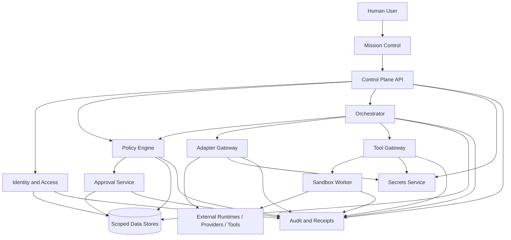

# SEC-001 — Agent OS Security Architecture

> **Status: Draft.** This document defines the proposed security architecture for the first Agent OS MVP and its controlled evolution. It does not approve a final identity provider, secret manager, sandbox technology, cryptographic profile, remote-access method, production deployment, or regulated-data use.

## 1. Document purpose

This document defines how Agent OS protects:

- people and workload identities;
- organizations, workspaces, and projects;
- tasks, runs, approvals, and policies;
- agents, adapters, models, tools, and MCP servers;
- files, repositories, memory, artifacts, and audit evidence;
- secrets and credentials;
- local processes, workers, networks, and stores;
- backups and recovery operations;
- software supply chain and releases.

It establishes:

- security objectives;
- trust assumptions;
- defense-in-depth controls;
- enforcement points;
- security zones and boundaries;
- authentication and authorization principles;
- workspace isolation;
- human approval controls;
- sandbox and tool controls;
- data and privacy controls;
- network and integration controls;
- audit and incident controls;
- secure development and quality gates;
- initial security requirements;
- architecture decisions still requiring ADRs.

The detailed threat analysis belongs in `THR-001`.

## 2. Security scope

### 2.1 In-scope MVP

- local Linux/WSL deployment;
- authenticated access;
- one organization context;
- multiple isolated workspaces;
- a small trusted team;
- predefined platform and workspace roles;
- human and workload identities;
- Codex, Hermes, and Claude Code adapters;
- selected model providers;
- approved files, repositories, tools, and optional MCP servers;
- durable tasks and runs;
- exact approval for consequential actions;
- memory and artifact protection;
- audit events and receipts;
- usage and cost evidence;
- backup and restore;
- operational health;
- secure local configuration;
- software dependency and build controls.

### 2.2 Excluded from MVP

- public SaaS;
- anonymous users;
- public tenant onboarding;
- unrestricted remote access;
- production credentials;
- production deployment control;
- financial posting;
- autonomous merge or force push;
- unrestricted shell or host access;
- unrestricted external messaging;
- unbounded plugin installation;
- regulated/sensitive-data processing without separate approval;
- high availability and multi-region security;
- public extension marketplace;
- self-modifying security policy;
- agent-generated approvals.

## 3. Security objectives

Agent OS security must provide:

1. **Identity assurance** — every protected action is attributable.
2. **Workspace isolation** — one workspace cannot access another by default.
3. **Least privilege** — users, agents, workers, adapters, and tools receive only required authority.
4. **Human control** — consequential actions require informed approval.
5. **Execution containment** — commands and file operations are bounded.
6. **Secret protection** — raw secrets remain outside ordinary application data.
7. **Data protection** — classification controls disclosure, retention, export, and backup.
8. **Integrity** — task snapshots, approvals, artifacts, events, and backups are verifiable.
9. **Availability with safe degradation** — failed dependencies do not produce false success.
10. **Accountability** — significant actions produce durable evidence.
11. **Recoverability** — backup and restore preserve control state and security semantics.
12. **Supply-chain assurance** — dependencies, builds, plugins, and updates are governed.
13. **Provider neutrality** — no provider or runtime becomes an implicit security authority.
14. **Secure defaults** — risky capabilities are disabled until explicitly enabled.
15. **Fail-closed consequential execution** — unknown security state blocks protected effects.

## 4. Security principles

### `SAP-001 — Control plane owns authority`

External runtimes, providers, adapters, workers, and tools may execute capabilities but do not grant permissions or approvals.

### `SAP-002 — Default deny`

Unknown identity, capability, target, classification, destination, approval, or policy state results in denial or a safe waiting state.

### `SAP-003 — Authenticate every actor`

Human users, adapters, workers, integrations, and internal service identities must be attributable.

### `SAP-004 — Authorize every protected action`

Successful authentication does not imply workspace or capability authorization.

### `SAP-005 — Separate capability from permission`

Registration, connectivity, installation, and capability declaration do not grant authority.

### `SAP-006 — Exact approval before consequential effect`

Approval binds to the normalized action, target, parameters, policy context, and expiry.

### `SAP-007 — Workspace scope everywhere`

Authorization, storage, events, caches, indexes, secrets, tools, costs, and audit queries preserve workspace scope.

### `SAP-008 — Isolate execution`

Untrusted code and commands execute outside the control-plane process with constrained resources.

### `SAP-009 — Treat external content as untrusted`

Prompts, model output, tool output, repository content, artifacts, and MCP descriptions cannot grant authority.

### `SAP-010 — Secrets are references`

Raw credentials are not stored in tasks, memory, artifacts, logs, audit records, or source control.

### `SAP-011 — Record without leaking`

Security evidence is retained while secrets and unnecessary sensitive content are redacted.

### `SAP-012 — Unknown is not safe`

Unknown side effects, health, identity, model, or evidence do not become implicit success.

### `SAP-013 — Recovery revalidates security`

Retry, resume, restore, rerouting, and recovery re-evaluate current permissions and controls.

### `SAP-014 — Security controls are independently testable`

Policy, authorization, workspace isolation, approval, sandbox, secret, and network controls require negative tests.

### `SAP-015 — No prompt can override policy`

Instructions inside tasks, memory, artifacts, repositories, tools, or model output cannot expand authority.

## 5. Security model overview



## 6. Security zones

| Zone ID | Zone | Trust posture |
|---|---|---|
| `SZ-001` | User Device / Browser | Untrusted client, authenticated session |
| `SZ-002` | Control Plane | Highest application authority |
| `SZ-003` | Adapter Zone | Restricted translator processes |
| `SZ-004` | Execution/Sandbox Zone | Untrusted execution, least privilege |
| `SZ-005` | Protected Data Zone | Persistent operational and evidence stores |
| `SZ-006` | Secret Zone | Restricted credential access |
| `SZ-007` | Observability Zone | Minimized operational telemetry |
| `SZ-008` | Backup/Recovery Zone | Privileged recovery data and operations |
| `SZ-009` | External Provider/Tool Zone | Untrusted external dependency |
| `SZ-010` | Administrative Maintenance Zone | Restricted upgrades, migrations, restore |

## 7. Trust boundaries

| Boundary ID | Boundary | Primary controls |
|---|---|---|
| `TB-001` | Browser ↔ API | Session security, CSRF, validation, CSP |
| `TB-002` | Identity ↔ workspace authorization | Membership, role, scope, revocation |
| `TB-003` | Control plane ↔ adapter | Workload identity, contract validation, least privilege |
| `TB-004` | Adapter ↔ runtime/provider | Egress control, data minimization, evidence |
| `TB-005` | Orchestrator ↔ Tool Gateway | Policy, approval, action fingerprint |
| `TB-006` | Tool Gateway ↔ sandbox | Capability token, target scope, limits |
| `TB-007` | Sandbox ↔ host/files/network | Mounts, path controls, process/network isolation |
| `TB-008` | Services ↔ secrets | Reference resolution, bounded delivery, redaction |
| `TB-009` | Services ↔ stores | Workspace scope, transactions, encryption, integrity |
| `TB-010` | Workspace A ↔ Workspace B | Mandatory scope, query/index/cache isolation |
| `TB-011` | Audit writer ↔ evidence store | Append controls, integrity, restricted read |
| `TB-012` | Backup utility ↔ stores/target | Approval, maintenance mode, encryption, manifest |
| `TB-013` | Local host ↔ external network | Deny-by-default egress, TLS, allowlists |
| `TB-014` | Requester ↔ approver | Eligibility, independence, exact scope |
| `TB-015` | Build pipeline ↔ release/runtime | Provenance, dependency verification, signed evidence |

## 8. Protected assets

### 8.1 High-value control assets

- workspace membership and roles;
- policy versions;
- permission grants;
- approval decisions and consumptions;
- emergency-stop state;
- task snapshots;
- run and attempt state;
- adapter and tool configuration;
- secret references;
- backup and restore controls.

### 8.2 High-value information assets

- private source code;
- client/project files;
- confidential memory;
- artifacts;
- audit evidence;
- usage and cost records;
- provider/model configuration;
- backup sets.

### 8.3 High-impact capabilities

- file write/delete;
- shell/process execution;
- package/plugin installation;
- network access;
- Git commit/push/PR;
- message/calendar mutation;
- database mutation;
- restore and migration;
- permission or policy change;
- production access;
- financial action.

## 9. Identity architecture

Agent OS recognizes separate identity types:

- `human`;
- `agent`;
- `adapter`;
- `worker`;
- `service`;
- `integration`;
- `backup_operator_process`.

### Identity requirements

1. Identity type is explicit.
2. Human identity is required for human approval.
3. Agent/workload identities cannot become human.
4. Every service/worker identity has a narrow purpose.
5. Shared generic identities are discouraged.
6. Identity identifiers are stable and non-reusable.
7. Revoked identities cannot continue through stale sessions or leases.
8. Identity events are auditable.

A dedicated identity specification commonly referenced as `IAM-001` remains **proposed/unregistered** until the document register is updated.

## 10. Human authentication

Candidate mechanisms:

- local account with strong password;
- operating-system identity;
- local OIDC provider;
- another approved identity source.

Minimum requirements:

- protected credential verification;
- rate limiting;
- session binding;
- secure password storage if applicable;
- account disablement;
- failed-login evidence;
- optional MFA-ready architecture;
- no default shared admin credential;
- bootstrap procedure;
- recovery procedure.

Final mechanism requires an ADR.

## 11. Session security

Sessions should provide:

- unpredictable session identifiers;
- secure cookie flags where cookies are used;
- `HttpOnly`;
- `SameSite`;
- TLS when crossing an untrusted boundary;
- idle timeout;
- absolute timeout;
- revocation;
- session rotation after authentication/privilege change;
- CSRF protection;
- reauthentication for selected high-risk operations;
- identity and scope refresh.

A session must not cache stale authority indefinitely.

## 12. Workload identity

Adapters, workers, gateways, and services require workload identity.

A workload identity should be bound to:

- component type;
- instance/build version;
- allowed interface;
- allowed job/capability;
- network location or process boundary;
- expiry/rotation;
- revocation.

A worker identity must not authorize:

- policy changes;
- role changes;
- approvals;
- arbitrary workspace access;
- unrelated queue consumption.

## 13. Authorization model

The architecture combines:

- predefined roles;
- workspace membership;
- capability permissions;
- resource and target scope;
- data classification;
- contextual policy;
- action risk;
- exact approval;
- time/cost/attempt bounds.

Conceptually:

```text
authorization =
identity
+ membership
+ role
+ capability grant
+ resource scope
+ data class
+ current policy
+ action risk
+ approval
+ runtime conditions
```

Role alone is not sufficient for consequential execution.

## 14. Roles

Proposed platform/workspace roles:

- Product / Workspace Owner;
- Builder-Operator;
- Technical Operator;
- Reviewer / Approver;
- Auditor;
- Contributor / Artifact Consumer.

Role rules:

- least privilege;
- explicit workspace assignment;
- separation of platform versus workspace authority;
- no automatic technical-operator content access;
- no automatic approver authority for all domains;
- auditors are read-only by default;
- agents and workers do not receive human roles.

## 15. Separation of duties

Security-sensitive duties should be separated where risk warrants.

Examples:

- requester versus independent approver;
- developer versus release approver;
- backup creator versus restore approver;
- policy author versus policy publisher;
- secret administrator versus ordinary operator;
- workspace owner versus platform security authority;
- auditor versus mutable operations.

The MVP may use the same human for several low-risk duties, but the system must record the identity and required independence level.

## 16. Workspace isolation

Workspace is the principal authorization and data-isolation boundary.

Required controls:

1. workspace ID on protected records or immutable ownership path;
2. server-side predicates on every data access path;
3. workspace-aware cache keys;
4. workspace-aware event/job payloads;
5. workspace-aware artifact and memory prefixes;
6. workspace filtering before search/vector ranking;
7. workspace-scoped secret grants;
8. workspace-scoped adapter/tool enablement;
9. workspace-scoped cost and audit queries;
10. negative tests for direct IDs, search, export, preview, and caches.

Cross-workspace access is denied by default.

## 17. Authorization precedence

Proposed precedence:

```text
hard prohibition
→ emergency stop
→ platform security policy
→ organization policy
→ workspace policy
→ explicit permission grant
→ task/run constraints
→ approval
→ default deny
```

A lower layer may narrow authority but cannot override a higher-level denial.

## 18. Policy enforcement architecture

Policy evaluation receives:

- identity and type;
- workspace/project;
- action class;
- normalized target;
- exact parameters;
- data classification;
- side-effect class;
- reversibility;
- capability/tool/provider;
- network destination;
- cost/time/attempt context;
- grants;
- approval state;
- emergency stop;
- policy versions.

Outputs:

- `ALLOW`;
- `ALLOW_WITH_GUARDS`;
- `REQUIRE_APPROVAL`;
- `DENY`;
- `UNKNOWN_BLOCK`.

A detailed policy-enforcement specification commonly referenced as `POL-001` remains **proposed/unregistered**.

## 19. Approval security

Approval security requires:

- eligible human identity;
- delegated authority;
- required independence;
- exact action fingerprint;
- normalized target;
- exact parameters or content hash;
- expected effects;
- risk summary;
- policy reason;
- expiry;
- one-time consumption;
- immutable decision;
- replay prevention;
- material-change invalidation.

### Approval cannot be granted by

- task prompt;
- model output;
- agent;
- adapter;
- worker;
- tool response;
- MCP server;
- unverified external callback.

### Approval consumption

Approval consumption must be atomic or equivalent with authorization of one attempt.

A failed or timed-out attempt does not restore the approval automatically.

## 20. Consequential action classes

Examples requiring approval or stronger controls:

- file deletion;
- destructive overwrite;
- Git commit;
- push;
- pull-request creation;
- package/plugin installation;
- external message send;
- calendar event mutation;
- database write/delete;
- network expansion;
- secret use for high-impact target;
- policy/role change;
- restore;
- destructive migration;
- production or financial action.

Production and financial writes remain prohibited in MVP even if a user attempts to approve them.

## 21. Emergency stop

Emergency stop may target:

- platform;
- workspace;
- adapter;
- provider;
- tool;
- capability;
- run.

Activation must:

- block new protected dispatch;
- block approval consumption;
- revoke or suspend affected grants;
- mark active work for pause/cancel/reconciliation;
- preserve evidence;
- notify authorized operators.

Release requires a separate authorized human action and cannot be triggered by prompt content.

## 22. Secret architecture

Ordinary Agent OS records may store:

- secret reference ID;
- owner;
- purpose;
- workspace;
- capability;
- target;
- expiry/rotation metadata;
- last-use evidence.

They must not store:

- plaintext API keys;
- passwords;
- refresh tokens;
- private keys;
- production credentials;
- secret values in prompts or memory.

A dedicated secrets specification commonly referenced as `SEC-002` remains **proposed/unregistered**.

## 23. Secret handling lifecycle

```text
register reference
→ validate metadata
→ authorize exact use
→ resolve/inject into minimum component
→ execute bounded request
→ revoke/expire/rotate
→ retain non-secret evidence
```

### Rules

- only the component needing the secret receives it;
- prefer short-lived credentials;
- secret values are redacted from errors and telemetry;
- secret use is attributable;
- secret rotation does not require rewriting ordinary domain records;
- missing secret causes safe failure;
- secret scanning covers code, config, logs, memory, and artifacts.

## 24. Configuration security

Configuration should be divided into:

- public defaults;
- internal operational configuration;
- confidential endpoint/account metadata;
- secret references;
- local environment overrides.

Rules:

- secrets are not committed to Git;
- environment files are excluded from source control;
- configuration schema is validated;
- unsafe defaults fail readiness;
- configuration changes are auditable;
- consequential security changes require approval;
- build-time and runtime configuration are distinguishable.

## 25. Network security

Default posture:

- bind UI/API to localhost or explicitly approved local interface;
- no public exposure;
- private adapter/store ports;
- database not publicly reachable;
- sandbox egress denied by default;
- provider/tool destinations allowlisted;
- TLS for untrusted network paths;
- redirects revalidated;
- SSRF and DNS rebinding controls;
- local/private address restrictions;
- outbound proxy policy where used.

Remote trusted-team access is deferred until a separate security design exists.

## 26. Egress controls

An egress rule should constrain:

- source component;
- workspace;
- capability;
- host/IP;
- port/protocol;
- URL path or API scope where practical;
- data classes;
- secret reference;
- expiry;
- approval requirement;
- rate/budget limit.

Wildcard egress requires explicit security review.

## 27. Ingress controls

MVP ingress is limited to:

- local browser/user traffic;
- internal local process/service traffic.

Public callbacks and webhooks are not assumed.

Any future inbound callback requires:

- authenticated sender;
- signature verification;
- replay protection;
- idempotency;
- schema validation;
- rate limiting;
- network exposure review;
- secret rotation;
- denial-of-service controls.

## 28. Adapter security

Adapters are restricted translators, not trusted policy authorities.

Controls:

- separate process where practical;
- workload identity;
- narrow filesystem and network access;
- explicit capability declaration;
- version compatibility;
- no raw workspace-wide access;
- no secret access beyond required references;
- no direct human approval;
- no direct policy mutation;
- output and event validation;
- health and limitation reporting;
- revocation and emergency stop.

## 29. Agent runtime security

Hermes and Codex are treated as external/untrusted execution dependencies.

Agent OS must not assume they:

- enforce workspace policy;
- preserve secrets correctly;
- report complete state;
- expose every tool call;
- support cancellation;
- support idempotency;
- use the configured model;
- return safe content.

Capabilities not proven through the contract remain unavailable or unknown.

## 30. Model provider security

Controls include:

- approved model profiles;
- explicit provider/model;
- data-class restrictions;
- context minimization;
- provider retention/training metadata where known;
- secret isolation;
- request and response correlation;
- rate/quota controls;
- no silent fallback;
- actual model identity recorded where available;
- generated output treated as untrusted.

Sensitive data must not be sent merely because a provider is configured.

## 31. Tool Gateway security

The Tool Gateway is the final security choke point for protected actions.

It must:

- receive normalized action and target;
- revalidate policy;
- verify approval;
- enforce resource, path, network, and cost bounds;
- resolve only required secrets;
- dispatch to sandbox or approved integration;
- collect result and side-effect certainty;
- generate a receipt;
- enforce revocation and emergency stop.

Protected tools must not be callable directly from the browser, adapter, or model.

## 32. MCP security

MCP is a transport/capability protocol, not an authorization system.

Controls:

- allowlisted servers;
- versioned capability snapshot;
- read-only validation;
- exact schemas;
- target normalization;
- output sanitization;
- workspace/data-class controls;
- secret isolation;
- network allowlisting;
- capability drift detection;
- no implicit trust of server descriptions or instructions;
- negative tests;
- no direct access to all memory or files.

A dedicated MCP security/profile document should be created only after formal adoption.

## 33. Sandbox security

The sandbox protects the host and control plane from untrusted execution.

Minimum controls:

- explicit mounts;
- read-only versus writable mounts;
- canonical path checks;
- symlink/traversal protection;
- process isolation;
- CPU/memory/time/output limits;
- process-count limits;
- network deny by default;
- no host Docker socket;
- no broad home-directory access;
- no production credentials;
- controlled environment variables;
- cleanup;
- cancellation;
- evidence and exit status.

A dedicated sandbox specification commonly referenced as `SAN-001` remains **proposed/unregistered**.

## 34. Sandbox trust model

The sandboxed workload is untrusted even when:

- generated by an approved model;
- produced from an approved repository;
- launched by an authorized user;
- executed by a validated adapter.

Repository content, dependency scripts, tests, and generated code may all be malicious.

## 35. Filesystem security

Controls:

- approved workspace roots;
- normalized paths;
- no traversal outside roots;
- symlink resolution;
- file type/size checks;
- read/write/delete distinctions;
- atomic writes where practical;
- backup before selected destructive changes;
- secret-file deny patterns;
- permission preservation where appropriate;
- integrity hashes for artifacts/checkpoints;
- deletion approval.

## 36. Git security

Git remains authoritative for repository history.

Allowed under guards:

- status;
- log;
- branch list;
- diff;
- approved file reads;
- uncommitted patches;
- tests.

Potentially approval-gated:

- branch creation;
- commit;
- push;
- PR creation.

Prohibited:

- autonomous merge;
- force push;
- history rewrite;
- protected-branch deletion;
- bypassing required CI/review;
- using production deploy credentials.

Git evidence includes repository, branch/worktree, before/after commit, diff hash, action, approval, result, and external ID.

## 37. Package and plugin security

Installation of packages, plugins, extensions, skills, or MCP servers is consequential.

Controls:

- approved source;
- exact name/version;
- integrity/signature where available;
- dependency review;
- license/security review;
- sandboxed installation;
- no install scripts with unrestricted host access;
- approval;
- inventory;
- revocation/removal;
- vulnerability monitoring;
- no self-modifying agent skills in MVP.

## 38. Software supply-chain security

Required practices:

- dependency lockfiles;
- reproducible builds where practical;
- pinned versions;
- dependency vulnerability scanning;
- secret scanning;
- static analysis;
- license review;
- provenance/build metadata;
- protected release branches/tags;
- review gates;
- CI evidence;
- artifact checksums;
- controlled update process;
- rollback/forward-recovery plan.

Final release process belongs in `DEV-001`, `QAG-001`, and `OPS-001`.

## 39. Source-code security

- branch/PR workflow;
- least-privilege repository access;
- no secrets in Git;
- protected main branch;
- mandatory review for security-sensitive changes;
- CI tests;
- dependency checks;
- signed commits/tags only if adopted by ADR;
- no agent autonomous merge;
- generated changes remain reviewable;
- security architecture changes require documentation updates.

## 40. API security

The control-plane API should enforce:

- authentication;
- workspace binding;
- object-level authorization;
- schema validation;
- content and size limits;
- idempotency;
- rate limiting;
- CSRF protection where relevant;
- CORS restrictions;
- stable safe errors;
- correlation;
- audit for protected commands;
- pagination-token scope;
- no raw secret fields;
- no mass-assignment vulnerabilities.

Detailed API rules belong in `API-001`.

## 41. Web UI security

Controls:

- safe session handling;
- CSP;
- output encoding;
- protection against XSS;
- CSRF controls;
- safe external links;
- no secret display;
- no client-only authorization;
- safe artifact preview;
- clear stale/unknown state;
- reauthentication for selected actions;
- secure storage of only non-sensitive client preferences.

## 42. Artifact security

Artifact controls include:

- workspace authorization;
- classification;
- media-type validation;
- size limits;
- integrity hash;
- malware/active-content handling where applicable;
- safe preview;
- no automatic execution;
- lifecycle and review;
- controlled export;
- retention and deletion;
- backup;
- provenance.

An artifact is not trusted solely because it was generated by an approved agent.

## 43. Memory security

Memory controls include:

- workspace-first retrieval;
- source and authority labels;
- secret exclusion;
- prompt-injection resistance;
- correction and deletion;
- classification;
- provider/tool disclosure checks;
- index partition/filter;
- no global post-filtered vector search;
- no autonomous truth promotion;
- retrieval evidence for high-risk use.

## 44. Data classification

Provisional classes:

- `PUBLIC`;
- `INTERNAL`;
- `CONFIDENTIAL`;
- `SECRET`;
- `RESTRICTED`.

Rules:

- highest applicable class governs;
- derived content inherits classification;
- `SECRET` values remain outside ordinary content;
- `RESTRICTED` processing is excluded unless separately approved;
- export, provider use, backup, retention, and preview respect classification.

A dedicated classification/retention document commonly referenced as `DAT-002` remains **proposed/unregistered**.

## 45. Data protection at rest

Requirements depend on classification and selected stores.

The architecture should support:

- access controls;
- host/filesystem protection;
- database authentication;
- encrypted confidential backups;
- encrypted sensitive content where selected;
- separated key material;
- integrity verification;
- secure deletion limitations;
- key rotation/migration.

No cryptographic algorithm is selected by this draft.

## 46. Data protection in transit

Use protected transport across untrusted boundaries.

Requirements:

- TLS or equivalent;
- certificate/endpoint validation;
- no downgrade;
- secure local IPC where practical;
- protected credentials;
- timeout and replay controls;
- no sensitive query-string leakage;
- proxy/header handling.

Localhost is not automatically considered safe from all local processes.

## 47. Integrity controls

Integrity mechanisms may include:

- database constraints;
- optimistic concurrency;
- immutable task snapshots;
- action fingerprints;
- content hashes;
- event schema/version validation;
- append-oriented evidence;
- approval uniqueness;
- worker fencing;
- backup checksums;
- migration verification;
- release artifact hashes.

## 48. Audit architecture

Security-relevant events include:

- login/logout/failure;
- account/session changes;
- membership/role changes;
- policy/grant changes;
- emergency stop;
- adapter/tool registration and validation;
- secret reference use;
- task/run dispatch;
- approval request/decision/consumption;
- protected tool effects;
- file/Git actions;
- provider/model routing;
- memory/artifact lifecycle;
- export;
- backup/restore;
- migration;
- security denial;
- evidence gap.

A detailed audit-event contract commonly referenced as `AUD-001` remains **proposed/unregistered**.

## 49. Audit protection

Audit requirements:

- append-oriented writes;
- restricted write path;
- schema version;
- actor and identity type;
- workspace;
- correlation;
- result and source class;
- redaction;
- integrity controls;
- backup;
- authorized read/export;
- explicit gaps.

Ordinary operators cannot silently rewrite audit history.

## 50. Logging and telemetry security

Logs, metrics, and traces must:

- exclude raw secrets;
- minimize content;
- preserve correlation;
- separate workspace-safe metadata;
- have bounded retention;
- expose collection gaps;
- avoid full prompts/documents by default;
- restrict access;
- protect exported diagnostics.

Observability does not replace audit.

## 51. Backup security

Backup controls:

- authorized backup process;
- explicit scope;
- complete manifest;
- integrity checks;
- protected target;
- encryption according to classification;
- rotation;
- access logging;
- restore testing;
- secure disposal;
- secret handling;
- no claim of completeness for partial backup.

## 52. Restore security

Restore requires:

- exact approval;
- eligible operator;
- backup integrity and compatibility validation;
- maintenance mode;
- target environment verification;
- dependency-aware order;
- lease invalidation;
- revalidation of nonterminal runs;
- deletion/expiry reconciliation;
- security policy reapplication;
- post-restore verification;
- recovery evidence.

A restore does not automatically authorize replay of in-flight work.

## 53. Migration security

Destructive or high-risk migrations require:

- approved plan;
- validated backup;
- schema compatibility;
- maintenance mode where needed;
- least-privilege migration identity;
- integrity checks;
- verification queries;
- rollback or forward-recovery;
- audit evidence.

Migration scripts are untrusted code until reviewed and tested.

## 54. Incident response architecture

The MVP should support:

- incident identification;
- classification;
- containment;
- emergency stop;
- identity/session revocation;
- secret rotation;
- adapter/tool disablement;
- evidence preservation;
- recovery;
- communication;
- post-incident review.

A detailed incident response plan may live in `OPS-001` or a later controlled incident document.

## 55. Security incident classes

Examples:

- suspected secret exposure;
- workspace data leakage;
- unauthorized tool action;
- approval bypass/replay;
- sandbox escape;
- malicious dependency/plugin;
- provider data disclosure;
- audit tampering;
- backup compromise;
- unauthorized account/session;
- production credential discovery;
- repeated unknown side effects.

## 56. Containment actions

Possible controlled actions:

- activate emergency stop;
- disable adapter/tool/provider profile;
- revoke sessions;
- revoke grants;
- rotate secrets;
- isolate worker/sandbox;
- switch to read-only/maintenance mode;
- block network egress;
- preserve logs/evidence;
- pause affected runs;
- block exports;
- initiate backup before remediation where safe.

Containment actions are attributable and auditable.

## 57. Vulnerability management

The process should cover:

- dependency scanning;
- operating-system/package updates;
- application vulnerabilities;
- container/base image vulnerabilities if used;
- adapter/runtime advisories;
- MCP/plugin advisories;
- secret exposure;
- prioritization;
- remediation deadlines;
- exceptions;
- verification;
- release evidence.

Exact severity SLAs belong in `QAG-001` or `OPS-001`.

## 58. Third-party risk

Before enabling a provider, tool, package, MCP server, or integration:

- identify owner/vendor;
- review data use;
- review security posture;
- review update mechanism;
- review permissions;
- review supply chain;
- review retention/training behavior;
- review failure/incident history where available;
- define exit/revocation;
- define compatibility and evidence.

No third party becomes trusted merely by popularity.

## 59. Privacy architecture

Privacy controls:

- purpose limitation;
- minimization;
- classification;
- workspace isolation;
- user visibility;
- correction/deletion;
- retention;
- provider/tool disclosure checks;
- export control;
- telemetry minimization;
- no hidden profiling;
- no regulated data by default.

Conversations and project data remain private from unrelated external parties except as explicitly disclosed through approved integrations.

## 60. Security states

Common security state values:

```text
secure_ready
secure_degraded
blocked_policy
blocked_identity
blocked_approval
blocked_secret
blocked_network
blocked_sandbox
blocked_integrity
blocked_audit
emergency_stopped
unknown_block
```

These states should be visible to operators without exposing sensitive details.

## 61. Security error model

Representative error codes:

```text
SEC_AUTHENTICATION_REQUIRED
SEC_SESSION_EXPIRED
SEC_SESSION_REVOKED
SEC_WORKSPACE_DENIED
SEC_ROLE_DENIED
SEC_CAPABILITY_DENIED
SEC_POLICY_DENIED
SEC_APPROVAL_REQUIRED
SEC_APPROVAL_INVALID
SEC_APPROVAL_REPLAY
SEC_TARGET_OUT_OF_SCOPE
SEC_DATA_CLASS_DENIED
SEC_SECRET_UNAVAILABLE
SEC_NETWORK_DENIED
SEC_SANDBOX_UNAVAILABLE
SEC_INTEGRITY_FAILURE
SEC_AUDIT_UNAVAILABLE
SEC_EMERGENCY_STOP
SEC_UNTRUSTED_OUTPUT
SEC_UNSUPPORTED_SECURITY_STATE
```

Errors must provide a safe explanation, correlation ID, and remediation path without leaking secrets or hidden policy details.

## 62. Security requirements catalogue

### Identity and session

- `SEC-REQ-ID-001` — Every protected human action is attributable to an authenticated identity.
- `SEC-REQ-ID-002` — Every worker, adapter, and service uses an explicit workload identity.
- `SEC-REQ-ID-003` — Identity type is immutable during ordinary operation.
- `SEC-REQ-ID-004` — Sessions expire and can be revoked.
- `SEC-REQ-ID-005` — Privilege changes invalidate or refresh affected sessions.
- `SEC-REQ-ID-006` — Shared default administrator credentials are prohibited.
- `SEC-REQ-ID-007` — Failed authentication attempts are rate-limited and evidenced.
- `SEC-REQ-ID-008` — Human approval requires a human identity.

### Authorization and isolation

- `SEC-REQ-AZ-001` — All protected operations perform server-side authorization.
- `SEC-REQ-AZ-002` — Workspace scope is mandatory for protected records and operations.
- `SEC-REQ-AZ-003` — Direct object identifiers cannot bypass workspace authorization.
- `SEC-REQ-AZ-004` — Search, vector retrieval, cache, export, and preview enforce workspace scope.
- `SEC-REQ-AZ-005` — Roles do not implicitly grant unrelated capabilities.
- `SEC-REQ-AZ-006` — Capability registration does not grant permission.
- `SEC-REQ-AZ-007` — Unknown authorization state fails closed.
- `SEC-REQ-AZ-008` — Platform prohibitions cannot be overridden by lower-level policy.
- `SEC-REQ-AZ-009` — Agents cannot modify their own permissions.
- `SEC-REQ-AZ-010` — Auditors remain read-only by default.

### Policy and approval

- `SEC-REQ-PA-001` — Protected actions are normalized before policy evaluation.
- `SEC-REQ-PA-002` — Consequential actions require exact approval unless explicitly prohibited.
- `SEC-REQ-PA-003` — Approval binds target, parameters, fingerprint, expiry, and policy context.
- `SEC-REQ-PA-004` — Approval is consumed at most once.
- `SEC-REQ-PA-005` — Material changes invalidate approval.
- `SEC-REQ-PA-006` — Agents, adapters, workers, and tools cannot approve.
- `SEC-REQ-PA-007` — Required approver independence is enforced.
- `SEC-REQ-PA-008` — Approval does not imply successful execution.
- `SEC-REQ-PA-009` — Prohibited MVP actions cannot be enabled by approval.
- `SEC-REQ-PA-010` — Emergency stop blocks new protected dispatch.

### Secrets

- `SEC-REQ-SE-001` — Raw secrets are absent from ordinary domain storage.
- `SEC-REQ-SE-002` — Raw secrets are absent from logs, audit, memory, artifacts, and source control.
- `SEC-REQ-SE-003` — Secrets are resolved only for an authorized capability and target.
- `SEC-REQ-SE-004` — Secret use is attributable.
- `SEC-REQ-SE-005` — Secret rotation/revocation is supported.
- `SEC-REQ-SE-006` — Missing or expired secrets block dependent actions.
- `SEC-REQ-SE-007` — Secret scanning is part of quality gates.
- `SEC-REQ-SE-008` — Production credentials are excluded from the MVP environment.

### Network and integration

- `SEC-REQ-NW-001` — Network egress is denied by default.
- `SEC-REQ-NW-002` — Destinations are allowlisted by capability and data class.
- `SEC-REQ-NW-003` — Redirects and resolved destinations are revalidated.
- `SEC-REQ-NW-004` — SSRF, DNS rebinding, and private-address access are controlled.
- `SEC-REQ-NW-005` — Public ingress is disabled by default.
- `SEC-REQ-NW-006` — Protected integration output is validated and treated as untrusted.
- `SEC-REQ-NW-007` — Version incompatibility blocks dispatch.
- `SEC-REQ-NW-008` — Silent provider/model fallback is prohibited.
- `SEC-REQ-NW-009` — MCP servers receive no implicit authority.
- `SEC-REQ-NW-010` — Integration health and validation are distinct.

### Sandbox and tools

- `SEC-REQ-SB-001` — Untrusted commands run outside the control-plane process.
- `SEC-REQ-SB-002` — Sandbox mounts are explicit and least privilege.
- `SEC-REQ-SB-003` — Path traversal and symlink escape are prevented.
- `SEC-REQ-SB-004` — CPU, memory, time, process, and output limits are enforced.
- `SEC-REQ-SB-005` — Sandbox network is denied by default.
- `SEC-REQ-SB-006` — Host Docker socket and broad home-directory access are denied by default.
- `SEC-REQ-SB-007` — Tool Gateway is mandatory for protected effects.
- `SEC-REQ-SB-008` — Unknown side effects block automatic retry.
- `SEC-REQ-SB-009` — Package/plugin installation requires governed approval.
- `SEC-REQ-SB-010` — Sandbox execution produces attributable evidence.

### Data, memory, and artifacts

- `SEC-REQ-DT-001` — Data classification is retained through transformations.
- `SEC-REQ-DT-002` — Derived content inherits classification unless declassified through governance.
- `SEC-REQ-DT-003` — Restricted data is excluded by default.
- `SEC-REQ-DT-004` — Memory retrieval filters workspace before relevance ranking.
- `SEC-REQ-DT-005` — Generated memory is not automatically authoritative.
- `SEC-REQ-DT-006` — Artifact content is integrity-checked.
- `SEC-REQ-DT-007` — Artifact preview does not execute active content.
- `SEC-REQ-DT-008` — Deletion propagates to indexes and caches.
- `SEC-REQ-DT-009` — External disclosure is minimized and policy-controlled.
- `SEC-REQ-DT-010` — Unknown or stale source state remains visible.

### Audit and evidence

- `SEC-REQ-AU-001` — Security-relevant events are append-oriented.
- `SEC-REQ-AU-002` — Audit events include identity, scope, result, and correlation.
- `SEC-REQ-AU-003` — Ordinary application APIs cannot rewrite audit history.
- `SEC-REQ-AU-004` — Missing evidence creates an explicit gap.
- `SEC-REQ-AU-005` — Raw secrets are redacted from evidence.
- `SEC-REQ-AU-006` — Consequential actions link policy, approval, attempt, and result.
- `SEC-REQ-AU-007` — Audit queries enforce workspace authorization.
- `SEC-REQ-AU-008` — Evidence exports are scoped, manifested, and auditable.

### Supply chain and operations

- `SEC-REQ-SC-001` — Dependencies are locked and inventoried.
- `SEC-REQ-SC-002` — Vulnerability and secret scans run before release.
- `SEC-REQ-SC-003` — Security-sensitive changes require review.
- `SEC-REQ-SC-004` — Release artifacts include build/version provenance.
- `SEC-REQ-SC-005` — Untrusted installation scripts do not receive unrestricted host access.
- `SEC-REQ-OP-001` — Backup sets are protected and integrity-checked.
- `SEC-REQ-OP-002` — Restore requires approval and maintenance mode.
- `SEC-REQ-OP-003` — Restored nonterminal work is reconciled before dispatch.
- `SEC-REQ-OP-004` — Security incidents support containment and evidence preservation.
- `SEC-REQ-OP-005` — Critical security-control failures block protected execution.

## 63. Security control matrix

| Control domain | Preventive | Detective | Corrective |
|---|---|---|---|
| Identity | Authentication, session policy | Login/session events | Revoke session/account |
| Authorization | Roles, grants, scope | Denial and access logs | Revoke role/grant |
| Approval | Exact fingerprint, one-time use | Consumption audit | Invalidate request |
| Secrets | Secret references, least privilege | Secret scanning/use logs | Rotate/revoke |
| Network | Egress allowlist | Flow/denial telemetry | Block destination |
| Sandbox | Isolation and limits | Escape/resource alerts | Kill/isolate worker |
| Data | Classification, workspace filters | Leakage/integrity tests | Correct/delete/reclassify |
| Memory | Source/authority controls | Conflict/stale detection | Correct/supersede/delete |
| Artifact | Integrity and safe preview | Hash/scan failures | Quarantine/delete |
| Audit | Append-oriented store | Gap/tamper detection | Preserve and investigate |
| Supply chain | Locks, review, signatures if adopted | Vulnerability scan | Upgrade/remove dependency |
| Backup | Encryption, manifests | Integrity/restore test | Recreate/rotate |
| Incident | Emergency stop | Alerts and reports | Contain, recover, review |

## 64. Security observability

Security metrics may include:

- failed logins;
- revoked sessions;
- authorization denials;
- cross-workspace denial attempts;
- approval age and replay attempts;
- secret-resolution failures;
- secret-scan findings;
- network denials;
- sandbox violations;
- tool-gateway denials;
- unknown side effects;
- adapter incompatibility;
- audit gaps;
- backup age/integrity;
- dependency vulnerabilities;
- emergency-stop activations;
- unresolved critical findings.

Metrics must avoid exposing sensitive content.

## 65. Security testing strategy

### Authentication/session tests

- invalid login;
- rate limiting;
- expiry;
- revocation;
- session fixation;
- privilege-change refresh;
- CSRF.

### Authorization tests

- direct object reference;
- route/query authorization;
- search/cache/export isolation;
- role escalation;
- agent self-elevation;
- workload identity misuse.

### Approval tests

- changed fingerprint;
- expiry;
- replay;
- requester self-approval;
- stale policy;
- cancellation;
- duplicate consumption.

### Sandbox/tool tests

- path traversal;
- symlink escape;
- resource exhaustion;
- network escape;
- Docker socket;
- secret environment leakage;
- command injection;
- protected gateway bypass.

### Integration tests

- malicious MCP description/output;
- invalid schema;
- provider/model mismatch;
- secret leakage;
- SSRF;
- redirect to disallowed host;
- unknown effect retry block.

### Data tests

- cross-workspace search/vector;
- artifact active content;
- memory prompt injection;
- deletion propagation;
- backup restore of deleted data;
- audit mutation.

### Supply-chain tests

- vulnerable dependency;
- unpinned version;
- malicious install script;
- secret in repository;
- provenance mismatch.

## 66. Security quality gates

Before MVP acceptance:

1. no unresolved critical authentication bypass;
2. no unresolved confirmed cross-workspace leakage;
3. no unresolved approval replay or bypass;
4. no raw secret in ordinary storage, logs, memory, artifacts, or Git;
5. no protected tool bypass around the gateway;
6. sandbox boundary tests pass for enabled capabilities;
7. unknown protected effects do not auto-retry;
8. public ingress remains disabled;
9. egress policy is enforced;
10. adapters and workers use explicit identities;
11. audit evidence is present for consequential actions;
12. backup integrity and restore security tests pass;
13. dependency and secret scans pass release gates;
14. emergency stop is tested;
15. all critical findings have owner and resolution.

## 67. Security acceptance scenarios

### Scenario 1 — Cross-workspace access

A user authorized only for Workspace A attempts direct ID, search, artifact, memory, audit, and export access to Workspace B.

Expected: all paths deny without revealing protected content.

### Scenario 2 — Prompt requests secret

A task asks the agent to print an API key.

Expected: prompt grants no authority; secret is not disclosed; denial is evidenced.

### Scenario 3 — Approval replay

A previously consumed approval is submitted for another attempt.

Expected: replay rejected; no effect; event recorded.

### Scenario 4 — Timeout with unknown effect

A protected external write times out without proof.

Expected: run becomes stale/unknown; automatic retry blocked.

### Scenario 5 — Malicious repository

Repository content attempts path escape, network exfiltration, and instruction override.

Expected: sandbox/gateway controls prevent escape and preserve evidence.

### Scenario 6 — Compromised MCP server

Server changes capability behavior and requests unrelated memory/secrets.

Expected: capability drift detected; request denied; server degraded/disabled.

### Scenario 7 — Restore

A backup containing nonterminal runs is restored.

Expected: leases invalidated; runs enter recovery; no blind redispatch.

### Scenario 8 — Dependency vulnerability

A critical vulnerability appears in an installed package.

Expected: finding recorded, affected capability assessed, update/disable decision governed.

## 68. Secure development requirements

Development should apply:

- threat-aware design review;
- branch and PR review;
- automated tests;
- static analysis;
- dependency scanning;
- secret scanning;
- security-focused code review;
- schema migration review;
- secure defaults;
- no debug bypass in accepted builds;
- no mock authorization in accepted workflows;
- release evidence;
- documented residual risk.

Detailed workflow belongs in `DEV-001`, `TST-001`, and `QAG-001`.

## 69. Security review triggers

A security review is mandatory when changing:

- identity/session mechanism;
- roles or approval authority;
- workspace scope;
- policy precedence;
- sandbox technology;
- network exposure;
- provider/tool/MCP set;
- secret mechanism;
- classification/retention;
- artifact preview;
- backup/restore;
- release pipeline;
- production access;
- financial capability;
- public ingress;
- plugin installation;
- event/callback contracts.

## 70. Security ADR backlog

### `ADR-TBD-SEC-001 — Human identity and session mechanism`

Compare local identity, OS identity, local OIDC, and alternatives.

### `ADR-TBD-SEC-002 — Workload identity and service authentication`

Define adapter, worker, gateway, and service identity.

### `ADR-TBD-SEC-003 — Secrets mechanism`

Compare OS keyring, encrypted local store, external secret manager, and credential broker.

### `ADR-TBD-SEC-004 — Sandbox technology`

Compare restricted process, container, VM/microVM, or hybrid.

### `ADR-TBD-SEC-005 — Network egress enforcement`

Define host firewall, proxy, namespace, container network, or combined controls.

### `ADR-TBD-SEC-006 — Audit integrity model`

Define append controls, tamper evidence, and evidence-store design.

### `ADR-TBD-SEC-007 — Encryption and key management profile`

Define transport, at-rest, backup, rotation, and recovery requirements.

## 71. Proposed companion security documents

The following documents are useful but remain **proposed/unregistered** until the document register is updated:

| Proposed ID | Proposed document |
|---|---|
| `IAM-001` | Identity and Access Control Architecture |
| `POL-001` | Policy Enforcement Model |
| `SAN-001` | Agent Execution Sandboxing Specification |
| `SEC-002` | Secrets Management Specification |
| `DAT-002` | Data Classification and Retention Policy |
| `AUD-001` | Audit Event and Evidence Contract |
| `PRI-001` | Privacy and Data Protection Plan |
| `MCP-001` | MCP Security and Conformance Profile |

These references must not be treated as approved controlled documents yet.

## 72. Requirement traceability

| Requirement domain | Security response |
|---|---|
| `FR-AUTH-*` | Identity, sessions, roles, revocation |
| `FR-WSP-*` | Workspace isolation and membership controls |
| `FR-AGT-*` | Adapter identity, validation, capability restrictions |
| `FR-MOD-*` | Provider/model classification and secret controls |
| `FR-TSK-*` | Task scope and immutable snapshots |
| `FR-RUN-*` | Durable dispatch, worker identity, recovery |
| `FR-APR-*` | Exact approval and one-time consumption |
| `FR-TOL-*` | Gateway, sandbox, files, network, secrets |
| `FR-MEM-*` | Source, authority, prompt-injection, isolation |
| `FR-ART-*` | Integrity, preview, export, retention |
| `FR-AUD-*` | Append evidence and gaps |
| `FR-CST-*` | Budget integrity and source labels |
| `FR-UI-*` | Secure session, safe rendering, honest state |
| `FR-OPS-*` | Health, backup, restore, emergency stop |
| `NFR-SEC-*` | Defense-in-depth security controls |
| `NFR-PRI-*` | Minimization, isolation, deletion |
| `AUT-001` | Autonomy, risk, approval, prohibition |

## 73. Mapping to containers

| Security concern | Primary containers |
|---|---|
| Browser/session | `CTR-001`, `CTR-002`, `CTR-022` |
| Workspace authorization | `CTR-002`, `CTR-015` |
| Orchestration security | `CTR-003`, `CTR-016` |
| Adapter security | `CTR-004`, `CTR-005`, `CTR-006` |
| Provider security | `CTR-007` |
| Tool enforcement | `CTR-008` |
| Sandbox | `CTR-009` |
| Memory | `CTR-010`, `CTR-018` |
| Artifacts | `CTR-011`, `CTR-017` |
| Audit | `CTR-012`, `CTR-019` |
| Cost/budget | `CTR-013` |
| Operations | `CTR-014`, `CTR-020`, `CTR-021` |
| Secrets | `CTR-023` |

## 74. Security risks

| Risk | Impact | Primary response |
|---|---|---|
| Workspace isolation defect | Confidentiality breach | Scope everywhere, negative tests |
| Approval replay | Duplicate effect | One-time atomic consumption |
| Prompt injection | Policy/tool bypass | Treat content as untrusted |
| Secret leakage | Credential compromise | References, redaction, scanning |
| Sandbox escape | Host compromise | Strong isolation and deny defaults |
| MCP server compromise | Exfiltration/actions | Allowlist, gateway, drift detection |
| Adapter compromise | Forged state/effects | Restricted identity and validation |
| Silent model fallback | Privacy/cost/quality change | Explicit policy/evidence |
| Unknown effect retried | Duplicate consequence | Side-effect-aware recovery |
| Malicious dependency | Supply-chain compromise | Lock, scan, review, isolate |
| Audit tampering | Accountability failure | Append controls and integrity |
| Backup theft | Broad data compromise | Encryption and access controls |
| Restore replay | Duplicate work | Recovery mode and reconciliation |
| Public exposure | Unauthorized access | Local bind and ingress controls |
| Overprivileged operator | Excessive access | Separation of duties |
| Stale session/grant | Continued unauthorized use | Revocation and refresh |
| Active artifact preview | Client compromise | Safe preview/quarantine |
| Vector search leakage | Cross-workspace disclosure | Scope before retrieval |
| Security-control outage | Unsafe execution | Fail closed for protected effects |

## 75. Assumptions

- the local host and user account receive basic OS hardening;
- Agent OS processes can run under restricted identities;
- explicit local paths and egress rules can be enforced;
- Hermes and Codex can be isolated behind adapters;
- protected actions can pass through a gateway;
- a secret mechanism can be selected;
- a relational store supports required constraints;
- backup integrity can be verified;
- operators can perform incident containment;
- representative security test fixtures can be created.

## 76. Constraints

- no public deployment;
- no production credentials;
- no production or financial writes;
- no autonomous merge;
- no unrestricted host shell;
- no unrestricted network egress;
- no raw secrets in ordinary storage;
- no agent approval;
- no prompt-based authority expansion;
- no regulated-data processing by default;
- no accepted mock security state;
- Git integration/versioning remains deferred until document drafting and consistency review are complete.

## 77. Open decisions

1. Which human authentication mechanism?
2. Is MFA required for the local pilot?
3. Which session timeouts and reauthentication rules?
4. Which role and permission vocabulary is final?
5. Which operations require independent approval?
6. Which workload identity mechanism?
7. Which secrets mechanism?
8. Which sandbox technology works under Linux/WSL?
9. Which egress-enforcement mechanism?
10. Which providers and MCP servers are approved?
11. Which data classes may leave the local host?
12. Which encryption-at-rest controls are mandatory?
13. Which backup encryption and key strategy?
14. Which audit-integrity model?
15. Which vulnerability severity SLAs?
16. Which dependency/provenance tools?
17. Which artifact malware/content checks?
18. Which Git actions are enabled?
19. Which package/plugin installation path is permitted?
20. Which public/remote access model may be considered later?
21. Which security companion documents are added to the register?
22. Which threat-model methodology will `THR-001` use?
23. Which security findings block MVP release?
24. Which break-glass behavior is needed, if any?
25. Which incident-response roles are assigned?

## 78. Acceptance criteria

SEC-001 may advance to `1.0.0` when:

1. Product accepts the security boundaries and MVP prohibitions.
2. Architecture accepts the zones, boundaries, and enforcement points.
3. Security accepts identity, authorization, approval, sandbox, secret, network, data, and supply-chain controls.
4. Data accepts classification, integrity, audit, backup, and deletion controls.
5. Operations accepts incident, restore, maintenance, and vulnerability-management direction.
6. Quality confirms the security requirements and scenarios are testable.
7. workspace isolation is represented across every protected path;
8. capability is distinct from authority;
9. approval is exact and one-time;
10. protected execution is sandboxed and gateway-controlled;
11. raw secrets remain outside ordinary storage;
12. public ingress and production credentials remain excluded;
13. unknown security state blocks protected effects;
14. the document supports `THR-001`, contracts, development, testing, and operations;
15. metadata, terminology, Markdown, and diagrams validate.

## 79. Downstream impact

| Document | Required use |
|---|---|
| `THR-001` | Analyze threats against every zone, asset, and boundary |
| `AGC-001` | Define authenticated adapter boundary |
| `CAP-001` | Add security-relevant capability metadata |
| `MOD-001` | Define model/provider data and secret controls |
| `RUN-001` | Define security state, policy, approval, and side effects |
| `APR-001` | Formalize approval security |
| `ART-001` | Formalize integrity and safe content handling |
| `API-001` | Define authentication, authorization, validation, errors |
| `EVT-001` | Define secure event envelope and replay protection |
| `DEV-001` | Define secure development workflow |
| `TST-001` | Define security, abuse, isolation, and fault tests |
| `QAG-001` | Define security release gates |
| `OBS-001` | Define security telemetry and alerts |
| `OPS-001` | Define incident, patching, access, and maintenance |
| `BCP-001` | Define protected backup and restore |
| `RTM-001` | Link security requirements to controls and tests |

## 80. Revision and approval history

### Approval state

- Current status: `draft`
- Current version: `0.1.0`
- Approved by: no one
- Approval date: not applicable
- Required next action: Product, Architecture, Security, Data, Operations, and Quality review

### Revision history

| Version | Date | Status | Summary | Authority |
|---|---|---|---|---|
| 0.1.0 | 2026-07-19 | Draft | Initial defense-in-depth security architecture covering identity, authorization, workspace isolation, policy, approvals, secrets, network, adapters, models, tools, MCP, sandbox, files, Git, data, memory, artifacts, audit, backups, supply chain, incidents, testing, and security gates | Draft authoring; not approved |

## References

- `DOC-000` — Documentation Governance and Source-of-Truth Policy
- `GLO-001` — Glossary and Controlled Terminology
- `VSN-001` — Product Vision and Project Charter
- `SCP-001` — Scope and System Boundaries
- `PER-001` — Personas and Jobs to Be Done
- `UCD-001` — User Journeys and Use Cases
- `PRD-001` — Product Requirements Document
- `SRS-001` — Functional Requirements Specification
- `NFR-001` — Non-Functional Requirements
- `AUT-001` — Autonomy and Approval Matrix
- `RTM-001` — Requirements Traceability Matrix
- `SAD-001` — System Architecture Description
- `C4-001` — System Context Diagram
- `C4-002` — Container Diagram
- `DDD-001` — Domain Model
- `DAT-001` — Data Architecture
- `MEM-001` — Memory and Knowledge Architecture
- `ORC-001` — Workflow and Orchestration Architecture
- `INT-001` — Integration Architecture
