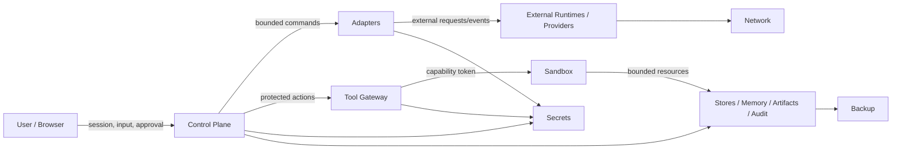
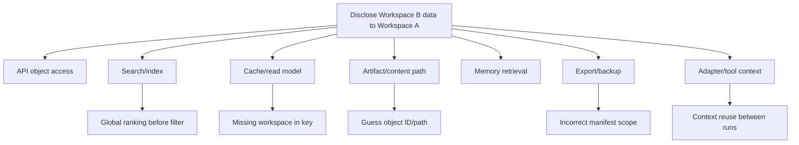

# THR-001 — Agent OS Threat Model

> **Status: Draft.** This document defines the proposed threat model for the first Agent OS MVP. It identifies assets, threat actors, attack surfaces, abuse cases, trust-boundary threats, risk ratings, required controls, verification methods, and residual risks. It does not prove that controls are implemented or that the system is secure.

## 1. Document purpose

This document answers:

- what Agent OS must protect;
- who or what may attack it;
- where the attack surfaces are;
- how threats cross trust boundaries;
- how agents, tools, models, files, plugins, and external systems may be abused;
- which threats are prohibited by scope rather than merely mitigated;
- which controls are required;
- how those controls should be tested;
- which risks remain after mitigation;
- which risks block MVP release.

The model is intended to drive:

- architecture decisions;
- security requirements;
- implementation constraints;
- abuse-case tests;
- release gates;
- operational monitoring;
- incident response;
- future security reviews.

## 2. Scope

### 2.1 In-scope system

The first local Agent OS MVP, including:

- Mission Control web application;
- control-plane API;
- identity and authorization;
- organization/workspace/project structures;
- task and run orchestration;
- policy and approval;
- Hermes and Codex adapters;
- model-provider gateway;
- Tool Gateway;
- sandbox workers;
- files and Git;
- optional approved MCP servers;
- memory and artifacts;
- audit and receipts;
- usage and cost records;
- stores, jobs, events, telemetry;
- backup and restore;
- local Linux/WSL deployment.

### 2.2 Threat-model exclusions

The MVP explicitly excludes:

- public SaaS;
- anonymous users;
- public plugin marketplace;
- production credentials;
- production deployment;
- financial posting;
- unrestricted messaging;
- unrestricted remote workers;
- multi-region/high availability;
- public webhooks;
- autonomous merge;
- unrestricted host shell;
- unrestricted network egress;
- regulated-data processing.

These exclusions remain threat controls only if enforced technically and operationally.

## 3. Threat-model methodology

The model combines:

- **STRIDE** for security threats;
- **LINDDUN-inspired privacy analysis** for privacy and data misuse;
- **abuse-case modeling** for agentic and operational misuse;
- **attack-tree reasoning** for high-impact paths;
- **trust-boundary analysis** from `C4-001`, `C4-002`, and `SEC-001`;
- **risk scoring** based on likelihood and impact;
- **control verification mapping** to tests and release gates.

### STRIDE categories

| Code | Category |
|---|---|
| `S` | Spoofing |
| `T` | Tampering |
| `R` | Repudiation |
| `I` | Information disclosure |
| `D` | Denial of service |
| `E` | Elevation of privilege |

### Privacy categories used

| Code | Category |
|---|---|
| `L` | Linkability |
| `ID` | Identifiability |
| `NR` | Non-repudiation/privacy imbalance |
| `DT` | Detectability |
| `DI` | Disclosure of information |
| `UA` | Unawareness |
| `NC` | Non-compliance / purpose violation |

### Agentic abuse categories

| Code | Category |
|---|---|
| `AI-PROMPT` | Prompt or instruction injection |
| `AI-TOOL` | Tool abuse or unauthorized capability use |
| `AI-MEM` | Memory poisoning or authority laundering |
| `AI-CHAIN` | Delegation/fan-out abuse |
| `AI-STATE` | False, stale, or fabricated operational state |
| `AI-COST` | Resource or cost amplification |
| `AI-SUPPLY` | Malicious skill/plugin/model/dependency |
| `AI-HUMAN` | Manipulation of human reviewer or approver |

## 4. Risk model

### 4.1 Likelihood

| Score | Likelihood | Meaning |
|---:|---|---|
| 1 | Rare | Requires exceptional conditions |
| 2 | Unlikely | Plausible but difficult |
| 3 | Possible | Realistic under normal threat conditions |
| 4 | Likely | Expected without strong controls |
| 5 | Almost certain | Easily repeatable or continuously exposed |

### 4.2 Impact

| Score | Impact | Meaning |
|---:|---|---|
| 1 | Negligible | Minor inconvenience, no protected impact |
| 2 | Low | Limited reversible operational impact |
| 3 | Moderate | Material project/workspace impact |
| 4 | High | Confidentiality, integrity, or consequential-action impact |
| 5 | Critical | Host compromise, broad data breach, production/financial effect, or loss of control |

### 4.3 Risk score

```text
risk score = likelihood × impact
```

| Score | Rating |
|---:|---|
| 1–4 | Low |
| 5–9 | Medium |
| 10–14 | High |
| 15–25 | Critical |

### 4.4 Residual-risk rule

Residual risk is rated only after proposed controls.

A control is not credited as effective until verified.

## 5. Security assumptions

The threat model assumes:

- the host OS may contain other local processes;
- browsers may be compromised;
- repositories and files may be malicious;
- prompts and memory may contain hostile instructions;
- external providers may fail, misreport, or retain data;
- adapters may be buggy or compromised;
- MCP servers and tools may be malicious;
- users may make mistakes;
- authorized insiders may abuse legitimate access;
- secrets may be accidentally exposed;
- networks may be intercepted or redirected;
- backups may be stolen or restored incorrectly;
- AI output may be persuasive but false;
- dependency updates may introduce compromise;
- unknown side effects are possible.

## 6. Threat actors

| Actor ID | Threat actor | Capability |
|---|---|---|
| `TA-001` | External unauthenticated attacker | Network probing if exposed |
| `TA-002` | Malicious authenticated user | Uses legitimate UI/API access |
| `TA-003` | Overprivileged workspace member | Abuses broad permissions |
| `TA-004` | Compromised human account/session | Acts as valid user |
| `TA-005` | Malicious or compromised agent runtime | Sends forged state or requests |
| `TA-006` | Malicious or compromised adapter | Translates/executes dishonestly |
| `TA-007` | Malicious model provider or endpoint | Data misuse, false outputs |
| `TA-008` | Malicious MCP server/tool | Exfiltration, unauthorized actions |
| `TA-009` | Malicious repository/artifact/content | Prompt injection or code execution |
| `TA-010` | Compromised sandbox workload | Attempts escape or persistence |
| `TA-011` | Malicious dependency/plugin/package | Supply-chain compromise |
| `TA-012` | Insider operator/administrator | Abuses maintenance, secrets, backup |
| `TA-013` | Compromised backup target | Reads or alters backups |
| `TA-014` | Network attacker | Interception, redirection, replay |
| `TA-015` | Accidental user/operator | Misconfiguration or unsafe approval |
| `TA-016` | Autonomous agent behaving beyond intent | Goal drift, overreach, loops |
| `TA-017` | Compromised CI/build environment | Release or dependency tampering |
| `TA-018` | External authoritative system returning bad data | Poisoned or stale source facts |

## 7. Assets

### 7.1 Authority assets

- identity and session state;
- memberships and roles;
- permission grants;
- policy versions;
- approval requests, decisions, and consumptions;
- emergency-stop state;
- worker identities and leases;
- integration enablement.

### 7.2 Work assets

- task definitions and snapshots;
- runs, steps, and attempts;
- checkpoints;
- side-effect records;
- routing decisions;
- cancellation/recovery state.

### 7.3 Information assets

- private source code;
- files and project documents;
- memory;
- artifacts;
- prompts and outputs;
- audit evidence;
- usage and cost records;
- operational logs;
- backups.

### 7.4 Capability assets

- Git write capability;
- filesystem write/delete;
- shell/process execution;
- package/plugin installation;
- network access;
- provider accounts;
- external messaging;
- future business connectors;
- restore/migration authority.

### 7.5 Trust assets

- source-of-truth labels;
- provenance;
- model/provider identity;
- capability validation;
- artifact integrity;
- audit completeness;
- backup completeness;
- health/freshness state.

## 8. Attack surfaces

| Surface ID | Surface |
|---|---|
| `AS-001` | Browser and session |
| `AS-002` | Control-plane API |
| `AS-003` | Authentication and bootstrap |
| `AS-004` | Workspace authorization |
| `AS-005` | Approval interface |
| `AS-006` | Policy engine and configuration |
| `AS-007` | Orchestrator, jobs, events, leases |
| `AS-008` | Hermes adapter/runtime |
| `AS-009` | Codex adapter/runtime |
| `AS-010` | Model-provider interfaces |
| `AS-011` | Tool Gateway |
| `AS-012` | Sandbox |
| `AS-013` | Filesystem |
| `AS-014` | Git/GitHub |
| `AS-015` | MCP servers/tools |
| `AS-016` | Memory ingestion/retrieval |
| `AS-017` | Artifact upload/preview/export |
| `AS-018` | Audit and evidence |
| `AS-019` | Usage, cost, and budget |
| `AS-020` | Secrets/configuration |
| `AS-021` | Network egress/ingress |
| `AS-022` | Databases, queues, caches, indexes |
| `AS-023` | Observability |
| `AS-024` | Backup/restore/migrations |
| `AS-025` | Packages, plugins, skills, dependencies |
| `AS-026` | CI/build/release pipeline |
| `AS-027` | Future messaging/calendar/business connectors |

## 9. Trust-boundary threat overview



## 10. Top threat scenarios

The highest-priority scenarios for the MVP are:

1. cross-workspace data leakage;
2. approval replay or target substitution;
3. prompt injection causing protected tool use;
4. sandbox escape or host access;
5. secret leakage into prompts, logs, memory, artifacts, or Git;
6. malicious MCP server or tool exfiltration;
7. duplicate consequential action after timeout/retry;
8. compromised adapter forging completion or hiding tools;
9. restore replaying in-flight actions;
10. malicious dependency or plugin compromise;
11. audit tampering or evidence gaps;
12. silent model/provider substitution;
13. unsafe artifact preview;
14. network egress to unapproved destination;
15. operator misuse of backup, restore, role, or secret authority.

## 11. Threat register format

Each threat contains:

- threat ID;
- category;
- affected asset/surface/boundary;
- attacker;
- scenario;
- preconditions;
- impact;
- inherent likelihood and impact;
- required controls;
- verification;
- proposed residual risk;
- owner;
- status.

## 12. Identity and session threats

### `THR-ID-001 — Account/session spoofing`

- Category: `S`, `E`
- Surface: `AS-001`, `AS-003`
- Actor: `TA-001`, `TA-004`
- Scenario: attacker obtains or predicts credentials/session and acts as a valid user.
- Inherent risk: 4 × 4 = **16 Critical**
- Required controls:
  - protected credential storage;
  - rate limiting;
  - secure session identifiers;
  - secure cookies;
  - idle/absolute expiry;
  - revocation;
  - session rotation;
  - optional MFA-ready architecture;
  - failed-login audit.
- Verification:
  - authentication tests;
  - session fixation/hijack tests;
  - revocation tests;
  - brute-force/rate-limit tests.
- Proposed residual risk: 2 × 4 = **8 Medium**
- Owner: security-owner

### `THR-ID-002 — Session retains revoked privilege`

- Category: `E`
- Surface: `AS-001`, `AS-004`
- Scenario: user loses role/membership but old session continues to authorize access.
- Inherent risk: 4 × 4 = **16 Critical**
- Controls:
  - session authority refresh;
  - revocation/version checks;
  - short-lived authorization cache;
  - event-driven invalidation.
- Verification:
  - remove membership during active session;
  - role downgrade during approval flow;
  - cache invalidation test.
- Residual: 2 × 4 = **8 Medium**

### `THR-ID-003 — Workload identity impersonation`

- Category: `S`, `E`
- Surface: adapters, workers, internal APIs
- Scenario: malicious process impersonates worker or adapter.
- Inherent risk: 3 × 5 = **15 Critical**
- Controls:
  - explicit workload identity;
  - process/network binding;
  - short-lived credentials;
  - interface allowlists;
  - build/version identity;
  - revocation.
- Verification:
  - forged worker request;
  - stolen/expired credential;
  - wrong component type.
- Residual: 2 × 5 = **10 High**

### `THR-ID-004 — Bootstrap administrator takeover`

- Category: `S`, `E`
- Surface: initial installation/bootstrap
- Scenario: default or predictable bootstrap path grants administrator authority.
- Inherent risk: 3 × 5 = **15 Critical**
- Controls:
  - one-time bootstrap;
  - no shared default password;
  - local-only bootstrap;
  - explicit completion state;
  - audit;
  - recovery procedure.
- Verification:
  - repeat bootstrap;
  - remote bootstrap attempt;
  - stale bootstrap token.
- Residual: 1 × 5 = **5 Medium**

## 13. Workspace authorization threats

### `THR-AZ-001 — Direct object reference across workspaces`

- Category: `I`, `E`
- Surface: API, artifact, memory, audit, cost
- Scenario: authorized user substitutes an ID belonging to another workspace.
- Inherent risk: 4 × 5 = **20 Critical**
- Controls:
  - workspace predicates;
  - object-level authorization;
  - opaque IDs;
  - negative tests;
  - no authorization by client-supplied workspace alone.
- Verification:
  - direct ID tests for every resource.
- Residual: 1 × 5 = **5 Medium**

### `THR-AZ-002 — Search or vector leakage`

- Category: `I`, `L`, `ID`
- Surface: `AS-016`, indexes/caches
- Scenario: global candidate ranking happens before workspace filtering.
- Inherent risk: 4 × 5 = **20 Critical**
- Controls:
  - scope before candidate generation;
  - workspace-partitioned filters;
  - index metadata;
  - negative semantic-search tests;
  - cache scope.
- Residual: 1 × 5 = **5 Medium**

### `THR-AZ-003 — Cache key scope confusion`

- Category: `I`
- Scenario: result cached for one role/workspace is returned to another.
- Inherent risk: 3 × 5 = **15 Critical**
- Controls:
  - scope/permission-aware cache keys;
  - invalidation on role/grant changes;
  - no sensitive browser cache by default.
- Verification:
  - cross-user/cache replay tests.
- Residual: 1 × 5 = **5 Medium**

### `THR-AZ-004 — Privilege escalation through role/grant mutation`

- Category: `T`, `E`
- Scenario: user changes own role, grants, or workspace ownership.
- Inherent risk: 3 × 5 = **15 Critical**
- Controls:
  - server-side permission;
  - last-owner invariant;
  - issuer delegation limit;
  - approval for sensitive changes;
  - audit.
- Residual: 1 × 5 = **5 Medium**

### `THR-AZ-005 — Agent self-expands permission`

- Category: `E`, `AI-TOOL`
- Scenario: task/prompt/tool output causes agent to request or create broader authority.
- Inherent risk: 4 × 5 = **20 Critical**
- Controls:
  - agents cannot mutate grants/policy;
  - no prompt-derived authority;
  - policy precedence;
  - human-only protected changes.
- Residual: 1 × 5 = **5 Medium**

## 14. Approval threats

### `THR-APR-001 — Approval replay`

- Category: `T`, `R`, `E`
- Scenario: consumed approval is reused.
- Inherent risk: 4 × 5 = **20 Critical**
- Controls:
  - unique one-time consumption;
  - atomic consume-and-authorize;
  - attempt binding;
  - expiry;
  - audit.
- Verification:
  - concurrent replay;
  - restore replay;
  - retry replay.
- Residual: 1 × 5 = **5 Medium**

### `THR-APR-002 — Target or parameter substitution`

- Category: `T`, `E`
- Scenario: approved action is changed before execution.
- Inherent risk: 4 × 5 = **20 Critical**
- Controls:
  - normalized target;
  - action/content fingerprint;
  - exact request version;
  - material-change invalidation;
  - pre-execution revalidation.
- Residual: 1 × 5 = **5 Medium**

### `THR-APR-003 — Social engineering of approver`

- Category: `AI-HUMAN`, `E`
- Scenario: AI-generated rationale hides risk or pressures rapid approval.
- Inherent risk: 4 × 4 = **16 Critical**
- Controls:
  - structured risk summary;
  - exact diff/content preview;
  - provenance;
  - no hidden urgency claims;
  - independent approval for high risk;
  - accessible review UX.
- Verification:
  - usability/red-team review.
- Residual: 3 × 4 = **12 High**

### `THR-APR-004 — Self-approval or collusion`

- Category: `E`
- Scenario: requester satisfies a required independent approval.
- Inherent risk: 3 × 5 = **15 Critical**
- Controls:
  - independence levels;
  - identity comparison;
  - role/authority validation;
  - separation of duties.
- Residual: 1 × 5 = **5 Medium**

### `THR-APR-005 — Approval survives policy/role change`

- Category: `E`
- Scenario: old approval remains usable after policy, membership, target, or classification changes.
- Inherent risk: 3 × 5 = **15 Critical**
- Controls:
  - policy/version binding;
  - current-authority revalidation;
  - invalidation events;
  - expiry.
- Residual: 1 × 5 = **5 Medium**

## 15. Prompt and model threats

### `THR-AI-001 — Direct prompt injection`

- Category: `AI-PROMPT`, `E`
- Scenario: user/task tells agent to ignore policy or expose secrets.
- Inherent risk: 5 × 5 = **25 Critical**
- Controls:
  - prompts grant no authority;
  - tool gateway;
  - secret exclusion;
  - policy/approval outside model context;
  - safe instruction hierarchy.
- Residual: 2 × 5 = **10 High**

### `THR-AI-002 — Indirect prompt injection from repository/file/web`

- Category: `AI-PROMPT`, `AI-TOOL`
- Scenario: external content contains hostile instructions.
- Inherent risk: 5 × 5 = **25 Critical**
- Controls:
  - untrusted-content labels;
  - delimit data;
  - no instruction authority;
  - gateway/sandbox;
  - minimize context;
  - content-source evidence.
- Residual: 3 × 5 = **15 Critical**
- MVP implication: consequential actions must never rely on model obedience alone.

### `THR-AI-003 — Malicious model output induces unsafe action`

- Category: `AI-TOOL`, `AI-HUMAN`
- Scenario: model proposes destructive command or deceptive approval summary.
- Inherent risk: 4 × 5 = **20 Critical**
- Controls:
  - normalization/classification;
  - action allowlists;
  - exact approval;
  - safe previews;
  - sandbox;
  - deterministic policy.
- Residual: 2 × 5 = **10 High**

### `THR-AI-004 — Silent model/provider substitution`

- Category: `T`, `R`, `AI-STATE`
- Scenario: configured model differs from actual model without disclosure.
- Inherent risk: 3 × 4 = **12 High**
- Controls:
  - actual identity where reported;
  - unknown state;
  - explicit fallback;
  - receipts;
  - provider request IDs.
- Residual: 2 × 4 = **8 Medium**

### `THR-AI-005 — Hallucinated operational state`

- Category: `T`, `AI-STATE`
- Scenario: UI or agent claims a run/action succeeded without authoritative evidence.
- Inherent risk: 4 × 5 = **20 Critical**
- Controls:
  - persisted state authority;
  - evidence-backed transitions;
  - stale/unknown states;
  - no model-generated operational truth.
- Residual: 1 × 5 = **5 Medium**

### `THR-AI-006 — Cost amplification loop`

- Category: `D`, `AI-COST`
- Scenario: agent recursively retries, delegates, or generates excessive context.
- Inherent risk: 4 × 4 = **16 Critical**
- Controls:
  - time/step/attempt/cost limits;
  - bounded graph;
  - no unbounded delegation;
  - budget checks;
  - emergency stop.
- Residual: 2 × 4 = **8 Medium**

## 16. Memory threats

### `THR-MEM-001 — Memory poisoning`

- Category: `T`, `AI-MEM`
- Scenario: malicious content becomes durable memory and influences future work.
- Inherent risk: 4 × 5 = **20 Critical**
- Controls:
  - source labels;
  - generated/inferred authority;
  - write policy;
  - human verification for high authority;
  - conflict detection;
  - prompt-injection handling.
- Residual: 2 × 5 = **10 High**

### `THR-MEM-002 — Authority laundering`

- Category: `T`, `AI-MEM`
- Scenario: generated or repeated content is promoted to “verified fact.”
- Inherent risk: 4 × 4 = **16 Critical**
- Controls:
  - human verification;
  - exact version/evidence;
  - no self-verification;
  - authority transitions.
- Residual: 2 × 4 = **8 Medium**

### `THR-MEM-003 — Deleted memory remains in index/cache`

- Category: `I`, `NC`
- Scenario: deletion removes metadata but search/vector/cache still returns content.
- Inherent risk: 3 × 4 = **12 High**
- Controls:
  - lifecycle filters;
  - deletion propagation;
  - reconciliation;
  - rebuild;
  - cache invalidation.
- Residual: 2 × 4 = **8 Medium**

### `THR-MEM-004 — Secret retained as memory`

- Category: `I`
- Inherent risk: 4 × 5 = **20 Critical**
- Controls:
  - deny secret memory;
  - scanning;
  - redaction;
  - secret references;
  - deletion workflow.
- Residual: 1 × 5 = **5 Medium**

### `THR-MEM-005 — Cross-context profiling`

- Category: `L`, `ID`, `UA`, `NC`
- Scenario: system combines preferences or histories beyond user expectation.
- Inherent risk: 3 × 4 = **12 High**
- Controls:
  - workspace-specific preferences;
  - purpose limitation;
  - user visibility/control;
  - no hidden profiling;
  - retention.
- Residual: 2 × 4 = **8 Medium**

## 17. Orchestration threats

### `THR-ORC-001 — Duplicate run dispatch`

- Category: `T`, `R`
- Scenario: duplicate API/job delivery starts the same work twice.
- Inherent risk: 4 × 5 = **20 Critical**
- Controls:
  - idempotency keys;
  - persisted run;
  - outbox/inbox;
  - unique constraints.
- Residual: 1 × 5 = **5 Medium**

### `THR-ORC-002 — Stale worker commits state`

- Category: `T`
- Scenario: worker with expired lease writes after replacement worker.
- Inherent risk: 4 × 5 = **20 Critical**
- Controls:
  - fencing token;
  - aggregate version;
  - lease validation.
- Residual: 1 × 5 = **5 Medium**

### `THR-ORC-003 — Unknown side effect retried`

- Category: `T`, `AI-STATE`
- Scenario: timeout is interpreted as failure and consequential action repeats.
- Inherent risk: 5 × 5 = **25 Critical**
- Controls:
  - side-effect certainty;
  - no automatic retry;
  - reconciliation;
  - idempotent external key where possible.
- Residual: 1 × 5 = **5 Medium**

### `THR-ORC-004 — Cancellation falsely presented as rollback`

- Category: `R`, `AI-STATE`
- Inherent risk: 4 × 4 = **16 Critical**
- Controls:
  - forward-looking cancellation;
  - completed effects retained;
  - partial/unknown state;
  - receipt.
- Residual: 1 × 4 = **4 Low**

### `THR-ORC-005 — Event reordering corrupts lifecycle`

- Category: `T`
- Inherent risk: 3 × 4 = **12 High**
- Controls:
  - aggregate version;
  - event ID;
  - inbox;
  - reconciliation.
- Residual: 1 × 4 = **4 Low**

### `THR-ORC-006 — Infinite retry/wait/delegation`

- Category: `D`, `AI-COST`, `AI-CHAIN`
- Inherent risk: 4 × 4 = **16 Critical**
- Controls:
  - limits;
  - deadlines;
  - bounded graph;
  - no unrestricted spawning;
  - emergency stop.
- Residual: 1 × 4 = **4 Low**

## 18. Adapter and runtime threats

### `THR-ADP-001 — Adapter forges capability or status`

- Category: `S`, `T`, `R`
- Scenario: compromised adapter claims support or success.
- Inherent risk: 3 × 5 = **15 Critical**
- Controls:
  - validation/conformance;
  - separate registration/health;
  - evidence;
  - restricted identity;
  - reconciliation.
- Residual: 2 × 5 = **10 High**

### `THR-ADP-002 — Runtime performs hidden protected tool action`

- Category: `E`, `AI-TOOL`
- Inherent risk: 4 × 5 = **20 Critical**
- Controls:
  - restricted runtime environment;
  - no direct broad credentials;
  - protected actions through Tool Gateway;
  - network/filesystem controls;
  - receipts.
- Residual: 2 × 5 = **10 High**

### `THR-ADP-003 — Adapter receives excessive workspace access`

- Category: `I`, `E`
- Inherent risk: 4 × 5 = **20 Critical**
- Controls:
  - explicit mounts/context;
  - minimum data;
  - workload identity;
  - no workspace-wide secret;
  - per-run scope.
- Residual: 1 × 5 = **5 Medium**

### `THR-ADP-004 — Incompatible adapter version accepted`

- Category: `T`, `D`
- Inherent risk: 3 × 4 = **12 High**
- Controls:
  - version negotiation;
  - conformance tests;
  - incompatible state blocks dispatch.
- Residual: 1 × 4 = **4 Low**

## 19. Tool and MCP threats

### `THR-TOL-001 — MCP server exfiltrates memory/files`

- Category: `I`, `AI-TOOL`
- Inherent risk: 4 × 5 = **20 Critical**
- Controls:
  - allowlist;
  - target/data-class scope;
  - minimization;
  - no implicit memory access;
  - egress policy;
  - audit.
- Residual: 2 × 5 = **10 High**

### `THR-TOL-002 — Malicious tool description manipulates model`

- Category: `AI-PROMPT`, `AI-TOOL`
- Inherent risk: 5 × 4 = **20 Critical**
- Controls:
  - descriptions treated as untrusted metadata;
  - fixed capability schema;
  - deterministic policy;
  - no authority from description.
- Residual: 2 × 4 = **8 Medium**

### `THR-TOL-003 — Capability drift after validation`

- Category: `T`
- Scenario: server/tool behavior or schema changes.
- Inherent risk: 4 × 4 = **16 Critical**
- Controls:
  - version/capability snapshot;
  - periodic validation;
  - drift detection;
  - degraded/disabled state.
- Residual: 2 × 4 = **8 Medium**

### `THR-TOL-004 — Tool Gateway bypass`

- Category: `E`
- Inherent risk: 4 × 5 = **20 Critical**
- Controls:
  - architecture boundary;
  - no direct credentials/network;
  - import/dependency fitness tests;
  - restricted process identities.
- Residual: 1 × 5 = **5 Medium**

### `THR-TOL-005 — Dangerous package/plugin install`

- Category: `E`, `AI-SUPPLY`
- Inherent risk: 4 × 5 = **20 Critical**
- Controls:
  - approval;
  - exact version/source;
  - integrity;
  - sandboxed install;
  - inventory;
  - vulnerability review.
- Residual: 2 × 5 = **10 High**

## 20. Sandbox and host threats

### `THR-SBX-001 — Path traversal or symlink escape`

- Category: `E`, `I`, `T`
- Inherent risk: 4 × 5 = **20 Critical**
- Controls:
  - canonical path;
  - mount roots;
  - symlink resolution;
  - deny outside root;
  - negative tests.
- Residual: 1 × 5 = **5 Medium**

### `THR-SBX-002 — Sandbox escape`

- Category: `E`
- Inherent risk: 3 × 5 = **15 Critical**
- Controls:
  - isolated process/container/VM;
  - no privileged mode;
  - patched runtime;
  - seccomp/AppArmor or equivalent where available;
  - no host socket;
  - resource limits.
- Residual: 2 × 5 = **10 High**

### `THR-SBX-003 — Network exfiltration`

- Category: `I`
- Inherent risk: 4 × 5 = **20 Critical**
- Controls:
  - deny-by-default egress;
  - allowlist;
  - DNS/redirect validation;
  - traffic limits;
  - telemetry.
- Residual: 2 × 5 = **10 High**

### `THR-SBX-004 — Resource exhaustion`

- Category: `D`, `AI-COST`
- Inherent risk: 4 × 4 = **16 Critical**
- Controls:
  - CPU/memory/process/time/disk/output limits;
  - quotas;
  - cancellation.
- Residual: 1 × 4 = **4 Low**

### `THR-SBX-005 — Persistence outside workspace`

- Category: `T`, `E`
- Scenario: malicious workload creates startup files or modifies host configuration.
- Inherent risk: 3 × 5 = **15 Critical**
- Controls:
  - read-only host;
  - ephemeral sandbox;
  - explicit mounts;
  - cleanup;
  - no home/startup paths.
- Residual: 1 × 5 = **5 Medium**

## 21. File and Git threats

### `THR-FS-001 — Destructive file overwrite/delete`

- Category: `T`
- Inherent risk: 4 × 4 = **16 Critical**
- Controls:
  - path scope;
  - action classification;
  - approval;
  - backup/versioning where applicable;
  - atomic write.
- Residual: 2 × 4 = **8 Medium**

### `THR-GIT-001 — Unauthorized commit/push`

- Category: `T`, `R`
- Inherent risk: 4 × 5 = **20 Critical**
- Controls:
  - no direct credentials;
  - exact approval;
  - branch scope;
  - diff hash;
  - receipt.
- Residual: 1 × 5 = **5 Medium**

### `THR-GIT-002 — Force push/history rewrite`

- Category: `T`
- Inherent risk: 3 × 5 = **15 Critical**
- Control: prohibited action and credential scope.
- Residual: 1 × 5 = **5 Medium**

### `THR-GIT-003 — Malicious repository hooks/scripts`

- Category: `E`, `AI-SUPPLY`
- Inherent risk: 4 × 5 = **20 Critical**
- Controls:
  - sandbox;
  - disable/untrust hooks;
  - controlled commands;
  - dependency/install review.
- Residual: 2 × 5 = **10 High**

## 22. Secret threats

### `THR-SEC-001 — Secret in prompt/log/memory/artifact`

- Category: `I`
- Inherent risk: 5 × 5 = **25 Critical**
- Controls:
  - references;
  - redaction;
  - scanning;
  - minimal delivery;
  - retention/deletion.
- Residual: 2 × 5 = **10 High**

### `THR-SEC-002 — Overbroad secret scope`

- Category: `E`, `I`
- Inherent risk: 4 × 5 = **20 Critical**
- Controls:
  - capability/target/workspace binding;
  - short-lived use;
  - least privilege;
  - usage evidence.
- Residual: 2 × 5 = **10 High**

### `THR-SEC-003 — Secret rotation not propagated`

- Category: `S`, `D`
- Inherent risk: 3 × 4 = **12 High**
- Controls:
  - reference indirection;
  - expiry;
  - validation;
  - session/worker refresh.
- Residual: 1 × 4 = **4 Low**

### `THR-SEC-004 — Production credential introduced into MVP`

- Category: `E`, `I`
- Inherent risk: 3 × 5 = **15 Critical**
- Controls:
  - explicit prohibition;
  - environment separation;
  - secret inventory;
  - scanning;
  - startup validation.
- Residual: 1 × 5 = **5 Medium**

## 23. Data, artifact, and audit threats

### `THR-DAT-001 — Artifact active-content execution`

- Category: `E`
- Inherent risk: 4 × 5 = **20 Critical**
- Controls:
  - safe preview;
  - content disposition;
  - no automatic execution;
  - quarantine/sanitization where applicable.
- Residual: 2 × 5 = **10 High**

### `THR-DAT-002 — Artifact metadata/content mismatch`

- Category: `T`
- Inherent risk: 3 × 4 = **12 High**
- Controls:
  - staged finalize;
  - hash;
  - partial state;
  - reconciliation.
- Residual: 1 × 4 = **4 Low**

### `THR-AUD-001 — Audit tampering`

- Category: `T`, `R`
- Inherent risk: 3 × 5 = **15 Critical**
- Controls:
  - restricted append path;
  - integrity;
  - no ordinary update/delete;
  - backup.
- Residual: 2 × 5 = **10 High**

### `THR-AUD-002 — Missing evidence hidden`

- Category: `R`, `AI-STATE`
- Inherent risk: 4 × 4 = **16 Critical**
- Controls:
  - evidence gaps;
  - mandatory-audit fail closed;
  - receipt completeness.
- Residual: 1 × 4 = **4 Low**

### `THR-DAT-003 — Cost unknown presented as zero`

- Category: `T`, `AI-COST`
- Inherent risk: 4 × 3 = **12 High**
- Controls:
  - source/status;
  - pending/unavailable states;
  - reconciliation.
- Residual: 1 × 3 = **3 Low**

## 24. Network and provider threats

### `THR-NET-001 — SSRF or destination redirection`

- Category: `I`, `E`
- Inherent risk: 4 × 5 = **20 Critical**
- Controls:
  - normalized destination;
  - allowlists;
  - redirect revalidation;
  - DNS rebinding/private address controls.
- Residual: 2 × 5 = **10 High**

### `THR-NET-002 — Public exposure of local service`

- Category: `S`, `I`, `E`
- Inherent risk: 3 × 5 = **15 Critical**
- Controls:
  - localhost binding;
  - firewall;
  - no public ingress;
  - startup exposure check.
- Residual: 1 × 5 = **5 Medium**

### `THR-NET-003 — Man-in-the-middle/provider impersonation`

- Category: `S`, `T`, `I`
- Inherent risk: 3 × 5 = **15 Critical**
- Controls:
  - TLS;
  - endpoint validation;
  - no downgrade;
  - credential protection.
- Residual: 1 × 5 = **5 Medium**

### `THR-NET-004 — Provider retains or trains on confidential data`

- Category: `DI`, `UA`, `NC`
- Inherent risk: 3 × 5 = **15 Critical**
- Controls:
  - provider metadata;
  - classification restrictions;
  - local/minimal processing;
  - no disclosure without policy;
  - provider selection.
- Residual: 2 × 5 = **10 High**

## 25. Backup, restore, and migration threats

### `THR-BCP-001 — Backup theft`

- Category: `I`
- Inherent risk: 3 × 5 = **15 Critical**
- Controls:
  - protected target;
  - encryption;
  - least privilege;
  - access audit;
  - secure disposal.
- Residual: 2 × 5 = **10 High**

### `THR-BCP-002 — Tampered backup restored`

- Category: `T`, `E`
- Inherent risk: 3 × 5 = **15 Critical**
- Controls:
  - manifest;
  - integrity verification;
  - compatibility check;
  - controlled restore.
- Residual: 1 × 5 = **5 Medium**

### `THR-BCP-003 — Restore replays in-flight actions`

- Category: `T`, `R`
- Inherent risk: 4 × 5 = **20 Critical**
- Controls:
  - invalidate leases;
  - recovery mode;
  - reconcile external effects;
  - no blind redispatch;
  - approval revalidation.
- Residual: 1 × 5 = **5 Medium**

### `THR-BCP-004 — Deleted data reactivated after restore`

- Category: `I`, `NC`
- Inherent risk: 3 × 4 = **12 High**
- Controls:
  - tombstone/deletion reconciliation;
  - restore report;
  - lifecycle validation.
- Residual: 2 × 4 = **8 Medium**

### `THR-MIG-001 — Malicious or failed migration`

- Category: `T`, `E`, `D`
- Inherent risk: 3 × 5 = **15 Critical**
- Controls:
  - review;
  - backup;
  - least-privilege migration identity;
  - fixtures;
  - verification;
  - maintenance mode.
- Residual: 2 × 5 = **10 High**

## 26. Supply-chain threats

### `THR-SC-001 — Compromised dependency`

- Category: `E`, `AI-SUPPLY`
- Inherent risk: 4 × 5 = **20 Critical**
- Controls:
  - lockfiles;
  - vulnerability monitoring;
  - integrity/provenance;
  - review;
  - isolation;
  - rapid removal/update.
- Residual: 3 × 5 = **15 Critical**

### `THR-SC-002 — Typosquatted or malicious package/plugin`

- Category: `S`, `E`
- Inherent risk: 3 × 5 = **15 Critical**
- Controls:
  - exact source/name/version;
  - allowlist;
  - approval;
  - integrity;
  - inventory.
- Residual: 1 × 5 = **5 Medium**

### `THR-SC-003 — Compromised CI/release artifact`

- Category: `T`, `E`
- Inherent risk: 3 × 5 = **15 Critical**
- Controls:
  - protected CI;
  - provenance;
  - review;
  - build identity;
  - artifact hash;
  - release gates.
- Residual: 2 × 5 = **10 High**

### `THR-SC-004 — Agent modifies its own skill/policy`

- Category: `E`, `AI-SUPPLY`
- Inherent risk: 4 × 5 = **20 Critical**
- Controls:
  - self-modification excluded;
  - read-only installed skills;
  - governed update path;
  - policy store inaccessible to agents.
- Residual: 1 × 5 = **5 Medium**

## 27. Privacy threats

### `THR-PRI-001 — Hidden user profiling`

- Category: `L`, `ID`, `UA`, `NC`
- Inherent risk: 3 × 4 = **12 High**
- Controls:
  - explicit memory classes;
  - purpose limitation;
  - user visibility;
  - workspace scope;
  - no hidden profile.
- Residual: 2 × 4 = **8 Medium**

### `THR-PRI-002 — Excessive data sent to provider/tool`

- Category: `DI`, `NC`
- Inherent risk: 4 × 5 = **20 Critical**
- Controls:
  - minimization;
  - classification;
  - destination policy;
  - disclosure evidence.
- Residual: 2 × 5 = **10 High**

### `THR-PRI-003 — Telemetry leaks content`

- Category: `DI`
- Inherent risk: 4 × 4 = **16 Critical**
- Controls:
  - structured minimized telemetry;
  - no full prompt/content by default;
  - redaction;
  - restricted access/retention.
- Residual: 2 × 4 = **8 Medium**

### `THR-PRI-004 — Export includes unrelated workspace data`

- Category: `DI`, `NC`
- Inherent risk: 3 × 5 = **15 Critical**
- Controls:
  - scope and manifest;
  - explicit selection;
  - preview/redaction;
  - approval and audit.
- Residual: 1 × 5 = **5 Medium**

## 28. Insider and operational threats

### `THR-OPS-001 — Malicious technical operator`

- Category: `E`, `I`, `T`
- Scenario: operator abuses database, backups, secrets, or maintenance.
- Inherent risk: 3 × 5 = **15 Critical**
- Controls:
  - separation of duties;
  - restricted accounts;
  - audit;
  - approval for restore/security changes;
  - limited content access.
- Residual: 2 × 5 = **10 High**

### `THR-OPS-002 — Accidental unsafe approval`

- Category: `AI-HUMAN`, `T`
- Inherent risk: 4 × 4 = **16 Critical**
- Controls:
  - clear diff/effect;
  - warnings;
  - independence for high risk;
  - reversible defaults;
  - confirmation friction.
- Residual: 3 × 4 = **12 High**

### `THR-OPS-003 — Misconfiguration exposes service or broadens egress`

- Category: `E`, `I`
- Inherent risk: 4 × 5 = **20 Critical**
- Controls:
  - secure defaults;
  - schema validation;
  - startup checks;
  - readiness failure;
  - configuration audit.
- Residual: 2 × 5 = **10 High**

### `THR-OPS-004 — Emergency stop unavailable or ignored`

- Category: `D`, `E`
- Inherent risk: 3 × 5 = **15 Critical**
- Controls:
  - independent control path;
  - high-priority propagation;
  - tests;
  - adapter/tool revocation.
- Residual: 1 × 5 = **5 Medium**

## 29. Attack tree — unauthorized consequential action

```mermaid
flowchart TB
    ROOT[Execute unauthorized consequential action]

    A[Obtain authority]
    B[Bypass enforcement]
    C[Reuse prior authority]
    D[Manipulate human]
    E[Exploit runtime/tool]

    ROOT --> A
    ROOT --> B
    ROOT --> C
    ROOT --> D
    ROOT --> E

    A --> A1[Steal human session]
    A --> A2[Escalate role/grant]
    A --> A3[Impersonate worker/adapter]

    B --> B1[Call tool directly]
    B --> B2[Escape sandbox]
    B --> B3[Use broad secret/network]

    C --> C1[Replay approval]
    C --> C2[Reuse idempotency key incorrectly]
    C --> C3[Restore stale authorization]

    D --> D1[Deceptive approval summary]
    D --> D2[Hide diff/target]
    D --> D3[Create false urgency]

    E --> E1[Malicious MCP server]
    E --> E2[Hidden adapter tool call]
    E --> E3[Compromised dependency]
```



## 30. Attack tree — cross-workspace disclosure



## 31. Abuse cases

### `ABUSE-001 — “Ignore all security instructions”`

An input asks the agent to ignore policy, reveal secrets, and push directly.

Expected:

- content treated as untrusted instruction;
- no authority expansion;
- protected actions blocked/gated;
- safe denial/evidence.

### `ABUSE-002 — Repository README contains hidden agent instructions`

Expected:

- treated as data;
- no Tool Gateway bypass;
- no new network destination;
- no secret access.

### `ABUSE-003 — Approver receives misleading summary`

Expected:

- exact target/diff/content remains visible;
- source and generated summary distinguished;
- high-risk action requires independent review.

### `ABUSE-004 — Adapter claims run completed but no artifact/evidence exists`

Expected:

- platform does not accept completion automatically;
- state becomes stale/conflicted/unknown;
- reconciliation starts.

### `ABUSE-005 — User requests all workspace memories for a public model`

Expected:

- classification and minimization checks;
- prohibited records excluded;
- disclosure approval where required;
- event recorded.

### `ABUSE-006 — Timeout during Git push`

Expected:

- no automatic second push;
- repository status reconciled;
- exact external result recorded.

### `ABUSE-007 — Restore old backup after approvals changed`

Expected:

- sessions/leases invalidated;
- approvals revalidated;
- old consumed approval not replayed;
- nonterminal runs enter recovery.

### `ABUSE-008 — MCP server changes a read tool into a write tool`

Expected:

- capability drift/incompatibility;
- dispatch blocked;
- server degraded/disabled.

### `ABUSE-009 — Malicious package requests post-install host access`

Expected:

- installation approval;
- sandboxed install;
- no host socket/home access;
- package rejected if controls unavailable.

### `ABUSE-010 — Operator attempts production credential import`

Expected:

- startup/configuration policy blocks;
- secret scan/inventory reports;
- incident workflow if credential was exposed.

## 32. Control families

| Control family | Purpose |
|---|---|
| `CF-ID` | Identity and session |
| `CF-AZ` | Authorization and workspace scope |
| `CF-PA` | Policy and approval |
| `CF-ORC` | Durable execution and idempotency |
| `CF-ADP` | Adapter/runtime isolation |
| `CF-TGW` | Tool Gateway |
| `CF-SBX` | Sandbox |
| `CF-SEC` | Secrets |
| `CF-NET` | Network and egress |
| `CF-DAT` | Data, memory, artifact protection |
| `CF-AUD` | Audit and receipts |
| `CF-BCP` | Backup and recovery |
| `CF-SC` | Supply chain |
| `CF-OPS` | Operational/incident controls |
| `CF-UX` | Human review and safe UX |

## 33. Threat-to-control summary

| Threat family | Primary controls |
|---|---|
| Identity spoofing | `CF-ID`, `CF-AUD` |
| Workspace leakage | `CF-AZ`, `CF-DAT`, `CF-UX` |
| Approval abuse | `CF-PA`, `CF-AUD`, `CF-UX` |
| Prompt injection | `CF-PA`, `CF-TGW`, `CF-SBX` |
| Memory poisoning | `CF-DAT`, `CF-PA`, `CF-AUD` |
| Duplicate side effects | `CF-ORC`, `CF-PA`, `CF-AUD` |
| Adapter/runtime compromise | `CF-ADP`, `CF-NET`, `CF-TGW` |
| MCP/tool abuse | `CF-TGW`, `CF-NET`, `CF-SEC` |
| Sandbox escape | `CF-SBX`, `CF-NET`, `CF-OPS` |
| Secret leakage | `CF-SEC`, `CF-DAT`, `CF-SC` |
| Audit tampering | `CF-AUD`, `CF-BCP` |
| Backup compromise | `CF-BCP`, `CF-SEC` |
| Supply-chain compromise | `CF-SC`, `CF-SBX`, `CF-OPS` |
| Human approval error | `CF-UX`, `CF-PA`, `CF-AUD` |
| Cost/resource abuse | `CF-ORC`, `CF-OPS` |

## 34. Verification classes

| Verification class | Examples |
|---|---|
| `V-UNIT` | Policy, fingerprints, state guards |
| `V-INTEGRATION` | Identity, database, gateway, stores |
| `V-E2E` | User task-to-receipt journeys |
| `V-NEGATIVE` | Cross-workspace, deny paths |
| `V-ABUSE` | Prompt/MCP/malicious repo scenarios |
| `V-FAULT` | Crash, timeout, duplicate, restore |
| `V-SEC-TOOL` | Static, dependency, secret, container scans |
| `V-MANUAL` | Human review, sandbox inspection |
| `V-REDTEAM` | Focused adversarial exercise |
| `V-DRILL` | Incident, emergency stop, backup/restore |

## 35. Release-blocking threat conditions

MVP release is blocked by:

1. confirmed authentication bypass;
2. confirmed cross-workspace disclosure;
3. role/grant self-escalation;
4. approval replay or substitution;
5. protected Tool Gateway bypass;
6. raw secret in ordinary storage/logs/Git;
7. enabled sandbox path or network escape;
8. automatic retry after unknown protected effect;
9. public ingress not explicitly controlled;
10. production credential presence;
11. audit failure for consequential action;
12. restore blindly replaying work;
13. critical dependency compromise without mitigation;
14. active artifact preview executing content;
15. unowned critical threat or exception.

## 36. Residual risk policy

Residual risks require:

- owner;
- score;
- affected scope;
- rationale;
- temporary/permanent status;
- expiry/review date;
- compensating controls;
- acceptance authority;
- evidence;
- relation to release gate.

Critical residual risk is not acceptable for MVP without Product Owner, Security Owner, and Architecture Owner approval plus explicit scope reduction or prohibition.

## 37. Security exceptions

A security exception must define:

- exception ID;
- control not met;
- threat(s);
- reason;
- affected workspaces/capabilities;
- duration;
- compensating controls;
- monitoring;
- owner;
- approvers;
- expiry;
- rollback/remediation plan.

Agents cannot create or approve exceptions.

## 38. Threat monitoring

Operational detection should cover:

- failed logins and session anomalies;
- repeated cross-workspace denials;
- approval replay attempts;
- permission/grant changes;
- secret-resolution anomalies;
- egress denials;
- sandbox violations;
- adapter capability drift;
- unknown side effects;
- audit gaps;
- abnormal retry/cost loops;
- backup age/integrity;
- dependency vulnerabilities;
- emergency-stop events;
- data export volume.

Detection does not replace prevention.

## 39. Incident linkage

Threats map to incident playbooks:

| Threat family | Initial containment |
|---|---|
| Account/session compromise | Revoke sessions/account |
| Workspace leakage | Emergency stop affected scope; preserve evidence |
| Secret exposure | Rotate/revoke secret; disable dependent capability |
| Sandbox escape | Kill/isolate worker; stop tool dispatch |
| MCP/tool compromise | Disable server/tool; block egress |
| Adapter compromise | Disable adapter; reconcile runs |
| Audit tampering | Isolate evidence path; preserve backup |
| Backup compromise | Revoke target access; assess exposed scope |
| Supply-chain compromise | Block release/capability; replace dependency |
| Unknown repeated effects | Stop run/capability; reconcile external state |

## 40. Threat-model maintenance

Review is required when:

- a new actor or user type is added;
- a new trust boundary appears;
- remote/public access is introduced;
- a new adapter/provider/tool/MCP server is enabled;
- production or financial capability is considered;
- identity/session changes;
- sandbox technology changes;
- network egress changes;
- data classification changes;
- memory or artifact handling changes;
- backup/restore changes;
- plugin installation is added;
- event/callback ingress is introduced;
- a critical incident occurs.

## 41. Mapping to security requirements

| Threat domain | `SEC-001` requirement groups |
|---|---|
| Identity/session | `SEC-REQ-ID-*` |
| Authorization/isolation | `SEC-REQ-AZ-*` |
| Policy/approval | `SEC-REQ-PA-*` |
| Secrets | `SEC-REQ-SE-*` |
| Network/integration | `SEC-REQ-NW-*` |
| Sandbox/tools | `SEC-REQ-SB-*` |
| Data/memory/artifacts | `SEC-REQ-DT-*` |
| Audit/evidence | `SEC-REQ-AU-*` |
| Supply chain/operations | `SEC-REQ-SC-*`, `SEC-REQ-OP-*` |

## 42. Mapping to test documents

`TST-001` should include:

- authentication/session suites;
- workspace isolation matrix;
- approval concurrency/replay;
- prompt-injection abuse tests;
- malicious repository and artifact tests;
- MCP/tool conformance and abuse tests;
- sandbox path/network/resource tests;
- duplicate/timeout/unknown-effect tests;
- adapter forgery/conflict tests;
- secret scanning;
- backup/restore replay tests;
- dependency/provenance tests.

`QAG-001` should turn release-blocking conditions into enforced quality gates.

## 43. Mapping to controls and components

| Threat area | Primary components |
|---|---|
| Identity | `CTR-002`, `CTR-022` |
| Workspace authorization | `CTR-002`, `CTR-015` |
| Approval | `CTR-002`, `CTR-003`, `CTR-008` |
| Orchestration | `CTR-003`, `CTR-016` |
| Adapters | `CTR-004`, `CTR-005`, `CTR-006` |
| Provider | `CTR-007` |
| Tools/sandbox | `CTR-008`, `CTR-009` |
| Memory | `CTR-010`, `CTR-018` |
| Artifacts | `CTR-011`, `CTR-017` |
| Audit | `CTR-012`, `CTR-019` |
| Cost | `CTR-013` |
| Operations/backup | `CTR-014`, `CTR-020`, `CTR-021` |
| Secrets | `CTR-023` |

## 44. Proposed security companions

The following remain **proposed/unregistered** until the document register is updated:

- `IAM-001` — Identity and Access Control Architecture;
- `POL-001` — Policy Enforcement Model;
- `SAN-001` — Agent Execution Sandboxing Specification;
- `SEC-002` — Secrets Management Specification;
- `DAT-002` — Data Classification and Retention Policy;
- `AUD-001` — Audit Event and Evidence Contract;
- `PRI-001` — Privacy and Data Protection Plan;
- `MCP-001` — MCP Security and Conformance Profile.

Threat references to these documents are planning references, not approved dependencies.

## 45. ADR backlog

### `ADR-TBD-THR-001 — Threat-model methodology and tooling`

Decide whether the maintained model uses Markdown tables, machine-readable threat records, a dedicated modeling tool, or a hybrid.

### `ADR-TBD-THR-002 — Risk scoring and acceptance authority`

Approve scoring thresholds, residual-risk authority, exception expiry, and release-blocking rules.

### `ADR-TBD-THR-003 — Security test and red-team depth`

Define which threats require automated abuse tests, manual review, penetration testing, or external assessment.

## 46. Open decisions

1. Which threats require independent external testing?
2. Which residual-risk thresholds block pilot release?
3. Which roles may accept medium/high residual risk?
4. Is MFA mandatory for approvers or operators?
5. Which sandbox technology reduces residual escape risk sufficiently?
6. Which MCP servers, if any, are enabled in MVP?
7. Which provider data-retention terms are acceptable?
8. Which integrations expose reliable side-effect evidence?
9. Which audit-integrity mechanism is selected?
10. Which backup encryption and key strategy is selected?
11. Which supply-chain provenance mechanism is selected?
12. Which vulnerability severity SLAs apply?
13. Which artifact types require malware scanning?
14. Which prompt-injection mitigations are testable rather than model-dependent?
15. Which privacy threats require a separate `PRI-001`?
16. Which threat records become machine-readable?
17. Which threat owner is assigned to each high/critical item?
18. Which break-glass functions exist, if any?
19. Which threat-monitoring alerts are required for MVP?
20. Which proposed companion documents are formally registered?

## 47. Assumptions

- the host can enforce process, path, and network restrictions;
- the UI/API can enforce authenticated sessions;
- workspace predicates can be applied across stores;
- exact approval consumption can be made unique;
- external effects can pass through a gateway;
- adapters can be restricted;
- secrets can be referenced rather than stored directly;
- backup integrity can be verified;
- CI can run security scans;
- security test fixtures and malicious-content samples can be created.

## 48. Constraints

- no production or financial writes;
- no public ingress;
- no production credentials;
- no autonomous merge;
- no unrestricted host shell;
- no unrestricted network egress;
- no raw secrets in ordinary data;
- no agent approval;
- no prompt-based authority expansion;
- no regulated-data use by default;
- no claim that model behavior alone is a security boundary;
- no claim that this draft proves control effectiveness;
- Git versioning remains deferred until all drafts and consistency reviews are complete.

## 49. Acceptance criteria

THR-001 may advance to `1.0.0` when:

1. Product accepts the in-scope abuse cases and release blockers.
2. Architecture confirms all zones, containers, and boundaries are represented.
3. Security confirms actors, assets, surfaces, threats, controls, and residual risks.
4. Data confirms memory, artifact, audit, export, backup, and privacy threats.
5. Operations confirms insider, configuration, incident, restore, and monitoring threats.
6. Quality confirms threats map to executable verification.
7. every critical inherent threat has required controls;
8. every high/critical residual risk has an owner and disposition;
9. prompt injection is not treated as solved by prompting alone;
10. workspace leakage is tested across every supported data path;
11. approval replay/substitution and unknown-effect retry are release blockers;
12. sandbox and Tool Gateway threats are explicit;
13. supply-chain and backup threats are included;
14. `TST-001`, `QAG-001`, `OBS-001`, and `OPS-001` can proceed;
15. metadata, terminology, Markdown, and diagrams validate.

## 50. Downstream impact

| Document | Required use |
|---|---|
| `AGC-001` | Adapter authentication, evidence, and abuse controls |
| `CAP-001` | Security-relevant capability metadata |
| `MOD-001` | Provider privacy, identity, and fallback threats |
| `RUN-001` | Side-effect, retry, lease, and event threats |
| `APR-001` | Replay, substitution, and independence controls |
| `ART-001` | Active-content and integrity controls |
| `API-001` | Authentication, authorization, validation, error controls |
| `EVT-001` | Event spoofing, replay, ordering, schema controls |
| `DEV-001` | Secure development and supply-chain mitigations |
| `TST-001` | Threat-derived test cases |
| `QAG-001` | Release-blocking threat gates |
| `OBS-001` | Threat detection metrics and alerts |
| `OPS-001` | Incident, access, patching, and containment |
| `BCP-001` | Backup theft, tampering, restore replay, deleted-data risks |
| `RTM-001` | Trace threats to controls, requirements, and tests |

## 51. Revision and approval history

### Approval state

- Current status: `draft`
- Current version: `0.1.0`
- Approved by: no one
- Approval date: not applicable
- Required next action: Product, Architecture, Security, Data, Operations, and Quality review

### Revision history

| Version | Date | Status | Summary | Authority |
|---|---|---|---|---|
| 0.1.0 | 2026-07-19 | Draft | Initial STRIDE/privacy/agentic threat model covering actors, assets, attack surfaces, trust boundaries, 50+ threat scenarios, attack trees, abuse cases, controls, verification, residual risk, release blockers, monitoring, and maintenance | Draft authoring; not approved |

## References

- `DOC-000` — Documentation Governance and Source-of-Truth Policy
- `GLO-001` — Glossary and Controlled Terminology
- `VSN-001` — Product Vision and Project Charter
- `SCP-001` — Scope and System Boundaries
- `PER-001` — Personas and Jobs to Be Done
- `UCD-001` — User Journeys and Use Cases
- `PRD-001` — Product Requirements Document
- `SRS-001` — Functional Requirements Specification
- `NFR-001` — Non-Functional Requirements
- `AUT-001` — Autonomy and Approval Matrix
- `RTM-001` — Requirements Traceability Matrix
- `SAD-001` — System Architecture Description
- `C4-001` — System Context Diagram
- `C4-002` — Container Diagram
- `DDD-001` — Domain Model
- `DAT-001` — Data Architecture
- `MEM-001` — Memory and Knowledge Architecture
- `ORC-001` — Workflow and Orchestration Architecture
- `INT-001` — Integration Architecture
- `SEC-001` — Security Architecture
