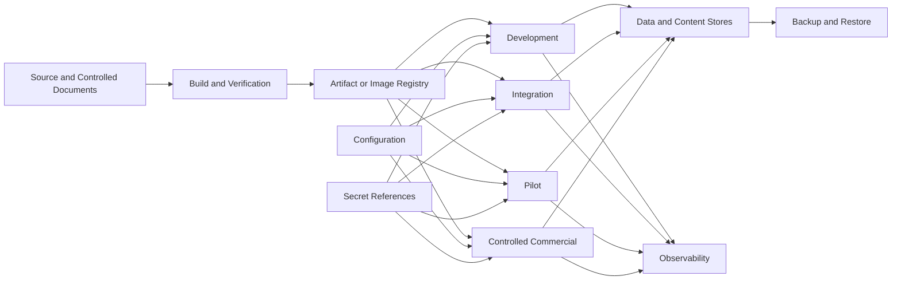

# DEP-001 — Agent OS Deployment Architecture and Environment Strategy

> **Status: Approved baseline — 2026-08-13.** This document defines the proposed deployment architecture and environment strategy for Agent OS. It covers environment classes, local Linux/WSL deployment, Docker Compose, packaging, configuration, secret references, data volumes, networking, reverse proxy, TLS, build promotion, migrations, release rollout, rollback, maintenance, environment parity, pilot deployment, controlled commercialization, and deployment evidence. It does not select a final cloud provider, container orchestrator, CI/CD platform, secret manager, reverse proxy, operating-system distribution, or production hosting model.

## 1. Purpose

Agent OS must be deployable in a way that preserves:

- control-plane authority;
- workspace isolation;
- durable runs;
- approval exactness;
- safe adapters;
- protected tool execution;
- artifact integrity;
- governed memory;
- event and audit durability;
- observability;
- backup and restore;
- environment-specific policy;
- human-controlled promotion.

This document defines how the system moves from:

```text
developer workstation
→ repeatable local environment
→ integration environment
→ controlled pilot
→ controlled commercial deployment
```

without treating a local demo as production readiness.

## 2. Current local implementation baseline

The supported local environment is the root `docker-compose.yml` stack with PostgreSQL, Redis, FastAPI backend, and Next.js frontend. The host endpoints are API `http://localhost:8080`, API documentation `http://localhost:8080/docs`, frontend `http://localhost:3080`, PostgreSQL `localhost:5435`, and Redis `localhost:6381`. Required local variables are defined by `.env.example`; Compose configuration can be checked without starting services using `docker compose config --quiet` with those variables supplied.

This is a development baseline only. It is not evidence of production deployment, high availability, provider execution, adapter execution, backup/restore, or secure external exposure.

## 3. Document status

`DEP-001` is being drafted as an autonomous document because deployment architecture and operational procedures are different concerns.

The document register must later confirm one of these outcomes:

```text
Option A
DEP-001 becomes an official controlled document
and OPS-001 depends on it

Option B
DEP-001 is merged into OPS-001
and the autonomous ID is retired
```

Until the global documentation audit, `register_status` remains `pending_confirmation`.

## 3. Deployment objectives

The deployment strategy must:

1. provide one canonical local startup path;
2. support Linux and WSL2 first;
3. avoid mandatory external cloud services for the MVP;
4. preserve durable data outside source code;
5. separate configuration from secrets;
6. produce reproducible build artifacts;
7. promote the same tested build between environments;
8. make environment drift visible;
9. fail safely on invalid configuration;
10. constrain network and filesystem exposure;
11. support migrations and recovery;
12. support backup and restore;
13. expose health, readiness, and build identity;
14. allow adapter and provider revocation;
15. support maintenance and emergency stop;
16. avoid autonomous production deployment;
17. provide a path to controlled commercialization.

## 4. Non-goals

This document does not:

- select Kubernetes;
- require a public cloud;
- require high availability for the local MVP;
- define final production SLAs;
- define public multi-tenant SaaS;
- authorize automatic deployment to production;
- authorize autonomous database migrations;
- authorize unreviewed infrastructure changes;
- authorize public internet exposure by default;
- define legal or contractual hosting obligations;
- define complete operational runbooks;
- define disaster recovery objectives;
- define final infrastructure-as-code tooling.

## 5. Core deployment principles

### `DEP-P-001 — Same build, different configuration`

Promotion should move the same verified build artifact across environments.

### `DEP-P-002 — Configuration is not authority`

Environment configuration cannot bypass domain policy, approval, or prohibited-action controls.

### `DEP-P-003 — Secrets are references`

Applications receive secret references and narrowly resolved values, not repository-stored secrets.

### `DEP-P-004 — Durable data lives outside containers`

Containers are replaceable. Authoritative data and protected content persist in governed volumes or stores.

### `DEP-P-005 — Local-first does not mean insecure`

Loopback, host validation, authentication, filesystem permissions, and secret protection still apply.

### `DEP-P-006 — Readiness is deployment-specific`

A process may be alive but not ready because dependencies, migrations, policies, adapters, or storage are not safe.

### `DEP-P-007 — Migrations are explicit release steps`

Schema changes are validated, backed up where required, and never hidden inside an uncontrolled startup.

### `DEP-P-008 — Promotion requires evidence`

A successful build does not automatically authorize deployment.

### `DEP-P-009 — Rollback is not assumed`

Application rollback, feature disablement, adapter revocation, migration forward-fix, and data restore are separate strategies.

### `DEP-P-010 — Exposure is deny by default`

Services bind only to the minimum required interfaces and ports.

### `DEP-P-011 — Environment drift is observable`

Configuration, schema, adapter, model, and feature differences are inventoried and compared.

### `DEP-P-012 — Deployment actions remain human-controlled`

Commit, release, promotion, migration, restore, and production activation require explicit authority.

## 6. Deployment architecture overview



## 7. Deployment units

Potential independently deployable units:

```text
mission-control-web
control-plane-api
orchestrator
worker
policy-service
approval-service
artifact-service
memory-service
audit-service
cost-service
operations-service
adapter-simulator
codex-adapter
hermes-adapter
model-gateway
tool-gateway
preview-worker
backup-utility
reverse-proxy
database
event-or-job-store
artifact-content-store
search-or-index-store
telemetry-stack
```

The first implementation may package several logical services into fewer physical processes.

## 8. Logical versus physical deployment

Logical boundaries remain stable even when deployed together.

Example initial profile:

```text
control-plane-api process
├── workspace and identity modules
├── task and run modules
├── policy and approval modules
├── artifact metadata module
├── memory metadata module
├── audit and cost modules
└── operations API
```

Separate processes remain recommended for:

- workers;
- adapters;
- preview conversion;
- sandbox/tool execution;
- backup and restore;
- telemetry collectors.

## 9. Deployment profiles

```text
D0 — Developer workstation
D1 — Canonical local stack
D2 — Ephemeral integration stack
D3 — Controlled pilot stack
D4 — Controlled commercial single-tenant stack
D5 — Future multi-tenant production stack
```

## 10. D0 — Developer workstation

Purpose:

- rapid coding;
- unit tests;
- selected integrations;
- frontend development;
- adapter simulation;
- documentation.

Characteristics:

- some processes may run outside containers;
- database and dependencies may run through Compose;
- repository in Linux filesystem;
- synthetic data;
- no real production credentials;
- no public exposure;
- not release evidence by itself.

## 11. D1 — Canonical local stack

Purpose:

- reproducible full local Agent OS;
- system integration;
- visual verification;
- recovery tests;
- local operator use.

Characteristics:

- Docker Compose or equivalent;
- all required services defined;
- protected local volumes;
- loopback or controlled LAN exposure;
- authentication enabled;
- simulator available;
- optional real adapters;
- local observability;
- backup and restore commands.

## 12. D2 — Ephemeral integration stack

Purpose:

- CI;
- contract tests;
- migrations;
- E2E;
- concurrency;
- fault injection.

Characteristics:

- clean environment;
- deterministic configuration;
- isolated data;
- synthetic fixtures;
- disposable after evidence collection;
- no real external effects by default.

## 13. D3 — Controlled pilot stack

Purpose:

- limited real users;
- approved adapters and providers;
- controlled data;
- operational rehearsal.

Characteristics:

- documented host and network;
- TLS where network exposure requires it;
- monitored;
- backed up;
- restore tested;
- incident/support ownership;
- emergency stop;
- exact environment inventory;
- no unsupported features silently enabled.

## 14. D4 — Controlled commercial single-tenant stack

Purpose:

- one controlled customer or installation;
- contractual support;
- stronger deployment governance.

Additional requirements:

- environment separation;
- production-grade secrets;
- deployment audit;
- customer data controls;
- update and rollback process;
- continuity;
- support;
- security review;
- capacity planning;
- customer-facing limitations.

## 15. D5 — Future multi-tenant production stack

Potential future requirements:

- stronger tenant isolation;
- dedicated key management;
- HA;
- orchestration platform;
- autoscaling;
- zero/low-downtime migration;
- tenant-aware observability;
- compliance;
- regional data controls;
- formal SLOs;
- advanced DR.

D5 is outside the current MVP commitment.

## 16. Environment classes

Canonical environments:

```text
development
test
integration
security_test
performance_test
recovery_test
pilot
controlled_commercial
```

## 17. Environment identity

Every environment has:

- environment ID;
- profile;
- owner;
- purpose;
- data classification ceiling;
- network exposure;
- build version;
- schema version;
- configuration version;
- enabled adapters;
- enabled model profiles;
- feature flags;
- backup policy;
- support status.

## 18. Environment invariants

- production-like environments do not use developer credentials;
- test environments do not share production data by default;
- environment ID is visible in diagnostics;
- environment configuration is versioned or hashed;
- build identity is visible;
- schema compatibility is checked;
- feature flags are inventoried;
- external destinations are allowlisted.

## 19. Environment parity

Parity should be maintained for:

- service topology;
- schemas;
- configuration semantics;
- security controls;
- data volumes;
- startup order;
- health/readiness;
- event/job behavior;
- backup/restore tooling;
- adapter contract versions.

Exact resource sizes and credentials may differ.

## 20. Environment drift

Drift categories:

```text
build_drift
configuration_drift
schema_drift
feature_flag_drift
adapter_drift
model_profile_drift
secret_reference_drift
network_policy_drift
storage_drift
observability_drift
```

## 21. Drift detection

Deployment comparison should identify:

- unexpected build;
- unapproved feature;
- missing security control;
- different provider endpoint;
- expired adapter validation;
- migration mismatch;
- backup disabled;
- telemetry disabled;
- public port exposure;
- different retention setting.

## 22. Drift states

```text
matched
expected_difference
unreviewed_difference
material_drift
critical_drift
unknown
```

Material and critical drift block promotion or readiness.

## 23. Host platform strategy

Primary host profile:

```text
Linux
or
WSL2 with Linux filesystem and Docker integration
```

Future profiles may include:

- native Linux server;
- managed VM;
- dedicated appliance;
- container orchestration platform.

## 24. WSL2 development profile

Recommended path:

```text
/home/<user>/projects/agent-os
```

Avoid active source under:

```text
/mnt/c/...
```

when filesystem performance, permissions, symlinks, or watching are unreliable.

## 25. WSL2 network behavior

Document:

- browser access from Windows;
- loopback behavior;
- port forwarding;
- LAN binding;
- firewall;
- Docker Desktop integration;
- hostnames;
- trusted-host configuration.

Do not bind to `0.0.0.0` without explicit need.

## 26. Linux host requirements

Document supported:

- distribution family;
- architecture;
- kernel/container requirements;
- filesystem;
- disk space;
- memory;
- CPU;
- Docker/Compose version;
- time synchronization;
- backup destination;
- user/group permissions.

Exact versions require ADR.

## 27. Time synchronization

Deployment requires:

- correct UTC time;
- NTP or equivalent;
- timezone-aware services;
- monotonic durations where possible;
- clock-skew monitoring.

Approval expiry, leases, events, retention, and evidence depend on time correctness.

## 28. Filesystem layout

Recommended logical host layout:

```text
/opt/agent-os/                  # deployment manifests and scripts
/etc/agent-os/                  # non-secret configuration
/var/lib/agent-os/database/     # database volume
/var/lib/agent-os/artifacts/    # artifact content
/var/lib/agent-os/indexes/      # derived indexes
/var/lib/agent-os/backups/      # local backup staging
/var/log/agent-os/              # local logs if file-based
/run/agent-os/                  # runtime state
```

Actual paths require ADR and platform adaptation.

## 29. Filesystem permissions

Requirements:

- dedicated service user or container user;
- least privilege;
- restrictive configuration permissions;
- no world-readable secrets;
- artifact store not web-public;
- backup directory restricted;
- no source repository write for runtime services;
- adapters receive only scoped workspace/repository mounts;
- preview workers use disposable scratch space.

## 30. Container strategy

Containers provide:

- dependency isolation;
- reproducible packaging;
- process identity;
- resource limits;
- health checks;
- versioned images;
- replaceable runtime.

Containers do not automatically provide sufficient sandboxing.

## 31. Container principles

- non-root where practical;
- minimal base image;
- multi-stage builds;
- no embedded secrets;
- read-only root filesystem where possible;
- explicit writable mounts;
- drop capabilities;
- no privileged mode;
- no Docker socket;
- health checks;
- resource limits;
- image scanning;
- build metadata.

## 32. Compose strategy

The canonical local stack should use one primary Compose definition plus environment overlays where necessary.

Potential files:

```text
compose.yaml
compose.dev.yaml
compose.test.yaml
compose.pilot.yaml
```

Avoid uncontrolled duplication across many Compose files.

## 33. Compose service groups

Profiles may include:

```text
core
adapters
observability
security-test
recovery
optional-providers
```

Profiles cannot bypass required security services.

## 34. Canonical Compose services

Illustrative:

```text
web
api
worker
database
artifact-store
adapter-simulator
codex-adapter
hermes-adapter
preview-worker
telemetry
reverse-proxy
```

Some services may be optional by profile.

## 35. Container startup order

Startup should not rely only on process order.

Each service uses:

- dependency health;
- migration state;
- readiness;
- retry with bounds;
- fail-safe degraded mode.

## 36. Container health checks

Health checks should test:

- process liveness;
- bounded readiness;
- not full expensive E2E;
- no external consequential action;
- no secret exposure.

## 37. Container resource limits

Define per service:

- CPU;
- memory;
- process count;
- file descriptors;
- storage;
- restart policy.

Preview, adapters, and tools receive especially strict limits.

## 38. Container restart policy

Restart policy depends on component:

- stateless API: restart on failure;
- worker: restart with lease recovery;
- adapter: restart with session reconciliation;
- migration: no automatic endless restart;
- backup/restore job: explicit retry policy;
- database: controlled restart.

## 39. Image build strategy

Build pipeline should:

1. use locked dependencies;
2. build frontend/backend;
3. run tests;
4. generate contracts;
5. create runtime image;
6. scan image;
7. generate manifest;
8. calculate digest;
9. publish immutable artifact;
10. record build evidence.

## 40. Image identity

Images expose:

- application version;
- source reference;
- build date;
- schema compatibility;
- contract versions;
- dependency manifest reference;
- image digest.

## 41. Image tags

Use immutable digest as authority.

Human-readable tags may include:

```text
0.1.0
0.1.0-rc.1
pilot-2026-07-20
```

Avoid deployment based only on mutable `latest`.

## 42. Build reproducibility

A reproducible build requires:

- locked dependencies;
- controlled base images;
- deterministic generation;
- no uncontrolled network downloads at runtime;
- recorded toolchain;
- build manifest;
- digest comparison where possible.

## 43. Software bill of materials

A future SBOM or dependency inventory should include:

- application dependencies;
- system packages;
- container base;
- licenses;
- versions;
- source.

The exact format requires ADR.

## 44. Package signing

Package or image signing is a future recommended control.

It requires:

- signing authority;
- key management;
- verification at deployment;
- rotation;
- revocation;
- evidence.

## 45. Configuration architecture

Configuration is divided into:

```text
application defaults
environment configuration
workspace-governed configuration
secret references
per-run immutable snapshot
```

## 46. Configuration categories

```text
non_secret_runtime
security_control
network_policy
storage
database
adapter
model_provider
feature_flag
observability
backup
retention
```

## 47. Configuration sources

Potential sources:

- packaged defaults;
- versioned config file;
- environment variables;
- mounted config;
- configuration service;
- workspace database records.

Final precedence requires ADR.

## 48. Configuration precedence

Recommended direction:

```text
safe compiled defaults
→ environment non-secret config
→ governed deployment overrides
→ secret references
→ workspace policy
→ per-run snapshot
```

A lower-trust layer cannot weaken hard prohibitions.

## 49. Configuration validation

Validate before readiness:

- required fields;
- types;
- ranges;
- paths;
- hostnames;
- endpoints;
- TLS;
- secret references;
- schema compatibility;
- feature combinations;
- public exposure;
- backup destination;
- retention;
- adapter/model compatibility.

## 50. Invalid configuration behavior

Outcomes:

```text
startup_blocked
component_degraded
feature_disabled
workspace_not_ready
adapter_not_ready
```

Invalid critical configuration must not be ignored.

## 51. Configuration hash

Each deployment should calculate a safe configuration fingerprint excluding secret values.

The hash supports:

- drift comparison;
- evidence;
- incident diagnosis;
- release manifest.

## 52. Environment variables

Environment variables may carry:

- non-secret settings;
- secret-reference identifiers;
- bootstrap paths.

Avoid:

- large JSON blobs;
- raw confidential content;
- permanent production secrets;
- uncontrolled precedence.

## 53. `.env` policy

For local development:

```text
.env.example
→ tracked, safe placeholders

.env
→ local, ignored, restricted
```

For pilot/commercial deployment, prefer a governed secret/configuration mechanism over manually copied `.env` files.

## 54. Secret architecture

Secrets are separated from ordinary configuration.

Secret lifecycle:

```text
provision
→ reference
→ resolve at narrow boundary
→ use
→ audit metadata
→ rotate
→ revoke
→ delete
```

## 55. Secret storage candidates

Potential implementations:

- local encrypted store;
- operating-system credential store;
- dedicated secret manager;
- hardware-backed key store;
- mounted secret files;
- short-lived workload credentials.

Final selection requires ADR.

## 56. Secret reference fields

A secret reference may include:

- secret reference ID;
- purpose;
- provider/account;
- allowed component;
- allowed workspace;
- expiry;
- rotation state;
- validation state;
- no secret value.

## 57. Secret resolution

Resolve secrets:

- at the adapter/provider/tool boundary;
- only for approved purpose;
- for bounded duration;
- without returning value to UI;
- without logging;
- with failure state;
- with revocation checks.

## 58. Secret rotation

Rotation procedure should:

- provision new secret;
- validate;
- update reference;
- deploy/reload;
- confirm health;
- revoke old secret;
- audit;
- support rollback window where safe.

## 59. Secret bootstrap

Initial bootstrap must avoid default public credentials.

Options:

- interactive one-time setup;
- local generated credential;
- external identity bootstrap;
- mounted bootstrap secret removed after use.

## 60. Network architecture

Network zones may include:

```text
user_access
control_plane_internal
worker_internal
adapter_internal
sandbox_restricted
data_internal
observability_internal
backup_internal
external_provider_egress
```

## 61. Network principles

- deny by default;
- expose minimum ports;
- authenticate internal calls;
- separate user-facing and internal services;
- restrict provider egress;
- revalidate redirects;
- protect metadata/internal addresses;
- log denials safely;
- no public database/artifact-store ports.

## 62. Local loopback profile

Default D1 exposure:

```text
127.0.0.1
```

Browser and local services use loopback.

No LAN access unless explicitly enabled.

## 63. Controlled LAN profile

When classroom, office, or pilot LAN access is required:

- explicit bind address;
- host firewall;
- trusted-host validation;
- authentication;
- TLS where feasible/required;
- no database/store exposure;
- documented client URL;
- network owner;
- shutdown procedure.

## 64. Public internet exposure

Public exposure is outside MVP by default.

Before enabling:

- reverse proxy;
- TLS;
- trusted domain;
- rate limiting;
- WAF/reverse-proxy controls where appropriate;
- external security review;
- incident response;
- identity hardening;
- backup/DR;
- G5 quality gate.

## 65. Reverse proxy

A reverse proxy may provide:

- TLS termination;
- host validation;
- routing;
- request limits;
- timeouts;
- compression;
- security headers;
- access logs;
- maintenance pages.

Final product requires ADR.

## 66. TLS

TLS requirements depend on exposure:

- loopback development may use HTTP;
- controlled LAN should evaluate local TLS;
- pilot/commercial network exposure requires approved TLS;
- certificate lifecycle documented;
- private keys protected;
- expired certificate alerts.

## 67. Internal service authentication

Potential methods:

- workload tokens;
- mTLS;
- Unix sockets/local IPC;
- network identity plus short-lived credentials.

Internal network location alone is insufficient authorization.

## 68. CORS and browser origins

Deployment config must:

- default same-origin;
- list allowed origins explicitly;
- reject wildcard with credentials;
- align CSRF/session profile;
- separate development origins from pilot origins.

## 69. DNS and hostnames

Deployment defines:

- canonical user URL;
- internal service names;
- trusted hosts;
- certificate names;
- no ambiguous mutable aliases for production;
- safe localhost defaults.

## 70. Ports

Every port has:

- service;
- protocol;
- exposure;
- owner;
- environment;
- firewall rule;
- TLS state;
- necessity.

Unused ports remain closed.

## 71. Data-store architecture

Primary authoritative stores:

```text
transactional relational database
artifact-content store
event/job/outbox/inbox store
audit/evidence store
```

Derived stores:

```text
search index
vector index
cache
dashboard projections
telemetry stores
```

## 72. Data-volume principles

- persistent;
- not inside image;
- access-controlled;
- backed up according to policy;
- capacity monitored;
- integrity checked;
- environment-specific;
- not shared accidentally;
- no source repository storage.

## 73. Database deployment

Database profile defines:

- engine/version;
- host/container;
- storage;
- authentication;
- network;
- connection pool;
- backups;
- migrations;
- monitoring;
- restore compatibility.

Final engine/version requires ADR.

## 74. Database exposure

Database should be:

- internal only;
- not bound publicly;
- authenticated;
- encrypted in transit where required;
- least privilege by application role;
- separate admin/migration authority where practical.

## 75. Database roles

Potential roles:

```text
application_runtime
migration_operator
backup_operator
read_only_diagnostics
```

The runtime application should not automatically possess unrestricted administrative privileges.

## 76. Artifact-store deployment

Artifact content store requires:

- workspace-scoped keys;
- protected root;
- no direct public serving;
- integrity;
- capacity;
- quarantine;
- backup;
- orphan scanning;
- safe download mediation.

## 77. Local filesystem artifact store

For MVP, local Linux filesystem may be acceptable behind abstraction.

Requirements:

- dedicated directory;
- restrictive permissions;
- atomic rename/finalization;
- hash verification;
- no source-tree path;
- no user home-wide access;
- backup support;
- recovery tools.

## 78. Search and index deployment

Search/vector stores are derived.

Deployment must support:

- rebuild;
- deletion propagation;
- workspace scope;
- version compatibility;
- readiness degradation;
- no authoritative dependency for core writes.

## 79. Telemetry deployment

Local-first telemetry may use:

- structured stdout/file logs;
- local collector;
- metrics endpoint/store;
- tracing collector/store;
- dashboard service.

Telemetry volumes are bounded and retained separately.

## 80. Backup destination

Backup destination may be:

- protected local external disk;
- encrypted network storage;
- approved object storage;
- offline rotation.

The destination must not share the same single failure domain as primary data when continuity requires otherwise.

## 81. Build pipeline

Canonical pipeline:

```text
source checkout
→ dependency verification
→ contract generation
→ static checks
→ tests
→ frontend/backend build
→ image/package build
→ image scan
→ migration validation
→ manifest and digest
→ candidate publication
```

## 82. Build isolation

Builds should run in:

- clean environment;
- no developer home secrets;
- controlled network;
- locked dependencies;
- explicit cache;
- reproducible toolchain;
- captured logs.

## 83. Build failure

A failed step prevents candidate publication.

Do not publish partially tested packages under release tags.

## 84. Build evidence

Evidence includes:

- source reference;
- dependency locks;
- test reports;
- schema versions;
- migration inventory;
- image/package digests;
- scan results;
- generation tool versions;
- release manifest.

## 85. Artifact registry

A registry or protected release directory stores immutable candidate artifacts.

Requirements:

- access control;
- immutable digest;
- retention;
- provenance;
- scan status;
- environment promotion record;
- no secret content.

## 86. Promotion model

Promotion stages:

```text
built
→ verified
→ integration_approved
→ release_candidate
→ pilot_approved
→ commercial_approved
```

The package remains the same; approval and environment configuration change.

## 87. Promotion controls

Promotion requires:

- quality gate result;
- release decision record;
- candidate digest;
- target environment;
- config diff;
- migration plan;
- backup state;
- approvers;
- deployment window;
- rollback/stop plan.

## 88. No rebuild between stages

Avoid:

```text
test source
→ rebuild separately for pilot
```

Preferred:

```text
build once
→ verify digest
→ promote same digest
```

If environment-specific frontend build values require rebuilding, that choice must be documented and controlled.

## 89. Release versioning

Potential versioning:

```text
MAJOR.MINOR.PATCH
pre-release identifiers
build metadata
```

Controlled documents and software versions may evolve independently but must be linked.

## 90. Release manifest

A deployment release manifest includes:

- version;
- image/package digests;
- source reference;
- schema/migrations;
- API/event contract versions;
- adapters;
- model profiles;
- feature flags;
- required secrets;
- configuration fingerprint;
- evidence manifest;
- known limitations.

## 91. Deployment plan

A deployment plan includes:

- candidate;
- target;
- owner;
- window;
- prerequisites;
- backups;
- migrations;
- service order;
- health checks;
- smoke tests;
- monitoring;
- stop conditions;
- rollback/forward-fix;
- communication.

## 92. Pre-deployment checks

- candidate approved;
- digest verified;
- environment drift reviewed;
- configuration validated;
- secrets valid;
- capacity available;
- backup current;
- migrations validated;
- maintenance window;
- emergency contacts;
- monitoring ready;
- no unresolved blocker.

## 93. Deployment sequence direction

Typical:

```text
announce maintenance if needed
→ activate maintenance/read-only mode
→ create/verify backup
→ deploy compatible application changes
→ run migrations
→ start/restart services
→ readiness checks
→ smoke tests
→ observation window
→ exit maintenance
```

Exact order depends on migration strategy.

## 94. Zero-downtime direction

Zero downtime is not guaranteed for MVP.

Future support may require:

- backward-compatible schemas;
- rolling deployment;
- multiple instances;
- readiness/load balancing;
- session compatibility;
- event compatibility;
- expand-and-contract migrations.

## 95. Maintenance mode

Maintenance modes may include:

```text
full_unavailable
read_only
no_new_runs
no_protected_actions
adapter_maintenance
artifact_maintenance
```

The mode and impact are visible.

## 96. Read-only mode

Read-only mode may permit:

- authenticated reads;
- timelines;
- evidence review;
- diagnostics.

It blocks:

- new tasks/runs;
- approvals;
- artifact mutations;
- memory writes;
- configuration changes;
- migrations outside operator control.

## 97. No-new-runs mode

Allows:

- existing safe work to finish;
- reads and approvals according to policy;
- operations.

Blocks new dispatch.

## 98. Migration architecture

Migrations are registered, versioned, checksummed, and reviewed.

Categories:

```text
schema_additive
schema_transform
data_backfill
constraint_enforcement
index_change
destructive_cleanup
storage_migration
event_schema_migration
```

## 99. Migration authority

Migration execution requires:

- authorized operator/workload;
- approved plan;
- target environment;
- expected schema;
- backup state;
- maintenance mode if needed;
- evidence.

Application runtime should not have unrestricted migration authority in controlled environments.

## 100. Automatic startup migrations

Automatic migrations may be acceptable in developer/test profiles.

For pilot/commercial profiles, prefer explicit controlled execution.

If automatic startup migration is used, it must:

- be bounded;
- fail safely;
- avoid destructive changes;
- expose result;
- prevent readiness until complete.

## 101. Expand-and-contract deployment

Sequence:

```text
deploy additive schema
→ deploy compatible application
→ backfill
→ validate
→ switch reads/writes
→ observe
→ remove old schema later
```

## 102. Migration preflight

Preflight checks:

- source schema;
- target schema;
- checksum;
- disk;
- locks;
- estimated duration;
- backup;
- active runs;
- compatibility;
- rollback/forward-fix;
- maintenance.

## 103. Migration execution states

```text
planned
validated
waiting_for_approval
scheduled
running
paused
completed
completed_with_warnings
failed
recovery_required
cancelled
unknown
```

## 104. Migration interruption

Large migrations should:

- use checkpoints;
- be resumable;
- use bounded batches;
- preserve progress;
- avoid long locks;
- expose partial state.

## 105. Migration verification

After migration verify:

- schema;
- constraints;
- indexes;
- row counts;
- nullability;
- workspace ownership;
- run/approval/artifact invariants;
- application readiness;
- performance;
- backup compatibility.

## 106. Destructive migrations

Require:

- explicit classification;
- impact;
- backup;
- retention/legal review;
- approval;
- dry run;
- restore test;
- communication;
- no automatic execution.

## 107. Rollback strategy

Rollback options:

```text
application rollback
feature flag disablement
adapter revocation
provider binding disablement
read-only mode
emergency stop
forward-fix migration
data restore
environment replacement
```

## 108. Application rollback

Safe only when:

- previous build understands current schema;
- API/event compatibility remains;
- data written by new version is supported;
- secrets/config remain compatible.

## 109. Database rollback

Direct down-migration is not assumed.

Prefer:

- forward-fix;
- compatible application rollback;
- restore only under controlled procedure.

## 110. Feature disablement

Feature flags may disable optional behavior when:

- state remains valid;
- security is not weakened;
- data remains readable;
- user impact is explained;
- flag is tested.

## 111. Adapter revocation

If adapter is unsafe:

- revoke registration;
- block new dispatch;
- preserve active session evidence;
- reconcile runs;
- alert;
- select fallback only through policy.

## 112. Provider binding disablement

If provider is unavailable or noncompliant:

- disable binding;
- block routing;
- show affected runs;
- evaluate fallback;
- preserve configured/actual identity;
- update readiness.

## 113. Emergency stop

Emergency stop may block:

- new protected runs;
- approval consumption;
- tool dispatch;
- external-effect retries;
- adapter starts.

Release requires authorized review and reconciliation.

## 114. Deployment stop conditions

Stop or rollback when:

- health/readiness fails;
- migration fails;
- data integrity check fails;
- cross-workspace test fails;
- approval control fails;
- secret exposure occurs;
- queue/event corruption appears;
- restore fallback unavailable;
- unknown protected effects surge;
- A0/A1 alerts fire.

## 115. Canary direction

Future controlled deployments may use canary by:

- environment;
- workspace;
- feature flag;
- adapter/provider;
- user cohort.

Canary cannot weaken tenant or approval controls.

## 116. Blue-green direction

Future blue-green deployment may support:

- parallel environments;
- health validation;
- traffic switch;
- rollback;
- database compatibility.

It does not solve destructive migration automatically.

## 117. Rolling direction

Future rolling deployment requires:

- multiple instances;
- backward-compatible schemas;
- event/API compatibility;
- session consistency;
- readiness gates.

## 118. Pilot deployment architecture

Pilot should define:

- host(s);
- physical location;
- network;
- user count;
- workspaces;
- adapters;
- providers;
- data classes;
- storage;
- backups;
- observability;
- support;
- incident process.

## 119. Pilot topology

Possible single-host pilot:

```text
reverse proxy
mission-control web
control-plane API
workers
database
artifact store
approved adapters
local observability
backup utility
```

A single host is a known availability limitation and must be stated.

## 120. Pilot user access

Pilot access requires:

- named identities;
- role assignment;
- secure credential setup;
- workspace membership;
- session expiry;
- support contact;
- no shared generic admin account.

## 121. Pilot data controls

Define:

- allowed data;
- prohibited data;
- classification ceiling;
- provider disclosure;
- retention;
- export;
- deletion;
- backups;
- incident handling.

## 122. Pilot network

Document:

- internal URL;
- TLS;
- firewall;
- remote access;
- VPN if used;
- external provider egress;
- backup egress;
- telemetry egress;
- no public admin endpoints.

## 123. Pilot adapter controls

Only adapters with:

- accepted version;
- current conformance;
- health/readiness;
- owner;
- runbook;
- cancellation limitations;
- capability enablement;
- security profile.

## 124. Pilot model controls

Only model profiles with:

- approved provider/endpoint;
- data policy;
- quota;
- pricing freshness;
- fallback;
- actual identity limitations;
- secret reference;
- monitoring.

## 125. Pilot backup controls

Before pilot:

- backup schedule;
- off-host or separate failure domain where required;
- encryption;
- manifest;
- verification;
- restore drill;
- alerting;
- owner.

## 126. Pilot observation window

After deployment monitor:

- health;
- runs;
- approvals;
- unknown effects;
- adapter/provider errors;
- event queues;
- artifact issues;
- security alerts;
- cost;
- storage;
- backups.

## 127. Pilot shutdown

A pilot shutdown procedure covers:

- stop new work;
- complete/cancel active runs;
- preserve evidence;
- final backup;
- export/delete data according to policy;
- revoke credentials;
- disable endpoints;
- archive environment inventory.

## 128. Controlled commercial architecture

Potential profiles:

```text
single-customer dedicated host
single-customer dedicated VM
single-customer managed container stack
```

Shared multi-tenant hosting remains future.

## 129. Commercial separation

Commercial deployment should separate:

- development;
- integration;
- production;
- backups;
- credentials;
- telemetry;
- customer data;
- support access.

## 130. Commercial secrets

Require:

- managed lifecycle;
- rotation;
- restricted operator access;
- no local plaintext sharing;
- audit;
- emergency revocation;
- backup/key considerations.

## 131. Commercial release process

Requires:

- approved candidate;
- customer impact;
- maintenance/communication;
- backup;
- migration;
- smoke;
- observation window;
- rollback;
- release notes;
- support readiness.

## 132. Commercial update policy

Define:

- supported versions;
- security updates;
- feature releases;
- deprecations;
- migration support;
- end-of-life;
- emergency patches;
- customer notification.

## 133. Infrastructure as code direction

Future infrastructure definition should be:

- versioned;
- reviewable;
- reproducible;
- environment-parameterized;
- secret-free;
- tested;
- drift-detectable.

Final tool requires ADR.

## 134. Provisioning idempotency

Provisioning should be safely repeatable.

It must not:

- reset data;
- overwrite secrets;
- recreate identities unexpectedly;
- open ports;
- change retention silently.

## 135. Host hardening direction

Pilot/commercial host should consider:

- minimal packages;
- automatic security updates policy;
- firewall;
- SSH controls;
- disk encryption;
- service account;
- file permissions;
- audit;
- malware protection;
- time sync;
- backup agent;
- monitoring.

Detailed hardening belongs in security/operations controls.

## 136. Operating-system updates

Define:

- cadence;
- test;
- maintenance;
- restart;
- kernel/container impact;
- rollback;
- emergency updates;
- adapter/provider compatibility.

## 137. Container updates

Base-image updates require:

- rebuild;
- scan;
- tests;
- candidate digest;
- release gates;
- no in-place untracked mutation.

## 138. Dependency updates

Dependency updates are separate missions with:

- changelog;
- compatibility;
- security;
- tests;
- migration impact;
- lockfile review;
- rollback.

## 139. Database version upgrades

Require:

- compatibility matrix;
- backup;
- restore test;
- staging rehearsal;
- migration plan;
- downtime;
- rollback/forward strategy;
- monitoring.

## 140. Storage migrations

Artifact-store or volume migration requires:

- source/target inventory;
- copy strategy;
- hashes;
- permissions;
- freeze or dual-write strategy;
- validation;
- cutover;
- rollback;
- deletion of old copy only after approval.

## 141. Certificate management

Where TLS is used:

- issuance;
- storage;
- renewal;
- expiry alert;
- revocation;
- private-key protection;
- environment scope;
- backup policy.

## 142. Domain management

Where domains are used:

- ownership;
- DNS changes;
- TLS;
- trusted-host configuration;
- expiration;
- change authorization;
- no unapproved wildcard domain.

## 143. Access to deployment systems

Deployment authority should be separated:

```text
build authority
release approval
deployment execution
migration execution
restore execution
security emergency authority
```

A small team may combine roles, but decisions remain logged and explicit.

## 144. Deployment credentials

Deployment credentials should be:

- distinct from runtime credentials;
- short-lived where possible;
- environment-scoped;
- audited;
- revocable;
- excluded from agents unless explicitly authorized.

## 145. Agent deployment restrictions

An AI agent may:

- prepare deployment plan;
- inspect manifests;
- run safe validation;
- generate candidate configuration;
- produce diffs.

It may not autonomously:

- deploy to pilot/commercial;
- rotate production secrets;
- execute destructive migration;
- restore data;
- open public network access;
- change DNS/TLS;
- disable security;
- approve its own deployment.

## 146. Git and deployment

Source integration and deployment are separate approvals.

```text
commit
≠ push
≠ pull request
≠ merge
≠ release build
≠ deployment
```

Each consequential step may require separate authority.

## 147. Deployment event catalogue direction

Potential events:

```text
BuildCandidateCreated
BuildCandidateVerified
ReleaseCandidatePromoted
DeploymentPlanned
DeploymentStarted
DeploymentCompleted
DeploymentFailed
DeploymentStopped
EnvironmentDriftDetected
ConfigurationValidated
ConfigurationRejected
MigrationStarted
MigrationCompleted
MigrationFailed
RollbackStarted
RollbackCompleted
MaintenanceModeActivated
MaintenanceModeReleased
```

Detailed schemas require `EVT-001` update.

## 148. Deployment API direction

Potential internal resources:

```text
/environments
/release-candidates
/deployment-plans
/deployment-operations
/configuration-snapshots
/environment-drift-reports
/migration-operations
/maintenance-windows
```

This is not a public API commitment.

## 149. Deployment observability

Expose:

- candidate digest;
- target environment;
- deployment state;
- current build;
- config hash;
- schema version;
- migration;
- service readiness;
- alerts;
- smoke result;
- observation window;
- rollback status.

## 150. Deployment metrics

Potential metrics:

```text
deployment_attempts_total
deployment_failures_total
deployment_duration_seconds
rollback_attempts_total
environment_drift_findings
configuration_validation_failures
migration_duration_seconds
migration_failures_total
time_to_readiness_seconds
post_deployment_alerts_total
```

## 151. Deployment alerts

Examples:

- unexpected build digest;
- schema drift;
- migration failure;
- readiness timeout;
- secret reference invalid;
- public port exposure;
- backup missing;
- critical configuration drift;
- certificate expiry;
- storage capacity;
- post-deployment A0/A1.

## 152. Deployment logs

Deployment logs include:

- plan ID;
- candidate;
- environment;
- operator;
- action;
- start/end;
- result;
- error code;
- migration;
- health;
- rollback;
- no secret values.

## 153. Deployment evidence bundle

Contains:

- release decision;
- candidate manifest;
- digest verification;
- configuration snapshot/hash;
- drift report;
- backup verification;
- migration report;
- deployment logs;
- health/smoke;
- observation report;
- rollback status;
- approvals.

## 154. Smoke tests

Post-deployment smoke should cover:

- build identity;
- health/live;
- health/ready;
- authentication;
- workspace access;
- task/run safe simulator;
- event/outbox;
- artifact metadata/store;
- approval read path;
- backup readiness;
- no cross-workspace access.

Protected real effects are not required for ordinary smoke.

## 155. Synthetic deployment check

A safe synthetic run may:

- create synthetic task;
- run simulator;
- produce text artifact;
- verify receipt;
- clean up or archive.

It must be clearly marked and excluded from user metrics where appropriate.

## 156. Post-deployment observation

Observe:

- errors;
- latency;
- queues;
- stale/unknown runs;
- adapter/model health;
- approval anomalies;
- artifact issues;
- cost anomalies;
- security;
- storage;
- backup.

## 157. Deployment success

Deployment succeeds only when:

- plan executed;
- migrations verified;
- required services ready;
- smoke passes;
- no stop alert;
- observation period acceptable;
- release record updated.

## 158. Deployment failure

Failure states:

```text
preflight_failed
deployment_failed_before_migration
migration_failed
services_not_ready
smoke_failed
observation_failed
rollback_failed
recovery_required
unknown
```

## 159. Partial deployment

Partial state is explicit.

Examples:

- some services updated;
- migration applied;
- adapters old;
- frontend new/API old;
- config updated but service failed.

Partial deployment requires recovery plan, not success.

## 160. Deployment concurrency

Prevent:

- two deployments to same environment;
- migration concurrent with restore;
- deployment concurrent with destructive maintenance;
- config mutation during promotion;
- rollback concurrent with new promotion.

Use environment leases/locks with fencing where appropriate.

## 161. Deployment lock

A deployment lock includes:

- environment;
- operation;
- owner;
- start;
- expiry;
- fencing token;
- heartbeat;
- recovery.

An expired lock does not prove the operation had no effect.

## 162. Maintenance windows

Maintenance window fields:

- environment;
- scope;
- start/end;
- owner;
- expected impact;
- approved operations;
- communication;
- alerts suppressed;
- rollback;
- status.

## 163. Change freeze

A change freeze may apply during:

- pilot event;
- incident;
- restore;
- major migration;
- audit;
- critical business period.

Emergency security changes use an expedited controlled process.

## 164. Deployment scheduling

Consider:

- operator availability;
- backup completion;
- user activity;
- provider maintenance;
- support coverage;
- restore window;
- observation time.

## 165. Release communication

Communicate:

- version;
- scope;
- downtime;
- user impact;
- known limitations;
- support;
- rollback;
- data/migration impact;
- completion.

## 166. Deployment failure communication

Include:

- affected environment;
- user impact;
- safe state;
- current action;
- next update;
- data integrity status;
- no unsupported certainty.

## 167. Capacity planning

Deployment profiles define:

- CPU;
- memory;
- disk;
- database;
- artifact storage;
- telemetry storage;
- concurrency;
- provider quota;
- backup space.

## 168. Capacity thresholds

Monitor:

- disk warning/critical;
- database connections;
- worker saturation;
- event backlog;
- artifact growth;
- telemetry growth;
- backup destination;
- provider quota.

## 169. Vertical scaling

Initial local/pilot scaling may use:

- more CPU/memory;
- larger disk;
- worker concurrency;
- database tuning;
- storage separation.

## 170. Horizontal scaling

Future scaling may require:

- stateless API replicas;
- distributed worker leases;
- shared database/store;
- load balancer;
- centralized identity;
- shared telemetry;
- migration coordination.

## 171. Single-host limitations

A single-host deployment has:

- host failure risk;
- shared power/network risk;
- maintenance downtime;
- limited HA;
- local backup risk.

These limitations must be visible in pilot/commercial claims.

## 172. External dependency strategy

Dependencies include:

- model providers;
- Git hosting;
- identity provider;
- object storage;
- telemetry provider;
- email/calendar/MCP integrations.

Each has:

- owner;
- endpoint;
- data classes;
- credentials;
- quota;
- timeout;
- fallback;
- outage behavior;
- contractual terms;
- monitoring.

## 173. Provider outage

Deployment/readiness behavior:

- mark binding degraded/unhealthy;
- block or reroute according to policy;
- no silent fallback;
- show affected runs;
- preserve unknown effects;
- alert;
- reconcile.

## 174. Offline mode direction

A local/offline profile may support:

- local UI/API/database;
- simulator;
- local adapters/models where available;
- no external provider;
- queued or blocked external work;
- explicit capability limits.

## 175. Air-gapped direction

Future air-gapped deployment would require:

- offline package transfer;
- signed manifests;
- local registries;
- local models;
- offline updates;
- no external telemetry;
- offline license/dependency process.

Not an MVP commitment.

## 176. Security testing of deployment

Tests include:

- public port scan;
- default credentials;
- container privileges;
- volume permissions;
- Docker socket;
- secret mounts;
- CORS/hosts;
- TLS;
- internal service auth;
- image scan;
- configuration injection;
- cross-environment credential reuse.

## 177. Deployment fault tests

Inject:

- container crash;
- host restart;
- database unavailable;
- storage unavailable;
- migration interruption;
- network partition;
- certificate expiry simulation;
- disk full;
- telemetry outage;
- backup failure;
- rollback failure.

## 178. Deployment recovery tests

Verify:

- restart;
- leases invalidated/reconciled;
- outbox drain;
- adapter sessions reconciled;
- partial deployment recognized;
- migration recovery;
- restore path;
- readiness;
- no duplicate effects.

## 179. Deployment performance tests

Measure:

- startup time;
- readiness time;
- migration duration;
- build size/time;
- image pull/start;
- backup duration;
- restore duration;
- resource use;
- observation stabilization.

## 180. Accessibility deployment checks

Deployment must preserve:

- frontend assets loaded;
- correct locale;
- fonts/resources available;
- no CSP breakage;
- no inaccessible maintenance page;
- error pages accessible;
- no stale cached bundle.

## 181. Frontend asset deployment

Requirements:

- content-hashed assets;
- cache-control;
- version compatibility;
- no stale index referencing removed assets;
- rollback compatibility;
- build identity;
- hard-refresh verification.

## 182. Service worker direction

If a service worker is introduced:

- update strategy;
- cache invalidation;
- offline behavior;
- rollback;
- stale-build detection;
- security review.

Not required for MVP.

## 183. Database connection management

Deployment config defines:

- pool size;
- timeout;
- health;
- migration connection;
- worker/API allocation;
- capacity limits;
- no unbounded connections.

## 184. Graceful shutdown

Services should:

- stop accepting new work;
- finish or safely checkpoint bounded operations;
- release leases;
- flush durable state;
- publish/retain outbox intent;
- close connections;
- report shutdown.

## 185. Termination grace period

Define per component:

- API;
- worker;
- adapter;
- preview;
- backup;
- database.

Forced termination after grace may create stale/unknown state requiring recovery.

## 186. Startup recovery

Before readiness:

- validate config;
- validate schema;
- scan nonterminal runs;
- expire/recover leases;
- inspect outbox/inbox;
- reconcile adapter sessions;
- verify artifact store;
- check emergency stop;
- start schedulers only after safe state.

## 187. Adapter deployment

Each adapter image/process has:

- own version;
- own dependencies;
- own secret references;
- scoped mounts/network;
- health/readiness;
- conformance evidence;
- independent disable/revoke.

## 188. Codex adapter deployment

Requires:

- controlled repository/worktree mounts;
- no broad home mount;
- no Docker socket;
- bounded command execution;
- Git credential references only when approved;
- commit/push separated;
- merge/force push prohibited;
- audit.

## 189. Hermes adapter deployment

Requires:

- verified runtime;
- session isolation;
- capability visibility;
- model/provider configuration;
- native-tool policy;
- scoped filesystem/network;
- health/readiness;
- revocation.

## 190. Preview worker deployment

Requires:

- isolated container/process;
- read-only input;
- scratch output;
- no network by default;
- resource limits;
- disposable filesystem;
- format-specific tooling;
- patching/scanning;
- no direct UI execution.

## 191. Tool sandbox deployment

Requires stronger controls than ordinary service containers.

Potential mechanisms:

- dedicated container runtime profile;
- microVM;
- OS sandbox;
- user namespace;
- seccomp/AppArmor/SELinux;
- network namespace.

Final architecture belongs in registered `SAN-001`.

## 192. Backup utility deployment

Backup utility has:

- read authority for exact stores;
- write authority to backup destination;
- no ordinary application mutation;
- manifest generation;
- encryption;
- verification;
- scheduling;
- audit.

## 193. Restore utility deployment

Restore utility is privileged and normally disabled.

Activation requires:

- maintenance;
- approval;
- exact backup;
- target;
- validation;
- audit;
- post-restore reconciliation.

## 194. Deployment documentation set

Required documents/artifacts:

- environment inventory;
- architecture diagram;
- Compose/manifests;
- configuration reference;
- secret-reference inventory;
- port/network inventory;
- storage/volume inventory;
- release manifest;
- deployment plan;
- migration plan;
- rollback plan;
- backup/restore plan;
- runbooks;
- known limitations.

## 195. Environment inventory template

```text
Environment ID:
Profile:
Owner:
Purpose:
Host(s):
Network:
User URL:
Build:
Schema:
Configuration hash:
Services:
Adapters:
Model profiles:
Storage:
Backups:
Observability:
Support:
Known limitations:
```

## 196. Service inventory template

```text
Service:
Version/digest:
Purpose:
Ports:
Dependencies:
Volumes:
Secrets:
Health:
Readiness:
Resources:
Owner:
Runbook:
```

## 197. Port inventory template

```text
Port:
Protocol:
Service:
Bind interface:
External/internal:
TLS:
Firewall:
Purpose:
Owner:
```

## 198. Volume inventory template

```text
Volume:
Purpose:
Path/store:
Owner:
Classification:
Backup:
Retention:
Capacity:
Permissions:
Restore:
```

## 199. Secret-reference inventory template

```text
Reference:
Purpose:
Provider/account:
Allowed component:
Allowed workspace:
Rotation:
Expiry:
Validation:
Owner:
```

## 200. Deployment plan template

```text
Deployment ID:
Candidate:
Target:
Owner:
Window:
Prerequisites:
Backup:
Migrations:
Configuration changes:
Service sequence:
Health checks:
Smoke tests:
Observation:
Stop conditions:
Rollback/forward-fix:
Communication:
Approvals:
```

## 201. Deployment decision states

```text
planned
approved
scheduled
in_progress
completed
completed_with_conditions
failed
stopped
rolled_back
recovery_required
cancelled
unknown
```

## 202. Deployment requirement catalogue

### Environments and promotion

- `DEP-REQ-ENV-001` — Environment profiles are explicit and owned.
- `DEP-REQ-ENV-002` — Build identity is visible.
- `DEP-REQ-ENV-003` — The same tested build is promoted.
- `DEP-REQ-ENV-004` — Environment drift is detected.
- `DEP-REQ-ENV-005` — Pilot and commercial environments are separated from development.
- `DEP-REQ-ENV-006` — Environment configuration is validated.
- `DEP-REQ-ENV-007` — Public exposure is disabled by default.
- `DEP-REQ-ENV-008` — Deployment state and evidence are auditable.

### Containers and hosts

- `DEP-REQ-HST-001` — Containers avoid privileged mode.
- `DEP-REQ-HST-002` — Docker socket is not mounted.
- `DEP-REQ-HST-003` — Writable volumes are explicit.
- `DEP-REQ-HST-004` — Runtime data lives outside images.
- `DEP-REQ-HST-005` — Services expose health/readiness.
- `DEP-REQ-HST-006` — Resource limits are defined.
- `DEP-REQ-HST-007` — Host/WSL paths and permissions are controlled.
- `DEP-REQ-HST-008` — Startup recovery occurs before readiness.

### Configuration and secrets

- `DEP-REQ-CFG-001` — Configuration and secrets are separated.
- `DEP-REQ-CFG-002` — Raw secrets are not stored in Git.
- `DEP-REQ-CFG-003` — Secret references are purpose- and component-bound.
- `DEP-REQ-CFG-004` — Invalid critical configuration blocks readiness.
- `DEP-REQ-CFG-005` — Configuration fingerprints support drift detection.
- `DEP-REQ-CFG-006` — Feature flags cannot weaken hard controls.
- `DEP-REQ-CFG-007` — Secret rotation and revocation are supported.
- `DEP-REQ-CFG-008` — Environment credentials are not reused casually.

### Network and storage

- `DEP-REQ-NST-001` — Network exposure is deny by default.
- `DEP-REQ-NST-002` — Databases and content stores are not publicly exposed.
- `DEP-REQ-NST-003` — External provider egress is allowlisted.
- `DEP-REQ-NST-004` — Internal calls are authenticated where required.
- `DEP-REQ-NST-005` — Durable stores are backed up according to policy.
- `DEP-REQ-NST-006` — Derived stores are rebuildable.
- `DEP-REQ-NST-007` — Artifact content is not served directly.
- `DEP-REQ-NST-008` — Capacity and permissions are monitored.

### Releases and migrations

- `DEP-REQ-RLS-001` — Releases use immutable candidate digests.
- `DEP-REQ-RLS-002` — Promotion requires quality evidence.
- `DEP-REQ-RLS-003` — Deployment plans include stop and recovery conditions.
- `DEP-REQ-RLS-004` — Migrations are explicit and checksummed.
- `DEP-REQ-RLS-005` — Risky migrations require backup and verification.
- `DEP-REQ-RLS-006` — Partial deployment is not reported as success.
- `DEP-REQ-RLS-007` — Rollback compatibility is assessed.
- `DEP-REQ-RLS-008` — Deployment actions remain human-authorized.

### Pilot and commercial

- `DEP-REQ-PLC-001` — Pilot topology and limitations are documented.
- `DEP-REQ-PLC-002` — Pilot access uses named identities.
- `DEP-REQ-PLC-003` — Pilot data classes and provider disclosure are controlled.
- `DEP-REQ-PLC-004` — Pilot backup and restore are proven.
- `DEP-REQ-PLC-005` — Commercial deployment separates environments and credentials.
- `DEP-REQ-PLC-006` — Commercial updates and rollback are documented.
- `DEP-REQ-PLC-007` — Commercial readiness requires G5 evidence.
- `DEP-REQ-PLC-008` — Local MVP is not represented as general production readiness.

## 203. Traceability

| Source | DEP-001 response |
|---|---|
| `SCP-001` | Local-first scope and commercialization boundary |
| `NFR-001` | Security, reliability, portability, performance |
| `SAD-001` | Deployment units and component topology |
| `DAT-001` | Data stores, retention, backup, integrity |
| `ORC-001` | Workers, leases, startup recovery |
| `SEC-001` | Exposure, secrets, sandbox, least privilege |
| `THR-001` | Deployment and supply-chain threats |
| `API-001` | Health, configuration, deployment API direction |
| `EVT-001` | Deployment/migration events |
| `DEV-001` | Docker/WSL, repository, build and migrations |
| `TST-001` | Deployment, migration, recovery tests |
| `QAG-001` | Promotion and release gates |
| `OBS-001` | Deployment telemetry and alerts |
| `OPS-001` | Procedures and runbooks |
| `BCP-001` | Backup, restore, continuity and DR |

## 204. Mapping to containers

| Deployment concern | Containers/components |
|---|---|
| Mission Control | `CTR-001` |
| Control Plane | `CTR-002` |
| Orchestrator/workers | `CTR-003`, workers |
| Adapters | `CTR-004`–`CTR-006` |
| Model Gateway | `CTR-007` |
| Tool/sandbox | `CTR-008`, `CTR-009` |
| Memory/artifact | `CTR-010`, `CTR-011` |
| Audit/cost/ops | `CTR-012`–`CTR-014` |
| Database/event stores | `CTR-015`, `CTR-016` |
| Artifact/index stores | `CTR-017`, `CTR-018` |
| Evidence/observability | `CTR-019`, `CTR-020` |
| Backup/restore | `CTR-021` |

## 205. ADR backlog

### `ADR-CANDIDATE-DEP-001 — Deployment packaging and host profiles`

Select supported Linux/WSL distributions, packaging, Compose layout, and installation path.

### `ADR-CANDIDATE-DEP-002 — Build, registry, signing, and promotion`

Select build pipeline, immutable registry, manifest, SBOM, signing, and promotion controls.

### `ADR-CANDIDATE-DEP-003 — Configuration and secret management`

Select configuration source, precedence, secret store, workload credentials, and rotation.

### `ADR-CANDIDATE-DEP-004 — Network, reverse proxy, and TLS`

Select exposure profiles, proxy, certificates, service authentication, and LAN/pilot access.

### `ADR-CANDIDATE-DEP-005 — Data volumes, artifact storage, and backup destinations`

Select database deployment, local/object store, volume layout, backup targets, and capacity.

### `ADR-CANDIDATE-DEP-006 — Deployment rollout, migrations, and rollback`

Select migration execution, maintenance modes, release rollout, environment locks, and recovery.

## 205A. ADR-003 deployment refinement

The supported deployment baseline is:

- local Windows and Linux operation, with Linux/WSL2 and Docker Compose as the first operational profile;
- VPS deployment exposed through HTTPS and a reverse proxy with strong authentication;
- backend, database, orchestration service, workers, and sandboxes are not directly exposed to the public network;
- Temporal is the selected durable orchestration service under `ADR-004`;
- PostgreSQL is authoritative for Agent OS business data and audit;
- sensitive data and secrets use encryption and controlled secret access;
- backup and deletion policies remain explicit per deployment owner.

macOS remains a future compatibility target unless a separate platform decision expands the first support commitment.

## 206. Open decisions

1. Confirm `DEP-001` as official autonomous document.
2. Which Linux distributions and architectures are supported?
3. Which Docker/Compose versions?
4. Which backend/frontend packaging?
5. Which container registry or local release directory?
6. Is image signing required before pilot?
7. Which SBOM format?
8. Which configuration source and precedence?
9. Which secret manager for D1, D3, and D4?
10. Which reverse proxy?
11. Which TLS profile for controlled LAN?
12. Which ports and network zones?
13. Which database engine/version?
14. Which artifact-store implementation?
15. Which telemetry stack?
16. Which backup destinations?
17. Which release versioning?
18. Which CI/CD platform?
19. Which migration execution model?
20. Which deployment locking mechanism?
21. Which maintenance modes enter MVP?
22. Which rollout strategy enters pilot?
23. Which host-hardening baseline?
24. Which pilot topology?
25. Which D4 commercialization profile?

## 207. Risks

| Risk | Consequence | Response |
|---|---|---|
| Local demo treated as production | Unsafe commercialization | Deployment stages |
| Mutable `latest` deployed | Untracked build | Immutable digest |
| Rebuild between test and pilot | Untested bits | Promote same build |
| Secrets in `.env` copied manually | Credential leakage | Managed references |
| Public bind by default | Attack exposure | Loopback/default deny |
| Database port public | Data compromise | Internal network only |
| Runtime data inside container | Data loss on recreate | Persistent volumes |
| Source repo used as artifact store | User/data corruption | Dedicated store |
| Automatic destructive migration | Data loss | Explicit migration authority |
| Rollback assumed after schema change | Failed recovery | Compatibility assessment |
| Partial deployment marked success | Mixed-version failure | Explicit partial state |
| Adapter upgraded without validation | Unsafe behavior | Conformance expiry |
| Provider endpoint drift | Data disclosure | Drift gate |
| Backup on same failing disk only | Continuity failure | Separate failure domain |
| No restore rehearsal | False backup confidence | Restore gate |
| WSL mounted-drive issues | Performance/permissions defects | Linux filesystem |
| Docker socket mounted | Host compromise | Prohibited |
| Container considered full sandbox | Escape risk | Separate sandbox design |
| Pilot has shared admin account | Accountability failure | Named identities |
| AI agent deploys autonomously | Loss of human control | Explicit authority gates |

## 208. Assumptions

- Linux/WSL and Docker are available;
- a relational database can run locally;
- application components can be containerized;
- build artifacts can be hashed and retained;
- configuration can be validated;
- secret references can be implemented;
- local volumes can be backed up;
- deployment operations can be audited;
- pilot infrastructure can be inventoried;
- Product, Architecture, Security, Data, Operations, and Quality can approve stages.

## 209. Constraints

- no final hosting/provider selection;
- no public exposure by default;
- no mandatory cloud dependency for MVP;
- no raw secrets in source or images;
- no mutable build tag as authority;
- no runtime data inside ephemeral images only;
- no destructive migration without explicit controls;
- no autonomous pilot/commercial deployment;
- no merge, release, migration, restore, or production activation by agent alone;
- no general production-readiness claim from local MVP;
- no Git modification during current documentation drafting;
- Git versioning remains deferred until global consistency review and explicit authorization.

## 210. Acceptance criteria

DEP-001 may advance to `1.0.0` when:

1. The document register confirms `DEP-001` as autonomous or defines its merger into `OPS-001`.
2. Product accepts deployment stages and pilot/commercial boundaries.
3. Architecture accepts deployment units, packaging, environment profiles, and promotion model.
4. Security accepts host, container, network, TLS, secret, and authority controls.
5. Data accepts stores, volumes, migrations, backup, and integrity.
6. Operations accepts startup, maintenance, rollout, rollback, drift, and pilot topology.
7. Quality accepts build evidence, promotion gates, smoke tests, and deployment verification.
8. canonical local startup is defined;
9. same-build promotion is required;
10. configuration and secrets are separated;
11. public exposure is default-denied;
12. migrations and partial deployments are explicit;
13. pilot backup/restore and observability are required;
14. deployment actions remain human-controlled;
15. `OPS-001` and `BCP-001` can proceed without unresolved deployment ambiguity.

## 211. Downstream impact

| Document | Required use |
|---|---|
| `OPS-001` | Startup, deployment, migration, rollback, maintenance runbooks |
| `BCP-001` | Environment recovery, backup destinations, host failure |
| `PLG-001` | Plugin packaging and environment enablement |
| `TST-001` | Deployment, migration, fault, and recovery test suites |
| `QAG-001` | Promotion and readiness gates |
| `OBS-001` | Deployment dashboards, metrics, alerts, drift |
| `RTM-001` | Deployment requirements-to-tests/evidence mapping |
| Document register | Resolve DEP-001 status and OPS dependency |

## 212. Revision and approval history

### Approval state

- Current status: `approved`
- Current version: `0.1.0`
- Approved by: Product Owner under explicit user authorization to finalize the declared scope
- Finalization note: approval records the documentation baseline only; implementation and verification remain separate evidence gates

### Revision history

| Version | Date | Status | Summary |
|---|---|---|---|
| 0.1.0 | 2026-07-20 | Draft | Initial deployment architecture and environment strategy covering profiles D0-D5, Linux/WSL, Docker Compose, containers, builds, immutable promotion, configuration, secrets, networking, TLS, stores, volumes, migrations, rollback, maintenance, pilot, commercial deployment, evidence, testing, and governance |

## References

- `DOC-000` — Documentation Governance and Source-of-Truth Policy
- `GLO-001` — Glossary and Controlled Terminology
- `SAD-001` — System Architecture Description
- `DAT-001` — Data Architecture
- `SEC-001` — Security Architecture
- `THR-001` — Threat Model
- `DEV-001` — Development and Implementation Guide
- `TST-001` — Test Strategy and Verification Plan
- `QAG-001` — Quality Assurance and Release Gates
- `OBS-001` — Observability Architecture
