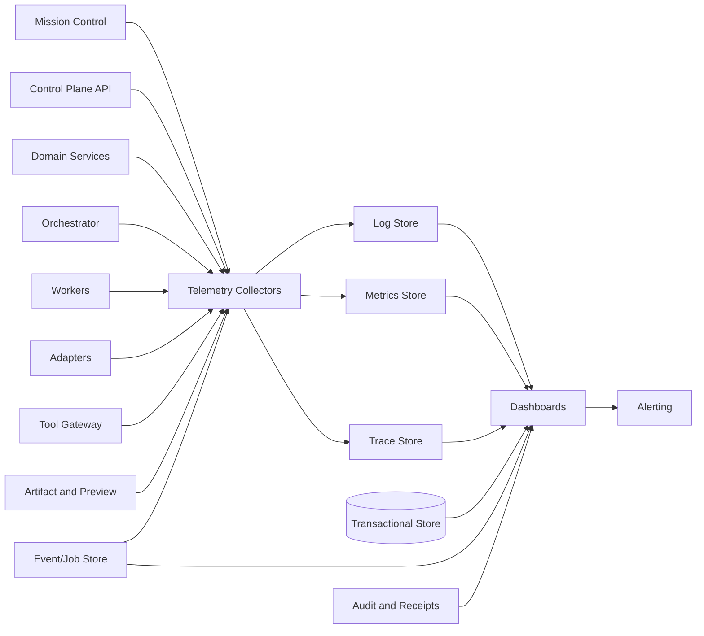

# OBS-001 — Agent OS Observability Architecture

> **Status: Approved baseline — 2026-08-13.** This document defines the observability architecture for Agent OS: structured logs, metrics, traces, domain timelines, health and readiness, freshness, dashboards, alerts, diagnostic bundles, evidence, retention, security, privacy, and operational acceptance. It does not select a final telemetry backend, dashboard product, log collector, tracing implementation, or hosted monitoring service.

## 1. Purpose

Agent OS coordinates durable and asynchronous work across:

- Mission Control;
- the control-plane API;
- domain services;
- the orchestrator;
- durable jobs and workers;
- adapter runtimes;
- model providers;
- the Tool Gateway;
- approval workflows;
- artifact storage and preview workers;
- governed memory;
- audit and receipt generation;
- usage, cost, and budgets;
- backup, restore, and recovery.

The platform must allow operators and users to answer:

1. What is happening?
2. What happened?
3. Why did it happen?
4. Which state is authoritative?
5. How fresh is the displayed state?
6. Which component reported it?
7. What is unknown?
8. Was an external effect attempted?
9. What is the certainty of that effect?
10. Is human action required?
11. Is the system safe to continue?
12. Which evidence supports the conclusion?

## 2. Observability objectives

The architecture must provide:

- end-to-end correlation;
- structured logs;
- bounded metrics;
- distributed traces;
- domain timelines;
- authoritative versus derived state labels;
- health, readiness, degradation, and freshness;
- run, step, attempt, job, and lease diagnosis;
- approval queue and consumption visibility;
- adapter and model readiness;
- artifact and memory pipeline visibility;
- event/outbox/inbox/dead-letter visibility;
- cost and budget visibility;
- backup/restore visibility;
- alerts with owners and runbooks;
- safe diagnostic exports;
- evidence for quality gates and incidents;
- protection against secret and confidential data leakage.

## 3. Non-goals

This document does not:

- make telemetry authoritative business state;
- replace audit records;
- replace execution receipts;
- select a specific telemetry product;
- require a public cloud monitoring service;
- promise full-stack distributed tracing from every provider;
- log full prompts, model outputs, artifacts, secrets, or credentials by default;
- define a complete incident response plan;
- define contractual SLOs;
- guarantee exact cost or usage;
- treat dashboards as source of truth;
- authorize external telemetry export without policy.

## 4. Core principles

### `OBS-P-001 — Domain state remains authoritative`

Telemetry describes behavior. It does not replace the transactional domain state.

### `OBS-P-002 — Correlation is end to end`

A user request, command, run, attempt, external call, artifact, approval, cost record, event, and receipt should be traceable through shared identifiers.

### `OBS-P-003 — Freshness is explicit`

Every derived view exposes when it was observed, projected, calculated, or last verified.

### `OBS-P-004 — Unknown is observable`

Unknown, stale, partial, conflicted, degraded, and unavailable states are first-class.

### `OBS-P-005 — Sensitive data is minimized`

Telemetry records identifiers, codes, hashes, sizes, durations, and references rather than raw sensitive content.

### `OBS-P-006 — High-cardinality labels are controlled`

Metrics must not use unbounded IDs, prompts, filenames, error messages, or URLs as labels.

### `OBS-P-007 — Alerts require ownership`

Every actionable alert has an owner, severity, runbook, acknowledgment path, and closure condition.

### `OBS-P-008 — Health and readiness are distinct`

A live process may not be ready to perform its intended function safely.

### `OBS-P-009 — Evidence quality is labelled`

Observed, reported, inferred, estimated, generated, stale, and unavailable data remain distinguishable.

### `OBS-P-010 — Diagnostic visibility follows authorization`

Users see only the telemetry and evidence allowed by workspace, classification, and role.

### `OBS-P-011 — Telemetry failure is visible`

The system does not silently claim health when logs, metrics, traces, events, or audit evidence are missing.

### `OBS-P-012 — Observability supports recovery`

Signals must help operators reconcile uncertain state rather than only identify that an error occurred.

## 5. Observability signals

Agent OS distinguishes:

```text
structured_log
metric
trace
span
domain_event
audit_event
timeline_entry
health_observation
readiness_observation
freshness_observation
diagnostic_snapshot
execution_receipt
alert
```

Each signal has a purpose and authority level.

## 6. Signal authority

| Signal | Authority |
|---|---|
| Transactional aggregate state | Authoritative |
| Immutable domain event | Authoritative historical fact within its contract |
| Audit event | Authoritative governance evidence within scope |
| Execution receipt | Compiled evidence with completeness state |
| External observation | Source-reported, not automatically authoritative |
| Metric | Derived operational signal |
| Log | Diagnostic record |
| Trace | Diagnostic causality and latency |
| Dashboard | Derived read model |
| Alert | Evaluation result from signals |
| Generated summary | Generated explanation, not authoritative |

## 7. Architecture overview



## 8. Observability planes

The architecture has four planes:

```text
user_observability
operator_observability
security_observability
quality_and_release_evidence
```

## 9. User observability

Mission Control exposes:

- current run state;
- freshness;
- waiting reason;
- approval requirement;
- artifact readiness;
- adapter/model state;
- cost state;
- last reliable activity;
- user-safe errors;
- recovery direction.

It does not expose unrestricted infrastructure diagnostics.

## 10. Operator observability

Operators may access:

- component health;
- queues;
- jobs and leases;
- outbox/inbox;
- dead letters;
- database/storage dependencies;
- adapter sessions;
- event gaps;
- backup and restore;
- resource usage;
- diagnostic bundles;
- runbooks.

## 11. Security observability

Security views include:

- authentication failures;
- authorization denials;
- cross-workspace attempts;
- approval replay/substitution;
- secret exposure findings;
- sandbox/network violations;
- artifact quarantine;
- event integrity failures;
- adapter anomalies;
- emergency stop.

## 12. Quality and release evidence

Quality views include:

- test and gate evidence;
- SLI baselines;
- restore drills;
- adapter conformance freshness;
- security and accessibility findings;
- performance regressions;
- documentation drift;
- release observation window.

## 13. Common telemetry envelope

Every structured telemetry record should include, where applicable:

| Field | Required |
|---|---:|
| `timestamp` | Yes |
| `severity` or signal type | Yes |
| `component` | Yes |
| `component_version` | Yes |
| `environment_profile` | Yes |
| `request_id` | Conditional |
| `correlation_id` | Conditional |
| `trace_id` | Conditional |
| `span_id` | Conditional |
| `organization_id` | Conditional |
| `workspace_id` | Conditional |
| `project_id` | Optional |
| `task_id` | Optional |
| `run_id` | Optional |
| `step_id` | Optional |
| `attempt_id` | Optional |
| `job_id` | Optional |
| `approval_request_id` | Optional |
| `artifact_id` | Optional |
| `event_id` | Optional |
| `actor_identity_type` | Optional |
| `operation_code` | Yes |
| `result_code` | Conditional |
| `error_code` | Optional |
| `classification` | Yes |
| `source_state` | Optional |
| `freshness_state` | Optional |
| `message` | Yes |
| `evidence_reference` | Optional |

## 14. Correlation hierarchy

Recommended hierarchy:

```text
request_id
└── correlation_id
    ├── task_id
    ├── run_id
    │   ├── step_id
    │   │   └── attempt_id
    │   │       ├── job_id
    │   │       ├── adapter_session_id
    │   │       ├── provider_request_id
    │   │       └── tool_execution_id
    │   ├── approval_request_id
    │   ├── artifact_id
    │   ├── usage_event_id
    │   └── receipt_id
    └── trace_id
```

## 15. Correlation rules

- client-provided correlation IDs are validated;
- server creates one when absent;
- identifiers are opaque;
- correlation does not grant authorization;
- external provider IDs remain separate;
- duplicate/retry operations preserve logical correlation;
- a new attempt has a new attempt ID;
- reconciliation links old and new observations.

## 16. Trace context

Trace propagation may use an approved standard.

Trace context should flow through:

```text
browser
→ API
→ application command
→ database transaction
→ outbox
→ worker
→ adapter
→ provider/tool
→ artifact/audit/cost
```

External components may provide only partial propagation.

## 17. Trace trust

Trace context from external or untrusted sources must be:

- validated;
- size-limited;
- normalized;
- prevented from overriding server authority;
- linked as external context rather than blindly adopted.

## 18. Structured logging

Logs use structured fields rather than unstructured concatenated strings.

Preferred:

```json
{
  "severity": "INFO",
  "component": "orchestrator",
  "operation_code": "RUN_DISPATCH_ACCEPTED",
  "workspace_id": "workspace_...",
  "run_id": "run_...",
  "attempt_id": "attempt_...",
  "correlation_id": "corr_...",
  "message": "Run attempt dispatch intent was persisted."
}
```

## 19. Log levels

```text
TRACE
DEBUG
INFO
WARN
ERROR
CRITICAL
```

### Direction

- `TRACE`: development-only deep diagnostics;
- `DEBUG`: bounded technical diagnostics;
- `INFO`: normal lifecycle and operational facts;
- `WARN`: degraded, retry, stale, unusual but recoverable;
- `ERROR`: operation failed or needs investigation;
- `CRITICAL`: security, safety, data integrity, or service-wide risk.

## 20. Logging rules

Logs must:

- use stable operation and error codes;
- preserve correlation;
- avoid secrets;
- avoid full sensitive content;
- avoid unbounded stack traces in ordinary output;
- include source and certainty where relevant;
- identify retry and attempt;
- distinguish accepted, completed, failed, and unknown;
- use UTC timestamps;
- include build/component identity.

## 21. Logging prohibited content

Do not log:

- passwords;
- API keys;
- bearer tokens;
- cookies;
- private keys;
- raw secret environment variables;
- full prompts by default;
- full model outputs by default;
- complete confidential artifacts;
- raw database connection strings;
- unrestricted authorization headers;
- sensitive URL query parameters;
- personal data not required for diagnosis.

## 22. Log redaction

Redaction is centralized and tested.

Redaction patterns include:

- credentials;
- tokens;
- secret references accidentally resolved;
- cookies;
- authorization headers;
- provider keys;
- private URLs;
- embedded credentials;
- selected personal identifiers;
- configured sensitive payload fields.

Redaction failure is a security event.

## 23. Log message design

Log messages should be:

- stable;
- concise;
- free from dynamic sensitive content;
- useful with structured fields;
- not relied upon as machine identifiers;
- understandable by operators.

Machine logic uses `operation_code` and `error_code`.

## 24. Request logs

API request logs include:

- request ID;
- correlation;
- route template;
- method;
- response status;
- duration;
- response size;
- actor type;
- workspace where permitted;
- error code;
- no request/response body by default.

## 25. Database logs

Database telemetry includes:

- pool state;
- connection errors;
- transaction duration;
- lock waits;
- deadlocks;
- migration version;
- slow-query fingerprints;
- replication or backup state where applicable.

Do not log full sensitive SQL parameters.

## 26. Worker logs

Worker logs include:

- worker ID;
- job ID/type;
- lease ID;
- fencing token reference or safe value;
- run/attempt;
- start/end;
- heartbeat status;
- result;
- retry;
- side-effect certainty;
- cancellation;
- reconciliation.

## 27. Adapter logs

Adapter logs include:

- registration;
- adapter/runtime version;
- external session reference;
- capability;
- run/attempt;
- provider/model observations;
- health/readiness;
- event sequence;
- error normalization;
- cancellation state;
- no raw prompts or credentials.

## 28. Tool Gateway logs

Tool logs include:

- normalized action class;
- target type;
- fingerprint reference;
- policy decision;
- approval consumption;
- sandbox profile;
- executor;
- result;
- side-effect certainty;
- evidence.

Targets are minimized or hashed where sensitive.

## 29. Artifact logs

Artifact logs include:

- artifact/version;
- staging session;
- media type;
- size;
- hash state;
- validation;
- quarantine;
- preview;
- acceptance;
- export/delete;
- storage health;
- no full content.

## 30. Memory logs

Memory logs include:

- record/version;
- source/authority state;
- indexing;
- retrieval mode;
- candidate count;
- freshness;
- conflict;
- deletion;
- no full memory content by default.

## 31. Cost logs

Cost logs include:

- usage source;
- currency;
- pricing profile;
- state;
- mismatch;
- reservation;
- budget threshold;
- no misleading zero when unknown.

## 32. Metrics architecture

Metrics should be:

- numeric;
- bounded;
- aggregatable;
- low-cardinality;
- documented;
- owned;
- linked to an operational question.

## 33. Metric types

```text
counter
gauge
histogram
summary
state_set
info
```

Histograms are preferred for latency distributions where supported.

## 34. Metric naming

Recommended format:

```text
agentos_<subsystem>_<measurement>_<unit>
```

Examples:

```text
agentos_api_request_duration_seconds
agentos_run_state_total
agentos_outbox_pending_records
agentos_worker_lease_expirations_total
agentos_approval_wait_duration_seconds
agentos_artifact_preview_failures_total
```

## 35. Metric labels

Allowed bounded labels:

- environment;
- component;
- route template;
- method;
- status class;
- operation code;
- error class;
- run state;
- adapter type;
- capability code from bounded registry;
- provider profile code;
- classification code;
- result state;
- severity.

Avoid labels:

- user ID;
- workspace ID in global metrics;
- run ID;
- prompt;
- filename;
- raw URL;
- error message;
- provider request ID;
- arbitrary tag.

Workspace-specific dashboards should use scoped queries or separate dimensions designed carefully.

## 36. Metric ownership

Every metric has:

- owner;
- description;
- type;
- labels;
- unit;
- source;
- expected cardinality;
- retention;
- dashboards;
- alerts;
- deprecation plan.

## 37. API metrics

```text
request count
request latency
error count
authentication failures
authorization denials
idempotency hits/conflicts
optimistic concurrency conflicts
rate limits
payload rejections
active streams
upload/download bytes
```

## 38. Run metrics

```text
runs created
runs by state
run queue age
run start latency
run duration
runs stale
runs unknown
runs completed/failed/cancelled
retry count
waiting duration by reason
receipt generation failures
```

## 39. Step and attempt metrics

```text
steps by state
attempts per step
attempt duration
attempt timeout
attempt lost
unknown side effects
late results rejected
cancellation outcomes
reconciliation outcomes
```

## 40. Job and lease metrics

```text
jobs by state
oldest available job age
lease acquisition latency
lease expirations
heartbeat misses
fencing conflicts
retry backlog
dead-letter count
worker concurrency
worker saturation
```

## 41. Outbox metrics

```text
pending records
oldest pending age
publication latency
publication retries
publication failures
dead letters
records published
schema-invalid records
```

## 42. Inbox metrics

```text
received events
processing latency
duplicates
retry backlog
consumer failures
dead letters
unsupported versions
workspace/classification rejections
consumer lag
```

## 43. Event metrics

```text
events produced
event size
event propagation latency
event gaps
out-of-order events
replays
cursor expiry
projection lag
schema compatibility failures
integrity failures
```

## 44. Approval metrics

```text
requests by state
approval wait duration
approval/rejection/revision rate
expiry rate
invalidation rate
consumption latency
consumption conflict
fingerprint mismatch
replay detection
independence violation
approved execution outcome
```

## 45. Adapter metrics

```text
health/readiness
validation age
capability drift
active sessions
start latency
event gap
cancellation outcome
unknown terminal state
normalized errors
reconciliation count
```

## 46. Model/provider metrics

```text
routing requests
routing blocks
selected binding
fallback proposed/applied/denied
provider latency
provider errors
rate limits
quota state
actual identity unavailable/conflicted
usage source
output truncation
structured-output invalid
```

Provider/model names used as labels must come from a bounded registry or profile code.

## 47. Tool Gateway metrics

```text
actions proposed
policy denials
approval required
actions authorized
dispatches
success/failure/unknown
side-effect certainty
sandbox denial
network denial
filesystem denial
reconciliation
```

## 48. Artifact metrics

```text
artifact proposals
staging sessions
staging bytes
partial uploads
integrity failures
validation failures
quarantine count
preview latency
preview failures
accepted/rejected versions
export failures
deletion backlog
orphan/recovery count
storage bytes
```

## 49. Memory metrics

```text
records proposed
verified/disputed/conflicted
index backlog
index failures
retrieval latency
candidate count
stale/expired returned
deletion backlog
cross-workspace denial
```

## 50. Usage and cost metrics

```text
usage events
deduplication
cost estimate state
provider-reported costs
reconciliation mismatch
unknown costs
budget utilization
budget warnings
hard-limit blocks
reservation age
unattributed usage
```

## 51. Security metrics

```text
authentication failures
authorization denials
cross-workspace attempts
approval replay
target substitution
secret exposure findings
sandbox violations
network violations
artifact quarantine
event source authentication failure
security incidents by severity
```

Security metrics must avoid exposing sensitive target details.

## 52. Backup and restore metrics

```text
backup requests
backup success/failure
backup duration
backup age
manifest verification
restore requests
restore success/failure
restore duration
reconciliation findings
RPO estimate
last successful restore drill
```

## 53. Resource metrics

```text
CPU
memory
disk
filesystem capacity
database connections
queue depth
file descriptors
process count
network errors
container restarts
```

Resource metrics support diagnosis but do not substitute for domain metrics.

## 54. Distributed tracing

Tracing provides:

- causal flow;
- latency breakdown;
- dependency calls;
- retry relationships;
- attempt linkage;
- error location;
- bottleneck analysis.

## 55. Span model

Typical spans:

```text
http.request
application.command
domain.transaction
database.query
outbox.publish
job.lease
worker.execute
adapter.start
adapter.poll
model.invoke
tool.execute
artifact.finalize
preview.convert
memory.retrieve
receipt.generate
backup.execute
restore.execute
```

## 56. Span fields

A span may include:

- operation;
- component;
- status;
- duration;
- workspace scope reference;
- run/attempt;
- adapter/model/tool profile;
- retry attempt;
- error code;
- side-effect certainty;
- source state;
- classification;
- no sensitive payload.

## 57. Span status

```text
unset
ok
error
cancelled
unknown
```

A timeout after external acceptance may be `error` with side-effect certainty `unknown`.

## 58. Sampling

Sampling policy should:

- retain all critical/security/error traces;
- retain protected actions;
- retain approval and restore traces;
- sample ordinary successful high-volume requests;
- preserve representative latency;
- avoid bias hiding rare failures;
- remain environment-specific.

## 59. Tail sampling direction

Tail-based sampling may be useful for:

- errors;
- high latency;
- unknown effects;
- stale runs;
- cross-workspace denials;
- approval failures;
- adapter drift;
- restore failures.

Final implementation requires ADR.

## 60. Trace privacy

Traces must not include:

- full prompt;
- full output;
- secret;
- full artifact content;
- unrestricted SQL;
- user email/name unless required and authorized;
- sensitive path or URL without minimization.

## 61. Domain timelines

A timeline is a user/operator view assembled from:

- domain events;
- audit events;
- external observations;
- approval decisions;
- artifact transitions;
- operational events.

Timeline entries include authority/source labels.

## 62. Timeline entry fields

| Field | Required |
|---|---:|
| `timeline_entry_id` | Yes |
| `workspace_id` | Yes |
| `subject_type` | Yes |
| `subject_id` | Yes |
| `occurred_at` | Yes |
| `recorded_at` | Yes |
| `entry_type` | Yes |
| `summary` | Yes |
| `source_state` | Yes |
| `classification` | Yes |
| `actor_summary` | Optional |
| `evidence_reference` | Optional |
| `freshness_state` | Yes |
| `limitations` | Yes |

## 63. Timeline rules

- sort is deterministic;
- occurrence and record time are distinguishable;
- external reports are labelled;
- corrected entries do not erase originals;
- summaries do not replace canonical records;
- authorization applies before rendering;
- gaps are shown.

## 64. Freshness architecture

Freshness answers:

```text
How recent is this information?
When was it last verified?
Is the source still reachable?
Has the projection caught up?
```

## 65. Freshness states

```text
current
recent
aging
stale
expired
unavailable
unknown
conflicted
```

Exact thresholds depend on signal and context.

## 66. Freshness dimensions

Freshness may be based on:

- observed time;
- recorded time;
- projected time;
- last heartbeat;
- last health probe;
- last schema validation;
- last provider metadata refresh;
- last price update;
- last backup verification;
- last restore drill;
- last adapter conformance.

## 67. Freshness object

Fields:

- freshness state;
- observed at;
- evaluated at;
- threshold profile;
- source;
- last reliable evidence;
- next expected update;
- limitations.

## 68. Projection freshness

Every projection should expose:

- source cursor;
- last event ID;
- projected at;
- lag;
- state;
- rebuild status;
- errors.

A stale dashboard cannot be presented as current authoritative state.

## 69. Health model

Health is multidimensional.

Dimensions:

```text
liveness
readiness
dependency_health
capacity
data_integrity
security_posture
freshness
functional_health
```

## 70. Health states

```text
healthy
degraded
unhealthy
unknown
maintenance
disabled
revoked
```

## 71. Liveness

Liveness answers:

```text
Is the process alive enough to be restarted only if not?
```

It should not perform expensive dependency checks.

## 72. Readiness

Readiness answers:

```text
Can this component safely perform its intended role now?
```

Examples:

- API alive but database unavailable: not ready;
- adapter alive but incompatible: not ready;
- worker alive but emergency stop active: limited readiness;
- artifact service alive but storage unavailable: metadata-only degraded.

## 73. Dependency health

A component reports dependencies with:

- dependency code;
- state;
- observed time;
- latency;
- last error;
- required/optional;
- impact;
- freshness.

## 74. Functional health

Functional probes verify a safe bounded function.

Examples:

- database read/write probe;
- outbox publish probe;
- worker lease probe;
- artifact store put/read/delete probe;
- adapter validation probe;
- backup manifest verification.

Functional probes must avoid consequential external effects.

## 75. Health aggregation

Aggregate health rules are explicit.

Examples:

```text
required dependency unhealthy
→ component unhealthy or not ready

optional search index unavailable
→ component degraded, direct reads available
```

No simple average hides a critical dependency.

## 76. Workspace health

Workspace health may include:

- policy state;
- adapter readiness;
- model-profile readiness;
- budget state;
- artifact capacity;
- memory/index state;
- active incidents;
- emergency stop;
- stale projections;
- backup coverage.

## 77. Run observability model

For each run show:

- state;
- state source;
- state version;
- last transition;
- last reliable evidence;
- queue age;
- active/waiting reason;
- current step;
- active attempt;
- adapter/runtime;
- model routing/actual observation;
- approvals;
- artifacts;
- cost;
- side-effect certainty;
- alerts;
- recovery actions.

## 78. Run diagnostic states

```text
normal
waiting_expected
waiting_too_long
stale
unknown
blocked_policy
blocked_approval
blocked_resource
blocked_adapter
blocked_budget
recovery_required
terminal_with_gaps
```

## 79. Last reliable evidence

Each run should expose:

- evidence type;
- source;
- time;
- state;
- correlation;
- limitations.

Example:

```text
Last reliable evidence:
Adapter heartbeat received at 12:14:08Z
External effect state: unknown
```

## 80. Waiting-condition observability

Waiting condition fields:

- type;
- since;
- expected resolution;
- timeout/deadline;
- owner;
- linked approval/resource/adapter;
- alert threshold;
- remediation.

## 81. Retry observability

Expose:

- attempt count;
- previous failure class;
- side-effect certainty;
- retry decision;
- backoff;
- next eligible time;
- budget/deadline;
- policy reason;
- approval requirement.

## 82. Cancellation observability

Expose:

- requested at/by;
- request persisted;
- jobs cancelled;
- adapter acknowledgment;
- terminal confirmation;
- partial effects;
- unknown effects;
- reconciliation state.

Do not display cancellation acknowledgment as completion.

## 83. Reconciliation observability

Expose:

- reason;
- sources checked;
- observations;
- conflicts;
- chosen result;
- unresolved unknowns;
- operator;
- time;
- evidence.

## 84. Approval observability

Approval dashboards show:

- request state;
- risk;
- independence;
- age;
- expiry;
- requester;
- reviewer;
- fingerprint status;
- invalidation reason;
- consumption;
- execution outcome;
- stale review material;
- queue age.

## 85. Approval alert candidates

- high-risk request aging;
- request near expiry;
- repeated fingerprint mismatch;
- replay attempt;
- independence violation;
- consumed without dispatch evidence;
- approved execution unknown;
- high rejection/revision rate anomaly.

## 86. Adapter observability

For each adapter:

- registered version;
- contract version;
- health;
- readiness;
- validation state;
- validation age;
- capabilities declared/validated;
- drift;
- active sessions;
- event cursor/gaps;
- cancellation semantics;
- errors;
- rate limits;
- owner/runbook.

## 87. Model observability

For each model profile/binding:

- configured identity;
- selected binding;
- actual identity observation;
- source;
- health;
- latency;
- quota;
- rate limits;
- context/output limit;
- fallback;
- usage/cost state;
- data-protection state;
- last metadata refresh.

## 88. Artifact observability

Expose:

- staging state/progress;
- size/hash;
- integrity;
- validation;
- quarantine;
- preview state;
- review/acceptance;
- storage availability;
- export;
- deletion;
- orphan/recovery;
- classification.

## 89. Memory observability

Expose:

- proposal/source;
- authority;
- version;
- conflict;
- freshness;
- indexing;
- retrieval latency;
- deletion;
- stale/expired records;
- index consistency.

## 90. Event and projection observability

Expose:

- outbox backlog;
- inbox backlog;
- consumer lag;
- duplicate rate;
- gaps;
- dead letters;
- replay;
- schema compatibility;
- projection freshness;
- rebuild status;
- cursor expiry.

## 91. Cost observability

Expose:

- known/estimated/pending/unknown;
- source;
- usage;
- pricing version;
- budget reservation;
- utilization;
- threshold;
- mismatch;
- unattributed cost;
- fallback impact.

Unknown cost is visually distinct from zero.

## 92. Operations observability

Expose:

- component health;
- resource saturation;
- maintenance;
- emergency stop;
- backups;
- restores;
- migrations;
- recovery scans;
- incidents;
- quality exceptions affecting operations.

## 93. Dashboard architecture

Recommended dashboards:

```text
Mission Control Overview
Run Operations
Approvals
Adapters and Models
Events and Queues
Artifacts
Memory
Usage and Costs
Security
Backup and Restore
Quality and Release
Infrastructure
```

## 94. Mission Control Overview

User/operator-safe overview:

- active runs;
- waiting approvals;
- blocked/stale/unknown runs;
- adapter/model readiness;
- artifact issues;
- budget warnings;
- active incident/emergency stop;
- data freshness.

## 95. Run Operations dashboard

Panels:

- runs by state;
- oldest queued;
- longest waiting;
- stale/unknown;
- retries;
- cancellation outcomes;
- unknown effects;
- job/lease state;
- run duration;
- reconciliation.

## 96. Approvals dashboard

Panels:

- queue by risk;
- median/p95 wait;
- near expiry;
- rejected/revised;
- invalidations;
- consumption conflicts;
- replay/fingerprint anomalies;
- execution outcomes.

## 97. Adapters and Models dashboard

Panels:

- readiness;
- validation expiry;
- capability drift;
- active sessions;
- adapter errors;
- provider latency/rate limit;
- model identity unavailable;
- fallback;
- quota;
- cost state.

## 98. Events and Queues dashboard

Panels:

- outbox pending/age;
- inbox failures;
- consumer lag;
- dead letters;
- duplicates;
- gaps;
- replay;
- projection freshness;
- schema failures.

## 99. Artifacts dashboard

Panels:

- staging backlog;
- partial uploads;
- integrity failures;
- quarantines;
- preview failures/latency;
- review queue;
- exports;
- deletion backlog;
- storage capacity;
- recovery issues.

## 100. Memory dashboard

Panels:

- proposals;
- verified/disputed/conflicted;
- stale/expired;
- index lag;
- retrieval latency;
- deletion backlog;
- reconciliation issues.

## 101. Cost dashboard

Panels:

- spend by source state;
- known versus estimated versus unknown;
- provider/profile;
- budget utilization;
- reservations;
- mismatch;
- unattributed;
- fallback impact;
- pricing freshness.

## 102. Security dashboard

Panels:

- auth failures;
- authorization denials;
- cross-workspace attempts;
- approval replay/substitution;
- secret findings;
- sandbox/network violations;
- artifact quarantine;
- event integrity/source failures;
- incidents.

## 103. Backup and Restore dashboard

Panels:

- last successful backup;
- backup age;
- verification;
- failures;
- restore drill age;
- restore results;
- RPO estimate;
- reconciliation findings;
- storage capacity;
- active holds.

## 104. Quality dashboard

Panels:

- gate status;
- T0 tests;
- S0/S1 defects;
- exceptions;
- restore evidence;
- adapter/model validation freshness;
- accessibility;
- performance;
- documentation drift;
- release observation window.

## 105. Dashboard requirements

Every dashboard must show:

- scope;
- environment;
- time range;
- freshness;
- source;
- active filters;
- limitations;
- data gaps;
- classification;
- no false green from missing data.

## 106. Dashboard anti-patterns

Do not:

- show green when telemetry is absent;
- hide stale data;
- mix environments;
- use raw unbounded IDs as labels;
- present estimates as facts;
- present configured model as actual;
- show success based only on HTTP response;
- combine critical and optional health into an average;
- expose secrets or confidential content.

## 107. Alert architecture

An alert is an evaluated condition requiring awareness or action.

Alert lifecycle:

```text
inactive
pending
firing
acknowledged
suppressed
resolved
expired
unknown
```

## 108. Alert fields

- alert ID;
- rule ID/version;
- severity;
- environment;
- workspace scope where applicable;
- subject;
- first/last fired;
- current value;
- threshold;
- owner;
- runbook;
- correlation;
- evidence;
- acknowledgment;
- suppression;
- resolution.

## 109. Alert severity

```text
A0 — Immediate safety/security/data-loss emergency
A1 — Critical service or invariant risk
A2 — Major degradation requiring prompt action
A3 — Warning requiring planned action
A4 — Informational
```

## 110. A0 examples

- cross-workspace confirmed leak;
- approval bypass;
- raw secret exposure;
- unrestricted sandbox escape;
- destructive replay;
- restore corruption;
- prohibited production/financial effect;
- emergency stop failure.

## 111. A1 examples

- database unavailable;
- event/job loss risk;
- stale-worker fencing failure;
- backup overdue beyond critical threshold;
- restore drill failed;
- sustained unknown protected effects;
- consumed approval consistency failure;
- critical adapter security drift.

## 112. A2 examples

- high outbox backlog;
- consumer lag;
- adapter unavailable;
- repeated provider rate limit;
- artifact preview failure surge;
- storage nearing capacity;
- high run stale rate;
- budget mismatch.

## 113. Alert ownership

Every alert maps to:

- primary owner;
- backup owner;
- escalation;
- response target direction;
- runbook;
- suppression policy;
- evidence;
- stop condition.

## 114. Alert quality

Alert rules should be:

- actionable;
- specific;
- low enough noise;
- tested;
- versioned;
- reviewed;
- linked to SLI or risk;
- monitored for false positives/negatives.

## 115. Alert fatigue controls

- deduplication;
- grouping;
- inhibition;
- maintenance suppression;
- severity threshold;
- rate limiting;
- review of noisy rules;
- automatic resolution;
- runbook clarity.

## 116. Alert suppression

Suppression requires:

- reason;
- scope;
- owner;
- start/end;
- affected risks;
- compensating monitoring;
- audit.

Emergency alerts cannot be silently suppressed.

## 117. Synthetic checks

Safe synthetic checks may verify:

- API health;
- authentication;
- workspace access;
- database transaction;
- event/outbox path;
- worker lease;
- simulator run;
- artifact store;
- preview safe fixture;
- backup manifest access.

Synthetic checks must not perform uncontrolled external effects.

## 118. SLI architecture

A Service Level Indicator is a measured signal for a defined user or operator outcome.

Candidate SLI families:

```text
availability
readiness
latency
correctness
freshness
durability
recovery
security_control
approval_control
artifact_safety
```

## 119. Availability SLI

Examples:

- successful authenticated API requests;
- Mission Control usable sessions;
- safe run creation availability;
- artifact metadata availability.

Availability excludes prohibited or invalid requests.

## 120. Readiness SLI

Examples:

- control plane ready;
- eligible worker capacity;
- required adapter ready;
- artifact store ready;
- approval service ready.

## 121. Latency SLI

Examples:

- API p95;
- command acceptance;
- queue wait;
- run start;
- event propagation;
- approval wait;
- artifact preview;
- memory retrieval;
- receipt generation.

## 122. Correctness SLI

Potential indicators:

- state transition rejection correctness;
- duplicate-effect prevention;
- approval consumption consistency;
- event projection consistency;
- artifact hash verification;
- cost reconciliation match.

Correctness SLIs may be sampled or verified through background checks.

## 123. Freshness SLI

Examples:

- dashboard projection lag;
- adapter health age;
- model metadata age;
- pricing profile age;
- backup age;
- restore drill age;
- audit timeline lag.

## 124. Durability SLI

Examples:

- committed run recoverable after restart;
- outbox publication completion;
- inbox dedup preserved;
- artifact content/metadata consistency;
- backup verification success.

## 125. Recovery SLI

Examples:

- recovery scan completion;
- mean time to reconcile stale run;
- restore success;
- projection rebuild success;
- dead-letter resolution.

## 126. Security-control SLI

Examples:

- authorization enforcement tests;
- approval replay blocked;
- secret scan health;
- sandbox policy enforcement;
- event source authentication;
- security alert delivery.

## 127. SLO direction

Formal SLO values remain unapproved.

A future SLO document may define:

- target;
- window;
- error budget;
- exclusions;
- measurement source;
- consequence.

Until approved, dashboards use provisional objectives clearly labelled.

## 128. Error budgets

Error budgets may eventually guide release pace.

They must not permit:

- security breaches;
- cross-workspace leaks;
- approval bypass;
- secret exposure;
- prohibited actions;
- data corruption.

These remain zero-tolerance control failures.

## 129. Burn-rate alerting

For approved SLOs, multi-window burn-rate alerts may be used.

This is a future implementation option, not a current commitment.

## 130. Diagnostic bundles

A diagnostic bundle is a controlled artifact assembled for support or incident investigation.

It may include:

- build/config summary;
- component health;
- bounded logs;
- metrics snapshot;
- traces;
- run timeline;
- queue state;
- adapter/model summary;
- database schema version;
- artifact/storage summary;
- backup status;
- known gaps.

## 131. Diagnostic bundle controls

- exact scope;
- classification;
- redaction;
- no raw secrets;
- bounded time range;
- manifest;
- hash;
- access control;
- retention;
- export approval where needed.

## 132. Diagnostic bundle states

```text
requested
collecting
redacting
ready
failed
partial
expired
deleted
```

## 133. Incident evidence

Incident evidence preserves:

- alerts;
- relevant events;
- logs;
- traces;
- configuration summary;
- timeline;
- approvals;
- external observations;
- operator actions;
- gaps;
- hashes.

Detailed incident response belongs in operations/security documentation.

## 134. Observability during emergency stop

When emergency stop is active, the system must show:

- scope;
- activation time;
- activated by;
- reason;
- dispatch blocked;
- approval consumption blocked;
- active runs;
- cancellation/reconciliation;
- release authority;
- audit.

## 135. Observability during maintenance

Maintenance views show:

- window;
- scope;
- affected components;
- expected behavior;
- readiness;
- suppressed alerts;
- migration/backup;
- operator;
- completion/rollback.

## 136. Observability during restore

Restore views show:

- backup manifest;
- target;
- validation;
- progress;
- schema compatibility;
- run/approval/artifact reconciliation;
- missing content;
- tombstones;
- event/inbox/outbox;
- verification;
- result.

## 137. Observability during migration

Migration views show:

- migration ID/checksum;
- state;
- progress;
- batches/checkpoints;
- locks;
- failures;
- verification;
- compatibility;
- rollback/forward-fix.

## 138. Observability storage

Telemetry storage may be separated by signal:

```text
logs
metrics
traces
events
audit
diagnostic artifacts
```

The final storage technology requires ADR.

## 139. Retention classes

Suggested classes:

```text
debug_short
operational_standard
security_extended
audit_governed
release_evidence
incident_hold
```

Exact durations remain unapproved.

## 140. Retention principles

- debug logs expire quickly;
- security and release evidence may be retained longer;
- audit/event history follows governance;
- raw sensitive content is minimized;
- holds are explicit;
- expired telemetry is deleted according to policy;
- retention supports incident and restore requirements.

## 141. Telemetry deletion

Deletion may include:

- logs;
- traces;
- metrics series;
- diagnostic bundles;
- derived dashboards/caches.

Deletion must respect:

- holds;
- security evidence;
- release evidence;
- audit separation;
- external exports;
- backup limitations.

## 142. Telemetry classification

Classification is based on:

- workspace;
- identifiers;
- error detail;
- target/path;
- model/provider;
- artifact/memory reference;
- security finding;
- diagnostic content.

A seemingly operational log may be confidential.

## 143. Multi-workspace observability

Rules:

- users see only authorized workspace data;
- operators need explicit cross-workspace authority;
- global dashboards use aggregated bounded dimensions;
- drill-down requires authorization;
- counts and labels avoid leaking workspace identity;
- diagnostic export is scoped.

## 144. Environment isolation

Telemetry must distinguish:

```text
development
test
local_pilot
pilot
controlled_commercial
```

Data from environments must not be mixed in a way that creates false conclusions.

## 145. External telemetry export

Sending telemetry to an external service requires:

- approved destination;
- data classification;
- minimization;
- region/retention review;
- secret handling;
- contract;
- network policy;
- failure behavior;
- opt-out/local alternative where required.

## 146. Local-first observability

The MVP should support a local-first profile with:

- local logs;
- local health endpoints;
- local metrics;
- local dashboards or inspectable reports;
- no mandatory external telemetry provider;
- bounded disk use;
- backup and deletion.

## 147. Telemetry collector health

Collectors expose:

- liveness;
- readiness;
- queue/backpressure;
- dropped records;
- export failures;
- storage capacity;
- schema failures;
- last successful flush.

Dropped critical evidence is an alert.

## 148. Telemetry backpressure

Controls:

- bounded buffers;
- disk spool where selected;
- severity prioritization;
- sampling;
- rate limits;
- no application-wide crash from debug telemetry;
- fail-closed behavior for required audit separately.

## 149. Logs versus audit

Logs may fail or expire without changing domain state.

Audit requirements for protected actions may fail closed.

The implementation must not confuse:

```text
diagnostic log success
with
governance evidence success
```

## 150. Metrics versus cost records

A cost metric is a dashboard signal.

Canonical `CostRecord` remains the data source for accounting and reconciliation.

## 151. Traces versus events

A trace span may be dropped or sampled.

A required domain event must remain durable.

## 152. Alert versus incident

An alert is a condition.

An incident is a managed operational/security response.

Not every alert becomes an incident.

## 153. Alert-to-incident mapping

Rules may consider:

- severity;
- duration;
- scope;
- repeated alerts;
- affected users/workspaces;
- security/data implications;
- failed remediation.

## 154. Observability error codes

Potential stable codes:

```text
OBS_SIGNAL_DROPPED
OBS_EXPORT_FAILED
OBS_STORAGE_UNAVAILABLE
OBS_SCHEMA_INVALID
OBS_REDACTION_FAILED
OBS_CARDINALITY_LIMIT_EXCEEDED
OBS_PROJECTION_STALE
OBS_TRACE_CONTEXT_INVALID
OBS_DIAGNOSTIC_BUNDLE_FAILED
OBS_ALERT_DELIVERY_FAILED
OBS_FRESHNESS_UNKNOWN
OBS_METRIC_SOURCE_UNAVAILABLE
OBS_HEALTH_PROBE_FAILED
OBS_DASHBOARD_DATA_PARTIAL
OBS_RETENTION_HOLD_ACTIVE
```

## 155. Observability events

Potential events:

```text
ComponentHealthChanged
ComponentReadinessChanged
ProjectionBecameStale
ProjectionRecovered
TelemetryExportFailed
CriticalSignalDropped
AlertFired
AlertAcknowledged
AlertResolved
DiagnosticBundleRequested
DiagnosticBundleReady
ObservabilityStorageCapacityWarning
RedactionFailureDetected
```

Detailed versioned schemas belong in a future `EVT-001` update.

## 156. Health API direction

Potential endpoints:

```text
GET /health/live
GET /health/ready
GET /components
GET /components/{component_id}/health
GET /workspaces/{workspace_id}/health
GET /runs/{run_id}/diagnostics
GET /operations/observability/status
```

## 157. Metrics API direction

Potential internal endpoints:

```text
GET /metrics
GET /workspaces/{workspace_id}/operational-metrics
GET /runs/{run_id}/metrics-summary
```

Raw infrastructure metrics may not be exposed to ordinary users.

## 158. Diagnostic API direction

```text
POST /diagnostic-bundles
GET  /diagnostic-bundles/{id}
GET  /diagnostic-bundles/{id}/manifest
POST /diagnostic-bundles/{id}/commands/cancel
POST /diagnostic-bundles/{id}/commands/delete
```

Sensitive bundle creation/export may require approval.

## 159. Frontend observability UX

Mission Control must show:

- current state;
- last updated;
- source;
- freshness;
- limitations;
- waiting/recovery;
- no false success;
- accessible state labels;
- relevant evidence links.

## 160. Frontend state vocabulary

```text
loading
ready
empty
partial
stale
degraded
blocked
unavailable
error
unknown
```

UI state should align with domain/read-model semantics.

## 161. Stale-state UI

A stale view should:

- display stale label;
- show last update;
- explain impact;
- provide refresh/recovery action;
- avoid destructive decision based solely on stale data;
- remain accessible.

## 162. Unknown-state UI

Unknown state should:

- use explicit wording;
- identify last reliable evidence;
- avoid red/green false certainty;
- explain that retry may be unsafe;
- provide reconciliation/escalation.

## 163. Degraded-state UI

Degraded state should:

- identify unavailable subsystem;
- show what remains available;
- show limitations;
- avoid hiding partial data;
- provide operator contact or action.

## 164. Alert UI

Alert UI should:

- show severity and scope;
- use non-color indicators;
- show time and freshness;
- show owner/runbook;
- support acknowledgment;
- avoid exposing restricted details;
- show resolved history.

## 165. Accessibility

Observability interfaces must support:

- keyboard navigation;
- semantic headings;
- screen-reader state labels;
- non-color severity;
- accessible charts/tables;
- text alternatives;
- focus on new critical alert without disruption;
- reduced motion;
- zoom/reflow;
- readable time ranges and units.

## 166. Chart accessibility

Charts should provide:

- title;
- description;
- units;
- time range;
- source/freshness;
- table or textual summary;
- keyboard access where interactive;
- no color-only series distinction.

## 167. Alert sound and motion

Audio or motion alerts, if used:

- are optional;
- have user control;
- do not flash dangerously;
- include visual/text equivalents;
- respect reduced motion.

## 168. Testing strategy

Observability tests include:

```text
unit
schema
integration
security
cardinality
load
failure
recovery
accessibility
dashboard
alert
retention
```

## 169. Log tests

Verify:

- required fields;
- stable codes;
- correlation;
- no secrets;
- classification;
- retry/attempt;
- unknown semantics;
- redaction;
- bounded stack traces.

## 170. Metric tests

Verify:

- type;
- unit;
- labels;
- cardinality;
- reset behavior;
- missing source;
- dashboard query;
- alert rule;
- deprecation.

## 171. Trace tests

Verify:

- propagation;
- parent/child;
- retry/attempt distinction;
- external partial trace;
- sampling;
- errors;
- no sensitive payload;
- correlation with events/logs.

## 172. Health tests

Verify:

- alive/ready difference;
- required dependency failure;
- optional dependency failure;
- maintenance;
- emergency stop;
- stale probe;
- unknown;
- audience-specific detail.

## 173. Freshness tests

Verify:

- current;
- aging;
- stale;
- expired;
- unavailable;
- unknown;
- conflicting sources;
- threshold profile;
- UI rendering.

## 174. Alert tests

Verify:

- threshold;
- pending duration;
- fire;
- deduplicate;
- acknowledge;
- suppress;
- resolve;
- owner/runbook;
- no secret content;
- delivery failure;
- noisy-rule handling.

## 175. Dashboard tests

Verify:

- data source;
- scope;
- time range;
- environment;
- freshness;
- no false green;
- partial data;
- authorization;
- accessibility;
- performance.

## 176. Failure tests

Inject:

- telemetry store outage;
- collector outage;
- dropped logs;
- dropped metrics;
- trace export failure;
- alert delivery failure;
- dashboard query failure;
- high-cardinality attack;
- redaction failure;
- disk full.

## 177. Recovery tests

Verify:

- collector restart;
- buffer/spool recovery;
- no duplicate critical evidence where semantics require;
- dashboard recovery;
- alert state recovery;
- retention/hold consistency;
- diagnostic bundle after outage.

## 178. Security tests

Verify:

- cross-workspace telemetry access;
- secret in log;
- prompt/artifact content leakage;
- forged trace context;
- metric-label injection;
- dashboard query injection;
- diagnostic export authorization;
- external telemetry destination restriction.

## 179. Performance tests

Measure:

- telemetry overhead;
- log/metric/trace ingestion;
- dashboard latency;
- alert evaluation;
- diagnostic bundle generation;
- storage growth;
- high-load sampling/backpressure.

## 180. Observability overhead budget

Provisional direction:

- telemetry should not materially compromise core correctness;
- overhead is measured;
- debug verbosity is environment-specific;
- critical evidence is prioritized;
- high-cardinality and large payloads are rejected.

Exact budget requires measurement and ADR.

## 181. Test fixtures

Fixtures should include:

- normal run;
- waiting approval;
- stale run;
- unknown effect;
- adapter outage;
- event backlog;
- dead letter;
- artifact quarantine;
- cost unknown;
- backup failure;
- restore success/failure;
- cross-workspace denial;
- secret-redaction candidate;
- telemetry outage.

## 182. Quality gate integration

`QAG-001` observability gate should require:

- required signals present;
- dashboards available;
- critical alerts tested;
- correlation verified;
- no secret leakage;
- freshness visible;
- diagnostic bundle available;
- restore/backup monitoring;
- known limitations.

## 183. Release evidence

Release evidence may include:

- metric catalogue;
- dashboard inventory;
- alert inventory;
- health probe report;
- correlation test report;
- redaction test;
- telemetry-loss test;
- performance overhead;
- screenshots;
- runbook links;
- evidence manifest.

## 184. Operational acceptance criteria

Before pilot:

- operators can identify stale/unknown runs;
- outbox/inbox/dead letters visible;
- adapter/model readiness visible;
- approvals visible;
- artifact quarantine visible;
- backup/restore visible;
- critical alerts tested;
- diagnostic bundle works;
- no secrets in telemetry;
- dashboards expose freshness.

## 185. Observability runbooks required

Runbooks should exist for:

```text
telemetry backend unavailable
outbox backlog
consumer lag
dead-letter growth
stale runs
unknown effects
adapter unhealthy
model/provider rate limit
artifact quarantine surge
storage capacity
backup overdue
restore failure
critical alert delivery failure
redaction failure
```

Detailed runbooks belong in `OPS-001`.

## 186. Alert inventory template

```text
Alert code:
Purpose:
Signal:
Query/rule:
Threshold:
Pending duration:
Severity:
Owner:
Runbook:
Suppression:
Resolution:
Test:
Known limitations:
```

## 187. Dashboard inventory template

```text
Dashboard code:
Audience:
Purpose:
Environment:
Data sources:
Panels:
Freshness:
Authorization:
Owner:
Alerts:
Known limitations:
```

## 188. Metric inventory template

```text
Metric name:
Type:
Unit:
Description:
Labels:
Cardinality:
Source:
Owner:
Retention:
Dashboards:
Alerts:
Deprecation:
```

## 189. Log event inventory template

```text
Operation code:
Level:
Component:
Trigger:
Required fields:
Sensitive fields prohibited:
Related event/error:
Owner:
Retention:
```

## 190. Trace operation inventory template

```text
Span name:
Parent:
Component:
Attributes:
Status:
Sampling:
Sensitive data rules:
Owner:
```

## 191. SLI inventory template

```text
SLI code:
User/operator outcome:
Definition:
Measurement:
Source:
Window:
Exclusions:
Freshness:
Owner:
Provisional objective:
```

## 192. Observability maturity stages

```text
O0 — Basic local diagnostics
O1 — Correlated component signals
O2 — Domain-aware dashboards and alerts
O3 — Pilot operational observability
O4 — Commercial SLI/SLO and incident integration
```

## 193. O0 — Basic local diagnostics

Includes:

- structured console/file logs;
- health endpoints;
- build identity;
- request/correlation IDs;
- basic metrics;
- no external dependency required.

## 194. O1 — Correlated signals

Includes:

- trace propagation;
- run/attempt correlation;
- outbox/inbox metrics;
- adapter/model health;
- artifact/storage metrics;
- local dashboards.

## 195. O2 — Domain-aware observability

Includes:

- run diagnostics;
- approval dashboard;
- freshness;
- unknown effects;
- dead letters;
- cost states;
- security signals;
- alert ownership.

## 196. O3 — Pilot observability

Includes:

- tested alerts;
- operator dashboards;
- diagnostic bundles;
- backup/restore;
- incident evidence;
- observation window;
- support views.

## 197. O4 — Commercial observability

Includes:

- approved SLIs/SLOs;
- error budgets;
- multi-environment promotion;
- customer support metrics;
- long-term retention;
- on-call integration;
- external telemetry governance;
- capacity planning.

## 198. Execution-backend and normalized-economics dimensions

Run, attempt, model, and runtime telemetry should expose these bounded
dimensions without collapsing their sources:

| Dimension | Meaning |
|---|---|
| `execution_backend_type` | `model_provider_connection`, `agent_runtime_connection`, or `deterministic_simulator`; requested, selected, and actual values remain distinguishable. |
| `billing_source` | Provider billing/calculation, subscription inclusion, allocation, invoice, or unknown. |
| `actual_cost_state` | Actual monetary state, including `subscription_included` and `unknown`; absent incremental billing is not zero. |
| `actual_cost_usd` | Actual amount when evidenced; null when unavailable or subscription-included without an incremental amount. |
| `equivalent_cost_state` | Normalized reference state: calculated, estimated, estimated_range, partial, or unknown. |
| `equivalent_cost_usd` | Simulated USD equivalent under a versioned reference model, never provider billing truth. |
| `pricing_snapshot_id` | Immutable per-execution snapshot used by the equivalent-cost calculation or estimate. |
| `pricing_basis` | `exact_model_api_price`, `proxy_model_api_price`, `configured_reference_rate`, or `unavailable`. |

These dimensions are emitted with usage source, token completeness, pricing
version, effective time, calculation method, confidence, and assumptions
where applicable. Dashboards distinguish subscription fees from per-run
equivalent value and label derived savings/value as simulated economics.
Unknown and partial states remain visible.

The extension does not authorize a provider or runtime. D2 remains the
OpenAI Responses API proof; the router and Codex/Hermes adapters are post-D2
planning under `ADR-010`.

## 199. Requirement catalogue

### Correlation and signals

- `OBS-REQ-COR-001` — Requests, runs, attempts, events, approvals, artifacts, and receipts support correlation.
- `OBS-REQ-COR-002` — External identifiers remain distinct from internal IDs.
- `OBS-REQ-COR-003` — Logs, metrics, and traces identify component/build/environment.
- `OBS-REQ-COR-004` — Telemetry includes classification.
- `OBS-REQ-COR-005` — Unknown/source/freshness states are preserved.
- `OBS-REQ-COR-006` — Domain state remains authoritative.
- `OBS-REQ-COR-007` — Telemetry failure is visible.
- `OBS-REQ-COR-008` — Sensitive payloads are minimized.

### Logs, metrics, and traces

- `OBS-REQ-LMT-001` — Logs are structured and code-based.
- `OBS-REQ-LMT-002` — Raw secrets are prohibited.
- `OBS-REQ-LMT-003` — Redaction is centralized and tested.
- `OBS-REQ-LMT-004` — Metrics use bounded-cardinality labels.
- `OBS-REQ-LMT-005` — Metric units/types are documented.
- `OBS-REQ-LMT-006` — Traces propagate through core boundaries.
- `OBS-REQ-LMT-007` — Sampling retains critical/error traces.
- `OBS-REQ-LMT-008` — Telemetry overhead is measured.

### Health and freshness

- `OBS-REQ-HFR-001` — Liveness and readiness are distinct.
- `OBS-REQ-HFR-002` — Dependency health exposes required/optional impact.
- `OBS-REQ-HFR-003` — Derived views expose freshness.
- `OBS-REQ-HFR-004` — Stale/unknown/conflicted are explicit.
- `OBS-REQ-HFR-005` — Workspace health aggregates safely.
- `OBS-REQ-HFR-006` — Functional probes avoid consequential effects.
- `OBS-REQ-HFR-007` — Health details are audience-restricted.
- `OBS-REQ-HFR-008` — Missing telemetry cannot produce false green.

### Dashboards and alerts

- `OBS-REQ-DAL-001` — Core operational dashboards are defined and owned.
- `OBS-REQ-DAL-002` — Every dashboard shows scope/time/freshness.
- `OBS-REQ-DAL-003` — Critical alerts have owner and runbook.
- `OBS-REQ-DAL-004` — Alert lifecycle is auditable.
- `OBS-REQ-DAL-005` — Suppression is scoped and time-bounded.
- `OBS-REQ-DAL-006` — Alert rules are tested.
- `OBS-REQ-DAL-007` — Dashboard access respects workspace/classification.
- `OBS-REQ-DAL-008` — Critical telemetry loss triggers alert.

### Evidence and security

- `OBS-REQ-EVS-001` — Diagnostic bundles are governed artifacts.
- `OBS-REQ-EVS-002` — Incident evidence preserves correlation and gaps.
- `OBS-REQ-EVS-003` — External telemetry export is policy-controlled.
- `OBS-REQ-EVS-004` — Retention and holds are explicit.
- `OBS-REQ-EVS-005` — Cross-workspace telemetry access is negatively tested.
- `OBS-REQ-EVS-006` — Redaction failure is a security finding.
- `OBS-REQ-EVS-007` — Observability evidence supports quality gates.
- `OBS-REQ-EVS-008` — User-facing observability is accessible.

## 200. Traceability

| Source | OBS-001 response |
|---|---|
| `SRS-001` | Run, adapter, approval, artifact, operations visibility |
| `NFR-001` | Observability, reliability, performance, security |
| `SAD-001` | Component and container telemetry |
| `ORC-001` | Jobs, leases, orchestration, recovery |
| `RUN-001` | Run/attempt diagnostics |
| `APR-001` | Approval queue and consumption |
| `ART-001` | Artifact pipeline |
| `API-001` | Request/health/diagnostic endpoints |
| `EVT-001` | Event, outbox/inbox, lag, replay |
| `SEC-001` | Security monitoring and data minimization |
| `THR-001` | Detection of abuse and control failures |
| `TST-001` | Observability tests and evidence |
| `QAG-001` | Observability release gate |
| `OPS-001` | Alert and diagnostic runbooks |
| `BCP-001` | Backup, restore, continuity metrics |

## 201. Mapping to containers

| Area | Container |
|---|---|
| UI telemetry | `CTR-001` |
| API/control plane | `CTR-002` |
| Orchestrator | `CTR-003` |
| Adapter gateways | `CTR-004`–`CTR-006` |
| Model gateway | `CTR-007` |
| Tool/sandbox | `CTR-008`, `CTR-009` |
| Memory/artifact | `CTR-010`, `CTR-011` |
| Audit/receipts | `CTR-012`, `CTR-019` |
| Cost | `CTR-013` |
| Operations/health | `CTR-014`, `CTR-020`, `CTR-021` |
| Database/event stores | `CTR-015`, `CTR-016` |
| Artifact/index stores | `CTR-017`, `CTR-018` |

## 202. ADR backlog

### `ADR-CANDIDATE-OBS-001 — Telemetry stack and local-first profile`

Select log, metrics, trace collection/storage, local deployment, and external export options.

### `ADR-CANDIDATE-OBS-002 — Correlation and tracing standard`

Select trace-context standard, propagation libraries, sampling, and external context handling.

### `ADR-CANDIDATE-OBS-003 — Metrics catalogue, SLI model, and cardinality policy`

Define naming, labels, histograms, SLI calculations, and limits.

### `ADR-CANDIDATE-OBS-004 — Dashboards, alerting, and notification integration`

Select dashboard/alert engine, routing, acknowledgment, suppression, and runbook integration.

### `ADR-CANDIDATE-OBS-005 — Telemetry retention, redaction, and diagnostic bundles`

Define retention classes, redaction, classification, external export, bundle formats, and holds.

## 203. Open decisions

1. Which local-first observability stack?
2. Which log format and collector?
3. Which metrics backend?
4. Which tracing standard/backend?
5. Which dashboard and alert engine?
6. Which notification channels?
7. Which initial metrics are mandatory?
8. Which labels are allowlisted?
9. Which cardinality limits?
10. Which sampling policy?
11. Which trace retention?
12. Which log retention?
13. Which security evidence retention?
14. Which dashboards enter MVP?
15. Which alerts are A0/A1?
16. Which alert response targets?
17. Which freshness thresholds?
18. Which health aggregation rules?
19. Which functional probes?
20. Which provisional SLIs?
21. Whether formal SLOs require a separate document.
22. Which diagnostic bundle format?
23. Which external telemetry providers are permitted?
24. Which data may leave the local environment?
25. Which observability maturity stage is required before pilot?

## 204. Risks

| Risk | Consequence | Response |
|---|---|---|
| Telemetry treated as authority | Incorrect state | Domain source labels |
| Missing telemetry shown green | False safety | Unknown/degraded |
| Secrets logged | Credential exposure | Redaction/tests |
| Full prompts/outputs logged | Confidentiality breach | References/minimization |
| High-cardinality labels | Cost/availability failure | Label policy |
| No end-to-end correlation | Slow diagnosis | Common IDs/traces |
| Sampling drops critical trace | Missing evidence | Always retain critical/error |
| Dashboard stale | Misleading action | Freshness |
| Alert noise | Alert fatigue | Ownership/tuning |
| Alert suppression permanent | Hidden failure | Expiry/audit |
| External telemetry export | Data disclosure | Policy/classification |
| Metrics interpreted as exact cost | Financial error | Cost records authoritative |
| Health average hides critical dependency | Unsafe readiness | Explicit aggregation |
| Adapter reports false health | Unsafe dispatch | Validation/readiness |
| Diagnostic bundle leaks data | Secondary breach | Redaction/manifest/approval |
| Collector failure blocks app | Availability issue | Bounded degradation |
| Audit failure confused with log failure | Governance gap | Separate fail-closed path |
| No restore observability | Recovery uncertainty | Dedicated dashboard/alerts |
| Inaccessible dashboards | Operator/user exclusion | Accessibility |
| Tooling too complex for small team | Operational burden | Local-first maturity stages |

## 205. Assumptions

- components can emit structured signals;
- correlation IDs can propagate;
- local storage is available;
- dashboards can combine domain and telemetry data;
- audit/events remain separate durable sources;
- operators can own alerts and runbooks;
- classification and authorization can be applied;
- test environments can simulate telemetry failure;
- quality gates can reference observability evidence;
- a local-first deployment is required.

## 206. Constraints

- no raw secrets;
- no full sensitive content by default;
- no telemetry as authoritative business state;
- no false green from missing data;
- no unbounded metric labels;
- no anonymous external dashboard;
- no mandatory external telemetry service in MVP;
- no public telemetry export without policy;
- no final stack or formal SLO selected in this draft;
- no commit, push, PR, or merge during the current documentation phase;
- Git versioning remains deferred until all drafts and global consistency review are complete.

## 207. Acceptance criteria

OBS-001 may advance to `1.0.0` when:

1. Product accepts user-facing state, freshness, and diagnostic presentation.
2. Architecture accepts correlation, signal boundaries, health, and component instrumentation.
3. Security accepts minimization, redaction, access, export, and security monitoring.
4. Data accepts signal semantics, source/freshness, retention, and classification.
5. Operations accepts dashboards, alerts, health, diagnostic bundles, and runbook requirements.
6. Quality accepts observability tests, release evidence, and gate integration.
7. required logs, metrics, traces, timelines, and health are inventoried;
8. critical alerts have owners and runbooks;
9. stale/unknown/degraded states are visible;
10. telemetry failure cannot create false green;
11. cross-workspace and secret-leak tests are defined;
12. local-first observability is feasible;
13. backup/restore and recovery are observable;
14. accessibility requirements apply to dashboards;
15. `OPS-001` and `BCP-001` can proceed.

## 208. Downstream impact

| Document | Required use |
|---|---|
| `OPS-001` | Alert, dashboard, health, and diagnostic runbooks |
| `BCP-001` | Continuity SLIs, backup/restore observability |
| `PLG-001` | Plugin telemetry and health contract |
| `TST-001` | Observability test suites |
| `QAG-001` | Observability quality gates |
| `RTM-001` | Observability requirements-to-evidence mapping |

## 209. Revision and approval history

### Approval state

- Current status: `in-review`
- Current version: `1.1.0`
- Prior version approved by: Product Owner under explicit user authorization on 2026-08-13; retained as historical evidence only
- Extension approved by: Product Owner on 2026-08-18
- Finalization note: the new extension remains in review; implementation and verification remain separate evidence gates

### Revision history

| Version | Date | Status | Summary |
|---|---|---|---|
| 0.1.0 | 2026-07-20 | Draft | Initial observability architecture covering logs, metrics, traces, correlation, timelines, freshness, health/readiness, run/approval/adapter/model/artifact/memory/event/cost observability, dashboards, alerts, SLIs, diagnostic bundles, retention, security, testing, and governance |
| 1.1.0 | 2026-08-18 | In review | Added bounded execution-backend, billing-source, actual/equivalent-cost, pricing-snapshot, and pricing-basis dimensions; prior approval is not carried forward |

## References

- `DOC-000` — Documentation Governance and Source-of-Truth Policy
- `GLO-001` — Glossary and Controlled Terminology
- `SAD-001` — System Architecture Description
- `ORC-001` — Workflow and Orchestration Architecture
- `SEC-001` — Security Architecture
- `THR-001` — Threat Model
- `RUN-001` — Run and Execution Contract
- `APR-001` — Approval Contract
- `ART-001` — Artifact Contract
- `API-001` — API Specification
- `EVT-001` — Event Catalog and Async Contract
- `TST-001` — Test Strategy and Verification Plan
- `QAG-001` — Quality Assurance and Release Gates
