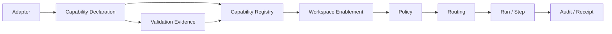

# CAP-001 — Agent OS Agent Capability Schema

> **Status: Draft.** This document defines the proposed machine-readable schema through which Hermes, Codex, and future adapters declare what they can do, under which limits, with which evidence, and with which security implications. It does not claim that any capability is implemented, validated, safe, or enabled merely because it is declared.

## 1. Purpose

The capability schema allows Agent OS to answer:

- what an adapter or runtime claims it can do;
- what has actually been validated;
- what is currently available;
- what types of effects the capability may cause;
- which data classifications it can handle;
- which resource and network scopes it requires;
- whether it supports streaming, cancellation, pause, resume, checkpoints, idempotency, artifacts, usage, and tool delegation;
- which model/provider constraints apply;
- which security controls are mandatory;
- which limitations or evidence gaps remain;
- whether the capability is enabled in a specific workspace.

The schema is intended for:

- adapter registration;
- compatibility negotiation;
- routing;
- preflight;
- policy evaluation;
- UI capability presentation;
- conformance tests;
- readiness;
- security review;
- upgrade and drift detection;
- audit and receipts.

## 2. Core rule

```text
declared capability
≠ validated capability
≠ enabled capability
≠ authorized action
≠ approved consequence
```

A capability declaration is evidence about technical behavior. It is not an authorization grant.

## 3. Goals

The schema must:

1. be provider-neutral;
2. reuse canonical names from `DCT-001`;
3. distinguish declaration from validation;
4. distinguish availability from permission;
5. describe effect and risk;
6. support safe routing;
7. support deny-by-default behavior;
8. preserve unknown and unsupported states;
9. expose limitations;
10. support versioning and compatibility;
11. support machine validation;
12. support partial implementation;
13. support local Linux/WSL runtimes;
14. allow Hermes and Codex to differ without changing core semantics;
15. support future tools and adapters;
16. avoid free-text-only capability claims.

## 4. Non-goals

The schema does not:

- grant workspace access;
- grant filesystem access;
- grant network access;
- grant secret access;
- approve an action;
- define a human role;
- define a model price;
- define complete run state;
- define adapter transport;
- guarantee that a runtime tells the truth;
- guarantee actual model identity;
- guarantee cancellation or resume;
- guarantee safe tool execution;
- replace conformance tests;
- replace policy;
- replace `AGC-001`.

## 5. Capability architecture



## 6. Capability layers

| Layer | Meaning |
|---|---|
| `declaration` | What the adapter claims |
| `validation` | What Agent OS verified |
| `enablement` | What is enabled for a workspace |
| `authorization` | What a current identity/run may use |
| `approval` | Human authorization for an exact consequential action |
| `execution` | What a specific attempt actually did |
| `evidence` | What can be proven afterward |

Each layer is stored and evaluated separately.

## 7. Capability identity

Each capability has:

- `capability_code`;
- `capability_version`;
- `schema_version`;
- `adapter_type`;
- `adapter_implementation_version`;
- optional `runtime_version_range`;
- optional `profile_code`;
- optional `extension_namespace`.

### Capability code format

Recommended format:

```text
<domain>.<verb>[.<variant>]
```

Examples:

```text
agent.execute
agent.status
agent.cancel
agent.pause
agent.resume
agent.checkpoint.create
agent.events.stream
model.infer
model.usage.report
file.read
file.write
file.delete
shell.execute
git.status
git.diff
git.patch.create
git.commit
git.push
git.pull_request.create
artifact.propose
memory.retrieve
tool.propose
tool.execute
network.request
message.draft
message.send
calendar.read
calendar.mutate
```

## 8. Capability declaration envelope

Canonical fields:

| Field | Type | Required | Definition |
|---|---|---:|---|
| `capability_declaration_id` | `opaque_id` | Yes | Stable declaration ID |
| `schema_version` | `version_string` | Yes | Capability schema version |
| `capability_code` | `short_text` | Yes | Stable capability code |
| `capability_version` | `version_string` | Yes | Capability semantic version |
| `adapter_registration_id` | `opaque_id` | Yes | Declaring adapter |
| `adapter_type` | `adapter_type` | Yes | Hermes, Codex, etc. |
| `adapter_implementation_version` | `version_string` | Yes | Adapter version |
| `runtime_name` | `short_text` | Yes | Runtime implementation |
| `runtime_version` | `version_string` | Conditional | Runtime version if known |
| `profile_code` | `short_text` | Optional | Conformance profile |
| `declaration_state` | `capability_state` | Yes | Declared/validated/etc. |
| `effect_class` | `effect_class` | Yes | Effect category |
| `risk_class_default` | `risk_class` | Yes | Default risk |
| `description` | `long_text` | Yes | Human-readable purpose |
| `target_schema` | `json_object` | Yes | Supported target types |
| `input_schema_reference` | `source_reference` | Yes | Input schema |
| `output_schema_reference` | `source_reference` | Yes | Output schema |
| `constraints` | `json_object` | Yes | Technical constraints |
| `security_requirements` | `json_object` | Yes | Required controls |
| `operational_features` | `json_object` | Yes | Cancel/resume/etc. |
| `data_handling` | `json_object` | Yes | Classification and disclosure |
| `validation_summary` | `json_object` | Yes | Validation state/evidence |
| `limitations` | `json_array` | Yes | Known limitations |
| `extensions` | `json_object` | Optional | Namespaced extensions |
| `declared_at` | `timestamp_utc` | Yes | Declaration time |
| `content_hash` | `content_hash` | Yes | Declaration fingerprint |

## 9. Capability states

```text
declared
validating
validated
partially_validated
unsupported
temporarily_unavailable
unknown
deprecated
disabled
incompatible
revoked
```

### State semantics

| State | Meaning |
|---|---|
| `declared` | Adapter claims support; not verified |
| `validating` | Conformance validation is running |
| `validated` | Required tests passed for this profile/version/configuration |
| `partially_validated` | Some required behavior remains unverified |
| `unsupported` | Adapter explicitly does not support it |
| `temporarily_unavailable` | Normally supported but currently unavailable |
| `unknown` | Support cannot be established |
| `deprecated` | Supported but scheduled for removal |
| `disabled` | Administratively disabled |
| `incompatible` | Version/profile mismatch |
| `revoked` | Trust/enablement withdrawn |

## 10. Effect classes

Canonical effect classes from `DCT-001`:

```text
read_only
local_reversible
local_destructive
external_reversible
external_consequential
security_sensitive
financial
production
unknown
```

### MVP policy direction

| Effect class | Default MVP posture |
|---|---|
| `read_only` | May be enabled with guards |
| `local_reversible` | Guarded or approval-gated |
| `local_destructive` | Exact approval |
| `external_reversible` | Exact approval |
| `external_consequential` | Exact approval or deferred |
| `security_sensitive` | Strong approval or prohibited |
| `financial` | Prohibited |
| `production` | Prohibited |
| `unknown` | Denied |

## 11. Risk classes

```text
r0_informational
r1_low
r2_moderate
r3_high
r4_critical
```

The declared default risk is only an input.

Policy may increase risk based on:

- target;
- data classification;
- scope;
- reversibility;
- production context;
- recipients;
- branch;
- secret;
- network destination;
- cost;
- current user;
- workspace rules.

## 12. Target schema

A capability must declare supported target types.

Example:

```json
{
  "target_types": [
    {
      "code": "git_repository",
      "required_fields": [
        "repository_id",
        "worktree_id"
      ],
      "optional_fields": [
        "branch_name",
        "path",
        "remote_name"
      ],
      "normalization_profile": "target.git.v1"
    }
  ]
}
```

### Rules

- target types are controlled;
- required fields are explicit;
- normalized targets are deterministic;
- wildcard targets are prohibited by default;
- target ambiguity blocks execution;
- target schema participates in approval fingerprinting.

## 13. Input schema

The capability declaration references an input schema.

The input schema should define:

- required fields;
- optional fields;
- semantic types;
- size limits;
- classification rules;
- allowed content types;
- nullability;
- default behavior;
- extension rules;
- prohibited fields;
- normalization.

### Input rules

Inputs must not include:

- raw secrets;
- implicit authority;
- unrestricted paths;
- unrestricted network destinations;
- unbounded arrays/content;
- provider-specific semantics outside extensions.

## 14. Output schema

The output schema should define:

- result types;
- partial/final indicator;
- media types;
- classification;
- source/provenance;
- integrity metadata;
- side-effect evidence;
- error mapping;
- artifact proposal rules;
- model/provider observation;
- usage data;
- limitations.

Adapter output is untrusted until validated.

## 15. Operational features object

Canonical fields:

| Field | Type |
|---|---|
| `supports_start` | boolean |
| `supports_status` | boolean |
| `supports_streaming` | boolean |
| `supports_event_cursor` | boolean |
| `supports_cancellation` | boolean |
| `cancellation_semantics` | enum |
| `supports_pause` | boolean |
| `pause_semantics` | enum |
| `supports_resume` | boolean |
| `resume_semantics` | enum |
| `supports_checkpoint` | boolean |
| `checkpoint_portability` | enum |
| `supports_native_idempotency` | boolean |
| `supports_reconciliation` | boolean |
| `supports_artifact_proposals` | boolean |
| `supports_usage_reporting` | boolean |
| `supports_actual_model_reporting` | boolean |
| `supports_tool_delegation` | boolean |
| `supports_hidden_tool_disclosure` | boolean |
| `supports_health` | boolean |

## 16. Cancellation semantics

```text
unsupported
best_effort
acknowledgement_only
safe_boundary
terminal_confirmation
unknown
```

### Meaning

- `best_effort`: request submitted; no completion guarantee;
- `acknowledgement_only`: runtime acknowledges request;
- `safe_boundary`: runtime stops at a known safe boundary;
- `terminal_confirmation`: runtime provides evidence of terminal cancellation;
- `unknown`: behavior cannot be established.

## 17. Pause semantics

```text
unsupported
best_effort
safe_boundary
checkpoint_based
runtime_native
unknown
```

## 18. Resume semantics

```text
unsupported
restart_from_task
resume_paused_session
resume_from_checkpoint
runtime_native
unknown
```

## 19. Checkpoint portability

```text
none
same_process_only
same_adapter_version
same_runtime_version
compatible_version_range
provider_portable
unknown
```

No portability may be assumed without validation.

## 20. Idempotency semantics

```text
unsupported
adapter_scoped
runtime_session_scoped
target_scoped
provider_scoped
platform_only
unknown
```

A capability also declares:

- idempotency key field;
- validity period;
- duplicate response behavior;
- conflict behavior;
- side-effect limits.

## 21. Tool visibility

Canonical states:

```text
all_tools_delegated
all_tools_observed
some_tools_observed
native_tools_disabled
hidden_tools_possible
unknown
```

Protected execution is considered safe only when policy can establish that:

- native protected tools are disabled;
- or every protected action is delegated through Agent OS;
- or the capability is restricted to non-protected work.

## 22. Data-handling object

Fields:

| Field | Definition |
|---|---|
| `supported_data_classes` | Data classes runtime may receive |
| `prohibited_data_classes` | Explicitly prohibited classes |
| `external_disclosure` | Whether data leaves host |
| `provider_retention_state` | Known provider retention behavior |
| `provider_training_state` | Known model training behavior |
| `supports_data_minimization` | Adapter can receive selected context only |
| `supports_redaction` | Adapter/runtime supports redacted input |
| `supports_local_only_mode` | No external provider/network |
| `supports_workspace_session_isolation` | Separate sessions per workspace |
| `output_classification_rule` | Inherit/highest/explicit |
| `content_retention_limit` | Known runtime retention limit |
| `evidence_limitations` | Missing evidence |

## 23. External disclosure states

```text
none
local_process_only
approved_local_network
approved_external_provider
multiple_external_destinations
unknown
```

`unknown` external disclosure blocks protected confidential use.

## 24. Provider retention states

```text
not_applicable
no_retention_reported
bounded_retention_reported
retention_reported_unknown_duration
training_opt_out_reported
training_possible
unknown
conflicted
```

Provider statements remain external-reported facts.

## 25. Resource constraints

A capability may declare:

- maximum input bytes;
- maximum output bytes;
- maximum context units;
- maximum duration;
- maximum tool calls;
- maximum steps;
- maximum attempts;
- maximum concurrent invocations;
- CPU/memory requirements;
- disk requirements;
- supported filesystem roots;
- network requirements;
- provider rate limits;
- unsupported content/media types.

Declared limits are not trusted until validated.

## 26. Filesystem requirements

Fields may include:

```json
{
  "filesystem": {
    "required": true,
    "access_modes": ["read", "write"],
    "root_profiles": ["workspace_repository"],
    "requires_host_home": false,
    "requires_symlink_following": false,
    "supports_read_only_mounts": true,
    "supports_path_allowlist": true,
    "supports_atomic_write": true,
    "supports_delete": false
  }
}
```

### Rules

- paths are normalized by Agent OS;
- host home access is denied by default;
- symlink behavior is explicit;
- deletion is a distinct capability;
- broad filesystem access is incompatible with the secure MVP profile.

## 27. Network requirements

Fields may include:

```json
{
  "network": {
    "required": true,
    "destination_profiles": ["model_provider_openai"],
    "supports_destination_allowlist": true,
    "supports_offline_mode": false,
    "supports_proxy": true,
    "redirect_behavior": "revalidate",
    "dns_behavior": "restricted",
    "unknown_destinations_possible": false
  }
}
```

Unknown or unrestricted destinations block capability enablement.

## 28. Secret requirements

A capability may declare required secret purposes:

```json
{
  "secret_requirements": [
    {
      "purpose": "model_provider_authentication",
      "target_profile": "provider.openai",
      "delivery_mode": "reference_injected",
      "minimum_scope": "model_inference_only",
      "short_lived_supported": true
    }
  ]
}
```

Rules:

- no secret values;
- purpose and target required;
- least privilege;
- secret use evidence;
- production secrets prohibited;
- unsupported safe injection must be disclosed.

## 29. Artifact support

Fields:

- supported artifact types;
- supported media types;
- staged content support;
- integrity-hash support;
- streaming output;
- partial output;
- finality indication;
- size limits;
- classification behavior;
- provenance support;
- preview safety metadata.

The adapter may propose but not accept an artifact.

## 30. Usage support

Fields:

- supported usage metrics;
- source type;
- reporting frequency;
- delay;
- deduplication key support;
- actual model/provider support;
- estimate/report distinction;
- reconciliation support;
- currency/cost support if any.

Unknown usage must remain unknown.

## 31. Model-support object

A capability may declare:

- model families;
- required model modalities;
- context/output limits;
- tool-call support;
- structured-output support;
- streaming support;
- configured versus actual identity reporting;
- fallback behavior;
- provider constraints;
- local model support;
- unavailable features.

Detailed model profiles belong in `MOD-001`.

## 32. Validation summary

Fields:

| Field | Definition |
|---|---|
| `validation_state` | Overall state |
| `validation_profile` | Test profile |
| `validated_at` | Validation time |
| `validated_by` | Test harness/operator |
| `adapter_version` | Version validated |
| `runtime_version` | Runtime validated |
| `configuration_hash` | Configuration fingerprint |
| `test_suite_version` | Conformance suite |
| `passed_tests` | Test IDs |
| `failed_tests` | Test IDs |
| `skipped_tests` | Test IDs |
| `evidence_references` | Evidence |
| `expires_at` | Validation expiry |
| `limitations` | Known gaps |

Validation is specific to version and configuration.

## 33. Validation profiles

### `CAP-VAL-DECLARATION`

Validates schema only.

### `CAP-VAL-CORE`

Validates:

- registration;
- capability response;
- start;
- status;
- output;
- error;
- correlation;
- workspace scope.

### `CAP-VAL-EVENTS`

Validates event streaming/cursor behavior.

### `CAP-VAL-CANCEL`

Validates cancellation behavior.

### `CAP-VAL-CHECKPOINT`

Validates checkpoint and resume.

### `CAP-VAL-USAGE`

Validates actual model and usage reporting.

### `CAP-VAL-TOOL`

Validates protected action delegation.

### `CAP-VAL-SECURITY`

Validates:

- workspace isolation;
- secret exclusion;
- network/file scopes;
- prompt-injection resistance at boundary;
- emergency-stop behavior;
- no approval authority.

## 34. Evidence requirements

Capability evidence may include:

- test result;
- structured transcript;
- request/response samples;
- runtime version output;
- artifact output;
- cancellation result;
- checkpoint restore test;
- model/provider observation;
- usage report;
- negative-test result;
- security-test result.

Evidence includes:

- source;
- time;
- configuration;
- version;
- integrity;
- classification;
- reviewer.

## 35. Capability enablement

Enablement is separate from declaration.

Canonical enablement entity:

```text
WorkspaceCapabilityEnablement
```

Fields:

| Field | Required |
|---|---:|
| `workspace_capability_enablement_id` | Yes |
| `workspace_id` | Yes |
| `agent_registration_id` | Yes |
| `capability_code` | Yes |
| `capability_version` | Yes |
| `state` | Yes |
| `resource_scope` | Yes |
| `data_classes` | Yes |
| `network_scope` | Conditional |
| `secret_reference_ids` | Conditional |
| `policy_profile_reference` | Yes |
| `enabled_by` | Yes |
| `enabled_at` | Yes |
| `expires_at` | Optional |
| `validation_reference` | Yes |

Enablement states:

```text
requested
enabled
enabled_with_limits
suspended
disabled
expired
revoked
blocked_validation
blocked_security
```

## 36. Capability readiness

A capability is ready when:

```text
adapter ready
AND capability validated
AND workspace enabled
AND policy permits
AND required secrets/resources available
AND security profile satisfied
AND emergency stop inactive
```

Readiness states:

```text
ready
ready_with_limits
blocked_adapter
blocked_validation
blocked_workspace
blocked_policy
blocked_resource
blocked_secret
blocked_security
blocked_compatibility
temporarily_unavailable
unknown
```

## 37. Routing eligibility

Routing may use a capability only when:

- capability code/version matches;
- effect class is acceptable;
- required target type is supported;
- data classification is supported;
- resource and network requirements fit;
- model profile is compatible;
- capability is validated;
- workspace enablement exists;
- current health is acceptable;
- current cost and capacity fit;
- no prohibition/emergency stop applies.

## 38. Capability matching

Inputs:

- requested capability;
- required version range;
- target type;
- data class;
- required operational features;
- required evidence quality;
- resource limits;
- model requirements;
- tool visibility requirements;
- workspace policy.

Outputs:

```text
exact_match
compatible_match
compatible_with_limits
no_match
blocked
unknown
```

No match may be converted to fallback only under explicit policy.

## 39. Capability fallback

Fallback configuration should define:

- source capability;
- target capability;
- semantic equivalence;
- quality difference;
- cost difference;
- data-disclosure difference;
- operational limitations;
- approval requirement;
- user visibility.

Silent fallback is prohibited.

## 40. Capability drift

Drift occurs when:

- adapter/runtime version changes;
- declaration hash changes;
- tool visibility changes;
- effect class changes;
- target schema changes;
- data handling changes;
- cancellation semantics change;
- model/provider behavior changes;
- output schema changes;
- limits change.

Drift outcomes:

```text
non_material
requires_revalidation
requires_security_review
requires_reapproval_of_enablement
incompatible
```

## 41. Drift detection

Detection sources:

- startup declaration comparison;
- periodic validation;
- runtime version change;
- schema hash change;
- failed conformance test;
- tool/MCP capability change;
- operator observation;
- incident.

Material drift invalidates readiness.

## 42. Capability deprecation

A deprecated capability declares:

- deprecation date;
- replacement code/version;
- removal date/version;
- migration guidance;
- affected workspaces;
- compatibility;
- security implications.

Deprecated capabilities may be disabled by policy before removal.

## 43. Capability revocation

Revocation may target:

- one capability;
- one adapter version;
- one workspace enablement;
- one runtime;
- one provider/tool profile.

Revocation:

- blocks new dispatch;
- invalidates readiness;
- marks active runs for review;
- preserves history/evidence;
- may activate emergency stop.

## 44. Core capability catalogue

### Runtime/control

```text
agent.register
agent.validate
agent.health
agent.readiness
agent.capabilities.get
agent.execute
agent.status
agent.events.stream
agent.cancel
agent.pause
agent.resume
agent.checkpoint.create
agent.checkpoint.read
agent.reconcile
```

### Models

```text
model.infer
model.stream
model.structured_output
model.tool_call_propose
model.identity.report
model.usage.report
```

### Files

```text
file.read
file.list
file.search
file.write
file.patch
file.move
file.copy
file.delete
```

### Shell/process

```text
shell.execute
process.status
process.cancel
test.execute
build.execute
```

### Git

```text
git.status
git.log
git.diff
git.branch.list
git.branch.create
git.patch.create
git.commit
git.push
git.pull_request.create
git.merge
git.force_push
git.history.rewrite
```

### Artifacts

```text
artifact.propose
artifact.stream
artifact.integrity.report
artifact.finality.report
```

### Memory

```text
memory.context.consume
memory.propose
memory.retrieve.request
```

### Tools/integrations

```text
tool.propose
tool.result.consume
network.request
message.draft
message.send
calendar.read
calendar.mutate
business.read
business.write
```

## 45. MVP capability posture

| Capability | MVP posture |
|---|---|
| `agent.execute` | Required |
| `agent.status` | Required |
| `agent.cancel` | Declaration required; support may vary |
| `agent.events.stream` | Optional if polling exists |
| `agent.pause` | Optional |
| `agent.resume` | Optional |
| `agent.checkpoint.*` | Optional |
| `model.identity.report` | Preferred; unknown allowed |
| `model.usage.report` | Preferred; unknown allowed |
| `file.read` | Required for Codex profile |
| `file.patch` | Required for Codex profile |
| `file.write` | Guarded |
| `file.delete` | Exact approval |
| `shell.execute` | Guarded/sandboxed |
| `test.execute` | Guarded |
| `build.execute` | Guarded |
| `git.status/log/diff` | Guarded read |
| `git.commit` | Exact approval if enabled |
| `git.push` | Exact approval if enabled |
| `git.pull_request.create` | Exact approval if enabled |
| `git.merge` | Prohibited |
| `git.force_push` | Prohibited |
| `git.history.rewrite` | Prohibited |
| `message.draft` | Draft-only may be enabled |
| `message.send` | Approval-gated or deferred |
| `business.read` | Post-MVP read-only |
| `business.write` | Prohibited/deferred |
| `financial` capabilities | Prohibited |
| `production` capabilities | Prohibited |

## 46. Hermes profile expectations

A future **proposed/unregistered** `ADP-HER-001` should map Hermes to:

- required core capabilities;
- actual event support;
- tool visibility;
- model identity;
- usage;
- cancellation;
- pause;
- resume;
- checkpoint;
- local-only versus external behavior;
- data handling;
- security controls;
- validation evidence.

No unsupported Hermes feature should be inferred from general product claims.

## 47. Codex profile expectations

A future **proposed/unregistered** `ADP-CDX-001` should map Codex to:

- repository/worktree capabilities;
- file read/patch/write;
- commands/tests/builds;
- Git proposals;
- actual model identity;
- usage;
- tool visibility;
- cancellation/resume;
- sandbox/process controls;
- network behavior;
- secrets;
- validation evidence.

## 48. Capability schema example — read-only Git status

```json
{
  "schema_version": "1.0.0",
  "capability_code": "git.status",
  "capability_version": "1.0.0",
  "adapter_type": "codex",
  "declaration_state": "validated",
  "effect_class": "read_only",
  "risk_class_default": "r1_low",
  "target_schema": {
    "target_types": ["git_repository"]
  },
  "operational_features": {
    "supports_start": true,
    "supports_status": true,
    "supports_cancellation": true,
    "supports_native_idempotency": true
  },
  "data_handling": {
    "supported_data_classes": ["internal", "confidential"],
    "external_disclosure": "local_process_only",
    "supports_workspace_session_isolation": true
  },
  "limitations": []
}
```

## 49. Capability schema example — Git commit

```json
{
  "schema_version": "1.0.0",
  "capability_code": "git.commit",
  "capability_version": "1.0.0",
  "adapter_type": "codex",
  "declaration_state": "partially_validated",
  "effect_class": "local_reversible",
  "risk_class_default": "r3_high",
  "security_requirements": {
    "requires_exact_approval": true,
    "requires_tool_gateway": true,
    "requires_diff_hash": true,
    "requires_branch_scope": true,
    "prohibits_protected_branch_without_policy": true
  },
  "limitations": [
    {
      "code": "CANCEL_AFTER_GIT_EFFECT_NOT_GUARANTEED",
      "severity": "high"
    }
  ]
}
```

## 50. Capability schema example — model inference

```json
{
  "schema_version": "1.0.0",
  "capability_code": "model.infer",
  "capability_version": "1.0.0",
  "adapter_type": "hermes",
  "declaration_state": "declared",
  "effect_class": "read_only",
  "risk_class_default": "r2_moderate",
  "data_handling": {
    "supported_data_classes": ["internal"],
    "external_disclosure": "approved_external_provider",
    "provider_retention_state": "unknown",
    "supports_data_minimization": true,
    "supports_workspace_session_isolation": true
  },
  "operational_features": {
    "supports_streaming": true,
    "supports_cancellation": true,
    "cancellation_semantics": "best_effort",
    "supports_actual_model_reporting": false,
    "supports_usage_reporting": false
  }
}
```

## 51. Machine-readable schema strategy

The implementation should provide:

- canonical JSON Schema;
- human-readable Markdown;
- generated API components;
- validation fixtures;
- versioned examples;
- conformance test data.

The final machine-readable format requires an ADR.

## 52. JSON Schema direction

The schema should use:

- explicit required fields;
- `additionalProperties: false` in core objects where practical;
- controlled `extensions`;
- reusable definitions;
- URI/version identifiers;
- stable enums;
- bounds;
- semantic formats;
- examples;
- compatibility rules.

## 53. Extension namespaces

Format:

```text
adapter.<adapter-type>.<major-version>
provider.<provider-id>.<major-version>
tool.<tool-type>.<major-version>
```

Rules:

- core semantics cannot be overridden;
- extension schemas are versioned;
- classification applies;
- secrets prohibited;
- unsupported extensions are handled safely.

## 54. Validation errors

Representative errors:

```text
CAP_SCHEMA_INVALID
CAP_CODE_INVALID
CAP_VERSION_INVALID
CAP_EFFECT_CLASS_MISSING
CAP_TARGET_SCHEMA_INVALID
CAP_INPUT_SCHEMA_INVALID
CAP_OUTPUT_SCHEMA_INVALID
CAP_DATA_CLASS_UNSUPPORTED
CAP_SECURITY_REQUIREMENT_MISSING
CAP_LIMIT_INVALID
CAP_EXTENSION_INVALID
CAP_DECLARATION_HASH_MISMATCH
CAP_VALIDATION_EXPIRED
CAP_DRIFT_DETECTED
CAP_INCOMPATIBLE
CAP_NOT_ENABLED
CAP_NOT_READY
CAP_UNKNOWN
```

## 55. Conformance tests

### Schema

- required fields;
- enum validation;
- invalid extension;
- unsupported schema version;
- hash consistency.

### Semantics

- declared versus validated;
- unknown versus unsupported;
- effect/risk mapping;
- target normalization;
- classification compatibility;
- cancellation semantics;
- idempotency semantics.

### Security

- prohibited capability cannot be enabled;
- unknown effect denied;
- secret value rejected;
- wildcard path/network rejected;
- workspace isolation support required;
- hidden tool limitation handled;
- provider disclosure rules enforced.

### Drift

- adapter version change;
- declaration hash change;
- target schema change;
- effect class change;
- tool visibility change;
- data handling change.

## 56. Capability test fixtures

The test suite should include:

- safe read capability;
- guarded local write;
- destructive file delete;
- external message send;
- unknown effect capability;
- unsupported cancellation;
- hidden native tool risk;
- external model with unknown retention;
- local-only model;
- checkpoint-capable runtime;
- invalid/wildcard network capability;
- incompatible capability version.

## 57. Quality gates

Before accepting a capability:

1. schema validates;
2. code/version are stable;
3. effect class is defined;
4. default risk is defined;
5. target schema is deterministic;
6. input/output schemas exist;
7. data handling is explicit;
8. security requirements are explicit;
9. limits are explicit;
10. unsupported/unknown states are honest;
11. validation evidence exists for `validated`;
12. workspace isolation was tested;
13. secret handling was tested;
14. protected tool behavior was tested;
15. drift detection is possible.

## 58. Release-blocking capability conditions

Capability enablement is blocked when:

- effect class is `unknown`;
- capability requires unrestricted host access;
- capability requires unrestricted network;
- raw secret delivery is required without approved isolation;
- workspace session isolation is not possible for protected data;
- hidden protected tools cannot be disabled/delegated;
- validation expired;
- capability drift is material;
- adapter/runtime version is incompatible;
- production or financial capability is requested;
- release-blocking threat from `THR-001` remains unresolved.

## 59. Observability

Metrics:

- capabilities by state;
- validation age;
- validation failure;
- drift events;
- enabled capabilities by workspace;
- readiness blocks;
- capability routing decisions;
- unsupported requests;
- unknown capability requests;
- prohibited capability attempts;
- actual feature-use counts;
- capability-specific error rate;
- capability-specific latency;
- security denials.

## 60. Audit

Audit events should include:

- declaration received;
- validation started/completed;
- declaration changed;
- drift detected;
- capability enabled/disabled/revoked;
- routing match;
- policy denial;
- readiness block;
- prohibited capability request;
- version incompatibility.

## 61. Governance

Capability semantic ownership:

| Concern | Owner |
|---|---|
| Capability schema | Architecture Owner |
| Effect/risk semantics | Security Owner + Product Owner |
| Data handling | Data Owner + Security Owner |
| Validation profile | Quality Owner |
| Operational features | Architecture/Operations |
| Adapter declaration | Adapter implementation owner |
| Workspace enablement | Workspace Owner under policy |
| Final authorization | Policy Engine |
| Exact approval | Eligible human approver |

## 62. Change classification

### Non-breaking

- optional additive field;
- new optional limitation;
- new extension;
- clarification without semantic change.

### Breaking

- capability-code meaning change;
- effect class change;
- target normalization change;
- input/output required field change;
- security requirement weakening;
- cancellation/idempotency meaning change;
- data disclosure change;
- tool visibility change.

Breaking changes require new capability major version and revalidation.

## 63. Backward compatibility

Agent OS should support a documented range of capability schema versions.

Behavior:

- compatible old declaration accepted;
- unsupported newer declaration rejected or quarantined;
- migration tool may transform known versions;
- semantics are never guessed;
- incompatible capabilities are not routed.

## 64. Deprecation and retirement

A deprecated capability must declare:

- replacement;
- deprecation date;
- removal version/date;
- affected adapters/workspaces;
- security impact;
- migration plan.

Retirement preserves historical run and receipt references.

## 65. Security requirements catalogue

- `CAP-SEC-001` — Capability does not grant authority.
- `CAP-SEC-002` — Effect class is mandatory.
- `CAP-SEC-003` — Unknown effect blocks enablement.
- `CAP-SEC-004` — Workspace isolation support is explicit.
- `CAP-SEC-005` — Raw secret values are prohibited.
- `CAP-SEC-006` — Network destinations are constrained.
- `CAP-SEC-007` — Filesystem roots and modes are constrained.
- `CAP-SEC-008` — Protected tools route through Agent OS.
- `CAP-SEC-009` — Tool visibility limitations are explicit.
- `CAP-SEC-010` — Data-class compatibility is explicit.
- `CAP-SEC-011` — Provider disclosure is explicit.
- `CAP-SEC-012` — Production and financial effects are blocked.
- `CAP-SEC-013` — Material drift invalidates readiness.
- `CAP-SEC-014` — Validation evidence is version/configuration-specific.
- `CAP-SEC-015` — Prohibited capabilities cannot be enabled by workspace policy.

## 66. Reliability requirements catalogue

- `CAP-REL-001` — Cancellation semantics are explicit.
- `CAP-REL-002` — Pause/resume/checkpoint support is explicit.
- `CAP-REL-003` — Idempotency semantics are explicit.
- `CAP-REL-004` — Output finality support is explicit.
- `CAP-REL-005` — Event/cursor support is explicit.
- `CAP-REL-006` — Reconciliation support is explicit.
- `CAP-REL-007` — Resource limits are explicit.
- `CAP-REL-008` — Current availability is separate from support.
- `CAP-REL-009` — Drift is detectable.
- `CAP-REL-010` — Incompatible versions block routing.

## 67. Data requirements catalogue

- `CAP-DAT-001` — Canonical fields reuse `DCT-001`.
- `CAP-DAT-002` — Schema version is mandatory.
- `CAP-DAT-003` — Target/input/output schemas are versioned.
- `CAP-DAT-004` — Unknown and unsupported are distinct.
- `CAP-DAT-005` — Classification behavior is explicit.
- `CAP-DAT-006` — Provider/model identity support is explicit.
- `CAP-DAT-007` — Usage source states are explicit.
- `CAP-DAT-008` — Extensions are namespaced.
- `CAP-DAT-009` — Declaration content is fingerprinted.
- `CAP-DAT-010` — Validation evidence is traceable.

## 68. Traceability

| Requirement domain | CAP response |
|---|---|
| `FR-AGT-*` | Capabilities, health, validation |
| `FR-MOD-*` | Model capability/profile support |
| `FR-RUN-*` | Operational feature requirements |
| `FR-APR-*` | Approval-required flags |
| `FR-TOL-*` | Tool, file, shell, network declarations |
| `FR-MEM-*` | Memory context/proposal capabilities |
| `FR-ART-*` | Artifact support |
| `FR-CST-*` | Usage/cost reporting |
| `FR-OPS-*` | Readiness, drift, enablement |
| `NFR-INT-*` | Interoperability and versioning |
| `NFR-SEC-*` | Least privilege and disclosure |
| `AUT-001` | Effect and autonomy posture |
| `THR-001` | Capability abuse and drift controls |

## 69. Mapping to components

| Concern | Component |
|---|---|
| Declaration ingestion | Agent Adapter Gateway |
| Registry | Agent/Capability Registry |
| Validation | Conformance Test Harness |
| Workspace enablement | Control Plane / Registry |
| Routing | Orchestrator / Router |
| Policy | Policy Engine |
| Approval | Approval Service |
| Runtime observation | Adapter |
| Audit | Audit Service |
| UI presentation | Mission Control |

## 70. ADR backlog

### `ADR-TBD-CAP-001 — Canonical schema technology`

Choose JSON Schema, Protocol Buffers, OpenAPI component, or hybrid.

### `ADR-TBD-CAP-002 — Capability-code registry`

Define governance, namespace, registration, and collision prevention.

### `ADR-TBD-CAP-003 — Validation evidence and expiry`

Define validation persistence, review, expiry, and renewal.

### `ADR-TBD-CAP-004 — Capability drift detection`

Define startup comparison, periodic validation, hash/version rules, and blocking behavior.

## 71. Open decisions

1. Which schema technology is canonical?
2. Which capability codes are mandatory for MVP?
3. Are capability codes globally registered?
4. Which enums are closed versus extensible?
5. Which validation expiry applies?
6. Which changes require full security revalidation?
7. Which target schemas are created first?
8. Which data-class combinations are allowed?
9. Which operational features are mandatory for Hermes?
10. Which are mandatory for Codex?
11. Is event streaming mandatory?
12. Is cancellation mandatory for `agent.execute`?
13. Are checkpoints part of MVP acceptance?
14. Which tool visibility state is sufficient?
15. Which provider-retention states are acceptable?
16. Which network profiles are supported?
17. Which filesystem profiles are supported?
18. Which capability enablements require approval?
19. Which routing fallback rules are permitted?
20. Which proposed adapter-specific documents are registered?

## 72. Risks

| Risk | Consequence | Response |
|---|---|---|
| Adapter overclaims capability | Unsafe routing | Validation and evidence |
| Schema too generic | Missing controls | Mandatory effect/security fields |
| Schema too rigid | Adapter incompatibility | Versioned extensions |
| Capability treated as permission | Authorization bypass | Layer separation |
| Unknown mapped to false/unsupported | Incorrect decisions | Explicit state |
| Tool visibility omitted | Hidden protected effects | Mandatory declaration |
| Data disclosure omitted | Privacy leak | Data-handling object |
| Drift ignored | Changed behavior | Fingerprint/revalidation |
| Broad target schema | Excessive scope | Deterministic target profile |
| Raw secret requirement hidden | Credential exposure | Secret requirements |
| Cancellation overstated | False control | Explicit semantics |
| Actual model reporting overstated | False attribution | Support/identity states |
| Validation evidence stale | False readiness | Expiry |
| Extension overrides core | Semantic corruption | Namespaced/no override |
| Capability catalogue sprawl | Governance failure | Registry ownership |

## 73. Assumptions

- adapters can emit structured declarations;
- a schema validator is available;
- conformance tests can be associated with capability IDs;
- Agent OS can store declaration hashes;
- workspace enablement can be represented separately;
- policy can consume capability metadata;
- adapter versions can be observed;
- runtime limitations can be declared honestly;
- Hermes and Codex profiles can be implemented as mappings.

## 74. Constraints

- no capability is authorized by declaration alone;
- no final schema technology is selected;
- no raw secrets;
- no unrestricted path/network capability;
- no production/financial capability;
- no autonomous merge;
- no model/provider claim without evidence;
- no accepted mock validation;
- adapter-specific documents remain proposed/unregistered until register update;
- Git versioning remains deferred until drafting and consistency review are complete.

## 75. Acceptance criteria

CAP-001 may advance to `1.0.0` when:

1. Product accepts the capability catalogue and MVP posture.
2. Architecture accepts schema, layers, matching, enablement, and drift.
3. Security accepts effect, risk, data, file, network, secret, and tool fields.
4. Data accepts canonical fields and versioning.
5. Operations accepts readiness, validation expiry, disable/revoke, and metrics.
6. Quality accepts conformance profiles and fixtures.
7. declaration is distinct from validation and authorization;
8. unknown and unsupported are distinct;
9. effect and risk are mandatory;
10. target/input/output schemas are explicit;
11. data disclosure and classification are explicit;
12. tool visibility is explicit;
13. cancellation/idempotency semantics are explicit;
14. material drift invalidates readiness;
15. `MOD-001`, `RUN-001`, `API-001`, `EVT-001`, and `TST-001` can proceed.

## 76. Downstream impact

| Document | Required use |
|---|---|
| `MOD-001` | Model capability and provider profile fields |
| `RUN-001` | Capability snapshot and execution feature fields |
| `APR-001` | Approval requirement derived from effects |
| `ART-001` | Artifact capability support |
| `API-001` | Capability registry and enablement endpoints |
| `EVT-001` | Capability lifecycle/drift events |
| `DEV-001` | SDK/schema generation and registry workflow |
| `TST-001` | Capability validation and abuse tests |
| `QAG-001` | Validation and drift gates |
| `OBS-001` | Capability state/readiness metrics |
| `OPS-001` | Enable, disable, upgrade, and revalidate |
| `RTM-001` | Capability requirements-to-tests traceability |

## 77. Revision and approval history

### Approval state

- Current status: `draft`
- Current version: `0.1.0`
- Approved by: no one
- Required next action: Product, Architecture, Security, Data, Operations, and Quality review

### Revision history

| Version | Date | Status | Summary |
|---|---|---|---|
| 0.1.0 | 2026-07-19 | Draft | Initial agent capability schema covering identity, effect/risk, target/input/output schemas, operational features, cancellation/resume/checkpoints, idempotency, tool visibility, data handling, resources, validation, enablement, readiness, routing, drift, examples, testing, and governance |

## References

- `DOC-000` — Documentation Governance and Source-of-Truth Policy
- `GLO-001` — Glossary and Controlled Terminology
- `AGC-001` — Agent Adapter Contract
- `DCT-001` — Data Dictionary
- `INT-001` — Integration Architecture
- `ORC-001` — Workflow and Orchestration Architecture
- `SEC-001` — Security Architecture
- `THR-001` — Threat Model
