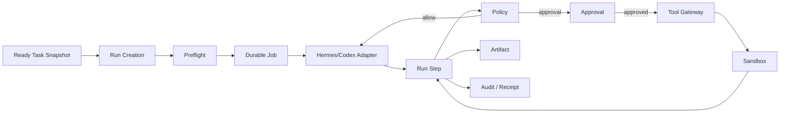
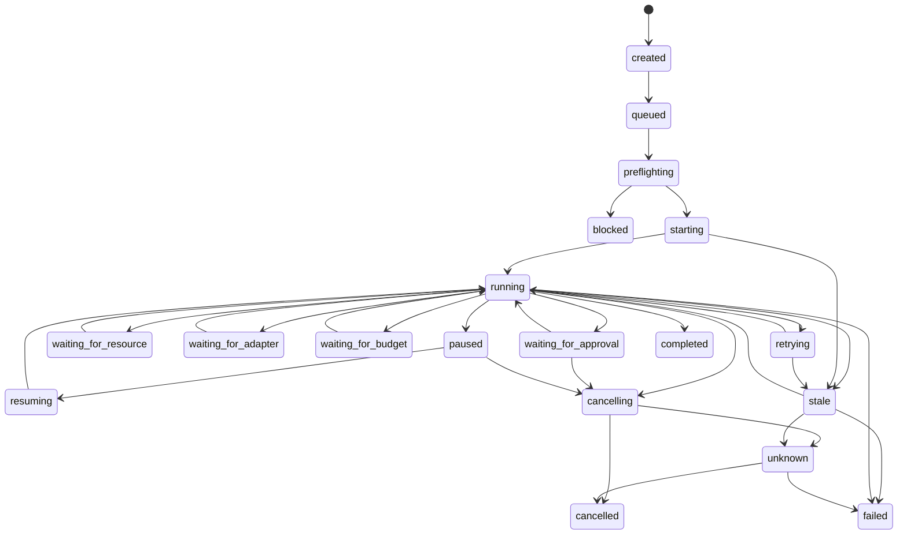

# ORC-001 — Agent OS Workflow and Orchestration Architecture

> **Status: Draft.** This document defines the proposed durable workflow and orchestration architecture for the first Agent OS MVP. It does not select a final workflow engine, queue, scheduler, broker, worker technology, or framework. Detailed runtime schemas belong in `RUN-001`; approval schemas belong in `APR-001`; event schemas belong in `EVT-001`.

## 1. Purpose

This document explains how Agent OS turns a bounded task into a durable, observable, recoverable execution.

It defines:

- task readiness and run creation;
- immutable task snapshots;
- run, step, attempt, job, lease, and checkpoint lifecycles;
- dispatch to Hermes, Codex, providers, tools, and sandbox workers;
- approval waiting and one-time consumption;
- deadlines, timeouts, retries, pause, resume, and cancellation;
- side-effect certainty and idempotency;
- duplicate and out-of-order event handling;
- budget and resource limits;
- stale and unknown states;
- crash recovery, reconciliation, backup, and restore behavior;
- audit, receipts, and observability.

## 2. Core problem

Agent-assisted work is not a simple synchronous request. It may last a long time, wait for human approval, call external systems, partially succeed, lose connectivity, or outlive an API process.

A timeout may mean:

- nothing happened;
- the effect completed;
- the effect partially completed;
- the result is unknown.

The orchestration architecture must preserve control and evidence in all four cases.

## 3. Goals

The MVP orchestration system must:

1. persist every run before dispatch;
2. bind each run to one immutable task snapshot;
3. survive API and worker restarts;
4. prevent duplicate consequential effects;
5. support bounded retries when safe;
6. support resume only from valid checkpoints;
7. block protected actions until exact approval;
8. enforce time, step, attempt, cost, and resource limits;
9. preserve attempt and recovery lineage;
10. expose stale and unknown outcomes;
11. isolate workspaces;
12. normalize Hermes and Codex;
13. retain artifacts, costs, events, and receipts;
14. degrade safely when dependencies fail;
15. operate locally on Linux/WSL;
16. avoid premature distributed complexity.

## 4. Principles

### `OAP-001 — Durable before dispatch`

No external execution starts before the run and required control context are durably recorded.

### `OAP-002 — One run, one snapshot`

A run never changes task snapshot after creation.

### `OAP-003 — Attempts are append-only`

Retries create new attempts; previous attempts are never overwritten.

### `OAP-004 — Side-effect certainty controls recovery`

Automatic retry is blocked when a prior protected effect is unknown.

### `OAP-005 — Approval authorizes one attempt`

Approval is exact, expiring, one-time, and does not prove success.

### `OAP-006 — Workers have capability, not authority`

Workers, adapters, and agents cannot approve, grant permissions, or change policy.

### `OAP-007 — State follows evidence`

Completion requires the required evidence.

### `OAP-008 — Unknown is first-class`

Unknown is not converted silently to failure or success.

### `OAP-009 — Cancellation is forward-looking`

Cancellation prevents future dispatch where possible; it does not erase completed effects.

### `OAP-010 — Recovery revalidates controls`

Retry and resume recheck policy, permissions, approval, budget, resources, and side effects.

### `OAP-011 — At-least-once delivery is assumed`

Commands and events may be duplicated, so consumers must be idempotent.

### `OAP-012 — No infinite autonomy`

Every run has explicit limits and termination conditions.

## 5. MVP scope

### Included

- tasks and immutable snapshots;
- durable runs, steps, and attempts;
- Hermes and Codex adapters;
- human approval waits;
- approved tools and sandbox workers;
- scheduling and delayed jobs;
- worker leases and heartbeats;
- timeouts, bounded retries, pause, resume, and cancellation;
- checkpoints when supported;
- cost and budget controls;
- artifacts, audit, and execution receipts;
- startup recovery and reconciliation;
- one or more local workers.

### Deferred

- open-ended swarms;
- unbounded dynamic workflow graphs;
- multi-region execution;
- public workflow submission;
- production deployment orchestration;
- production financial posting;
- autonomous merge;
- indefinite background goals;
- self-modifying workflow definitions.

## 6. Components

| Component | Responsibility |
|---|---|
| Control Plane API | Accept commands and serve current state |
| Task Service | Own tasks, snapshots, and readiness |
| Durable Orchestrator | Own run and step coordination |
| Scheduler | Deadlines, expiry, wake-ups, delayed retry |
| Durable Job/Event Store | Jobs, leases, outbox, inbox, retry state |
| Agent Adapter Gateway | Normalize Hermes and Codex |
| Tool Gateway | Enforce protected actions |
| Sandbox Worker | Execute bounded file/command operations |
| Policy Engine | Decide allow, guard, approve, deny |
| Approval Service | Exact request, decision, expiry, consumption |
| Artifact Service | Retain outputs and integrity |
| Audit Service | Retain evidence and receipts |
| Cost Service | Usage, budget, attribution |
| Operations Service | Health, maintenance, recovery, emergency stop |

## 7. High-level flow



## 8. Task readiness

A task may become ready only when:

- workspace and project are active;
- a current task snapshot exists;
- desired outcome is defined;
- resources and classification are known;
- required capabilities are available or explicitly unresolved;
- model/tool configuration is valid;
- time, step, retry, and cost bounds exist;
- prohibited actions are absent;
- security blockers are absent.

Readiness outcomes:

```text
ready
blocked_missing_configuration
blocked_policy
blocked_resource
blocked_capability
blocked_budget
blocked_security
blocked_unknown
```

Readiness is rechecked at run start.

## 9. Run creation

A run is created from:

- one task snapshot;
- one workspace;
- optional project;
- requester;
- selected or proposed adapter;
- model profile;
- routing policy;
- execution bounds;
- idempotency key;
- expected artifacts;
- policy context.

The creation transaction should:

1. authorize the requester;
2. load the exact snapshot;
3. re-evaluate readiness;
4. validate limits;
5. resolve idempotency;
6. persist the run;
7. persist routing and policy references;
8. append `RunCreated`;
9. write an outbox/job record;
10. return the durable run ID.

External dispatch occurs only after commit.

## 10. Run data

A run retains:

- run, task, snapshot, workspace, and project IDs;
- requester;
- adapter and model profile;
- routing decision;
- state and reason;
- time, step, attempt, cost, and resource bounds;
- policy references;
- idempotency key;
- created, started, and ended times;
- retry/resume lineage;
- cancellation state;
- last reliable evidence;
- side-effect certainty;
- cost/budget state;
- receipt state;
- aggregate version.

## 11. Run state model

Proposed states:

```text
created
queued
preflighting
blocked
starting
running
waiting_for_approval
waiting_for_resource
waiting_for_adapter
waiting_for_budget
paused
cancelling
retrying
resuming
stale
unknown
completed
failed
cancelled
```



Final guards belong in `RUN-001`.

## 12. Run invariants

1. A run exists before dispatch.
2. It references exactly one immutable snapshot.
3. Workspace scope is immutable.
4. A terminal run does not return to running in the MVP.
5. `completed` requires completion evidence.
6. `cancelled` does not imply rollback.
7. `unknown` is not silently resolved.
8. Every transition records source, reason, time, and version.
9. Transitions use optimistic concurrency or equivalent.
10. Adapter/model substitution is never silent.
11. Bounds cannot be exceeded without governed extension.
12. Emergency stop blocks future dispatch.

## 13. Step model

A step is a meaningful unit, such as:

- agent execution segment;
- model inference;
- tool proposal;
- approval wait;
- tool execution;
- artifact creation;
- checkpoint;
- validation;
- finalization.

Step attributes include:

- step ID and run ID;
- type and capability;
- normalized target;
- dependency/sequence;
- state;
- timeout;
- attempt count;
- approval requirement;
- side-effect class;
- expected result;
- evidence timestamps;
- aggregate version.

Step states:

```text
planned
ready
leased
starting
running
waiting_for_approval
waiting_for_resource
retry_scheduled
paused
cancelling
completed
failed
cancelled
stale
unknown
skipped
```

## 14. Attempt model

Each execution try is a new attempt.

Attempt attributes:

- attempt number and ID;
- run/step IDs;
- idempotency key;
- worker or adapter identity;
- lease and fencing token;
- approval consumption;
- input snapshot;
- output/result;
- failure class;
- side-effect certainty;
- usage/cost;
- heartbeat;
- correlation;
- started/ended times.

Attempt states:

```text
created
leased
dispatched
acknowledged
running
succeeded
failed
timed_out
cancel_requested
cancelled
lost
unknown
```

Rules:

- attempt numbers are monotonic;
- one protected approval consumption maps to one attempt;
- previous attempts remain immutable;
- lease loss is not automatically failure;
- a retry creates a new attempt;
- raw external evidence remains referenced.

## 15. Failure classes

| Failure class | Meaning | Recovery direction |
|---|---|---|
| `validation_failure` | Invalid before execution | Correct task/configuration |
| `authorization_denied` | Identity/scope denied | Human/config review |
| `policy_denied` | Policy blocks | Revise action |
| `approval_missing` | Approval absent | Wait/request |
| `approval_invalid` | Expired, changed, replayed | New exact request |
| `capability_unavailable` | Unsupported/unavailable capability | Wait/reroute |
| `resource_unavailable` | Resource unavailable | Wait/bounded retry |
| `budget_exceeded` | Hard limit reached | Stop or approved change |
| `timeout_before_effect` | Evidence no effect began | Retry may be safe |
| `timeout_after_effect` | Known effect occurred | Reconcile; no duplicate |
| `timeout_unknown_effect` | Effect uncertain | Block automatic retry |
| `transient_external` | Temporary external failure | Bounded retry |
| `permanent_external` | Non-retryable external failure | Fail/revise |
| `worker_lost` | Worker/lease disappeared | Reconcile |
| `integrity_failure` | Artifact/checkpoint/event invalid | Block/recover |
| `internal_failure` | Unexpected Agent OS error | Fail safe |

## 16. Side-effect certainty

| State | Meaning |
|---|---|
| `none` | No side effect possible |
| `known_not_started` | Confirmed not started |
| `failed_before_effect` | Failed before effect boundary |
| `known_completed` | Completed and evidenced |
| `known_partial` | Partial effect occurred |
| `compensated` | Controlled compensation completed |
| `compensation_failed` | Compensation failed |
| `unknown` | Cannot establish effect |

Automatic retry is normally allowed only for:

- `none`;
- `known_not_started`;
- `failed_before_effect`;
- or an explicitly idempotent operation.

## 17. Durable jobs

A durable job stores:

- job ID and type;
- workspace;
- run, step, and attempt;
- payload reference;
- priority;
- scheduled/expiry time;
- state;
- lease owner and expiry;
- attempt count and limit;
- deduplication key;
- last error.

Job states:

```text
pending
scheduled
available
leased
running
completed
retry_scheduled
dead_letter
cancelled
expired
```

Rules:

- one valid lease at a time;
- duplicate delivery is tolerated;
- dead-letter state is visible;
- cancellation/expiry blocks dispatch;
- lease expiry does not prove no side effect.

## 18. Worker leases and fencing

A lease records:

- lease ID;
- job/attempt ID;
- worker identity;
- acquired, heartbeat, and expiry times;
- fencing token/generation;
- state.

Rules:

1. stale workers cannot commit newer state;
2. heartbeats extend only valid leases;
3. reassignment requires reconciliation;
4. lease loss is distinct from execution failure;
5. protected effects are not replayed blindly.

## 19. Scheduler

The scheduler handles:

- delayed retries;
- approval expiry;
- grants and checkpoints expiry;
- run and step deadlines;
- heartbeat checks;
- stale detection;
- rate limits;
- budget refresh;
- periodic health checks;
- backup windows.

It requires:

- durable schedules;
- idempotent wake-ups;
- UTC time;
- catch-up after restart;
- visible scheduling lag;
- explicit missed-deadline events.

## 20. Preflight

Preflight checks:

- authenticated requester/system identity;
- active workspace/project;
- valid snapshot;
- adapter registration and capability;
- model profile;
- tool enablement;
- classification restrictions;
- permission grants;
- emergency stop;
- limits and budgets;
- secret references;
- resource existence and scope;
- mandatory audit/event availability;
- maintenance state.

Outcomes:

```text
allow
allow_with_guards
wait_for_resource
wait_for_adapter
wait_for_budget
require_approval
deny
unknown_block
```

## 21. Dispatch protocol

1. verify aggregate version;
2. verify lease;
3. revalidate policy and revocation;
4. verify or consume approval if required;
5. reserve budget/resources;
6. create attempt;
7. persist dispatch intent and outbox;
8. commit;
9. send to adapter/worker;
10. record acknowledgement or stale state.

Rules:

- no browser-to-adapter dispatch;
- no raw secret in ordinary payload;
- all payloads carry run/step/attempt/correlation;
- duplicate dispatch is detected;
- actual adapter/model is recorded.

## 22. Adapter interaction

The adapter contract must normalize:

- acceptance or rejection;
- external session ID;
- current status;
- events;
- capabilities and limitations;
- artifact candidates;
- checkpoint references;
- usage;
- cancellation/resume support;
- errors;
- side-effect certainty where known.

Adapter reports are evidence; Agent OS remains authoritative for platform state.

Conflicts produce stale/unknown state and reconciliation.

## 23. Protected tool flow

```text
agent proposes action
→ normalize action and target
→ classify risk and side effect
→ policy decision
→ exact approval if required
→ one-time approval consumption
→ attempt creation
→ Tool Gateway
→ sandbox or approved integration
→ result and side-effect evidence
→ run/step update
→ audit and receipt
```

Adapters cannot bypass this path for protected effects.

## 24. Approval waiting

When approval is required:

- create exact approval request;
- move run/step to `waiting_for_approval`;
- persist a waiting condition;
- expose it to eligible approvers;
- schedule expiry;
- block protected dispatch;
- invalidate/cancel on run cancellation or material change.

Approval does not resume execution until it is revalidated and consumed.

## 25. Approval consumption

Before execution:

1. reload request;
2. verify request version/fingerprint;
3. verify eligible human decision;
4. verify independence;
5. verify expiry;
6. re-evaluate policy;
7. verify target and attempt;
8. atomically consume and authorize one attempt;
9. append audit evidence.

A failed attempt does not recreate approval.

## 26. Waiting conditions

A run may wait for:

- approval;
- adapter;
- provider;
- tool;
- resource;
- budget;
- maintenance completion;
- rate limit;
- scheduled time;
- dependent step;
- operator reconciliation.

A waiting condition includes:

- type;
- target/resource;
- created time;
- deadline;
- wake-up rule;
- retry cadence;
- owner;
- state;
- last check;
- evidence.

## 27. Timeouts

Timeout classes:

- queue;
- start acknowledgement;
- heartbeat;
- step;
- run;
- approval;
- resource wait;
- tool;
- cancellation;
- recovery.

A timeout changes what Agent OS knows; it does not automatically establish external reality.

## 28. Retry architecture

Retry eligibility considers:

- failure class;
- side-effect certainty;
- idempotency;
- attempt count;
- remaining time/cost;
- current policy and grant;
- approval validity;
- adapter/tool health;
- emergency stop.

Strategies:

- immediate;
- fixed delay;
- exponential backoff with jitter;
- provider-specified delay;
- operator-triggered;
- no retry.

Every retry policy defines maximum attempts, elapsed time, cost, retryable classes, and approval-renewal rules.

## 29. Retry decision matrix

| Condition | Automatic retry |
|---|---|
| Validation, authorization, policy denial | No |
| Approval missing/invalid | No |
| Transient read before effect | Yes, bounded |
| Idempotent write with stable key | Yes, bounded |
| Known completed consequential effect | No duplicate |
| Known partial effect | No; reconcile |
| Unknown side effect | No |
| Adapter unavailable before dispatch | Wait/retry, bounded |
| Worker lost before effect | Reconcile first |
| Budget exceeded | No |
| Derived index update failed | Yes, bounded |
| Mandatory audit unavailable | No protected dispatch |

## 30. Idempotency

Required at:

- run start;
- job delivery;
- adapter dispatch where supported;
- protected tool invocation;
- approval consumption;
- artifact registration;
- event and usage ingestion;
- checkpoint creation;
- backup command.

An idempotency key binds to scope, operation, target, run/step/attempt, requester, and request hash.

Same key with different request is rejected.

## 31. Resume and checkpoints

Resume requires:

- valid checkpoint;
- verified integrity;
- adapter support;
- non-expired state;
- unchanged task snapshot;
- authorized resources;
- current policy;
- renewed approval where needed;
- remaining budget/time;
- understood prior side effects;
- compatible adapter/model/tool versions.

Checkpoint fields include:

- run, step, and attempt;
- adapter/runtime reference;
- content reference and hash;
- schema/version;
- expiry;
- compatible capabilities;
- permission/resource snapshot;
- side-effect summary.

A checkpoint is not an approval and does not prove the absence of effects.

## 32. Pause

Pause may be user-, policy-, maintenance-, budget-, or adapter-requested.

Limitations:

- not every adapter supports pause;
- pause may occur only at a safe boundary;
- current provider calls may complete;
- completed side effects remain;
- unsupported pause is shown explicitly.

## 33. Cancellation

Cancellation workflow:

1. authorize;
2. mark `cancelling`;
3. stop new dispatch;
4. cancel pending jobs;
5. invalidate pending approvals;
6. request adapter/tool stop;
7. wait within timeout;
8. preserve completed results/effects;
9. reconcile external state;
10. set `cancelled` or `unknown`;
11. generate evidence.

Possible outcomes:

```text
cancelled_before_start
cancelled_cleanly
cancelled_after_partial_work
cancel_requested_external_running
cancel_failed
cancel_unknown
```

## 34. Compensation

The MVP does not promise general rollback.

A compensating action:

- is a new explicit action;
- receives a new policy decision;
- may require approval;
- has its own attempt and receipt;
- preserves original evidence.

Examples include reverting an uncommitted patch or deleting an external draft. Not every action is compensable.

## 35. Stale and unknown states

A run becomes stale when expected evidence is not refreshed.

Signals:

- missing heartbeat;
- expired lease;
- adapter unreachable;
- event stream interruption;
- unknown tool response;
- event-processing lag.

Stale triggers status query and reconciliation, not immediate failure.

Unknown may be resolved through:

- adapter/tool/provider query;
- Git/file inspection;
- external receipt;
- operator evidence;
- governed administrative resolution.

Uncertainty evidence remains retained.

## 36. Reconciliation

Reconciliation compares Agent OS state with:

- runtime session;
- Git repository;
- file state;
- tool target;
- provider request/usage;
- artifact content;
- checkpoint;
- expected audit events;
- budget reservation;
- worker lease.

Results:

```text
matched
externally_completed
externally_failed
partial
duplicate
missing
conflicted
unknown
```

## 37. Crash recovery

### API crash

Durable work continues where workers are independent.

### Orchestrator crash

Jobs and state remain durable. Expired leases are reconciled before reassignment.

### Adapter crash

Only the affected route degrades. Attempts become stale/unknown until queried.

### Worker crash

Lease expires; side-effect certainty is evaluated before retry.

### Store crash

Protected operations stop. No false acknowledgement is emitted.

## 38. Startup recovery scan

On startup:

1. acquire recovery ownership;
2. locate expired leases;
3. locate nonterminal runs;
4. locate jobs left leased/running;
5. process approval and deadline expiries;
6. locate cancellation in progress;
7. identify stale external sessions;
8. reconcile budget reservations;
9. reconcile attempts before redispatch;
10. publish a recovery report.

## 39. Worker model

Worker types may include:

- orchestration;
- adapter;
- tool/sandbox;
- indexing;
- artifact reconciliation;
- cost reconciliation;
- receipt generation;
- backup.

Every worker has type, version, allowed jobs, resource limits, heartbeat, build identity, and revocation state.

## 40. Concurrency and capacity

Initial target from `NFR-001`:

- at least 4 active runs;
- at least 5 concurrent users.

Controls:

- global active-run limit;
- per-workspace limit;
- per-adapter/provider/tool limit;
- per-host CPU/memory limit;
- per-budget limit;
- queue priority.

Fairness and starvation are observable.

## 41. Priority

Suggested priority order:

1. emergency stop and revocation;
2. cancellation;
3. approval consumption;
4. recovery and reconciliation;
5. interactive run;
6. ordinary run;
7. index/reconciliation;
8. backup and maintenance.

Priority never bypasses policy or budget.

## 42. Parallelism

Allowed:

- independent safe reads;
- non-conflicting artifact/index work;
- separate runs within capacity.

Restricted:

- parallel consequential writes to the same target;
- unbounded fan-out;
- dynamic unbounded graphs;
- uncontrolled agent spawning.

The MVP workflow graph should be acyclic apart from bounded retries.

## 43. Routing and fallback

Routing chooses adapter, model profile, tool implementation, and worker class based on:

- capability;
- validation state;
- workspace policy;
- classification;
- availability;
- cost;
- configured preference;
- explicit fallback.

Fallback is allowed only when preconfigured and visible. It must preserve capability, classification, budget, and approval requirements.

## 44. Budget and execution bounds

Checks occur:

- before run creation;
- before expensive steps;
- before retries and fallback;
- during long runs as usage arrives;
- before approved budget extension.

Every run has:

- wall-clock limit;
- active-execution limit;
- step limit;
- attempt limit;
- consecutive-failure limit;
- approval wait limit;
- resource wait limit;
- cost limit;
- output/storage limit.

Exceeding a bound pauses, blocks, cancels, or fails according to policy.

## 45. Resource limits

Sandbox/worker controls may include:

- CPU;
- memory;
- process count;
- open files;
- disk/output size;
- command duration;
- filesystem mounts;
- network destinations and volume.

Resource exhaustion is classified and evidenced.

## 46. Emergency stop and maintenance

Emergency stop can target platform, workspace, adapter, tool, provider, capability, or run.

It:

- blocks new dispatch;
- blocks approval consumption;
- marks active work for pause/cancel/review;
- preserves evidence.

Maintenance modes may include:

- read-only;
- no-new-runs;
- full maintenance;
- migration;
- restore.

## 47. Events

Representative events:

```text
RunStartRequested
RunCreated
RunQueued
RunPreflightStarted
RunPreflightPassed
RunBlocked
RunDispatched
RunStateChanged
StepPlanned
StepReady
AttemptLeased
AttemptDispatched
AttemptAcknowledged
AttemptHeartbeatReceived
AttemptCompleted
AttemptFailed
AttemptTimedOut
ApprovalWaitStarted
ApprovalConsumed
RetryScheduled
ResumeRequested
CheckpointCreated
RunBecameStale
RunStateBecameUnknown
RunReconciled
CancellationRequested
RunCancelled
RunCompleted
RunFailed
ExecutionReceiptGenerated
```

Events have stable IDs, schema versions, workspace, aggregate version, correlation, and causation.

Consumers tolerate duplicate and out-of-order delivery.

## 48. Read models and API

Mission Control may use:

- `RunOperationalSummary`;
- `RunTimeline`;
- `StepAttemptTimeline`;
- `WaitingConditionView`;
- `RetryEligibilityView`;
- `CheckpointStatusView`;
- `CancellationStatusView`;
- `WorkerLeaseView`;
- `QueueHealthView`;
- `RunCostSummary`;
- `ExecutionReceiptSummary`.

Potential operations:

```text
POST /tasks/{task_id}/runs
GET  /runs/{run_id}
GET  /runs/{run_id}/timeline
POST /runs/{run_id}/pause
POST /runs/{run_id}/resume
POST /runs/{run_id}/cancel
POST /runs/{run_id}/reconcile
POST /runs/{run_id}/steps/{step_id}/retry
GET  /runs/{run_id}/checkpoints
GET  /runs/{run_id}/receipt
GET  /orchestration/queues
GET  /orchestration/workers
```

Detailed contracts belong in `API-001`.

## 49. Execution receipt

The receipt summarizes:

- task snapshot;
- requester;
- run/step/attempt lineage;
- adapter/model/tool;
- policy decisions;
- approvals;
- artifacts;
- usage/cost;
- retries, resume, and cancellation;
- terminal state;
- known effects;
- evidence gaps;
- timestamps and versions.

It summarizes but does not replace underlying evidence.

## 50. Observability

Metrics include:

- queue depth and age;
- run and step states;
- lease expiry;
- heartbeat lag;
- retry rate and success;
- stale/unknown runs;
- approval waiting age;
- cancellation latency;
- checkpoint/resume success;
- adapter/provider/tool latency;
- event lag;
- dead-letter jobs;
- budget blocks;
- receipt completeness.

Traces correlate API request, run, step, attempt, adapter session, provider request, approval, tool invocation, artifact, and receipt.

## 51. Degraded behavior

| Failure | Response |
|---|---|
| API unavailable | Durable background work may continue |
| Orchestrator unavailable | State preserved; work stale until recovery |
| Job store unavailable | No new durable async dispatch |
| Transactional store unavailable | Protected transitions stop |
| Adapter unavailable | Affected route waits/blocks |
| Provider unavailable | Affected model route waits/blocks |
| Tool Gateway unavailable | Protected actions block |
| Sandbox unavailable | Tool attempts wait/fail explicitly |
| Approval unavailable | Approval-gated steps wait |
| Mandatory audit unavailable | Consequential dispatch blocks |
| Cost unavailable | Conservative budget policy |
| Artifact unavailable | Finalization waits/fails explicitly |
| Memory unavailable | Continue only if task policy permits |
| Scheduler delayed | Catch-up and missed-deadline evidence |
| Worker lost | Reconcile before retry |

## 52. Persistence, backup, and restore

Durable records include:

- runs, steps, attempts;
- waiting conditions;
- jobs, schedules, leases;
- checkpoints;
- side-effect records;
- idempotency;
- routing;
- approval references;
- budget reservations;
- outbox/inbox;
- reconciliation;
- receipt state.

After restore:

1. leases are considered expired;
2. nonterminal runs enter recovery review;
3. external effects are reconciled;
4. approval validity is rechecked;
5. missed schedules are processed safely;
6. cancelled/deleted state is preserved;
7. protected work is not blindly redispatched.

## 53. Security threats and controls

Threats:

- duplicate dispatch;
- approval replay;
- stale worker commits;
- forged adapter events;
- queue poisoning;
- cross-workspace jobs;
- gateway bypass;
- checkpoint tampering;
- infinite retry;
- cancellation ignored;
- unknown effect treated as failure;
- restore replay;
- secret leakage in payloads.

Controls:

- scoped identities;
- fencing tokens;
- idempotency;
- exact one-time approval;
- policy revalidation;
- sandbox/network controls;
- bounded retry;
- event validation;
- secret references;
- audit and receipts;
- emergency stop;
- recovery mode.

## 54. Test strategy

### State tests

- allowed and forbidden transitions;
- terminal protection;
- aggregate-version conflict.

### Concurrency tests

- duplicate start;
- two workers claiming;
- two approval consumptions;
- cancel versus complete;
- retry versus late completion;
- budget races.

### Fault tests

- API/orchestrator/worker/adapter crash;
- provider timeout;
- store outage;
- duplicate and delayed events;
- restore.

### Side-effect tests

- no effect;
- completed;
- partial;
- unknown;
- idempotent replay;
- non-idempotent block.

### Recovery tests

- lease expiry;
- startup scan;
- checkpoint resume;
- stale reconciliation;
- cancellation timeout;
- unknown resolution.

## 55. MVP acceptance gates

1. Every external dispatch has a persisted run.
2. Duplicate start creates one logical run.
3. Attempts are append-only.
4. Fencing prevents stale worker commits.
5. Approval replay is blocked.
6. Unknown protected effects do not auto-retry.
7. Bounded transient retries work.
8. Cancellation stops future dispatch.
9. Restart preserves run state.
10. Stale and unknown states are visible.
11. Checkpoints are integrity-checked.
12. Resume revalidates controls.
13. Duplicate/out-of-order events do not corrupt state.
14. Workspace isolation applies to jobs and events.
15. Bounds terminate or block work.
16. Terminal runs expose receipt/evidence state.
17. Restore does not blindly redispatch.

## 56. Traceability

| Requirement family | Orchestration response |
|---|---|
| `FR-TSK-*` | Readiness and immutable snapshots |
| `FR-RUN-*` | Durable run, steps, attempts, recovery |
| `FR-APR-*` | Waiting and one-time consumption |
| `FR-TOL-*` | Tool orchestration |
| `FR-ART-*` | Artifact finalization |
| `FR-AUD-*` | Events and receipts |
| `FR-CST-*` | Budget limits |
| `FR-OPS-*` | Health and recovery |
| `NFR-REL-001` | Persisted terminal state |
| `NFR-REL-003` | Safe resume |
| `NFR-REL-008` | Duplicate protection |
| `NFR-REL-010` | Crash behavior |
| `NFR-COST-003` | Budget enforcement |
| `AUT-001` | Approval, retry, cancel, autonomy |

## 57. Mapping to contexts and containers

| Concern | Bounded context | Container |
|---|---|---|
| Task readiness | `BC-WRK` | `CTR-002` |
| Runs/steps/attempts | `BC-RUN` | `CTR-003` |
| Adapter routing | `BC-REG` | `CTR-004` |
| Hermes/Codex | Adapter contexts | `CTR-005`, `CTR-006` |
| Policy | `BC-POL` | Policy module / `CTR-008` |
| Approval | `BC-APR` | `CTR-002`, `CTR-003` |
| Tool execution | `BC-POL`/integration | `CTR-008`, `CTR-009` |
| Jobs/events | `BC-RUN` | `CTR-016` |
| Audit | `BC-AUD` | `CTR-012`, `CTR-019` |
| Cost | `BC-CST` | `CTR-013` |
| Operations | `BC-OPS` | `CTR-014`, `CTR-020`, `CTR-021` |

## 58. ADR backlog

### `ADR-TBD-ORC-001 — Durable orchestration mechanism`

Compare database-backed jobs, workflow engine, broker plus orchestrator, and embedded durable workflow library.

### `ADR-TBD-ORC-002 — Job/event transport`

Decide database outbox, broker, polling, ordering, backup, and local footprint.

### `ADR-TBD-ORC-003 — Lease and fencing strategy`

Decide leases, locks, fencing tokens, and recovery ownership.

### `ADR-TBD-ORC-004 — Checkpoint representation`

Decide content storage, portability, integrity, expiry, and adapter compatibility.

### `ADR-TBD-ORC-005 — Real-time UI propagation`

Decide polling, server-sent events, or WebSocket with reconnect and stale semantics.

## 59. Open decisions

1. Which orchestration technology?
2. Is a database-backed queue sufficient?
3. Are steps sequential only in the first vertical slice?
4. Which graph complexity is allowed?
5. Which adapters support checkpoints?
6. Which operations are idempotent?
7. Default retry and heartbeat thresholds?
8. Lease duration and fencing mechanism?
9. Can a paused run survive upgrade?
10. Can a failed run reroute to another adapter?
11. When does rerouting require approval?
12. How are budget reservations implemented?
13. Which cancellation semantics can Hermes and Codex guarantee?
14. Which effects have compensation?
15. Which receipt fields are mandatory?
16. Which jobs are backed up?
17. How are restored nonterminal runs handled?
18. How many workers are supported initially?
19. Which operational controls appear in Mission Control?
20. Which fields belong in `RUN-001` and `DCT-001`?

## 60. Risks

| Risk | Consequence | Response |
|---|---|---|
| Custom orchestrator too weak | Lost/duplicate work | Fault prototype and explicit states |
| Heavy workflow engine | MVP delay | ADR based on requirements |
| Blind retry after timeout | Duplicate consequence | Side-effect certainty |
| Lease expiry treated as failure | Unsafe redispatch | Reconciliation and fencing |
| Adapter reports false completion | Wrong state | Evidence/conflict handling |
| Approval consumed twice | Duplicate effect | Atomic uniqueness |
| Cancellation assumed rollback | Hidden effects | Forward-looking semantics |
| Checkpoint incompatible | Failed resume | Version/integrity checks |
| Event duplication | Corrupt lifecycle | Inbox and aggregate version |
| Infinite retry/wait | Unbounded cost | Deadlines and limits |
| Delayed usage | Overspend | Conservative budget policy |
| Restore replays work | Duplicate effects | Recovery mode |
| Gateway bypass | Control failure | Architecture fitness tests |
| Parallel conflict | Data corruption | Bounded graph and target control |
| Audit unavailable | Missing evidence | Block consequential work |

## 61. Assumptions

- durable transactional storage is available;
- local workers are feasible;
- Hermes and Codex expose start/status/result behavior;
- protected side effects can pass through a gateway;
- approval consumption can be unique;
- server time is available;
- crashes can be simulated;
- representative workflows can be created;
- initial concurrency is small;
- operators can reconcile unknown cases.

## 62. Constraints

- no final workflow engine is approved;
- no public workflow submission;
- no unlimited autonomy;
- no general rollback promise;
- no protected blind retry;
- no direct browser-to-worker dispatch;
- no agent approval;
- no autonomous merge;
- no production or financial writes;
- no accepted mock operational state;
- Git versioning remains deferred until the documentation drafting phase is complete.

## 63. Acceptance criteria

ORC-001 may advance to `1.0.0` when:

1. Product accepts bounded execution and user control.
2. Architecture accepts states, leases, jobs, and recovery.
3. Data accepts persistence and transactions.
4. Security accepts approval, idempotency, worker, and side-effect controls.
5. Operations accepts startup recovery, cancellation, maintenance, and restore behavior.
6. Quality confirms state, concurrency, and fault cases are testable.
7. Run-before-dispatch is enforceable.
8. Approval is consumed once.
9. Retries are bounded and side-effect-aware.
10. Stale and unknown are first-class.
11. Cancellation does not imply rollback.
12. Recovery revalidates policy and evidence.
13. Adapters remain replaceable.
14. `RUN-001`, `APR-001`, `AGC-001`, `EVT-001`, `API-001`, and `TST-001` can proceed.
15. Metadata, terminology, Markdown, and diagrams validate.

## 64. Downstream impact

| Document | Required use |
|---|---|
| `INT-001` | Adapter, provider, and tool orchestration interfaces |
| `SEC-001` | Worker, queue, event, approval, recovery controls |
| `THR-001` | Duplicate, replay, worker, event threats |
| `AGC-001` | Start/status/cancel/resume contract |
| `CAP-001` | Runtime orchestration capabilities |
| `RUN-001` | Run/step/attempt/checkpoint schemas |
| `APR-001` | Approval schemas |
| `API-001` | Run-control operations |
| `EVT-001` | Orchestration events |
| `OBS-001` | Queue/worker/run telemetry |
| `OPS-001` | Startup, shutdown, recovery, maintenance |
| `BCP-001` | In-flight backup/restore |
| `TST-001` | State, concurrency, and fault tests |
| `RTM-001` | Requirement-to-orchestration traceability |

## 65. Revision and approval history

### Approval state

- Current status: `draft`
- Current version: `0.1.0`
- Approved by: no one
- Approval date: not applicable
- Required next action: Product, Architecture, Security, Data, Operations, and Quality review

### Revision history

| Version | Date | Status | Summary | Authority |
|---|---|---|---|---|
| 0.1.0 | 2026-07-19 | Draft | Initial orchestration architecture covering readiness, durable runs, steps, attempts, jobs, leases, dispatch, approvals, retries, checkpoints, resume, cancellation, reconciliation, crash recovery, budgets, events, observability, and quality gates | Draft authoring; not approved |

## References

- `DOC-000` — Documentation Governance and Source-of-Truth Policy
- `GLO-001` — Glossary and Controlled Terminology
- `VSN-001` — Product Vision and Project Charter
- `SCP-001` — Scope and System Boundaries
- `PER-001` — Personas and Jobs to Be Done
- `UCD-001` — User Journeys and Use Cases
- `PRD-001` — Product Requirements Document
- `SRS-001` — Functional Requirements Specification
- `NFR-001` — Non-Functional Requirements
- `AUT-001` — Autonomy and Approval Matrix
- `RTM-001` — Requirements Traceability Matrix
- `SAD-001` — System Architecture Description
- `C4-001` — System Context Diagram
- `C4-002` — Container Diagram
- `DDD-001` — Domain Model
- `DAT-001` — Data Architecture
- `MEM-001` — Memory and Knowledge Architecture
