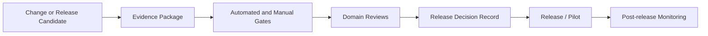

# QAG-001 — Agent OS Quality Assurance and Release Gates

> **Status: Approved baseline — 2026-08-13.** This document defines the quality governance model, formal release gates, mandatory evidence, blockers, waivers, sign-off responsibilities, stage-transition criteria, release decision records, and post-release obligations for Agent OS. It does not select the final CI/CD platform, deployment technology, test framework, or commercial certification scheme.

## 1. Purpose

Agent OS coordinates software agents, adapters, model providers, tools, approvals, artifacts, memory, asynchronous execution, and recovery workflows.

A release cannot therefore be accepted merely because:

- the application starts;
- a demo succeeds;
- unit tests pass;
- the UI looks complete;
- an agent reports success;
- a single provider works;
- a backup file exists;
- a mock workflow appears functional.

This document defines how Agent OS determines whether a change, feature, build, release candidate, pilot, or commercialization candidate is sufficiently complete, safe, verifiable, operable, and documented.

## 2. Quality objectives

Quality governance must ensure that:

1. requirements are traceable;
2. domain invariants are preserved;
3. workspace isolation is proven;
4. human approval controls cannot be bypassed;
5. consequential effects are bounded and evidenced;
6. duplicate delivery does not create duplicate effects;
7. unknown and stale states remain visible;
8. adapters and models are represented honestly;
9. artifacts remain untrusted until validated;
10. backup and restore are proven;
11. operators can diagnose and recover failures;
12. accessibility is treated as a release property;
13. documentation matches the implementation;
14. residual risk is explicit;
15. no release claim exceeds available evidence.

## 3. Non-goals

This document does not:

- promise defect-free software;
- promise perfect security;
- guarantee model correctness;
- replace testing;
- replace incident response;
- authorize prohibited production or financial actions;
- approve any technology selection;
- define contractual service levels;
- define legal compliance;
- allow release based solely on management preference;
- allow exceptions without owner, expiry, and evidence.

## 4. Quality principles

### `QAG-P-001 — Evidence before claim`

A quality claim requires reproducible evidence.

### `QAG-P-002 — Critical invariants are release blockers`

Workspace isolation, exact approval, durable runs, unknown-effect handling, secret protection, restore safety, and prohibited-action enforcement cannot be waived casually.

### `QAG-P-003 — Passing tests are necessary but not sufficient`

A release also requires documentation, operability, accessibility, security, data integrity, recovery, and product acceptance.

### `QAG-P-004 — Quality is stage-specific`

A developer build, integration candidate, pilot, and commercial release require different evidence.

### `QAG-P-005 — Unknown is not green`

Missing evidence, unavailable scans, incomplete restore, unknown provider identity, or unverified adapter behavior cannot be reported as passed.

### `QAG-P-006 — Exceptions expire`

Every accepted exception has a narrow scope, owner, compensating control, and expiry.

### `QAG-P-007 — No self-certification by producing agent`

The agent or component that produced a change cannot be the only reviewer or evidence source.

### `QAG-P-008 — Visible functionality must be connected`

A release UI must not present mock data, dead controls, or non-persisted state as production functionality.

### `QAG-P-009 — Recovery is part of quality`

A feature that cannot recover safely from restart, timeout, duplicate, or partial failure is incomplete.

### `QAG-P-010 — Documentation is controlled product evidence`

Outdated or contradictory controlled documentation is a quality defect.

### `QAG-P-011 — Security and accessibility can block release`

They are not optional post-release enhancements.

### `QAG-P-012 — Release authority is separated`

No single owner approves every dimension of a significant release.

## 5. Quality scope

Quality assurance covers:

```text
product behavior
domain correctness
architecture
security
privacy and classification
data integrity
API contracts
event contracts
adapter conformance
model routing and identity
tool execution
approvals
artifacts
memory
cost and budgets
frontend UX
accessibility
performance
observability
operations
backup and restore
migration
documentation
support readiness
```

## 6. Quality governance model



## 7. Quality entities

```text
QualityGate
QualityCheck
QualityEvidence
QualityFinding
QualityException
ReleaseCandidate
ReleaseDecisionRecord
PostReleaseReview
```

## 8. QualityGate

A gate is a named set of required checks and evidence.

Fields:

| Field | Required |
|---|---:|
| `gate_id` | Yes |
| `gate_name` | Yes |
| `stage` | Yes |
| `owner` | Yes |
| `required_checks` | Yes |
| `required_approvers` | Yes |
| `blocking_severities` | Yes |
| `exception_policy` | Yes |
| `evidence_retention` | Yes |
| `version` | Yes |

## 9. QualityCheck

A check records:

- check ID;
- requirement or risk;
- method;
- environment;
- expected result;
- result;
- evidence;
- owner;
- blocking status;
- execution time;
- build identity;
- limitations.

## 10. QualityEvidence

Evidence may include:

```text
test report
contract validation
security scan
accessibility report
performance report
migration report
backup manifest
restore report
visual verification
manual review
architecture review
threat-treatment review
operator rehearsal
user acceptance
release manifest
```

## 11. QualityFinding

A finding records:

- finding ID;
- source;
- affected scope;
- severity;
- requirement;
- risk;
- owner;
- status;
- evidence;
- workaround;
- release impact;
- target resolution.

## 12. QualityException

An exception records:

- exact failed or missing gate;
- release scope;
- risk;
- reason;
- compensating controls;
- owner;
- approvers;
- start and expiry;
- monitoring;
- remediation plan;
- affected users/workspaces;
- rollback condition.

## 13. ReleaseCandidate

A release candidate identifies:

- version/build;
- code reference;
- contract/schema versions;
- migrations;
- container/package versions;
- adapters;
- model profiles;
- feature flags;
- target environment;
- evidence manifest;
- open findings;
- exceptions.

## 14. ReleaseDecisionRecord

A release decision records:

- candidate;
- target stage;
- gate results;
- blockers;
- exceptions;
- approver decisions;
- residual risk;
- release recommendation;
- final decision;
- conditions;
- rollback/stop conditions;
- date.

## 15. Release stages

```text
G0 — Change Ready
G1 — Developer Complete
G2 — Integration Candidate
G3 — Release Candidate
G4 — Pilot Ready
G5 — Controlled Commercialization Candidate
G6 — General Production Candidate
```

`G6` is future-oriented and not part of the initial local MVP commitment.

## 16. Gate result states

```text
not_started
running
passed
passed_with_conditions
failed
blocked
waived
not_applicable
expired
unknown
```

### Rules

- `unknown` is not pass;
- `waived` requires an approved exception;
- `not_applicable` requires rationale;
- expired evidence cannot satisfy a gate;
- a blocking failure prevents stage transition.

## 17. Gate precedence

Higher stages require all lower-stage gates unless a newer gate explicitly supersedes them.

```text
G0
→ G1
→ G2
→ G3
→ G4
→ G5
→ G6
```

A pilot-ready build cannot skip integration-candidate evidence.

## 18. G0 — Change Ready

Purpose:

Confirm that a proposed implementation mission is sufficiently defined before coding begins.

Required evidence:

- bounded scope;
- requirement IDs;
- architecture references;
- dependencies;
- acceptance criteria;
- security/data impact;
- test plan;
- migration impact;
- operational impact;
- UI reference where applicable;
- Git constraints.

## 19. G0 blockers

- contradictory requirements;
- missing source document;
- undefined workspace/security impact;
- uncontrolled destructive operation;
- missing acceptance criteria;
- prohibited action in scope;
- no test strategy for critical invariant;
- unresolved architecture decision essential to implementation.

## 20. G0 approval

Required:

- implementation owner;
- relevant domain owner;
- Quality Owner for high-risk missions;
- Security Owner when auth, approval, secrets, sandbox, network, or external effects are affected.

## 21. G1 — Developer Complete

Purpose:

Confirm that the bounded change is implemented and locally verified.

Required evidence:

- changed files reviewed;
- unit/state tests;
- relevant integration tests;
- lint;
- type checking;
- build;
- schema validation;
- migration validation where applicable;
- local smoke;
- visual verification for visible changes;
- documentation updates;
- no secrets;
- no mock operational state.

## 22. G1 blockers

- compilation/build failure;
- relevant test failure;
- stale generated contracts;
- untracked migration;
- secret found;
- dead button or disconnected visible feature;
- cross-workspace test missing for new protected resource;
- direct lifecycle-state mutation;
- agent report not independently verified;
- unrelated destructive changes.

## 23. G1 visual evidence

For frontend changes:

- current branch/build identity;
- actual rendered application;
- changed routes;
- widths `320`, `375`, `768`, `1024`, and desktop;
- loading/empty/error/stale states;
- action behavior;
- no global horizontal overflow;
- hard refresh confirmation;
- screenshots or review notes where safe.

## 24. G2 — Integration Candidate

Purpose:

Confirm that the change works with the real internal boundaries of Agent OS.

Required evidence:

- real relational database integration;
- migrations from clean and supported prior state;
- API contract tests;
- event contract tests;
- outbox/inbox tests;
- durable job tests;
- simulator adapter integration;
- security negative tests;
- concurrency tests for affected invariants;
- observability;
- recovery behavior;
- integrated UI.

## 25. G2 blockers

- state and outbox not atomic;
- duplicate processing repeats effect;
- stale worker can commit;
- approval consumption race unresolved;
- API can patch lifecycle state directly;
- adapter observation sets platform completion directly;
- migration only tested on empty database;
- event schema incompatibility;
- missing health/readiness;
- unknown effects retried automatically.

## 26. G3 — Release Candidate

Purpose:

Confirm that a build is suitable for complete release-candidate evaluation.

Required evidence:

- all P0 requirements traced;
- all T0 tests passing;
- zero open S0 and S1 defects;
- S2 reviewed;
- full selected E2E suite;
- fault and recovery tests;
- security scans;
- accessibility critical journeys;
- performance baseline;
- dependency and container scan;
- backup and restore test;
- release manifest;
- operator documentation;
- known limitations.

## 27. G3 blockers

- P0 requirement without evidence;
- critical/high threat untreated without explicit prohibition;
- S0 or S1 defect;
- failed restore;
- consumed approval lost or reusable after restore;
- unsafe artifact preview;
- secret leakage;
- cross-workspace leak;
- prohibited action available;
- accessibility blocker in critical journey;
- release manifest inconsistent;
- missing rollback/stop condition.

## 28. G4 — Pilot Ready

Purpose:

Confirm that the candidate can be used by controlled pilot users in the approved pilot environment.

Required evidence:

- pilot environment deployed;
- environment-specific smoke;
- real adapter conformance where included;
- model/provider readiness;
- operator rehearsal;
- backup and restore drill;
- emergency-stop exercise;
- incident/contact process;
- user acceptance;
- support instructions;
- pilot data controls;
- residual-risk acceptance;
- monitoring and alerts.

## 29. G4 blockers

- unsupported adapter behavior;
- unknown cancellation semantics presented as certain;
- provider/model identity misleading;
- no emergency stop;
- no tested restore;
- missing operator runbook;
- unresolved S0/S1;
- critical alerting absent;
- pilot data classification not enforced;
- support ownership undefined;
- user cannot distinguish demo/mock from real state.

## 30. G5 — Controlled Commercialization Candidate

Purpose:

Confirm readiness for a limited commercial deployment under controlled contractual and operational conditions.

Additional evidence:

- deployment architecture;
- environment separation;
- secrets and key management;
- tenant/workspace isolation evidence;
- incident response;
- continuity and DR;
- service objectives;
- capacity validation;
- external security review where required;
- privacy/legal review;
- support and maintenance model;
- release and rollback process;
- audit/evidence retention;
- customer-facing limitations.

## 31. G5 blockers

- local-development assumptions still embedded;
- shared credentials;
- unproven tenant isolation;
- no incident response;
- no continuity plan;
- unknown legal/privacy obligations;
- no support ownership;
- unbounded external effects;
- no upgrade/rollback strategy;
- no customer data export/deletion process;
- critical dependency without operational plan.

## 32. G6 — General Production Candidate

Future gate requiring:

- mature deployment automation;
- high availability where needed;
- disaster recovery objectives;
- production security validation;
- scalable operations;
- formal change management;
- customer communication;
- production telemetry;
- long-term maintenance;
- legal/compliance readiness.

G6 is explicitly outside current MVP approval.

## 33. Severity model

```text
S0 — Catastrophic safety, security, data-loss, or prohibited-action defect
S1 — Critical invariant or core workflow defect
S2 — Major degradation or material risk
S3 — Moderate defect
S4 — Minor/cosmetic issue
```

## 34. S0 examples

- cross-workspace confidential disclosure;
- agent self-approval;
- duplicate consequential effect;
- restore reuses consumed approval;
- unrestricted host/network escape;
- production or financial mutation available;
- raw credential exposure;
- unrecoverable backup corruption;
- destructive replay;
- force push or autonomous merge capability.

## 35. S1 examples

- durable run lost after restart;
- cancellation shown as complete while external work continues;
- artifact accepted without required validation;
- stale fencing token accepted;
- wrong model/provider reported as actual;
- cost unknown reported as zero;
- approval target substitution;
- event loss causing authoritative state divergence;
- inaccessible critical approval journey.

## 36. S2 examples

- major performance regression;
- noncritical adapter degraded;
- incomplete noncritical timeline;
- recoverable export failure;
- secondary browser incompatibility;
- important but nonblocking accessibility issue;
- missing noncritical dashboard metric.

## 37. Blocking severity by gate

| Gate | Default blocking severities |
|---|---|
| G0 | S0/S1 design risks, unresolved blockers |
| G1 | New S0/S1, relevant failing tests |
| G2 | S0/S1 and affected invariant failures |
| G3 | All S0/S1; selected S2 |
| G4 | All S0/S1; pilot-critical S2 |
| G5 | All S0/S1; commercial-critical S2 |
| G6 | According to production policy |

## 38. Finding status

```text
open
triaged
accepted_for_fix
in_progress
fixed
verification_pending
verified
deferred
exception_requested
exception_approved
closed
rejected
duplicate
```

## 39. Release blockers

A release blocker is any of:

- blocking severity finding;
- failed mandatory gate;
- missing mandatory evidence;
- expired mandatory evidence;
- unapproved exception;
- unresolved critical threat;
- prohibited action enabled;
- failed backup/restore;
- unsafe data migration;
- inconsistent controlled documentation;
- missing accountable owner;
- release package integrity failure.

## 40. Quality evidence hierarchy

From strongest to weakest for critical claims:

1. reproducible automated test against real boundary;
2. controlled fault/recovery exercise;
3. contract/conformance test;
4. independent manual verification;
5. inspection/static analysis;
6. implementation report;
7. producer/agent assertion.

An agent assertion alone does not satisfy a critical gate.

## 41. Evidence freshness

Evidence freshness depends on:

- code change;
- schema change;
- dependency change;
- adapter/model change;
- environment change;
- security finding;
- migration;
- deployment profile;
- elapsed review period.

A relevant material change invalidates prior evidence.

## 42. Evidence invalidation

Evidence is invalidated when:

- tested build differs;
- migration changed;
- configuration changed materially;
- adapter/runtime changed;
- model/provider binding changed;
- security control changed;
- test fixture no longer applies;
- environment changed;
- test was flaky or incomplete;
- result cannot be reproduced.

## 43. Evidence manifest

A release evidence manifest should contain:

- release candidate ID;
- build identity;
- source reference;
- schema and migration versions;
- container/package hashes;
- feature flags;
- test suites;
- security scans;
- accessibility report;
- performance report;
- migration report;
- backup/restore report;
- adapter conformance;
- known findings;
- exceptions;
- approver decisions;
- manifest hash.

## 44. Automated gate evaluation

Where practical, gates should be machine-evaluable from:

- test result files;
- schema validation;
- scan results;
- requirement traceability;
- migration status;
- artifact manifests;
- release metadata;
- defect tracker;
- exception register.

Human review remains required for semantic, UX, risk, and operational judgments.

## 45. Manual gate review

Manual review is required for:

- product acceptance;
- high-risk approval UX;
- accessibility;
- architecture changes;
- threat treatment;
- adapter limitations;
- restore interpretation;
- residual risk;
- pilot/commercial readiness.

## 46. Release decision authority

No single owner may approve every dimension of G3 or above.

Required roles:

- Product Owner;
- Architecture Owner;
- Security Owner;
- Data Owner;
- Operations Owner;
- Quality Owner.

A role may abstain when formally not applicable, with rationale.

## 47. Quality Owner authority

The Quality Owner may:

- define gates;
- require evidence;
- mark evidence invalid;
- block stage transition;
- request retest;
- reject unsupported quality claims;
- manage exceptions.

The Quality Owner cannot alone accept security or product risk outside delegated authority.

## 48. Product Owner authority

The Product Owner approves:

- intended scope;
- user journeys;
- product completeness;
- known limitations;
- pilot acceptance;
- business impact.

The Product Owner cannot waive security invariants alone.

## 49. Architecture Owner authority

The Architecture Owner approves:

- domain consistency;
- component boundaries;
- state machines;
- API/event compatibility;
- adapter model;
- migrations;
- technical debt impact.

## 50. Security Owner authority

The Security Owner approves:

- threat treatment;
- identity/access controls;
- approval controls;
- sandbox/network/filesystem controls;
- secrets;
- high-risk exceptions;
- security release status.

## 51. Data Owner authority

The Data Owner approves:

- canonical semantics;
- classification;
- retention/deletion;
- migrations;
- provenance;
- backup integrity;
- cost/usage semantics;
- data exceptions.

## 52. Operations Owner authority

The Operations Owner approves:

- startup/shutdown;
- health/readiness;
- monitoring;
- backup/restore;
- recovery;
- incident support;
- capacity;
- pilot runbooks.

## 53. Separation of duties

For G3 and above:

- implementation author cannot be sole verifier;
- producing agent cannot be sole reviewer;
- high-risk security control requires Security review;
- restore evidence requires Operations and Data review;
- approval system requires Security and Quality review;
- release decision requires multi-role sign-off.

## 54. Exception categories

```text
test_exception
security_exception
data_exception
accessibility_exception
performance_exception
operational_exception
documentation_exception
compatibility_exception
```

## 55. Exception requirements

Every exception must define:

- exact gate/check;
- finding;
- affected stage;
- affected scope;
- risk;
- compensating control;
- monitoring;
- owner;
- remediation;
- expiry;
- approvers;
- stop condition.

## 56. Non-waivable controls

Default non-waivable for G3 and above:

- cross-workspace isolation;
- human-only approvals;
- unique approval consumption;
- prohibited-action enforcement;
- raw-secret protection;
- persisted-before-dispatch;
- stale-worker fencing;
- unknown protected-effect retry block;
- restore preserving consumed approvals;
- backup restore capability;
- no autonomous merge/force push;
- critical artifact preview isolation.

Any proposal to waive requires a separate governance decision and is expected to be rejected.

## 57. Exception duration

Exceptions are finite.

Suggested maximum direction:

| Exception class | Maximum review window |
|---|---:|
| G1 local limitation | One mission/release cycle |
| G2 integration limitation | One milestone |
| G3 release exception | Short, explicit period |
| G4 pilot exception | Pilot window only |
| G5 commercial exception | Contractually reviewed, tightly bounded |

Exact durations require governance approval.

## 58. Exception monitoring

An active exception requires:

- dashboard or check;
- alert threshold;
- owner response;
- affected-user communication where needed;
- stop condition;
- review date.

An unmonitored high-risk exception is invalid.

## 59. Exception closure

Closure requires:

- remediation implemented;
- regression test;
- evidence;
- affected documents updated;
- exception marked closed;
- monitoring normalized.

## 60. Requirements gate

The requirements gate verifies:

- all intended features map to controlled requirements;
- P0/P1 classification;
- acceptance criteria;
- no implemented behavior contradicts scope;
- no undocumented provider-specific assumption;
- no prohibited capability enters scope;
- RTM updated.

## 61. Architecture gate

Verifies:

- bounded contexts respected;
- dependency direction;
- no framework/provider leakage into domain;
- control plane authority;
- durable execution;
- outbox/inbox;
- workspace scope;
- recovery path;
- ADR coverage;
- no hidden architecture decision.

## 62. Domain-invariant gate

Verifies:

- task snapshot immutability;
- run persisted before dispatch;
- attempts append-only;
- terminal state immutability;
- exact approval;
- one-time consumption;
- artifact version immutability;
- memory authority separation;
- unknown state semantics;
- cost source semantics.

## 63. API gate

Verifies:

- authentication;
- workspace-first authorization;
- explicit commands;
- idempotency;
- optimistic concurrency;
- safe errors;
- bounded pagination;
- upload/download security;
- versioning;
- no mass assignment;
- no raw secrets;
- machine-readable schema.

## 64. Event gate

Verifies:

- canonical envelope;
- stable event IDs;
- state/outbox atomicity;
- consumer inbox;
- duplicate handling;
- ordering/gaps;
- replay safety;
- dead-letter operation;
- schema compatibility;
- classification;
- no secret payloads.

## 65. Adapter gate

Verifies:

- registration;
- identity/version;
- capability declaration and validation;
- health/readiness;
- lifecycle;
- cancellation truth;
- event behavior;
- model/usage observation;
- tool visibility;
- workspace isolation;
- recovery;
- conformance profile.

## 66. Capability gate

Verifies:

- declaration distinct from validation;
- effect class;
- target scope;
- resource/network requirements;
- evidence;
- drift detection;
- enablement;
- policy and grants;
- readiness;
- prohibition enforcement.

## 67. Model gate

Verifies:

- logical profile;
- binding;
- eligibility;
- data restrictions;
- provider/region;
- fallback;
- actual identity;
- context/output limits;
- usage;
- cost;
- unknown/conflict;
- drift.

## 68. Run gate

Verifies:

- lifecycle;
- persisted-before-dispatch;
- jobs/leases/fencing;
- waiting conditions;
- retries;
- cancellation;
- pause/resume/checkpoint where supported;
- stale/unknown;
- finalization;
- receipt;
- startup recovery.

## 69. Approval gate

Verifies:

- exact normalized action;
- canonical fingerprint;
- review material;
- authority;
- independence;
- immutable decision;
- expiry;
- invalidation;
- unique consumption;
- retry/reroute behavior;
- emergency stop;
- UI accessibility.

## 70. Tool Gateway gate

Verifies:

- normalization;
- capability;
- policy;
- exact approval;
- scoped execution;
- sandbox;
- network/filesystem;
- idempotency;
- side-effect certainty;
- reconciliation;
- audit.

## 71. Artifact gate

Verifies:

- proposal;
- staging;
- content integrity;
- immutable versions;
- provenance;
- classification;
- validation;
- quarantine;
- safe preview;
- review;
- purpose-bound acceptance;
- export;
- deletion/tombstone;
- restore.

## 72. Memory gate

Verifies:

- proposal;
- source;
- authority;
- versioning;
- verification;
- conflict;
- freshness;
- retrieval authorization;
- index derivation;
- deletion;
- no agent self-verification.

## 73. Data gate

Verifies:

- canonical fields;
- semantic types;
- null/unknown;
- classification;
- lineage;
- constraints;
- indexes;
- retention;
- deletion;
- migration;
- backup consistency;
- no cross-workspace data relation.

## 74. Cost gate

Verifies:

- usage source;
- deduplication;
- pricing version;
- decimal/currency;
- estimate versus actual;
- provider/invoice source;
- budget reservation;
- mismatch;
- unknown not zero;
- fallback cost.

## 75. Security gate

Verifies:

- authentication/session;
- authorization;
- workspace isolation;
- approvals;
- secrets;
- sandbox;
- filesystem/network;
- prompt injection boundary;
- artifact safety;
- event forgery/replay;
- supply chain;
- threat-treatment evidence.

## 76. Accessibility gate

Verifies:

- target standard;
- automated scan;
- keyboard;
- screen-reader smoke;
- focus;
- semantics;
- contrast;
- reflow;
- critical workflows;
- no inaccessible approval;
- known exceptions.

## 77. UX gate

Verifies:

- user journeys;
- navigation;
- explicit states;
- source/freshness;
- unknown/stale/partial;
- meaningful error recovery;
- connected actions;
- no dead controls;
- no misleading success;
- responsive behavior;
- terminology consistency.

## 78. Visual-verification gate

Verifies:

- actual current build;
- correct route;
- supported widths;
- interaction;
- hard refresh;
- no global overflow;
- no stale assets;
- no mock operational state;
- baseline or review evidence.

A dedicated `VVR-001` remains proposed/unregistered.

## 79. Performance gate

Verifies:

- baseline;
- common API latency;
- command acceptance;
- event propagation;
- queue age;
- projection lag;
- artifact operations;
- memory retrieval;
- resource limits;
- capacity profile;
- regression analysis.

## 80. Observability gate

Verifies:

- structured logs;
- metrics;
- traces;
- correlation;
- run/approval/artifact timelines;
- source/freshness;
- alerts;
- dashboards;
- no secret leakage;
- operational diagnosis.

Detailed architecture belongs in `OBS-001`.

## 81. Operations gate

Verifies:

- canonical startup;
- shutdown;
- health/readiness;
- migration;
- maintenance;
- emergency stop;
- stuck run;
- dead letter;
- quarantine;
- backup;
- restore;
- incident escalation;
- support ownership.

Detailed procedures belong in `OPS-001`.

## 82. Continuity gate

Verifies:

- backup scope;
- manifests;
- integrity;
- isolated restore;
- recovery;
- data-loss window;
- RPO/RTO direction;
- dependency outage behavior;
- operator rehearsal;
- continuity ownership.

Detailed plan belongs in `BCP-001`.

## 83. Migration gate

Verifies:

- migration checksum;
- clean install;
- supported previous state;
- representative data;
- interruption/resume;
- constraints/indexes;
- backup;
- verification;
- compatibility;
- rollback/forward-fix.

## 84. Documentation gate

Verifies:

- controlled document IDs;
- status/version;
- no broken references;
- register consistency;
- glossary consistency;
- requirements/RTM updated;
- architecture/contracts updated;
- runbooks updated;
- generated schemas current;
- no unsupported claims.

## 85. Dependency and supply-chain gate

Verifies:

- lockfile;
- trusted source;
- vulnerabilities;
- license;
- install scripts;
- transitive dependencies;
- container image;
- SBOM direction;
- no unreviewed high-risk dependency;
- removal plan.

## 86. Configuration gate

Verifies:

- safe defaults;
- required config;
- no insecure public bind;
- secret references;
- environment profiles;
- feature flags;
- emergency state;
- build identity;
- schema compatibility;
- no production credentials.

## 87. Release packaging gate

Verifies:

- reproducible build;
- version;
- hashes;
- dependency lock;
- container/package manifest;
- migrations;
- configuration documentation;
- startup;
- health;
- rollback/stop instructions;
- evidence manifest.

## 88. Feature completeness gate

A feature is complete only when:

- backend behavior exists;
- data persists;
- lifecycle states exist;
- authorization exists;
- approvals exist where needed;
- UI is connected;
- errors are handled;
- observability exists;
- tests exist;
- recovery exists;
- documentation exists.

## 89. Feature incompleteness indicators

A feature is incomplete when:

- UI uses local mock arrays;
- button has no effect;
- state disappears after refresh;
- API route is a stub;
- adapter returns fixed success;
- approval is only a boolean;
- errors become generic success;
- artifact is not stored;
- tests exclude failure paths;
- restart loses work;
- docs claim more than implementation.

## 90. Definition of Ready quality gate

A mission cannot begin implementation until:

- scope is bounded;
- requirements identified;
- architecture impact known;
- security/data impact known;
- tests planned;
- dependencies available;
- acceptance evidence defined;
- prohibited actions excluded;
- Git workflow defined.

## 91. Definition of Done quality gate

A mission is not done until:

- acceptance criteria pass;
- changed contracts are consistent;
- relevant tests pass;
- build/type/lint pass;
- migrations pass;
- workspace isolation passes;
- error and unknown states handled;
- logs/metrics added;
- docs updated;
- UI visually verified;
- no secrets/mocks remain;
- limitations recorded.

## 92. Change-risk classification

```text
R0 — Documentation-only, no behavior
R1 — Low-risk internal behavior
R2 — Moderate user-visible or data behavior
R3 — High-risk security, approval, data, adapter, migration
R4 — Critical boundary, restore, sandbox, prohibited effects
```

## 93. Risk-based gate expansion

| Risk | Minimum gates |
|---|---|
| R0 | Docs/schema validation |
| R1 | G0/G1 + unit/integration |
| R2 | G0/G1/G2 + E2E/visual/accessibility |
| R3 | G0-G3 + security/concurrency/recovery |
| R4 | G0-G4 + independent review/drill |

## 94. Change-impact analysis

Impact analysis considers:

- requirements;
- bounded contexts;
- API/event schemas;
- migrations;
- adapters;
- model profiles;
- approvals;
- artifacts;
- memory;
- data classification;
- UI;
- operations;
- backup;
- threats.

## 95. Regression selection

Every change runs:

- baseline T0 suite;
- changed-module tests;
- dependent-context tests;
- contract tests;
- migration tests where applicable;
- security negatives;
- affected E2E;
- affected visual/accessibility checks.

## 96. Full regression triggers

Full release regression is triggered by:

- major architecture change;
- authentication/authorization change;
- approval change;
- sandbox/Tool Gateway change;
- event/job change;
- migration;
- restore change;
- adapter major version;
- model/provider policy change;
- release candidate.

## 97. Adapter validation expiry

Adapter conformance evidence may expire due to:

- adapter version;
- runtime version;
- provider/model change;
- capability drift;
- security finding;
- elapsed review period.

Expired conformance means not ready until revalidated.

## 98. Model validation expiry

Model/provider evidence may expire due to:

- model version change;
- endpoint/region change;
- pricing change;
- retention/training policy change;
- context limit change;
- provider incident;
- capability drift.

## 99. Security scan freshness

Security evidence is rerun after:

- dependency changes;
- container-base changes;
- security-sensitive code changes;
- release candidate creation;
- major configuration changes;
- secret exposure;
- new threat.

## 100. Accessibility evidence freshness

Accessibility evidence is rerun after:

- navigation/layout change;
- component-library change;
- form/dialog change;
- approval/artifact UI change;
- responsive change;
- major content/label change.

## 101. Performance evidence freshness

Performance evidence is rerun after:

- query/index change;
- event/job architecture change;
- artifact-storage change;
- frontend bundle change;
- provider/adapter routing change;
- release candidate.

## 102. Backup/restore evidence freshness

Restore evidence is rerun after:

- schema change;
- storage change;
- backup tool change;
- encryption/key change;
- event/inbox/outbox change;
- tombstone/deletion change;
- release candidate before pilot.

## 103. Documentation consistency review

Before Git integration of all current drafts, perform:

- ID/register audit;
- title audit;
- dependency audit;
- proposed/unregistered reference audit;
- terminology audit;
- status/version audit;
- cross-document invariant audit;
- requirement ID audit;
- container/context mapping audit;
- unresolved contradiction audit.

## 104. Quality review meeting

For G3 and above, the review agenda includes:

1. candidate scope;
2. evidence manifest;
3. gate summary;
4. S0/S1 status;
5. S2 findings;
6. security threats;
7. restore evidence;
8. accessibility;
9. performance;
10. operations;
11. exceptions;
12. residual risk;
13. decision.

## 105. Release recommendation states

```text
approve
approve_with_conditions
reject
defer
rollback
stop_pilot
```

## 106. Approve

Requires:

- all blocking gates passed;
- no unresolved blocker;
- evidence current;
- required sign-offs;
- conditions documented.

## 107. Approve with conditions

Allowed only when:

- no non-waivable control failed;
- exceptions are approved;
- monitoring exists;
- expiry exists;
- stop conditions exist;
- affected scope is bounded.

## 108. Reject

Used when:

- blocker exists;
- evidence insufficient;
- risk unacceptable;
- stage claim exceeds implementation;
- required owner refuses sign-off.

## 109. Defer

Used when:

- evidence not ready;
- dependency unavailable;
- retest pending;
- scope requires correction.

Defer is not a pass or failure.

## 110. Rollback

Used after release when:

- stop condition triggered;
- severe regression;
- data integrity threatened;
- security incident;
- restore/recovery needed.

Rollback may be application rollback, feature disablement, adapter revoke, emergency stop, or forward-fix according to architecture.

## 111. Stop pilot

A pilot must stop when:

- S0 occurs;
- non-waivable control fails;
- cross-workspace leak;
- approval bypass;
- data loss/corruption;
- uncontrolled external effect;
- restore unavailable;
- security owner invokes stop;
- operator cannot maintain safe state.

## 112. Release decision record template

```text
Candidate:
Target stage:
Scope:
Build and schema:
Gate summary:
Blocking findings:
Exceptions:
Residual risks:
Required monitoring:
Stop conditions:
Rollback/forward-fix:
Approvals:
Decision:
Date:
```

## 113. Conditional-release obligations

After conditional release:

- monitor exception;
- report status;
- prevent scope expansion;
- complete remediation;
- retest;
- close exception;
- update decision record.

## 114. Post-release verification

Immediately after release/pilot deployment:

- build identity;
- health/readiness;
- schema/migration;
- login/workspace;
- run smoke;
- approval smoke if safe;
- artifact smoke;
- event/queue health;
- logs/alerts;
- backup readiness;
- no unexpected external effects.

## 115. Post-release observation window

A defined observation window should monitor:

- errors;
- stale/unknown runs;
- queue lag;
- approval failures;
- adapter health;
- artifact failures;
- security alerts;
- cost anomalies;
- user issues;
- resource use.

Exact duration depends on stage and risk.

## 116. Post-release review

Review includes:

- incidents;
- defects;
- alerts;
- performance;
- operator experience;
- user feedback;
- exceptions;
- rollback events;
- quality improvements;
- document updates.

## 117. Quality metrics

Potential metrics:

- P0 requirement evidence coverage;
- T0 pass rate;
- S0/S1 count;
- escaped defects;
- flaky tests;
- restore success;
- cross-workspace negative coverage;
- approval replay failures;
- adapter conformance freshness;
- accessibility blockers;
- performance regressions;
- stale/unknown run rate;
- documentation drift;
- exception age.

## 118. Metric cautions

Quality metrics must not:

- reward test-count inflation;
- hide severity;
- turn unknown into zero;
- incentivize closing valid findings;
- replace judgment;
- expose sensitive labels;
- compare teams without context.

## 119. Quality dashboard

Recommended views:

```text
release overview
gate status
requirements coverage
T0 status
defects by severity
security findings
accessibility
performance
restore drills
adapter/model validation
exceptions
documentation consistency
```

## 120. Quality alerting

Alerts may trigger on:

- failed release gate;
- S0/S1 opening;
- T0 regression;
- restore failure;
- secret finding;
- approval replay;
- cross-workspace failure;
- adapter conformance expiry;
- prolonged exception;
- missing evidence manifest;
- documentation drift.

## 121. Quality audit trail

Audit records:

- gate execution;
- evidence upload/reference;
- finding changes;
- exception request/approval;
- reviewer decisions;
- release decision;
- stop/rollback decision;
- post-release review.

## 122. Quality data classification

Quality evidence inherits classification from:

- test data;
- logs;
- screenshots;
- artifacts;
- security findings;
- environment;
- customer/pilot scope.

Evidence access is restricted accordingly.

## 123. Screenshot and recording quality evidence

Screenshots and recordings must:

- show build/environment;
- avoid secrets;
- avoid real confidential data unless governed;
- show relevant state;
- preserve date/context;
- not replace functional evidence.

## 124. Agent-generated reports

Agent-generated reports are useful as:

- summaries;
- changed-file lists;
- command logs;
- preliminary findings.

They are not sufficient proof without verification of:

- diff;
- test output;
- runtime;
- UI;
- migration;
- Git status.

## 125. Manual-review independence

For high-risk changes:

- reviewer differs from implementation author;
- approval/security reviewer differs from producing agent;
- restore reviewer includes Operations/Data;
- accessibility review includes qualified manual verification.

## 126. Security exception review

Requires:

- Security Owner;
- Quality Owner;
- affected domain owner;
- Product Owner when user/business risk exists.

Security exceptions cannot be approved only by implementation owner.

## 127. Data exception review

Requires:

- Data Owner;
- Security Owner where confidentiality applies;
- Operations Owner where backup/restore applies;
- Quality Owner.

## 128. Accessibility exception review

Requires:

- Product Owner;
- Quality Owner;
- accessibility reviewer;
- documented affected journey;
- workaround;
- expiry.

Critical approval/login workflows normally cannot ship with blocking accessibility defects.

## 129. Performance exception review

Requires:

- measured impact;
- environment;
- user effect;
- capacity headroom;
- monitoring;
- target fix;
- Operations and Quality approval.

## 130. Documentation exception review

May be allowed only when:

- implementation behavior is safe;
- missing documentation is narrow;
- no operator/security dependency;
- owner and short expiry exist.

Missing restore or security documentation blocks G3+.

## 131. Quality debt

Quality debt includes:

- missing test;
- flaky test;
- incomplete runbook;
- expired evidence;
- unclosed threat;
- manual-only repetitive check;
- weak fixture;
- missing observability;
- inaccessible secondary journey.

## 132. Quality-debt record

Fields:

- debt ID;
- source;
- affected requirement;
- risk;
- owner;
- workaround;
- target;
- expiry/review;
- release impact.

## 133. Quality-debt limits

A stage may define maximum:

- open S2;
- expired exceptions;
- quarantined tests;
- unverified adapters;
- missing evidence;
- documentation drift.

Exact thresholds require stage governance.

## 134. Test quarantine gate

A quarantined T0 test blocks release unless:

- replacement evidence exists;
- root cause is test harness only;
- approved short exception;
- retest scheduled;
- first failure retained.

## 135. Flakiness gate

A release may be blocked when:

- critical suite is flaky;
- repeated retries required;
- environment nondeterministic;
- failure source unknown;
- flaky test masks product defect.

## 136. Code-quality gate

Verifies:

- formatter;
- lint;
- typing;
- architecture rules;
- dead code;
- dependency rules;
- unsafe dynamic execution;
- error handling;
- no hidden globals;
- no unbounded operations.

## 137. Review-quality gate

Verifies:

- scope-focused diff;
- review comments addressed;
- tests reviewed;
- generated code inspected;
- migration reviewed;
- security/data impact reviewed;
- no unrelated changes;
- user work preserved.

## 138. Git-quality gate

Before authorized integration:

- correct branch;
- clean intended diff;
- no secrets;
- no large user files;
- no force push;
- no history rewrite;
- no unauthorized commit/push/PR/merge;
- shared files integrated by one stream;
- release tag/version policy followed.

## 139. Documentation-phase Git rule

During the current documentation drafting phase:

```text
no commit
no push
no pull request
no merge
```

until:

- all documents are drafted;
- user reviews are complete;
- global consistency audit is complete;
- register is corrected;
- explicit Git authorization is given.

## 140. Controlled document quality

A controlled document must have:

- valid front matter;
- unique ID;
- title;
- version;
- status;
- owner;
- approvers;
- dates;
- dependencies;
- revision history;
- no unsupported approval claim.

## 141. Controlled-document blockers

- duplicate ID;
- missing register entry where required;
- broken dependency;
- proposed/unregistered ID presented as official;
- contradictory status;
- approved document changed without versioning;
- unsupported source-of-truth claim;
- missing revision history;
- unresolved critical contradiction.

## 142. Register quality

The register must accurately show:

- document ID;
- title;
- status;
- priority;
- owner;
- dependencies;
- path;
- version;
- source-of-truth role.

Dangling dependencies must be resolved before final integration.

## 143. Glossary quality

Controlled terms must be consistent across:

- requirements;
- domain;
- API;
- events;
- UI;
- adapters;
- operations;
- tests.

Synonym drift is treated as a documentation defect.

## 144. Requirement-ID quality

Requirement IDs must be:

- unique;
- stable;
- mapped;
- not silently renumbered;
- linked to verification;
- linked to implementation/evidence where possible.

## 145. ADR quality

An ADR must state:

- context;
- decision;
- options;
- consequences;
- security/data/operations impact;
- status;
- date;
- supersession.

Hidden technology decisions are quality defects.

## 146. Release-note quality

Release notes should include:

- user-visible changes;
- operational changes;
- migrations;
- security fixes;
- known limitations;
- deprecated behavior;
- upgrade/rollback notes;
- no unsupported marketing claim.

## 147. Known-limitations quality

Limitations must be:

- specific;
- user-visible where relevant;
- operationally actionable;
- linked to issue/debt;
- not hidden in developer notes only;
- not contradicted by UI/marketing.

## 148. Pilot communication quality

Pilot users receive:

- supported scope;
- prohibited actions;
- data-handling guidance;
- known limitations;
- support contact;
- emergency stop/support procedure;
- backup expectations;
- feedback process.

## 149. Commercial communication quality

Commercial claims must not imply:

- perfect memory;
- unlimited autonomy;
- guaranteed correctness;
- exact cost when estimated;
- actual model identity when unknown;
- complete rollback;
- production readiness without evidence;
- security certification not obtained.

## 150. Release artifact set

A release candidate may include:

- application packages/images;
- schema/migrations;
- configuration template;
- checksums;
- SBOM/inventory where selected;
- machine-readable API/events;
- release notes;
- operator guide;
- evidence manifest;
- known limitations;
- restore instructions.

## 151. Release artifact integrity

Verify:

- hashes;
- signatures where selected;
- version consistency;
- dependency lock;
- no secrets;
- no development-only files;
- no user content;
- no stale generated contracts.

## 152. Environment promotion

Promotion should preserve:

- same tested build;
- explicit configuration differences;
- approved migrations;
- environment-specific secrets;
- health checks;
- evidence linkage;
- no rebuild with uncontrolled dependencies between stages.

## 153. Configuration-drift gate

Before pilot/commercial deployment, compare:

- feature flags;
- security controls;
- network bind;
- provider endpoints;
- model profiles;
- adapters;
- storage;
- secrets references;
- retention;
- backup;
- logging.

Unreviewed drift blocks promotion.

## 154. Database readiness gate

Verify:

- supported version;
- migrations current;
- backup;
- connection limits;
- storage;
- integrity checks;
- workspace constraints;
- indexes;
- monitoring;
- restore compatibility.

## 155. Artifact-store readiness gate

Verify:

- path/object scope;
- permissions;
- capacity;
- integrity;
- backup;
- quarantine;
- preview isolation;
- orphan scan;
- health;
- no direct public serving.

## 156. Event/job readiness gate

Verify:

- outbox backlog;
- consumer health;
- inbox integrity;
- dead letters;
- queue age;
- leases;
- scheduler;
- replay disabled for protected effects;
- recovery scan.

## 157. Adapter readiness gate

Verify for each enabled adapter:

- version;
- contract compatibility;
- validation not expired;
- health;
- readiness;
- capability set;
- security limits;
- cancellation semantics;
- operational owner;
- runbook.

## 158. Model/provider readiness gate

Verify:

- binding;
- endpoint/region;
- data policy;
- secret reference;
- health;
- quota;
- pricing freshness;
- fallback;
- actual identity limitations;
- provider incident state.

## 159. Approval readiness gate

Verify:

- human identity/session;
- authority;
- independence;
- review UI;
- expiry;
- invalidation;
- consumption uniqueness;
- emergency stop;
- audit;
- restore behavior.

## 160. Support readiness gate

Verify:

- support owner;
- contact;
- severity process;
- issue intake;
- escalation;
- known issues;
- diagnostic bundle;
- privacy/security handling;
- response expectations.

## 161. Incident readiness gate

Verify:

- incident roles;
- detection;
- emergency stop;
- evidence preservation;
- communication;
- recovery;
- post-incident review;
- security notification path.

Detailed incident procedure belongs in operations/security documents.

## 162. Backup readiness gate

Verify:

- schedule;
- scope;
- encryption state;
- destination;
- retention;
- manifest;
- verification;
- restore drill;
- owner;
- alerting.

## 163. Restore readiness gate

Verify:

- exact backup;
- environment;
- authority/approval;
- maintenance;
- compatibility;
- run/approval/artifact reconciliation;
- validation;
- rollback/forward recovery;
- evidence.

## 164. Recovery readiness gate

Verify:

- startup scan;
- nonterminal runs;
- expired leases;
- outbox/inbox;
- pending cancellation;
- unknown effects;
- orphan artifacts;
- projection rebuild;
- operator actions.

## 165. Emergency-stop gate

Verify:

- activation;
- new protected dispatch blocked;
- approval consumption blocked;
- active work handling;
- UI state;
- audit;
- release authority for reset;
- test exercise.

## 166. Pilot-exit criteria

A pilot may be considered successful when:

- target journeys completed;
- no S0/S1;
- acceptable S2 trend;
- restore drill successful;
- operators can diagnose issues;
- user feedback addressed;
- performance acceptable;
- adapter/model stable;
- known limitations validated;
- next-stage risks documented.

## 167. Pilot failure criteria

Pilot is unsuccessful when:

- non-waivable control fails;
- repeated unsafe unknown effects;
- unacceptable data leakage;
- approval confusion causes unsafe action;
- operator cannot recover;
- restore fails;
- critical usability/accessibility barrier;
- uncontrolled cost;
- support process fails.

## 168. Commercialization evidence additions

Potential additions:

- external penetration test;
- legal/privacy review;
- contractual data-processing terms;
- deployment audit;
- capacity test;
- DR exercise;
- customer support SLA;
- vulnerability-management process;
- update policy;
- end-of-life policy.

## 169. Quality review cadence

Suggested cadence:

- per mission: G0/G1;
- per integration milestone: G2;
- per release candidate: G3;
- before pilot: G4;
- before commercial deployment: G5;
- periodic: adapter/model/security/restore revalidation.

## 170. Continuous-quality checks

Continuous checks include:

- secret scanning;
- dependency scanning;
- schema validation;
- architecture checks;
- T0 tests;
- cross-workspace tests;
- adapter health;
- evidence expiry;
- exception expiry;
- documentation drift.

## 171. Scheduled-quality reviews

Scheduled reviews include:

- full regression;
- restore drill;
- threat review;
- accessibility review;
- performance trend;
- dependency review;
- adapter/model conformance renewal;
- documentation audit;
- quality-debt review.

## 172. Quality toolchain requirements

Selected tooling should support:

- test result ingestion;
- schema validation;
- evidence storage;
- finding tracking;
- gate evaluation;
- release manifest;
- dashboard;
- exception expiry;
- access control;
- export.

Final tools require ADR.

## 173. Quality API direction

Future internal resources may include:

```text
/quality-gates
/quality-gate-runs
/quality-findings
/quality-exceptions
/release-candidates
/release-decisions
/evidence-manifests
```

This is not a public API commitment.

## 174. Quality events direction

Potential events:

```text
QualityGateStarted
QualityGatePassed
QualityGateFailed
QualityEvidenceAdded
QualityFindingOpened
QualityFindingResolved
QualityExceptionRequested
QualityExceptionApproved
QualityExceptionExpired
ReleaseCandidateCreated
ReleaseApproved
ReleaseRejected
PilotStopped
PostReleaseReviewCompleted
```

Detailed schemas would belong in a future update to `EVT-001`.

## 175. Quality audit requirements

Audit:

- who ran gate;
- build/environment;
- evidence;
- result;
- finding;
- exception;
- approver;
- release decision;
- stop/rollback;
- post-release review.

## 176. Quality evidence retention

Retention depends on:

- release stage;
- security;
- contractual need;
- defect history;
- pilot;
- audit.

Evidence containing sensitive data is minimized and restricted.

## 177. Gate automation limits

Automation cannot reliably determine alone:

- product usefulness;
- human comprehension;
- approval clarity;
- residual risk acceptance;
- architecture fitness in every case;
- operational preparedness;
- model factual quality;
- legal/commercial readiness.

## 178. Quality anti-patterns

Do not:

- mark a gate green because a report exists;
- count unavailable scan as pass;
- hide flaky failures;
- waive critical controls permanently;
- approve based on demo only;
- equate UI completeness with backend completeness;
- accept agent self-report;
- claim restore without drill;
- ignore accessibility;
- ship expired adapter evidence;
- treat estimated cost as actual;
- close finding without regression evidence.

## 179. Anti-pattern — test-count quality

Bad:

```text
5,000 tests pass
→ release approved
```

Required:

```text
critical requirements covered
+ T0 passing
+ security
+ recovery
+ accessibility
+ operations
+ evidence
→ release decision
```

## 180. Anti-pattern — conditional release without conditions

Bad:

```text
Approved with conditions
```

without:

- exact condition;
- owner;
- expiry;
- monitoring;
- stop condition;
- remediation.

## 181. Anti-pattern — permanent pilot mode

A pilot must not become indefinite production without:

- G5 review;
- commercial controls;
- updated risk;
- operations/support;
- deployment/security evidence.

## 182. Anti-pattern — “works on my machine”

Local success is insufficient without:

- clean environment;
- reproducible command;
- integration evidence;
- migration;
- runtime verification;
- documented dependencies.

## 183. Anti-pattern — release with undocumented mocks

Any demo/fixture mode must be:

- explicit;
- isolated;
- labelled;
- disabled from real release surfaces unless intentionally included;
- excluded from operational metrics.

## 184. Anti-pattern — green dashboard from stale projections

Quality dashboards and Mission Control must expose freshness.

A stale projection cannot satisfy a current-state gate.

## 185. Quality checklist — change

- Scope bounded?
- Requirements linked?
- Risk class?
- Tests?
- Security/data impact?
- Migration?
- Observability?
- Recovery?
- Docs?
- Visual verification?
- No secrets/mocks?
- Git restrictions respected?

## 186. Quality checklist — release candidate

- Build identified?
- P0 covered?
- T0 pass?
- S0/S1 zero?
- Security scans?
- Accessibility?
- Performance?
- Migrations?
- Restore?
- Adapter/model validity?
- Runbooks?
- Evidence manifest?
- Exceptions?
- Sign-offs?

## 187. Quality checklist — pilot

- Pilot environment verified?
- Real adapters bounded?
- Data handling?
- Monitoring?
- Emergency stop?
- Restore drill?
- Operator rehearsal?
- Support?
- User acceptance?
- Stop conditions?
- Residual risk accepted?

## 188. Quality checklist — commercialization

- Deployment architecture?
- Tenant isolation?
- Secrets/key management?
- Incident response?
- Continuity/DR?
- Privacy/legal?
- Capacity?
- External review?
- Support model?
- Upgrade/rollback?
- Customer limitations?
- Evidence retention?

## 189. Requirement catalogue

### Governance

- `QAG-REQ-GOV-001` — Release gates are versioned and owned.
- `QAG-REQ-GOV-002` — Evidence is required before quality claims.
- `QAG-REQ-GOV-003` — Gate results are explicit.
- `QAG-REQ-GOV-004` — Unknown evidence is not pass.
- `QAG-REQ-GOV-005` — Significant releases require multi-role sign-off.
- `QAG-REQ-GOV-006` — Producing agents cannot self-certify.
- `QAG-REQ-GOV-007` — Release decisions are recorded.
- `QAG-REQ-GOV-008` — Post-release review is required by stage.

### Blockers and exceptions

- `QAG-REQ-BLK-001` — S0/S1 block G3+.
- `QAG-REQ-BLK-002` — Non-waivable controls are defined.
- `QAG-REQ-BLK-003` — Exceptions are scoped and time-bounded.
- `QAG-REQ-BLK-004` — Exceptions have compensating controls.
- `QAG-REQ-BLK-005` — Exceptions have monitoring and stop conditions.
- `QAG-REQ-BLK-006` — Expired exceptions invalidate conditional approval.
- `QAG-REQ-BLK-007` — Failed restore blocks pilot release.
- `QAG-REQ-BLK-008` — Prohibited actions block release.

### Evidence

- `QAG-REQ-EVD-001` — Evidence identifies build/environment.
- `QAG-REQ-EVD-002` — Evidence is reproducible.
- `QAG-REQ-EVD-003` — Evidence has integrity and retention.
- `QAG-REQ-EVD-004` — Material changes invalidate evidence.
- `QAG-REQ-EVD-005` — Agent reports require independent verification.
- `QAG-REQ-EVD-006` — Manual evidence records reviewer and limitations.
- `QAG-REQ-EVD-007` — Release evidence has a manifest.
- `QAG-REQ-EVD-008` — Sensitive evidence is minimized and restricted.

### Stage gates

- `QAG-REQ-STG-001` — G0 validates readiness before coding.
- `QAG-REQ-STG-002` — G1 validates local completeness.
- `QAG-REQ-STG-003` — G2 validates internal integration.
- `QAG-REQ-STG-004` — G3 validates release-candidate quality.
- `QAG-REQ-STG-005` — G4 validates controlled pilot readiness.
- `QAG-REQ-STG-006` — G5 validates controlled commercialization.
- `QAG-REQ-STG-007` — Higher stages inherit lower gates.
- `QAG-REQ-STG-008` — Stage transitions require recorded decisions.

### Product and operations

- `QAG-REQ-OPS-001` — Visible release features are connected and persistent.
- `QAG-REQ-OPS-002` — Unknown/stale/partial states remain visible.
- `QAG-REQ-OPS-003` — Recovery behavior is release-tested.
- `QAG-REQ-OPS-004` — Backup is accepted only after restore.
- `QAG-REQ-OPS-005` — Critical journeys are accessible.
- `QAG-REQ-OPS-006` — Operators have runbooks and ownership.
- `QAG-REQ-OPS-007` — Monitoring and stop conditions exist.
- `QAG-REQ-OPS-008` — Known limitations are user-visible where relevant.

## 190. Traceability

| Source | QAG-001 response |
|---|---|
| `DOC-000` | Controlled quality governance |
| `SRS-001` | Functional release evidence |
| `NFR-001` | Security, reliability, accessibility, performance gates |
| `RTM-001` | Requirement-to-test-to-evidence mapping |
| `THR-001` | Threat-treatment blockers |
| `RUN-001` | Run lifecycle and recovery gate |
| `APR-001` | Approval exactness gate |
| `ART-001` | Artifact security/acceptance gate |
| `API-001` | API quality gate |
| `EVT-001` | Event reliability gate |
| `DEV-001` | Definition of Ready/Done and implementation workflow |
| `TST-001` | Test evidence and stage exit criteria |
| `OBS-001` | Runtime evidence and alerts |
| `OPS-001` | Operational readiness |
| `BCP-001` | Continuity and restore evidence |

## 191. Mapping to roles

| Quality area | Accountable role |
|---|---|
| Product completeness | Product Owner |
| Architecture/domain | Architecture Owner |
| Security/threats | Security Owner |
| Data/migrations/retention | Data Owner |
| Operations/restore | Operations Owner |
| Gates/evidence/defects | Quality Owner |
| Accessibility | Assigned Accessibility Reviewer |
| Adapter conformance | Adapter Owner + Architecture |
| Release decision | Multi-role board |

## 192. ADR backlog

### `ADR-CANDIDATE-QAG-001 — Quality gate automation and evidence format`

Select gate runner, result formats, evidence manifest, and storage.

### `ADR-CANDIDATE-QAG-002 — Release stages and sign-off workflow`

Confirm stage definitions, required approvers, and decision process.

### `ADR-CANDIDATE-QAG-003 — Severity, blockers, and exception policy`

Confirm severity mapping, non-waivable controls, exception duration, and approvals.

### `ADR-CANDIDATE-QAG-004 — Quality dashboard and finding management`

Select dashboard, defect/exception tracking, expiry alerts, and reporting.

### `ADR-CANDIDATE-QAG-005 — Release packaging and promotion evidence`

Define build identity, artifact manifests, environment promotion, and integrity checks.

## 193. Open decisions

1. Which quality-management and CI tools?
2. Which exact approvers are mandatory by stage?
3. Which S2 findings block each stage?
4. Which controls are formally non-waivable?
5. Which exception durations?
6. Which evidence-retention periods?
7. Which release evidence format?
8. Which signature/hash profile?
9. Which quality dashboard?
10. Which test-result formats?
11. Which release package format?
12. Which pilot observation window?
13. Which post-release review cadence?
14. Which performance thresholds are hard gates?
15. Which accessibility defects block pilot?
16. Which browser/OS support matrix?
17. Which external security review enters G5?
18. Which privacy/legal evidence enters G5?
19. Which adapter/model validation expiry?
20. Which restore cadence?
21. Which quality-debt limits?
22. Which conditional-release stop conditions?
23. Which feature flags are allowed at each stage?
24. Which deployment evidence is required before OPS?
25. Whether `DEP-001` is an autonomous controlled document.

## 194. Risks

| Risk | Consequence | Response |
|---|---|---|
| Gates become paperwork | False assurance | Machine evidence + risk focus |
| Too many exceptions | Normalized risk | Expiry, metrics, non-waivable controls |
| One owner controls release | Conflict/bias | Multi-role sign-off |
| Agent reports accepted | False evidence | Independent verification |
| Missing evidence marked pass | Unsafe release | Unknown is not green |
| UI completeness masks backend gaps | Commercial failure | Feature-completeness gate |
| Restore omitted | Data-loss risk | Mandatory restore gate |
| Accessibility delayed | Exclusion/rework | Blocking critical journeys |
| Security scan stale | New vulnerability | Freshness rules |
| Adapter evidence stale | Runtime drift | Expiration/revalidation |
| Conditional release lacks monitoring | Hidden failure | Stop conditions/alerts |
| Documentation contradicts code | Operator/user error | Docs gate |
| Quality metrics gamed | Wrong incentives | Severity/risk context |
| Pilot becomes permanent production | Missing controls | G5 transition required |
| Performance exception becomes permanent | User degradation | Expiry/remediation |
| Mocks enter release | Misleading product | Connected-state gate |
| Release package rebuilt after tests | Untested bits | Promotion of same build |
| Configuration drift | Security/behavior mismatch | Drift gate |
| High-risk finding deferred | Incident | Non-waivable blockers |
| Quality process too heavy for small team | Delivery slowdown | Risk-based gates and automation |

## 195. Assumptions

- test and evidence tooling can be automated progressively;
- controlled documents remain available;
- owners can review relevant gates;
- builds can be identified reproducibly;
- CI or local automation can produce reports;
- pilot environments can be isolated;
- backup/restore drills can be performed;
- adapter/model validation can expire;
- quality findings and exceptions can be tracked;
- release decisions can be audited.

## 196. Constraints

- no release based only on demo or agent report;
- no unknown evidence treated as pass;
- no S0/S1 open at G3+;
- no cross-workspace, approval, secret, restore, or prohibited-action exception by default;
- no pilot without restore drill and operator readiness;
- no commercialization claim from local MVP evidence alone;
- no autonomous commit, push, PR, merge, or release;
- no final quality toolchain selected in this draft;
- Git versioning remains deferred until all drafts and global consistency review are complete.

## 197. Acceptance criteria

QAG-001 may advance to `1.0.0` when:

1. Product accepts stage definitions and product gates.
2. Architecture accepts technical, contract, and migration gates.
3. Security accepts blockers, non-waivable controls, exceptions, and sign-off.
4. Data accepts data, migration, retention, backup, and evidence rules.
5. Operations accepts pilot, monitoring, restore, incident, and support gates.
6. Quality accepts governance, evidence, severity, defect, and decision processes.
7. all stage gates have owners and evidence;
8. non-waivable controls are approved;
9. exception policy is bounded;
10. release decisions are multi-role and auditable;
11. documentation consistency is a formal gate;
12. restore and accessibility can block release;
13. agent-generated reports require verification;
14. post-release monitoring and stop conditions are defined;
15. `OBS-001`, `OPS-001`, and `BCP-001` can proceed.

## 198. Downstream impact

| Document | Required use |
|---|---|
| `OBS-001` | Metrics, dashboards, alerts, evidence freshness |
| `OPS-001` | Operational gates, runbooks, release checks |
| `BCP-001` | Continuity and restore gates |
| `PLG-001` | Plugin conformance and release gates |
| `RTM-001` | Requirement/evidence stage mapping |
| Document register | Official status, dependencies, and version updates |

## 199. Revision and approval history

### Approval state

- Current status: `approved`
- Current version: `0.1.0`
- Approved by: Product Owner under explicit user authorization to finalize the declared scope
- Finalization note: approval records the documentation baseline only; implementation and verification remain separate evidence gates

### Revision history

| Version | Date | Status | Summary |
|---|---|---|---|
| 0.1.0 | 2026-07-20 | Draft | Initial quality assurance and release-gate contract covering quality governance, G0-G6 stages, evidence, blockers, severity, exceptions, sign-off, domain gates, release decisions, pilot/commercial readiness, post-release verification, metrics, documentation quality, and acceptance criteria |

## References

- `DOC-000` — Documentation Governance and Source-of-Truth Policy
- `GLO-001` — Glossary and Controlled Terminology
- `SRS-001` — Functional Requirements
- `NFR-001` — Non-Functional Requirements
- `RTM-001` — Requirements Traceability Matrix
- `THR-001` — Threat Model
- `DEV-001` — Development and Implementation Guide
- `TST-001` — Test Strategy and Verification Plan
- `RUN-001` — Run and Execution Contract
- `APR-001` — Approval Contract
- `ART-001` — Artifact Contract
- `API-001` — API Specification
- `EVT-001` — Event Catalog and Async Contract
