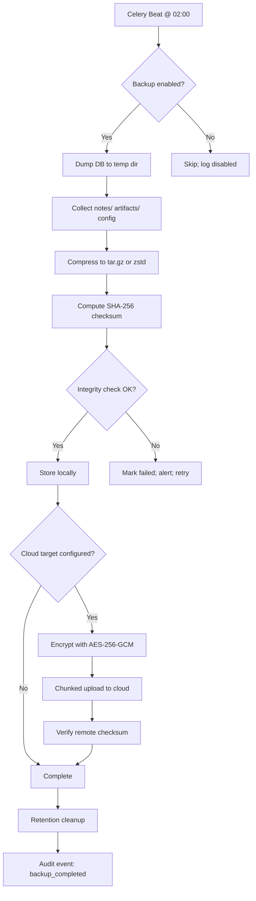
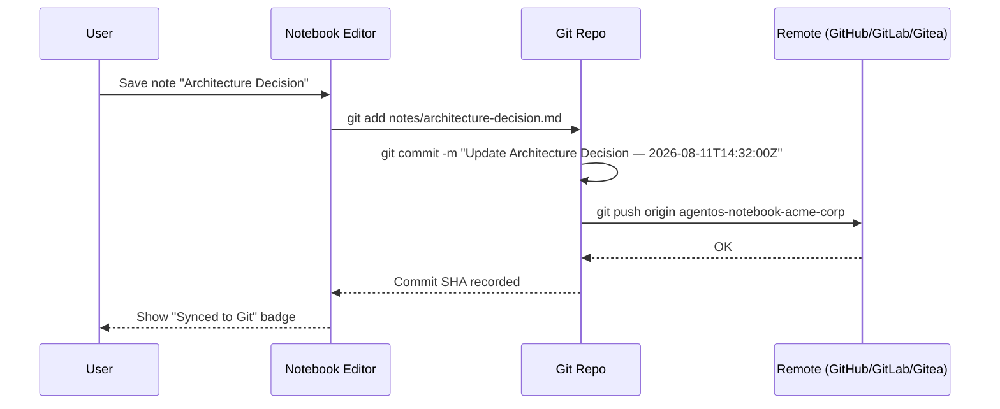
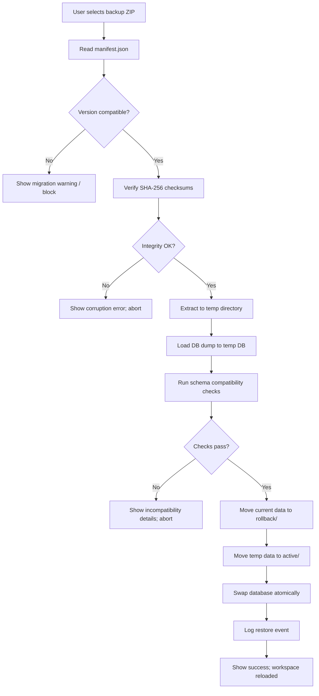
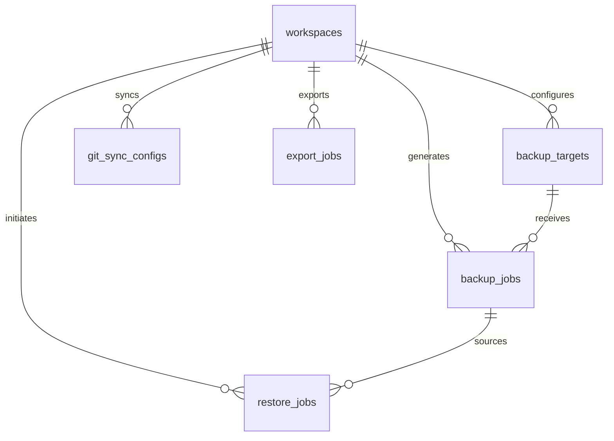

# Agent OS v2 — Goldie Edition / Disaster Recovery

> **Document:** `15-DISASTER_RECOVERY.md`
> **Version:** 2.0.0
> **Status:** Draft
> **Date:** 2026-08-11
> **Classification:** Internal
> **Source of Truth:** True (for v2 Goldie Edition disaster recovery specifications)

---

## Table of Contents

1. [Overview](#1-overview)
2. [Auto-Backup Strategy](#2-auto-backup-strategy)
3. [Cloud Backup Targets](#3-cloud-backup-targets)
4. [Git Sync for Notebook](#4-git-sync-for-notebook)
5. [Encrypted Export](#5-encrypted-export)
6. [One-Click Restore](#6-one-click-restore)
7. [Health Monitoring](#7-health-monitoring)
8. [Offline Resilience](#8-offline-resilience)
9. [Data Model Additions](#9-data-model-additions)
10. [API Endpoints](#10-api-endpoints)
11. [Security & Privacy](#11-security--privacy)
12. [Troubleshooting](#12-troubleshooting)

---

## 1. Overview

Agent OS v2 — Goldie Edition is a **local-first, self-hosted Agent Operating System**. Users store their entire knowledge base — notes, artifacts, chat histories, agent configurations, and workspace data — on their own hardware. This is the core promise: **your data stays with you**.

But that promise carries a corollary: **you are responsible for backups**. A single disk failure, a corrupted database file, or a misplaced configuration can result in total data loss. Disaster Recovery is not an optional add-on — it is a foundational subsystem that must convince users (and developers) that their data is safe.

Agent OS handles that automatically.

**Design principles:**

| ID | Principle |
|---|---|
| `DRP-001` | **Backup by default.** Every workspace is backed up automatically without user action. Opt-out requires explicit configuration. |
| `DRP-002` | **Defense in depth.** Local backups + cloud targets + Git sync + encrypted export = four independent layers. |
| `DRP-003` | **Zero-trust upload.** All data is encrypted with AES-256-GCM before leaving the local machine. |
| `DRP-004` | **Recoverability over convenience.** Backup integrity is verified; failed backups are alerts, not silent omissions. |
| `DRP-005` | **Offline-first.** The app works fully offline; sync is deferred and queued until connectivity returns. |
| `DRP-006` | **Transparency.** Users see exactly when the last backup occurred, what was backed up, and where it lives. |

**Traceability:**

| PRD Requirement | Section |
|---|---|
| `PRD-v2-DR-001` | §2 Auto-Backup Strategy |
| `PRD-v2-DR-002` | §3 Cloud Backup Targets |
| `PRD-v2-DR-003` | §4 Git Sync for Notebook |
| `PRD-v2-DR-004` | §5 Encrypted Export |
| `PRD-v2-DR-005` | §6 One-Click Restore |
| `PRD-v2-DR-006` | §7 Health Monitoring |

---

## 2. Auto-Backup Strategy

### 2.1 Schedule

Backups run on a configurable schedule with sensible defaults:

| Frequency | Default | Options |
|---|---|---|
| Interval | Daily at 02:00 local time | Hourly, daily, weekly, or custom cron expression |
| Trigger | Celery Beat scheduled task | Manual trigger via API or UI at any time |
| First backup | Within 1 hour of workspace creation | Ensures no "data at risk" window for new workspaces |

> **Rationale:** 02:00 is chosen because it is the quietest hour for most users, minimizing disk I/O contention with active work.

### 2.2 Scope

A full workspace backup includes:

| Component | Description |
|---|---|
| SQLite / PostgreSQL dump | Full database dump of all workspace-scoped tables |
| `notes/` | All Notebook markdown pages, folder structure preserved |
| `artifacts/` | All generated and uploaded artifacts (images, documents, media) |
| `config/` | Workspace settings, agent configs, roles, branding, provider keys (encrypted) |
| `audit/` | Audit event subset (last 30 days; full archive via separate archive job) |
| `manifest.json` | Inventory with file list, sizes, timestamps, checksums |

Excluded by default:
- Provider API key plaintext (encrypted vault references are included; raw keys are not).
- Temporary cache files (Redis dump not included; rebuildable from DB).
- Semantic embeddings (rebuildable from notes and memory; excluded to reduce size).

### 2.3 Compression

| Algorithm | Extension | Use Case |
|---|---|---|
| `tar.gz` | `.tar.gz` | Default; maximum compatibility |
| `zstd` | `.tar.zst` | Optional; ~30% smaller, faster decompression (level 3–15 configurable) |

Compression level is configurable per workspace. For workspaces > 10 GB, `zstd` at level 5 is recommended.

### 2.4 Retention Policy

Agent OS implements a grandfather-father-son rotation automatically:

| Tier | Count | Retention |
|---|---|---|
| Daily | 7 | Last 7 daily backups |
| Weekly | 4 | Last 4 weekly backups (Sunday 02:00) |
| Monthly | 12 | Last 12 monthly backups (1st of month at 02:00) |
| **Total** | **23** | **~1 year of recovery points** |

Expired backups are deleted by a nightly cleanup Celery task. Deletion is logged as an audit event.

### 2.5 Backup Integrity

Every backup receives a **SHA-256 checksum** computed over the final archive. The checksum is stored in:

1. `manifest.json` inside the archive.
2. The `backup_jobs` record in the database.
3. The cloud target metadata (if uploaded).

Post-backup verification (optional, enabled by default):
- A random 1 MB slice of the archive is read back and its checksum recomputed.
- If mismatch → backup marked `integrity_failed`; alert fired; retry initiated.

### 2.6 Storage Location

| Location | Path | Required |
|---|---|---|
| Local backup folder | `{AGENT_OS_DATA}/backups/{workspace_slug}/` | Yes (default) |
| External drive | Configurable mount point | No |
| Cloud target | S3, Dropbox, Google Drive, etc. | No (recommended) |

The local backup folder is created automatically on first backup. Users can configure an external drive path via Settings → Backup.

### 2.7 Backup Lifecycle Diagram



---

## 3. Cloud Backup Targets

### 3.1 Supported Targets

Agent OS supports multiple off-site storage providers:

#### S3-Compatible

| Provider | Protocol | Notes |
|---|---|---|
| AWS S3 | S3 API | Standard; supports IAM roles, bucket policies |
| Wasabi | S3 API | Flat-rate pricing; no egress fees |
| Backblaze B2 | S3-compatible API | Native lifecycle rules; 10 GB free tier |
| MinIO | S3 API | Self-hosted; ideal for on-premise backup servers |
| Cloudflare R2 | S3-compatible API | Zero egress fees; good for multi-region |

#### Cloud Sync

| Provider | Protocol | Notes |
|---|---|---|
| Dropbox | OAuth 2.0 + direct API | Folder created at `/AgentOS Backups/{workspace_slug}/` |
| Google Drive | OAuth 2.0 + direct API | Folder created at `AgentOS Backups/{workspace_slug}/` |
| Any rclone target | rclone backend | Via optional rclone integration (WebDAV, SFTP, FTP, etc.) |

### 3.2 Encryption Before Upload

**All data is encrypted before leaving the local machine.**

| Property | Value |
|---|---|
| Algorithm | AES-256-GCM |
| Key derivation | PBKDF2-HMAC-SHA256, 600,000 iterations |
| Key source | User-provided password (min 12 characters) |
| Salt | 16 bytes random, stored in archive header |
| IV / Nonce | 12 bytes random per archive |
| Auth tag | 16 bytes GCM authentication tag |

The encryption password is **not stored** by Agent OS. It is entered once during target configuration and held in memory only for the duration of the upload. The password hash is stored for verification purposes (but cannot decrypt data).

> **UI warning:** "If you lose this password, your cloud backups cannot be recovered. Store it in a password manager."

### 3.3 Chunked Upload

For workspaces > 100 MB, backups are split into chunks:

| Threshold | Chunk Size |
|---|---|
| 100 MB – 1 GB | 50 MB |
| 1 GB – 10 GB | 100 MB |
| > 10 GB | 250 MB |

Chunks are uploaded in parallel (up to 4 concurrent streams). Each chunk is independently checksummed. If a chunk upload fails, only that chunk is retried.

### 3.4 Retry & Exponential Backoff

| Failure Type | Behavior |
|---|---|
| Network timeout | Retry up to 5 times with backoff: 5s, 15s, 45s, 135s, 300s |
| 5xx server error | Retry with same backoff; mark target degraded after 3 failures |
| 403 / auth failure | Immediate alert; pause uploads until credentials refreshed |
| Disk full (local) | Immediate alert; pause backups until space cleared |

### 3.5 Target Configuration

Each target is stored in the `backup_targets` table (see §9.2). Multiple targets per workspace are supported; backups are uploaded to **all configured targets** (fan-out, not round-robin).

---

## 4. Git Sync for Notebook

### 4.1 Overview

While backups capture point-in-time snapshots, Git sync provides **continuous, incremental versioning** of the Notebook knowledge base. Every change is committed, pushed to a remote, and diffable in the UI.

### 4.2 Auto-Commit

| Trigger Mode | Description | Default |
|---|---|---|
| `on_save` | Commit immediately after every note save | **Default** |
| `periodic` | Commit every N minutes (configurable: 1, 5, 15, 30) | — |
| `manual` | Commit only when user clicks "Sync to Git" | — |

When auto-commit triggers:
1. Git repository initialized in `{workspace_data}/notebook/.git/` if absent.
2. All modified `.md` files staged.
3. Commit created with auto-generated message.
4. If remote configured, push to remote branch.

### 4.3 Commit Message Format

```
Update {note_title} — {timestamp}
```

Example:
```
Update Architecture Decision — 2026-08-11T14:32:00Z
```

For bulk commits (multiple files changed):
```
Update 3 notes — 2026-08-11T14:32:00Z
- Architecture Decision
- Meeting Notes: Q3 Planning
- API Design Patterns
```

### 4.4 Remote Push

| Provider | Auth | Branch Naming |
|---|---|---|
| GitHub | Personal access token (PAT) or SSH key | `agentos-notebook-{workspace_slug}` |
| GitLab | Personal access token or SSH key | `agentos-notebook-{workspace_slug}` |
| Gitea (self-hosted) | Token or SSH key | `agentos-notebook-{workspace_slug}` |
| Generic Git | SSH key or HTTPS credentials | Configurable |

Branch per workspace ensures isolation when multiple Agent OS instances push to the same repository.

### 4.5 Diff View in UI

The Notebook UI includes a **History / Diff** panel:

- **Timeline view:** Chronological list of commits with author, timestamp, message.
- **Diff view:** Side-by-side or unified diff of any commit against its parent.
- **File-level diff:** Click a file in a commit to see line-level changes.
- **Restore from commit:** Revert a single note to any prior commit (creates a new commit, does not rewrite history).



### 4.6 Git Sync Configuration

Stored per workspace in `git_sync_configs` (see §9.4).

---

## 5. Encrypted Export

### 5.1 One-Click "Export Everything"

A user can export their entire workspace at any time via:
- Settings → Backup & Restore → Export Everything
- API: `POST /api/v1/backups/export` (see §10)

The export produces a **password-protected ZIP** with the following structure:

```
agentos-export-{workspace_slug}-{timestamp}.zip
├── manifest.json              # Inventory, checksums, metadata
├── db_dump.sql                # Full workspace database dump
├── notes/                     # All Notebook pages as .md
│   ├── folder-a/
│   ├── folder-b/
│   └── …
├── artifacts/                 # All artifacts with original filenames
│   ├── images/
│   ├── documents/
│   └── …
├── config.json                # Workspace settings, agent configs, roles
│   (API keys excluded by default)
├── agent_configs/             # Per-agent configuration JSON
└── integrity_report.json      # SHA-256 per file, overall archive checksum
```

### 5.2 Inclusions & Exclusions

| Item | Included | Default | Override |
|---|---|---|---|
| Database dump | Yes | — | — |
| Notes | Yes | — | — |
| Artifacts | Yes | — | Can filter by type |
| Config (workspace settings) | Yes | — | — |
| Agent configs | Yes | — | — |
| Provider API keys | **Excluded** | Default: **No** | Opt-in checkbox with warning |
| Chat sessions | Yes | — | Can exclude |
| Audit events (last 30d) | Yes | — | Can exclude |
| Semantic embeddings | No | — | Opt-in (increases size significantly) |

### 5.3 Encryption & Verification

| Property | Value |
|---|---|
| Archive format | ZIP (deflate) or 7z (LZMA2) |
| Encryption | AES-256-GCM for file contents inside ZIP |
| Password requirement | Min 12 characters; entropy meter shown |
| Checksum | SHA-256 per file + SHA-256 of entire archive |
| Integrity report | JSON file listing every file, size, checksum, and a signed statement |

**Integrity report example:**

```json
{
  "export_id": "550e8400-e29b-41d4-a716-446655440000",
  "workspace_slug": "acme-corp",
  "created_at": "2026-08-11T14:32:00Z",
  "agent_os_version": "2.0.0",
  "files": [
    { "path": "db_dump.sql", "size": 16777216, "sha256": "a1b2c3…" },
    { "path": "notes/Architecture Decision.md", "size": 4096, "sha256": "d4e5f6…" }
  ],
  "archive_checksum": "sha256:abc123…",
  "signature": "…"
}
```

### 5.4 Export vs. Backup

| Aspect | Auto-Backup | Encrypted Export |
|---|---|---|
| Trigger | Automatic (scheduled) | Manual (user-initiated) |
| Frequency | Hourly / daily / weekly | On demand |
| Scope | Full workspace | Configurable scope |
| Encryption | Yes (for cloud upload) | Yes (password-protected) |
| Portability | Designed for restore into Agent OS | Designed for long-term archival |
| Cloud upload | Automatic to configured targets | User decides where to store file |
| Size | Full | Configurable filters |

---

## 6. One-Click Restore

### 6.1 Restore from Backup ZIP

The restore process is designed to be **safe, atomic, and reversible**.

**Step-by-step:**

1. **Upload / Select** — User selects a backup ZIP (local file picker or from cloud target list).
2. **Version Detection** — Agent OS reads `manifest.json` to detect:
   - Agent OS version that created the backup.
   - Workspace slug and ID.
   - Schema version of the DB dump.
3. **Integrity Validation** — SHA-256 checksums of all files are verified against `manifest.json`.
4. **Temp Restore** — All files are extracted to a temporary directory (`{workspace_data}/.restore_tmp/{uuid}/`).
   - Database dump is loaded into a temporary SQLite database.
   - Schema compatibility checks are run.
5. **Atomic Swap** — If validation passes:
   - Current workspace data is moved to `{workspace_data}/.rollback/{timestamp}/`.
   - Temp data is moved to active locations.
   - Database is swapped (SQLite: file rename; PostgreSQL: transaction + schema switch).
6. **Completion** — Workspace is reloaded; user sees confirmation.



### 6.2 Rollback Window

After a restore, the previous state is retained for **24 hours** in `{workspace_data}/.rollback/{timestamp}/`.

- User can trigger **Rollback** from Settings → Backup & Restore → Rollback to Previous State.
- After 24 hours, the rollback directory is automatically deleted by a cleanup task.
- Rollback is itself a restore operation; it creates a new rollback snapshot of the current state (nesting is limited to depth 1).

### 6.3 Point-in-Time Restore

From the backup history list, users can select **any** retained backup:

| Tier | Available Backups |
|---|---|
| Daily | Last 7 days |
| Weekly | Last 4 Sundays |
| Monthly | Last 12 first-of-month |

Selecting a backup initiates the same atomic restore process.

### 6.4 Granular Restore

Not every restore requires replacing everything. Agent OS supports:

| Granularity | Description |
|---|---|
| **Full Workspace** | Restore everything: DB, notes, artifacts, config |
| **Notebook Only** | Restore only `notes/` and `note_links`; preserve chats, runs, artifacts |
| **Chat History Only** | Restore only chat sessions and messages; preserve notes |
| **Config Only** | Restore only workspace settings and agent configs |
| **Artifacts Only** | Restore only artifact files (useful after accidental deletion) |

Granular restore skips database tables not in scope and merges (not replaces) where appropriate.

---

## 7. Health Monitoring

### 7.1 Dashboard Widget

The Mission Control dashboard includes a persistent **Backup Health** widget:

```
┌─────────────────────────────────┐
│  💾 Backup Health               │
│  Last backup: 2 hours ago ✅    │
│  Next backup: Today @ 02:00     │
│  Local: 7 daily, 4 weekly ✅    │
│  Cloud: AWS S3 ✅ (6 min ago)   │
│  Disk used: 47 GB / 100 GB      │
└─────────────────────────────────┘
```

Widget states:

| State | Icon | Color | Meaning |
|---|---|---|---|
| Healthy | ✅ | Green | Last backup succeeded within expected window |
| Warning | ⚠️ | Yellow | Last backup succeeded but outside window (e.g., delayed by 6h) |
| Failed | ❌ | Red | Last backup failed; user action may be needed |
| Unknown | ❓ | Gray | No backup record found (new workspace or disabled) |

### 7.2 Alert Channels

On backup failure, Agent OS can alert via:

| Channel | Configuration | Priority |
|---|---|---|
| In-app notification | Always enabled | High |
| Email | SMTP settings in workspace config | Medium |
| Push notification | Web Push API (browser) | Medium |
| Webhook | Generic POST to user-defined URL | Low |

Alert content:
```json
{
  "alert_type": "backup_failed",
  "workspace_slug": "acme-corp",
  "backup_job_id": "uuid",
  "failure_reason": "Cloud target authentication failed (403)",
  "timestamp": "2026-08-11T02:00:00Z",
  "retry_count": 3,
  "next_retry": "2026-08-11T02:45:00Z"
}
```

### 7.3 Disk Space Warning

| Threshold | Action |
|---|---|
| 70% full | Info banner: "Backup disk is 70% full. Consider cleaning old backups or expanding storage." |
| 85% full | Warning banner + email: "Backup disk is 85% full. Automatic cleanup will remove expired backups." |
| 95% full | Critical alert + pause new backups: "Backup disk is 95% full. Backups paused. Free space to resume." |

### 7.4 Monthly Automated Integrity Check

On the 1st of every month at 03:00:

1. A random backup from the retention set is selected.
2. The archive is extracted to a temporary directory.
3. All checksums are verified.
4. The database dump is loaded into a temp database and a `PRAGMA integrity_check` (SQLite) or `pg_dump` + restore test (PostgreSQL) is run.
5. Results are logged to `audit_events`.
6. If any check fails, a high-priority alert is fired.

---

## 8. Offline Resilience

### 8.1 Full Offline Operation

Agent OS is designed to work **completely offline** after initial setup:

| Feature | Offline Behavior |
|---|---|
| Notebook | Read, create, edit notes; wiki-links; backlinks; full-text search (SQLite FTS5) |
| Chat | Local models (Ollama) work; cloud models show "offline — using local fallback" |
| Studio | Local generation (Ollama image models) works; cloud generation queued |
| Mission Board | Full CRUD; Kanban drag-and-drop; no latency |
| Workflows | Local execution works; cloud API calls queued |

### 8.2 Sync Queue

When connectivity is lost during an operation that requires the cloud:

1. Operation is serialized and added to the **Sync Queue** (Redis-backed, workspace-scoped).
2. UI shows: "Changes saved locally. Will sync when connection returns."
3. When connectivity returns:
   - Queue is drained in FIFO order.
   - Each item retried with exponential backoff.
   - Success → item removed from queue.
   - Permanent failure (e.g., 403) → item moved to "Failed Syncs" inbox for user review.

```mermaid
flowchart LR
    A[User action requiring cloud] --> B{Online?}
    B -->|Yes| C[Execute immediately]
    B -->|No| D[Add to Sync Queue]
    D --> E[Show "Saved locally" toast]
    E --> F{Connection returns?}
    F -->|Yes| G[Drain queue FIFO]
    G --> H{Success?}
    H -->|Yes| I[Remove from queue]
    H -->|No| J[Retry with backoff]
    J --> K{Max retries?}
    K -->|Yes| L[Move to Failed Syncs inbox]
    K -->|No| F
```

### 8.3 Conflict Resolution

If the same note was edited offline on two devices (or offline and then online), conflicts are detected at sync time:

| Strategy | Behavior |
|---|---|
| **Timestamp wins** | Default: the edit with the later `updated_at` is kept; the other is saved as a conflict copy (`Note Title (Conflict).md`). |
| **Merge** | If both edits touched different sections, a 3-way merge is attempted. |
| **Manual** | User is presented with a diff view and chooses which version to keep. |

Conflict copies appear in a "Conflicts" folder in the Notebook and are flagged in the UI.

---

## 9. Data Model Additions

The Disaster Recovery subsystem adds four new tables to the Agent OS data model. All tables are workspace-scoped and follow existing naming conventions.

### 9.1 `backup_jobs`

Tracks all backup operations (manual and scheduled).

```sql
CREATE TABLE backup_jobs (
    id              UUID PRIMARY KEY DEFAULT gen_random_uuid(),
    workspace_id    UUID NOT NULL REFERENCES workspaces(id) ON DELETE CASCADE,
    triggered_by    UUID REFERENCES users(id) ON DELETE SET NULL,  -- NULL = scheduled
    trigger_type    VARCHAR(50) NOT NULL DEFAULT 'scheduled'
    CHECK (trigger_type IN ('scheduled', 'manual', 'api', 'webhook')),
    scope           VARCHAR(50) NOT NULL DEFAULT 'full'
    CHECK (scope IN ('full', 'notebook_only', 'chats_only', 'config_only', 'artifacts_only')),
    status          VARCHAR(50) NOT NULL DEFAULT 'pending'
    CHECK (status IN ('pending', 'running', 'compressing', 'uploading', 'completed', 'integrity_failed', 'failed', 'cancelled')),
    compression     VARCHAR(50) NOT NULL DEFAULT 'tar.gz'
    CHECK (compression IN ('tar.gz', 'zstd')),
    file_ref        TEXT,                   -- local path to backup archive
    file_size_bytes BIGINT,
    checksum        VARCHAR(64),            -- SHA-256 of archive
    manifest_json   JSONB DEFAULT '{}',     -- file inventory, sizes, per-file checksums
    retention_tier  VARCHAR(50) NOT NULL DEFAULT 'daily'
    CHECK (retention_tier IN ('hourly', 'daily', 'weekly', 'monthly')),
    started_at      TIMESTAMPTZ,
    completed_at    TIMESTAMPTZ,
    duration_ms     INTEGER,
    error_message   TEXT,
    metadata_json   JSONB DEFAULT '{}',
    created_at      TIMESTAMPTZ NOT NULL DEFAULT NOW(),
    updated_at      TIMESTAMPTZ NOT NULL DEFAULT NOW()
);

CREATE INDEX idx_backup_jobs_workspace ON backup_jobs(workspace_id);
CREATE INDEX idx_backup_jobs_status ON backup_jobs(status);
CREATE INDEX idx_backup_jobs_tier ON backup_jobs(retention_tier);
CREATE INDEX idx_backup_jobs_created ON backup_jobs(created_at);
CREATE INDEX idx_backup_jobs_ws_status_created ON backup_jobs(workspace_id, status, created_at DESC);
```

### 9.2 `backup_targets`

Configured off-site backup destinations per workspace.

```sql
CREATE TABLE backup_targets (
    id              UUID PRIMARY KEY DEFAULT gen_random_uuid(),
    workspace_id    UUID NOT NULL REFERENCES workspaces(id) ON DELETE CASCADE,
    name            VARCHAR(255) NOT NULL,
    target_type     VARCHAR(50) NOT NULL
    CHECK (target_type IN ('s3', 'wasabi', 'b2', 'minio', 'dropbox', 'google_drive', 'rclone')),
    endpoint_url    TEXT,                   -- S3 endpoint or API base URL
    bucket_or_path  VARCHAR(500),           -- S3 bucket or folder path
    region          VARCHAR(50),            -- S3 region (optional)
    credentials_ref VARCHAR(500) NOT NULL,  -- vault reference; never raw credential
    encryption_enabled BOOLEAN NOT NULL DEFAULT TRUE,
    encryption_key_hash VARCHAR(64),        -- PBKDF2 hash of password (for verification, not decryption)
    chunk_size_bytes INTEGER DEFAULT 52428800,  -- 50 MB default
    max_retries     INTEGER NOT NULL DEFAULT 5,
    status          VARCHAR(50) NOT NULL DEFAULT 'active'
    CHECK (status IN ('active', 'degraded', 'failed', 'disabled')),
    last_uploaded_at TIMESTAMPTZ,
    last_error      TEXT,
    config_json     JSONB DEFAULT '{}',     -- provider-specific settings
    metadata_json   JSONB DEFAULT '{}',
    created_by      UUID NOT NULL REFERENCES users(id) ON DELETE SET NULL,
    created_at      TIMESTAMPTZ NOT NULL DEFAULT NOW(),
    updated_at      TIMESTAMPTZ NOT NULL DEFAULT NOW(),
    UNIQUE (workspace_id, name)
);

CREATE INDEX idx_backup_targets_workspace ON backup_targets(workspace_id);
CREATE INDEX idx_backup_targets_type ON backup_targets(target_type);
CREATE INDEX idx_backup_targets_status ON backup_targets(status);
CREATE INDEX idx_backup_targets_ws_status ON backup_targets(workspace_id, status);
```

### 9.3 `restore_jobs`

Tracks all restore operations with rollback support.

```sql
CREATE TABLE restore_jobs (
    id              UUID PRIMARY KEY DEFAULT gen_random_uuid(),
    workspace_id    UUID NOT NULL REFERENCES workspaces(id) ON DELETE CASCADE,
    triggered_by    UUID NOT NULL REFERENCES users(id) ON DELETE SET NULL,
    source_type     VARCHAR(50) NOT NULL
    CHECK (source_type IN ('local_backup', 'cloud_backup', 'uploaded_zip', 'git_commit')),
    source_job_id   UUID REFERENCES backup_jobs(id) ON DELETE SET NULL,  -- if restoring from backup_jobs
    source_ref      TEXT NOT NULL,          -- file path, URL, or git commit SHA
    scope           VARCHAR(50) NOT NULL DEFAULT 'full'
    CHECK (scope IN ('full', 'notebook_only', 'chats_only', 'config_only', 'artifacts_only')),
    status          VARCHAR(50) NOT NULL DEFAULT 'pending'
    CHECK (status IN ('pending', 'validating', 'extracting', 'verifying', 'swapping', 'completed', 'failed', 'rolled_back')),
    original_version VARCHAR(50),             -- Agent OS version from manifest
    checksum_verified BOOLEAN DEFAULT FALSE,
    temp_dir_ref    TEXT,                   -- path to temp extraction directory
    rollback_dir_ref TEXT,                  -- path to pre-restore rollback snapshot
    rollback_expires_at TIMESTAMPTZ,        -- auto-delete after 24h
    started_at      TIMESTAMPTZ,
    completed_at    TIMESTAMPTZ,
    duration_ms     INTEGER,
    error_message   TEXT,
    metadata_json   JSONB DEFAULT '{}',
    created_at      TIMESTAMPTZ NOT NULL DEFAULT NOW(),
    updated_at      TIMESTAMPTZ NOT NULL DEFAULT NOW()
);

CREATE INDEX idx_restore_jobs_workspace ON restore_jobs(workspace_id);
CREATE INDEX idx_restore_jobs_status ON restore_jobs(status);
CREATE INDEX idx_restore_jobs_source ON restore_jobs(source_job_id);
CREATE INDEX idx_restore_jobs_created ON restore_jobs(created_at);
CREATE INDEX idx_restore_jobs_ws_status ON restore_jobs(workspace_id, status);
```

### 9.4 `git_sync_configs`

Per-workspace Git synchronization settings for Notebook.

```sql
CREATE TABLE git_sync_configs (
    id              UUID PRIMARY KEY DEFAULT gen_random_uuid(),
    workspace_id    UUID NOT NULL UNIQUE REFERENCES workspaces(id) ON DELETE CASCADE,
    enabled         BOOLEAN NOT NULL DEFAULT FALSE,
    auto_commit_mode VARCHAR(50) NOT NULL DEFAULT 'on_save'
    CHECK (auto_commit_mode IN ('on_save', 'periodic', 'manual')),
    commit_interval_minutes INTEGER CHECK (commit_interval_minutes BETWEEN 1 AND 1440),
    remote_url      TEXT,
    remote_provider VARCHAR(50)
    CHECK (remote_provider IN ('github', 'gitlab', 'gitea', 'generic')),
    branch_name     VARCHAR(255) NOT NULL DEFAULT 'main',
    credentials_ref VARCHAR(500),           -- vault reference for PAT or SSH key
    author_name     VARCHAR(255) NOT NULL DEFAULT 'Agent OS',
    author_email    VARCHAR(255) NOT NULL DEFAULT 'agentos@localhost',
    last_commit_at  TIMESTAMPTZ,
    last_push_at    TIMESTAMPTZ,
    last_commit_sha VARCHAR(64),
    status          VARCHAR(50) NOT NULL DEFAULT 'not_initialized'
    CHECK (status IN ('not_initialized', 'initialized', 'synced', 'ahead', 'behind', 'conflict', 'error')),
    error_message   TEXT,
    config_json     JSONB DEFAULT '{}',
    metadata_json   JSONB DEFAULT '{}',
    created_at      TIMESTAMPTZ NOT NULL DEFAULT NOW(),
    updated_at      TIMESTAMPTZ NOT NULL DEFAULT NOW()
);

CREATE INDEX idx_git_sync_configs_workspace ON git_sync_configs(workspace_id);
CREATE INDEX idx_git_sync_configs_status ON git_sync_configs(status);
```

### 9.5 Entity Relationship (Disaster Recovery)



---

## 10. API Endpoints

All endpoints are prefixed with `/api/v1/` and require Bearer authentication unless noted.

### 10.1 Backups

#### POST `/backups`

Trigger a manual backup.

- **Auth:** Bearer (workspace member+)
- **Request:**
```json
{
  "scope": "full",
  "compression": "zstd",
  "cloud_targets": ["target-uuid-1", "target-uuid-2"],
  "notify_on_complete": true
}
```
- **Response:**
```json
{
  "job_id": "550e8400-e29b-41d4-a716-446655440000",
  "status": "pending",
  "message": "Backup job queued. Use GET /backups/{id} to track progress.",
  "estimated_duration_seconds": 120
}
```

#### GET `/backups`

List backups with metadata.

- **Auth:** Bearer
- **Query:** `?limit=20&cursor=&retention_tier=daily&sort=-created_at`
- **Response:**
```json
{
  "data": [
    {
      "id": "550e8400-e29b-41d4-a716-446655440000",
      "workspace_id": "uuid",
      "trigger_type": "scheduled",
      "scope": "full",
      "status": "completed",
      "compression": "zstd",
      "file_size_bytes": 2147483648,
      "checksum": "sha256:abc123…",
      "retention_tier": "daily",
      "started_at": "2026-08-11T02:00:00Z",
      "completed_at": "2026-08-11T02:03:45Z",
      "duration_ms": 225000,
      "cloud_uploads": [
        { "target_id": "uuid", "status": "completed", "uploaded_at": "2026-08-11T02:04:12Z" }
      ]
    }
  ],
  "pagination": {…}
}
```

#### GET `/backups/{id}`

Single backup job details.

- **Auth:** Bearer
- **Response:** Full backup job object with manifest preview.

#### DELETE `/backups/{id}`

Delete a backup (local + cloud).

- **Auth:** Bearer (owner/admin)
- **Response:** `204 No Content`
- **Note:** Deletion is logged as an audit event. Retention-policy auto-deletions use an internal worker, not this endpoint.

---

### 10.2 Restore

#### POST `/backups/{id}/restore`

Restore from a specific backup job.

- **Auth:** Bearer (owner/admin)
- **Request:**
```json
{
  "scope": "full",
  "verify_checksums": true,
  "dry_run": false
}
```
- **Response:**
```json
{
  "restore_job_id": "660e8400-e29b-41d4-a716-446655440001",
  "status": "pending",
  "message": "Restore job queued. Current state will be preserved in rollback snapshot for 24 hours.",
  "rollback_expires_at": "2026-08-12T14:32:00Z"
}
```

#### POST `/restore/upload`

Restore from a user-uploaded ZIP.

- **Auth:** Bearer (owner/admin)
- **Content-Type:** `multipart/form-data`
- **Request:** `file: backup.zip`, `password: optional decryption password`
- **Response:** Same as `/backups/{id}/restore`.

#### POST `/restore/{id}/rollback`

Rollback a completed restore to the pre-restore state.

- **Auth:** Bearer (owner/admin)
- **Response:** `200 OK` with new restore job ID.
- **Note:** Only available if `rollback_expires_at` has not passed.

#### GET `/restore/{id}`

Get restore job status and progress.

- **Auth:** Bearer
- **Response:**
```json
{
  "id": "660e8400-e29b-41d4-a716-446655440001",
  "status": "swapping",
  "progress_pct": 85,
  "scope": "full",
  "original_version": "2.0.0",
  "checksum_verified": true,
  "rollback_expires_at": "2026-08-12T14:32:00Z",
  "started_at": "2026-08-11T14:00:00Z",
  "estimated_completion": "2026-08-11T14:05:00Z"
}
```

---

### 10.3 Backup Targets

#### POST `/backups/targets`

Configure a cloud backup target.

- **Auth:** Bearer (owner/admin)
- **Request:**
```json
{
  "name": "AWS S3 Primary",
  "target_type": "s3",
  "endpoint_url": "https://s3.us-east-1.amazonaws.com",
  "bucket_or_path": "agentos-backups",
  "region": "us-east-1",
  "credentials_ref": "vault://aws/s3-backup-key",
  "encryption_enabled": true,
  "encryption_password": "user-provided-password",
  "chunk_size_bytes": 52428800,
  "max_retries": 5
}
```
- **Response:** `201 Created` with target object.

#### GET `/backups/targets`

List configured targets.

- **Auth:** Bearer
- **Response:** Array of target objects (encryption key hash masked).

#### PATCH `/backups/targets/{id}`

Update target configuration.

- **Auth:** Bearer (owner/admin)
- **Request:** Partial target fields.
- **Response:** Updated target object.

#### DELETE `/backups/targets/{id}`

Remove a target. Existing backups on that target are **not** deleted.

- **Auth:** Bearer (owner/admin)
- **Response:** `204 No Content`

#### POST `/backups/targets/{id}/test`

Test connectivity and credentials.

- **Auth:** Bearer (owner/admin)
- **Response:** `{ "success": true, "latency_ms": 120, "bucket_accessible": true }`

---

### 10.4 Git Sync

#### GET `/git-sync/config`

Get Git sync configuration for the workspace.

- **Auth:** Bearer
- **Response:** Git sync config object.

#### PUT `/git-sync/config`

Configure or update Git sync.

- **Auth:** Bearer (owner/admin)
- **Request:**
```json
{
  "enabled": true,
  "auto_commit_mode": "periodic",
  "commit_interval_minutes": 5,
  "remote_url": "https://github.com/acme/agentos-notebooks.git",
  "remote_provider": "github",
  "branch_name": "agentos-notebook-acme-corp",
  "credentials_ref": "vault://github/pat-notebook-sync",
  "author_name": "Agent OS",
  "author_email": "agentos@acme.com"
}
```

#### POST `/git-sync/commit`

Trigger a manual commit and push.

- **Auth:** Bearer
- **Request:** `{ "message": "Manual sync before migration" }`
- **Response:** `{ "commit_sha": "abc123…", "pushed": true }`

#### GET `/git-sync/history`

Get commit history for the workspace branch.

- **Auth:** Bearer
- **Response:** Array of commits with diff summaries.

---

### 10.5 Export

#### POST `/backups/export`

Trigger a one-click encrypted export.

- **Auth:** Bearer (owner/admin)
- **Request:**
```json
{
  "export_type": "workspace",
  "format": "zip",
  "scope_json": {
    "include_api_keys": false,
    "include_chats": true,
    "include_artifacts": true,
    "date_from": "2026-01-01",
    "date_to": "2026-08-11"
  },
  "encrypted": true,
  "password": "user-provided-password"
}
```
- **Response:** Export job queued (same structure as `export_jobs`).

#### GET `/backups/export/{id}/download`

Download the exported file.

- **Auth:** Bearer
- **Response:** `302` redirect to presigned URL or `200` with `application/octet-stream`.

---

### 10.6 Health

#### GET `/health/backup`

Backup system health endpoint.

- **Auth:** Bearer (any role)
- **Response:**
```json
{
  "status": "healthy",
  "last_backup": {
    "job_id": "550e8400-e29b-41d4-a716-446655440000",
    "completed_at": "2026-08-11T02:03:45Z",
    "status": "completed",
    "age_hours": 12
  },
  "next_backup": "2026-08-12T02:00:00Z",
  "retention": {
    "daily_count": 7,
    "weekly_count": 4,
    "monthly_count": 3
  },
  "targets": [
    {
      "id": "uuid",
      "name": "AWS S3 Primary",
      "status": "active",
      "last_uploaded_at": "2026-08-11T02:04:12Z"
    }
  ],
  "disk_usage": {
    "used_bytes": 50737418240,
    "total_bytes": 107374182400,
    "used_pct": 47.3
  },
  "git_sync": {
    "enabled": true,
    "status": "synced",
    "last_commit_at": "2026-08-11T14:30:00Z",
    "last_commit_sha": "abc123…"
  },
  "monthly_integrity_check": {
    "last_run": "2026-08-01T03:15:00Z",
    "status": "passed",
    "verified_backup_id": "uuid"
  }
}
```

---

## 11. Security & Privacy

### 11.1 Encryption at Rest and in Transit

| Layer | Mechanism |
|---|---|
| Local backups | File-system permissions + optional full-disk encryption (user's responsibility) |
| Cloud upload | AES-256-GCM with user-derived key; TLS 1.3 for transport |
| Encrypted export | AES-256-GCM inside password-protected ZIP |
| Git sync | HTTPS or SSH with credential vault references |

### 11.2 Credential Handling

- No raw cloud credentials are stored in the database. Only **vault references** (`vault://…`) are stored.
- The encryption password for cloud backups is **never stored**; only a PBKDF2 hash is kept for verification.
- Export passwords exist only in the user's session during generation.

### 11.3 Audit Events

Every backup, restore, export, and target configuration change emits an audit event:

| Event Type | Description |
|---|---|
| `backup_started` | Backup job initiated |
| `backup_completed` | Backup finished successfully |
| `backup_failed` | Backup failed with reason |
| `backup_deleted` | Backup manually or automatically deleted |
| `restore_started` | Restore job initiated |
| `restore_completed` | Restore finished successfully |
| `restore_rolled_back` | Rollback to pre-restore state |
| `export_started` | Export job initiated |
| `export_downloaded` | Export file downloaded |
| `target_created` | Cloud target configured |
| `target_tested` | Target connectivity tested |
| `target_deleted` | Cloud target removed |
| `git_sync_commit` | Git commit pushed |
| `integrity_check_completed` | Monthly integrity check finished |

### 11.4 Workspace Isolation

All backup, restore, export, and Git sync data is strictly workspace-scoped. A user cannot:
- List or restore backups from another workspace.
- Configure cloud targets for a workspace they do not belong to.
- Access Git sync credentials of another workspace.

---

## 12. Troubleshooting

| Issue | Likely Cause | Resolution |
|---|---|---|
| "Backup failed: disk full" | Backup directory partition is full | Expand storage or change backup path in Settings |
| "Cloud upload failed: 403" | Credentials expired or revoked | Reconfigure target with refreshed credentials; test connectivity |
| "Integrity check failed" | Archive corrupted during compression or disk write | Retry backup; if persistent, check disk health (SMART) |
| "Restore failed: version mismatch" | Backup from newer Agent OS version | Upgrade current instance to matching version first |
| "Git sync: conflict detected" | Same note edited in two places | Use Notebook conflict resolution UI; merge or select version |
| "Export too large to process" | Workspace > 50 GB with many artifacts | Use granular export (notes only); or run backup to external drive |
| "Rollback unavailable" | 24-hour window expired | Restore from the backup that was created before the original restore |
| "Offline changes not syncing" | Sync queue backlogged or target unreachable | Check connectivity; review Failed Syncs inbox; retry manually |
| "Monthly integrity check failed" | Silent bit-rot or storage degradation | Re-run backup immediately; investigate storage health |

---

## Appendix A: Requirement Traceability

| This Document Section | PRD Requirement | Acceptance Criteria |
|---|---|---|
| §2 Auto-Backup Strategy | `PRD-v2-DR-001` | Daily at 02:00; full workspace; tar.gz/zstd; 7d+4w+12m retention; SHA-256 checksum |
| §3 Cloud Backup Targets | `PRD-v2-DR-002` | S3-compatible, Dropbox, Drive; AES-256-GCM; chunked >100 MB; retry backoff |
| §4 Git Sync for Notebook | `PRD-v2-DR-003` | Auto-commit on save; auto messages; remote push; branch per workspace; diff UI |
| §5 Encrypted Export | `PRD-v2-DR-004` | One-click export; password ZIP; include all; exclude API keys; checksum |
| §6 One-Click Restore | `PRD-v2-DR-005` | Version detect; validate; temp restore; atomic swap; 24h rollback; granular |
| §7 Health Monitoring | `PRD-v2-DR-006` | Dashboard widget; failure alerts; disk warning; monthly integrity check |

## Appendix B: Glossary

| Term | Definition |
|---|---|
| **Backup Job** | An asynchronous task that creates a compressed, checksummed snapshot of workspace data |
| **Backup Target** | A configured off-site storage destination (S3, Dropbox, etc.) |
| **Restore Job** | An asynchronous task that validates and applies a backup snapshot to a workspace |
| **Git Sync Config** | Per-workspace Git repository settings for automatic Notebook versioning |
| **Rollback** | The ability to revert a restore operation to the pre-restore state |
| **Retention Tier** | The classification of a backup as hourly, daily, weekly, or monthly |
| **Integrity Check** | Verification that a backup archive matches its recorded SHA-256 checksum |
| **Sync Queue** | A deferred-work buffer for operations that require cloud connectivity |

---

*End of Disaster Recovery Document — Agent OS v2 Goldie Edition*
