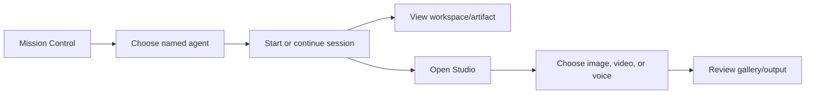
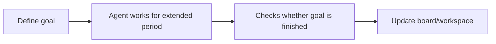

# VIDEO-002 — UI/UX Evidence Audit

| Field | Value |
|---|---|
| Status | Draft |
| Date | 2026-07-16 |

See [VIDEO-001](VIDEO-001-video-inventory-and-methodology.md) for labels and limitations, and [the evidence index](video-evidence-index.csv) for granular citations.

## Executive finding

**OBSERVED:** The clearest product concept is a persistent dark control shell that puts multiple named agents, goals, project work, media artifacts, and operational views behind one left navigation. **STATED:** the narration frames it as an antidote to scattered tools and context loss [Video: How to Build Your Own Agent Operating System.mp4, 00:00:03–00:00:25]. **NOT CONFIRMED:** the recordings do not prove durable persistence, real provider routing, secure tool execution, accurate cost/profit data, or production readiness.

## Per-video findings

### A — Claude + Hermes Agent_ NEW Agent OS is INSANE!

- **OBSERVED:** Mission Control uses top KPI cards and agent/status cards in a dense, purple-accented dark shell [Video: Claude + Hermes Agent_ NEW Agent OS is INSANE!.mp4, 00:01:00].
- **OBSERVED:** Goals has summary metrics, a progress percentage, and a board/list region [Video: Claude + Hermes Agent_ NEW Agent OS is INSANE!.mp4, 00:02:00].
- **OBSERVED:** Hermes and Claude have separate agent pages inside the same shell [Video: Claude + Hermes Agent_ NEW Agent OS is INSANE!.mp4, 00:08:00; 00:20:00].
- **OBSERVED:** The recording juxtaposes Agent OS with editor/code, community, documentation, and MCP setup pages [Video: Claude + Hermes Agent_ NEW Agent OS is INSANE!.mp4, 00:04:00–00:07:00; 00:34:00].
- **NOT CONFIRMED:** local versus VPS deployment, MCP connectivity, the correctness of generated responses, and any backend behind the cards.

### B — Hermes Agent Desktop vs Agent OS

- **OBSERVED:** Mission Control, Hermes, Claude, OpenClaw, workspace/artifact grids, image/video galleries, and a Kanban-style view appear inside one shell [Video: Hermes Agent Desktop vs Agent OS- Which Wins..mp4, 00:00:22–00:08:56].
- **STATED:** the comparison distinguishes a single-agent desktop application from an Agent OS intended for multiple profiles/teams and a shared workspace [Video: Hermes Agent Desktop vs Agent OS- Which Wins..mp4, 00:00:40–00:00:52; 00:07:12–00:08:56].
- **STATED:** Studio is described as switching among image, video, and voice [Video: Hermes Agent Desktop vs Agent OS- Which Wins..mp4, 00:04:09–00:05:31].
- **OBSERVED:** external Hermes Desktop screens are visually bright and sparse compared with the dark Agent OS shell [Video: Hermes Agent Desktop vs Agent OS- Which Wins..mp4, 00:01:00–00:04:00].
- **NOT CONFIRMED:** the voice/image tests, model plumbing, profile collaboration, and downloadable workspace behavior are reliable or integrated.

### C — How to Build Your Own Agent Operating System

- **STATED:** the seven-layer concept is foundation, memory, brain, agents, command, tools/action, and feedback/loop [Video: How to Build Your Own Agent Operating System.mp4, 00:27:52–00:30:13].
- **OBSERVED:** Mission Control and agent pages recur, alongside Obsidian-like memory, workspaces, Studio, goals, SEO/content material, course/community pages, and setup/code [Video: How to Build Your Own Agent Operating System.mp4, 00:01:23–00:03:00; 00:18:25–00:18:46; 00:22:12–00:24:14].
- **STATED:** outputs are intended to be written back to structured memory and artifacts auto-saved/previewable [Video: How to Build Your Own Agent Operating System.mp4, 00:15:25–00:15:29; 00:24:58–00:25:07].
- **STATED:** agent autonomy and long-horizon work are product aspirations [Video: How to Build Your Own Agent Operating System.mp4, 00:17:18; 00:26:09].
- **NOT CONFIRMED:** “perfect” or persistent memory, autonomous 24/7 operation, artifact completeness, and cross-agent orchestration.

### D — How to Build Your Own Agent OS (FREE)

- **STATED:** Mission Control is positioned as a clean home base [Video: How to Build Your Own Agent OS (FREE) - external reference.mp4, 00:01:07–00:01:30].
- **OBSERVED:** Hermes, image/video artifact galleries, skills, and Kanban/project views appear in the dark shell [Video: How to Build Your Own Agent OS (FREE) - external reference.mp4, 00:03:54–00:05:07].
- **STATED:** an email inbox is connected through MCP, voice/talk is added, Studio covers images/video/voice notes, and agents can be switched [Video: How to Build Your Own Agent OS (FREE) - external reference.mp4, 00:02:46–00:05:07].
- **STATED:** Goal Mode is presented as working for hours and checking completion [Video: How to Build Your Own Agent OS (FREE) - external reference.mp4, 00:05:56–00:06:31].
- **NOT CONFIRMED:** the email connection, real machine actions, trained voice, media assembly, saved skills, or completion verification.

## Screen and module inventory

| Screen/module | Visible purpose/components | Entry/action evidence | Classification |
|---|---|---|---|
| Mission Control | KPI/status cards, agent cards, activity overview | Left navigation; recurring home view | OBSERVED; data reality NOT CONFIRMED |
| Agent pages | Named Hermes, Claude, OpenClaw conversations and controls | Select agent in left rail | OBSERVED |
| Goals / Goal Mode | goal summary, progress, task/board regions | Goals item and narrated long-run mode | OBSERVED + STATED; execution NOT CONFIRMED |
| Workspace / artifacts | cards, preview grids, prior output | workspace tabs and gallery views | OBSERVED; persistence NOT CONFIRMED |
| Studio | image/video/voice categories and galleries | category tabs, generation-oriented controls | OBSERVED + STATED; provider calls NOT CONFIRMED |
| Kanban/tasks | columns/cards and status movement concept | task/board navigation | OBSERVED; durable transitions NOT CONFIRMED |
| Skills | list of saved abilities | skills navigation | OBSERVED + STATED; executable contracts NOT CONFIRMED |
| Memory/knowledge | external Obsidian-like notes and narrated shared context | separate memory layer rather than a consistently shown native module | STATED/OBSERVED; synchronization NOT CONFIRMED |
| SEO/content pipeline | content-oriented page/pipeline references | specialist module in left navigation | OBSERVED; analytics/automation NOT CONFIRMED |
| Settings/integration setup | editor, documentation, MCP configuration pages | outside or adjacent to product shell | OBSERVED; integrated admin UX NOT CONFIRMED |
| Business/profit pages | promotional/community “AI Profit Boardroom” pages | external web context | OBSERVED external content; authoritative metrics NOT CONFIRMED |

No responsive/mobile layout, notification center, robust search/command palette, approval inbox, permissions administration, trace viewer, or accessible error recovery was clearly demonstrated.

## Evidence-supported workflows

The navigation and gallery transitions are **OBSERVED/STATED**; session persistence, generation calls, and storage are **NOT CONFIRMED**.

This second flow is principally **STATED** [Video: How to Build Your Own Agent OS (FREE) - external reference.mp4, 00:05:56–00:06:31]; orchestration, retries, approval, and durable state are **NOT CONFIRMED**.

## Visual design system

- **OBSERVED:** near-black/navy surfaces, purple/magenta/blue gradients, colored agent dots, medium-radius cards, thin borders, and compact side navigation.
- **OBSERVED:** large page titles plus small muted metadata establish hierarchy, but dense small text and low-contrast secondary labels pose accessibility risk.
- **OBSERVED:** card grids suit agents/artifacts; the same card-heavy language becomes repetitive and weakens prioritization on Mission Control.
- **OBSERVED:** galleries communicate media well; task and goal views need clearer state affordances and stronger evidence of progress/error conditions.
- **NOT CONFIRMED:** keyboard navigation, focus visibility, screen-reader semantics, reduced motion, responsive breakpoints, loading behavior, and error states.
- **PROPOSED:** retain the unified shell and visual agent identity, adapt density through role-based views, and avoid decorative glow where it competes with status or accessibility.

## UX assessment

| Dimension | Assessment |
|---|---|
| Navigation | Strong persistent orientation, but a long mixed-purpose rail risks module sprawl. |
| Discoverability | Named modules are discoverable; relationships among goals, tasks, sessions, and artifacts are unclear. |
| Continuity | The workspace/artifact idea supports continuity; write-back and provenance are not proved. |
| Feedback | Status cards exist visually, but run states, retries, errors, and approvals are underdeveloped. |
| Trust | Promotional certainty exceeds available evidence; execution receipts and source provenance are needed. |
| User levels | The shell favors advanced users; novice guided flows and administrator control surfaces are absent. |
| Accessibility | Contrast, text size, focus, error semantics, and responsive behavior require formal validation. |

## Functional-reality matrix

| Visible feature | Visual evidence | Narration claim | Backend/persistence verified? | Mock/prototype risk | Verification needed |
|---|---|---|---|---|---|
| Mission Control KPIs | Repeated cards | Unified oversight | NOT CONFIRMED | High | data contracts, live refresh, failure states |
| Named agent switching | Separate pages | multiple profiles/teams | NOT CONFIRMED | Medium | provider adapter and session isolation tests |
| Goals | progress/board UI | hours-long autonomous work | NOT CONFIRMED | High | durable scheduler, checkpoints, cancellation, evaluation |
| Studio | media tabs/galleries | image/video/voice generation | NOT CONFIRMED | High | provider calls, job state, storage, safety/provenance |
| Memory | notes plus references | persistent/shared context | NOT CONFIRMED | High | retrieval, ACLs, retention, deletion, provenance |
| Workspace/artifacts | preview cards | auto-save and find forever | NOT CONFIRMED | High | object store, indexing, versioning, tenancy |
| MCP/tools | setup/docs shown | email/machine actions | NOT CONFIRMED | High | auth, scopes, sandbox, audit, revocation |
| Skills | list UI | abilities saved/reused | NOT CONFIRMED | High | schema, versioning, permissions, tests |
| Kanban/tasks | columns/cards | work tracking | NOT CONFIRMED | Medium | transactional state and concurrency |
| Profit/business views | external promotional pages | business outcomes | NOT CONFIRMED | Very high | authoritative ERP/accounting/CRM lineage |
