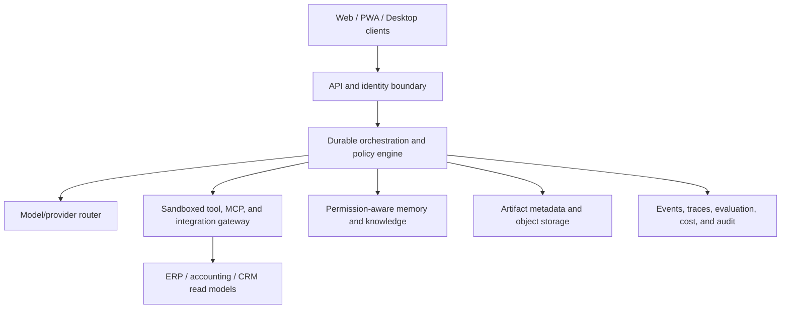

# VIDEO-004 — Architecture and Documentation Impact

| Field | Value |
|---|---|
| Status | Draft |
| Date | 2026-07-16 |

This document proposes future document work only. No approved document was edited.

## Intended architecture impact

The videos inspire the UI-facing modules; the API boundary, durable orchestrator, policy engine, governed data planes, and observability are **PROPOSED** production requirements.

## Document creation/revision map

| Future document | Evidence-driven question | Required content / precise change proposal | Priority |
|---|---|---|---|
| Product vision and scope | Is Agent OS a chat shell or governed operations platform? | Define provider-agnostic control-plane thesis and explicit non-goals. | P0 |
| PRD | Which user jobs form MVP? | Specify project → session → task/run → approval → artifact journeys and acceptance criteria. | P0 |
| Personas/journeys | Novice, operator, admin, auditor differ | Add role-separated journeys, autonomy tolerance, and failure recovery. | P1 |
| Information architecture | Long mixed sidebar risks sprawl | Define workspace-scoped nav, cross-cutting search, admin boundary, and route ownership. | P1 |
| Design system | Dark shell is visually coherent but inaccessible risks remain | Add semantic tokens, density modes, focus/error/loading patterns, charts, WCAG targets. | P1 |
| System architecture | UI does not prove orchestration | Define control/data planes, queues, state machines, tenancy, deployment topologies. | P0 |
| Agent/model contracts | Named agents imply interchangeable execution | Version manifests, capabilities, routing, fallback, context, budgets, evaluation. | P0 |
| Tool/MCP/skill contracts | Connectivity is conflated with permission | Scopes, auth, sandbox, side-effect classification, approval, revocation, conformance tests. | P0 |
| Memory architecture | “Perfect memory” is unsafe/undefined | Retrieval, provenance, ACL inheritance, retention, deletion, correction, injection defenses. | P0 |
| Artifact/media specification | Galleries imply durable assets | Job lifecycle, object storage, lineage, derivatives, safety, licenses, retention. | P1 |
| Security/threat model | No evidence of production controls | RBAC/ABAC, secrets, egress, sandbox escape, prompt injection, supply chain, incident response. | P0 |
| Observability/cost architecture | Cards lack evidentiary detail | Event schema, trace correlation, token/cost attribution, SLOs, budgets, receipts. | P0 |
| Business/profit architecture | Promotional content is not accounting evidence | Authoritative sources, read models, reconciliation, freshness, AI narrative separation. | P1 |
| Deployment/runbook | Local/VPS references are informal | Local-first single node, backups, migration, HA, DR, upgrades, regional/privacy controls. | P1 |
| Validation strategy | Functionality is NOT CONFIRMED | Contract, integration, policy, accessibility, recovery, load, evaluation, and security tests. | P0 |

## Principal risks and mitigations

- **Architecture:** direct UI-to-provider coupling. Use capability adapters and a policy router.
- **Security:** broad MCP/tool credentials. Use short-lived scoped credentials, sandboxing, egress policy, and approval gates.
- **Data governance:** memory leakage across clients/projects. Enforce ACL-aware retrieval and provenance at write/read time.
- **Operations:** long-running goals lose state or duplicate effects. Use durable state machines, idempotency keys, checkpoints, and compensation.
- **Finance:** generated revenue/profit figures appear authoritative. Reconcile source-system facts and label narrative/estimates.
- **UX:** one sidebar becomes an undifferentiated control room. Apply role/workspace scoping and progressive disclosure.

## Recommended roadmap

1. **P0:** contracts, identity/tenancy, durable run state, tool policy, audit/events, artifact/memory foundations.
2. **P1:** coherent web MVP for projects, sessions, tasks/goals, approvals, artifacts, routing, budgets, and admin controls.
3. **P2:** media Studio, schedules, multi-agent coordination, business read models, desktop/PWA, SDK/marketplace.
4. **P3:** bounded high-autonomy modes and experimental optimization only after evaluation evidence.
